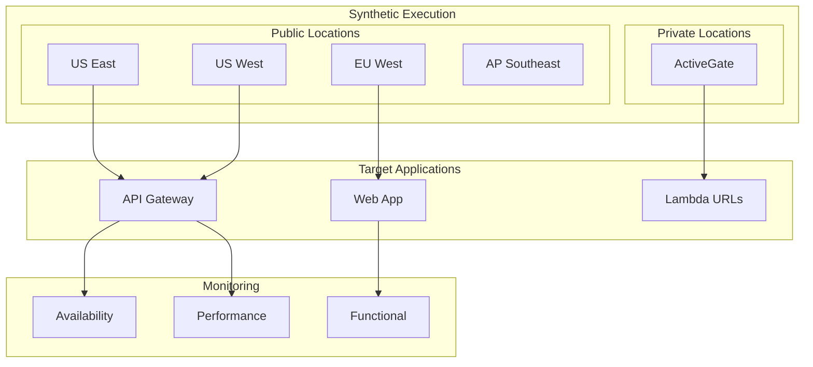

# 🧪 Dynatrace Synthetic Monitoring

## 📋 Overview

Synthetic monitoring provides proactive availability and performance testing for your serverless APIs and applications.

## 🏗️ Synthetic Architecture



## 📁 Monitor Types

| Type | Use Case | Configuration |
|------|----------|---------------|
| HTTP Monitor | API health checks | `monitors/http-monitors.json` |
| Browser Monitor | Web app testing | `monitors/browser-monitors.json` |
| API Script | Multi-step API tests | `scripts/api-tests/` |

## 🔧 Monitor Configuration

### HTTP Monitors

```json
{
  "name": "API Health Check",
  "type": "HTTP",
  "frequencyMin": 5,
  "locations": ["GEOLOCATION-XXX"],
  "script": {
    "requests": [
      {
        "url": "https://api.example.com/health",
        "method": "GET",
        "validation": {
          "statusCode": 200,
          "responseTime": 5000
        }
      }
    ]
  }
}
```

### Browser Monitors

For web application testing with full page rendering.

### API Scripts

Multi-step API testing with assertions and data extraction.

## 🌍 Execution Locations

### Public Locations

| Location ID | Region |
|-------------|--------|
| GEOLOCATION-XXX | N. Virginia, US |
| GEOLOCATION-YYY | Oregon, US |
| GEOLOCATION-ZZZ | Ireland, EU |

### Private Locations

Deploy ActiveGate in your VPC for internal testing.

## 📊 Metrics

| Metric | Description |
|--------|-------------|
| Availability | Success rate |
| Response Time | Total execution time |
| DNS Time | DNS resolution |
| Connect Time | TCP connection |
| SSL Time | TLS handshake |
| TTFB | Time to first byte |

## 🚀 Deployment

```bash
# Create HTTP monitor
curl -X POST "${DT_TENANT_URL}/api/v1/synthetic/monitors" \
  -H "Authorization: Api-Token ${DT_API_TOKEN}" \
  -H "Content-Type: application/json" \
  -d @monitors/http-monitors.json
```

## 📝 Best Practices

1. **Start simple** with basic availability checks
2. **Use multiple locations** for geographic coverage
3. **Set realistic thresholds** based on SLOs
4. **Test from inside VPC** for internal services
5. **Avoid testing during deployments** (maintenance windows)

