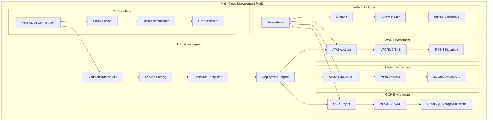
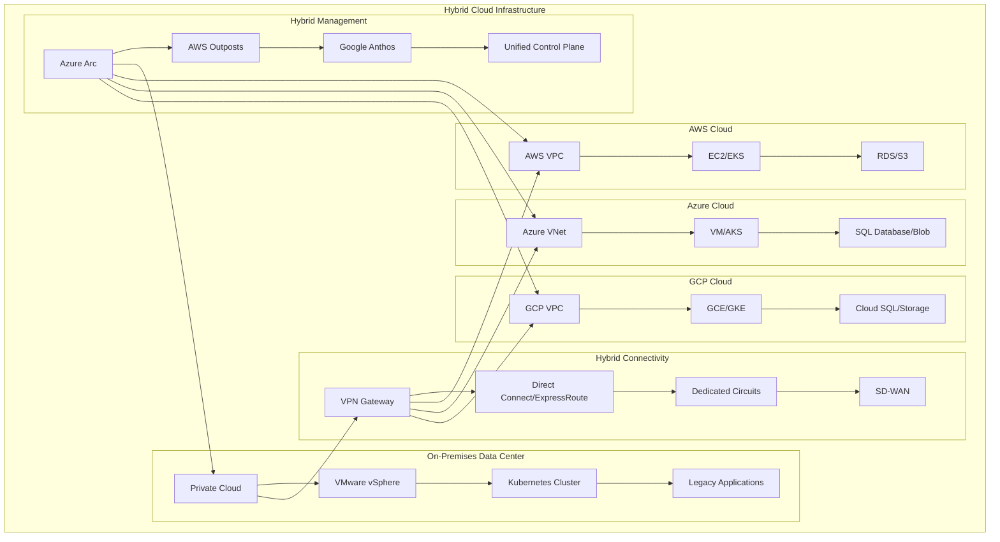
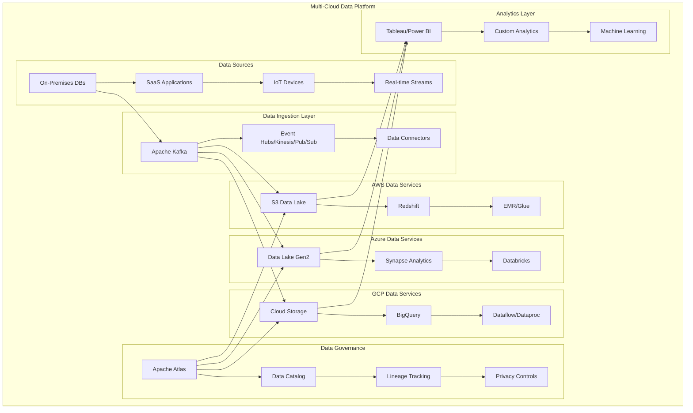
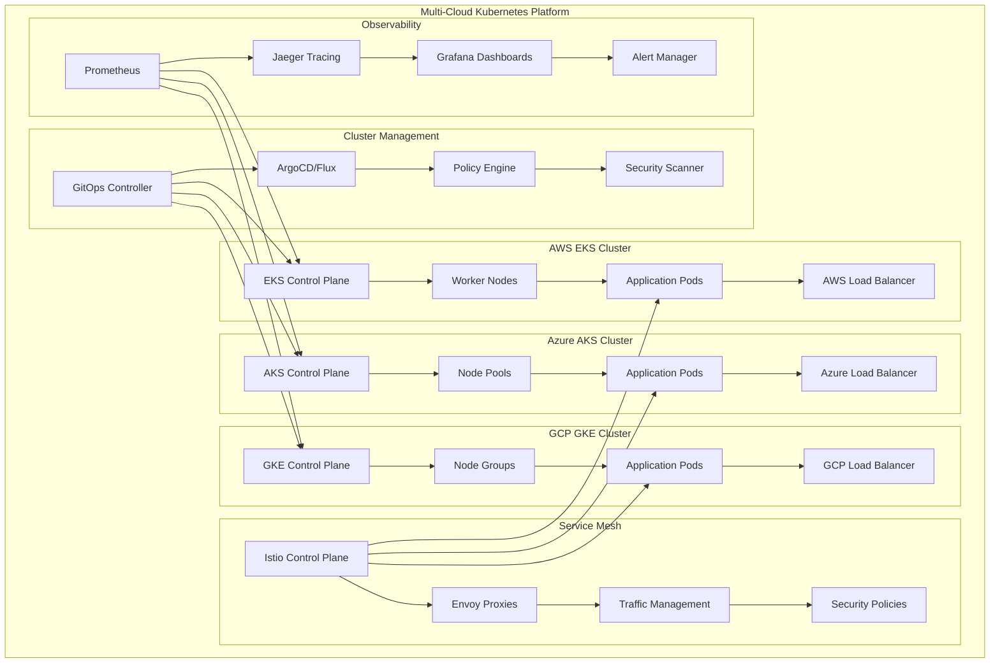
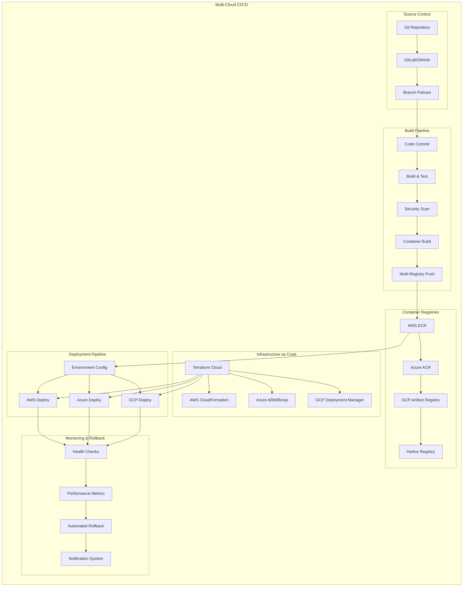
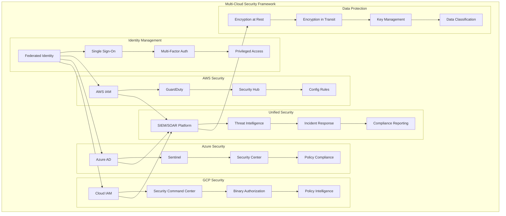
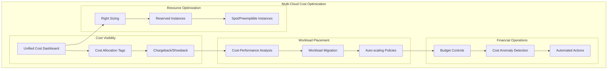

# 🌍 Multi-Cloud & Hybrid Cloud Architecture Guide

## Overview

This comprehensive guide covers multi-cloud and hybrid cloud strategies, patterns, and implementations. It provides practical approaches to building resilient, vendor-agnostic infrastructure that spans multiple cloud providers and on-premises environments.

## 🎯 **Multi-Cloud Strategy Benefits**

- **Vendor Independence**: Avoid vendor lock-in and negotiate better pricing
- **Risk Mitigation**: Distribute workloads across multiple providers
- **Compliance**: Meet regulatory requirements across different regions
- **Best-of-Breed**: Leverage unique services from each cloud provider
- **Disaster Recovery**: Enhanced business continuity across providers
- **Cost Optimization**: Choose optimal services for each workload

## 📋 Multi-Cloud Architecture Patterns

### 1. **Multi-Cloud Management Platform**



### 2. **Hybrid Cloud Architecture**



### 3. **Multi-Cloud Data Architecture**



### 4. **Multi-Cloud Kubernetes Architecture**



### 5. **Multi-Cloud CI/CD Pipeline**



### 6. **Multi-Cloud Security Architecture**



## 🛠️ **Implementation Strategies**

### **1. Cloud Abstraction Layer**

```python
# cloud_abstraction.py
from abc import ABC, abstractmethod
from typing import Dict, Any, List

class CloudProvider(ABC):
    """Abstract base class for cloud provider implementations"""
    
    @abstractmethod
    def create_vm(self, config: Dict[str, Any]) -> str:
        """Create a virtual machine instance"""
        pass
    
    @abstractmethod
    def create_database(self, config: Dict[str, Any]) -> str:
        """Create a managed database instance"""
        pass
    
    @abstractmethod
    def create_storage(self, config: Dict[str, Any]) -> str:
        """Create object storage bucket"""
        pass
    
    @abstractmethod
    def deploy_container(self, config: Dict[str, Any]) -> str:
        """Deploy containerized application"""
        pass

class AWSProvider(CloudProvider):
    """AWS implementation of cloud provider interface"""
    
    def __init__(self, session):
        self.session = session
        self.ec2 = session.client('ec2')
        self.rds = session.client('rds')
        self.s3 = session.client('s3')
        self.ecs = session.client('ecs')
    
    def create_vm(self, config: Dict[str, Any]) -> str:
        response = self.ec2.run_instances(
            ImageId=config['image_id'],
            MinCount=1,
            MaxCount=1,
            InstanceType=config['instance_type'],
            SecurityGroupIds=config['security_groups'],
            SubnetId=config['subnet_id']
        )
        return response['Instances'][0]['InstanceId']
    
    def create_database(self, config: Dict[str, Any]) -> str:
        response = self.rds.create_db_instance(
            DBInstanceIdentifier=config['db_name'],
            DBInstanceClass=config['instance_class'],
            Engine=config['engine'],
            MasterUsername=config['username'],
            MasterUserPassword=config['password'],
            AllocatedStorage=config['storage_size']
        )
        return response['DBInstance']['DBInstanceIdentifier']

class AzureProvider(CloudProvider):
    """Azure implementation of cloud provider interface"""
    
    def __init__(self, credential, subscription_id):
        from azure.mgmt.compute import ComputeManagementClient
        from azure.mgmt.sql import SqlManagementClient
        from azure.mgmt.storage import StorageManagementClient
        
        self.credential = credential
        self.subscription_id = subscription_id
        self.compute_client = ComputeManagementClient(credential, subscription_id)
        self.sql_client = SqlManagementClient(credential, subscription_id)
        self.storage_client = StorageManagementClient(credential, subscription_id)
    
    def create_vm(self, config: Dict[str, Any]) -> str:
        vm_parameters = {
            'location': config['location'],
            'hardware_profile': {'vm_size': config['vm_size']},
            'storage_profile': {
                'image_reference': config['image_reference']
            },
            'os_profile': {
                'computer_name': config['vm_name'],
                'admin_username': config['admin_username'],
                'admin_password': config['admin_password']
            }
        }
        
        operation = self.compute_client.virtual_machines.begin_create_or_update(
            config['resource_group'],
            config['vm_name'],
            vm_parameters
        )
        return operation.result().name

class GCPProvider(CloudProvider):
    """GCP implementation of cloud provider interface"""
    
    def __init__(self, project_id):
        from google.cloud import compute_v1
        from google.cloud import sql_v1
        from google.cloud import storage
        
        self.project_id = project_id
        self.compute_client = compute_v1.InstancesClient()
        self.sql_client = sql_v1.SqlInstancesServiceClient()
        self.storage_client = storage.Client()
    
    def create_vm(self, config: Dict[str, Any]) -> str:
        instance = compute_v1.Instance()
        instance.name = config['name']
        instance.machine_type = f"zones/{config['zone']}/machineTypes/{config['machine_type']}"
        
        operation = self.compute_client.insert(
            project=self.project_id,
            zone=config['zone'],
            instance_resource=instance
        )
        return operation.name

class MultiCloudManager:
    """Multi-cloud resource management"""
    
    def __init__(self):
        self.providers = {}
    
    def register_provider(self, name: str, provider: CloudProvider):
        """Register a cloud provider"""
        self.providers[name] = provider
    
    def deploy_workload(self, workload_config: Dict[str, Any]):
        """Deploy workload across multiple cloud providers"""
        deployment_results = {}
        
        for cloud_name, cloud_config in workload_config['clouds'].items():
            if cloud_name in self.providers:
                provider = self.providers[cloud_name]
                
                # Deploy compute resources
                if 'compute' in cloud_config:
                    vm_id = provider.create_vm(cloud_config['compute'])
                    deployment_results[f"{cloud_name}_vm"] = vm_id
                
                # Deploy database
                if 'database' in cloud_config:
                    db_id = provider.create_database(cloud_config['database'])
                    deployment_results[f"{cloud_name}_db"] = db_id
                
                # Deploy storage
                if 'storage' in cloud_config:
                    storage_id = provider.create_storage(cloud_config['storage'])
                    deployment_results[f"{cloud_name}_storage"] = storage_id
        
        return deployment_results
```

### **2. Terraform Multi-Cloud Configuration**

```hcl
# multi-cloud.tf
terraform {
  required_providers {
    aws = {
      source  = "hashicorp/aws"
      version = "~> 5.0"
    }
    azurerm = {
      source  = "hashicorp/azurerm"
      version = "~> 3.0"
    }
    google = {
      source  = "hashicorp/google"
      version = "~> 4.0"
    }
  }
}

# AWS Provider Configuration
provider "aws" {
  alias  = "us_west"
  region = "us-west-2"
}

provider "aws" {
  alias  = "us_east"
  region = "us-east-1"
}

# Azure Provider Configuration
provider "azurerm" {
  features {}
  subscription_id = var.azure_subscription_id
}

# GCP Provider Configuration
provider "google" {
  project = var.gcp_project_id
  region  = "us-central1"
}

# AWS Resources
module "aws_infrastructure" {
  source = "./modules/aws"
  
  providers = {
    aws = aws.us_west
  }
  
  environment = var.environment
  vpc_cidr    = "10.0.0.0/16"
}

# Azure Resources
module "azure_infrastructure" {
  source = "./modules/azure"
  
  environment     = var.environment
  location        = "East US"
  address_space   = ["10.1.0.0/16"]
}

# GCP Resources
module "gcp_infrastructure" {
  source = "./modules/gcp"
  
  project_id  = var.gcp_project_id
  region      = "us-central1"
  environment = var.environment
  vpc_cidr    = "10.2.0.0/16"
}

# Cross-Cloud Networking
resource "aws_route53_zone" "main" {
  provider = aws.us_east
  name     = "${var.environment}.example.com"
}

# Output consolidated information
output "multi_cloud_endpoints" {
  value = {
    aws_load_balancer   = module.aws_infrastructure.load_balancer_dns
    azure_app_gateway   = module.azure_infrastructure.app_gateway_fqdn
    gcp_load_balancer   = module.gcp_infrastructure.load_balancer_ip
    dns_zone           = aws_route53_zone.main.name_servers
  }
}
```

### **3. Kubernetes Multi-Cluster Management**

```yaml
# multi-cluster-config.yaml
apiVersion: v1
kind: ConfigMap
metadata:
  name: multi-cluster-config
  namespace: multicloud-system
data:
  clusters.yaml: |
    clusters:
      aws-us-west-2:
        provider: aws
        region: us-west-2
        endpoint: https://eks-cluster.us-west-2.amazonaws.com
        context: aws-us-west-2
      azure-east-us:
        provider: azure
        region: eastus
        endpoint: https://aks-cluster.eastus.cloudapp.azure.com
        context: azure-east-us
      gcp-us-central1:
        provider: gcp
        region: us-central1
        endpoint: https://gke-cluster.us-central1.gcp.com
        context: gcp-us-central1

---
apiVersion: apps/v1
kind: Deployment
metadata:
  name: multi-cluster-controller
  namespace: multicloud-system
spec:
  replicas: 1
  selector:
    matchLabels:
      app: multi-cluster-controller
  template:
    metadata:
      labels:
        app: multi-cluster-controller
    spec:
      containers:
      - name: controller
        image: multicloud/cluster-controller:v1.0.0
        env:
        - name: CLUSTERS_CONFIG
          valueFrom:
            configMapKeyRef:
              name: multi-cluster-config
              key: clusters.yaml
        resources:
          requests:
            memory: "256Mi"
            cpu: "250m"
          limits:
            memory: "512Mi"
            cpu: "500m"

---
apiVersion: argoproj.io/v1alpha1
kind: ApplicationSet
metadata:
  name: multi-cloud-apps
  namespace: argocd
spec:
  generators:
  - clusters:
      selector:
        matchLabels:
          environment: production
  template:
    metadata:
      name: '{{name}}-app'
    spec:
      project: multicloud
      source:
        repoURL: https://github.com/company/multicloud-apps
        targetRevision: HEAD
        path: '{{metadata.labels.provider}}/{{metadata.labels.region}}'
      destination:
        server: '{{server}}'
        namespace: default
      syncPolicy:
        automated:
          prune: true
          selfHeal: true
```

## 📊 **Multi-Cloud Monitoring Strategy**

### **Unified Observability Stack**

```yaml
# prometheus-multi-cloud.yaml
apiVersion: v1
kind: ConfigMap
metadata:
  name: prometheus-config
data:
  prometheus.yml: |
    global:
      scrape_interval: 15s
      evaluation_interval: 15s
    
    rule_files:
      - "alert_rules.yml"
    
    scrape_configs:
      # AWS EKS Cluster
      - job_name: 'aws-kubernetes-pods'
        kubernetes_sd_configs:
          - role: pod
            api_server: https://eks-cluster.us-west-2.amazonaws.com
            bearer_token_file: /var/run/secrets/aws/token
        relabel_configs:
          - source_labels: [__meta_kubernetes_pod_annotation_prometheus_io_scrape]
            action: keep
            regex: true
      
      # Azure AKS Cluster
      - job_name: 'azure-kubernetes-pods'
        kubernetes_sd_configs:
          - role: pod
            api_server: https://aks-cluster.eastus.cloudapp.azure.com
            bearer_token_file: /var/run/secrets/azure/token
        relabel_configs:
          - source_labels: [__meta_kubernetes_pod_annotation_prometheus_io_scrape]
            action: keep
            regex: true
      
      # GCP GKE Cluster
      - job_name: 'gcp-kubernetes-pods'
        kubernetes_sd_configs:
          - role: pod
            api_server: https://gke-cluster.us-central1.gcp.com
            bearer_token_file: /var/run/secrets/gcp/token
        relabel_configs:
          - source_labels: [__meta_kubernetes_pod_annotation_prometheus_io_scrape]
            action: keep
            regex: true
      
      # Cloud Provider APIs
      - job_name: 'aws-cloudwatch'
        static_configs:
          - targets: ['cloudwatch-exporter:9106']
        metrics_path: /metrics
      
      - job_name: 'azure-monitor'
        static_configs:
          - targets: ['azure-exporter:9107']
        metrics_path: /metrics
      
      - job_name: 'gcp-monitoring'
        static_configs:
          - targets: ['stackdriver-exporter:9108']
        metrics_path: /metrics

    alerting:
      alertmanagers:
        - static_configs:
            - targets:
              - alertmanager:9093

---
apiVersion: v1
kind: ConfigMap
metadata:
  name: grafana-dashboards
data:
  multi-cloud-overview.json: |
    {
      "dashboard": {
        "title": "Multi-Cloud Infrastructure Overview",
        "panels": [
          {
            "title": "AWS Resources Health",
            "type": "stat",
            "targets": [
              {
                "expr": "up{job=~\"aws.*\"}",
                "legendFormat": "{{instance}}"
              }
            ]
          },
          {
            "title": "Azure Resources Health",
            "type": "stat",
            "targets": [
              {
                "expr": "up{job=~\"azure.*\"}",
                "legendFormat": "{{instance}}"
              }
            ]
          },
          {
            "title": "GCP Resources Health",
            "type": "stat",
            "targets": [
              {
                "expr": "up{job=~\"gcp.*\"}",
                "legendFormat": "{{instance}}"
              }
            ]
          }
        ]
      }
    }
```

## 🔐 **Multi-Cloud Security Best Practices**

### **1. Unified Identity Management**
- Implement federated identity across all cloud providers
- Use SAML/OIDC for single sign-on
- Establish consistent role-based access control (RBAC)
- Implement privileged access management (PAM)

### **2. Data Protection**
- Encrypt data at rest and in transit across all clouds
- Implement consistent data classification policies
- Use cloud-native key management services
- Establish data residency and sovereignty controls

### **3. Network Security**
- Implement zero-trust network architecture
- Use VPN or dedicated connections between clouds
- Deploy consistent firewall and WAF policies
- Monitor east-west and north-south traffic

### **4. Compliance & Governance**
- Establish consistent security policies across clouds
- Implement automated compliance checking
- Centralize audit logging and monitoring
- Regular security assessments and penetration testing

## 💰 **Multi-Cloud Cost Optimization**

### **Cost Management Strategies**



## 🎯 **Implementation Roadmap**

### **Phase 1: Foundation (Weeks 1-4)**
1. **Assessment & Planning**
   - Current state analysis
   - Multi-cloud strategy definition
   - Provider selection and evaluation
   - Cost-benefit analysis

2. **Basic Infrastructure**
   - Set up cloud accounts and billing
   - Establish network connectivity
   - Implement basic security controls
   - Set up monitoring foundations

### **Phase 2: Core Platform (Weeks 5-12)**
1. **Abstraction Layer**
   - Develop cloud abstraction APIs
   - Implement infrastructure as code
   - Set up CI/CD pipelines
   - Establish service catalog

2. **Container Platform**
   - Deploy Kubernetes clusters
   - Implement service mesh
   - Set up GitOps workflows
   - Configure observability stack

### **Phase 3: Advanced Features (Weeks 13-20)**
1. **Data Platform**
   - Implement data lake architecture
   - Set up data pipelines
   - Establish data governance
   - Deploy analytics workloads

2. **Security & Compliance**
   - Implement zero-trust architecture
   - Set up identity federation
   - Configure compliance monitoring
   - Establish incident response

### **Phase 4: Optimization (Weeks 21-24)**
1. **Performance Tuning**
   - Optimize resource allocation
   - Fine-tune auto-scaling
   - Implement caching strategies
   - Performance testing and optimization

2. **Cost Optimization**
   - Implement FinOps practices
   - Set up cost monitoring
   - Optimize resource usage
   - Establish cost governance

## 🚀 **Next Steps**

1. **Assess Your Requirements**: Determine multi-cloud needs and constraints
2. **Choose Your Strategy**: Select appropriate multi-cloud patterns
3. **Start Small**: Begin with pilot projects and proof of concepts
4. **Build Expertise**: Train teams on multi-cloud technologies
5. **Scale Gradually**: Expand multi-cloud adoption incrementally

---

**Ready to implement multi-cloud architecture?** Start with the assessment and planning phase to build a solid foundation for your multi-cloud journey! 🎯
