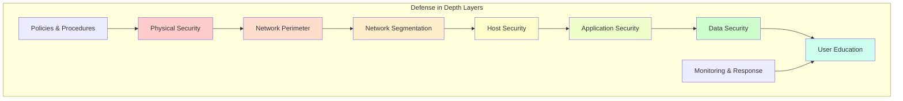
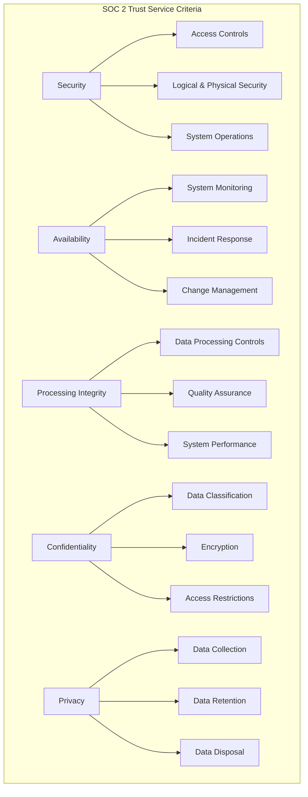
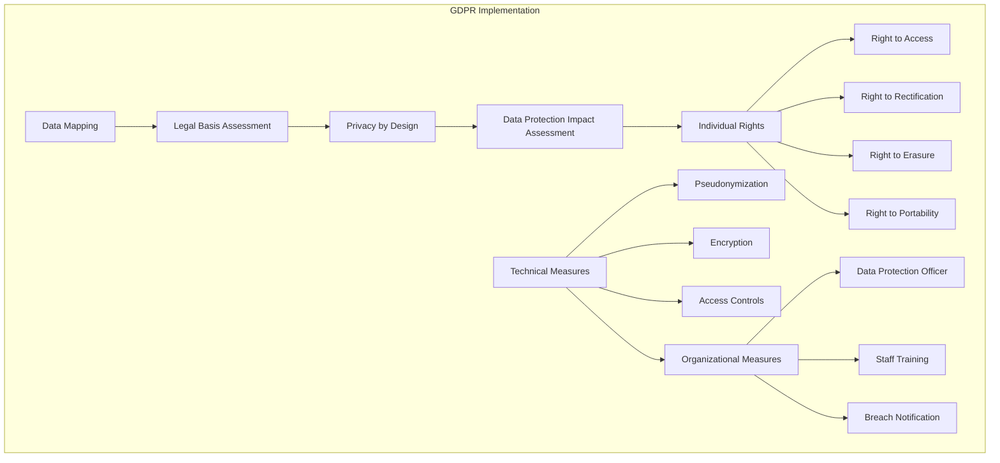
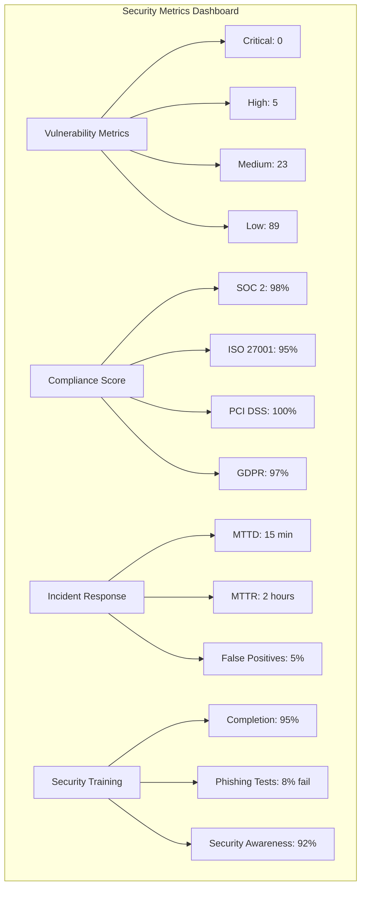
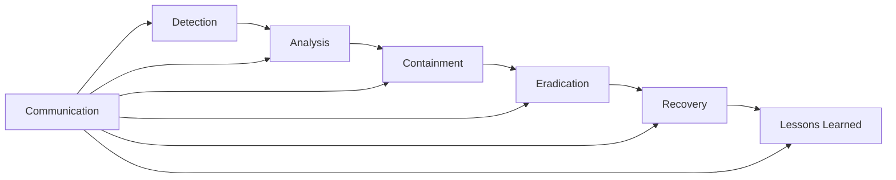
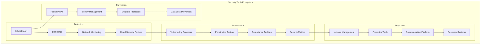

# 🔐 Cloud Security & Compliance

## Overview

This comprehensive security section covers cloud security frameworks, implementation strategies, and compliance requirements for building secure, resilient cloud infrastructure. Learn defense-in-depth strategies, zero-trust architectures, and industry-specific compliance frameworks.

## 🛡️ **Security Modules**

### **1. Identity & Access Management**
**Location**: [`identity-management/`](./identity-management/)
**Focus**: Authentication, authorization, and access control
**Frameworks**: Zero Trust, RBAC, ABAC, PAM

**Topics Covered**:
- Multi-factor authentication (MFA) implementation
- Single sign-on (SSO) and federation
- Privileged access management (PAM)
- Just-in-time (JIT) access provisioning
- Identity governance and lifecycle management
- API authentication and authorization

### **2. Network Security**
**Location**: [`network-security/`](./network-security/)
**Focus**: Network protection and micro-segmentation
**Technologies**: Firewalls, WAF, DDoS protection, VPN

**Topics Covered**:
- Network segmentation and micro-segmentation
- Web application firewalls (WAF) configuration
- DDoS protection and mitigation strategies
- VPN and secure connectivity solutions
- Network monitoring and intrusion detection
- Zero-trust network architecture

### **3. Compliance Frameworks**
**Location**: [`compliance/`](./compliance/)
**Focus**: Regulatory compliance and governance
**Standards**: SOC 2, ISO 27001, PCI DSS, HIPAA, GDPR

**Topics Covered**:
- Compliance framework implementation
- Audit preparation and evidence collection
- Policy development and documentation
- Risk assessment and management
- Continuous compliance monitoring
- Third-party security assessments

### **4. Vulnerability Management**
**Location**: [`vulnerability-management/`](./vulnerability-management/)
**Focus**: Proactive security testing and remediation
**Tools**: SAST, DAST, SCA, penetration testing

**Topics Covered**:
- Vulnerability scanning and assessment
- Security testing integration in CI/CD
- Container and infrastructure scanning
- Threat modeling and risk analysis
- Incident response and remediation
- Security metrics and reporting

## 🏗️ **Security Architecture Patterns**

### **Zero Trust Architecture**

```mermaid
graph TB
    subgraph "Zero Trust Security Model"
        subgraph "Identity Verification"
            A[User/Device Identity] --> B[Multi-Factor Auth]
            B --> C[Risk Assessment]
            C --> D[Conditional Access]
        end
        
        subgraph "Network Security"
            E[Micro-Segmentation] --> F[Encrypted Traffic]
            F --> G[Network Monitoring]
            G --> H[Threat Detection]
        end
        
        subgraph "Data Protection"
            I[Data Classification] --> J[Encryption]
            J --> K[Access Controls]
            K --> L[Data Loss Prevention]
        end
        
        subgraph "Application Security"
            M[Secure Development] --> N[Runtime Protection]
            N --> O[API Security]
            O --> P[Vulnerability Management]
        end
        
        D --> E
        H --> I
        L --> M
        P --> A
    end
```


### **Defense in Depth Strategy**


### **Cloud Security Shared Responsibility**

```mermaid
graph TB
    subgraph "Shared Responsibility Model"
        subgraph "Customer Responsibilities"
            A[Data Classification] --> B[Identity & Access Management]
            B --> C[Operating System Updates]
            C --> D[Network Traffic Protection]
            D --> E[Application-Level Security]
        end
        
        subgraph "Shared Responsibilities"
            F[Patch Management] --> G[Configuration Management]
            G --> H[Awareness & Training]
        end
        
        subgraph "Cloud Provider Responsibilities"
            I[Infrastructure Security] --> J[Physical Access Controls]
            J --> K[Network Infrastructure]
            K --> L[Host Operating System]
            L --> M[Hypervisor Security]
        end
        
        E --> F
        H --> I
    end
```


## 🛠️ **Security Implementation Examples**

### **Identity and Access Management (IAM)**
```json
{
  "Version": "2012-10-17",
  "Statement": [
    {
      "Sid": "DeveloperAccess",
      "Effect": "Allow",
      "Principal": {
        "AWS": "arn:aws:iam::ACCOUNT-ID:role/DeveloperRole"
      },
      "Action": [
        "ec2:DescribeInstances",
        "ec2:DescribeImages",
        "s3:GetObject",
        "s3:PutObject"
      ],
      "Resource": "*",
      "Condition": {
        "StringEquals": {
          "aws:RequestedRegion": ["us-west-2", "us-east-1"]
        },
        "DateGreaterThan": {
          "aws:TokenIssueTime": "2024-01-01T00:00:00Z"
        },
        "Bool": {
          "aws:MultiFactorAuthPresent": "true"
        }
      }
    }
  ]
}
```

### **Network Security Groups**
```yaml
# Kubernetes Network Policy Example
apiVersion: networking.k8s.io/v1
kind: NetworkPolicy
metadata:
  name: web-tier-policy
  namespace: production
spec:
  podSelector:
    matchLabels:
      tier: web
  policyTypes:
  - Ingress
  - Egress
  
  ingress:
  - from:
    - namespaceSelector:
        matchLabels:
          name: ingress-nginx
    ports:
    - protocol: TCP
      port: 8080
  
  egress:
  - to:
    - podSelector:
        matchLabels:
          tier: api
    ports:
    - protocol: TCP
      port: 3000
  
  - to:
    - namespaceSelector:
        matchLabels:
          name: kube-system
    ports:
    - protocol: TCP
      port: 53
    - protocol: UDP
      port: 53
```

### **Container Security Scanning**
```yaml
# Docker security scanning in CI/CD
name: Security Scan
on: [push, pull_request]

jobs:
  security-scan:
    runs-on: ubuntu-latest
    steps:
    - uses: actions/checkout@v3
    
    - name: Build Docker image
      run: docker build -t myapp:${{ github.sha }} .
    
    - name: Run Trivy vulnerability scanner
      uses: aquasecurity/trivy-action@master
      with:
        image-ref: 'myapp:${{ github.sha }}'
        format: 'sarif'
        output: 'trivy-results.sarif'
    
    - name: Upload Trivy scan results
      uses: github/codeql-action/upload-sarif@v2
      with:
        sarif_file: 'trivy-results.sarif'
    
    - name: Run Snyk security scan
      uses: snyk/actions/docker@master
      env:
        SNYK_TOKEN: ${{ secrets.SNYK_TOKEN }}
      with:
        image: 'myapp:${{ github.sha }}'
        args: --severity-threshold=high
```

### **Security Monitoring with Falco**
```yaml
# Falco security rules
- rule: Detect crypto miners
  desc: Detect cryptocurrency miners
  condition: >
    spawned_process and
    (proc.name in (crypto_miners) or
     proc.cmdline contains crypto_mining_cmdlines)
  output: >
    Cryptocurrency miner detected (user=%user.name command=%proc.cmdline
    container=%container.info image=%container.image.repository)
  priority: CRITICAL
  tags: [cryptocurrency, miners]

- rule: Unexpected outbound connection
  desc: Detect unexpected outbound network connections
  condition: >
    outbound and
    not proc.name in (allowed_outbound_processes) and
    not fd.sip in (trusted_servers)
  output: >
    Unexpected outbound connection (user=%user.name command=%proc.cmdline
    connection=%fd.name container=%container.info)
  priority: WARNING
  tags: [network, outbound]
```

## 🔍 **Compliance Frameworks**

### **SOC 2 Type II Implementation**


### **GDPR Compliance Implementation**


### **PCI DSS Requirements**
```
Requirement    Description                     Implementation
============================================================================
1              Firewall Configuration         WAF, Network Segmentation
2              Default Passwords              Password Policies, MFA
3              Cardholder Data Protection     Encryption, Tokenization
4              Encrypted Transmission         TLS 1.3, Certificate Management
5              Anti-virus Software            Endpoint Protection, Scanning
6              Secure Systems                 Patch Management, SAST/DAST
7              Restrict Access                RBAC, Least Privilege
8              Unique User IDs                Identity Management, SSO
9              Physical Access                Physical Security Controls
10             Network Monitoring             SIEM, Log Analysis
11             Security Testing               Penetration Testing, Scanning
12             Information Security Policy    Policies, Training, Procedures
```

## 📊 **Security Metrics and KPIs**

### **Security Scorecard**


### **Risk Assessment Matrix**
```
Risk Level    Probability    Impact         Mitigation Strategy
================================================================
Critical      High          High           Immediate action required
High          High          Medium         Prioritize for remediation
Medium        Medium        Medium         Schedule for next sprint
Low           Low           Low            Monitor and review quarterly
```

## 🚨 **Incident Response Framework**

### **Incident Response Process**


### **Security Playbooks**
```yaml
# Example: Malware Detection Playbook
playbook_name: "Malware Detection Response"
trigger: "Antivirus alert OR suspicious process detection"

steps:
  1. immediate_containment:
     - Isolate affected systems
     - Preserve evidence
     - Notify security team
     
  2. analysis:
     - Analyze malware sample
     - Determine scope of infection
     - Identify attack vector
     
  3. eradication:
     - Remove malware
     - Apply security patches
     - Update security controls
     
  4. recovery:
     - Restore from clean backups
     - Monitor for reinfection
     - Validate system integrity
     
  5. post_incident:
     - Document lessons learned
     - Update security controls
     - Conduct team training

escalation_criteria:
  - Data exfiltration detected
  - Multiple systems infected
  - Business-critical systems affected
  - Media attention likely
```

## 🔧 **Security Tools Integration**

### **Security Tool Stack**


### **Automated Security Testing**
```python
# Security testing automation example
import requests
import json
from datetime import datetime

class SecurityTestSuite:
    def __init__(self, target_url, api_key):
        self.target_url = target_url
        self.api_key = api_key
        self.results = []
    
    def test_authentication(self):
        """Test authentication mechanisms"""
        test_cases = [
            {"test": "weak_password", "password": "123456"},
            {"test": "sql_injection", "username": "admin' OR '1'='1"},
            {"test": "brute_force", "attempts": 10}
        ]
        
        for case in test_cases:
            result = self._execute_auth_test(case)
            self.results.append({
                "test_name": f"auth_{case['test']}",
                "status": result['status'],
                "vulnerability": result['vulnerable'],
                "timestamp": datetime.now().isoformat()
            })
    
    def test_input_validation(self):
        """Test input validation and sanitization"""
        payloads = [
            "<script>alert('XSS')</script>",
            "'; DROP TABLE users; --",
            "../../etc/passwd",
            "{{7*7}}"  # Template injection
        ]
        
        for payload in payloads:
            result = self._test_payload(payload)
            self.results.append({
                "test_name": "input_validation",
                "payload": payload,
                "vulnerable": result['vulnerable'],
                "response_time": result['response_time']
            })
    
    def generate_report(self):
        """Generate security test report"""
        vulnerabilities = [r for r in self.results if r.get('vulnerable', False)]
        
        report = {
            "scan_date": datetime.now().isoformat(),
            "target": self.target_url,
            "total_tests": len(self.results),
            "vulnerabilities_found": len(vulnerabilities),
            "risk_level": self._calculate_risk_level(vulnerabilities),
            "recommendations": self._generate_recommendations(vulnerabilities)
        }
        
        return report
```

## 🎓 **Security Certifications**

### **Recommended Certifications**
```
Level           Certification               Provider        Focus Area
=======================================================================
Entry           Security+                   CompTIA         General Security
                GSEC                        SANS            Security Essentials

Intermediate    CISSP                       (ISC)²          Security Management
                CISM                        ISACA           Information Security
                CEH                         EC-Council      Ethical Hacking

Advanced        CISSP                       (ISC)²          Security Architecture
                SABSA                       SABSA Institute Security Architecture
                TOGAF                       The Open Group  Enterprise Architecture

Cloud           CCSP                        (ISC)²          Cloud Security
                AWS Security Specialty      AWS             AWS Security
                Azure Security Engineer     Microsoft       Azure Security
                GCP Security Engineer       Google          GCP Security
```

## 🚀 **Getting Started**

### **Security Assessment Checklist**
- [ ] **Identity Management**: MFA, SSO, RBAC implementation
- [ ] **Network Security**: Segmentation, monitoring, protection
- [ ] **Data Protection**: Encryption, classification, DLP
- [ ] **Application Security**: SAST/DAST, secure development
- [ ] **Infrastructure Security**: Hardening, patch management
- [ ] **Incident Response**: Procedures, tools, training
- [ ] **Compliance**: Framework implementation, auditing
- [ ] **Security Awareness**: Training, testing, culture

### **Implementation Priorities**
1. **Week 1-2**: [Identity & Access Management](./identity-management/README.md)
2. **Week 3-4**: [Network Security](./network-security/README.md)
3. **Week 5-6**: [Vulnerability Management](./vulnerability-management/README.md)
4. **Week 7-8**: [Compliance Implementation](./compliance/README.md)

### **Security Tools Setup**
```bash
#!/bin/bash
# Security tools installation script

# Install security scanning tools
echo "Installing security tools..."

# Trivy for container scanning
curl -sfL https://raw.githubusercontent.com/aquasecurity/trivy/main/contrib/install.sh | sh -s -- -b /usr/local/bin

# OWASP ZAP for web application security testing
docker pull owasp/zap2docker-stable

# Falco for runtime security monitoring
curl -s https://falco.org/repo/falcosecurity-3672BA8F.asc | apt-key add -
echo "deb https://download.falco.org/packages/deb stable main" | tee -a /etc/apt/sources.list.d/falcosecurity.list
apt-get update && apt-get install falco

# HashiCorp Vault for secrets management
curl -fsSL https://apt.releases.hashicorp.com/gpg | apt-key add -
apt-add-repository "deb [arch=amd64] https://apt.releases.hashicorp.com $(lsb_release -cs) main"
apt-get update && apt-get install vault

echo "Security tools installation completed!"
```

---

**Ready to secure your cloud infrastructure?** 🛡️

Start with [Identity & Access Management](./identity-management/README.md) and build a comprehensive security framework for your cloud environments!
