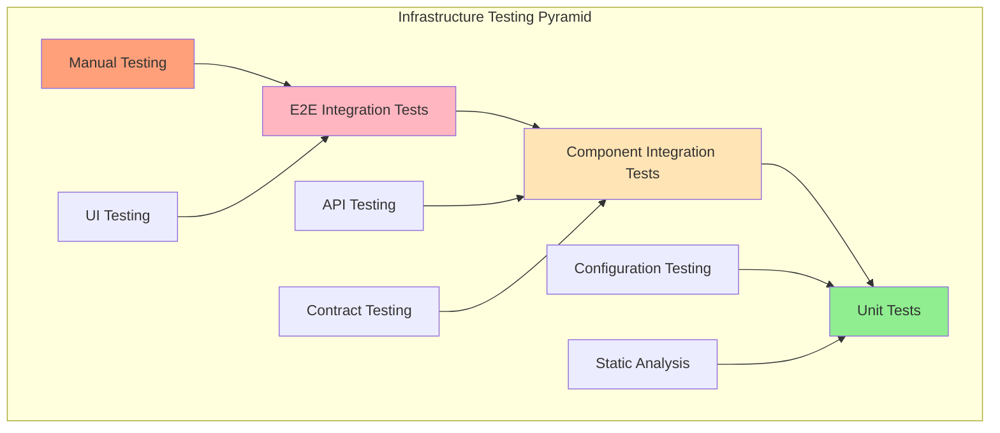
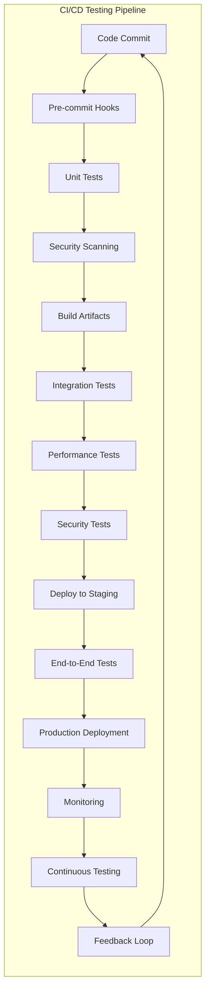
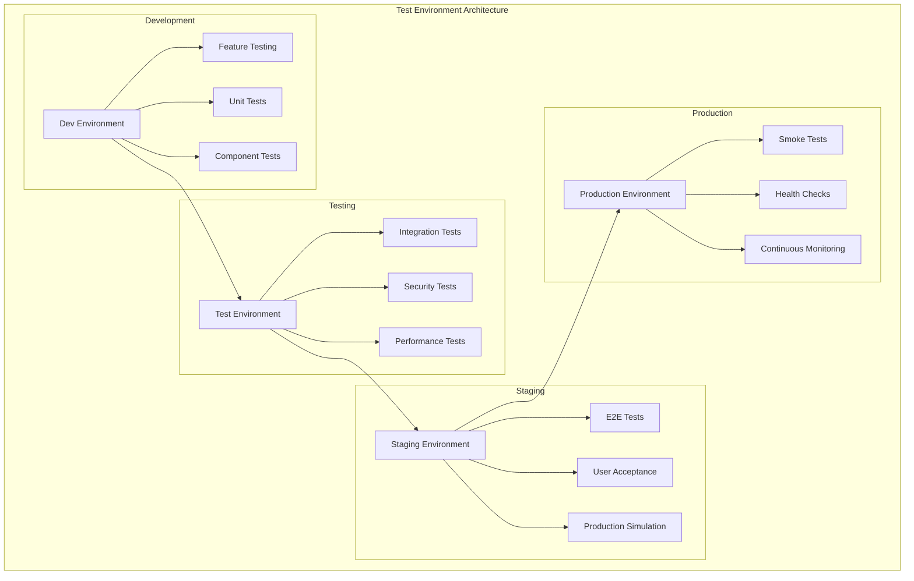

# 🧪 Infrastructure Testing Framework

## Overview

This comprehensive testing framework ensures the reliability, security, and performance of cloud infrastructure through automated testing strategies. It covers unit testing for infrastructure code, integration testing for system components, security testing for compliance, and performance testing for scalability validation.

## 🔬 **Testing Categories**

### **1. Unit Tests**
**Location**: [`unit-tests/`](./unit-tests/)
**Purpose**: Test individual infrastructure components in isolation
**Frameworks**: Terratest, pytest, Jest, Go testing

**Test Types**:
- Infrastructure as Code validation
- Configuration syntax testing
- Module functionality verification
- Resource parameter validation
- Policy rule testing
- Template rendering tests

### **2. Integration Tests**
**Location**: [`integration-tests/`](./integration-tests/)
**Purpose**: Test interactions between infrastructure components
**Tools**: Terratest, Testcontainers, Helm test, K6

**Test Types**:
- End-to-end infrastructure deployment
- Service connectivity testing
- Cross-service communication validation
- Data flow testing
- Environment consistency checks
- Deployment pipeline validation

### **3. Security Tests**
**Location**: [`security-tests/`](./security-tests/)
**Purpose**: Validate security controls and compliance
**Tools**: OWASP ZAP, Bandit, Trivy, Checkov, Falco

**Test Types**:
- Vulnerability scanning
- Configuration security testing
- Compliance validation
- Penetration testing automation
- Secret scanning
- Access control verification

### **4. Performance Tests**
**Location**: [`performance-tests/`](./performance-tests/)
**Purpose**: Validate system performance and scalability
**Tools**: JMeter, k6, Artillery, Gatling, wrk

**Test Types**:
- Load testing
- Stress testing
- Capacity testing
- Scalability validation
- Latency measurement
- Resource utilization testing

## 🏗️ **Testing Architecture**

### **Testing Pyramid for Infrastructure**


### **Test Automation Pipeline**


### **Test Environment Strategy**


## 🔧 **Testing Framework Examples**

### **1. Terraform Unit Testing with Terratest**
```go
// test/terraform_basic_test.go
package test

import (
    "testing"
    "github.com/gruntwork-io/terratest/modules/terraform"
    "github.com/gruntwork-io/terratest/modules/aws"
    "github.com/stretchr/testify/assert"
)

func TestTerraformVPCCreation(t *testing.T) {
    t.Parallel()
    
    // Set up Terraform options
    terraformOptions := &terraform.Options{
        TerraformDir: "../terraform/modules/vpc",
        Vars: map[string]interface{}{
            "vpc_cidr": "10.0.0.0/16",
            "environment": "test",
            "project_name": "terratest",
        },
        EnvVars: map[string]string{
            "AWS_DEFAULT_REGION": "us-west-2",
        },
    }
    
    // Clean up resources after test
    defer terraform.Destroy(t, terraformOptions)
    
    // Deploy the infrastructure
    terraform.InitAndApply(t, terraformOptions)
    
    // Validate outputs
    vpcId := terraform.Output(t, terraformOptions, "vpc_id")
    assert.NotEmpty(t, vpcId)
    
    // Verify VPC exists in AWS
    aws.GetVpcById(t, vpcId, "us-west-2")
    
    // Test VPC configuration
    vpc := aws.GetVpcById(t, vpcId, "us-west-2")
    assert.Equal(t, "10.0.0.0/16", vpc.CidrBlock)
    
    // Test subnets creation
    publicSubnetId := terraform.Output(t, terraformOptions, "public_subnet_id")
    privateSubnetId := terraform.Output(t, terraformOptions, "private_subnet_id")
    
    assert.NotEmpty(t, publicSubnetId)
    assert.NotEmpty(t, privateSubnetId)
    
    // Verify subnet configuration
    publicSubnet := aws.GetSubnetById(t, publicSubnetId, "us-west-2")
    assert.Equal(t, vpcId, publicSubnet.VpcId)
    assert.True(t, publicSubnet.MapPublicIpOnLaunch)
}

func TestTerraformSecurityGroups(t *testing.T) {
    t.Parallel()
    
    terraformOptions := &terraform.Options{
        TerraformDir: "../terraform/modules/security-groups",
        Vars: map[string]interface{}{
            "vpc_id": "vpc-12345678", // Mock VPC ID
            "environment": "test",
        },
    }
    
    defer terraform.Destroy(t, terraformOptions)
    terraform.InitAndApply(t, terraformOptions)
    
    // Test security group rules
    webSgId := terraform.Output(t, terraformOptions, "web_security_group_id")
    
    securityGroup := aws.GetSecurityGroupById(t, webSgId, "us-west-2")
    
    // Verify HTTP and HTTPS rules
    hasHttpRule := false
    hasHttpsRule := false
    
    for _, rule := range securityGroup.IngressRules {
        if rule.FromPort == 80 && rule.ToPort == 80 {
            hasHttpRule = true
        }
        if rule.FromPort == 443 && rule.ToPort == 443 {
            hasHttpsRule = true
        }
    }
    
    assert.True(t, hasHttpRule, "HTTP rule should be present")
    assert.True(t, hasHttpsRule, "HTTPS rule should be present")
}
```

### **2. Kubernetes Integration Testing**
```python
# test_kubernetes_deployment.py
import pytest
import yaml
import subprocess
import time
from kubernetes import client, config

class TestKubernetesDeployment:
    @classmethod
    def setup_class(cls):
        """Setup test environment"""
        config.load_kube_config()
        cls.v1 = client.CoreV1Api()
        cls.apps_v1 = client.AppsV1Api()
        cls.namespace = "test-namespace"
        
        # Create test namespace
        namespace_body = client.V1Namespace(
            metadata=client.V1ObjectMeta(name=cls.namespace)
        )
        try:
            cls.v1.create_namespace(namespace_body)
        except client.exceptions.ApiException as e:
            if e.status != 409:  # Namespace already exists
                raise
    
    @classmethod
    def teardown_class(cls):
        """Clean up test environment"""
        try:
            cls.v1.delete_namespace(cls.namespace)
        except client.exceptions.ApiException:
            pass
    
    def test_deployment_creation(self):
        """Test that deployment is created successfully"""
        # Deploy application
        subprocess.run([
            "kubectl", "apply", "-f", "k8s/deployment.yaml",
            "-n", self.namespace
        ], check=True)
        
        # Wait for deployment to be ready
        self._wait_for_deployment_ready("web-app", timeout=300)
        
        # Verify deployment exists and has correct replicas
        deployment = self.apps_v1.read_namespaced_deployment(
            name="web-app", namespace=self.namespace
        )
        
        assert deployment.status.ready_replicas == 3
        assert deployment.status.replicas == 3
    
    def test_service_creation(self):
        """Test that service is created and accessible"""
        # Deploy service
        subprocess.run([
            "kubectl", "apply", "-f", "k8s/service.yaml",
            "-n", self.namespace
        ], check=True)
        
        # Verify service exists
        service = self.v1.read_namespaced_service(
            name="web-app-service", namespace=self.namespace
        )
        
        assert service.spec.type == "ClusterIP"
        assert len(service.spec.ports) == 1
        assert service.spec.ports[0].port == 80
    
    def test_pod_health_checks(self):
        """Test that pods are healthy and responding"""
        pods = self.v1.list_namespaced_pod(
            namespace=self.namespace,
            label_selector="app=web-app"
        )
        
        assert len(pods.items) == 3
        
        for pod in pods.items:
            assert pod.status.phase == "Running"
            
            # Check readiness probe
            for condition in pod.status.conditions:
                if condition.type == "Ready":
                    assert condition.status == "True"
    
    def test_configmap_integration(self):
        """Test that ConfigMap is mounted correctly"""
        # Create ConfigMap
        subprocess.run([
            "kubectl", "create", "configmap", "app-config",
            "--from-literal=environment=test",
            "--from-literal=debug=true",
            "-n", self.namespace
        ], check=True)
        
        # Verify ConfigMap exists
        configmap = self.v1.read_namespaced_config_map(
            name="app-config", namespace=self.namespace
        )
        
        assert configmap.data["environment"] == "test"
        assert configmap.data["debug"] == "true"
    
    def test_horizontal_pod_autoscaler(self):
        """Test HPA configuration"""
        # Deploy HPA
        subprocess.run([
            "kubectl", "apply", "-f", "k8s/hpa.yaml",
            "-n", self.namespace
        ], check=True)
        
        # Verify HPA exists
        autoscaling_v2 = client.AutoscalingV2Api()
        hpa = autoscaling_v2.read_namespaced_horizontal_pod_autoscaler(
            name="web-app-hpa", namespace=self.namespace
        )
        
        assert hpa.spec.min_replicas == 2
        assert hpa.spec.max_replicas == 10
    
    def _wait_for_deployment_ready(self, deployment_name, timeout=300):
        """Wait for deployment to be ready"""
        start_time = time.time()
        
        while time.time() - start_time < timeout:
            try:
                deployment = self.apps_v1.read_namespaced_deployment(
                    name=deployment_name, namespace=self.namespace
                )
                
                if (deployment.status.ready_replicas and 
                    deployment.status.ready_replicas == deployment.spec.replicas):
                    return True
                    
            except client.exceptions.ApiException:
                pass
            
            time.sleep(5)
        
        raise TimeoutError(f"Deployment {deployment_name} not ready within {timeout}s")

# Test configuration validation
def test_yaml_validity():
    """Test that all YAML files are valid"""
    yaml_files = [
        "k8s/deployment.yaml",
        "k8s/service.yaml",
        "k8s/configmap.yaml",
        "k8s/hpa.yaml"
    ]
    
    for yaml_file in yaml_files:
        with open(yaml_file, 'r') as f:
            try:
                yaml.safe_load_all(f)
            except yaml.YAMLError as e:
                pytest.fail(f"Invalid YAML in {yaml_file}: {e}")

def test_kubernetes_resource_limits():
    """Test that all containers have resource limits"""
    with open("k8s/deployment.yaml", 'r') as f:
        deployment = yaml.safe_load(f)
    
    containers = deployment['spec']['template']['spec']['containers']
    
    for container in containers:
        assert 'resources' in container, f"Container {container['name']} missing resources"
        assert 'limits' in container['resources'], f"Container {container['name']} missing resource limits"
        assert 'requests' in container['resources'], f"Container {container['name']} missing resource requests"
```

### **3. Security Testing with Policy Validation**
```python
# test_security_policies.py
import pytest
import subprocess
import json
import yaml
from pathlib import Path

class TestSecurityPolicies:
    
    def test_opa_gatekeeper_policies(self):
        """Test OPA Gatekeeper policy enforcement"""
        # Test pod without resource limits (should be rejected)
        bad_pod = {
            "apiVersion": "v1",
            "kind": "Pod",
            "metadata": {"name": "test-pod-no-limits"},
            "spec": {
                "containers": [{
                    "name": "test-container",
                    "image": "nginx:latest"
                }]
            }
        }
        
        with open("/tmp/bad-pod.yaml", "w") as f:
            yaml.dump(bad_pod, f)
        
        # This should fail due to policy enforcement
        result = subprocess.run([
            "kubectl", "apply", "-f", "/tmp/bad-pod.yaml", "--dry-run=server"
        ], capture_output=True, text=True)
        
        assert result.returncode != 0
        assert "resource limits required" in result.stderr.lower()
    
    def test_network_policy_enforcement(self):
        """Test network policy isolation"""
        # Deploy test pods in different namespaces
        subprocess.run([
            "kubectl", "create", "namespace", "secure-ns"
        ], check=True)
        
        subprocess.run([
            "kubectl", "create", "namespace", "public-ns"
        ], check=True)
        
        # Apply network policy
        network_policy = {
            "apiVersion": "networking.k8s.io/v1",
            "kind": "NetworkPolicy",
            "metadata": {
                "name": "deny-all",
                "namespace": "secure-ns"
            },
            "spec": {
                "podSelector": {},
                "policyTypes": ["Ingress", "Egress"]
            }
        }
        
        with open("/tmp/network-policy.yaml", "w") as f:
            yaml.dump(network_policy, f)
        
        subprocess.run([
            "kubectl", "apply", "-f", "/tmp/network-policy.yaml"
        ], check=True)
        
        # Test network isolation
        # This would involve deploying test pods and verifying connectivity
        # Implementation depends on specific network testing tools
    
    def test_rbac_permissions(self):
        """Test RBAC configuration"""
        # Test service account permissions
        result = subprocess.run([
            "kubectl", "auth", "can-i", "get", "secrets",
            "--as=system:serviceaccount:default:test-sa"
        ], capture_output=True, text=True)
        
        # Service account should not have access to secrets
        assert "no" in result.stdout.lower()
        
        # Test specific permissions
        result = subprocess.run([
            "kubectl", "auth", "can-i", "get", "pods",
            "--as=system:serviceaccount:default:test-sa"
        ], capture_output=True, text=True)
        
        # Service account should have access to pods
        assert "yes" in result.stdout.lower()
    
    def test_pod_security_standards(self):
        """Test Pod Security Standards compliance"""
        # Test pod with security context
        secure_pod = {
            "apiVersion": "v1",
            "kind": "Pod",
            "metadata": {"name": "secure-pod"},
            "spec": {
                "securityContext": {
                    "runAsNonRoot": True,
                    "runAsUser": 1000,
                    "fsGroup": 2000
                },
                "containers": [{
                    "name": "secure-container",
                    "image": "nginx:latest",
                    "securityContext": {
                        "allowPrivilegeEscalation": False,
                        "readOnlyRootFilesystem": True,
                        "capabilities": {
                            "drop": ["ALL"]
                        }
                    }
                }]
            }
        }
        
        with open("/tmp/secure-pod.yaml", "w") as f:
            yaml.dump(secure_pod, f)
        
        # This should succeed with proper security context
        result = subprocess.run([
            "kubectl", "apply", "-f", "/tmp/secure-pod.yaml", "--dry-run=server"
        ], capture_output=True, text=True)
        
        assert result.returncode == 0

def test_dockerfile_security():
    """Test Dockerfile security best practices"""
    dockerfile_path = Path("docker/Dockerfile")
    
    if not dockerfile_path.exists():
        pytest.skip("Dockerfile not found")
    
    with open(dockerfile_path, 'r') as f:
        dockerfile_content = f.read()
    
    # Check for security best practices
    assert "USER" in dockerfile_content, "Dockerfile should specify non-root user"
    assert "COPY --chown=" in dockerfile_content or "RUN chown" in dockerfile_content, "Files should have proper ownership"
    assert "FROM" in dockerfile_content and ":latest" not in dockerfile_content, "Should use specific image tags, not 'latest'"

def test_secret_scanning():
    """Test for hardcoded secrets in code"""
    # Use tools like git-secrets, truffleHog, or detect-secrets
    result = subprocess.run([
        "detect-secrets", "scan", "--all-files"
    ], capture_output=True, text=True, cwd=".")
    
    if result.returncode == 0:
        secrets = json.loads(result.stdout)
        assert len(secrets.get("results", {})) == 0, "Potential secrets detected in code"
```

### **4. Performance Testing with k6**
```javascript
// performance_test.js
import http from 'k6/http';
import { check, sleep } from 'k6';
import { Rate, Trend } from 'k6/metrics';

// Custom metrics
export let errorRate = new Rate('errors');
export let responseTime = new Trend('response_time');

// Test configuration
export let options = {
  stages: [
    { duration: '2m', target: 10 },   // Ramp up to 10 users
    { duration: '5m', target: 10 },   // Stay at 10 users
    { duration: '2m', target: 50 },   // Ramp up to 50 users
    { duration: '5m', target: 50 },   // Stay at 50 users
    { duration: '2m', target: 100 },  // Ramp up to 100 users
    { duration: '5m', target: 100 },  // Stay at 100 users
    { duration: '2m', target: 0 },    // Ramp down to 0 users
  ],
  thresholds: {
    'http_req_duration': ['p(95)<500'], // 95% of requests under 500ms
    'http_req_failed': ['rate<0.02'],   // Error rate under 2%
    'errors': ['rate<0.02'],
  },
};

const BASE_URL = __ENV.BASE_URL || 'http://localhost:8080';

export default function() {
  // Test homepage
  let homeResponse = http.get(`${BASE_URL}/`);
  
  check(homeResponse, {
    'homepage status is 200': (r) => r.status === 200,
    'homepage response time < 200ms': (r) => r.timings.duration < 200,
  });
  
  errorRate.add(homeResponse.status !== 200);
  responseTime.add(homeResponse.timings.duration);
  
  sleep(1);
  
  // Test API endpoint
  let apiResponse = http.get(`${BASE_URL}/api/health`);
  
  check(apiResponse, {
    'API status is 200': (r) => r.status === 200,
    'API response contains status': (r) => r.json('status') === 'healthy',
    'API response time < 100ms': (r) => r.timings.duration < 100,
  });
  
  errorRate.add(apiResponse.status !== 200);
  responseTime.add(apiResponse.timings.duration);
  
  sleep(1);
  
  // Test authentication endpoint
  let authPayload = JSON.stringify({
    username: 'testuser',
    password: 'testpass'
  });
  
  let authResponse = http.post(`${BASE_URL}/api/auth/login`, authPayload, {
    headers: { 'Content-Type': 'application/json' },
  });
  
  check(authResponse, {
    'auth status is 200 or 401': (r) => [200, 401].includes(r.status),
    'auth response time < 300ms': (r) => r.timings.duration < 300,
  });
  
  if (authResponse.status === 200) {
    let token = authResponse.json('token');
    
    // Test authenticated endpoint
    let protectedResponse = http.get(`${BASE_URL}/api/protected`, {
      headers: { 'Authorization': `Bearer ${token}` },
    });
    
    check(protectedResponse, {
      'protected endpoint status is 200': (r) => r.status === 200,
      'protected endpoint response time < 200ms': (r) => r.timings.duration < 200,
    });
    
    errorRate.add(protectedResponse.status !== 200);
    responseTime.add(protectedResponse.timings.duration);
  }
  
  sleep(1);
}

// Setup function
export function setup() {
  console.log('Starting performance test...');
  console.log(`Target URL: ${BASE_URL}`);
  
  // Verify the service is accessible
  let response = http.get(`${BASE_URL}/health`);
  if (response.status !== 200) {
    throw new Error(`Service not accessible: ${response.status}`);
  }
  
  return { baseUrl: BASE_URL };
}

// Teardown function
export function teardown(data) {
  console.log('Performance test completed');
  console.log(`Base URL tested: ${data.baseUrl}`);
}
```

## 📊 **Testing Metrics & Reporting**

### **Test Coverage Metrics**
```yaml
# .github/workflows/test-coverage.yml
name: Test Coverage Report

on: [push, pull_request]

jobs:
  coverage:
    runs-on: ubuntu-latest
    steps:
    - uses: actions/checkout@v3
    
    - name: Run Unit Tests
      run: |
        go test ./... -coverprofile=coverage.out
        go tool cover -html=coverage.out -o coverage.html
    
    - name: Run Integration Tests
      run: |
        pytest tests/integration/ --cov=src --cov-report=xml
    
    - name: Run Security Tests
      run: |
        bandit -r src/ -f json -o security-report.json
        safety check --json --output safety-report.json
    
    - name: Upload Coverage Reports
      uses: codecov/codecov-action@v3
      with:
        files: ./coverage.xml,./coverage.out
```

### **Test Quality Gates**
```yaml
# Quality gates configuration
quality_gates:
  unit_tests:
    coverage_threshold: 80
    required: true
    
  integration_tests:
    coverage_threshold: 70
    required: true
    
  security_tests:
    max_high_vulnerabilities: 0
    max_medium_vulnerabilities: 5
    required: true
    
  performance_tests:
    max_response_time_p95: 500ms
    max_error_rate: 2%
    required: true
```

## 🎯 **Testing Best Practices**

### **Test Design Principles**
1. **Test Pyramid**: More unit tests, fewer integration tests, minimal UI tests
2. **Test Independence**: Tests should not depend on each other
3. **Deterministic**: Tests should produce consistent results
4. **Fast Feedback**: Quick execution for rapid development cycles
5. **Maintainable**: Easy to update when code changes
6. **Comprehensive**: Cover happy path, edge cases, and error conditions

### **Infrastructure Testing Guidelines**
1. **Environment Parity**: Test environments should mirror production
2. **Data Management**: Use test data that doesn't affect production
3. **Resource Cleanup**: Always clean up test resources
4. **Parallel Execution**: Run tests in parallel when possible
5. **Monitoring Integration**: Include monitoring in test scenarios
6. **Documentation**: Document test scenarios and expected outcomes

## 🚀 **Getting Started**

### **Setup Test Environment**
```bash
#!/bin/bash
# setup-testing-environment.sh

echo "Setting up infrastructure testing environment..."

# Install testing tools
go install github.com/gruntwork-io/terratest@latest
pip install pytest pytest-cov kubernetes
npm install -g k6

# Install security testing tools
pip install bandit safety detect-secrets
docker pull owasp/zap2docker-stable

# Install code quality tools
go install github.com/golangci/golangci-lint/cmd/golangci-lint@latest
pip install flake8 black isort

# Setup test data and configurations
mkdir -p test-data/{terraform,kubernetes,security,performance}

echo "Testing environment setup completed!"
```

### **Run All Tests**
```bash
#!/bin/bash
# run-all-tests.sh

echo "Running comprehensive infrastructure tests..."

# Unit tests
echo "Running unit tests..."
go test ./tests/unit/... -v
pytest tests/unit/ -v

# Integration tests
echo "Running integration tests..."
pytest tests/integration/ -v

# Security tests
echo "Running security tests..."
bandit -r src/
safety check
trivy fs .

# Performance tests
echo "Running performance tests..."
k6 run tests/performance/load-test.js

echo "All tests completed!"
```

---

**Ready to implement comprehensive infrastructure testing?** 🧪

Start with [Unit Tests](./unit-tests/README.md) and build a robust testing framework for your cloud infrastructure!
