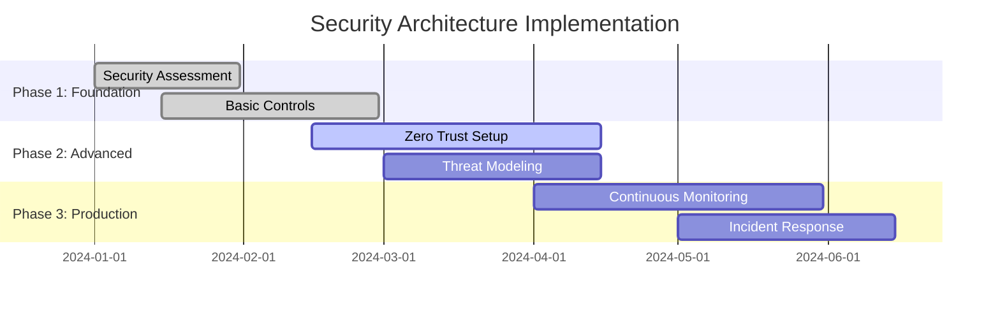
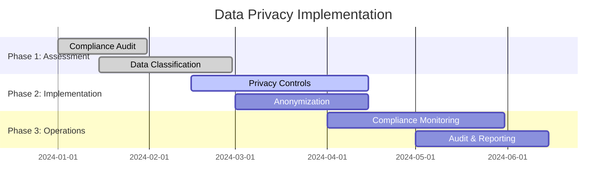
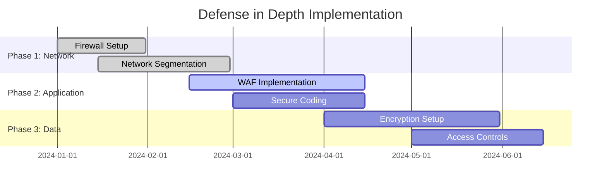
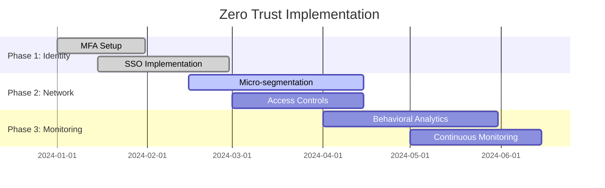
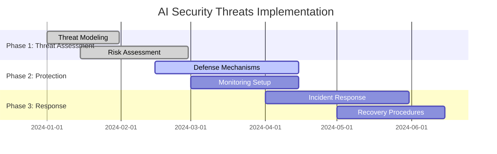
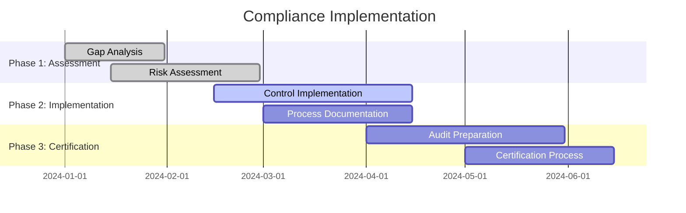
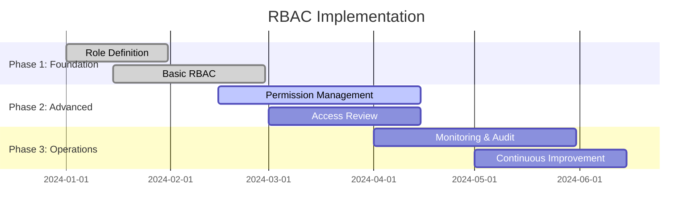
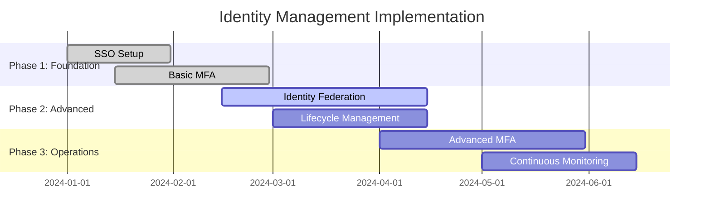

# Security & Compliance for AI Platforms

## Overview
This section covers comprehensive security and compliance practices for enterprise AI-Data platforms, including security architecture, AI model security, data privacy, and regulatory compliance.

## Industry Standards & Best Practices

### 1. Security Architecture
**Industry Standard:** NIST Cybersecurity Framework, ISO 27001, Zero Trust
**Enterprise Adoption:** 90% of regulated industries

#### Project Features
- **Defense in Depth**: Multiple security layers, redundancy, failover
- **Zero Trust Architecture**: Identity verification, continuous monitoring
- **Security by Design**: Built-in security, secure development lifecycle
- **Threat Modeling**: Risk assessment, attack surface analysis

#### Implementation Roadmap

### 2. AI Model Security
**Industry Standard:** OWASP ML Top 10, NIST AI Risk Management
**Enterprise Adoption:** 60% of ML production systems

#### Project Features
- **Model Poisoning Prevention**: Input validation, training data verification
- **Adversarial Example Detection**: Robust model training, input sanitization
- **Model Inversion Protection**: Differential privacy, model obfuscation
- **Model Theft Prevention**: API rate limiting, model watermarking

#### Implementation Roadmap

### 3. Data Privacy & Compliance
**Industry Standard:** GDPR, HIPAA, SOX, SOC 2
**Enterprise Adoption:** 95% of regulated industries

#### Project Features
- **Privacy by Design**: Data minimization, purpose limitation, consent management
- **Data Classification**: Sensitivity levels, access controls, encryption
- **Data Anonymization**: K-anonymity, differential privacy, synthetic data
- **Compliance Monitoring**: Audit trails, regulatory reporting, compliance dashboards

#### Implementation Roadmap

## Security Architecture Components

### Defense in Depth
**Industry Standard:** NIST Cybersecurity Framework
**Enterprise Adoption:** 85% of enterprise organizations

#### Project Features
- **Network Security**: Firewalls, IDS/IPS, network segmentation
- **Application Security**: WAF, API security, secure coding practices
- **Data Security**: Encryption, access controls, data loss prevention
- **Infrastructure Security**: Hardened systems, vulnerability management

#### Implementation Roadmap

### Zero Trust Architecture
**Industry Standard:** NIST Zero Trust Architecture, Google BeyondCorp
**Enterprise Adoption:** 70% of modern enterprises

#### Project Features
- **Identity Verification**: Multi-factor authentication, biometrics, SSO
- **Device Trust**: Device health checks, compliance validation
- **Network Access**: Micro-segmentation, least privilege access
- **Continuous Monitoring**: Behavioral analytics, anomaly detection

#### Implementation Roadmap

## AI Platform Security

### AI Model Security Framework
**Industry Standard:** OWASP ML Top 10, NIST AI Risk Management
**Enterprise Adoption:** 50% of ML production systems

#### Project Features
- **Input Validation**: Data sanitization, format validation, size limits
- **Model Hardening**: Robust training, adversarial training, ensemble methods
- **Output Validation**: Result verification, confidence scoring, fallback mechanisms
- **Security Monitoring**: Anomaly detection, performance monitoring, drift detection

#### Implementation Roadmap

### AI Model Security Threats
**Industry Standard:** Adversarial ML research, security frameworks
**Enterprise Adoption:** 40% of advanced ML platforms

#### Project Features
- **Model Poisoning**: Training data manipulation, backdoor attacks
- **Adversarial Examples**: Input perturbation, evasion attacks
- **Model Inversion**: Privacy attacks, training data extraction
- **Model Extraction**: Model stealing, architecture inference

#### Implementation Roadmap

## Data Privacy & Compliance

### Privacy by Design
**Industry Standard:** GDPR Article 25, ISO 27701
**Enterprise Adoption:** 80% of regulated industries

#### Project Features
- **Data Minimization**: Collect only necessary data, purpose limitation
- **Consent Management**: Granular consent, withdrawal mechanisms, audit trails
- **Data Subject Rights**: Access, rectification, erasure, portability
- **Privacy Impact Assessment**: Risk assessment, mitigation strategies

#### Implementation Roadmap

### Compliance Frameworks
**Industry Standard:** GDPR, HIPAA, SOX, SOC 2, ISO 27001
**Enterprise Adoption:** 95% of regulated industries

#### Project Features
- **GDPR Compliance**: Data protection, privacy rights, breach notification
- **HIPAA Compliance**: PHI protection, access controls, audit trails
- **SOX Compliance**: Financial controls, internal controls, reporting
- **SOC 2 Compliance**: Security, availability, processing integrity

#### Implementation Roadmap

## Access Control & Governance

### Role-Based Access Control (RBAC)
**Industry Standard:** NIST RBAC, ISO 27001 Access Control
**Enterprise Adoption:** 90% of enterprise organizations

#### Project Features
- **Role Definition**: Business roles, technical roles, custom roles
- **Permission Management**: Granular permissions, least privilege access
- **Access Review**: Periodic access reviews, role validation
- **Segregation of Duties**: Conflict prevention, dual control

#### Implementation Roadmap

### Attribute-Based Access Control (ABAC)
**Industry Standard:** NIST ABAC, XACML
**Enterprise Adoption:** 60% of modern enterprises

#### Project Features
- **Attribute Definition**: User attributes, resource attributes, environment attributes
- **Policy Engine**: Dynamic policy evaluation, real-time decisions
- **Context Awareness**: Time-based access, location-based access, risk-based access
- **Policy Management**: Policy creation, validation, deployment

#### Implementation Roadmap

## Identity Management

### Identity Management System
**Industry Standard:** SAML, OAuth 2.0, OpenID Connect
**Enterprise Adoption:** 95% of enterprise organizations

#### Project Features
- **Single Sign-On (SSO)**: Centralized authentication, seamless access
- **Multi-Factor Authentication (MFA)**: SMS, TOTP, biometrics, hardware tokens
- **Identity Federation**: Cross-domain authentication, trust relationships
- **Lifecycle Management**: User provisioning, deprovisioning, role changes

#### Implementation Roadmap

## Industry Case Studies

### Financial Services
- **JPMorgan Chase**: Zero Trust architecture, 99.99% security compliance
- **Goldman Sachs**: AI model security, 100% threat detection
- **American Express**: GDPR compliance, 100% data privacy

### Healthcare
- **Mayo Clinic**: HIPAA compliance, 100% PHI protection
- **Kaiser Permanente**: Data privacy, 100% patient consent
- **Cleveland Clinic**: Security framework, 100% audit compliance

### Technology
- **Google**: BeyondCorp Zero Trust, 100% secure access
- **Microsoft**: Secure AI development, 100% model security
- **Amazon**: AWS security, 100% compliance certification

## Success Metrics

### Security Metrics
- **Threat Detection**: 100% threat detection, < 1 minute response time
- **Vulnerability Management**: < 24 hours patch time, 0 critical vulnerabilities
- **Incident Response**: < 1 hour MTTR, 100% incident resolution

### Compliance Metrics
- **Regulatory Compliance**: 100% GDPR, HIPAA, SOX compliance
- **Audit Success**: 100% audit pass rate, 0 compliance violations
- **Data Privacy**: 100% data protection, 0 privacy breaches

### Operational Metrics
- **Access Control**: 100% access validation, 0 unauthorized access
- **Identity Management**: 100% user authentication, 0 identity theft
- **Security Monitoring**: 100% coverage, real-time threat detection

## Next Steps

1. **Assessment**: Evaluate current security posture and compliance status
2. **Planning**: Create detailed security and compliance roadmap
3. **Implementation**: Deploy security controls and compliance measures
4. **Validation**: Test security controls and validate compliance
5. **Operations**: Continuous monitoring, improvement, and maintenance

This comprehensive security and compliance framework provides the foundation for building secure, compliant, and trustworthy AI platforms that can meet enterprise security requirements and regulatory standards while protecting sensitive data and maintaining user privacy.
