# Security & Compliance

## Overview
This section covers security architecture, AI model security, data privacy, compliance frameworks, and access control for enterprise AI platforms.

## 1. **Security Architecture**

### 1. **Defense in Depth**
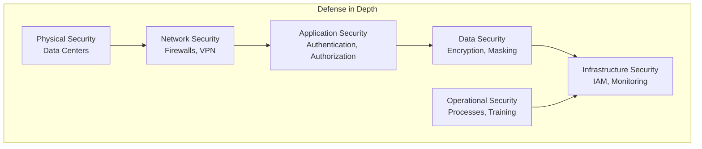

### 2. **Zero Trust Security Model**
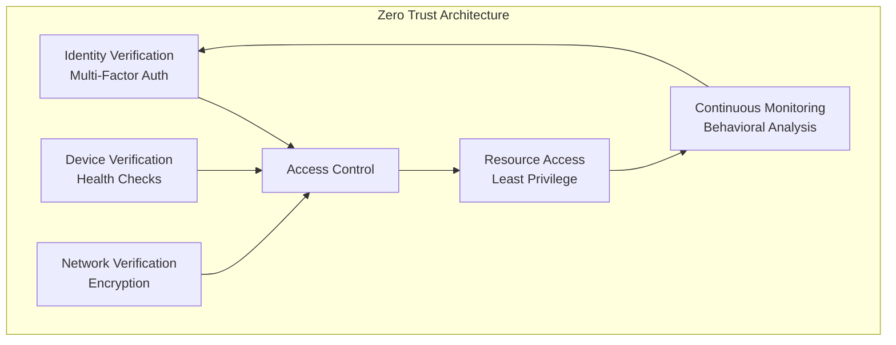

### 3. **Security Layers for AI Platforms**
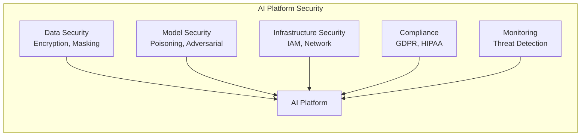

## 2. **AI Model Security**

### 1. **Model Security Threats**
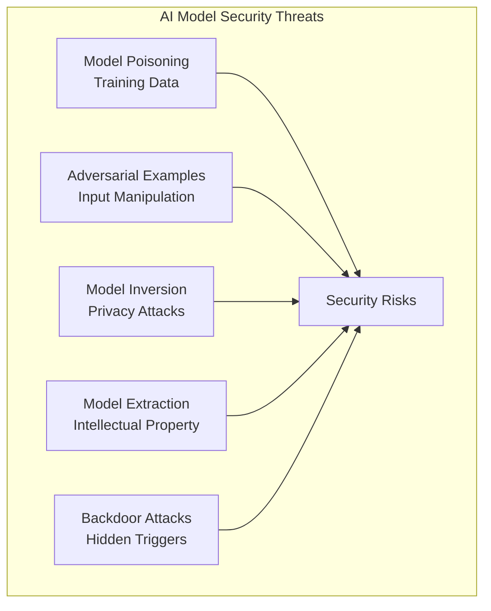

### 2. **Model Security Framework**
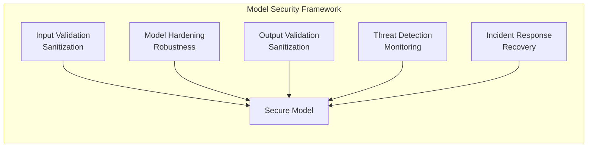

## 3. **Data Privacy & Compliance**

### 1. **Privacy by Design**
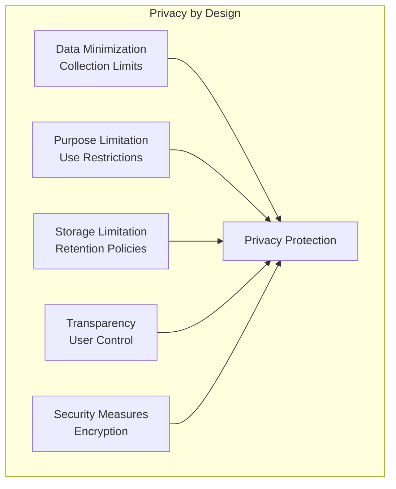

### 2. **Compliance Frameworks**
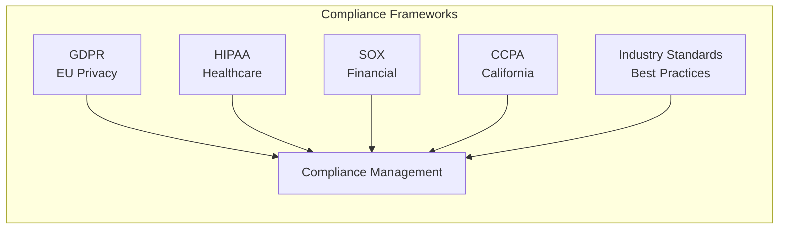

### 3. **Data Classification & Handling**
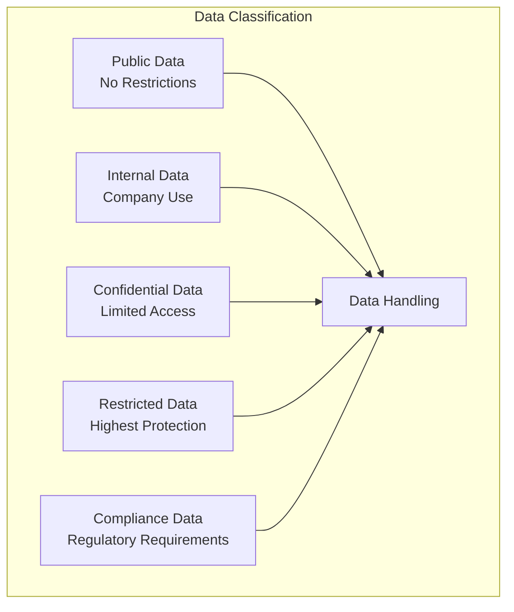

## 4. **Access Control & Governance**

### 1. **Role-Based Access Control (RBAC)**
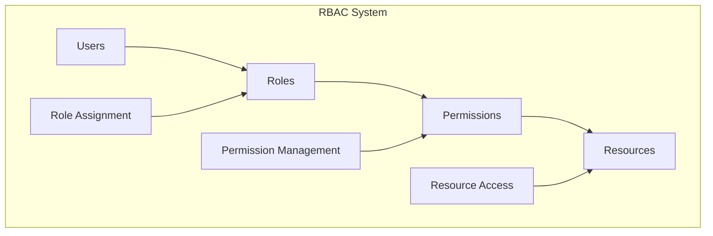

### 2. **Attribute-Based Access Control (ABAC)**
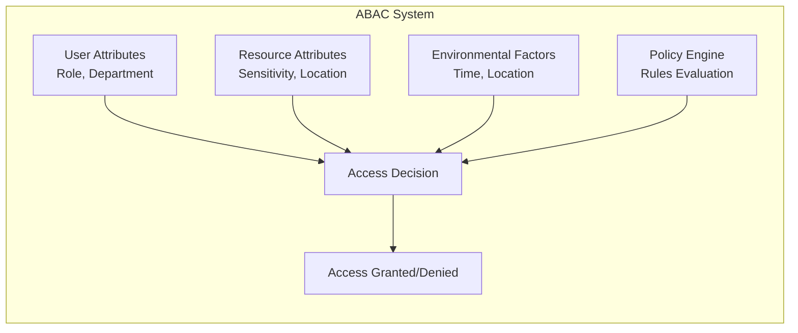

### 3. **Identity Management**
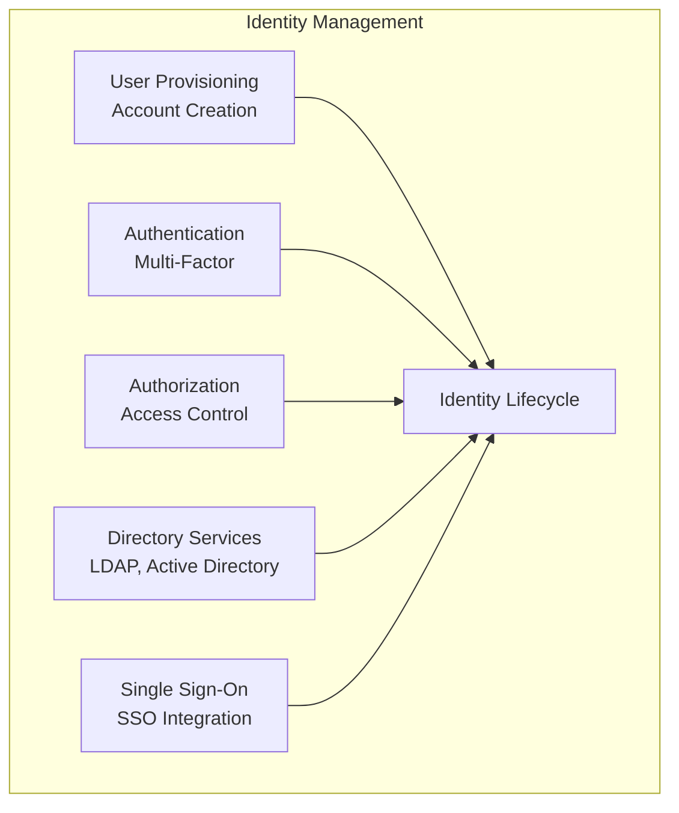

## 5. **Implementation Examples**

### **Zero Trust Security Implementation**
```python
class ZeroTrustSecurity:
    def __init__(self):
        self.identity_verifier = IdentityVerifier()
        self.device_verifier = DeviceVerifier()
        self.network_verifier = NetworkVerifier()
        self.access_controller = AccessController()
    
    def authenticate_request(self, request):
        """Implement zero trust authentication"""
        # Verify identity
        identity_valid = self.identity_verifier.verify(request.user_id, request.credentials)
        if not identity_valid:
            return {"access": False, "reason": "Identity verification failed"}
        
        # Verify device
        device_valid = self.device_verifier.verify(request.device_id, request.device_info)
        if not device_valid:
            return {"access": False, "reason": "Device verification failed"}
        
        # Verify network
        network_valid = self.network_verifier.verify(request.network_info)
        if not network_valid:
            return {"access": False, "reason": "Network verification failed"}
        
        # Check permissions
        permissions = self.access_controller.check_permissions(
            request.user_id, 
            request.resource, 
            request.action
        )
        
        if not permissions:
            return {"access": False, "reason": "Insufficient permissions"}
        
        return {"access": True, "permissions": permissions}
    
    def continuous_monitoring(self, user_id, resource):
        """Implement continuous monitoring"""
        # Monitor user behavior
        behavior_score = self._analyze_user_behavior(user_id)
        
        # Monitor resource access patterns
        access_patterns = self._analyze_access_patterns(user_id, resource)
        
        # Risk assessment
        risk_score = self._calculate_risk_score(behavior_score, access_patterns)
        
        if risk_score > self.risk_threshold:
            self._trigger_security_alert(user_id, resource, risk_score)
        
        return risk_score
```

### **Model Poisoning Detection**
```python
import numpy as np
from sklearn.ensemble import IsolationForest
from sklearn.preprocessing import StandardScaler

class ModelPoisoningDetector:
    def __init__(self, baseline_data, contamination=0.1):
        self.baseline_data = baseline_data
        self.contamination = contamination
        self.scaler = StandardScaler()
        self.detector = IsolationForest(contamination=contamination, random_state=42)
        
        # Train detector on baseline data
        self._train_detector()
    
    def _train_detector(self):
        """Train the poisoning detection model"""
        # Preprocess baseline data
        scaled_data = self.scaler.fit_transform(self.baseline_data)
        
        # Train isolation forest
        self.detector.fit(scaled_data)
    
    def detect_poisoning(self, new_data):
        """Detect potential model poisoning in new data"""
        # Preprocess new data
        scaled_new_data = self.scaler.transform(new_data)
        
        # Predict anomalies
        predictions = self.detector.predict(scaled_new_data)
        
        # -1 indicates anomaly (potential poisoning)
        poisoning_scores = self.detector.score_samples(scaled_new_data)
        
        # Identify poisoned samples
        poisoned_indices = np.where(predictions == -1)[0]
        
        return {
            'poisoning_detected': len(poisoned_indices) > 0,
            'poisoned_indices': poisoned_indices,
            'poisoning_scores': poisoning_scores,
            'anomaly_threshold': self.detector.threshold_
        }
    
    def analyze_data_distribution(self, new_data):
        """Analyze data distribution for poisoning indicators"""
        baseline_stats = self._calculate_statistics(self.baseline_data)
        new_stats = self._calculate_statistics(new_data)
        
        # Calculate distribution differences
        distribution_diff = {}
        for feature in baseline_stats.keys():
            if feature in new_stats:
                diff = abs(baseline_stats[feature] - new_stats[feature])
                distribution_diff[feature] = diff
        
        return {
            'baseline_statistics': baseline_stats,
            'new_statistics': new_stats,
            'distribution_differences': distribution_diff,
            'suspicious_features': [f for f, d in distribution_diff.items() if d > self.distribution_threshold]
        }
    
    def _calculate_statistics(self, data):
        """Calculate statistical measures for data"""
        if isinstance(data, np.ndarray):
            data = data.reshape(-1, 1) if len(data.shape) == 1 else data
        
        stats = {}
        for i in range(data.shape[1]):
            feature_name = f"feature_{i}"
            stats[feature_name] = {
                'mean': np.mean(data[:, i]),
                'std': np.std(data[:, i]),
                'min': np.min(data[:, i]),
                'max': np.max(data[:, i]),
                'median': np.median(data[:, i])
            }
        
        return stats
```

### **Adversarial Example Detection**
```python
import numpy as np
from scipy.spatial.distance import cosine
from sklearn.metrics.pairwise import euclidean_distances

class AdversarialExampleDetector:
    def __init__(self, model, detection_methods=['statistical', 'distance', 'confidence']):
        self.model = model
        self.detection_methods = detection_methods
        self.baseline_features = None
        self.confidence_threshold = 0.8
    
    def set_baseline(self, baseline_data):
        """Set baseline data for comparison"""
        self.baseline_features = self._extract_features(baseline_data)
    
    def detect_adversarial(self, input_data):
        """Detect adversarial examples using multiple methods"""
        results = {}
        
        if 'statistical' in self.detection_methods:
            results['statistical'] = self._statistical_detection(input_data)
        
        if 'distance' in self.detection_methods:
            results['distance'] = self._distance_based_detection(input_data)
        
        if 'confidence' in self.detection_methods:
            results['confidence'] = self._confidence_based_detection(input_data)
        
        # Combine results
        combined_score = self._combine_detection_results(results)
        
        return {
            'detection_results': results,
            'combined_score': combined_score,
            'is_adversarial': combined_score > self.adversarial_threshold
        }
    
    def _statistical_detection(self, input_data):
        """Statistical detection of adversarial examples"""
        if self.baseline_features is None:
            return {'score': 0, 'method': 'statistical'}
        
        # Extract features from input
        input_features = self._extract_features(input_data)
        
        # Calculate statistical differences
        feature_diffs = []
        for i in range(len(input_features)):
            if i < len(self.baseline_features):
                diff = abs(input_features[i] - self.baseline_features[i])
                feature_diffs.append(diff)
        
        # Calculate anomaly score
        anomaly_score = np.mean(feature_diffs) / (np.std(feature_diffs) + 1e-8)
        
        return {
            'score': anomaly_score,
            'method': 'statistical',
            'feature_differences': feature_diffs
        }
    
    def _distance_based_detection(self, input_data):
        """Distance-based detection of adversarial examples"""
        if self.baseline_features is None:
            return {'score': 0, 'method': 'distance'}
        
        # Calculate distances to baseline
        input_features = self._extract_features(input_data)
        
        # Euclidean distance
        euclidean_dist = np.linalg.norm(input_features - self.baseline_features)
        
        # Cosine distance
        cosine_dist = cosine(input_features, self.baseline_features)
        
        # Normalize distances
        normalized_euclidean = euclidean_dist / (np.linalg.norm(self.baseline_features) + 1e-8)
        
        return {
            'score': normalized_euclidean,
            'method': 'distance',
            'euclidean_distance': euclidean_dist,
            'cosine_distance': cosine_dist
        }
    
    def _confidence_based_detection(self, input_data):
        """Confidence-based detection of adversarial examples"""
        # Get model predictions
        predictions = self.model.predict_proba(input_data)
        
        # Calculate confidence metrics
        max_confidence = np.max(predictions, axis=1)
        confidence_entropy = -np.sum(predictions * np.log(predictions + 1e-8), axis=1)
        
        # Detect low confidence (potential adversarial)
        low_confidence_score = 1 - np.mean(max_confidence)
        
        return {
            'score': low_confidence_score,
            'method': 'confidence',
            'max_confidence': max_confidence,
            'confidence_entropy': confidence_entropy
        }
    
    def _extract_features(self, data):
        """Extract features from input data"""
        # This is a simplified feature extraction
        # In practice, you might use more sophisticated methods
        if isinstance(data, np.ndarray):
            return data.flatten()
        return np.array(data).flatten()
    
    def _combine_detection_results(self, results):
        """Combine results from multiple detection methods"""
        scores = []
        weights = []
        
        for method, result in results.items():
            if 'score' in result:
                scores.append(result['score'])
                # Assign weights based on method reliability
                if method == 'statistical':
                    weights.append(0.4)
                elif method == 'distance':
                    weights.append(0.3)
                elif method == 'confidence':
                    weights.append(0.3)
        
        if not scores:
            return 0
        
        # Weighted average
        combined_score = np.average(scores, weights=weights)
        return combined_score
```

### **Model Inversion Protection with Differential Privacy**
```python
import numpy as np
from sklearn.preprocessing import StandardScaler
import torch
import torch.nn as nn

class DifferentialPrivacyModel(nn.Module):
    def __init__(self, input_size, hidden_size, output_size, epsilon=1.0, delta=1e-5):
        super(DifferentialPrivacyModel, self).__init__()
        self.epsilon = epsilon
        self.delta = delta
        
        self.layer1 = nn.Linear(input_size, hidden_size)
        self.layer2 = nn.Linear(hidden_size, hidden_size)
        self.layer3 = nn.Linear(hidden_size, output_size)
        
        self.relu = nn.ReLU()
        self.dropout = nn.Dropout(0.2)
    
    def forward(self, x):
        x = self.relu(self.layer1(x))
        x = self.dropout(x)
        x = self.relu(self.layer2(x))
        x = self.dropout(x)
        x = self.layer3(x)
        return x
    
    def add_noise_to_gradients(self, gradients, sensitivity):
        """Add noise to gradients for differential privacy"""
        # Calculate noise scale based on epsilon and delta
        noise_scale = sensitivity * np.sqrt(2 * np.log(1.25 / self.delta)) / self.epsilon
        
        # Add Gaussian noise to gradients
        noise = torch.randn_like(gradients) * noise_scale
        noisy_gradients = gradients + noise
        
        return noisy_gradients

class ModelInversionProtection:
    def __init__(self, model, privacy_budget=1.0):
        self.model = model
        self.privacy_budget = privacy_budget
        self.scaler = StandardScaler()
    
    def protect_training_data(self, training_data, training_labels):
        """Protect training data from model inversion attacks"""
        # Add noise to training data
        protected_data = self._add_noise_to_data(training_data)
        
        # Train model with differential privacy
        self._train_with_privacy(protected_data, training_labels)
        
        return protected_data
    
    def _add_noise_to_data(self, data):
        """Add noise to data for privacy protection"""
        # Calculate noise scale based on privacy budget
        noise_scale = 1.0 / self.privacy_budget
        
        # Add Gaussian noise
        noise = np.random.normal(0, noise_scale, data.shape)
        noisy_data = data + noise
        
        # Clip values to maintain data range
        noisy_data = np.clip(noisy_data, data.min(), data.max())
        
        return noisy_data
    
    def _train_with_privacy(self, data, labels):
        """Train model with differential privacy"""
        # Convert to PyTorch tensors
        data_tensor = torch.FloatTensor(data)
        labels_tensor = torch.LongTensor(labels)
        
        # Training loop with privacy
        optimizer = torch.optim.Adam(self.model.parameters())
        criterion = nn.CrossEntropyLoss()
        
        for epoch in range(100):
            optimizer.zero_grad()
            
            # Forward pass
            outputs = self.model(data_tensor)
            loss = criterion(outputs, labels_tensor)
            
            # Backward pass
            loss.backward()
            
            # Add noise to gradients for privacy
            for param in self.model.parameters():
                if param.grad is not None:
                    sensitivity = self._calculate_gradient_sensitivity(param.grad)
                    param.grad = self.model.add_noise_to_gradients(param.grad, sensitivity)
            
            optimizer.step()
    
    def _calculate_gradient_sensitivity(self, gradients):
        """Calculate sensitivity of gradients"""
        # L2 norm of gradients
        sensitivity = torch.norm(gradients, p=2).item()
        return sensitivity
    
    def prevent_model_inversion(self, query_outputs, num_queries=100):
        """Prevent model inversion attacks by limiting query access"""
        # Track number of queries
        if not hasattr(self, 'query_count'):
            self.query_count = 0
        
        self.query_count += 1
        
        # If too many queries, return noisy or limited information
        if self.query_count > num_queries:
            return self._add_query_noise(query_outputs)
        
        return query_outputs
    
    def _add_query_noise(self, outputs):
        """Add noise to query outputs to prevent inversion"""
        # Add significant noise to outputs
        noise_scale = 0.5
        noise = np.random.normal(0, noise_scale, outputs.shape)
        noisy_outputs = outputs + noise
        
        # Clip to valid output range
        noisy_outputs = np.clip(noisy_outputs, 0, 1)
        
        return noisy_outputs
```

### **Privacy by Design Implementation**
```python
class PrivacyByDesign:
    def __init__(self):
        self.data_classification = {}
        self.privacy_policies = {}
        self.consent_manager = ConsentManager()
    
    def classify_data(self, data, metadata):
        """Classify data based on sensitivity and privacy requirements"""
        classification = {
            'sensitivity_level': self._assess_sensitivity(data, metadata),
            'retention_period': self._determine_retention(metadata),
            'access_controls': self._define_access_controls(metadata),
            'encryption_required': self._requires_encryption(metadata)
        }
        
        self.data_classification[metadata['id']] = classification
        return classification
    
    def _assess_sensitivity(self, data, metadata):
        """Assess data sensitivity level"""
        sensitivity_score = 0
        
        # Check for PII
        if self._contains_pii(data):
            sensitivity_score += 3
        
        # Check for financial data
        if self._contains_financial_data(data):
            sensitivity_score += 2
        
        # Check for health data
        if self._contains_health_data(data):
            sensitivity_score += 3
        
        # Check for business confidential data
        if self._contains_business_data(data):
            sensitivity_score += 1
        
        # Map score to level
        if sensitivity_score >= 6:
            return 'restricted'
        elif sensitivity_score >= 4:
            return 'confidential'
        elif sensitivity_score >= 2:
            return 'internal'
        else:
            return 'public'
    
    def implement_data_minimization(self, data, purpose):
        """Implement data minimization principle"""
        # Keep only data necessary for the stated purpose
        required_fields = self._get_required_fields(purpose)
        
        minimized_data = {}
        for field in required_fields:
            if field in data:
                minimized_data[field] = data[field]
        
        return minimized_data
    
    def implement_purpose_limitation(self, data, original_purpose, new_purpose):
        """Implement purpose limitation principle"""
        # Check if new purpose is compatible with original
        if not self._purposes_compatible(original_purpose, new_purpose):
            raise ValueError("New purpose not compatible with original purpose")
        
        # Update purpose tracking
        if 'purposes' not in data:
            data['purposes'] = []
        data['purposes'].append({
            'purpose': new_purpose,
            'timestamp': datetime.now().isoformat(),
            'authorized_by': self._get_current_user()
        })
        
        return data
    
    def implement_storage_limitation(self, data_id):
        """Implement storage limitation principle"""
        if data_id not in self.data_classification:
            return False
        
        classification = self.data_classification[data_id]
        retention_period = classification['retention_period']
        
        # Check if data should be deleted
        if self._should_delete_data(data_id, retention_period):
            self._delete_data(data_id)
            return True
        
        return False
    
    def _get_required_fields(self, purpose):
        """Get required fields for a specific purpose"""
        purpose_requirements = {
            'user_authentication': ['user_id', 'password_hash'],
            'personalization': ['user_id', 'preferences'],
            'analytics': ['user_id', 'behavior_data'],
            'compliance': ['user_id', 'consent_records', 'audit_logs']
        }
        
        return purpose_requirements.get(purpose, [])
    
    def _purposes_compatible(self, original, new):
        """Check if purposes are compatible"""
        compatible_purposes = {
            'user_authentication': ['security', 'fraud_detection'],
            'personalization': ['user_experience', 'product_improvement'],
            'analytics': ['business_intelligence', 'product_improvement'],
            'compliance': ['regulatory_reporting', 'audit']
        }
        
        return new in compatible_purposes.get(original, [])
    
    def _should_delete_data(self, data_id, retention_period):
        """Check if data should be deleted based on retention period"""
        # Implementation for retention checking
        return False
    
    def _delete_data(self, data_id):
        """Delete data and update classification"""
        if data_id in self.data_classification:
            del self.data_classification[data_id]
        # Additional deletion logic here
```

### **GDPR Compliance Implementation**
```python
class GDPRCompliance:
    def __init__(self):
        self.consent_records = {}
        self.data_subject_rights = DataSubjectRights()
        self.data_processing_records = {}
    
    def record_consent(self, user_id, purpose, consent_type, timestamp):
        """Record user consent for data processing"""
        if user_id not in self.consent_records:
            self.consent_records[user_id] = []
        
        consent_record = {
            'purpose': purpose,
            'consent_type': consent_type,  # explicit, implicit, withdrawal
            'timestamp': timestamp,
            'status': 'active'
        }
        
        self.consent_records[user_id].append(consent_record)
        
        return consent_record
    
    def check_consent(self, user_id, purpose):
        """Check if user has given consent for specific purpose"""
        if user_id not in self.consent_records:
            return False
        
        # Check for active consent
        for consent in self.consent_records[user_id]:
            if (consent['purpose'] == purpose and 
                consent['status'] == 'active' and
                consent['consent_type'] == 'explicit'):
                return True
        
        return False
    
    def withdraw_consent(self, user_id, purpose):
        """Allow user to withdraw consent"""
        if user_id not in self.consent_records:
            return False
        
        # Mark consent as withdrawn
        for consent in self.consent_records[user_id]:
            if consent['purpose'] == purpose and consent['status'] == 'active':
                consent['status'] = 'withdrawn'
                consent['withdrawal_timestamp'] = datetime.now().isoformat()
                return True
        
        return False
    
    def implement_right_to_be_forgotten(self, user_id):
        """Implement right to be forgotten (data deletion)"""
        # Delete user data
        deleted_data = self._delete_user_data(user_id)
        
        # Update consent records
        if user_id in self.consent_records:
            del self.consent_records[user_id]
        
        # Log deletion for audit
        self._log_data_deletion(user_id, deleted_data)
        
        return {
            'user_id': user_id,
            'deletion_timestamp': datetime.now().isoformat(),
            'deleted_data_types': list(deleted_data.keys())
        }
    
    def implement_data_portability(self, user_id):
        """Implement data portability right"""
        user_data = self._collect_user_data(user_id)
        
        # Format data for export
        export_data = {
            'user_id': user_id,
            'export_timestamp': datetime.now().isoformat(),
            'data': user_data,
            'format': 'JSON'
        }
        
        return export_data
    
    def _delete_user_data(self, user_id):
        """Delete all data associated with user"""
        deleted_data = {}
        
        # Implementation for data deletion
        # This would interact with your data storage systems
        
        return deleted_data
    
    def _log_data_deletion(self, user_id, deleted_data):
        """Log data deletion for audit purposes"""
        audit_log = {
            'timestamp': datetime.now().isoformat(),
            'action': 'data_deletion',
            'user_id': user_id,
            'deleted_data': deleted_data,
            'reason': 'right_to_be_forgotten'
        }
        
        # Store audit log
        # Implementation here
        pass
    
    def _collect_user_data(self, user_id):
        """Collect all data associated with user"""
        user_data = {}
        
        # Implementation for data collection
        # This would interact with your data storage systems
        
        return user_data
```

### **HIPAA Compliance for Healthcare Data**
```python
class HIPAACompliance:
    def __init__(self):
        self.phi_detector = PHIDetector()
        self.access_logger = AccessLogger()
        self.encryption_manager = EncryptionManager()
    
    def detect_phi(self, data):
        """Detect Protected Health Information (PHI) in data"""
        phi_indicators = self.phi_detector.scan_data(data)
        
        return {
            'phi_detected': len(phi_indicators) > 0,
            'phi_indicators': phi_indicators,
            'risk_level': self._assess_phi_risk(phi_indicators)
        }
    
    def deidentify_data(self, data, phi_indicators):
        """Deidentify PHI data for research/analytics"""
        deidentified_data = data.copy()
        
        for indicator in phi_indicators:
            field_name = indicator['field_name']
            field_type = indicator['field_type']
            
            if field_type == 'name':
                deidentified_data[field_name] = self._anonymize_name(data[field_name])
            elif field_type == 'date':
                deidentified_data[field_name] = self._generalize_date(data[field_name])
            elif field_type == 'identifier':
                deidentified_data[field_name] = self._hash_identifier(data[field_name])
        
        return deidentified_data
    
    def log_access(self, user_id, resource_id, access_type, purpose):
        """Log access to PHI for audit purposes"""
        access_record = {
            'timestamp': datetime.now().isoformat(),
            'user_id': user_id,
            'resource_id': resource_id,
            'access_type': access_type,
            'purpose': purpose,
            'ip_address': self._get_client_ip(),
            'user_agent': self._get_user_agent()
        }
        
        self.access_logger.log_access(access_record)
        
        return access_record
    
    def _assess_phi_risk(self, phi_indicators):
        """Assess risk level based on PHI indicators"""
        risk_score = 0
        
        for indicator in phi_indicators:
            if indicator['field_type'] == 'name':
                risk_score += 3
            elif indicator['field_type'] == 'ssn':
                risk_score += 5
            elif indicator['field_type'] == 'date':
                risk_score += 2
            elif indicator['field_type'] == 'identifier':
                risk_score += 4
        
        if risk_score >= 8:
            return 'high'
        elif risk_score >= 4:
            return 'medium'
        else:
            return 'low'
    
    def _anonymize_name(self, name):
        """Anonymize names while preserving structure"""
        if not name:
            return name
        
        parts = name.split()
        if len(parts) >= 2:
            return f"{parts[0][0]}. {parts[-1][0]}."
        else:
            return f"{name[0]}."
    
    def _generalize_date(self, date):
        """Generalize dates to reduce identifiability"""
        if not date:
            return date
        
        try:
            # Convert to year only
            year = date.split('-')[0]
            return year
        except:
            return date
    
    def _hash_identifier(self, identifier):
        """Hash identifiers for deidentification"""
        if not identifier:
            return identifier
        
        import hashlib
        return hashlib.sha256(identifier.encode()).hexdigest()[:8]
    
    def _get_client_ip(self):
        """Get client IP address"""
        # Implementation for getting client IP
        return "127.0.0.1"
    
    def _get_user_agent(self):
        """Get user agent string"""
        # Implementation for getting user agent
        return "Unknown"
```

### **RBAC Implementation for AI Platforms**
```python
class RBACSystem:
    def __init__(self):
        self.roles = {}
        self.users = {}
        self.permissions = {}
        self.role_assignments = {}
    
    def create_role(self, role_name, description, permissions):
        """Create a new role with specified permissions"""
        if role_name in self.roles:
            raise ValueError(f"Role {role_name} already exists")
        
        self.roles[role_name] = {
            'name': role_name,
            'description': description,
            'permissions': permissions,
            'created_at': datetime.now().isoformat()
        }
        
        return self.roles[role_name]
    
    def assign_role_to_user(self, user_id, role_name):
        """Assign a role to a user"""
        if role_name not in self.roles:
            raise ValueError(f"Role {role_name} does not exist")
        
        if user_id not in self.role_assignments:
            self.role_assignments[user_id] = []
        
        # Check if role is already assigned
        if role_name not in self.role_assignments[user_id]:
            self.role_assignments[user_id].append(role_name)
        
        return {
            'user_id': user_id,
            'role_name': role_name,
            'assigned_at': datetime.now().isoformat()
        }
    
    def check_permission(self, user_id, resource, action):
        """Check if user has permission to perform action on resource"""
        if user_id not in self.role_assignments:
            return False
        
        user_roles = self.role_assignments[user_id]
        
        for role_name in user_roles:
            if role_name in self.roles:
                role = self.roles[role_name]
                if self._has_permission(role, resource, action):
                    return True
        
        return False
    
    def _has_permission(self, role, resource, action):
        """Check if role has specific permission"""
        required_permission = f"{resource}:{action}"
        
        # Check exact permission
        if required_permission in role['permissions']:
            return True
        
        # Check wildcard permissions
        for permission in role['permissions']:
            if permission.endswith(':*') and permission.startswith(f"{resource}:"):
                return True
            if permission == '*:*':
                return True
        
        return False
    
    def get_user_permissions(self, user_id):
        """Get all permissions for a user"""
        if user_id not in self.role_assignments:
            return []
        
        user_permissions = set()
        user_roles = self.role_assignments[user_id]
        
        for role_name in user_roles:
            if role_name in self.roles:
                role = self.roles[role_name]
                user_permissions.update(role['permissions'])
        
        return list(user_permissions)
    
    def remove_role_from_user(self, user_id, role_name):
        """Remove a role from a user"""
        if user_id in self.role_assignments:
            if role_name in self.role_assignments[user_id]:
                self.role_assignments[user_id].remove(role_name)
                return True
        
        return False
    
    def delete_role(self, role_name):
        """Delete a role"""
        if role_name not in self.roles:
            return False
        
        # Remove role from all users
        for user_id in self.role_assignments:
            if role_name in self.role_assignments[user_id]:
                self.role_assignments[user_id].remove(role_name)
        
        # Delete role
        del self.roles[role_name]
        
        return True
```

### **ABAC Implementation for Dynamic Access Control**
```python
class ABACSystem:
    def __init__(self):
        self.policies = []
        self.attributes = {}
    
    def create_policy(self, policy_name, conditions, actions, effect='allow'):
        """Create an ABAC policy"""
        policy = {
            'name': policy_name,
            'conditions': conditions,
            'actions': actions,
            'effect': effect,
            'created_at': datetime.now().isoformat()
        }
        
        self.policies.append(policy)
        return policy
    
    def evaluate_access(self, user_attributes, resource_attributes, action, environment):
        """Evaluate access request using ABAC policies"""
        context = {
            'user': user_attributes,
            'resource': resource_attributes,
            'action': action,
            'environment': environment,
            'timestamp': datetime.now().isoformat()
        }
        
        # Evaluate each policy
        for policy in self.policies:
            if self._evaluate_policy(policy, context):
                return {
                    'access': policy['effect'] == 'allow',
                    'policy': policy['name'],
                    'reason': f"Policy {policy['name']} {policy['effect']}ed access"
                }
        
        # Default deny
        return {
            'access': False,
            'policy': 'default',
            'reason': 'No matching policy found, access denied'
        }
    
    def _evaluate_policy(self, policy, context):
        """Evaluate if a policy matches the context"""
        # Check if action is covered by policy
        if context['action'] not in policy['actions']:
            return False
        
        # Evaluate conditions
        for condition in policy['conditions']:
            if not self._evaluate_condition(condition, context):
                return False
        
        return True
    
    def _evaluate_condition(self, condition, context):
        """Evaluate a single condition"""
        attribute_path = condition['attribute']
        operator = condition['operator']
        value = condition['value']
        
        # Get actual value from context
        actual_value = self._get_attribute_value(attribute_path, context)
        
        # Apply operator
        if operator == 'equals':
            return actual_value == value
        elif operator == 'not_equals':
            return actual_value != value
        elif operator == 'greater_than':
            return actual_value > value
        elif operator == 'less_than':
            return actual_value < value
        elif operator == 'contains':
            return value in actual_value
        elif operator == 'in':
            return actual_value in value
        elif operator == 'regex':
            import re
            return re.match(value, str(actual_value)) is not None
        
        return False
    
    def _get_attribute_value(self, attribute_path, context):
        """Get attribute value from context using dot notation"""
        parts = attribute_path.split('.')
        current = context
        
        for part in parts:
            if isinstance(current, dict) and part in current:
                current = current[part]
            else:
                return None
        
        return current
    
    def add_user_attribute(self, user_id, attribute_name, attribute_value):
        """Add or update user attribute"""
        if user_id not in self.attributes:
            self.attributes[user_id] = {}
        
        self.attributes[user_id][attribute_name] = attribute_value
        
        return {
            'user_id': user_id,
            'attribute': attribute_name,
            'value': attribute_value,
            'updated_at': datetime.now().isoformat()
        }
    
    def get_user_attributes(self, user_id):
        """Get all attributes for a user"""
        return self.attributes.get(user_id, {})
    
    def create_time_based_policy(self, policy_name, time_conditions, actions):
        """Create a time-based access policy"""
        policy = {
            'name': policy_name,
            'type': 'time_based',
            'time_conditions': time_conditions,
            'actions': actions,
            'effect': 'allow',
            'created_at': datetime.now().isoformat()
        }
        
        self.policies.append(policy)
        return policy
    
    def _evaluate_time_condition(self, time_condition, context):
        """Evaluate time-based conditions"""
        current_time = datetime.now()
        
        if 'time_range' in time_condition:
            start_time = time_condition['time_range']['start']
            end_time = time_condition['time_range']['end']
            
            # Convert to datetime objects
            start_dt = datetime.strptime(start_time, '%H:%M')
            end_dt = datetime.strptime(end_time, '%H:%M')
            current_dt = current_time.replace(year=1, month=1, day=1)
            
            return start_dt <= current_dt <= end_dt
        
        if 'days_of_week' in time_condition:
            current_day = current_time.weekday()
            return current_day in time_condition['days_of_week']
        
        return True
```

## 6. **Best Practices**

### **Security Implementation**
1. **Defense in Depth**: Implement multiple security layers
2. **Zero Trust**: Verify every request and connection
3. **Least Privilege**: Grant minimum necessary permissions
4. **Continuous Monitoring**: Monitor for threats and anomalies

### **AI Model Security**
1. **Input Validation**: Validate and sanitize all inputs
2. **Model Hardening**: Implement adversarial training
3. **Output Validation**: Validate model outputs
4. **Threat Detection**: Monitor for security threats

### **Data Privacy**
1. **Privacy by Design**: Build privacy into systems
2. **Data Minimization**: Collect only necessary data
3. **Purpose Limitation**: Use data only for stated purposes
4. **Storage Limitation**: Implement data retention policies

### **Compliance Management**
1. **Regular Audits**: Conduct compliance audits
2. **Documentation**: Maintain compliance documentation
3. **Training**: Train staff on compliance requirements
4. **Incident Response**: Plan for compliance incidents

---

**Next Section**: [Tools & Technologies](../06-Tools/README.md)
