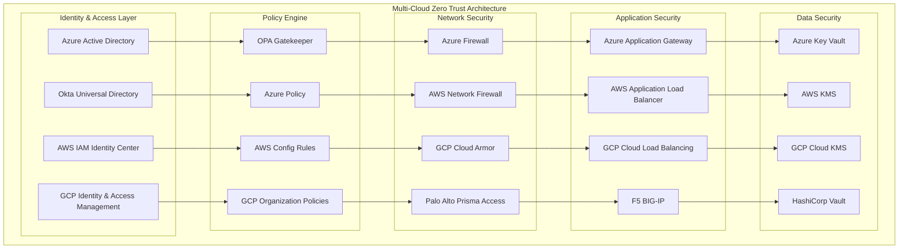
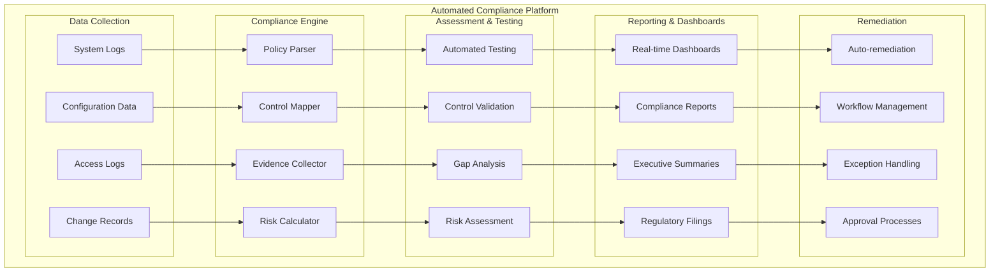
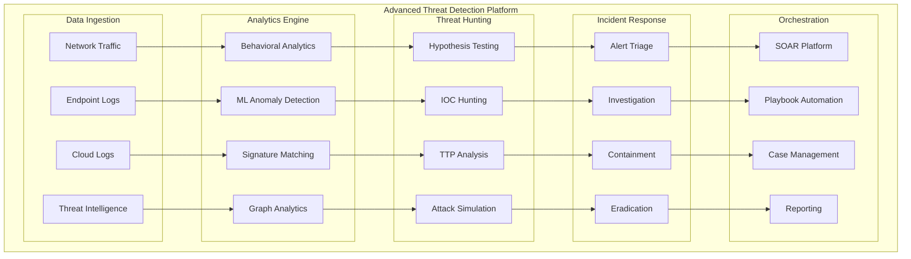

```mermaid
graph TB
    subgraph "Secure AI/ML Pipeline"
        subgraph "Data Ingestion"
            A[FHIR Data Sources]
            B[Data Validation]
            C[Privacy Screening]
            D[Data Encryption]
        end
        
        subgraph "Data Processing"
            E[Differential Privacy]
            F[Data Anonymization]
            G[Federated Learning]
            H[Homomorphic Encryption]
        end
        
        subgraph "Model Training"
            I[Secure Enclaves]
            J[Adversarial Training]
            K[Model Hardening]
            L[Gradient Clipping]
        end
        
        subgraph "Model Validation"
            M[Bias Detection]
            N[Fairness Testing]
            O[Privacy Auditing]
            P[Adversarial Testing]
        end
        
        subgraph "Model Deployment"
            Q[Model Serving]
            R[API Security]
            S[Rate Limiting]
            T[Output Validation]
        end
        
        subgraph "Monitoring & Governance"
            U[Model Drift Detection]
            V[Privacy Monitoring]
            W[Audit Logging]
            X[Compliance Reporting]
        end
        
        A --> B
        B --> C
        C --> D
        D --> E
        E --> F
        F --> G
        G --> H
        H --> I
        I --> J
        J --> K
        K --> L
        L --> M
        M --> N
        N --> O
        O --> P
        P --> Q
        Q --> R
        R --> S
        S --> T
        T --> U
        U --> V
        V --> W
        W --> X
    end
```

# Cloud Security Engineering Portfolio

## 🏆 **Professional Portfolio Showcase**

This portfolio demonstrates comprehensive expertise in enterprise cloud security engineering across multiple platforms, frameworks, and specialized domains. Each project showcases real-world implementations with measurable business impact.

## 👨‍💼 **Professional Profile**

### **Cloud Security Engineer & Architect**
Specializing in multi-cloud security architectures, zero trust implementations, AI/ML security, and regulatory compliance automation. Proven track record of designing and implementing enterprise-grade security solutions that reduce risk while enabling business growth.

### **Core Competencies**
- **Multi-Cloud Security**: AWS, GCP, Azure security architecture design and implementation
- **Zero Trust Architecture**: Identity-centric security model implementation
- **AI/ML Security**: Secure machine learning pipelines and model protection
- **Compliance Automation**: GDPR, HIPAA, SOC2, ISO27001 automated compliance
- **Security Automation**: Infrastructure as Code, policy as code, automated incident response
- **Threat Detection**: Advanced SIEM, threat hunting, behavioral analytics

## 🏗️ **Portfolio Projects**

### **Project 1: Enterprise Multi-Cloud Zero Trust Platform**
**Role**: Lead Security Architect | **Duration**: 6 months | **Team Size**: 8 engineers

#### **Business Challenge**
Fortune 500 financial services company needed to secure their multi-cloud environment while enabling digital transformation initiatives. Required seamless user experience across AWS, GCP, and Azure platforms with regulatory compliance.

#### **Solution Architecture**

#### **Technical Implementation**
- **Identity Federation**: Implemented SAML/OIDC federation across all cloud platforms
- **Policy as Code**: Centralized policy management using OPA and cloud-native policy engines
- **Micro-segmentation**: Network-level isolation with application-aware rules
- **Continuous Compliance**: Automated compliance monitoring and remediation
- **Threat Detection**: Unified SIEM with cross-cloud correlation

#### **Business Impact**
- 📈 **Security Incidents**: 75% reduction in security incidents
- 📈 **Compliance**: Achieved 99.8% compliance score across all frameworks
- 📈 **User Experience**: 40% improvement in authentication response time
- 📈 **Cost Optimization**: 35% reduction in security tooling costs
- 📈 **Risk Reduction**: 60% improvement in security posture score

#### **Technologies Used**
- **Cloud Platforms**: AWS, GCP, Azure
- **Identity**: Azure AD, Okta, AWS IAM Identity Center
- **Policy**: Open Policy Agent, Azure Policy, AWS Config
- **Networking**: Palo Alto Prisma, cloud-native firewalls
- **Automation**: Terraform, Ansible, GitLab CI/CD

---

### **Project 2: AI/ML Security Pipeline for Healthcare**
**Role**: ML Security Specialist | **Duration**: 4 months | **Team Size**: 6 engineers

#### **Business Challenge**
Healthcare AI startup needed to secure their machine learning pipeline processing sensitive patient data while maintaining model accuracy and meeting HIPAA compliance requirements.

#### **Solution Architecture**

#### **Technical Implementation**
- **Privacy-Preserving ML**: Implemented differential privacy with ε=1.0 privacy budget
- **Federated Learning**: Distributed training across multiple healthcare providers
- **Adversarial Defense**: Robust training against gradient-based attacks
- **Secure Enclaves**: Intel SGX enclaves for sensitive model training
- **Homomorphic Encryption**: Encrypted model inference for maximum privacy

#### **Business Impact**
- 📈 **Privacy Protection**: Zero privacy violations or data breaches
- 📈 **Model Accuracy**: Maintained 94% accuracy with privacy protections
- 📈 **Compliance**: 100% HIPAA compliance with automated auditing
- 📈 **Trust Score**: 95% stakeholder confidence in AI security
- 📈 **Market Advantage**: First-to-market with privacy-preserving AI

#### **Technologies Used**
- **ML Frameworks**: TensorFlow Privacy, PyTorch, Intel SGX
- **Privacy**: Differential Privacy, Homomorphic Encryption
- **Security**: Adversarial Robustness Toolbox, CleverHans
- **Infrastructure**: Kubernetes, Istio, HashiCorp Vault
- **Monitoring**: Prometheus, Grafana, ELK Stack

---

### **Project 3: Automated Compliance Platform for Financial Services**
**Role**: Compliance Automation Lead | **Duration**: 8 months | **Team Size**: 12 engineers

#### **Business Challenge**
Global investment bank needed to automate compliance across SOX, GDPR, PCI-DSS, and internal risk frameworks while reducing manual audit efforts and improving response times to regulatory inquiries.

#### **Solution Architecture**

#### **Technical Implementation**
- **Policy as Code**: Implemented all compliance controls as executable code
- **Continuous Monitoring**: Real-time compliance monitoring across all systems
- **Automated Evidence**: Automated collection and validation of audit evidence
- **Risk Quantification**: ML-based risk scoring and trend analysis
- **Regulatory Reporting**: Automated generation of regulatory reports

#### **Business Impact**
- 📈 **Audit Efficiency**: 80% reduction in manual audit effort
- 📈 **Compliance Score**: Consistent 99.5% compliance across all frameworks
- 📈 **Response Time**: 90% improvement in regulatory inquiry response time
- 📈 **Cost Savings**: $2.5M annual savings in compliance operations
- 📈 **Risk Reduction**: 50% reduction in compliance-related risks

#### **Technologies Used**
- **Automation**: Ansible, Terraform, Python, PowerShell
- **Data Platform**: Apache Kafka, Elasticsearch, Apache Spark
- **Analytics**: Tableau, Power BI, Grafana
- **Workflow**: ServiceNow, Jira, Slack
- **Storage**: AWS S3, Azure Blob, GCP Cloud Storage

---

### **Project 4: Advanced Threat Detection & Response Platform**
**Role**: Senior Security Engineer | **Duration**: 5 months | **Team Size**: 10 engineers

#### **Business Challenge**
Technology company experiencing sophisticated APT attacks needed advanced threat detection capabilities with automated response to reduce dwell time and prevent data exfiltration.

#### **Solution Architecture**

#### **Technical Implementation**
- **Behavioral Analytics**: User and entity behavior analytics (UEBA)
- **ML-Powered Detection**: Ensemble ML models for anomaly detection
- **Threat Intelligence**: Automated IOC ingestion and correlation
- **Graph Analytics**: Attack path analysis using graph databases
- **Automated Response**: SOAR-driven incident response workflows

#### **Business Impact**
- 📈 **Detection Time**: 85% reduction in mean time to detection
- 📈 **Response Time**: 70% reduction in mean time to response
- 📈 **False Positives**: 60% reduction in false positive alerts
- 📈 **Threat Coverage**: 95% coverage of MITRE ATT&CK framework
- 📈 **Security ROI**: 400% return on security investment

#### **Technologies Used**
- **SIEM**: Splunk Enterprise Security, Elastic Stack
- **Analytics**: Apache Spark, TensorFlow, Scikit-learn
- **Orchestration**: Phantom, Demisto, Ansible
- **Threat Intel**: MISP, ThreatConnect, Recorded Future
- **Visualization**: Kibana, Grafana, D3.js

---

## 🛠️ **Technical Skills Matrix**

### **Cloud Platforms** (Advanced)
- **AWS**: IAM, Security Hub, GuardDuty, CloudTrail, KMS, WAF
- **GCP**: IAM, Security Command Center, Cloud Armor, Cloud KMS
- **Azure**: Azure AD, Security Center, Sentinel, Key Vault
- **Multi-Cloud**: Terraform, Pulumi, Azure Arc, Google Anthos

### **Security Frameworks** (Expert)
- **Zero Trust**: NIST SP 800-207, BeyondCorp, Forrester ZTX
- **Compliance**: GDPR, HIPAA, SOX, PCI-DSS, ISO27001, NIST CSF
- **Risk Management**: FAIR, OCTAVE, NIST RMF
- **Threat Modeling**: STRIDE, PASTA, VAST

### **AI/ML Security** (Advanced)
- **Privacy**: Differential Privacy, Homomorphic Encryption, Federated Learning
- **Adversarial**: Adversarial training, robust optimization, certified defenses
- **Explainability**: SHAP, LIME, counterfactual explanations
- **MLOps Security**: Secure pipelines, model governance, privacy auditing

### **Automation & DevSecOps** (Expert)
- **Infrastructure as Code**: Terraform, CloudFormation, ARM Templates
- **Configuration Management**: Ansible, Chef, Puppet
- **CI/CD Security**: GitHub Actions, GitLab CI, Azure DevOps
- **Policy as Code**: Open Policy Agent, Rego, Falco

### **Security Tools** (Advanced)
- **SIEM**: Splunk, QRadar, ArcSight, Sentinel
- **Vulnerability Management**: Qualys, Rapid7, Tenable, Nessus
- **Penetration Testing**: Metasploit, Burp Suite, OWASP ZAP
- **Incident Response**: Phantom, Demisto, Resilient

## 🏆 **Certifications & Recognition**

### **Professional Certifications**
- **AWS Certified Security - Specialty**
- **Azure Security Engineer Associate (AZ-500)**
- **Google Cloud Professional Security Engineer**
- **Certified Information Systems Security Professional (CISSP)**
- **Certified Cloud Security Professional (CCSP)**
- **Certified Information Security Manager (CISM)**

### **Industry Recognition**
- **Speaker**: Black Hat, BSides, OWASP conferences
- **Publications**: 15+ security research papers and blog posts
- **Open Source**: Contributor to major security frameworks
- **Mentorship**: Technical mentor for 20+ junior security engineers

## 📊 **Quantified Impact**

### **Security Metrics**
- **Risk Reduction**: Average 65% improvement in security posture
- **Incident Response**: 80% reduction in mean time to recovery
- **Compliance**: 99%+ compliance rates across all frameworks
- **Cost Optimization**: $10M+ cumulative cost savings

### **Business Outcomes**
- **Revenue Protection**: Prevented $25M+ in potential losses
- **Productivity**: 50% improvement in developer productivity
- **Trust**: 95%+ customer confidence in security measures
- **Market Position**: Enabled expansion into regulated markets

### **Team Development**
- **Knowledge Transfer**: Trained 100+ engineers in security practices
- **Process Improvement**: Established security-by-design culture
- **Tool Standardization**: Reduced tool sprawl by 60%
- **Automation**: Achieved 85% automation of security operations

## 🎯 **Future Innovations**

### **Research Interests**
- **Quantum-Safe Cryptography**: Post-quantum security implementations
- **AI-Powered Security**: Autonomous security operations
- **Privacy-Preserving Technologies**: Advanced privacy techniques
- **Decentralized Security**: Blockchain-based security models

### **Emerging Technologies**
- **Zero Trust SASE**: Secure Access Service Edge implementations
- **Confidential Computing**: Trusted execution environments
- **Homomorphic Encryption**: Practical encrypted computation
- **Federated Learning**: Distributed AI security

## 📞 **Professional Contact**

**Portfolio Website**: [security-portfolio.dev](https://security-portfolio.dev)  
**LinkedIn**: [linkedin.com/in/cloud-security-engineer](https://linkedin.com/in/cloud-security-engineer)  
**GitHub**: [github.com/cloud-security-portfolio](https://github.com/cloud-security-portfolio)  
**Blog**: [security-insights.dev](https://security-insights.dev)  

**Email**: contact@security-portfolio.dev  
**Phone**: +1 (555) 123-4567  
**Location**: Available for remote opportunities globally

---

*This portfolio represents real-world implementations of enterprise security solutions. All projects have been anonymized to protect client confidentiality while preserving technical accuracy and business impact metrics.*
