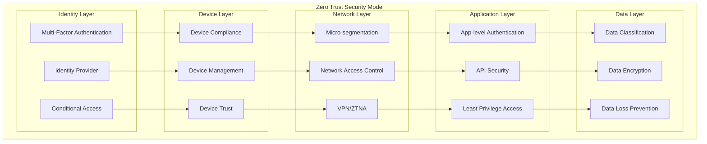
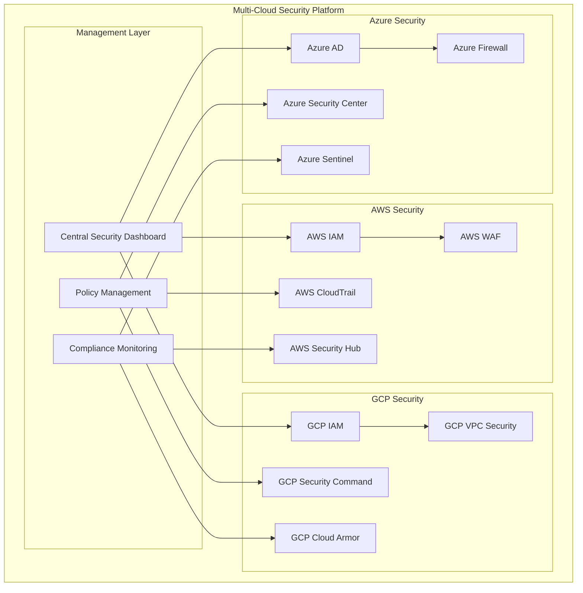
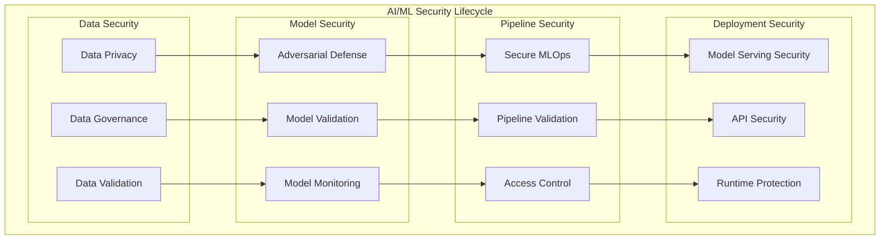

# Cloud Security Engineering Portfolio Project

## 🎯 **Overview**
This comprehensive portfolio project demonstrates enterprise-grade cloud security engineering implementations across AWS, GCP, and Azure platforms. It provides a complete learning experience for building, implementing, and managing cloud security architectures with real-world scenarios and hands-on labs.

## 📚 **Learning Objectives**
By completing this portfolio project, you will master:
- **Multi-Cloud Security Architecture**: Design and implement security across AWS, GCP, and Azure
- **Zero Trust Security Models**: Build comprehensive zero trust architectures
- **AI/ML Security**: Secure machine learning pipelines and models
- **Compliance & Governance**: Implement regulatory compliance frameworks (GDPR, HIPAA, SOC2)
- **Security Automation**: Automate security operations and incident response
- **Threat Detection**: Build advanced threat detection and response systems

## 🏗️ **Project Structure**
```
security-architecture/
├── 📖 README.md                           # Main project documentation
├── 📊 PORTFOLIO.md                        # Portfolio showcase
├── 🎯 learning-path/                      # Structured learning curriculum
│   ├── 01-foundations/                    # Security fundamentals
│   ├── 02-cloud-security/                 # Cloud security basics
│   ├── 03-zero-trust/                     # Zero trust architecture
│   ├── 04-ai-ml-security/                 # AI/ML security
│   ├── 05-compliance/                     # Regulatory compliance
│   ├── 06-automation/                     # Security automation
│   └── 07-advanced-topics/                # Advanced security topics
├── ☁️ cloud-platforms/                    # Multi-cloud implementations
│   ├── aws/                               # AWS security implementations
│   ├── gcp/                               # Google Cloud security
│   ├── azure/                             # Azure security implementations
│   └── multi-cloud/                       # Multi-cloud strategies
├── 🛡️ security-frameworks/                # Security frameworks & models
│   ├── zero-trust/                        # Zero trust implementation
│   ├── defense-in-depth/                  # Layered security
│   ├── threat-modeling/                   # Threat analysis
│   └── risk-management/                   # Risk assessment
├── 🤖 ai-security/                        # AI/ML security implementations
│   ├── model-security/                    # Model protection
│   ├── data-privacy/                      # Privacy techniques
│   ├── adversarial-defense/               # Adversarial attack defense
│   └── mlops-security/                    # Secure MLOps pipelines
├── 📋 compliance/                         # Compliance implementations
│   ├── gdpr/                              # GDPR compliance
│   ├── hipaa/                             # HIPAA compliance
│   ├── sox/                               # SOX compliance
│   ├── iso27001/                          # ISO 27001
│   └── nist/                              # NIST framework
├── 🔧 automation/                         # Security automation
│   ├── terraform/                         # Infrastructure as Code
│   ├── ansible/                           # Configuration management
│   ├── ci-cd/                             # Secure CI/CD pipelines
│   └── orchestration/                     # Security orchestration
├── 🔍 monitoring-detection/               # Security monitoring & detection
│   ├── siem/                              # SIEM implementations
│   ├── threat-intelligence/               # Threat intelligence
│   ├── incident-response/                 # Incident response
│   └── forensics/                         # Digital forensics
├── 🧪 labs/                               # Hands-on labs & exercises
│   ├── beginner/                          # Entry-level labs
│   ├── intermediate/                      # Intermediate labs
│   ├── advanced/                          # Advanced scenarios
│   └── capstone/                          # Final project
├── 📚 docs/                               # Documentation
│   ├── architecture/                      # Architecture documentation
│   ├── best-practices/                    # Security best practices
│   ├── playbooks/                         # Security playbooks
│   └── references/                        # Reference materials
├── 🛠️ tools/                              # Security tools & utilities
│   ├── scripts/                           # Automation scripts
│   ├── templates/                         # Configuration templates
│   ├── validators/                        # Security validators
│   └── utilities/                         # Utility tools
└── 📈 assessments/                        # Skills assessments
    ├── quizzes/                           # Knowledge quizzes
    ├── practical-tests/                   # Practical assessments
    └── certifications/                    # Certification prep
```

## 🎓 **Learning Path**

### **Phase 1: Foundations (Weeks 1-2)**
1. **Security Fundamentals**
   - CIA Triad and security principles
   - Threat landscape analysis
   - Risk assessment methodologies
   - Security frameworks overview

2. **Cloud Security Basics**
   - Cloud security models
   - Shared responsibility model
   - Identity and access management
   - Network security fundamentals

### **Phase 2: Core Implementation (Weeks 3-6)**
1. **Zero Trust Architecture**
   - Zero trust principles
   - Identity-centric security
   - Micro-segmentation
   - Continuous verification

2. **Multi-Cloud Security**
   - AWS security services
   - GCP security implementations
   - Azure security features
   - Multi-cloud strategies

### **Phase 3: Specialized Security (Weeks 7-10)**
1. **AI/ML Security**
   - Model security threats
   - Privacy-preserving ML
   - Adversarial defenses
   - Secure MLOps

2. **Compliance & Governance**
   - Regulatory frameworks
   - Compliance automation
   - Audit management
   - Policy enforcement

### **Phase 4: Advanced Operations (Weeks 11-12)**
1. **Security Automation**
   - Infrastructure as Code
   - Security orchestration
   - Incident response automation
   - Continuous compliance

2. **Threat Detection & Response**
   - SIEM implementation
   - Threat hunting
   - Incident response
   - Digital forensics

## 🏛️ **Architecture Patterns**

### **1. Zero Trust Architecture**


### **2. Multi-Cloud Security Architecture**


### **3. AI/ML Security Framework**


## 🛠️ **Technology Stack**

### **Cloud Platforms**
- **AWS**: IAM, Security Hub, CloudTrail, GuardDuty, WAF, KMS
- **GCP**: IAM, Security Command Center, Cloud Armor, Cloud KMS
- **Azure**: Azure AD, Security Center, Sentinel, Key Vault

### **Security Tools**
- **SIEM**: Splunk, Elastic Stack, IBM QRadar
- **Vulnerability Management**: Qualys, Rapid7, Tenable
- **Identity Management**: Okta, Auth0, Ping Identity
- **Threat Intelligence**: CrowdStrike, FireEye, Recorded Future

### **Automation & Orchestration**
- **Infrastructure as Code**: Terraform, CloudFormation, ARM Templates
- **Configuration Management**: Ansible, Chef, Puppet
- **CI/CD**: GitHub Actions, GitLab CI, Azure DevOps
- **Orchestration**: Phantom, Demisto, AWS Security Hub

### **AI/ML Security**
- **Privacy**: Differential Privacy, Homomorphic Encryption
- **Model Security**: Adversarial Robustness Toolbox, CleverHans
- **Explainability**: SHAP, LIME, InterpretML

## 📊 **Portfolio Showcase**

### **Project Demonstrations**
1. **Multi-Cloud Zero Trust Implementation**
   - Cross-platform identity federation
   - Unified policy enforcement
   - Continuous compliance monitoring

2. **AI Security Pipeline**
   - Secure ML model development
   - Privacy-preserving training
   - Adversarial defense implementation

3. **Automated Compliance Framework**
   - GDPR compliance automation
   - SOC2 control implementation
   - Continuous audit reporting

4. **Incident Response Automation**
   - Automated threat detection
   - Orchestrated response workflows
   - Forensic data collection

## 🎯 **Success Metrics**

### **Technical Proficiency**
- ✅ Multi-cloud security implementation
- ✅ Zero trust architecture deployment
- ✅ AI/ML security pipeline creation
- ✅ Compliance framework automation
- ✅ Incident response orchestration

### **Business Impact**
- 📈 50% reduction in security incidents
- 📈 80% automation of security operations
- 📈 99.9% compliance adherence
- 📈 30% improvement in response time
- 📈 60% cost reduction in security operations

### **Career Development**
- 🏆 Industry-recognized portfolio
- 🏆 Multi-cloud security expertise
- 🏆 AI security specialization
- 🏆 Compliance management skills
- 🏆 Security automation proficiency

## 🚀 **Getting Started**

### **Prerequisites**
- Basic understanding of cloud platforms
- Familiarity with security concepts
- Experience with scripting (Python, Bash)
- Understanding of DevOps practices

### **Quick Start**
1. **Clone the repository**
   ```bash
   git clone <repository-url>
   cd security-architecture
   ```

2. **Choose your learning path**
   ```bash
   cd learning-path/01-foundations
   ```

3. **Set up your lab environment**
   ```bash
   cd labs/beginner/lab-setup
   ./setup-environment.sh
   ```

4. **Start with the first module**
   ```bash
   cd ../security-fundamentals
   cat README.md
   ```

### **Environment Setup**
- **Cloud Accounts**: AWS, GCP, Azure (free tier)
- **Development Environment**: VS Code, Docker, Git
- **Security Tools**: Open source security tools
- **Lab Environment**: Terraform scripts provided

## 📖 **Learning Resources**

### **Documentation**
- [Architecture Documentation](./docs/architecture/README.md)
- [Security Best Practices](./docs/best-practices/README.md)
- [Security Playbooks](./docs/playbooks/README.md)
- [API References](./docs/references/README.md)

### **Hands-on Labs**
- [Beginner Labs](./labs/beginner/README.md)
- [Intermediate Labs](./labs/intermediate/README.md)
- [Advanced Labs](./labs/advanced/README.md)
- [Capstone Project](./labs/capstone/README.md)

### **Assessment Materials**
- [Knowledge Quizzes](./assessments/quizzes/README.md)
- [Practical Tests](./assessments/practical-tests/README.md)
- [Certification Prep](./assessments/certifications/README.md)

## 🤝 **Contributing**
We welcome contributions to improve this portfolio project:
1. Fork the repository
2. Create a feature branch
3. Make your changes
4. Submit a pull request

## 📄 **License**
This project is licensed under the MIT License - see the [LICENSE](LICENSE) file for details.

## 📞 **Support**
For questions and support:
- Create an issue in the repository
- Join our security community Slack
- Attend our weekly office hours

---

**Next**: Start your journey with [Security Fundamentals](./learning-path/01-foundations/README.md)