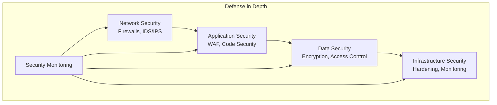
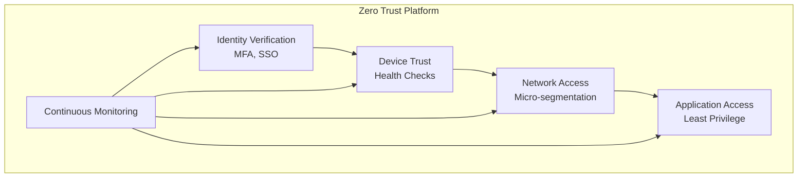
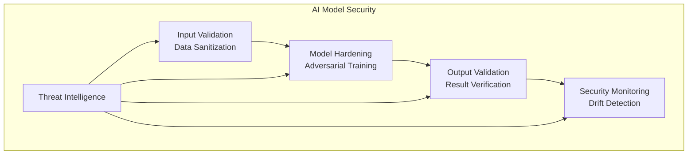

# Security Architecture Project

## Overview
This project demonstrates comprehensive security architecture implementations for enterprise AI-Data platforms, including security frameworks, AI model security, and compliance management.

## Project Structure
```
security-architecture/
├── README.md
├── defense-in-depth/
├── zero-trust-architecture/
├── ai-model-security/
├── data-privacy-compliance/
├── access-control-governance/
├── threat-detection-response/
├── security-monitoring/
├── compliance-frameworks/
└── security-automation/
```

## Getting Started
1. Choose the security component that fits your requirements
2. Review the implementation guide and code samples
3. Follow the step-by-step deployment instructions
4. Customize the configuration for your environment

## Security Components

### 1. Defense in Depth
- **Use Case**: Multi-layered security approach
- **Complexity**: High
- **Scalability**: Security layer scaling
- **Best For**: High-security environments, critical systems

### 2. Zero Trust Architecture
- **Use Case**: Continuous verification and validation
- **Complexity**: High
- **Scalability**: Trust-based scaling
- **Best For**: Modern enterprises, cloud-native platforms

### 3. AI Model Security
- **Use Case**: ML model protection and security
- **Complexity**: High
- **Scalability**: Model security scaling
- **Best For**: AI platforms, ML production systems

### 4. Data Privacy & Compliance
- **Use Case**: Regulatory compliance and data protection
- **Complexity**: High
- **Scalability**: Compliance scaling
- **Best For**: Regulated industries, data governance

### 5. Access Control & Governance
- **Use Case**: Identity and access management
- **Complexity**: Medium
- **Scalability**: Access control scaling
- **Best For**: Enterprise organizations, multi-tenant systems

### 6. Threat Detection & Response
- **Use Case**: Security monitoring and incident response
- **Complexity**: High
- **Scalability**: Threat detection scaling
- **Best For**: Security operations, threat intelligence

### 7. Security Monitoring
- **Use Case**: Continuous security monitoring
- **Complexity**: Medium
- **Scalability**: Monitoring scaling
- **Best For**: Security operations, compliance monitoring

### 8. Compliance Frameworks
- **Use Case**: Regulatory compliance management
- **Complexity**: High
- **Scalability**: Compliance scaling
- **Best For**: Regulated industries, enterprise compliance

### 9. Security Automation
- **Use Case**: Automated security operations
- **Complexity**: High
- **Scalability**: Automation scaling
- **Best For**: Security operations, DevOps teams

## Technology Stack

### Security Frameworks
- **Security Standards**: NIST Cybersecurity Framework, ISO 27001, SOC 2
- **Security Tools**: OWASP ZAP, Burp Suite, Metasploit
- **Vulnerability Management**: Qualys, Rapid7, Tenable

### AI Model Security
- **Model Security**: Adversarial Robustness Toolbox, CleverHans
- **Privacy Tools**: Differential Privacy, Homomorphic Encryption
- **Explainability**: SHAP, LIME, InterpretML

### Data Privacy & Compliance
- **Privacy Tools**: Apache Atlas, DataHub, Collibra
- **Compliance Tools**: OneTrust, TrustArc, WireWheel
- **Data Protection**: Varonis, Imperva, Protegrity

### Access Control
- **Identity Management**: Okta, Auth0, Azure AD
- **Access Control**: OPA, AWS IAM, Azure RBAC
- **Secrets Management**: HashiCorp Vault, AWS Secrets Manager

### Threat Detection
- **SIEM**: Splunk, QRadar, Exabeam
- **EDR**: CrowdStrike, Carbon Black, SentinelOne
- **Threat Intelligence**: ThreatConnect, Recorded Future, Anomali

### Security Monitoring
- **Monitoring**: Prometheus, Grafana, ELK Stack
- **Logging**: Fluentd, Logstash, Splunk
- **Alerting**: PagerDuty, Slack, Email

### Compliance Management
- **Compliance Tools**: ServiceNow, Archer, MetricStream
- **Audit Tools**: OpenSCAP, InSpec, Chef Compliance
- **Reporting**: Tableau, Power BI, Grafana

### Security Automation
- **Automation**: Ansible, Terraform, Python
- **Orchestration**: Apache Airflow, Prefect, Dagster
- **CI/CD**: GitHub Actions, GitLab CI, Jenkins

## Implementation Phases

### Phase 1: Foundation (Weeks 1-2)
1. **Security Assessment**
   - Conduct security audit
   - Identify vulnerabilities
   - Assess compliance status

2. **Basic Security**
   - Implement basic security controls
   - Set up monitoring and logging
   - Configure access controls

### Phase 2: Advanced Security (Weeks 3-6)
1. **Security Architecture**
   - Implement defense in depth
   - Set up zero trust architecture
   - Configure AI model security

2. **Compliance & Governance**
   - Implement compliance frameworks
   - Set up data privacy controls
   - Configure audit logging

### Phase 3: Operations & Optimization (Weeks 7-8)
1. **Security Operations**
   - Set up threat detection
   - Implement incident response
   - Configure security automation

2. **Continuous Improvement**
   - Monitor security metrics
   - Optimize security controls
   - Update security policies

## Success Metrics

### Security Metrics
- **Security Posture**: 100% vulnerability remediation, zero critical findings
- **Incident Response**: < 1 hour MTTR, 100% incident resolution
- **Compliance**: 100% regulatory compliance, zero violations

### Business Metrics
- **Risk Reduction**: 50% reduction in security risks
- **Cost Efficiency**: 30% reduction in security costs
- **Business Continuity**: 100% uptime, zero security breaches

### Operational Metrics
- **Security Automation**: 80% automated security operations
- **Monitoring Coverage**: 100% system coverage, real-time alerting
- **Team Productivity**: 40% increase in security team efficiency

## Security Architecture Patterns

### Defense in Depth


### Zero Trust Architecture


### AI Model Security


## Security Best Practices

### 1. **Defense in Depth**
- Implement multiple security layers
- Use redundancy and failover
- Regular security assessments

### 2. **Zero Trust Architecture**
- Verify every request
- Use least privilege access
- Implement continuous monitoring

### 3. **AI Model Security**
- Validate all inputs
- Implement model hardening
- Monitor for adversarial attacks

### 4. **Data Privacy & Compliance**
- Implement privacy by design
- Use data classification
- Regular compliance audits

### 5. **Access Control & Governance**
- Use role-based access control
- Implement multi-factor authentication
- Regular access reviews

### 6. **Threat Detection & Response**
- Implement SIEM solutions
- Use threat intelligence
- Regular incident response drills

### 7. **Security Monitoring**
- Monitor all systems
- Use structured logging
- Implement automated alerting

### 8. **Compliance Management**
- Regular compliance assessments
- Document all controls
- Implement audit trails

### 9. **Security Automation**
- Automate repetitive tasks
- Use infrastructure as code
- Implement security testing

## Security Considerations

### 1. **Identity & Access Management**
- Single sign-on (SSO)
- Multi-factor authentication (MFA)
- Role-based access control (RBAC)

### 2. **Network Security**
- Network segmentation
- Firewall configuration
- Intrusion detection/prevention

### 3. **Data Security**
- Data encryption
- Data classification
- Data loss prevention

### 4. **Application Security**
- Secure coding practices
- Security testing
- Vulnerability management

### 5. **Infrastructure Security**
- System hardening
- Patch management
- Configuration management

### 6. **Incident Response**
- Incident detection
- Response procedures
- Recovery planning

### 7. **Business Continuity**
- Disaster recovery
- Backup strategies
- Business impact analysis

### 8. **Compliance & Governance**
- Regulatory compliance
- Policy management
- Risk assessment

## Compliance Frameworks

### 1. **NIST Cybersecurity Framework**
- Identify, Protect, Detect, Respond, Recover
- Risk management approach
- Industry standard

### 2. **ISO 27001**
- Information security management
- Risk assessment
- Continuous improvement

### 3. **SOC 2**
- Security, Availability, Processing Integrity
- Confidentiality, Privacy
- Third-party assurance

### 4. **GDPR**
- Data protection regulation
- Privacy by design
- Data subject rights

### 5. **HIPAA**
- Healthcare data protection
- Privacy and security rules
- Administrative, physical, technical safeguards

### 6. **SOX**
- Financial reporting
- Internal controls
- Audit requirements

## Threat Landscape

### 1. **Common Threats**
- Phishing attacks
- Ransomware
- Data breaches
- Insider threats
- Advanced persistent threats

### 2. **AI-Specific Threats**
- Model poisoning
- Adversarial examples
- Model inversion
- Model extraction
- Data privacy attacks

### 3. **Emerging Threats**
- Supply chain attacks
- Zero-day vulnerabilities
- Social engineering
- Nation-state attacks
- Quantum computing threats

## Security Tools & Technologies

### 1. **Vulnerability Management**
- Vulnerability scanners
- Patch management
- Configuration management
- Security testing tools

### 2. **Security Monitoring**
- SIEM solutions
- Endpoint detection and response
- Network monitoring
- Log analysis tools

### 3. **Security Automation**
- Security orchestration
- Automated response
- Security testing automation
- Compliance automation

### 4. **Threat Intelligence**
- Threat feeds
- Intelligence platforms
- Sharing communities
- Analysis tools

## Next Steps
Navigate to the specific security component folder to view detailed implementation guides, code samples, and deployment instructions.
