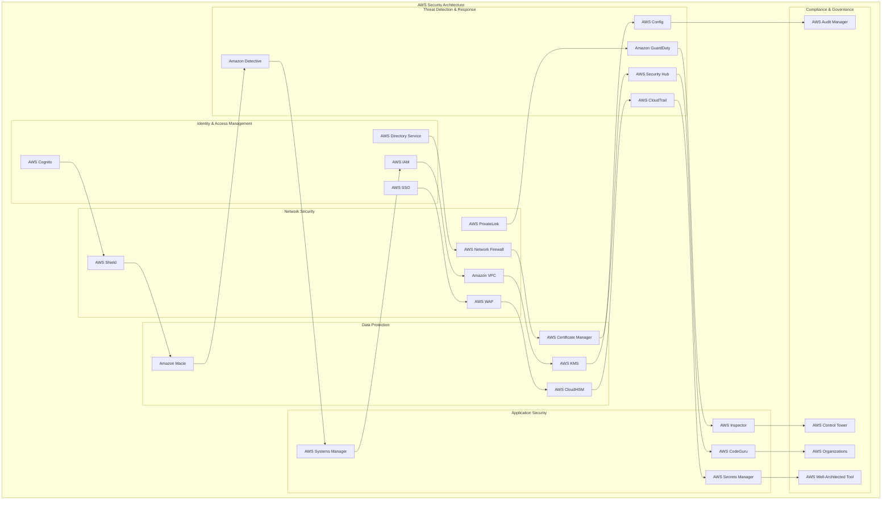
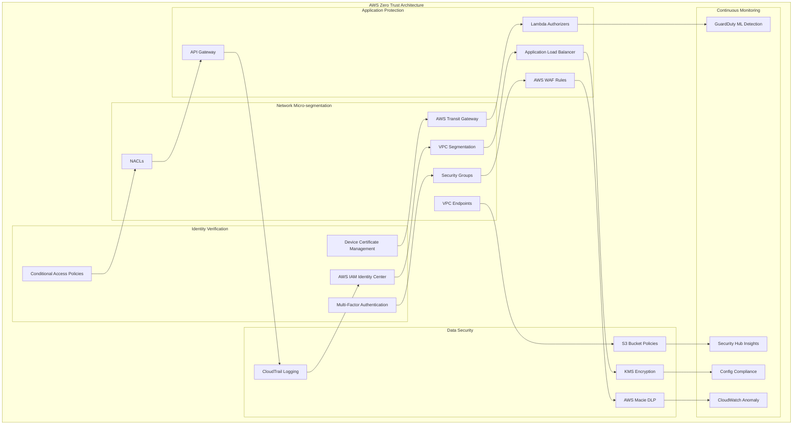
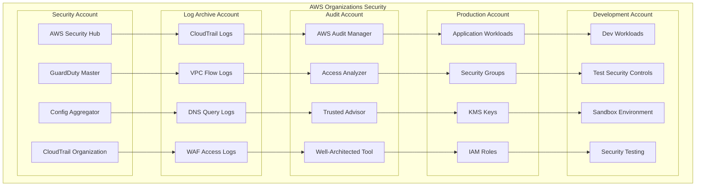

# AWS Security Architecture

## 🛡️ **Overview**
Comprehensive AWS security architecture implementing defense-in-depth, zero trust principles, and industry best practices. This architecture provides enterprise-grade security for cloud-native applications and data platforms.

## 🏗️ **AWS Security Architecture Diagram**

### **Complete AWS Security Stack**


### **AWS Zero Trust Implementation**


### **AWS Multi-Account Security Strategy**


## 🔧 **Implementation Components**

### **1. Identity & Access Management**

#### **AWS IAM Best Practices**
```json
{
  "Version": "2012-10-17",
  "Statement": [
    {
      "Sid": "AllowAssumeRoleWithMFA",
      "Effect": "Allow",
      "Principal": {
        "AWS": "arn:aws:iam::ACCOUNT-ID:root"
      },
      "Action": "sts:AssumeRole",
      "Condition": {
        "Bool": {
          "aws:MultiFactorAuthPresent": "true"
        },
        "NumericLessThan": {
          "aws:MultiFactorAuthAge": "3600"
        }
      }
    }
  ]
}
```

#### **IAM Policy for Zero Trust**
```json
{
  "Version": "2012-10-17",
  "Statement": [
    {
      "Sid": "DenyAllExceptFromTrustedNetworks",
      "Effect": "Deny",
      "Action": "*",
      "Resource": "*",
      "Condition": {
        "Bool": {
          "aws:ViaAWSService": "false"
        },
        "IpAddressIfExists": {
          "aws:SourceIp": [
            "203.0.113.0/24",
            "198.51.100.0/24"
          ]
        }
      }
    }
  ]
}
```

### **2. Network Security Implementation**

#### **VPC Security Groups Configuration**
```yaml
SecurityGroup:
  Type: AWS::EC2::SecurityGroup
  Properties:
    GroupDescription: Zero Trust Security Group
    VpcId: !Ref VPC
    SecurityGroupIngress:
      - IpProtocol: tcp
        FromPort: 443
        ToPort: 443
        SourceSecurityGroupId: !Ref ALBSecurityGroup
        Description: "HTTPS from ALB only"
    SecurityGroupEgress:
      - IpProtocol: tcp
        FromPort: 443
        ToPort: 443
        CidrIp: 0.0.0.0/0
        Description: "HTTPS outbound for API calls"
    Tags:
      - Key: Name
        Value: ZeroTrust-AppTier-SG
```

#### **Network ACL Configuration**
```yaml
NetworkAcl:
  Type: AWS::EC2::NetworkAcl
  Properties:
    VpcId: !Ref VPC
    Tags:
      - Key: Name
        Value: ZeroTrust-Private-NACL

NetworkAclEntryInbound:
  Type: AWS::EC2::NetworkAclEntry
  Properties:
    NetworkAclId: !Ref NetworkAcl
    RuleNumber: 100
    Protocol: 6
    RuleAction: allow
    CidrBlock: 10.0.1.0/24
    PortRange:
      From: 443
      To: 443
```

### **3. Data Protection Implementation**

#### **S3 Bucket Security Configuration**
```yaml
S3Bucket:
  Type: AWS::S3::Bucket
  Properties:
    BucketName: !Sub "${AWS::StackName}-secure-data"
    BucketEncryption:
      ServerSideEncryptionConfiguration:
        - ServerSideEncryptionByDefault:
            SSEAlgorithm: aws:kms
            KMSMasterKeyID: !Ref KMSKey
          BucketKeyEnabled: true
    PublicAccessBlockConfiguration:
      BlockPublicAcls: true
      BlockPublicPolicy: true
      IgnorePublicAcls: true
      RestrictPublicBuckets: true
    VersioningConfiguration:
      Status: Enabled
    LoggingConfiguration:
      DestinationBucketName: !Ref LoggingBucket
      LogFilePrefix: access-logs/
```

#### **KMS Key Policy**
```json
{
  "Version": "2012-10-17",
  "Statement": [
    {
      "Sid": "Enable IAM User Permissions",
      "Effect": "Allow",
      "Principal": {
        "AWS": "arn:aws:iam::ACCOUNT-ID:root"
      },
      "Action": "kms:*",
      "Resource": "*"
    },
    {
      "Sid": "Allow use of the key for encryption",
      "Effect": "Allow",
      "Principal": {
        "AWS": [
          "arn:aws:iam::ACCOUNT-ID:role/DataProcessingRole"
        ]
      },
      "Action": [
        "kms:Encrypt",
        "kms:Decrypt",
        "kms:ReEncrypt*",
        "kms:GenerateDataKey*",
        "kms:DescribeKey"
      ],
      "Resource": "*",
      "Condition": {
        "StringEquals": {
          "kms:ViaService": [
            "s3.us-east-1.amazonaws.com",
            "dynamodb.us-east-1.amazonaws.com"
          ]
        }
      }
    }
  ]
}
```

### **4. Threat Detection Configuration**

#### **GuardDuty Integration**
```python
import boto3
import json

class AWSGuardDutyManager:
    def __init__(self, region='us-east-1'):
        self.guardduty = boto3.client('guardduty', region_name=region)
        self.securityhub = boto3.client('securityhub', region_name=region)
    
    def enable_guardduty(self):
        """Enable GuardDuty and configure threat intelligence"""
        try:
            # Create detector
            response = self.guardduty.create_detector(
                Enable=True,
                FindingPublishingFrequency='FIFTEEN_MINUTES',
                DataSources={
                    'S3Logs': {'Enable': True},
                    'KubernetesAuditLogs': {'Enable': True},
                    'MalwareProtection': {'Enable': True}
                }
            )
            
            detector_id = response['DetectorId']
            
            # Configure threat intelligence
            self.guardduty.create_threat_intel_set(
                DetectorId=detector_id,
                Name='CustomThreatIntel',
                Format='TXT',
                Location='s3://my-threat-intel-bucket/indicators.txt',
                Activate=True
            )
            
            return detector_id
            
        except Exception as e:
            print(f"Error enabling GuardDuty: {str(e)}")
            return None
    
    def configure_custom_rules(self, detector_id):
        """Configure custom detection rules"""
        # Custom rules for specific threat patterns
        custom_rules = [
            {
                'Name': 'SuspiciousAPIActivity',
                'Description': 'Detect unusual API call patterns',
                'Severity': 'HIGH',
                'Type': 'Behavior:EC2/NetworkPortUnusual'
            }
        ]
        
        for rule in custom_rules:
            try:
                self.guardduty.create_detector(
                    DetectorId=detector_id,
                    Name=rule['Name'],
                    Description=rule['Description']
                )
            except Exception as e:
                print(f"Error creating rule {rule['Name']}: {str(e)}")
```

#### **Security Hub Configuration**
```python
class AWSSecurityHubManager:
    def __init__(self, region='us-east-1'):
        self.securityhub = boto3.client('securityhub', region_name=region)
    
    def enable_security_hub(self):
        """Enable Security Hub and configure standards"""
        try:
            # Enable Security Hub
            self.securityhub.enable_security_hub(
                Tags={
                    'Environment': 'Production',
                    'Owner': 'SecurityTeam'
                },
                EnableDefaultStandards=True
            )
            
            # Subscribe to additional standards
            standards = [
                'arn:aws:securityhub:::standard/aws-foundational-security',
                'arn:aws:securityhub:::standard/pci-dss/v/3.2.1',
                'arn:aws:securityhub:::standard/cis-aws-foundations-benchmark/v/1.2.0'
            ]
            
            for standard in standards:
                self.securityhub.batch_enable_standards(
                    StandardsSubscriptionRequests=[
                        {
                            'StandardsArn': standard,
                            'StandardsInput': {}
                        }
                    ]
                )
            
            return True
            
        except Exception as e:
            print(f"Error enabling Security Hub: {str(e)}")
            return False
    
    def create_custom_insight(self):
        """Create custom security insights"""
        insight = {
            'Name': 'Critical Security Findings',
            'Filters': {
                'SeverityLabel': [
                    {
                        'Value': 'CRITICAL',
                        'Comparison': 'EQUALS'
                    }
                ],
                'WorkflowStatus': [
                    {
                        'Value': 'NEW',
                        'Comparison': 'EQUALS'
                    }
                ]
            },
            'GroupByAttribute': 'Type'
        }
        
        try:
            response = self.securityhub.create_insight(**insight)
            return response['InsightArn']
        except Exception as e:
            print(f"Error creating insight: {str(e)}")
            return None
```

### **5. Compliance Automation**

#### **AWS Config Rules for SOC2**
```yaml
ConfigRule:
  Type: AWS::Config::ConfigRule
  Properties:
    ConfigRuleName: s3-bucket-ssl-requests-only
    Description: Checks whether S3 buckets have policies that require requests to use Secure Socket Layer (SSL).
    Source:
      Owner: AWS
      SourceIdentifier: S3_BUCKET_SSL_REQUESTS_ONLY
    DependsOn: ConfigurationRecorder

RemediationConfiguration:
  Type: AWS::Config::RemediationConfiguration
  Properties:
    ConfigRuleName: !Ref ConfigRule
    TargetType: SSM_DOCUMENT
    TargetId: AWSConfigRemediation-EnforceSSLRequestsOnly
    TargetVersion: "1"
    Parameters:
      AutomationAssumeRole:
        StaticValue: !GetAtt RemediationRole.Arn
      BucketName:
        ResourceValue: RESOURCE_ID
    Automatic: true
    MaximumAutomaticAttempts: 3
```

#### **GDPR Compliance Automation**
```python
class GDPRComplianceChecker:
    def __init__(self):
        self.s3 = boto3.client('s3')
        self.rds = boto3.client('rds')
        self.dynamodb = boto3.client('dynamodb')
    
    def check_data_encryption(self):
        """Check encryption status of data stores"""
        compliance_report = {
            's3_buckets': [],
            'rds_instances': [],
            'dynamodb_tables': []
        }
        
        # Check S3 bucket encryption
        buckets = self.s3.list_buckets()['Buckets']
        for bucket in buckets:
            bucket_name = bucket['Name']
            try:
                encryption = self.s3.get_bucket_encryption(Bucket=bucket_name)
                compliance_report['s3_buckets'].append({
                    'bucket': bucket_name,
                    'encrypted': True,
                    'algorithm': encryption['ServerSideEncryptionConfiguration']['Rules'][0]['ApplyServerSideEncryptionByDefault']['SSEAlgorithm']
                })
            except:
                compliance_report['s3_buckets'].append({
                    'bucket': bucket_name,
                    'encrypted': False,
                    'algorithm': None
                })
        
        # Check RDS encryption
        instances = self.rds.describe_db_instances()['DBInstances']
        for instance in instances:
            compliance_report['rds_instances'].append({
                'instance': instance['DBInstanceIdentifier'],
                'encrypted': instance.get('StorageEncrypted', False),
                'kms_key': instance.get('KmsKeyId', None)
            })
        
        return compliance_report
    
    def check_data_retention(self):
        """Check data retention policies"""
        # Implementation for checking data retention policies
        pass
    
    def check_right_to_be_forgotten(self):
        """Check implementation of right to be forgotten"""
        # Implementation for GDPR right to be forgotten
        pass
```

### **6. Incident Response Automation**

#### **Automated Incident Response**
```python
import boto3
import json
from datetime import datetime

class AWSIncidentResponse:
    def __init__(self):
        self.ec2 = boto3.client('ec2')
        self.iam = boto3.client('iam')
        self.sns = boto3.client('sns')
        self.ssm = boto3.client('ssm')
    
    def respond_to_security_finding(self, finding):
        """Automated response to security findings"""
        finding_type = finding.get('Type', '')
        severity = finding.get('Severity', {}).get('Label', '')
        
        if severity == 'CRITICAL':
            self.execute_critical_response(finding)
        elif severity == 'HIGH':
            self.execute_high_response(finding)
        else:
            self.execute_standard_response(finding)
    
    def execute_critical_response(self, finding):
        """Execute critical incident response"""
        # 1. Isolate affected resources
        resource_id = finding.get('Resources', [{}])[0].get('Id', '')
        if 'i-' in resource_id:  # EC2 instance
            self.isolate_ec2_instance(resource_id)
        
        # 2. Disable compromised users
        if finding['Type'] == 'BreachedUser':
            user_name = finding.get('UserName', '')
            self.disable_iam_user(user_name)
        
        # 3. Send immediate alerts
        self.send_critical_alert(finding)
        
        # 4. Create forensic snapshot
        self.create_forensic_snapshot(resource_id)
    
    def isolate_ec2_instance(self, instance_id):
        """Isolate EC2 instance by applying quarantine security group"""
        try:
            # Create quarantine security group if it doesn't exist
            quarantine_sg = self.create_quarantine_security_group()
            
            # Modify instance security groups
            self.ec2.modify_instance_attribute(
                InstanceId=instance_id,
                Groups=[quarantine_sg]
            )
            
            print(f"Instance {instance_id} isolated successfully")
            
        except Exception as e:
            print(f"Error isolating instance {instance_id}: {str(e)}")
    
    def create_quarantine_security_group(self):
        """Create quarantine security group"""
        try:
            # Get VPC ID
            instance = self.ec2.describe_instances(InstanceIds=[instance_id])
            vpc_id = instance['Reservations'][0]['Instances'][0]['VpcId']
            
            # Create security group
            sg = self.ec2.create_security_group(
                GroupName='quarantine-sg',
                Description='Quarantine security group for incident response',
                VpcId=vpc_id
            )
            
            # Add minimal egress rules for forensics
            self.ec2.authorize_security_group_egress(
                GroupId=sg['GroupId'],
                IpPermissions=[
                    {
                        'IpProtocol': 'tcp',
                        'FromPort': 443,
                        'ToPort': 443,
                        'IpRanges': [{'CidrIp': '0.0.0.0/0'}]
                    }
                ]
            )
            
            return sg['GroupId']
            
        except Exception as e:
            print(f"Error creating quarantine security group: {str(e)}")
            return None
    
    def disable_iam_user(self, user_name):
        """Disable IAM user account"""
        try:
            # Attach deny-all policy
            deny_policy = {
                "Version": "2012-10-17",
                "Statement": [
                    {
                        "Effect": "Deny",
                        "Action": "*",
                        "Resource": "*"
                    }
                ]
            }
            
            self.iam.put_user_policy(
                UserName=user_name,
                PolicyName='IncidentResponseDenyAll',
                PolicyDocument=json.dumps(deny_policy)
            )
            
            print(f"User {user_name} disabled successfully")
            
        except Exception as e:
            print(f"Error disabling user {user_name}: {str(e)}")
    
    def send_critical_alert(self, finding):
        """Send critical security alert"""
        message = {
            "alert_type": "CRITICAL_SECURITY_INCIDENT",
            "timestamp": datetime.utcnow().isoformat(),
            "finding": finding,
            "response_actions": [
                "Resource isolation initiated",
                "Affected users disabled",
                "Forensic collection started"
            ]
        }
        
        self.sns.publish(
            TopicArn='arn:aws:sns:us-east-1:123456789012:security-alerts',
            Message=json.dumps(message),
            Subject='CRITICAL: Security Incident Detected'
        )
```

## 📊 **Security Metrics & Monitoring**

### **CloudWatch Security Dashboard**
```python
class SecurityMetricsDashboard:
    def __init__(self):
        self.cloudwatch = boto3.client('cloudwatch')
    
    def create_security_dashboard(self):
        """Create comprehensive security metrics dashboard"""
        dashboard_body = {
            "widgets": [
                {
                    "type": "metric",
                    "properties": {
                        "metrics": [
                            ["AWS/GuardDuty", "FindingCount", "DetectorId", "detector-id"]
                        ],
                        "period": 300,
                        "stat": "Sum",
                        "region": "us-east-1",
                        "title": "GuardDuty Findings"
                    }
                },
                {
                    "type": "log",
                    "properties": {
                        "query": "SOURCE '/aws/lambda/security-function' | fields @timestamp, @message | filter @message like /ERROR/ | sort @timestamp desc | limit 100",
                        "region": "us-east-1",
                        "title": "Security Function Errors"
                    }
                }
            ]
        }
        
        self.cloudwatch.put_dashboard(
            DashboardName='SecurityMetrics',
            DashboardBody=json.dumps(dashboard_body)
        )
```

## 🔐 **Security Best Practices**

### **1. Identity & Access Management**
- Use IAM roles instead of users for applications
- Implement least privilege principle
- Enable MFA for all privileged accounts
- Regular access reviews and certification
- Use temporary credentials (STS)

### **2. Network Security**
- Implement VPC flow logs
- Use private subnets for application tiers
- Enable GuardDuty DNS protection
- Implement WAF rules for common attacks
- Use VPC endpoints for AWS services

### **3. Data Protection**
- Encrypt data at rest and in transit
- Use AWS KMS for key management
- Implement data classification
- Enable versioning and MFA delete
- Regular backup and recovery testing

### **4. Monitoring & Logging**
- Enable CloudTrail in all regions
- Centralize log collection
- Implement real-time alerting
- Use Security Hub for finding aggregation
- Regular security assessments

### **5. Incident Response**
- Automated response workflows
- Forensic data collection
- Communication procedures
- Regular incident response drills
- Post-incident analysis and improvement

## 📚 **Implementation Guides**

1. **[IAM Zero Trust Setup](./guides/iam-zero-trust.md)**
2. **[Network Security Configuration](./guides/network-security.md)**
3. **[GuardDuty Advanced Setup](./guides/guardduty-setup.md)**
4. **[Security Hub Integration](./guides/securityhub-integration.md)**
5. **[Incident Response Automation](./guides/incident-response.md)**

## 🧪 **Hands-on Labs**

1. **[Lab 1: Zero Trust IAM](./labs/lab01-zero-trust-iam.md)**
2. **[Lab 2: Network Security](./labs/lab02-network-security.md)**
3. **[Lab 3: Threat Detection](./labs/lab03-threat-detection.md)**
4. **[Lab 4: Compliance Automation](./labs/lab04-compliance.md)**
5. **[Lab 5: Incident Response](./labs/lab05-incident-response.md)**

---

**Next**: [GCP Security Architecture](../gcp/README.md)
