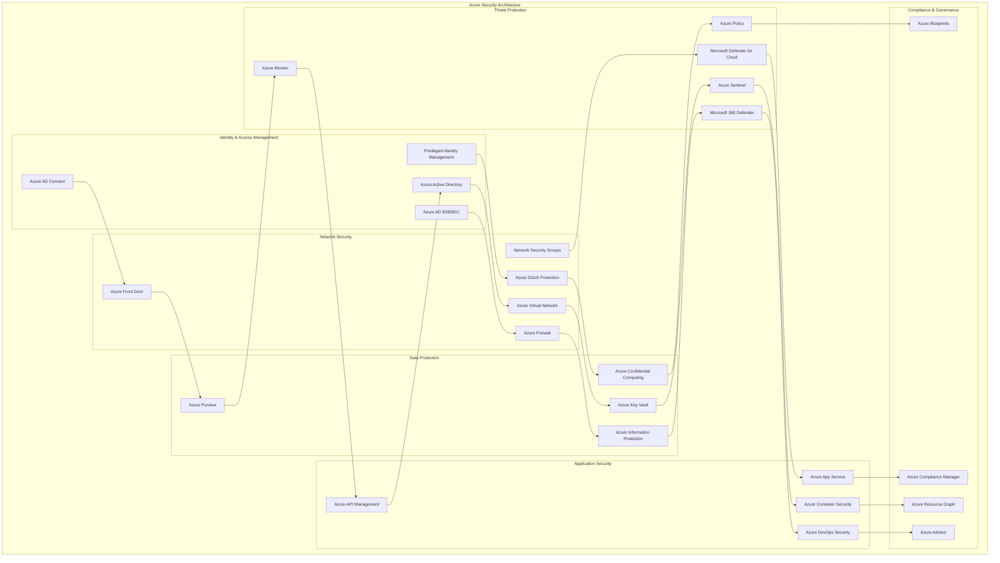
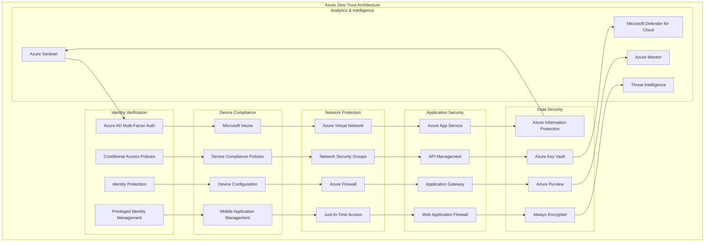
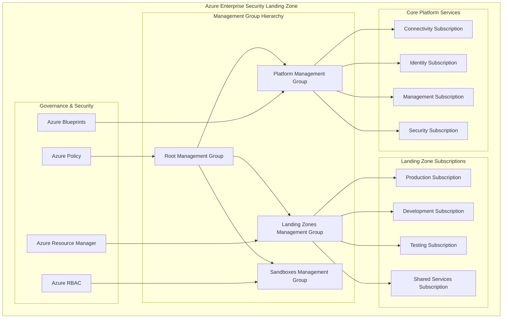

# Microsoft Azure Security Architecture

## 🛡️ **Overview**
Comprehensive Azure security architecture implementing Microsoft's Zero Trust security model, advanced threat protection, and enterprise-grade compliance frameworks. This architecture leverages Azure's native security services and Microsoft's cybersecurity expertise.

## 🏗️ **Azure Security Architecture Diagram**

### **Complete Azure Security Stack**


### **Azure Zero Trust Implementation**


### **Azure Enterprise Security Landing Zone**


## 🔧 **Implementation Components**

### **1. Identity & Access Management**

#### **Azure AD Conditional Access Policies**
```json
{
  "displayName": "Zero Trust High Risk Users Policy",
  "state": "enabled",
  "conditions": {
    "users": {
      "includeUsers": ["All"],
      "excludeUsers": ["BreakGlassAccount1", "BreakGlassAccount2"]
    },
    "applications": {
      "includeApplications": ["All"]
    },
    "userRiskLevels": ["high"],
    "signInRiskLevels": ["high"],
    "platforms": {
      "includePlatforms": ["All"]
    },
    "locations": {
      "includeLocations": ["All"],
      "excludeLocations": ["AllTrusted"]
    }
  },
  "grantControls": {
    "operator": "AND",
    "builtInControls": [
      "mfa",
      "compliantDevice",
      "passwordChange"
    ]
  },
  "sessionControls": {
    "signInFrequency": {
      "value": 1,
      "type": "hours",
      "isEnabled": true
    },
    "persistentBrowser": {
      "mode": "never",
      "isEnabled": true
    }
  }
}
```

#### **Privileged Identity Management Configuration**
```python
from azure.identity import DefaultAzureCredential
from azure.mgmt.authorization import AuthorizationManagementClient
import json

class AzurePIMManager:
    def __init__(self, subscription_id, tenant_id):
        self.subscription_id = subscription_id
        self.tenant_id = tenant_id
        self.credential = DefaultAzureCredential()
        self.auth_client = AuthorizationManagementClient(
            self.credential, 
            subscription_id
        )
    
    def create_eligible_role_assignment(self, principal_id, role_definition_id, scope):
        """Create eligible role assignment in PIM"""
        assignment_name = "12345678-1234-1234-1234-123456789012"
        
        role_assignment_schedule_request = {
            "properties": {
                "principalId": principal_id,
                "roleDefinitionId": role_definition_id,
                "requestType": "AdminAssign",
                "scheduleInfo": {
                    "startDateTime": "2024-01-01T00:00:00Z",
                    "expiration": {
                        "type": "AfterDuration",
                        "duration": "PT8H"  # 8 hours
                    }
                },
                "justification": "Zero Trust privileged access",
                "ticketInfo": {
                    "ticketNumber": "SECURITY-2024-001",
                    "ticketSystem": "ServiceNow"
                }
            }
        }
        
        return self.auth_client.role_assignment_schedule_requests.create(
            scope=scope,
            role_assignment_schedule_request_name=assignment_name,
            parameters=role_assignment_schedule_request
        )
    
    def configure_pim_settings(self, role_definition_id):
        """Configure PIM role settings"""
        role_management_policy = {
            "properties": {
                "scope": f"/subscriptions/{self.subscription_id}",
                "roleDefinitionId": role_definition_id,
                "policyRule": [
                    {
                        "ruleType": "RoleManagementPolicyExpirationRule",
                        "id": "Expiration_Admin_Assignment",
                        "isExpirationRequired": True,
                        "maximumDuration": "P365D"  # 1 year max
                    },
                    {
                        "ruleType": "RoleManagementPolicyEnablementRule",
                        "id": "Enablement_Admin_Assignment",
                        "enabledRules": [
                            "MultiFactorAuthentication",
                            "Justification",
                            "Ticketing"
                        ]
                    },
                    {
                        "ruleType": "RoleManagementPolicyNotificationRule",
                        "id": "Notification_Admin_Assignment_Alert",
                        "notificationType": "Email",
                        "recipientType": "Admin",
                        "isDefaultRecipientsEnabled": True,
                        "notificationLevel": "All"
                    }
                ]
            }
        }
        
        return role_management_policy
```

### **2. Network Security Implementation**

#### **Azure Firewall Configuration**
```json
{
  "type": "Microsoft.Network/azureFirewalls",
  "apiVersion": "2023-02-01",
  "name": "AzureFirewall-Hub",
  "location": "[parameters('location')]",
  "properties": {
    "sku": {
      "name": "AZFW_VNet",
      "tier": "Premium"
    },
    "ipConfigurations": [
      {
        "name": "firewall-config",
        "properties": {
          "subnet": {
            "id": "[variables('azureFirewallSubnetId')]"
          },
          "publicIPAddress": {
            "id": "[variables('azureFirewallPublicIpId')]"
          }
        }
      }
    ],
    "networkRuleCollections": [
      {
        "name": "AllowCriticalServices",
        "properties": {
          "priority": 100,
          "action": {
            "type": "Allow"
          },
          "rules": [
            {
              "name": "AllowDNS",
              "protocols": ["UDP"],
              "sourceAddresses": ["10.0.0.0/8"],
              "destinationAddresses": ["8.8.8.8", "8.8.4.4"],
              "destinationPorts": ["53"]
            }
          ]
        }
      }
    ],
    "applicationRuleCollections": [
      {
        "name": "AllowAzureServices",
        "properties": {
          "priority": 100,
          "action": {
            "type": "Allow"
          },
          "rules": [
            {
              "name": "AllowAzureManagement",
              "protocols": [
                {
                  "protocolType": "Https",
                  "port": 443
                }
              ],
              "sourceAddresses": ["10.0.0.0/8"],
              "targetFqdns": [
                "management.azure.com",
                "login.microsoftonline.com"
              ]
            }
          ]
        }
      }
    ],
    "threatIntelMode": "Alert",
    "intrusionDetection": {
      "mode": "Alert",
      "configuration": {
        "signatureOverrides": [
          {
            "id": "2024001",
            "mode": "Deny"
          }
        ],
        "bypassTrafficSettings": [
          {
            "name": "TrustedManagement",
            "protocol": "TCP",
            "sourceAddresses": ["10.0.1.0/24"],
            "destinationAddresses": ["10.0.2.0/24"],
            "destinationPorts": ["443"]
          }
        ]
      }
    }
  }
}
```

#### **Network Security Groups with Zero Trust Rules**
```python
from azure.mgmt.network import NetworkManagementClient
from azure.identity import DefaultAzureCredential

class AzureNetworkSecurity:
    def __init__(self, subscription_id):
        self.subscription_id = subscription_id
        self.credential = DefaultAzureCredential()
        self.network_client = NetworkManagementClient(
            self.credential, 
            subscription_id
        )
    
    def create_zero_trust_nsg(self, resource_group_name, nsg_name, location):
        """Create Network Security Group with Zero Trust rules"""
        nsg_params = {
            'location': location,
            'security_rules': [
                {
                    'name': 'DenyAllInbound',
                    'protocol': '*',
                    'source_port_range': '*',
                    'destination_port_range': '*',
                    'source_address_prefix': '*',
                    'destination_address_prefix': '*',
                    'access': 'Deny',
                    'priority': 4096,
                    'direction': 'Inbound'
                },
                {
                    'name': 'AllowHTTPSFromTrustedSources',
                    'protocol': 'Tcp',
                    'source_port_range': '*',
                    'destination_port_range': '443',
                    'source_address_prefixes': ['10.0.1.0/24', '10.0.2.0/24'],
                    'destination_address_prefix': '*',
                    'access': 'Allow',
                    'priority': 100,
                    'direction': 'Inbound'
                },
                {
                    'name': 'AllowAzureLoadBalancer',
                    'protocol': '*',
                    'source_port_range': '*',
                    'destination_port_range': '*',
                    'source_address_prefix': 'AzureLoadBalancer',
                    'destination_address_prefix': '*',
                    'access': 'Allow',
                    'priority': 110,
                    'direction': 'Inbound'
                },
                {
                    'name': 'DenyInternetOutbound',
                    'protocol': '*',
                    'source_port_range': '*',
                    'destination_port_range': '*',
                    'source_address_prefix': '*',
                    'destination_address_prefix': 'Internet',
                    'access': 'Deny',
                    'priority': 200,
                    'direction': 'Outbound'
                },
                {
                    'name': 'AllowAzureServicesOutbound',
                    'protocol': 'Tcp',
                    'source_port_range': '*',
                    'destination_port_range': '443',
                    'source_address_prefix': '*',
                    'destination_address_prefixes': ['AzureCloud', 'Storage', 'Sql'],
                    'access': 'Allow',
                    'priority': 150,
                    'direction': 'Outbound'
                }
            ]
        }
        
        return self.network_client.network_security_groups.begin_create_or_update(
            resource_group_name,
            nsg_name,
            nsg_params
        )
    
    def implement_micro_segmentation(self, vnet_name, subnet_configs):
        """Implement network micro-segmentation"""
        for subnet_config in subnet_configs:
            # Create dedicated NSG for each subnet
            nsg_name = f"nsg-{subnet_config['name']}"
            self.create_tier_specific_nsg(
                subnet_config['resource_group'],
                nsg_name,
                subnet_config['tier'],
                subnet_config['location']
            )
    
    def create_tier_specific_nsg(self, resource_group, nsg_name, tier, location):
        """Create tier-specific NSG rules"""
        if tier == 'web':
            rules = self.get_web_tier_rules()
        elif tier == 'app':
            rules = self.get_app_tier_rules()
        elif tier == 'data':
            rules = self.get_data_tier_rules()
        else:
            rules = self.get_default_rules()
        
        nsg_params = {
            'location': location,
            'security_rules': rules
        }
        
        return self.network_client.network_security_groups.begin_create_or_update(
            resource_group,
            nsg_name,
            nsg_params
        )
```

### **3. Data Protection Implementation**

#### **Azure Key Vault Configuration**
```python
from azure.keyvault.secrets import SecretClient
from azure.keyvault.keys import KeyClient
from azure.identity import DefaultAzureCredential
import json

class AzureKeyVaultManager:
    def __init__(self, vault_url):
        self.vault_url = vault_url
        self.credential = DefaultAzureCredential()
        self.secret_client = SecretClient(vault_url=vault_url, credential=self.credential)
        self.key_client = KeyClient(vault_url=vault_url, credential=self.credential)
    
    def create_encryption_key(self, key_name, key_type="RSA", key_size=2048):
        """Create encryption key with specific properties"""
        key_attributes = {
            'enabled': True,
            'expires_on': None,
            'not_before': None,
            'recoverable_days': 90,
            'recovery_level': 'Recoverable+Purgeable'
        }
        
        if key_type == "RSA":
            key = self.key_client.create_rsa_key(
                name=key_name,
                size=key_size,
                **key_attributes
            )
        elif key_type == "EC":
            key = self.key_client.create_ec_key(
                name=key_name,
                curve="P-256",
                **key_attributes
            )
        
        return key
    
    def implement_key_rotation(self, key_name, rotation_period_days=90):
        """Implement automatic key rotation"""
        import datetime
        
        # Get current key
        current_key = self.key_client.get_key(key_name)
        
        # Check if rotation is needed
        created_date = current_key.properties.created_on
        days_since_creation = (datetime.datetime.now() - created_date).days
        
        if days_since_creation >= rotation_period_days:
            # Create new key version
            new_key = self.key_client.create_rsa_key(
                name=key_name,
                size=2048
            )
            
            # Update applications to use new key version
            self.update_key_references(key_name, new_key.key.kid)
            
            return new_key
        
        return current_key
    
    def store_secret_with_policy(self, secret_name, secret_value, content_type=None):
        """Store secret with access policy"""
        secret_attributes = {
            'enabled': True,
            'content_type': content_type,
            'expires_on': None,
            'not_before': None
        }
        
        secret = self.secret_client.set_secret(
            name=secret_name,
            value=secret_value,
            **secret_attributes
        )
        
        return secret
    
    def implement_secret_scanning(self):
        """Implement secret scanning and detection"""
        secrets = self.secret_client.list_properties_of_secrets()
        
        vulnerable_secrets = []
        
        for secret_properties in secrets:
            secret = self.secret_client.get_secret(secret_properties.name)
            
            # Check for common vulnerability patterns
            if self.is_weak_secret(secret.value):
                vulnerable_secrets.append({
                    'name': secret.name,
                    'reason': 'Weak secret detected',
                    'created_on': secret.properties.created_on
                })
        
        return vulnerable_secrets
    
    def is_weak_secret(self, secret_value):
        """Check if secret is weak"""
        import re
        
        # Check for common weak patterns
        weak_patterns = [
            r'^password$',
            r'^123456',
            r'^admin',
            r'^test',
            r'^default'
        ]
        
        for pattern in weak_patterns:
            if re.match(pattern, secret_value.lower()):
                return True
        
        return False
```

#### **Azure Information Protection Implementation**
```python
from azure.identity import DefaultAzureCredential
import requests
import json

class AzureInformationProtection:
    def __init__(self, tenant_id):
        self.tenant_id = tenant_id
        self.credential = DefaultAzureCredential()
        self.base_url = "https://graph.microsoft.com/v1.0"
    
    def create_sensitivity_labels(self):
        """Create sensitivity labels for data classification"""
        labels = [
            {
                "name": "Public",
                "description": "Information that can be shared publicly",
                "color": "#008000",
                "sensitivity": 0,
                "tooltip": "No restrictions on sharing",
                "isActive": True
            },
            {
                "name": "Internal",
                "description": "Information for internal use only",
                "color": "#FFA500",
                "sensitivity": 1,
                "tooltip": "Do not share outside the organization",
                "isActive": True
            },
            {
                "name": "Confidential",
                "description": "Sensitive business information",
                "color": "#FF4500",
                "sensitivity": 2,
                "tooltip": "Requires authorization to access",
                "isActive": True
            },
            {
                "name": "Highly Confidential",
                "description": "Highly sensitive information",
                "color": "#FF0000",
                "sensitivity": 3,
                "tooltip": "Restricted access only",
                "isActive": True
            }
        ]
        
        created_labels = []
        for label in labels:
            created_label = self.create_sensitivity_label(label)
            created_labels.append(created_label)
        
        return created_labels
    
    def create_dlp_policy(self, policy_name, sensitive_info_types):
        """Create Data Loss Prevention policy"""
        dlp_policy = {
            "name": policy_name,
            "description": "Protect sensitive information from unauthorized disclosure",
            "isEnabled": True,
            "mode": "TestWithNotifications",
            "locations": [
                {
                    "location": "SharePointOnline",
                    "includeAll": True
                },
                {
                    "location": "OneDriveForBusiness",
                    "includeAll": True
                },
                {
                    "location": "ExchangeOnline",
                    "includeAll": True
                }
            ],
            "rules": [
                {
                    "name": "Block external sharing of sensitive data",
                    "actions": [
                        {
                            "type": "BlockAccess",
                            "parameters": {
                                "blockAccessScope": "External"
                            }
                        },
                        {
                            "type": "NotifyUser",
                            "parameters": {
                                "notificationText": "This content contains sensitive information and cannot be shared externally."
                            }
                        }
                    ],
                    "conditions": [
                        {
                            "conditionName": "ContentContainsSensitiveInformation",
                            "parameters": {
                                "sensitiveInformationTypes": sensitive_info_types,
                                "minCount": 1,
                                "maxCount": 500,
                                "minConfidence": 75
                            }
                        }
                    ]
                }
            ]
        }
        
        return dlp_policy
    
    def implement_automatic_classification(self):
        """Implement automatic data classification"""
        classification_rules = [
            {
                "name": "Credit Card Detection",
                "pattern": r"\b\d{4}[\s-]?\d{4}[\s-]?\d{4}[\s-]?\d{4}\b",
                "label": "Highly Confidential",
                "confidence": 85
            },
            {
                "name": "SSN Detection",
                "pattern": r"\b\d{3}-\d{2}-\d{4}\b",
                "label": "Highly Confidential",
                "confidence": 90
            },
            {
                "name": "Email Detection",
                "pattern": r"\b[A-Za-z0-9._%+-]+@[A-Za-z0-9.-]+\.[A-Z|a-z]{2,}\b",
                "label": "Internal",
                "confidence": 70
            }
        ]
        
        return classification_rules
```

### **4. Threat Protection Configuration**

#### **Microsoft Defender for Cloud Setup**
```python
from azure.mgmt.security import SecurityCenter
from azure.identity import DefaultAzureCredential

class DefenderForCloudManager:
    def __init__(self, subscription_id):
        self.subscription_id = subscription_id
        self.credential = DefaultAzureCredential()
        self.security_client = SecurityCenter(
            self.credential,
            subscription_id,
            asc_location='centralus'
        )
    
    def enable_defender_plans(self):
        """Enable all Defender for Cloud plans"""
        plans = [
            'VirtualMachines',
            'SqlServers',
            'AppServices',
            'StorageAccounts',
            'KubernetesService',
            'ContainerRegistry',
            'KeyVaults',
            'Arm',
            'Dns',
            'OpenSourceRelationalDatabases'
        ]
        
        enabled_plans = []
        
        for plan in plans:
            pricing = {
                'pricingTier': 'Standard'
            }
            
            result = self.security_client.pricings.update(
                pricing_name=plan,
                pricing=pricing
            )
            
            enabled_plans.append(result)
        
        return enabled_plans
    
    def configure_just_in_time_access(self, vm_resource_id, ports):
        """Configure Just-in-Time VM access"""
        jit_policy = {
            'virtualMachines': [
                {
                    'id': vm_resource_id,
                    'ports': ports
                }
            ]
        }
        
        return self.security_client.jit_network_access_policies.create_or_update(
            resource_group_name=vm_resource_id.split('/')[4],
            jit_network_access_policy_name='default',
            body=jit_policy
        )
    
    def create_custom_security_policy(self, policy_name, policy_rules):
        """Create custom security policy"""
        policy_definition = {
            'displayName': policy_name,
            'description': 'Custom security policy for enhanced protection',
            'policyRule': policy_rules,
            'parameters': {},
            'mode': 'All'
        }
        
        return policy_definition
    
    def implement_adaptive_application_controls(self, resource_group_name):
        """Implement adaptive application controls"""
        adaptive_application_control = {
            'enforcementMode': 'Audit',
            'protectionMode': {
                'exe': 'Audit',
                'msi': 'Audit',
                'script': 'Audit'
            },
            'configurationStatus': 'Configured',
            'recommendationStatus': 'Recommended'
        }
        
        return self.security_client.adaptive_application_controls.put(
            group_name=resource_group_name,
            body=adaptive_application_control
        )
```

#### **Azure Sentinel SIEM Configuration**
```python
from azure.mgmt.securityinsights import SecurityInsights
from azure.identity import DefaultAzureCredential
import json

class AzureSentinelManager:
    def __init__(self, subscription_id, resource_group_name, workspace_name):
        self.subscription_id = subscription_id
        self.resource_group_name = resource_group_name
        self.workspace_name = workspace_name
        self.credential = DefaultAzureCredential()
        self.sentinel_client = SecurityInsights(
            self.credential,
            subscription_id
        )
    
    def create_analytics_rule(self, rule_name, query, severity='Medium'):
        """Create analytics rule for threat detection"""
        analytics_rule = {
            'kind': 'Scheduled',
            'properties': {
                'displayName': rule_name,
                'description': f'Custom analytics rule: {rule_name}',
                'severity': severity,
                'enabled': True,
                'query': query,
                'queryFrequency': 'PT5M',  # Every 5 minutes
                'queryPeriod': 'PT10M',    # Look back 10 minutes
                'triggerOperator': 'GreaterThan',
                'triggerThreshold': 0,
                'suppressionDuration': 'PT1H',  # Suppress for 1 hour
                'suppressionEnabled': False,
                'tactics': ['InitialAccess', 'Persistence'],
                'alertRuleTemplateName': None,
                'incidentConfiguration': {
                    'createIncident': True,
                    'groupingConfiguration': {
                        'enabled': True,
                        'reopenClosedIncident': False,
                        'lookbackDuration': 'PT5H',
                        'matchingMethod': 'AllEntities',
                        'groupByEntities': ['Account', 'IP'],
                        'groupByAlertDetails': ['DisplayName'],
                        'groupByCustomDetails': []
                    }
                },
                'eventGroupingSettings': {
                    'aggregationKind': 'SingleAlert'
                },
                'alertDetailsOverride': {
                    'alertDisplayNameFormat': 'Security Alert: {{RuleName}}',
                    'alertDescriptionFormat': 'Detected suspicious activity: {{Description}}'
                }
            }
        }
        
        return self.sentinel_client.alert_rules.create_or_update(
            resource_group_name=self.resource_group_name,
            workspace_name=self.workspace_name,
            rule_id=rule_name,
            alert_rule=analytics_rule
        )
    
    def create_threat_hunting_queries(self):
        """Create threat hunting queries"""
        hunting_queries = [
            {
                'name': 'SuspiciousProcessExecution',
                'query': '''
                SecurityEvent
                | where EventID == 4688
                | where Process has_any ("powershell.exe", "cmd.exe", "wscript.exe")
                | where CommandLine has_any ("download", "invoke", "iex", "base64")
                | extend Timestamp = TimeGenerated
                | project Timestamp, Computer, Account, Process, CommandLine
                | order by Timestamp desc
                '''
            },
            {
                'name': 'UnusualNetworkTraffic',
                'query': '''
                CommonSecurityLog
                | where DeviceVendor == "Microsoft"
                | where DeviceProduct == "Azure Firewall"
                | where DeviceAction == "Deny"
                | summarize Count = count() by SourceIP, DestinationIP, DestinationPort
                | where Count > 100
                | order by Count desc
                '''
            },
            {
                'name': 'SuspiciousSignIns',
                'query': '''
                SigninLogs
                | where RiskLevelDuringSignIn == "high" or RiskLevelAggregated == "high"
                | where ResultType == 0
                | extend Timestamp = TimeGenerated
                | project Timestamp, UserPrincipalName, IPAddress, Location, RiskDetail
                | order by Timestamp desc
                '''
            }
        ]
        
        return hunting_queries
    
    def create_playbook_automation(self, playbook_name, trigger_type):
        """Create automated response playbook"""
        playbook = {
            'properties': {
                'state': 'Enabled',
                'definition': {
                    '$schema': 'https://schema.management.azure.com/providers/Microsoft.Logic/schemas/2016-06-01/workflowdefinition.json#',
                    'contentVersion': '1.0.0.0',
                    'parameters': {
                        '$connections': {
                            'defaultValue': {},
                            'type': 'Object'
                        }
                    },
                    'triggers': {
                        'When_Azure_Sentinel_incident_creation_rule_was_triggered': {
                            'type': 'ApiConnectionWebhook',
                            'inputs': {
                                'host': {
                                    'connection': {
                                        'name': '@parameters(\'$connections\')[\'azuresentinel\'][\'connectionId\']'
                                    }
                                },
                                'body': {
                                    'callback_url': '@{listCallbackUrl()}'
                                },
                                'path': '/incident-creation'
                            }
                        }
                    },
                    'actions': {
                        'Get_incident': {
                            'runAfter': {},
                            'type': 'ApiConnection',
                            'inputs': {
                                'host': {
                                    'connection': {
                                        'name': '@parameters(\'$connections\')[\'azuresentinel\'][\'connectionId\']'
                                    }
                                },
                                'method': 'get',
                                'path': '/Incidents/subscriptions/@{encodeURIComponent(triggerBody()?[\'WorkspaceSubscriptionId\'])}/resourceGroups/@{encodeURIComponent(triggerBody()?[\'WorkspaceResourceGroup\'])}/workspaces/@{encodeURIComponent(triggerBody()?[\'WorkspaceId\'])}/alerts/@{encodeURIComponent(triggerBody()?[\'SystemAlertId\'])}'
                            }
                        },
                        'Isolate_machine': {
                            'runAfter': {
                                'Get_incident': ['Succeeded']
                            },
                            'type': 'ApiConnection',
                            'inputs': {
                                'host': {
                                    'connection': {
                                        'name': '@parameters(\'$connections\')[\'azuresentinel\'][\'connectionId\']'
                                    }
                                },
                                'method': 'post',
                                'path': '/Actions/IsolateMachine',
                                'body': {
                                    'machineId': '@{body(\'Get_incident\')?[\'properties\']?[\'relatedEntities\'][0]?[\'properties\']?[\'azureID\']}'
                                }
                            }
                        }
                    }
                }
            }
        }
        
        return playbook
```

### **5. Compliance Automation**

#### **Azure Policy Implementation**
```python
from azure.mgmt.resource import PolicyClient
from azure.identity import DefaultAzureCredential
import json

class AzurePolicyManager:
    def __init__(self, subscription_id):
        self.subscription_id = subscription_id
        self.credential = DefaultAzureCredential()
        self.policy_client = PolicyClient(
            self.credential,
            subscription_id
        )
    
    def create_security_policy_initiative(self):
        """Create security policy initiative (policy set)"""
        policy_definitions = [
            {
                'policyDefinitionId': '/providers/Microsoft.Authorization/policyDefinitions/404c3081-a854-4457-ae30-26a93ef643f9',
                'parameters': {
                    'effect': {
                        'value': 'Audit'
                    }
                }
            },  # Secure transfer to storage accounts should be enabled
            {
                'policyDefinitionId': '/providers/Microsoft.Authorization/policyDefinitions/7d7be79c-23ba-4033-84dd-45e2a5ccdd67',
                'parameters': {
                    'effect': {
                        'value': 'Deny'
                    }
                }
            },  # Network access to storage accounts should be restricted
            {
                'policyDefinitionId': '/providers/Microsoft.Authorization/policyDefinitions/1e30110a-5ceb-460c-a204-c1c3969c6d62',
                'parameters': {
                    'effect': {
                        'value': 'AuditIfNotExists'
                    }
                }
            }   # System updates should be installed on your machines
        ]
        
        policy_set_definition = {
            'properties': {
                'displayName': 'Zero Trust Security Initiative',
                'description': 'Comprehensive security policies for Zero Trust implementation',
                'metadata': {
                    'category': 'Security Center'
                },
                'policyDefinitions': policy_definitions,
                'parameters': {}
            }
        }
        
        return self.policy_client.policy_set_definitions.create_or_update(
            policy_set_definition_name='zero-trust-initiative',
            parameters=policy_set_definition
        )
    
    def assign_policy_initiative(self, scope, policy_set_definition_id):
        """Assign policy initiative to scope"""
        assignment = {
            'properties': {
                'displayName': 'Zero Trust Security Assignment',
                'description': 'Assignment of Zero Trust security policies',
                'policyDefinitionId': policy_set_definition_id,
                'scope': scope,
                'enforcementMode': 'Default',
                'identity': {
                    'type': 'SystemAssigned'
                },
                'location': 'eastus'
            }
        }
        
        return self.policy_client.policy_assignments.create(
            scope=scope,
            policy_assignment_name='zero-trust-assignment',
            parameters=assignment
        )
    
    def create_custom_policy_definition(self, policy_name, policy_rule):
        """Create custom policy definition"""
        policy_definition = {
            'properties': {
                'displayName': policy_name,
                'description': f'Custom policy: {policy_name}',
                'mode': 'All',
                'policyRule': policy_rule,
                'parameters': {
                    'effect': {
                        'type': 'String',
                        'defaultValue': 'Audit',
                        'allowedValues': ['Audit', 'Deny', 'Disabled']
                    }
                },
                'metadata': {
                    'category': 'Custom Security'
                }
            }
        }
        
        return self.policy_client.policy_definitions.create_or_update(
            policy_definition_name=policy_name.lower().replace(' ', '-'),
            parameters=policy_definition
        )
    
    def implement_resource_tagging_policy(self):
        """Implement mandatory resource tagging policy"""
        tagging_policy_rule = {
            'if': {
                'allOf': [
                    {
                        'field': 'type',
                        'in': [
                            'Microsoft.Compute/virtualMachines',
                            'Microsoft.Storage/storageAccounts',
                            'Microsoft.Network/networkSecurityGroups'
                        ]
                    },
                    {
                        'anyOf': [
                            {
                                'field': 'tags[\'Environment\']',
                                'exists': 'false'
                            },
                            {
                                'field': 'tags[\'Owner\']',
                                'exists': 'false'
                            },
                            {
                                'field': 'tags[\'CostCenter\']',
                                'exists': 'false'
                            }
                        ]
                    }
                ]
            },
            'then': {
                'effect': '[parameters(\'effect\')]'
            }
        }
        
        return self.create_custom_policy_definition(
            'Require mandatory tags',
            tagging_policy_rule
        )
```

### **6. Incident Response Automation**

#### **Automated Security Response**
```python
from azure.mgmt.compute import ComputeManagementClient
from azure.mgmt.network import NetworkManagementClient
from azure.identity import DefaultAzureCredential
import json

class AzureIncidentResponse:
    def __init__(self, subscription_id):
        self.subscription_id = subscription_id
        self.credential = DefaultAzureCredential()
        self.compute_client = ComputeManagementClient(
            self.credential,
            subscription_id
        )
        self.network_client = NetworkManagementClient(
            self.credential,
            subscription_id
        )
    
    def defender_alert_handler(self, alert_data):
        """Handle Defender for Cloud alerts"""
        alert_severity = alert_data.get('Severity', '')
        alert_type = alert_data.get('AlertType', '')
        entities = alert_data.get('Entities', [])
        
        if alert_severity == 'High':
            self.execute_high_severity_response(alert_data, entities)
        elif alert_severity == 'Medium':
            self.execute_medium_severity_response(alert_data, entities)
        else:
            self.log_alert(alert_data)
    
    def execute_high_severity_response(self, alert_data, entities):
        """Execute high severity incident response"""
        for entity in entities:
            entity_type = entity.get('Type', '')
            
            if entity_type == 'host':
                # Isolate the VM
                vm_resource_id = entity.get('AzureID', '')
                self.isolate_virtual_machine(vm_resource_id)
            
            elif entity_type == 'account':
                # Disable the user account
                user_principal_name = entity.get('Name', '')
                self.disable_user_account(user_principal_name)
            
            elif entity_type == 'ip':
                # Block the IP address
                ip_address = entity.get('Address', '')
                self.block_ip_address(ip_address)
        
        # Create incident ticket
        self.create_incident_ticket(alert_data)
        
        # Send notification
        self.send_security_notification(alert_data)
    
    def isolate_virtual_machine(self, vm_resource_id):
        """Isolate virtual machine by modifying NSG"""
        try:
            # Extract resource details from resource ID
            resource_parts = vm_resource_id.split('/')
            resource_group = resource_parts[4]
            vm_name = resource_parts[8]
            
            # Get VM details
            vm = self.compute_client.virtual_machines.get(
                resource_group,
                vm_name
            )
            
            # Create isolation NSG
            isolation_nsg_name = f"nsg-isolation-{vm_name}"
            self.create_isolation_nsg(resource_group, isolation_nsg_name)
            
            # Apply isolation NSG to VM's network interfaces
            for nic_ref in vm.network_profile.network_interfaces:
                nic_id = nic_ref.id
                nic_name = nic_id.split('/')[-1]
                
                # Update NIC with isolation NSG
                nic = self.network_client.network_interfaces.get(
                    resource_group,
                    nic_name
                )
                
                nic.network_security_group = {
                    'id': f'/subscriptions/{self.subscription_id}/resourceGroups/{resource_group}/providers/Microsoft.Network/networkSecurityGroups/{isolation_nsg_name}'
                }
                
                self.network_client.network_interfaces.begin_create_or_update(
                    resource_group,
                    nic_name,
                    nic
                )
            
            print(f"VM {vm_name} isolated successfully")
            
        except Exception as e:
            print(f"Error isolating VM {vm_resource_id}: {str(e)}")
    
    def create_isolation_nsg(self, resource_group, nsg_name):
        """Create NSG for VM isolation"""
        nsg_params = {
            'location': 'East US',
            'security_rules': [
                {
                    'name': 'DenyAllInbound',
                    'protocol': '*',
                    'source_port_range': '*',
                    'destination_port_range': '*',
                    'source_address_prefix': '*',
                    'destination_address_prefix': '*',
                    'access': 'Deny',
                    'priority': 4096,
                    'direction': 'Inbound'
                },
                {
                    'name': 'DenyAllOutbound',
                    'protocol': '*',
                    'source_port_range': '*',
                    'destination_port_range': '*',
                    'source_address_prefix': '*',
                    'destination_address_prefix': '*',
                    'access': 'Deny',
                    'priority': 4096,
                    'direction': 'Outbound'
                }
            ]
        }
        
        return self.network_client.network_security_groups.begin_create_or_update(
            resource_group,
            nsg_name,
            nsg_params
        )
    
    def automated_forensics_collection(self, vm_resource_id):
        """Automated forensics data collection"""
        resource_parts = vm_resource_id.split('/')
        resource_group = resource_parts[4]
        vm_name = resource_parts[8]
        
        # Create VM snapshot for forensics
        vm = self.compute_client.virtual_machines.get(
            resource_group,
            vm_name
        )
        
        # Snapshot all disks
        snapshots_created = []
        
        for disk_ref in vm.storage_profile.os_disk:
            if hasattr(disk_ref, 'managed_disk') and disk_ref.managed_disk:
                disk_id = disk_ref.managed_disk.id
                disk_name = disk_id.split('/')[-1]
                
                snapshot_name = f"forensic-{vm_name}-{disk_name}"
                
                snapshot_params = {
                    'location': vm.location,
                    'creation_data': {
                        'create_option': 'Copy',
                        'source_uri': disk_id
                    },
                    'incremental': False
                }
                
                snapshot = self.compute_client.snapshots.begin_create_or_update(
                    resource_group,
                    snapshot_name,
                    snapshot_params
                )
                
                snapshots_created.append(snapshot_name)
        
        return snapshots_created
    
    def create_incident_ticket(self, alert_data):
        """Create incident ticket in ITSM system"""
        incident_data = {
            'title': f"Security Alert: {alert_data.get('AlertDisplayName', 'Unknown')}",
            'description': alert_data.get('Description', ''),
            'severity': alert_data.get('Severity', 'Medium'),
            'category': 'Security Incident',
            'subcategory': alert_data.get('AlertType', ''),
            'assigned_to': 'Security Team',
            'created_by': 'Azure Security Automation',
            'alert_id': alert_data.get('SystemAlertId', ''),
            'workspace_id': alert_data.get('WorkspaceId', ''),
            'time_generated': alert_data.get('TimeGenerated', '')
        }
        
        # Integration with ServiceNow, Jira, or other ITSM
        return self.submit_to_itsm(incident_data)
    
    def submit_to_itsm(self, incident_data):
        """Submit incident to ITSM system"""
        # Placeholder for ITSM integration
        # This would typically use REST API calls to ServiceNow, Jira, etc.
        print(f"Incident created: {incident_data['title']}")
        return {'incident_id': 'INC0001234', 'status': 'created'}
```

## 📊 **Security Metrics & Monitoring**

### **Azure Monitor Security Dashboard**
```python
from azure.mgmt.monitor import MonitorManagementClient
from azure.identity import DefaultAzureCredential
import json

class AzureSecurityMetrics:
    def __init__(self, subscription_id):
        self.subscription_id = subscription_id
        self.credential = DefaultAzureCredential()
        self.monitor_client = MonitorManagementClient(
            self.credential,
            subscription_id
        )
    
    def create_security_workbook(self):
        """Create comprehensive security metrics workbook"""
        workbook_template = {
            'version': 'Notebook/1.0',
            'items': [
                {
                    'type': 1,
                    'content': {
                        'json': '# Azure Security Dashboard\n\nComprehensive view of security metrics and KPIs'
                    },
                    'name': 'text - 0'
                },
                {
                    'type': 3,
                    'content': {
                        'version': 'KqlItem/1.0',
                        'query': '''
                        SecurityAlert
                        | where TimeGenerated >= ago(7d)
                        | summarize Count = count() by bin(TimeGenerated, 1d), AlertSeverity
                        | render timechart
                        ''',
                        'size': 0,
                        'title': 'Security Alerts Trend (Last 7 Days)',
                        'queryType': 0,
                        'resourceType': 'microsoft.operationalinsights/workspaces'
                    },
                    'name': 'query - alerts trend'
                },
                {
                    'type': 3,
                    'content': {
                        'version': 'KqlItem/1.0',
                        'query': '''
                        SecurityRecommendation
                        | where TimeGenerated >= ago(1d)
                        | summarize Count = count() by RecommendationSeverity
                        | render piechart
                        ''',
                        'size': 0,
                        'title': 'Security Recommendations by Severity',
                        'queryType': 0,
                        'resourceType': 'microsoft.operationalinsights/workspaces'
                    },
                    'name': 'query - recommendations'
                }
            ],
            'isLocked': False,
            'fallbackResourceIds': [
                f'/subscriptions/{self.subscription_id}'
            ]
        }
        
        return workbook_template
    
    def create_security_alerts(self):
        """Create security alerting rules"""
        alert_rules = [
            {
                'name': 'High Severity Security Alerts',
                'description': 'Alert when high severity security events occur',
                'severity': 2,
                'enabled': True,
                'evaluationFrequency': 'PT5M',
                'windowSize': 'PT10M',
                'criteria': {
                    'allOf': [
                        {
                            'query': '''
                            SecurityAlert
                            | where AlertSeverity == "High"
                            | where TimeGenerated >= ago(5m)
                            ''',
                            'timeAggregation': 'Count',
                            'operator': 'GreaterThan',
                            'threshold': 0
                        }
                    ]
                },
                'actions': [
                    {
                        'actionGroupId': '/subscriptions/{}/resourceGroups/security-rg/providers/Microsoft.Insights/actionGroups/security-alerts',
                        'webhookProperties': {
                            'severity': 'high',
                            'alertType': 'security'
                        }
                    }
                ]
            }
        ]
        
        return alert_rules
```

## 🔐 **Security Best Practices**

### **1. Identity & Access Management**
- Implement Azure AD Conditional Access with risk-based policies
- Use Privileged Identity Management for just-in-time admin access
- Enable Identity Protection for automated risk detection
- Implement break-glass procedures for emergency access
- Regular access reviews and certification

### **2. Network Security**
- Implement hub-and-spoke network topology with Azure Firewall
- Use Network Security Groups with principle of least privilege
- Enable DDoS Protection Standard for public-facing resources
- Implement Web Application Firewall for application protection
- Use Private Endpoints for secure service connectivity

### **3. Data Protection**
- Use Azure Key Vault for centralized secrets management
- Implement Azure Information Protection for data classification
- Enable Always Encrypted for sensitive database data
- Use Azure Disk Encryption for VM disk protection
- Implement Data Loss Prevention policies

### **4. Threat Protection**
- Enable Microsoft Defender for Cloud on all resources
- Deploy Azure Sentinel for centralized SIEM capabilities
- Implement Just-in-Time VM access
- Use Adaptive Application Controls
- Regular threat hunting and incident response drills

### **5. Compliance & Governance**
- Use Azure Policy for automated compliance enforcement
- Implement Azure Blueprints for repeatable deployments
- Enable Azure Resource Graph for compliance reporting
- Regular compliance assessments and audits
- Comprehensive audit logging and monitoring

## 📚 **Implementation Guides**

1. **[Azure AD Zero Trust Setup](./guides/azure-ad-zero-trust.md)**
2. **[Azure Firewall Configuration](./guides/azure-firewall-setup.md)**
3. **[Defender for Cloud Setup](./guides/defender-cloud-setup.md)**
4. **[Azure Sentinel SIEM](./guides/sentinel-setup.md)**
5. **[Compliance Automation](./guides/compliance-automation.md)**

## 🧪 **Hands-on Labs**

1. **[Lab 1: Azure AD Conditional Access](./labs/lab01-conditional-access.md)**
2. **[Lab 2: Network Security Groups](./labs/lab02-network-security.md)**
3. **[Lab 3: Key Vault Implementation](./labs/lab03-key-vault.md)**
4. **[Lab 4: Sentinel SIEM Setup](./labs/lab04-sentinel.md)**
5. **[Lab 5: Incident Response](./labs/lab05-incident-response.md)**

---

**Next**: [Multi-Cloud Security Strategy](../multi-cloud/README.md)
