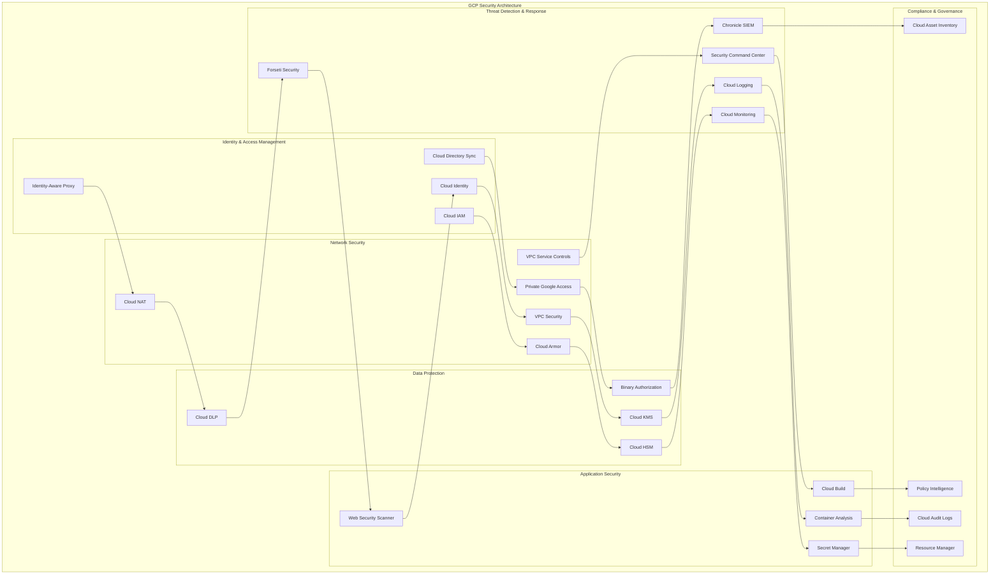
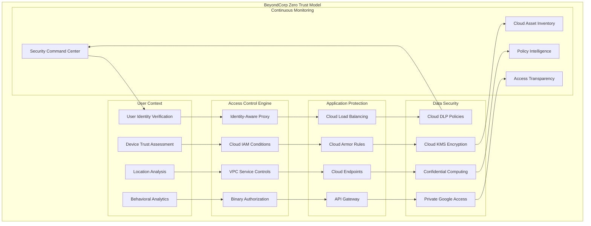
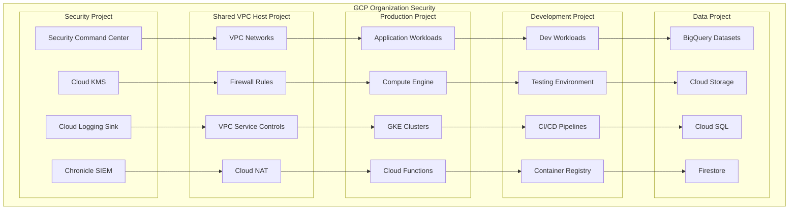

# Google Cloud Platform (GCP) Security Architecture

## 🛡️ **Overview**
Comprehensive GCP security architecture implementing BeyondCorp zero trust model, advanced threat detection, and Google's security-by-design principles. This architecture leverages Google's native security services and industry-leading security research.

## 🏗️ **GCP Security Architecture Diagram**

### **Complete GCP Security Stack**


### **GCP BeyondCorp Zero Trust Implementation**


### **GCP Multi-Project Security Strategy**


## 🔧 **Implementation Components**

### **1. Identity & Access Management**

#### **Cloud IAM Best Practices**
```yaml
# Cloud IAM Policy with Conditions
apiVersion: iam.googleapis.com/v1
kind: Policy
metadata:
  name: conditional-access-policy
spec:
  bindings:
    - members:
        - user:admin@company.com
      role: roles/compute.instanceAdmin
      condition:
        title: "Time and IP based access"
        description: "Allow access only during business hours from office IP"
        expression: >
          request.time.getHours() >= 9 && 
          request.time.getHours() <= 17 && 
          inIpRange(origin.ip, '203.0.113.0/24')
```

#### **Identity-Aware Proxy Configuration**
```python
from google.cloud import iap
from google.oauth2 import service_account

class IAPManager:
    def __init__(self, project_id, credentials_path):
        self.project_id = project_id
        credentials = service_account.Credentials.from_service_account_file(
            credentials_path,
            scopes=['https://www.googleapis.com/auth/cloud-platform']
        )
        self.iap_client = iap.IdentityAwareProxyAdminServiceClient(credentials=credentials)
    
    def configure_iap_policy(self, resource_name, members, conditions=None):
        """Configure IAP access policy with conditions"""
        policy = {
            'bindings': [
                {
                    'role': 'roles/iap.httpsResourceAccessor',
                    'members': members,
                    'condition': conditions
                }
            ]
        }
        
        request = iap.SetIamPolicyRequest(
            resource=resource_name,
            policy=policy
        )
        
        return self.iap_client.set_iam_policy(request=request)
    
    def create_access_level(self, access_level_name, ip_ranges, device_policy):
        """Create Access Context Manager access level"""
        access_level = {
            'name': f'accessPolicies/{self.project_id}/accessLevels/{access_level_name}',
            'basic': {
                'conditions': [
                    {
                        'ip_subnetworks': ip_ranges,
                        'device_policy': device_policy,
                        'required_access_levels': []
                    }
                ]
            }
        }
        
        return access_level
```

### **2. Network Security Implementation**

#### **VPC Security Configuration**
```yaml
# VPC with security-focused configuration
apiVersion: compute.googleapis.com/v1
kind: Network
metadata:
  name: secure-vpc
spec:
  autoCreateSubnetworks: false
  routingConfig:
    routingMode: REGIONAL
  
---
apiVersion: compute.googleapis.com/v1
kind: Subnetwork
metadata:
  name: private-subnet
spec:
  network: secure-vpc
  ipCidrRange: 10.0.0.0/24
  region: us-central1
  privateIpGoogleAccess: true
  enableFlowLogs: true
  logConfig:
    enable: true
    flowSampling: 1.0
    metadata: INCLUDE_ALL_METADATA
```

#### **Cloud Armor Security Policies**
```python
from google.cloud import compute_v1

class CloudArmorManager:
    def __init__(self, project_id):
        self.project_id = project_id
        self.security_policies_client = compute_v1.SecurityPoliciesClient()
    
    def create_security_policy(self, policy_name):
        """Create Cloud Armor security policy"""
        # Basic DDoS protection and WAF rules
        security_policy = compute_v1.SecurityPolicy(
            name=policy_name,
            description="Advanced security policy with ML-based protection",
            rules=[
                # Rate limiting rule
                compute_v1.SecurityPolicyRule(
                    priority=1000,
                    action="rate_based_ban",
                    match=compute_v1.SecurityPolicyRuleMatcher(
                        versioned_expr="SRC_IPS_V1",
                        config=compute_v1.SecurityPolicyRuleMatcherConfig(
                            src_ip_ranges=["*"]
                        )
                    ),
                    rate_limit_options=compute_v1.SecurityPolicyRuleRateLimitOptions(
                        rate_limit_threshold=compute_v1.SecurityPolicyRuleRateLimitOptionsThreshold(
                            count=100,
                            interval_sec=60
                        ),
                        ban_duration_sec=600,
                        enforce_on_key="IP"
                    )
                ),
                # SQL injection protection
                compute_v1.SecurityPolicyRule(
                    priority=2000,
                    action="deny(403)",
                    match=compute_v1.SecurityPolicyRuleMatcher(
                        expr=compute_v1.Expr(
                            expression="evaluatePreconfiguredExpr('sqli-stable')"
                        )
                    )
                ),
                # XSS protection
                compute_v1.SecurityPolicyRule(
                    priority=3000,
                    action="deny(403)",
                    match=compute_v1.SecurityPolicyRuleMatcher(
                        expr=compute_v1.Expr(
                            expression="evaluatePreconfiguredExpr('xss-stable')"
                        )
                    )
                ),
                # Default allow rule
                compute_v1.SecurityPolicyRule(
                    priority=2147483647,
                    action="allow",
                    match=compute_v1.SecurityPolicyRuleMatcher(
                        versioned_expr="SRC_IPS_V1",
                        config=compute_v1.SecurityPolicyRuleMatcherConfig(
                            src_ip_ranges=["*"]
                        )
                    )
                )
            ],
            adaptive_protection_config=compute_v1.SecurityPolicyAdaptiveProtectionConfig(
                layer_7_ddos_defense_config=compute_v1.SecurityPolicyAdaptiveProtectionConfigLayer7DdosDefenseConfig(
                    enable=True,
                    rule_visibility="STANDARD"
                )
            )
        )
        
        request = compute_v1.InsertSecurityPolicyRequest(
            project=self.project_id,
            security_policy_resource=security_policy
        )
        
        operation = self.security_policies_client.insert(request=request)
        return operation
```

### **3. Data Protection Implementation**

#### **Cloud KMS Configuration**
```python
from google.cloud import kms
import hashlib

class KMSManager:
    def __init__(self, project_id, location_id):
        self.project_id = project_id
        self.location_id = location_id
        self.client = kms.KeyManagementServiceClient()
        self.location_name = f'projects/{project_id}/locations/{location_id}'
    
    def create_key_ring(self, key_ring_id):
        """Create a key ring for organizing keys"""
        key_ring = {
            'name': f'{self.location_name}/keyRings/{key_ring_id}'
        }
        
        request = kms.CreateKeyRingRequest(
            parent=self.location_name,
            key_ring_id=key_ring_id,
            key_ring=key_ring
        )
        
        return self.client.create_key_ring(request=request)
    
    def create_crypto_key(self, key_ring_id, crypto_key_id, purpose='ENCRYPT_DECRYPT'):
        """Create a crypto key with specific purpose"""
        key_ring_name = f'{self.location_name}/keyRings/{key_ring_id}'
        
        crypto_key = {
            'purpose': getattr(kms.CryptoKey.CryptoKeyPurpose, purpose),
            'version_template': {
                'algorithm': kms.CryptoKeyVersion.CryptoKeyVersionAlgorithm.GOOGLE_SYMMETRIC_ENCRYPTION,
                'protection_level': kms.ProtectionLevel.SOFTWARE
            },
            'rotation_period': {'seconds': 2592000}  # 30 days
        }
        
        request = kms.CreateCryptoKeyRequest(
            parent=key_ring_name,
            crypto_key_id=crypto_key_id,
            crypto_key=crypto_key
        )
        
        return self.client.create_crypto_key(request=request)
    
    def encrypt_data(self, key_ring_id, crypto_key_id, data):
        """Encrypt data using Cloud KMS"""
        key_name = f'{self.location_name}/keyRings/{key_ring_id}/cryptoKeys/{crypto_key_id}'
        
        # Convert string to bytes
        data_bytes = data.encode('utf-8')
        
        request = kms.EncryptRequest(
            name=key_name,
            plaintext=data_bytes
        )
        
        response = self.client.encrypt(request=request)
        return response.ciphertext
    
    def setup_envelope_encryption(self, key_ring_id, crypto_key_id):
        """Setup envelope encryption for large data"""
        # Generate data encryption key (DEK)
        import os
        dek = os.urandom(32)  # 256-bit key
        
        # Encrypt DEK with KMS
        encrypted_dek = self.encrypt_data(key_ring_id, crypto_key_id, dek.hex())
        
        return {
            'encrypted_dek': encrypted_dek,
            'dek': dek
        }
```

#### **Cloud DLP Implementation**
```python
from google.cloud import dlp_v2
import json

class DLPManager:
    def __init__(self, project_id):
        self.project_id = project_id
        self.client = dlp_v2.DlpServiceClient()
        self.parent = f"projects/{project_id}"
    
    def create_inspect_template(self, template_id, info_types, min_likelihood):
        """Create DLP inspect template"""
        info_types_list = [{"name": info_type} for info_type in info_types]
        
        inspect_config = dlp_v2.InspectConfig(
            info_types=info_types_list,
            min_likelihood=min_likelihood,
            include_quote=True,
            limits=dlp_v2.InspectConfig.FindingLimits(max_findings_per_request=100)
        )
        
        inspect_template = dlp_v2.InspectTemplate(
            display_name=template_id,
            description="Template for detecting PII and sensitive data",
            inspect_config=inspect_config
        )
        
        request = dlp_v2.CreateInspectTemplateRequest(
            parent=self.parent,
            inspect_template=inspect_template,
            template_id=template_id
        )
        
        return self.client.create_inspect_template(request=request)
    
    def create_deidentify_template(self, template_id):
        """Create DLP de-identification template"""
        # Configure various transformation methods
        transformations = [
            dlp_v2.FieldTransformation(
                fields=[dlp_v2.FieldId(name="email")],
                primitive_transformation=dlp_v2.PrimitiveTransformation(
                    crypto_hash_config=dlp_v2.CryptoHashConfig(
                        crypto_key=dlp_v2.CryptoKey(
                            transient=dlp_v2.TransientCryptoKey(
                                name="email-hash-key"
                            )
                        )
                    )
                )
            ),
            dlp_v2.FieldTransformation(
                fields=[dlp_v2.FieldId(name="ssn")],
                primitive_transformation=dlp_v2.PrimitiveTransformation(
                    character_mask_config=dlp_v2.CharacterMaskConfig(
                        masking_character="*",
                        number_to_mask=5
                    )
                )
            )
        ]
        
        deidentify_config = dlp_v2.DeidentifyConfig(
            record_transformations=dlp_v2.RecordTransformations(
                field_transformations=transformations
            )
        )
        
        deidentify_template = dlp_v2.DeidentifyTemplate(
            display_name=template_id,
            description="Template for de-identifying sensitive data",
            deidentify_config=deidentify_config
        )
        
        request = dlp_v2.CreateDeidentifyTemplateRequest(
            parent=self.parent,
            deidentify_template=deidentify_template,
            template_id=template_id
        )
        
        return self.client.create_deidentify_template(request=request)
    
    def scan_storage_for_pii(self, bucket_name, inspect_template_name):
        """Scan Cloud Storage for PII"""
        storage_config = dlp_v2.StorageConfig(
            cloud_storage_options=dlp_v2.CloudStorageOptions(
                file_set=dlp_v2.CloudStorageOptions.FileSet(
                    url=f"gs://{bucket_name}/*"
                ),
                bytes_limit_per_file=1024*1024,  # 1MB per file
                file_types=[
                    dlp_v2.FileType.CSV,
                    dlp_v2.FileType.JSON,
                    dlp_v2.FileType.TEXT_FILE
                ]
            )
        )
        
        inspect_job_config = dlp_v2.InspectJobConfig(
            inspect_template_name=inspect_template_name,
            storage_config=storage_config,
            actions=[
                dlp_v2.Action(
                    save_findings=dlp_v2.Action.SaveFindings(
                        output_config=dlp_v2.OutputStorageConfig(
                            table=dlp_v2.BigQueryTable(
                                project_id=self.project_id,
                                dataset_id="dlp_findings",
                                table_id="scan_results"
                            )
                        )
                    )
                )
            ]
        )
        
        request = dlp_v2.CreateDlpJobRequest(
            parent=self.parent,
            inspect_job=inspect_job_config
        )
        
        return self.client.create_dlp_job(request=request)
```

### **4. Threat Detection Configuration**

#### **Security Command Center Setup**
```python
from google.cloud import securitycenter
from google.protobuf import field_mask_pb2

class SecurityCommandCenterManager:
    def __init__(self, organization_id):
        self.organization_id = organization_id
        self.client = securitycenter.SecurityCenterClient()
        self.org_name = f"organizations/{organization_id}"
    
    def create_notification_config(self, config_id, pubsub_topic, filter_condition):
        """Create notification configuration for findings"""
        notification_config = securitycenter.NotificationConfig(
            description="Security findings notification",
            pubsub_topic=pubsub_topic,
            streaming_config=securitycenter.NotificationConfig.StreamingConfig(
                filter=filter_condition
            )
        )
        
        request = securitycenter.CreateNotificationConfigRequest(
            parent=self.org_name,
            config_id=config_id,
            notification_config=notification_config
        )
        
        return self.client.create_notification_config(request=request)
    
    def create_custom_module(self, module_name, module_config):
        """Create custom Security Health Analytics module"""
        custom_module = securitycenter.CustomModule(
            display_name=module_name,
            enablement_state=securitycenter.CustomModule.EnablementState.ENABLED,
            custom_config=module_config
        )
        
        request = securitycenter.CreateSecurityHealthAnalyticsCustomModuleRequest(
            parent=self.org_name,
            security_health_analytics_custom_module=custom_module
        )
        
        return self.client.create_security_health_analytics_custom_module(request=request)
    
    def bulk_mute_findings(self, filter_condition):
        """Bulk mute findings based on filter"""
        request = securitycenter.BulkMuteFindingsRequest(
            parent=self.org_name,
            filter=filter_condition,
            mute_annotation="Bulk muted via automation"
        )
        
        operation = self.client.bulk_mute_findings(request=request)
        return operation
    
    def get_security_insights(self):
        """Get security insights and metrics"""
        # Custom analytics for security posture
        findings_stats = {}
        
        # Get findings by severity
        request = securitycenter.GroupFindingsRequest(
            parent=self.org_name,
            group_by="severity",
            filter="state=\"ACTIVE\""
        )
        
        page_result = self.client.group_findings(request=request)
        
        for group in page_result:
            findings_stats[group.properties['severity']] = group.count
        
        return findings_stats
```

#### **Chronicle SIEM Integration**
```python
import requests
import json
from google.auth.transport.requests import Request
from google.oauth2 import service_account

class ChronicleManager:
    def __init__(self, credentials_path, customer_id):
        self.customer_id = customer_id
        self.base_url = "https://backstory.googleapis.com"
        
        # Set up authentication
        credentials = service_account.Credentials.from_service_account_file(
            credentials_path,
            scopes=['https://www.googleapis.com/auth/chronicle-backstory']
        )
        credentials.refresh(Request())
        self.headers = {
            'Authorization': f'Bearer {credentials.token}',
            'Content-Type': 'application/json'
        }
    
    def create_detection_rule(self, rule_name, rule_text):
        """Create detection rule in Chronicle"""
        url = f"{self.base_url}/v1/detect/rules"
        
        rule_data = {
            "rule_name": rule_name,
            "rule_text": rule_text,
            "customer_id": self.customer_id
        }
        
        response = requests.post(url, headers=self.headers, json=rule_data)
        return response.json()
    
    def search_iocs(self, ioc_value, ioc_type="DOMAIN_NAME"):
        """Search for IOCs in Chronicle"""
        url = f"{self.base_url}/v1/ioc/details"
        
        params = {
            "artifact.domain_name": ioc_value if ioc_type == "DOMAIN_NAME" else None,
            "artifact.ip_address": ioc_value if ioc_type == "IP_ADDRESS" else None
        }
        
        response = requests.get(url, headers=self.headers, params=params)
        return response.json()
    
    def create_threat_hunting_query(self, query_text, start_time, end_time):
        """Create threat hunting query"""
        url = f"{self.base_url}/v1/udm/search"
        
        query_data = {
            "query": query_text,
            "time_range": {
                "start_time": start_time,
                "end_time": end_time
            }
        }
        
        response = requests.post(url, headers=self.headers, json=query_data)
        return response.json()
```

### **5. Compliance Automation**

#### **Policy Intelligence Implementation**
```python
from google.cloud import asset_v1
from google.cloud import recommender_v1

class ComplianceManager:
    def __init__(self, project_id, organization_id):
        self.project_id = project_id
        self.organization_id = organization_id
        self.asset_client = asset_v1.AssetServiceClient()
        self.recommender_client = recommender_v1.RecommenderClient()
    
    def analyze_iam_policies(self):
        """Analyze IAM policies for compliance violations"""
        parent = f"projects/{self.project_id}"
        
        # Search for all IAM policies
        request = asset_v1.SearchAllIamPoliciesRequest(
            scope=parent,
            query="policy:*"
        )
        
        policies = self.asset_client.search_all_iam_policies(request=request)
        
        compliance_violations = []
        
        for policy in policies:
            # Check for overprivileged users
            for binding in policy.policy.bindings:
                if "allUsers" in binding.members or "allAuthenticatedUsers" in binding.members:
                    compliance_violations.append({
                        "resource": policy.resource,
                        "violation": "Public access detected",
                        "binding": binding
                    })
                
                # Check for admin roles
                if "admin" in binding.role.lower():
                    compliance_violations.append({
                        "resource": policy.resource,
                        "violation": "Admin role assignment",
                        "binding": binding
                    })
        
        return compliance_violations
    
    def get_security_recommendations(self):
        """Get security recommendations from Recommender API"""
        parent = f"projects/{self.project_id}/locations/global/recommenders/google.iam.policy.Recommender"
        
        request = recommender_v1.ListRecommendationsRequest(parent=parent)
        recommendations = self.recommender_client.list_recommendations(request=request)
        
        security_recommendations = []
        
        for recommendation in recommendations:
            if recommendation.recommender_subtype in ["REMOVE_ROLE", "REPLACE_ROLE"]:
                security_recommendations.append({
                    "name": recommendation.name,
                    "description": recommendation.description,
                    "priority": recommendation.priority,
                    "impact": recommendation.primary_impact
                })
        
        return security_recommendations
    
    def implement_soc2_controls(self):
        """Implement SOC2 Type II controls"""
        controls = {
            "CC6.1": self.implement_encryption_controls(),
            "CC6.2": self.implement_access_controls(),
            "CC6.3": self.implement_logical_access_controls(),
            "CC7.1": self.implement_detection_controls(),
            "CC7.2": self.implement_monitoring_controls()
        }
        
        return controls
    
    def implement_encryption_controls(self):
        """Implement encryption controls for SOC2 CC6.1"""
        # Check Cloud Storage encryption
        # Check Cloud SQL encryption
        # Check Compute Engine disk encryption
        # Verify KMS key rotation
        pass
    
    def implement_access_controls(self):
        """Implement access controls for SOC2 CC6.2"""
        # Verify IAM policies
        # Check service account usage
        # Validate VPC Service Controls
        pass
```

### **6. Incident Response Automation**

#### **Automated Security Response**
```python
import json
from google.cloud import functions_v1
from google.cloud import compute_v1
from google.cloud import logging

class GCPIncidentResponse:
    def __init__(self, project_id):
        self.project_id = project_id
        self.compute_client = compute_v1.InstancesClient()
        self.logging_client = logging.Client()
    
    def security_finding_handler(self, cloud_event):
        """Cloud Function to handle Security Command Center findings"""
        finding_data = json.loads(cloud_event.data)
        finding = finding_data.get('finding', {})
        
        severity = finding.get('severity', '')
        category = finding.get('category', '')
        
        if severity == 'CRITICAL':
            self.execute_critical_response(finding)
        elif severity == 'HIGH':
            self.execute_high_response(finding)
        else:
            self.log_finding(finding)
    
    def execute_critical_response(self, finding):
        """Execute critical incident response"""
        resource_name = finding.get('resourceName', '')
        
        # If it's a VM instance, isolate it
        if 'instances/' in resource_name:
            instance_id = resource_name.split('/')[-1]
            zone = resource_name.split('/')[-3]
            self.isolate_vm_instance(instance_id, zone)
        
        # Create incident ticket
        self.create_incident_ticket(finding)
        
        # Send alerts
        self.send_critical_alert(finding)
    
    def isolate_vm_instance(self, instance_name, zone):
        """Isolate VM instance by removing network tags"""
        try:
            # Get current instance
            request = compute_v1.GetInstanceRequest(
                project=self.project_id,
                zone=zone,
                instance=instance_name
            )
            
            instance = self.compute_client.get(request=request)
            
            # Create isolation firewall rule
            self.create_isolation_firewall_rule(instance_name)
            
            # Add isolation tag to instance
            tags = instance.tags.items.copy() if instance.tags else []
            tags.append("isolated-instance")
            
            # Update instance with isolation tag
            request = compute_v1.SetTagsInstanceRequest(
                project=self.project_id,
                zone=zone,
                instance=instance_name,
                tags_resource=compute_v1.Tags(
                    items=tags,
                    fingerprint=instance.tags.fingerprint
                )
            )
            
            operation = self.compute_client.set_tags(request=request)
            
            # Log the isolation action
            self.logging_client.logger("security-isolation").info(
                f"Instance {instance_name} isolated due to security incident",
                extra={"instance": instance_name, "zone": zone}
            )
            
        except Exception as e:
            self.logging_client.logger("security-error").error(
                f"Failed to isolate instance {instance_name}: {str(e)}"
            )
    
    def create_isolation_firewall_rule(self, instance_name):
        """Create firewall rule to isolate instance"""
        firewall_client = compute_v1.FirewallsClient()
        
        firewall_rule = compute_v1.Firewall(
            name=f"isolate-{instance_name}",
            description="Isolation rule for security incident",
            direction="INGRESS",
            priority=1000,
            action="DENY",
            target_tags=[f"isolated-instance"],
            source_ranges=["0.0.0.0/0"]
        )
        
        request = compute_v1.InsertFirewallRequest(
            project=self.project_id,
            firewall_resource=firewall_rule
        )
        
        operation = firewall_client.insert(request=request)
        return operation
    
    def automated_forensics_collection(self, instance_name, zone):
        """Automated forensics data collection"""
        # Create disk snapshot for forensics
        disks_client = compute_v1.DisksClient()
        snapshots_client = compute_v1.SnapshotsClient()
        
        # Get instance disks
        instance = self.compute_client.get(
            project=self.project_id,
            zone=zone,
            instance=instance_name
        )
        
        for disk in instance.disks:
            if disk.boot:  # Focus on boot disk
                disk_name = disk.source.split('/')[-1]
                
                # Create forensic snapshot
                snapshot = compute_v1.Snapshot(
                    name=f"forensic-{instance_name}-{disk_name}",
                    description="Forensic snapshot for security incident",
                    source_disk=disk.source
                )
                
                request = compute_v1.InsertSnapshotRequest(
                    project=self.project_id,
                    snapshot_resource=snapshot
                )
                
                snapshots_client.insert(request=request)
```

## 📊 **Security Metrics & Monitoring**

### **Cloud Monitoring Security Dashboard**
```python
from google.cloud import monitoring_v3

class SecurityMetricsDashboard:
    def __init__(self, project_id):
        self.project_id = project_id
        self.client = monitoring_v3.MetricServiceClient()
        self.project_name = f"projects/{project_id}"
    
    def create_custom_security_metrics(self):
        """Create custom security metrics"""
        # Security findings metric
        descriptor = monitoring_v3.MetricDescriptor(
            type="custom.googleapis.com/security/findings_count",
            metric_kind=monitoring_v3.MetricDescriptor.MetricKind.GAUGE,
            value_type=monitoring_v3.MetricDescriptor.ValueType.INT64,
            description="Number of active security findings",
            labels=[
                monitoring_v3.LabelDescriptor(
                    key="severity",
                    value_type=monitoring_v3.LabelDescriptor.ValueType.STRING,
                    description="Finding severity level"
                ),
                monitoring_v3.LabelDescriptor(
                    key="category",
                    value_type=monitoring_v3.LabelDescriptor.ValueType.STRING,
                    description="Finding category"
                )
            ]
        )
        
        request = monitoring_v3.CreateMetricDescriptorRequest(
            name=self.project_name,
            metric_descriptor=descriptor
        )
        
        return self.client.create_metric_descriptor(request=request)
    
    def create_security_alerts(self):
        """Create security alerting policies"""
        alert_client = monitoring_v3.AlertPolicyServiceClient()
        
        # Critical findings alert
        alert_policy = monitoring_v3.AlertPolicy(
            display_name="Critical Security Findings",
            documentation=monitoring_v3.AlertPolicy.Documentation(
                content="Alert when critical security findings are detected"
            ),
            conditions=[
                monitoring_v3.AlertPolicy.Condition(
                    display_name="Critical findings threshold",
                    condition_threshold=monitoring_v3.AlertPolicy.Condition.MetricThreshold(
                        filter='resource.type="global" AND metric.type="custom.googleapis.com/security/findings_count"',
                        comparison=monitoring_v3.ComparisonType.COMPARISON_GREATER_THAN,
                        threshold_value=0,
                        duration={"seconds": 60},
                        aggregations=[
                            monitoring_v3.Aggregation(
                                alignment_period={"seconds": 300},
                                per_series_aligner=monitoring_v3.Aggregation.Aligner.ALIGN_MEAN
                            )
                        ]
                    )
                )
            ],
            enabled=True,
            notification_channels=[],  # Add notification channels
            alert_strategy=monitoring_v3.AlertPolicy.AlertStrategy(
                auto_close={"seconds": 86400}  # Auto-close after 24 hours
            )
        )
        
        request = monitoring_v3.CreateAlertPolicyRequest(
            name=self.project_name,
            alert_policy=alert_policy
        )
        
        return alert_client.create_alert_policy(request=request)
```

## 🔐 **Security Best Practices**

### **1. Identity & Access Management**
- Use Google Cloud Identity for centralized identity management
- Implement IAM conditions for context-aware access
- Use service accounts with minimal permissions
- Enable Identity-Aware Proxy for zero trust access
- Regular IAM policy audits and cleanup

### **2. Network Security**
- Implement VPC Service Controls for data exfiltration protection
- Use Cloud Armor for application-layer protection
- Enable VPC Flow Logs for network monitoring
- Implement Private Google Access for secure API access
- Use Cloud NAT for controlled outbound connectivity

### **3. Data Protection**
- Use Cloud KMS for centralized key management
- Implement Cloud DLP for sensitive data discovery
- Enable audit logging for all data access
- Use Confidential Computing for sensitive workloads
- Implement data residency controls

### **4. Threat Detection**
- Enable Security Command Center Premium
- Use Chronicle SIEM for advanced analytics
- Implement custom detection rules
- Regular threat hunting exercises
- Automated incident response workflows

### **5. Compliance**
- Use Policy Intelligence for compliance monitoring
- Implement Organization Policies for governance
- Regular compliance assessments
- Automated remediation for policy violations
- Comprehensive audit logging

## 📚 **Implementation Guides**

1. **[BeyondCorp IAP Setup](./guides/beyondcorp-iap.md)**
2. **[Cloud Armor Configuration](./guides/cloud-armor-setup.md)**
3. **[Security Command Center](./guides/scc-setup.md)**
4. **[Cloud KMS Implementation](./guides/kms-setup.md)**
5. **[Compliance Automation](./guides/compliance-automation.md)**

## 🧪 **Hands-on Labs**

1. **[Lab 1: BeyondCorp Zero Trust](./labs/lab01-beyondcorp.md)**
2. **[Lab 2: Cloud Armor Protection](./labs/lab02-cloud-armor.md)**
3. **[Lab 3: Data Loss Prevention](./labs/lab03-dlp.md)**
4. **[Lab 4: Security Command Center](./labs/lab04-scc.md)**
5. **[Lab 5: Incident Response](./labs/lab05-incident-response.md)**

---

**Next**: [Azure Security Architecture](../azure/README.md)
