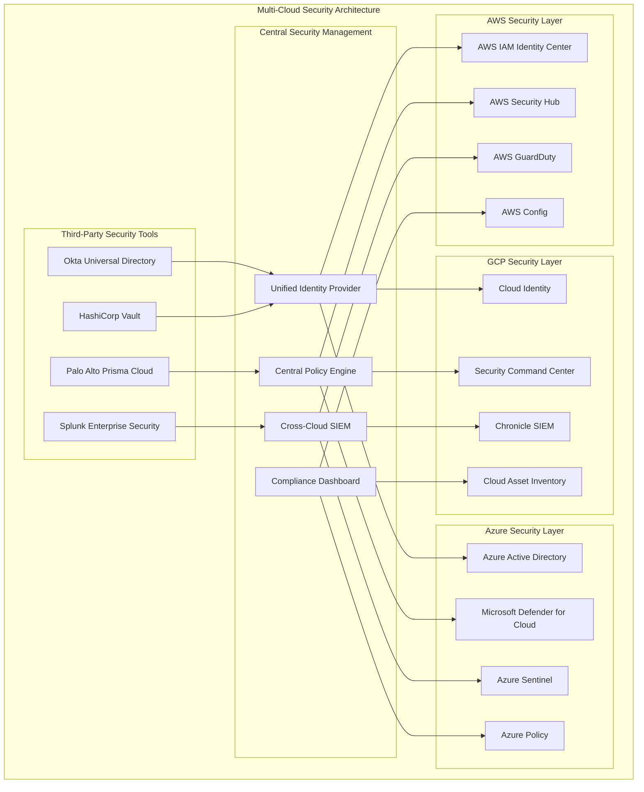
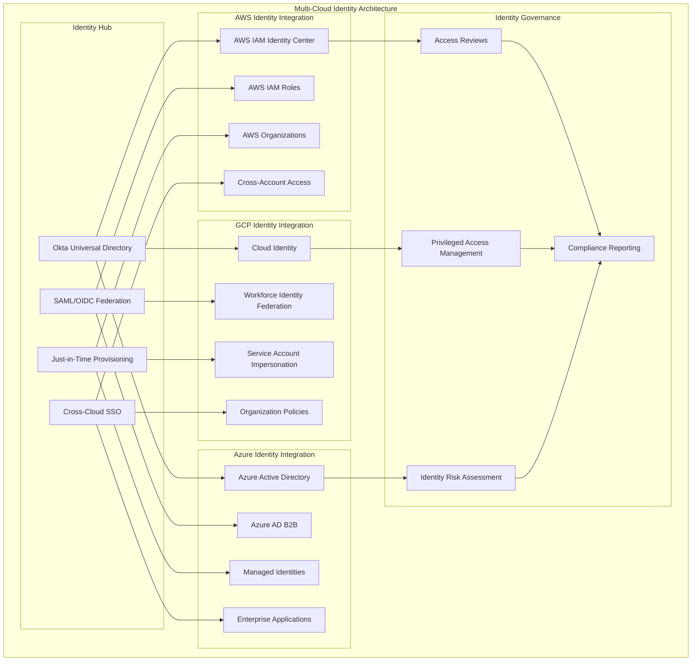
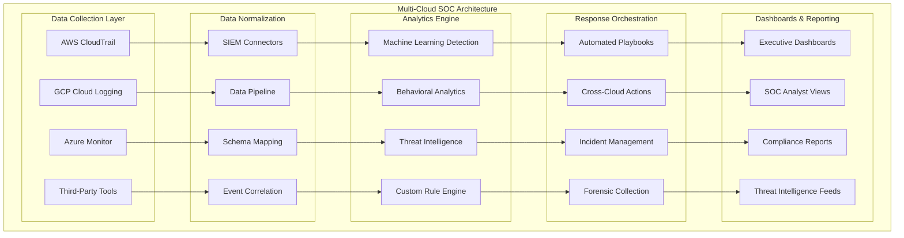

# Multi-Cloud Security Strategy

## 🌐 **Overview**
Comprehensive multi-cloud security architecture that provides unified security governance, identity management, and threat protection across AWS, GCP, and Azure platforms. This strategy enables organizations to maintain consistent security posture while leveraging the best services from each cloud provider.

## 🏗️ **Multi-Cloud Security Architecture**

### **Unified Multi-Cloud Security Platform**


### **Cross-Cloud Identity Federation**


### **Unified Security Operations Center (SOC)**


## 🔧 **Implementation Components**

### **1. Unified Identity Management**

#### **Cross-Cloud Identity Federation Setup**
```python
import boto3
import json
from google.cloud import iam
from azure.identity import DefaultAzureCredential
from azure.mgmt.authorization import AuthorizationManagementClient

class MultiCloudIdentityManager:
    def __init__(self, config):
        self.aws_config = config['aws']
        self.gcp_config = config['gcp']
        self.azure_config = config['azure']
        
        # Initialize cloud clients
        self.aws_iam = boto3.client('iam')
        self.gcp_iam = iam.IAMCredentialsServiceClient()
        self.azure_credential = DefaultAzureCredential()
        self.azure_auth_client = AuthorizationManagementClient(
            self.azure_credential,
            self.azure_config['subscription_id']
        )
    
    def setup_cross_cloud_federation(self):
        """Setup identity federation across all clouds"""
        # Setup AWS OIDC Identity Provider
        aws_idp = self.setup_aws_oidc_provider()
        
        # Setup GCP Workforce Identity Federation
        gcp_pool = self.setup_gcp_identity_pool()
        
        # Setup Azure Enterprise Application
        azure_app = self.setup_azure_enterprise_app()
        
        return {
            'aws_identity_provider': aws_idp,
            'gcp_identity_pool': gcp_pool,
            'azure_enterprise_app': azure_app
        }
    
    def setup_aws_oidc_provider(self):
        """Setup AWS OIDC Identity Provider"""
        oidc_provider = {
            'Url': 'https://dev-12345.okta.com',
            'ClientIDList': ['aws-federation-client'],
            'ThumbprintList': ['9e99a48a9960b14926bb7f3b02e22da2b0ab7280']
        }
        
        try:
            response = self.aws_iam.create_open_id_connect_provider(
                Url=oidc_provider['Url'],
                ClientIDList=oidc_provider['ClientIDList'],
                ThumbprintList=oidc_provider['ThumbprintList']
            )
            
            # Create cross-cloud assume role
            trust_policy = {
                "Version": "2012-10-17",
                "Statement": [
                    {
                        "Effect": "Allow",
                        "Principal": {
                            "Federated": response['OpenIDConnectProviderArn']
                        },
                        "Action": "sts:AssumeRoleWithWebIdentity",
                        "Condition": {
                            "StringEquals": {
                                f"{oidc_provider['Url']}:aud": "aws-federation-client",
                                f"{oidc_provider['Url']}:sub": "user:{{saml.subject}}"
                            }
                        }
                    }
                ]
            }
            
            role_response = self.aws_iam.create_role(
                RoleName='CrossCloudFederatedRole',
                AssumeRolePolicyDocument=json.dumps(trust_policy),
                Description='Role for cross-cloud federated access'
            )
            
            return {
                'provider_arn': response['OpenIDConnectProviderArn'],
                'role_arn': role_response['Role']['Arn']
            }
            
        except Exception as e:
            print(f"Error setting up AWS OIDC provider: {str(e)}")
            return None
    
    def setup_gcp_identity_pool(self):
        """Setup GCP Workforce Identity Federation"""
        # This would typically use the Google Cloud Resource Manager API
        # to create workforce identity pools and providers
        
        pool_config = {
            'name': 'projects/{}/locations/global/workforcePools/cross-cloud-pool'.format(
                self.gcp_config['project_id']
            ),
            'parent': f"locations/global",
            'workforce_pool': {
                'display_name': 'Cross-Cloud Identity Pool',
                'description': 'Identity pool for cross-cloud access',
                'disabled': False
            }
        }
        
        provider_config = {
            'workforce_pool_provider_id': 'okta-provider',
            'workforce_pool_provider': {
                'display_name': 'Okta OIDC Provider',
                'description': 'Okta OIDC provider for cross-cloud access',
                'disabled': False,
                'oidc': {
                    'issuer_uri': 'https://dev-12345.okta.com',
                    'client_id': 'gcp-federation-client',
                    'web_sso_config': {
                        'response_type': 'CODE',
                        'assertion_claims_behavior': 'MERGE_USER_INFO_OVER_ID_TOKEN_CLAIMS'
                    }
                },
                'attribute_mapping': {
                    'google.subject': 'assertion.sub',
                    'google.display_name': 'assertion.name',
                    'google.groups': 'assertion.groups'
                }
            }
        }
        
        return {
            'pool_config': pool_config,
            'provider_config': provider_config
        }
    
    def setup_azure_enterprise_app(self):
        """Setup Azure Enterprise Application for federation"""
        app_config = {
            'displayName': 'Cross-Cloud Federation App',
            'signInAudience': 'AzureADMultipleOrgs',
            'web': {
                'redirectUris': [
                    'https://dev-12345.okta.com/oauth2/v1/authorize/callback'
                ],
                'logoutUrl': 'https://dev-12345.okta.com/logout'
            },
            'api': {
                'requestedAccessTokenVersion': 2
            }
        }
        
        return app_config
    
    def implement_just_in_time_access(self, user_id, cloud_platform, role, duration_hours=8):
        """Implement just-in-time access across clouds"""
        access_request = {
            'user_id': user_id,
            'cloud_platform': cloud_platform,
            'role': role,
            'duration_hours': duration_hours,
            'timestamp': datetime.utcnow().isoformat(),
            'status': 'pending'
        }
        
        if cloud_platform == 'aws':
            return self.grant_aws_temporary_access(access_request)
        elif cloud_platform == 'gcp':
            return self.grant_gcp_temporary_access(access_request)
        elif cloud_platform == 'azure':
            return self.grant_azure_temporary_access(access_request)
        
        return None
```

### **2. Unified Policy Management**

#### **Cross-Cloud Policy Engine**
```python
import yaml
import json
from datetime import datetime, timedelta

class MultiCloudPolicyEngine:
    def __init__(self):
        self.policy_store = {}
        self.cloud_adapters = {
            'aws': AWSPolicyAdapter(),
            'gcp': GCPPolicyAdapter(),
            'azure': AzurePolicyAdapter()
        }
    
    def define_universal_policy(self, policy_name, policy_definition):
        """Define a universal policy that applies across all clouds"""
        universal_policy = {
            'name': policy_name,
            'description': policy_definition.get('description', ''),
            'scope': policy_definition.get('scope', 'global'),
            'rules': policy_definition.get('rules', []),
            'enforcement_mode': policy_definition.get('enforcement_mode', 'audit'),
            'created_at': datetime.utcnow().isoformat(),
            'version': '1.0'
        }
        
        self.policy_store[policy_name] = universal_policy
        
        # Deploy to all clouds
        deployment_results = {}
        for cloud, adapter in self.cloud_adapters.items():
            try:
                result = adapter.deploy_policy(universal_policy)
                deployment_results[cloud] = result
            except Exception as e:
                deployment_results[cloud] = {'error': str(e)}
        
        return deployment_results
    
    def create_zero_trust_policies(self):
        """Create comprehensive zero trust policies"""
        policies = [
            {
                'name': 'require-mfa-all-access',
                'description': 'Require MFA for all privileged access',
                'scope': 'global',
                'rules': [
                    {
                        'condition': 'user.privilege_level == "high"',
                        'requirement': 'mfa_required',
                        'action': 'deny_without_mfa'
                    }
                ],
                'enforcement_mode': 'enforce'
            },
            {
                'name': 'network-segmentation',
                'description': 'Enforce network micro-segmentation',
                'scope': 'network',
                'rules': [
                    {
                        'condition': 'traffic.direction == "inbound"',
                        'requirement': 'explicit_allow_rule',
                        'action': 'deny_by_default'
                    }
                ],
                'enforcement_mode': 'enforce'
            },
            {
                'name': 'data-encryption-at-rest',
                'description': 'Require encryption for all data at rest',
                'scope': 'data',
                'rules': [
                    {
                        'condition': 'resource.type in ["storage", "database"]',
                        'requirement': 'encryption_enabled',
                        'action': 'remediate_or_deny'
                    }
                ],
                'enforcement_mode': 'enforce'
            },
            {
                'name': 'privileged-access-monitoring',
                'description': 'Monitor all privileged access activities',
                'scope': 'audit',
                'rules': [
                    {
                        'condition': 'action.privilege_level == "admin"',
                        'requirement': 'comprehensive_logging',
                        'action': 'log_and_alert'
                    }
                ],
                'enforcement_mode': 'monitor'
            }
        ]
        
        deployment_results = {}
        for policy in policies:
            deployment_results[policy['name']] = self.define_universal_policy(
                policy['name'], 
                policy
            )
        
        return deployment_results
    
    def assess_policy_compliance(self):
        """Assess compliance across all clouds"""
        compliance_report = {
            'timestamp': datetime.utcnow().isoformat(),
            'overall_compliance': 0,
            'cloud_compliance': {},
            'policy_compliance': {},
            'violations': []
        }
        
        total_policies = len(self.policy_store)
        compliant_policies = 0
        
        for policy_name, policy in self.policy_store.items():
            policy_compliance = {}
            
            for cloud, adapter in self.cloud_adapters.items():
                try:
                    compliance_result = adapter.check_policy_compliance(policy)
                    policy_compliance[cloud] = compliance_result
                    
                    if not compliance_result.get('compliant', False):
                        compliance_report['violations'].extend(
                            compliance_result.get('violations', [])
                        )
                except Exception as e:
                    policy_compliance[cloud] = {'error': str(e), 'compliant': False}
            
            # Calculate policy compliance percentage
            compliant_clouds = sum(
                1 for result in policy_compliance.values() 
                if result.get('compliant', False)
            )
            
            policy_compliance_percent = (compliant_clouds / len(self.cloud_adapters)) * 100
            compliance_report['policy_compliance'][policy_name] = {
                'compliance_percentage': policy_compliance_percent,
                'cloud_results': policy_compliance
            }
            
            if policy_compliance_percent == 100:
                compliant_policies += 1
        
        # Calculate overall compliance
        compliance_report['overall_compliance'] = (
            compliant_policies / total_policies * 100 if total_policies > 0 else 0
        )
        
        # Calculate per-cloud compliance
        for cloud in self.cloud_adapters.keys():
            cloud_compliant_policies = sum(
                1 for policy_result in compliance_report['policy_compliance'].values()
                if policy_result['cloud_results'].get(cloud, {}).get('compliant', False)
            )
            
            compliance_report['cloud_compliance'][cloud] = (
                cloud_compliant_policies / total_policies * 100 if total_policies > 0 else 0
            )
        
        return compliance_report


class AWSPolicyAdapter:
    def __init__(self):
        self.iam_client = boto3.client('iam')
        self.config_client = boto3.client('config')
    
    def deploy_policy(self, universal_policy):
        """Deploy universal policy to AWS"""
        aws_policy = self.translate_to_aws_policy(universal_policy)
        
        # Deploy as IAM policy for identity-related rules
        if universal_policy['scope'] in ['global', 'identity']:
            iam_result = self.deploy_iam_policy(aws_policy)
        
        # Deploy as Config rule for resource compliance
        if universal_policy['scope'] in ['global', 'resource', 'data']:
            config_result = self.deploy_config_rule(aws_policy)
        
        return {'status': 'deployed', 'aws_policy_id': aws_policy['id']}
    
    def translate_to_aws_policy(self, universal_policy):
        """Translate universal policy to AWS-specific format"""
        # Implementation for translating universal policy to AWS IAM/Config format
        pass


class GCPPolicyAdapter:
    def __init__(self):
        # Initialize GCP clients
        pass
    
    def deploy_policy(self, universal_policy):
        """Deploy universal policy to GCP"""
        gcp_policy = self.translate_to_gcp_policy(universal_policy)
        # Implementation for GCP policy deployment
        return {'status': 'deployed', 'gcp_policy_id': gcp_policy['id']}


class AzurePolicyAdapter:
    def __init__(self):
        # Initialize Azure clients
        pass
    
    def deploy_policy(self, universal_policy):
        """Deploy universal policy to Azure"""
        azure_policy = self.translate_to_azure_policy(universal_policy)
        # Implementation for Azure policy deployment
        return {'status': 'deployed', 'azure_policy_id': azure_policy['id']}
```

### **3. Unified Security Monitoring**

#### **Cross-Cloud SIEM Implementation**
```python
import asyncio
import json
from datetime import datetime
from typing import Dict, List, Any

class MultiCloudSIEM:
    def __init__(self, config):
        self.config = config
        self.data_collectors = {
            'aws': AWSDataCollector(config['aws']),
            'gcp': GCPDataCollector(config['gcp']),
            'azure': AzureDataCollector(config['azure'])
        }
        self.correlation_engine = EventCorrelationEngine()
        self.alert_manager = AlertManager()
        self.threat_intelligence = ThreatIntelligenceEngine()
    
    async def collect_security_events(self):
        """Collect security events from all clouds"""
        collection_tasks = []
        
        for cloud, collector in self.data_collectors.items():
            task = asyncio.create_task(collector.collect_events())
            collection_tasks.append(task)
        
        # Wait for all collectors to complete
        results = await asyncio.gather(*collection_tasks, return_exceptions=True)
        
        all_events = []
        for i, result in enumerate(results):
            cloud = list(self.data_collectors.keys())[i]
            if isinstance(result, Exception):
                print(f"Error collecting from {cloud}: {str(result)}")
            else:
                all_events.extend(result)
        
        return all_events
    
    def normalize_events(self, events: List[Dict]) -> List[Dict]:
        """Normalize events to common schema"""
        normalized_events = []
        
        for event in events:
            normalized_event = {
                'timestamp': self.extract_timestamp(event),
                'source_cloud': self.extract_cloud_source(event),
                'event_type': self.extract_event_type(event),
                'severity': self.extract_severity(event),
                'user_identity': self.extract_user_identity(event),
                'resource': self.extract_resource_info(event),
                'action': self.extract_action(event),
                'source_ip': self.extract_source_ip(event),
                'user_agent': self.extract_user_agent(event),
                'raw_event': event
            }
            
            normalized_events.append(normalized_event)
        
        return normalized_events
    
    def correlate_cross_cloud_activities(self, events: List[Dict]) -> List[Dict]:
        """Correlate activities across multiple clouds"""
        correlated_incidents = []
        
        # Group events by user identity and time window
        user_activities = {}
        time_window = 300  # 5 minutes
        
        for event in events:
            user_id = event.get('user_identity', 'unknown')
            timestamp = event.get('timestamp')
            
            if user_id not in user_activities:
                user_activities[user_id] = []
            
            user_activities[user_id].append(event)
        
        # Analyze patterns for each user
        for user_id, activities in user_activities.items():
            # Sort activities by timestamp
            activities.sort(key=lambda x: x['timestamp'])
            
            # Look for suspicious patterns
            suspicious_patterns = self.detect_suspicious_patterns(activities)
            
            if suspicious_patterns:
                incident = {
                    'incident_id': f"CROSS_CLOUD_{user_id}_{int(datetime.now().timestamp())}",
                    'user_identity': user_id,
                    'pattern_type': suspicious_patterns['type'],
                    'severity': suspicious_patterns['severity'],
                    'events': activities,
                    'clouds_involved': list(set(event['source_cloud'] for event in activities)),
                    'timeline': {
                        'start': min(event['timestamp'] for event in activities),
                        'end': max(event['timestamp'] for event in activities)
                    },
                    'description': suspicious_patterns['description']
                }
                
                correlated_incidents.append(incident)
        
        return correlated_incidents
    
    def detect_suspicious_patterns(self, activities: List[Dict]) -> Dict:
        """Detect suspicious activity patterns"""
        # Pattern 1: Rapid multi-cloud access
        clouds_accessed = set(activity['source_cloud'] for activity in activities)
        if len(clouds_accessed) >= 2:
            time_span = (
                max(activity['timestamp'] for activity in activities) - 
                min(activity['timestamp'] for activity in activities)
            ).total_seconds()
            
            if time_span <= 300:  # 5 minutes
                return {
                    'type': 'rapid_multi_cloud_access',
                    'severity': 'high',
                    'description': f'User accessed {len(clouds_accessed)} clouds within {time_span} seconds'
                }
        
        # Pattern 2: Unusual resource access
        high_privilege_actions = [
            'delete', 'create_user', 'modify_policy', 'access_secrets'
        ]
        
        privilege_escalation_count = sum(
            1 for activity in activities 
            if any(action in activity.get('action', '').lower() for action in high_privilege_actions)
        )
        
        if privilege_escalation_count >= 3:
            return {
                'type': 'potential_privilege_escalation',
                'severity': 'high',
                'description': f'User performed {privilege_escalation_count} high-privilege actions'
            }
        
        # Pattern 3: Geographic anomaly
        source_ips = [activity.get('source_ip') for activity in activities if activity.get('source_ip')]
        if len(set(source_ips)) > 1:
            # This would typically involve IP geolocation lookup
            return {
                'type': 'geographic_anomaly',
                'severity': 'medium',
                'description': f'User accessed from {len(set(source_ips))} different IP addresses'
            }
        
        return None
    
    async def automated_threat_response(self, incident: Dict):
        """Automated response to detected threats"""
        response_actions = []
        
        # Determine response based on incident severity and type
        if incident['severity'] == 'high':
            response_actions.extend([
                'isolate_user_sessions',
                'disable_user_accounts',
                'alert_security_team',
                'create_incident_ticket'
            ])
        elif incident['severity'] == 'medium':
            response_actions.extend([
                'increase_monitoring',
                'require_additional_auth',
                'alert_security_team'
            ])
        
        # Execute response actions across all involved clouds
        execution_results = {}
        
        for action in response_actions:
            for cloud in incident['clouds_involved']:
                try:
                    result = await self.execute_response_action(
                        cloud, 
                        action, 
                        incident
                    )
                    execution_results[f"{cloud}_{action}"] = result
                except Exception as e:
                    execution_results[f"{cloud}_{action}"] = {'error': str(e)}
        
        return execution_results
    
    async def execute_response_action(self, cloud: str, action: str, incident: Dict):
        """Execute specific response action on specific cloud"""
        if cloud == 'aws':
            return await self.execute_aws_response(action, incident)
        elif cloud == 'gcp':
            return await self.execute_gcp_response(action, incident)
        elif cloud == 'azure':
            return await self.execute_azure_response(action, incident)
        
        return {'status': 'unsupported_cloud'}


class EventCorrelationEngine:
    def __init__(self):
        self.correlation_rules = self.load_correlation_rules()
    
    def load_correlation_rules(self):
        """Load correlation rules for cross-cloud event analysis"""
        rules = [
            {
                'name': 'concurrent_privilege_escalation',
                'description': 'Detect concurrent privilege escalation across clouds',
                'conditions': [
                    'event_type == "privilege_escalation"',
                    'time_difference <= 300',  # 5 minutes
                    'user_identity == same',
                    'source_cloud != same'
                ],
                'severity': 'critical'
            },
            {
                'name': 'data_exfiltration_pattern',
                'description': 'Detect potential data exfiltration pattern',
                'conditions': [
                    'action in ["download", "export", "copy"]',
                    'data_volume > threshold',
                    'unusual_time == true'
                ],
                'severity': 'high'
            }
        ]
        
        return rules


class ThreatIntelligenceEngine:
    def __init__(self):
        self.threat_feeds = [
            'misp_feed',
            'crowdstrike_feed',
            'recorded_future_feed',
            'custom_iocs'
        ]
    
    def enrich_events_with_threat_intel(self, events: List[Dict]) -> List[Dict]:
        """Enrich events with threat intelligence"""
        enriched_events = []
        
        for event in events:
            enrichment = self.get_threat_intelligence(event)
            event['threat_intelligence'] = enrichment
            enriched_events.append(event)
        
        return enriched_events
    
    def get_threat_intelligence(self, event: Dict) -> Dict:
        """Get threat intelligence for specific event"""
        intel = {
            'indicators_matched': [],
            'threat_actors': [],
            'campaigns': [],
            'risk_score': 0
        }
        
        # Check IP reputation
        source_ip = event.get('source_ip')
        if source_ip:
            ip_intel = self.check_ip_reputation(source_ip)
            intel.update(ip_intel)
        
        # Check for known malicious patterns
        user_agent = event.get('user_agent')
        if user_agent:
            ua_intel = self.check_user_agent_patterns(user_agent)
            intel.update(ua_intel)
        
        return intel
```

## 📊 **Multi-Cloud Security Metrics**

### **Unified Security Dashboard**
```python
class MultiCloudSecurityDashboard:
    def __init__(self):
        self.metrics_collectors = {
            'aws': AWSMetricsCollector(),
            'gcp': GCPMetricsCollector(),
            'azure': AzureMetricsCollector()
        }
    
    def generate_executive_dashboard(self):
        """Generate executive-level security dashboard"""
        dashboard_data = {
            'timestamp': datetime.utcnow().isoformat(),
            'overall_security_posture': self.calculate_overall_posture(),
            'cloud_security_scores': self.get_cloud_security_scores(),
            'threat_landscape': self.get_threat_landscape_summary(),
            'compliance_status': self.get_compliance_status(),
            'key_metrics': self.get_key_security_metrics(),
            'recent_incidents': self.get_recent_incidents(),
            'recommendations': self.get_security_recommendations()
        }
        
        return dashboard_data
    
    def calculate_overall_posture(self):
        """Calculate overall security posture score"""
        scores = []
        weights = {'aws': 0.4, 'gcp': 0.3, 'azure': 0.3}  # Adjust based on usage
        
        for cloud, collector in self.metrics_collectors.items():
            cloud_score = collector.get_security_score()
            weighted_score = cloud_score * weights.get(cloud, 0)
            scores.append(weighted_score)
        
        overall_score = sum(scores)
        
        return {
            'score': overall_score,
            'grade': self.score_to_grade(overall_score),
            'trend': self.get_score_trend()
        }
    
    def get_unified_security_metrics(self):
        """Get unified security metrics across all clouds"""
        metrics = {
            'identity_security': {
                'mfa_coverage': 0,
                'privileged_accounts': 0,
                'inactive_accounts': 0,
                'password_violations': 0
            },
            'network_security': {
                'open_security_groups': 0,
                'public_resources': 0,
                'unencrypted_traffic': 0,
                'ddos_attacks_blocked': 0
            },
            'data_security': {
                'unencrypted_storage': 0,
                'data_classification_coverage': 0,
                'dlp_violations': 0,
                'backup_coverage': 0
            },
            'threat_detection': {
                'active_threats': 0,
                'resolved_incidents': 0,
                'mean_detection_time': 0,
                'mean_response_time': 0
            },
            'compliance': {
                'compliance_score': 0,
                'policy_violations': 0,
                'audit_findings': 0,
                'remediation_rate': 0
            }
        }
        
        # Aggregate metrics from all clouds
        for cloud, collector in self.metrics_collectors.items():
            cloud_metrics = collector.get_detailed_metrics()
            
            for category, values in cloud_metrics.items():
                if category in metrics:
                    for metric, value in values.items():
                        if metric in metrics[category]:
                            metrics[category][metric] += value
        
        return metrics
```

## 🔐 **Multi-Cloud Security Best Practices**

### **1. Identity & Access Management**
- Implement federated identity across all cloud platforms
- Use centralized identity provider (Okta, Azure AD, etc.)
- Enforce consistent MFA policies across all clouds
- Implement just-in-time access for privileged operations
- Regular cross-cloud access reviews and certification

### **2. Network Security**
- Establish consistent network segmentation patterns
- Implement cross-cloud private connectivity (VPN/ExpressRoute/Interconnect)
- Use consistent firewall rules and security groups
- Monitor east-west traffic between clouds
- Implement consistent DDoS protection

### **3. Data Protection**
- Consistent data classification across all platforms
- Centralized key management strategy
- Cross-cloud data encryption standards
- Unified data loss prevention policies
- Consistent backup and recovery procedures

### **4. Threat Detection & Response**
- Centralized SIEM with cross-cloud correlation
- Consistent threat detection rules across platforms
- Automated cross-cloud incident response
- Unified threat intelligence integration
- Regular cross-cloud security assessments

### **5. Compliance & Governance**
- Unified policy management across all clouds
- Consistent compliance frameworks implementation
- Cross-cloud audit trail correlation
- Centralized compliance reporting
- Regular multi-cloud risk assessments

## 📚 **Implementation Roadmap**

### **Phase 1: Foundation (Weeks 1-4)**
1. **Identity Federation Setup**
   - Deploy centralized identity provider
   - Configure SAML/OIDC federation
   - Implement cross-cloud SSO

2. **Basic Monitoring**
   - Set up log aggregation
   - Deploy basic security monitoring
   - Establish alerting mechanisms

### **Phase 2: Advanced Security (Weeks 5-8)**
1. **Policy Standardization**
   - Define universal security policies
   - Deploy policies across all clouds
   - Implement compliance monitoring

2. **Threat Detection**
   - Deploy advanced SIEM capabilities
   - Implement cross-cloud correlation
   - Set up threat intelligence feeds

### **Phase 3: Automation & Optimization (Weeks 9-12)**
1. **Response Automation**
   - Implement automated incident response
   - Deploy security orchestration
   - Set up remediation workflows

2. **Continuous Improvement**
   - Regular security assessments
   - Policy optimization
   - Metrics and KPI tracking

## 🧪 **Hands-on Labs**

1. **[Lab 1: Multi-Cloud Identity Federation](./labs/lab01-identity-federation.md)**
2. **[Lab 2: Cross-Cloud Policy Management](./labs/lab02-policy-management.md)**
3. **[Lab 3: Unified SIEM Implementation](./labs/lab03-unified-siem.md)**
4. **[Lab 4: Cross-Cloud Incident Response](./labs/lab04-incident-response.md)**
5. **[Lab 5: Multi-Cloud Compliance Monitoring](./labs/lab05-compliance-monitoring.md)**

---

**Next**: [Security Frameworks](../../security-frameworks/README.md)
