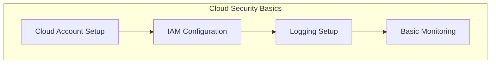
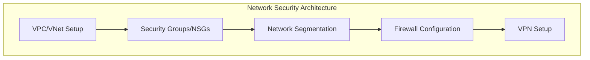
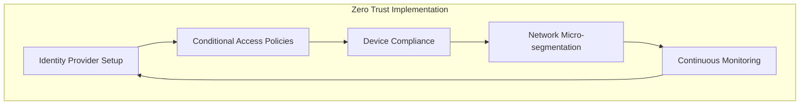
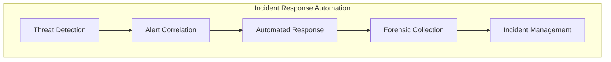
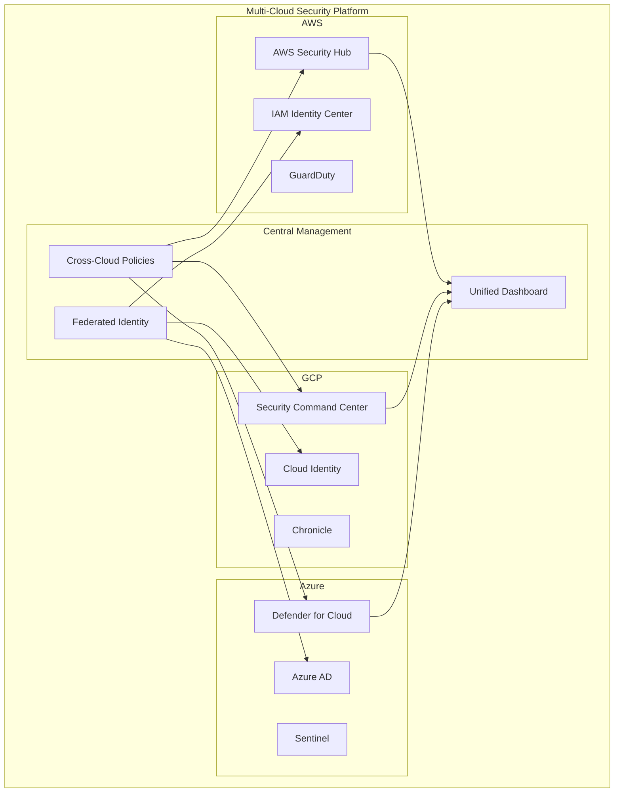
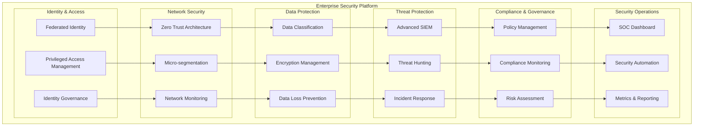

# Cloud Security Engineering Labs

## 🧪 **Hands-on Laboratory Exercises**

Welcome to the comprehensive hands-on laboratory section of the Cloud Security Engineering portfolio. These labs provide practical, real-world experience implementing security controls, architectures, and procedures across multiple cloud platforms.

## 🎯 **Lab Objectives**

- **Practical Application**: Apply theoretical knowledge to real-world scenarios
- **Skill Development**: Build hands-on expertise with security tools and technologies
- **Problem Solving**: Develop troubleshooting and analytical skills
- **Portfolio Building**: Create demonstrable artifacts for professional portfolios
- **Certification Preparation**: Prepare for industry security certifications

## 📚 **Lab Categories**

### **🌱 Beginner Labs (Weeks 1-2)**
*Prerequisites: Basic cloud computing knowledge*

**Learning Focus:**
- Security fundamentals and basic concepts
- Cloud platform familiarization
- Basic security tool usage
- Foundational security configurations

**Time Investment:** 2-3 hours per lab

### **🔄 Intermediate Labs (Weeks 3-6)**
*Prerequisites: Completion of beginner labs*

**Learning Focus:**
- Advanced security implementations
- Multi-service integrations
- Security automation basics
- Compliance implementations

**Time Investment:** 4-6 hours per lab

### **🚀 Advanced Labs (Weeks 7-10)**
*Prerequisites: Completion of intermediate labs*

**Learning Focus:**
- Complex security architectures
- Advanced threat detection and response
- Custom security solutions
- Enterprise-grade implementations

**Time Investment:** 6-8 hours per lab

### **🏆 Capstone Lab (Weeks 11-12)**
*Prerequisites: Completion of all previous labs*

**Learning Focus:**
- End-to-end security architecture
- Multi-cloud implementations
- Complete security lifecycle
- Professional portfolio project

**Time Investment:** 20-30 hours

## 🗂️ **Lab Structure**

Each lab follows a consistent structure for optimal learning:

### **Lab Components**
1. **Overview & Objectives**: Clear learning goals and expected outcomes
2. **Prerequisites**: Required knowledge, tools, and setup
3. **Architecture Diagram**: Visual representation of what you'll build
4. **Step-by-Step Instructions**: Detailed implementation guidance
5. **Code & Configuration**: Complete scripts and configuration files
6. **Validation & Testing**: Verification procedures and test cases
7. **Troubleshooting**: Common issues and resolution steps
8. **Extension Activities**: Additional challenges for advanced learners
9. **Cleanup Procedures**: Resource cleanup to avoid ongoing costs

### **Lab Environment Setup**
- **Cloud Accounts**: Free tier accounts for AWS, GCP, and Azure
- **Development Environment**: VS Code with cloud extensions
- **Required Tools**: Cloud CLIs, Terraform, Docker, Python
- **Lab Environment**: Sandbox environment with limited permissions

## 🏗️ **Beginner Labs**

### **Lab 1.1: Cloud Security Fundamentals**
**Duration:** 2 hours | **Platform:** Multi-cloud | **Difficulty:** ⭐

**Objectives:**
- Set up cloud accounts with proper security configurations
- Implement basic IAM policies and roles
- Configure audit logging and monitoring
- Understand cloud security shared responsibility model

**What You'll Build:**


**Key Learning Outcomes:**
- Cloud platform security basics
- Identity and access management fundamentals
- Security logging and monitoring setup
- Best practices for cloud account security

### **Lab 1.2: Network Security Implementation**
**Duration:** 3 hours | **Platform:** AWS/Azure/GCP | **Difficulty:** ⭐⭐

**Objectives:**
- Design and implement VPC/VNet with security groups
- Configure network segmentation and micro-segmentation
- Set up firewall rules and network access controls
- Implement VPN connectivity for secure access

**What You'll Build:**


### **Lab 1.3: Data Encryption and Key Management**
**Duration:** 2.5 hours | **Platform:** Multi-cloud | **Difficulty:** ⭐⭐

**Objectives:**
- Implement encryption at rest and in transit
- Set up cloud key management services
- Configure automated key rotation
- Implement application-level encryption

**What You'll Build:**
- Cloud KMS setup and configuration
- Database encryption implementation
- File storage encryption
- Application encryption integration

## 🔄 **Intermediate Labs**

### **Lab 2.1: Zero Trust Architecture Implementation**
**Duration:** 5 hours | **Platform:** Multi-cloud | **Difficulty:** ⭐⭐⭐

**Objectives:**
- Design and implement zero trust network architecture
- Configure identity-aware proxy and conditional access
- Set up device compliance and trust verification
- Implement continuous monitoring and verification

**What You'll Build:**


### **Lab 2.2: AI/ML Security Pipeline**
**Duration:** 6 hours | **Platform:** AWS/GCP | **Difficulty:** ⭐⭐⭐

**Objectives:**
- Secure machine learning development pipeline
- Implement differential privacy for model training
- Set up model serving with security controls
- Configure ML model monitoring and governance

**What You'll Build:**
- Secure MLOps pipeline with encryption
- Privacy-preserving model training environment
- Secure model serving infrastructure
- ML governance and compliance framework

### **Lab 2.3: Automated Compliance Monitoring**
**Duration:** 4 hours | **Platform:** Multi-cloud | **Difficulty:** ⭐⭐⭐

**Objectives:**
- Implement automated compliance checking
- Set up policy-as-code for governance
- Configure compliance reporting and alerting
- Build remediation workflows for violations

**What You'll Build:**
- Policy-as-code implementation
- Automated compliance scanning
- Violation detection and alerting
- Automated remediation workflows

### **Lab 2.4: Security Incident Response Automation**
**Duration:** 5 hours | **Platform:** Multi-cloud | **Difficulty:** ⭐⭐⭐

**Objectives:**
- Build automated incident detection system
- Create incident response playbooks
- Implement security orchestration workflows
- Set up forensic data collection automation

**What You'll Build:**


## 🚀 **Advanced Labs**

### **Lab 3.1: Multi-Cloud Security Architecture**
**Duration:** 8 hours | **Platform:** AWS + GCP + Azure | **Difficulty:** ⭐⭐⭐⭐

**Objectives:**
- Design unified security architecture across multiple clouds
- Implement cross-cloud identity federation
- Set up centralized security monitoring and management
- Build cross-cloud incident response capabilities

**What You'll Build:**


### **Lab 3.2: Advanced Threat Hunting Platform**
**Duration:** 7 hours | **Platform:** Multi-cloud | **Difficulty:** ⭐⭐⭐⭐

**Objectives:**
- Build advanced threat hunting capabilities
- Implement behavioral analytics and machine learning detection
- Create custom threat detection rules and playbooks
- Set up threat intelligence integration and sharing

**What You'll Build:**
- Advanced SIEM with ML-powered detection
- Custom threat hunting queries and dashboards
- Behavioral analytics for insider threat detection
- Threat intelligence platform integration

### **Lab 3.3: Secure DevSecOps Pipeline**
**Duration:** 6 hours | **Platform:** Multi-cloud | **Difficulty:** ⭐⭐⭐⭐

**Objectives:**
- Build end-to-end secure CI/CD pipeline
- Implement security testing automation
- Set up infrastructure as code with security scanning
- Configure runtime security monitoring

**What You'll Build:**
- Secure CI/CD pipeline with automated security testing
- Infrastructure as code with security compliance
- Container security scanning and runtime protection
- Application security monitoring and response

### **Lab 3.4: Enterprise Identity and Access Management**
**Duration:** 8 hours | **Platform:** Multi-cloud | **Difficulty:** ⭐⭐⭐⭐

**Objectives:**
- Design enterprise-grade identity architecture
- Implement privileged access management (PAM)
- Set up identity governance and administration (IGA)
- Build access analytics and risk assessment

**What You'll Build:**
- Comprehensive identity management platform
- Privileged access management solution
- Identity governance workflows
- Access risk analytics and reporting

## 🏆 **Capstone Lab: Enterprise Security Architecture**

### **Lab 4.1: Complete Security Platform Implementation**
**Duration:** 25 hours | **Platform:** Multi-cloud | **Difficulty:** ⭐⭐⭐⭐⭐

**Objectives:**
- Design and implement complete enterprise security architecture
- Integrate all security components into unified platform
- Demonstrate security operations and incident response
- Present comprehensive security portfolio project

**What You'll Build:**


**Project Components:**
1. **Architecture Design**: Complete security architecture documentation
2. **Implementation**: Fully functional security platform
3. **Operations**: Security operations procedures and playbooks
4. **Compliance**: Compliance framework and reporting
5. **Documentation**: Comprehensive implementation and operations guides
6. **Presentation**: Professional portfolio presentation

## 🛠️ **Lab Environment Setup**

### **Prerequisites**
- Cloud platform accounts (AWS, GCP, Azure free tiers)
- Development environment with required tools
- Basic understanding of command-line interfaces
- Familiarity with cloud computing concepts

### **Required Tools**
```bash
# Cloud CLIs
aws-cli
gcloud
azure-cli

# Infrastructure as Code
terraform
ansible

# Development Tools
python3
docker
git
vscode

# Security Tools
nmap
wireshark
burpsuite
```

### **Environment Configuration**
Each lab includes:
- **Setup Scripts**: Automated environment preparation
- **Configuration Templates**: Pre-configured infrastructure templates
- **Test Data**: Sample data and scenarios for testing
- **Validation Scripts**: Automated testing and validation tools

## 📊 **Lab Assessment**

### **Assessment Criteria**
- **Implementation Quality** (40%): Correct implementation of security controls
- **Security Best Practices** (30%): Adherence to security principles and standards
- **Documentation** (20%): Clear documentation and explanation of work
- **Innovation** (10%): Creative solutions and improvements

### **Deliverables**
- **Working Implementation**: Functional security controls and systems
- **Documentation**: Implementation guides and operational procedures
- **Test Results**: Validation and testing evidence
- **Presentation**: Summary of work and lessons learned

### **Certification Path**
Successful completion of all labs provides preparation for:
- AWS Certified Security - Specialty
- Google Cloud Professional Cloud Security Engineer
- Microsoft Azure Security Engineer Associate
- (ISC)² CISSP certification
- SANS GIAC security certifications

## 🎓 **Getting Started**

### **Lab Progression**
1. **Start with Prerequisites**: Ensure you have required knowledge and tools
2. **Complete Setup**: Configure your lab environment
3. **Follow the Path**: Complete labs in order for best learning experience
4. **Practice Regularly**: Hands-on practice is essential for skill development
5. **Build Portfolio**: Document your work for professional portfolio

### **Support Resources**
- **Lab Forums**: Community discussion and peer support
- **Video Walkthroughs**: Visual guides for complex procedures
- **Office Hours**: Weekly sessions with instructors
- **Troubleshooting Guides**: Common issues and solutions

### **Lab Access**
- **Online Platform**: Web-based lab environment with cloud access
- **Local Setup**: Instructions for local development environment
- **Sandbox Environment**: Safe environment for testing and experimentation
- **Shared Resources**: Community-shared configurations and solutions

---

**Ready to start?** Begin with [Lab Environment Setup](./lab-setup/README.md) and then proceed to [Beginner Labs](./beginner/README.md).
