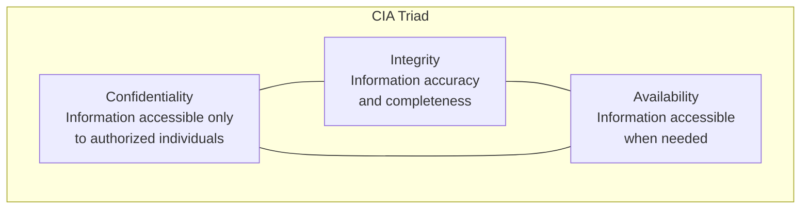
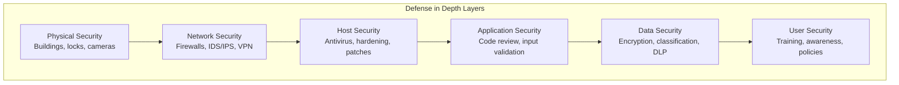
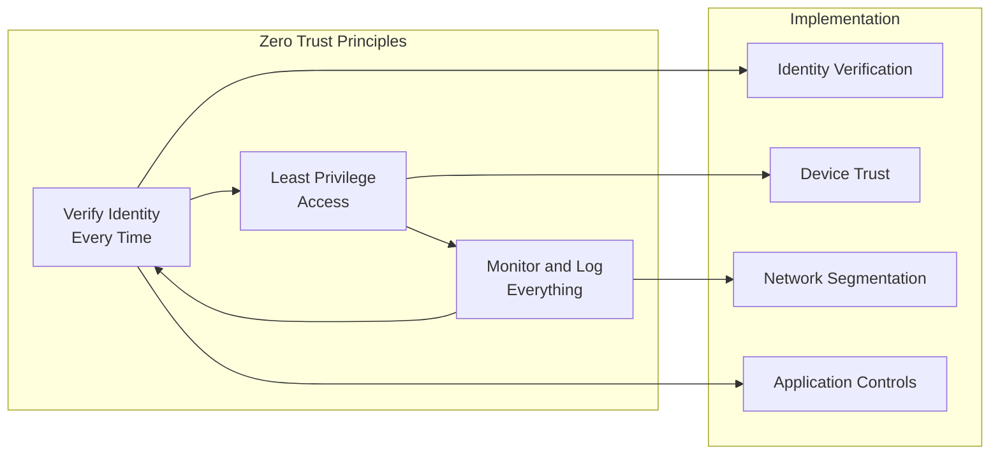
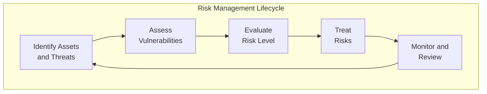
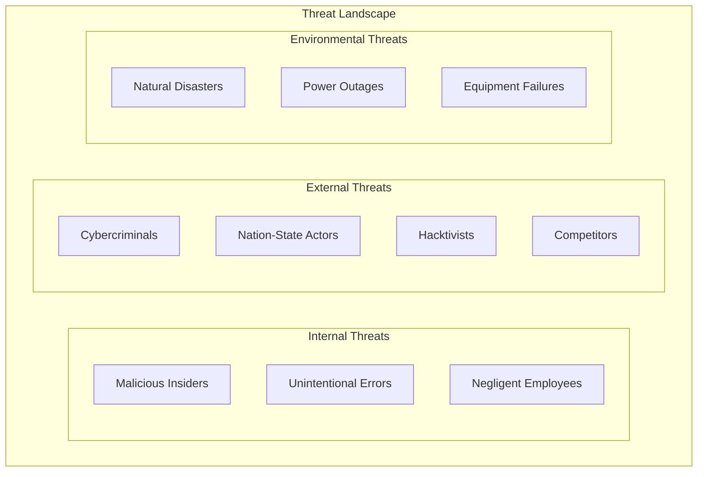
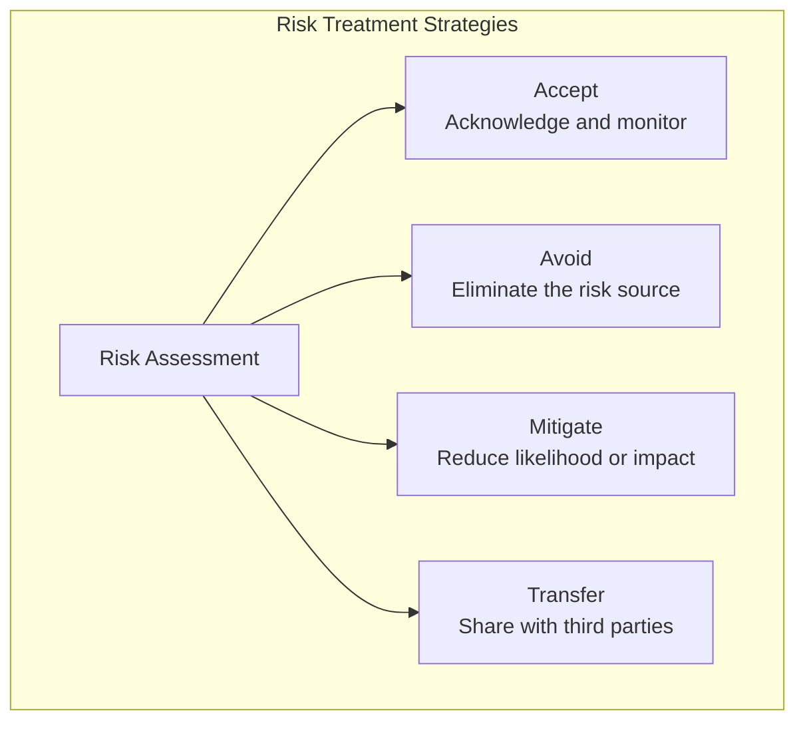
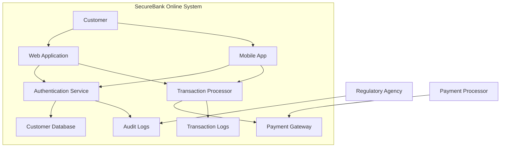

# Module 1: Security Foundations

## 🎯 **Module Overview**

This foundational module establishes the essential knowledge base for cloud security engineering. You'll master core security principles, risk management methodologies, and compliance frameworks that form the backbone of all security implementations.

**Duration:** 1 Week (40 hours)  
**Difficulty:** Beginner  
**Prerequisites:** Basic IT and networking knowledge

## 📚 **Learning Objectives**

By the end of this module, you will be able to:
- **Explain** fundamental information security principles and the CIA triad
- **Apply** risk management frameworks to real-world scenarios
- **Identify** and analyze various types of security threats and vulnerabilities
- **Evaluate** compliance requirements for different industry regulations
- **Design** basic security policies and procedures
- **Implement** threat modeling techniques for security assessments

## 🗂️ **Module Structure**

```
01-foundations/
├── 📖 README.md                          # Module overview and guide
├── 📚 lessons/                           # Structured lessons
│   ├── 1.1-security-principles.md        # Core security principles
│   ├── 1.2-cia-triad.md                  # Confidentiality, Integrity, Availability
│   ├── 1.3-threat-landscape.md           # Current threat environment
│   ├── 1.4-risk-management.md            # Risk assessment and management
│   ├── 1.5-compliance-frameworks.md      # Regulatory and industry standards
│   └── 1.6-threat-modeling.md            # Threat modeling methodologies
├── 🧪 labs/                              # Hands-on exercises
│   ├── lab01-threat-modeling.md          # Threat modeling workshop
│   ├── lab02-risk-assessment.md          # Risk assessment exercise
│   └── lab03-compliance-mapping.md       # Compliance framework mapping
├── 📊 assessments/                       # Knowledge checks
│   ├── quiz-security-principles.md       # Security principles quiz
│   ├── quiz-risk-management.md           # Risk management quiz
│   └── final-assessment.md               # Module final assessment
├── 📖 resources/                         # Additional materials
│   ├── reading-list.md                   # Recommended reading
│   ├── glossary.md                       # Key terms and definitions
│   └── templates/                        # Policy and assessment templates
└── 🎯 projects/                          # Practical projects
    ├── security-policy-creation.md       # Create organizational security policy
    └── threat-assessment-report.md       # Comprehensive threat assessment
```

## 📖 **Lesson 1.1: Security Principles**

### **Core Security Principles**

#### **The CIA Triad**


**Confidentiality:**
- **Definition**: Ensuring information is accessible only to authorized individuals
- **Implementation**: Encryption, access controls, classification systems
- **Examples**: Data encryption, user authentication, need-to-know basis
- **Threats**: Data breaches, unauthorized access, insider threats

**Integrity:**
- **Definition**: Maintaining accuracy and completeness of information
- **Implementation**: Digital signatures, checksums, audit trails
- **Examples**: File integrity monitoring, database constraints, version control
- **Threats**: Data corruption, unauthorized modifications, malware

**Availability:**
- **Definition**: Ensuring information and systems are accessible when needed
- **Implementation**: Redundancy, backup systems, disaster recovery
- **Examples**: Load balancing, failover systems, business continuity
- **Threats**: DDoS attacks, system failures, natural disasters

#### **Additional Security Principles**

**Authentication:**
- **Definition**: Verifying the identity of users, systems, or processes
- **Methods**: Something you know (password), have (token), are (biometric)
- **Multi-factor Authentication (MFA)**: Combining multiple authentication methods
- **Zero Trust**: Continuous verification of identity and context

**Authorization:**
- **Definition**: Granting or denying access to resources based on authenticated identity
- **Models**: Role-based (RBAC), Attribute-based (ABAC), Mandatory (MAC)
- **Principle of Least Privilege**: Granting minimum necessary access
- **Separation of Duties**: Dividing critical functions among multiple people

**Accountability:**
- **Definition**: Tracking and recording actions for later review
- **Implementation**: Audit logs, digital signatures, non-repudiation
- **Components**: User identification, action recording, time stamping
- **Legal Requirements**: Compliance with regulations and internal policies

**Non-repudiation:**
- **Definition**: Preventing denial of actions or transactions
- **Implementation**: Digital signatures, cryptographic proof, audit trails
- **Legal Implications**: Enforceable evidence in legal proceedings
- **Trust Establishment**: Building confidence in digital transactions

### **Security Models and Frameworks**

#### **Defense in Depth**


**Layer Implementation:**
1. **Physical Security**: Securing physical access to infrastructure
2. **Network Security**: Protecting network communications and access
3. **Host Security**: Securing individual systems and servers
4. **Application Security**: Protecting software applications and services
5. **Data Security**: Safeguarding information assets
6. **User Security**: Educating and managing human factors

#### **Zero Trust Security Model**


**Core Tenets:**
- Never trust, always verify
- Assume breach has occurred
- Verify explicitly with multiple data points
- Use least privileged access consistently
- Minimize blast radius of potential breaches

### **Practical Exercise: Security Principle Application**

**Scenario:** You're designing security for an online banking application.

**Task:** Apply each security principle to protect different aspects:

1. **Confidentiality**: How will you protect customer financial data?
2. **Integrity**: How will you ensure transaction accuracy?
3. **Availability**: How will you maintain 24/7 service availability?
4. **Authentication**: What methods will verify customer identity?
5. **Authorization**: How will you control access to different features?

**Deliverable:** Security requirements document with specific controls for each principle.

## 📖 **Lesson 1.2: Risk Management**

### **Risk Management Framework**

#### **Risk Assessment Process**


#### **Asset Identification and Valuation**

**Asset Categories:**
- **Information Assets**: Customer data, intellectual property, financial records
- **Physical Assets**: Servers, workstations, mobile devices, facilities
- **Human Assets**: Employees, contractors, business partners
- **Logical Assets**: Software applications, databases, network infrastructure
- **Reputation Assets**: Brand value, customer trust, market position

**Asset Valuation Methods:**
1. **Replacement Cost**: Cost to replace or recreate the asset
2. **Market Value**: Current market price for similar assets
3. **Business Impact**: Revenue or operational impact if asset is lost
4. **Regulatory Value**: Cost of non-compliance if asset is compromised

#### **Threat Identification**

**Threat Categories:**


**Threat Actor Motivations:**
- **Financial Gain**: Ransomware, fraud, data theft for sale
- **Espionage**: Stealing intellectual property or state secrets
- **Disruption**: Causing operational or reputational damage
- **Ideology**: Political or social activism through cyber attacks
- **Personal**: Revenge, curiosity, or challenge-seeking

#### **Vulnerability Assessment**

**Vulnerability Types:**
- **Technical Vulnerabilities**: Software bugs, misconfigurations, outdated systems
- **Physical Vulnerabilities**: Inadequate physical security controls
- **Administrative Vulnerabilities**: Poor policies, inadequate training
- **Operational Vulnerabilities**: Process weaknesses, human errors

**Assessment Methods:**
1. **Automated Scanning**: Vulnerability scanners, configuration audits
2. **Manual Testing**: Penetration testing, code review
3. **Documentation Review**: Policy analysis, procedure evaluation
4. **Interviews**: Staff interviews, process walkthroughs

#### **Risk Calculation and Evaluation**

**Qualitative Risk Assessment:**
```
Risk Level = Threat Likelihood × Impact Severity

Low Risk: Unlikely threats with minimal impact
Medium Risk: Possible threats with moderate impact
High Risk: Likely threats with significant impact
Critical Risk: Probable threats with severe impact
```

**Quantitative Risk Assessment:**
```
Annual Loss Expectancy (ALE) = 
Single Loss Expectancy (SLE) × Annual Rate of Occurrence (ARO)

Where:
SLE = Asset Value × Exposure Factor
ARO = Expected frequency of threat occurrence per year
```

**Risk Matrix Example:**
| Likelihood | Low Impact | Medium Impact | High Impact | Critical Impact |
|------------|------------|---------------|-------------|-----------------|
| Very Low   | Low        | Low           | Medium      | Medium          |
| Low        | Low        | Medium        | Medium      | High            |
| Medium     | Medium     | Medium        | High        | High            |
| High       | Medium     | High          | High        | Critical        |
| Very High  | High       | High          | Critical    | Critical        |

### **Risk Treatment Strategies**

#### **Risk Response Options**


**Accept (Tolerance):**
- **When**: Risk is below acceptable threshold
- **Implementation**: Document decision, monitor regularly
- **Example**: Accepting risk of minor website defacement

**Avoid (Elimination):**
- **When**: Risk is too high and other strategies aren't viable
- **Implementation**: Remove risky activity or asset
- **Example**: Not offering online services to avoid cyber risks

**Mitigate (Reduction):**
- **When**: Risk can be reduced to acceptable levels
- **Implementation**: Implement security controls
- **Example**: Installing firewalls to reduce network intrusion risk

**Transfer (Sharing):**
- **When**: Risk can be shifted to another party
- **Implementation**: Insurance, outsourcing, contracts
- **Example**: Cyber insurance for data breach incidents

### **Practical Exercise: Risk Assessment Workshop**

**Scenario:** Small e-commerce company with online store and customer database.

**Assets to Assess:**
- Customer payment information
- Product inventory database
- E-commerce website
- Customer personal information
- Business financial records

**Your Tasks:**
1. **Asset Valuation**: Assign business value to each asset
2. **Threat Identification**: List potential threats for each asset
3. **Vulnerability Assessment**: Identify weaknesses in current setup
4. **Risk Calculation**: Calculate risk levels for each threat-asset pair
5. **Treatment Planning**: Recommend risk treatment strategies

**Deliverable:** Complete risk assessment report with recommendations.

## 🧪 **Lab 1.1: Threat Modeling Workshop**

### **Lab Overview**
**Duration:** 3 hours  
**Difficulty:** Beginner  
**Tools Required:** Draw.io or Lucidchart, STRIDE worksheet

### **Lab Objectives**
- Learn the STRIDE threat modeling methodology
- Create data flow diagrams for security analysis
- Identify threats and vulnerabilities systematically
- Develop countermeasures for identified threats

### **Scenario**
You're the security consultant for "SecureBank Online," a new digital banking platform. The bank offers:
- Online account management
- Money transfers between accounts
- Bill payment services
- Mobile banking app
- Customer support chat

### **Step 1: Create Data Flow Diagram (45 minutes)**

**Components to Include:**
- External entities (customers, payment processors, regulatory agencies)
- Processes (authentication, transaction processing, account management)
- Data stores (customer database, transaction logs, audit records)
- Data flows (login credentials, account information, transaction data)

**Sample DFD Elements:**


### **Step 2: Apply STRIDE Analysis (90 minutes)**

**STRIDE Methodology:**
- **S**poofing: Impersonating users or systems
- **T**ampering: Modifying data or code
- **R**epudiation: Denying actions or transactions
- **I**nformation Disclosure: Exposing confidential information
- **D**enial of Service: Making systems unavailable
- **E**levation of Privilege: Gaining unauthorized access

**Analysis Template for Each Component:**

| Component | Spoofing | Tampering | Repudiation | Info Disclosure | DoS | Elevation |
|-----------|----------|-----------|-------------|-----------------|-----|-----------|
| Web App   | Fake login pages | Code injection | Log manipulation | Session hijacking | DDoS | SQL injection |
| Database  | N/A | Data modification | Transaction denial | Data exposure | Resource exhaustion | Privilege escalation |

### **Step 3: Identify Countermeasures (60 minutes)**

**For Each Threat Category:**

**Spoofing Countermeasures:**
- Multi-factor authentication
- Digital certificates
- Strong password policies
- Account lockout mechanisms

**Tampering Countermeasures:**
- Input validation
- Code signing
- Integrity checking
- Access controls

**Repudiation Countermeasures:**
- Digital signatures
- Audit logging
- Non-repudiation protocols
- Timestamping

**Information Disclosure Countermeasures:**
- Encryption in transit and at rest
- Access controls
- Data masking
- Secure communication protocols

**Denial of Service Countermeasures:**
- Rate limiting
- Load balancing
- DDoS protection
- Resource monitoring

**Elevation of Privilege Countermeasures:**
- Principle of least privilege
- Regular security updates
- Code review
- Privilege separation

### **Step 4: Risk Prioritization (30 minutes)**

**Risk Rating Matrix:**
Rate each threat on likelihood (1-5) and impact (1-5):

| Threat | Likelihood | Impact | Risk Score | Priority |
|--------|------------|--------|------------|----------|
| SQL Injection | 4 | 5 | 20 | Critical |
| DDoS Attack | 3 | 3 | 9 | Medium |
| Insider Threat | 2 | 4 | 8 | Medium |

### **Step 5: Documentation and Presentation (15 minutes)**

**Deliverables:**
1. **Data Flow Diagram**: Complete system visualization
2. **STRIDE Analysis**: Comprehensive threat identification
3. **Countermeasure Plan**: Specific security controls for each threat
4. **Risk Assessment**: Prioritized list of threats with treatment plans
5. **Implementation Roadmap**: Timeline for deploying countermeasures

**Presentation Format:**
- Executive summary (5 minutes)
- Technical findings (10 minutes)
- Recommendations (5 minutes)
- Q&A session

### **Lab Assessment Criteria**
- **Completeness**: All system components analyzed (25%)
- **Accuracy**: Correct application of STRIDE methodology (25%)
- **Practicality**: Realistic and implementable countermeasures (25%)
- **Communication**: Clear documentation and presentation (25%)

## 📊 **Module Assessment**

### **Knowledge Check Quiz (50 questions)**

**Sample Questions:**

**Question 1:** Which of the following best describes the principle of "Least Privilege"?
A) Users should have the maximum access needed for their job
B) Users should have the minimum access required to perform their duties
C) Users should have the same access as their managers
D) Users should have access to all non-sensitive systems

**Question 2:** In risk management, what does ALE stand for?
A) Annual Loss Expectancy
B) Asset Liability Evaluation
C) Automated Loss Estimation
D) Advanced Loss Evaluation

### **Practical Assessment Project**

**Project:** Security Policy Development for Small Business

**Scenario:** Create a comprehensive security policy for a 50-employee marketing agency that handles sensitive client data.

**Requirements:**
1. **Asset Inventory**: Identify and classify all organizational assets
2. **Risk Assessment**: Conduct comprehensive risk analysis
3. **Policy Framework**: Develop security policies covering all major areas
4. **Implementation Plan**: Create realistic deployment timeline
5. **Compliance Mapping**: Align with relevant regulations (GDPR, etc.)

**Deliverables:**
- Executive summary (2 pages)
- Detailed risk assessment (5-10 pages)
- Security policy document (10-15 pages)
- Implementation roadmap (2-3 pages)
- Compliance checklist (1-2 pages)

**Assessment Rubric:**
- **Risk Analysis Quality** (30%): Thorough identification and assessment of risks
- **Policy Completeness** (25%): Comprehensive coverage of security domains
- **Practical Implementation** (25%): Realistic and actionable recommendations
- **Professional Presentation** (20%): Clear, well-organized documentation

## 📚 **Additional Resources**

### **Recommended Reading**
- **NIST Cybersecurity Framework**: Complete guide to security management
- **ISO 27001 Standard**: International information security management
- **OWASP Top 10**: Web application security risks
- **SANS Reading Room**: Security whitepapers and research

### **Online Resources**
- **NIST SP 800-30**: Risk Management Guide
- **Carnegie Mellon OCTAVE**: Risk assessment methodology
- **Microsoft STRIDE**: Threat modeling documentation
- **FAIR Institute**: Quantitative risk analysis resources

### **Professional Development**
- **Security+ Certification**: Entry-level security certification
- **CISSP Associate**: Advanced security professional track
- **Risk Management Certifications**: CRISC, CISA specializations
- **Local Security Groups**: ISACA, ISC2 chapter meetings

---

**Next Module:** [02-Cloud Security Fundamentals](../02-cloud-security/README.md)
