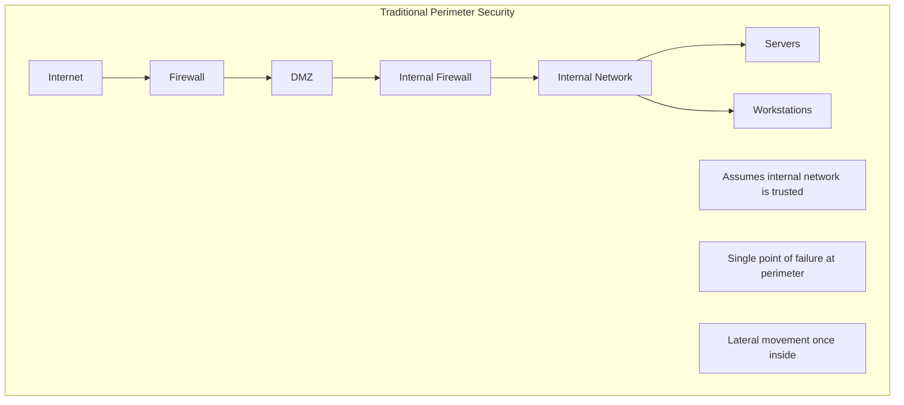
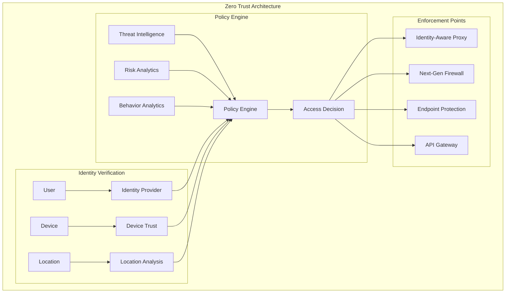
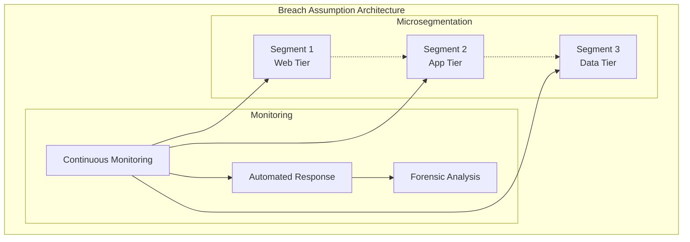
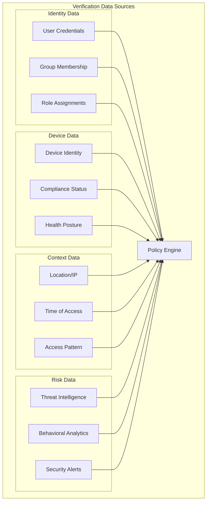
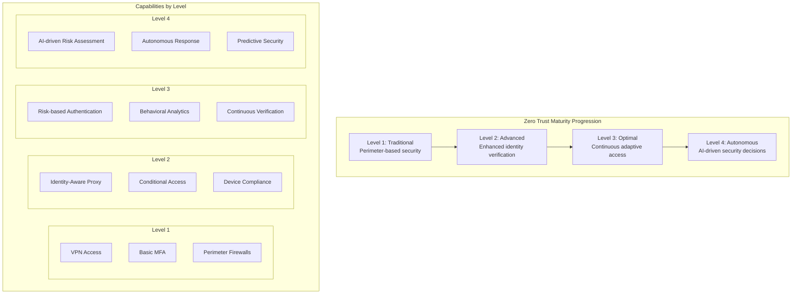
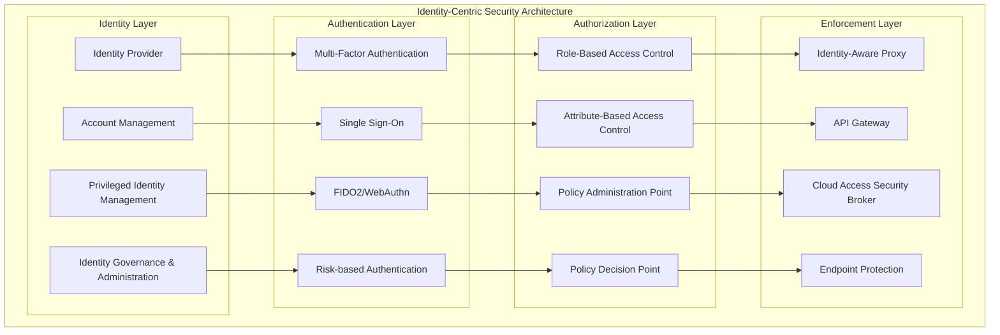
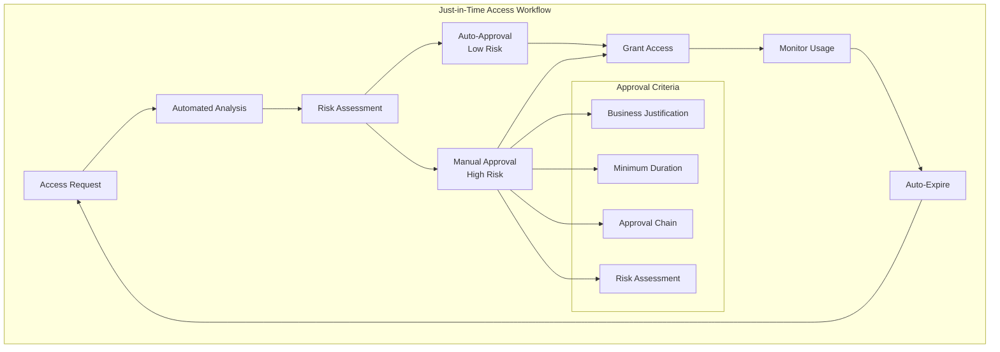
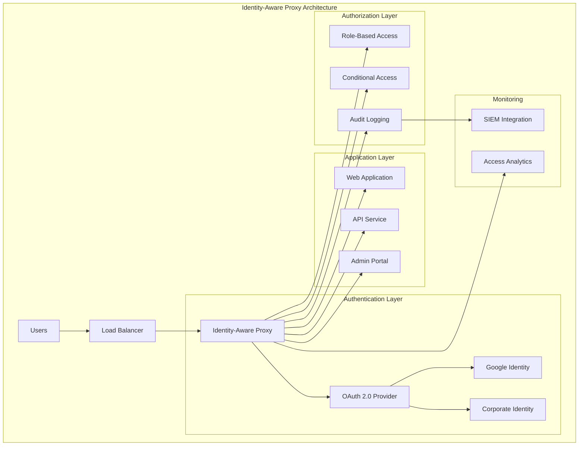

# Module 3: Zero Trust Architecture

## 🎯 **Module Overview**

This advanced module focuses on designing and implementing comprehensive zero trust security architectures. You'll learn to build identity-centric security models that continuously verify every transaction and enforce least privilege access across all systems and users.

**Duration:** 2 Weeks (80 hours)  
**Difficulty:** Intermediate-Advanced  
**Prerequisites:** Completion of Modules 1-2, understanding of cloud platforms

## 📚 **Learning Objectives**

By the end of this module, you will be able to:
- **Design** comprehensive zero trust architecture for enterprise environments
- **Implement** identity-centric security models with continuous verification
- **Deploy** network micro-segmentation and software-defined perimeters
- **Configure** conditional access policies and risk-based authentication
- **Build** device trust and compliance verification systems
- **Monitor** and analyze zero trust security posture continuously

## 🗂️ **Module Structure**

```
03-zero-trust/
├── 📖 README.md                          # Module overview and guide
├── 📚 lessons/                           # Comprehensive lessons
│   ├── 3.1-zero-trust-principles.md      # Core principles and concepts
│   ├── 3.2-identity-centric-security.md  # Identity as security perimeter
│   ├── 3.3-device-trust-compliance.md    # Device security and compliance
│   ├── 3.4-network-microsegmentation.md  # Network security architecture
│   ├── 3.5-application-access-control.md # Application-level security
│   ├── 3.6-data-centric-protection.md    # Data security and governance
│   └── 3.7-continuous-monitoring.md      # Monitoring and analytics
├── 🧪 labs/                              # Hands-on implementations
│   ├── lab01-identity-architecture.md    # Identity provider setup
│   ├── lab02-conditional-access.md       # Conditional access policies
│   ├── lab03-device-compliance.md        # Device trust implementation
│   ├── lab04-network-segmentation.md     # Micro-segmentation setup
│   ├── lab05-application-proxy.md        # Identity-aware proxy
│   └── lab06-monitoring-analytics.md     # Zero trust monitoring
├── 🏗️ architecture/                      # Architecture patterns
│   ├── enterprise-reference.md           # Enterprise zero trust design
│   ├── multi-cloud-federation.md         # Multi-cloud zero trust
│   ├── hybrid-architecture.md            # Hybrid cloud zero trust
│   └── implementation-patterns.md        # Common implementation patterns
├── 🔧 tools/                             # Tools and technologies
│   ├── identity-providers.md             # IdP comparison and setup
│   ├── access-management.md              # Access management tools
│   ├── network-security.md               # Network security tools
│   └── monitoring-solutions.md           # Monitoring and analytics
├── 📊 assessments/                       # Module assessments
│   ├── design-challenge.md               # Architecture design challenge
│   ├── implementation-project.md         # Hands-on implementation
│   └── case-study-analysis.md            # Real-world case studies
└── 🎯 capstone/                          # Capstone project
    └── enterprise-zero-trust.md          # Complete implementation
```

## 📖 **Lesson 3.1: Zero Trust Principles**

### **Evolution from Perimeter Security**

#### **Traditional Security Model Limitations**


**Challenges with Perimeter Security:**
- **Castle-and-Moat Mentality**: Trust based on network location
- **Insider Threats**: Assumed trust for internal users
- **Lateral Movement**: Attackers move freely once inside
- **Cloud Adoption**: Perimeter becomes unclear in cloud environments
- **Remote Work**: Users outside traditional perimeter
- **Device Proliferation**: BYOD and IoT devices challenge trust assumptions

#### **Zero Trust Security Model**


### **Core Zero Trust Principles**

#### **1. Never Trust, Always Verify**
- **Continuous Authentication**: Verify identity at every access attempt
- **Context-Aware Access**: Consider multiple factors for access decisions
- **Dynamic Risk Assessment**: Continuously evaluate risk levels
- **Explicit Verification**: Use multiple data sources for verification

**Implementation Examples:**
```python
class ContinuousVerification:
    def __init__(self):
        self.identity_provider = IdentityProvider()
        self.device_trust = DeviceTrustService()
        self.risk_engine = RiskAnalyticsEngine()
        self.policy_engine = PolicyEngine()
    
    def verify_access_request(self, request):
        # Multi-factor verification
        identity_verified = self.identity_provider.verify_identity(
            request.user_id, 
            request.credentials,
            request.mfa_token
        )
        
        # Device trust verification
        device_trusted = self.device_trust.verify_device(
            request.device_id,
            request.device_fingerprint,
            request.device_certificates
        )
        
        # Risk assessment
        risk_score = self.risk_engine.calculate_risk(
            user=request.user_id,
            device=request.device_id,
            location=request.source_ip,
            behavior=request.access_pattern,
            time=request.timestamp
        )
        
        # Policy evaluation
        access_decision = self.policy_engine.evaluate_access(
            identity_verified=identity_verified,
            device_trusted=device_trusted,
            risk_score=risk_score,
            resource=request.resource,
            action=request.action
        )
        
        return {
            'access_granted': access_decision.allow,
            'conditions': access_decision.conditions,
            'monitoring_required': risk_score > 0.7,
            'session_duration': access_decision.session_timeout
        }
```

#### **2. Assume Breach**
- **Minimize Blast Radius**: Limit impact of potential breaches
- **Lateral Movement Prevention**: Segment networks and applications
- **Continuous Monitoring**: Detect and respond to threats quickly
- **Zero Standing Access**: Grant access only when needed

**Architecture Pattern:**


#### **3. Verify Explicitly**
- **Multiple Data Points**: Use comprehensive verification data
- **Real-time Analysis**: Make decisions based on current context
- **Risk-based Authentication**: Adjust verification based on risk
- **Behavioral Analytics**: Detect anomalies in user behavior

**Verification Data Sources:**


#### **4. Least Privileged Access**
- **Just-in-Time Access**: Grant access only when needed
- **Just-Enough Access**: Provide minimum required permissions
- **Time-bound Access**: Automatically expire access grants
- **Regular Access Reviews**: Continuously validate access needs

**Implementation Framework:**
```python
class LeastPrivilegeAccess:
    def __init__(self):
        self.access_manager = AccessManager()
        self.privilege_analyzer = PrivilegeAnalyzer()
        self.approval_workflow = ApprovalWorkflow()
    
    def request_access(self, user_id, resource, justification, duration):
        # Analyze minimum required privileges
        required_privileges = self.privilege_analyzer.analyze_requirements(
            resource=resource,
            user_role=self.get_user_role(user_id),
            business_justification=justification
        )
        
        # Create time-bound access request
        access_request = {
            'user_id': user_id,
            'resource': resource,
            'privileges': required_privileges,
            'justification': justification,
            'requested_duration': duration,
            'max_duration': self.calculate_max_duration(resource),
            'approval_required': self.requires_approval(required_privileges)
        }
        
        if access_request['approval_required']:
            return self.approval_workflow.submit_request(access_request)
        else:
            return self.grant_access(access_request)
    
    def grant_access(self, access_request):
        # Grant minimum required access
        access_grant = self.access_manager.create_grant(
            user_id=access_request['user_id'],
            resource=access_request['resource'],
            privileges=access_request['privileges'],
            expiration=datetime.now() + access_request['requested_duration']
        )
        
        # Schedule automatic revocation
        self.schedule_access_revocation(access_grant)
        
        # Set up monitoring
        self.setup_access_monitoring(access_grant)
        
        return access_grant
```

### **Zero Trust Maturity Model**

#### **Maturity Levels**


#### **Assessment Framework**
**Identity Maturity:**
- Level 1: Basic authentication and authorization
- Level 2: Multi-factor authentication and role-based access
- Level 3: Risk-based and adaptive authentication
- Level 4: Behavioral biometrics and AI-driven identity

**Device Maturity:**
- Level 1: Basic device inventory and management
- Level 2: Device compliance and health verification
- Level 3: Continuous device risk assessment
- Level 4: Autonomous device response and remediation

**Network Maturity:**
- Level 1: Traditional network segmentation
- Level 2: Software-defined perimeters
- Level 3: Micro-segmentation and encrypted tunnels
- Level 4: AI-driven network policies and autonomous response

**Application Maturity:**
- Level 1: Basic application firewalls
- Level 2: Identity-aware application access
- Level 3: API security and runtime protection
- Level 4: Autonomous application security and self-healing

**Data Maturity:**
- Level 1: Basic data classification and encryption
- Level 2: Rights management and data loss prevention
- Level 3: Dynamic data protection and usage monitoring
- Level 4: Autonomous data governance and protection

## 📖 **Lesson 3.2: Identity-Centric Security**

### **Identity as the New Perimeter**

#### **Identity-First Architecture**


### **Advanced Authentication Methods**

#### **Multi-Factor Authentication (MFA)**

**Something You Know (Knowledge Factors):**
```python
class KnowledgeFactors:
    def __init__(self):
        self.password_policy = PasswordPolicy()
        self.security_questions = SecurityQuestions()
        self.pin_manager = PINManager()
    
    def validate_password(self, user_id, password):
        # Check password strength and policy compliance
        policy_check = self.password_policy.validate(password)
        
        # Check against compromised password databases
        breach_check = self.check_password_breaches(password)
        
        # Validate against user's password history
        history_check = self.check_password_history(user_id, password)
        
        return {
            'valid': policy_check and not breach_check and history_check,
            'strength_score': self.calculate_password_strength(password),
            'policy_violations': self.get_policy_violations(password),
            'breach_detected': breach_check
        }
    
    def adaptive_security_questions(self, user_id, risk_level):
        # Select questions based on risk level
        if risk_level == 'high':
            return self.security_questions.get_high_security_questions(user_id)
        elif risk_level == 'medium':
            return self.security_questions.get_medium_security_questions(user_id)
        else:
            return self.security_questions.get_basic_questions(user_id)
```

**Something You Have (Possession Factors):**
```python
class PossessionFactors:
    def __init__(self):
        self.hardware_tokens = HardwareTokenManager()
        self.mobile_push = MobilePushService()
        self.sms_service = SMSService()
        self.totp_generator = TOTPGenerator()
    
    def validate_hardware_token(self, user_id, token_serial, otp_value):
        # Validate hardware token OTP
        token_valid = self.hardware_tokens.validate_otp(
            serial_number=token_serial,
            otp_value=otp_value,
            time_window=30  # seconds
        )
        
        # Check token association with user
        user_association = self.hardware_tokens.verify_user_association(
            user_id=user_id,
            token_serial=token_serial
        )
        
        return token_valid and user_association
    
    def send_mobile_push(self, user_id, transaction_details):
        # Send push notification with transaction context
        push_request = {
            'user_id': user_id,
            'message': 'Approve sign-in request',
            'details': transaction_details,
            'approval_timeout': 60,  # seconds
            'location_info': self.get_approx_location(transaction_details['ip']),
            'device_info': transaction_details['device_info']
        }
        
        return self.mobile_push.send_approval_request(push_request)
```

**Something You Are (Inherence Factors):**
```python
class InherenceFactors:
    def __init__(self):
        self.biometric_engine = BiometricEngine()
        self.behavioral_analytics = BehavioralAnalytics()
        self.voice_recognition = VoiceRecognition()
    
    def verify_fingerprint(self, user_id, fingerprint_data):
        # Extract fingerprint features
        features = self.biometric_engine.extract_fingerprint_features(
            fingerprint_data
        )
        
        # Compare against enrolled templates
        match_result = self.biometric_engine.match_fingerprint(
            user_id=user_id,
            features=features,
            threshold=0.95  # 95% confidence
        )
        
        return {
            'verified': match_result.score >= 0.95,
            'confidence_score': match_result.score,
            'template_matched': match_result.template_id,
            'liveness_detected': self.detect_liveness(fingerprint_data)
        }
    
    def analyze_behavioral_biometrics(self, user_id, interaction_data):
        # Analyze typing patterns, mouse movements, etc.
        behavioral_profile = self.behavioral_analytics.analyze_interaction(
            user_id=user_id,
            keystroke_dynamics=interaction_data['keystrokes'],
            mouse_dynamics=interaction_data['mouse_movements'],
            touch_dynamics=interaction_data.get('touch_patterns'),
            session_duration=interaction_data['session_time']
        )
        
        # Compare against user's baseline behavior
        anomaly_score = self.behavioral_analytics.calculate_anomaly_score(
            user_id=user_id,
            current_profile=behavioral_profile
        )
        
        return {
            'behavioral_match': anomaly_score < 0.3,
            'anomaly_score': anomaly_score,
            'risk_factors': self.identify_risk_factors(behavioral_profile),
            'adaptive_confidence': self.calculate_confidence(anomaly_score)
        }
```

#### **Risk-Based Authentication**

**Risk Assessment Engine:**
```python
class RiskBasedAuthentication:
    def __init__(self):
        self.risk_engine = RiskEngine()
        self.threat_intelligence = ThreatIntelligence()
        self.user_behavior = UserBehaviorAnalytics()
        self.device_intelligence = DeviceIntelligence()
    
    def calculate_authentication_risk(self, auth_request):
        risk_factors = {}
        
        # Geographic risk
        risk_factors['geographic'] = self.assess_geographic_risk(
            user_id=auth_request.user_id,
            source_ip=auth_request.source_ip,
            historical_locations=self.get_user_locations(auth_request.user_id)
        )
        
        # Temporal risk
        risk_factors['temporal'] = self.assess_temporal_risk(
            user_id=auth_request.user_id,
            access_time=auth_request.timestamp,
            historical_patterns=self.get_access_patterns(auth_request.user_id)
        )
        
        # Device risk
        risk_factors['device'] = self.assess_device_risk(
            device_fingerprint=auth_request.device_fingerprint,
            device_reputation=self.device_intelligence.get_reputation(
                auth_request.device_fingerprint
            )
        )
        
        # Behavioral risk
        risk_factors['behavioral'] = self.assess_behavioral_risk(
            user_id=auth_request.user_id,
            interaction_patterns=auth_request.interaction_data
        )
        
        # Threat intelligence risk
        risk_factors['threat_intel'] = self.assess_threat_intelligence_risk(
            source_ip=auth_request.source_ip,
            user_agent=auth_request.user_agent
        )
        
        # Calculate composite risk score
        composite_risk = self.risk_engine.calculate_composite_score(risk_factors)
        
        return {
            'risk_score': composite_risk,
            'risk_level': self.categorize_risk(composite_risk),
            'risk_factors': risk_factors,
            'recommended_auth_methods': self.recommend_auth_methods(composite_risk),
            'additional_verification_required': composite_risk > 0.6
        }
    
    def recommend_auth_methods(self, risk_score):
        if risk_score < 0.3:
            return ['password']
        elif risk_score < 0.6:
            return ['password', 'sms_otp']
        elif risk_score < 0.8:
            return ['password', 'hardware_token', 'biometric']
        else:
            return ['password', 'hardware_token', 'biometric', 'admin_approval']
```

### **Privileged Access Management (PAM)**

#### **Just-in-Time (JIT) Access**


**JIT Implementation:**
```python
class JustInTimeAccess:
    def __init__(self):
        self.access_analyzer = AccessAnalyzer()
        self.approval_engine = ApprovalEngine()
        self.privilege_manager = PrivilegeManager()
        self.monitoring_service = MonitoringService()
    
    def request_privileged_access(self, request):
        # Analyze access requirements
        analysis = self.access_analyzer.analyze_request(
            user_id=request.user_id,
            target_resource=request.resource,
            requested_privileges=request.privileges,
            business_justification=request.justification,
            requested_duration=request.duration
        )
        
        # Determine approval requirements
        approval_required = self.determine_approval_requirements(
            privilege_level=analysis.privilege_level,
            resource_sensitivity=analysis.resource_sensitivity,
            user_risk_score=analysis.user_risk_score
        )
        
        if approval_required:
            # Submit for approval workflow
            approval_request = self.create_approval_request(request, analysis)
            return self.approval_engine.submit_request(approval_request)
        else:
            # Auto-approve low-risk requests
            return self.grant_jit_access(request, analysis)
    
    def grant_jit_access(self, request, analysis):
        # Create time-bound privilege grant
        access_grant = self.privilege_manager.create_temporary_grant(
            user_id=request.user_id,
            privileges=analysis.minimum_required_privileges,
            resource=request.resource,
            expiration=datetime.now() + analysis.recommended_duration,
            justification=request.justification
        )
        
        # Set up real-time monitoring
        monitoring_profile = self.monitoring_service.create_monitoring_profile(
            user_id=request.user_id,
            access_grant_id=access_grant.id,
            high_risk_actions=analysis.high_risk_actions,
            monitoring_intensity=analysis.required_monitoring_level
        )
        
        # Schedule automatic revocation
        self.schedule_access_revocation(access_grant)
        
        return {
            'access_granted': True,
            'grant_id': access_grant.id,
            'privileges': access_grant.privileges,
            'expiration': access_grant.expiration,
            'monitoring_profile': monitoring_profile.id
        }
```

## 🧪 **Lab 3.1: Identity-Aware Proxy Implementation**

### **Lab Overview**
**Duration:** 6 hours  
**Difficulty:** Intermediate  
**Platforms:** Google Cloud Platform (Identity-Aware Proxy)  
**Tools Required:** GCP account, gcloud CLI, Terraform

### **Lab Objectives**
- Deploy Google Cloud Identity-Aware Proxy (IAP)
- Configure OAuth 2.0 authentication and authorization
- Implement conditional access policies
- Set up application-level access controls
- Monitor and analyze access patterns

### **Architecture to Build**


### **Step 1: Environment Setup (45 minutes)**

**1.1 Create GCP Project and Enable APIs:**
```bash
#!/bin/bash
# Create new GCP project
export PROJECT_ID="zero-trust-lab-$(date +%s)"
gcloud projects create $PROJECT_ID
gcloud config set project $PROJECT_ID

# Enable required APIs
gcloud services enable compute.googleapis.com
gcloud services enable iap.googleapis.com
gcloud services enable cloudresourcemanager.googleapis.com
gcloud services enable container.googleapis.com

# Set up billing (required for compute resources)
echo "Please set up billing for project: $PROJECT_ID"
echo "Visit: https://console.cloud.google.com/billing/linkedaccount?project=$PROJECT_ID"
```

**1.2 Terraform Infrastructure Setup:**
```hcl
# main.tf
terraform {
  required_providers {
    google = {
      source  = "hashicorp/google"
      version = "~> 4.0"
    }
  }
}

provider "google" {
  project = var.project_id
  region  = var.region
}

variable "project_id" {
  description = "GCP Project ID"
  type        = string
}

variable "region" {
  description = "GCP Region"
  type        = string
  default     = "us-central1"
}

# VPC Network
resource "google_compute_network" "zero_trust_vpc" {
  name                    = "zero-trust-network"
  auto_create_subnetworks = false
}

resource "google_compute_subnetwork" "zero_trust_subnet" {
  name          = "zero-trust-subnet"
  network       = google_compute_network.zero_trust_vpc.id
  ip_cidr_range = "10.0.1.0/24"
  region        = var.region
}

# Firewall Rules
resource "google_compute_firewall" "allow_iap" {
  name    = "allow-iap-access"
  network = google_compute_network.zero_trust_vpc.name

  allow {
    protocol = "tcp"
    ports    = ["80", "443", "22"]
  }

  # IAP's IP ranges
  source_ranges = ["35.235.240.0/20"]
  target_tags   = ["iap-access"]
}

# Backend Service with Health Check
resource "google_compute_health_check" "web_health_check" {
  name = "web-health-check"

  http_health_check {
    port = 80
    path = "/health"
  }

  check_interval_sec  = 10
  timeout_sec         = 5
  healthy_threshold   = 2
  unhealthy_threshold = 3
}

# Instance Template
resource "google_compute_instance_template" "web_template" {
  name = "web-server-template"

  machine_type = "e2-micro"

  disk {
    source_image = "debian-cloud/debian-11"
    auto_delete  = true
    boot         = true
  }

  network_interface {
    network    = google_compute_network.zero_trust_vpc.id
    subnetwork = google_compute_subnetwork.zero_trust_subnet.id
  }

  tags = ["iap-access", "web-server"]

  metadata_startup_script = file("startup-script.sh")

  service_account {
    scopes = ["cloud-platform"]
  }
}

# Managed Instance Group
resource "google_compute_instance_group_manager" "web_group" {
  name = "web-server-group"
  zone = "${var.region}-a"

  version {
    instance_template = google_compute_instance_template.web_template.id
  }

  base_instance_name = "web"
  target_size        = 2

  named_port {
    name = "http"
    port = 80
  }
}

# Backend Service
resource "google_compute_backend_service" "web_backend" {
  name          = "web-backend-service"
  health_checks = [google_compute_health_check.web_health_check.id]
  protocol      = "HTTP"
  port_name     = "http"

  backend {
    group = google_compute_instance_group_manager.web_group.instance_group
  }

  iap {
    oauth2_client_id     = google_iap_client.project_client.client_id
    oauth2_client_secret = google_iap_client.project_client.secret
  }
}

# IAP OAuth Client
resource "google_iap_client" "project_client" {
  display_name = "Zero Trust Lab Client"
  brand        = google_iap_brand.project_brand.name
}

resource "google_iap_brand" "project_brand" {
  support_email     = var.support_email
  application_title = "Zero Trust Lab"
  project           = var.project_id
}

# URL Map
resource "google_compute_url_map" "web_map" {
  name            = "web-url-map"
  default_service = google_compute_backend_service.web_backend.id
}

# HTTP Proxy
resource "google_compute_target_http_proxy" "web_proxy" {
  name    = "web-http-proxy"
  url_map = google_compute_url_map.web_map.id
}

# Global Forwarding Rule
resource "google_compute_global_forwarding_rule" "web_forwarding_rule" {
  name       = "web-forwarding-rule"
  target     = google_compute_target_http_proxy.web_proxy.id
  port_range = "80"
}

# IAM Bindings for IAP Access
resource "google_iap_web_iam_binding" "web_access" {
  project = var.project_id
  role    = "roles/iap.httpsResourceAccessor"
  members = var.iap_users
}
```

**1.3 Startup Script for Web Servers:**
```bash
#!/bin/bash
# startup-script.sh

# Update system
apt-get update
apt-get install -y nginx python3 python3-pip

# Create simple web application
cat > /var/www/html/index.html << 'EOF'
<!DOCTYPE html>
<html>
<head>
    <title>Zero Trust Lab - Protected Application</title>
    <style>
        body { font-family: Arial, sans-serif; margin: 40px; }
        .container { max-width: 800px; margin: 0 auto; }
        .header { background: #4285f4; color: white; padding: 20px; border-radius: 5px; }
        .content { padding: 20px; border: 1px solid #ddd; border-radius: 5px; margin-top: 20px; }
        .user-info { background: #f0f8ff; padding: 15px; border-radius: 5px; margin: 20px 0; }
    </style>
</head>
<body>
    <div class="container">
        <div class="header">
            <h1>🛡️ Zero Trust Protected Application</h1>
            <p>This application is protected by Google Cloud Identity-Aware Proxy</p>
        </div>
        
        <div class="content">
            <h2>Access Information</h2>
            <div class="user-info">
                <h3>Authenticated User Details:</h3>
                <p><strong>Email:</strong> <span id="user-email">Loading...</span></p>
                <p><strong>User ID:</strong> <span id="user-id">Loading...</span></p>
                <p><strong>Access Time:</strong> <span id="access-time"></span></p>
                <p><strong>Server:</strong> <span id="server-name"></span></p>
            </div>
            
            <h3>Protected Resources</h3>
            <ul>
                <li><a href="/admin">Admin Panel (Role-based access)</a></li>
                <li><a href="/api/data">API Endpoint (Service access)</a></li>
                <li><a href="/reports">Financial Reports (High-sensitivity)</a></li>
            </ul>
        </div>
    </div>
    
    <script>
        // Extract IAP headers and display user information
        document.getElementById('access-time').textContent = new Date().toLocaleString();
        document.getElementById('server-name').textContent = window.location.hostname;
        
        // In a real application, you would extract user info from IAP headers
        // For this demo, we'll simulate with placeholder data
        fetch('/api/user-info')
            .then(response => response.json())
            .then(data => {
                document.getElementById('user-email').textContent = data.email || 'N/A';
                document.getElementById('user-id').textContent = data.user_id || 'N/A';
            })
            .catch(error => {
                console.error('Error fetching user info:', error);
            });
    </script>
</body>
</html>
EOF

# Create health check endpoint
cat > /var/www/html/health << 'EOF'
OK
EOF

# Create API endpoint for user information
mkdir -p /var/www/html/api
cat > /var/www/html/api/user-info << 'EOF'
#!/usr/bin/env python3
import cgi
import json
import os

print("Content-Type: application/json")
print()

# Extract IAP headers
iap_email = os.environ.get('HTTP_X_GOOG_AUTHENTICATED_USER_EMAIL', 'unknown@example.com')
iap_id = os.environ.get('HTTP_X_GOOG_AUTHENTICATED_USER_ID', 'unknown')

user_info = {
    'email': iap_email.replace('accounts.google.com:', ''),
    'user_id': iap_id.replace('accounts.google.com:', ''),
    'authentication_method': 'Google Cloud IAP',
    'access_level': 'Standard User'
}

print(json.dumps(user_info, indent=2))
EOF

chmod +x /var/www/html/api/user-info

# Configure nginx
cat > /etc/nginx/sites-available/default << 'EOF'
server {
    listen 80 default_server;
    listen [::]:80 default_server;
    
    root /var/www/html;
    index index.html index.htm;
    
    server_name _;
    
    location / {
        try_files $uri $uri/ =404;
    }
    
    location /api/ {
        include fastcgi_params;
        fastcgi_param SCRIPT_FILENAME $document_root$fastcgi_script_name;
        fastcgi_param HTTP_X_GOOG_AUTHENTICATED_USER_EMAIL $http_x_goog_authenticated_user_email;
        fastcgi_param HTTP_X_GOOG_AUTHENTICATED_USER_ID $http_x_goog_authenticated_user_id;
        fastcgi_pass unix:/var/run/fcgiwrap.socket;
    }
    
    location /health {
        access_log off;
        return 200 "OK\n";
        add_header Content-Type text/plain;
    }
}
EOF

# Install and configure FastCGI
apt-get install -y fcgiwrap
systemctl enable fcgiwrap
systemctl start fcgiwrap

# Restart nginx
systemctl restart nginx
systemctl enable nginx

# Install monitoring agent
curl -sSO https://dl.google.com/cloudagents/add-logging-agent-repo.sh
bash add-logging-agent-repo.sh
apt-get update
apt-get install -y google-fluentd
```

### **Step 2: IAP Configuration and Testing (90 minutes)**

**2.1 Deploy Infrastructure:**
```bash
# Initialize and apply Terraform
terraform init
terraform plan -var="project_id=$PROJECT_ID" -var="support_email=your-email@domain.com"
terraform apply -var="project_id=$PROJECT_ID" -var="support_email=your-email@domain.com"

# Get the external IP address
EXTERNAL_IP=$(terraform output -raw external_ip)
echo "Application will be available at: http://$EXTERNAL_IP"
```

**2.2 Configure IAP Access Policies:**
```bash
# Grant IAP access to specific users
gcloud projects add-iam-policy-binding $PROJECT_ID \
    --member="user:admin@yourdomain.com" \
    --role="roles/iap.httpsResourceAccessor"

gcloud projects add-iam-policy-binding $PROJECT_ID \
    --member="group:security-team@yourdomain.com" \
    --role="roles/iap.httpsResourceAccessor"

# Configure access levels for different sensitivity
gcloud iap web add-iam-policy-binding \
    --resource-type=backend-services \
    --service=web-backend-service \
    --member="user:finance@yourdomain.com" \
    --role="roles/iap.httpsResourceAccessor"
```

**2.3 Implement Conditional Access Policies:**
```python
# conditional_access.py
import json
import logging
from google.cloud import iap
from google.oauth2 import service_account

class ConditionalAccessPolicy:
    def __init__(self, project_id):
        self.project_id = project_id
        self.iap_client = iap.IdentityAwareProxyAdminServiceClient()
    
    def create_access_policy(self, policy_name, conditions, actions):
        """Create conditional access policy"""
        policy = {
            'name': policy_name,
            'description': f'Conditional access policy: {policy_name}',
            'conditions': conditions,
            'actions': actions,
            'state': 'ENABLED'
        }
        
        # This is a simplified example - real implementation would use
        # Access Context Manager API for more sophisticated policies
        return self.apply_access_policy(policy)
    
    def create_location_based_policy(self):
        """Create policy based on user location"""
        policy = {
            'name': 'location-based-access',
            'conditions': {
                'ip_subnetworks': [
                    '203.0.113.0/24',  # Office IP range
                    '198.51.100.0/24'  # VPN IP range
                ],
                'required_access_levels': []
            },
            'actions': {
                'allow_access': True,
                'require_additional_verification': False
            }
        }
        
        return self.create_access_policy(
            'location-based-access',
            policy['conditions'],
            policy['actions']
        )
    
    def create_time_based_policy(self):
        """Create policy based on access time"""
        policy = {
            'name': 'business-hours-access',
            'conditions': {
                'date_time': {
                    'time_zone': 'America/New_York',
                    'hours': list(range(9, 17)),  # 9 AM to 5 PM
                    'days_of_week': [1, 2, 3, 4, 5]  # Monday to Friday
                }
            },
            'actions': {
                'allow_access': True,
                'outside_hours_action': 'require_approval'
            }
        }
        
        return policy
    
    def create_device_based_policy(self):
        """Create policy based on device trust"""
        policy = {
            'name': 'device-trust-policy',
            'conditions': {
                'device_policy': {
                    'require_screen_lock': True,
                    'allowed_encryption_statuses': ['ENCRYPTED'],
                    'allowed_device_management_levels': ['MANAGED'],
                    'require_verified_chrome_os': False
                }
            },
            'actions': {
                'allow_access': True,
                'untrusted_device_action': 'deny'
            }
        }
        
        return policy

# Usage example
def deploy_conditional_access_policies(project_id):
    policy_manager = ConditionalAccessPolicy(project_id)
    
    # Deploy location-based policy
    location_policy = policy_manager.create_location_based_policy()
    
    # Deploy time-based policy
    time_policy = policy_manager.create_time_based_policy()
    
    # Deploy device-based policy
    device_policy = policy_manager.create_device_based_policy()
    
    print("Conditional access policies deployed successfully")
    
    return {
        'location_policy': location_policy,
        'time_policy': time_policy,
        'device_policy': device_policy
    }
```

### **Step 3: Monitoring and Analytics Setup (75 minutes)**

**3.1 Configure Access Logging:**
```yaml
# stackdriver-logging.yaml
apiVersion: v1
kind: ConfigMap
metadata:
  name: iap-logging-config
data:
  fluent.conf: |
    <source>
      @type tail
      path /var/log/nginx/access.log
      pos_file /var/log/fluentd-nginx-access.log.pos
      tag nginx.access
      format nginx
      time_format %d/%b/%Y:%H:%M:%S %z
    </source>
    
    <filter nginx.access>
      @type record_transformer
      <record>
        iap_user ${record["http_x_goog_authenticated_user_email"]}
        iap_user_id ${record["http_x_goog_authenticated_user_id"]}
        access_timestamp ${time}
        source_ip ${record["remote"]}
        user_agent ${record["agent"]}
        request_path ${record["path"]}
        response_code ${record["code"]}
      </record>
    </filter>
    
    <match nginx.access>
      @type google_cloud
      project_id "#{ENV['PROJECT_ID']}"
      zone "#{ENV['ZONE']}"
      vm_id "#{ENV['INSTANCE_ID']}"
      vm_name "#{ENV['INSTANCE_NAME']}"
    </match>
```

**3.2 Create Access Analytics Dashboard:**
```python
# access_analytics.py
from google.cloud import monitoring_v3
from google.cloud import logging
import pandas as pd
import matplotlib.pyplot as plt
from datetime import datetime, timedelta

class IAPAccessAnalytics:
    def __init__(self, project_id):
        self.project_id = project_id
        self.logging_client = logging.Client(project=project_id)
        self.monitoring_client = monitoring_v3.MetricServiceClient()
    
    def get_access_logs(self, hours_back=24):
        """Retrieve IAP access logs from the last N hours"""
        time_filter = datetime.utcnow() - timedelta(hours=hours_back)
        
        filter_str = f"""
        resource.type="gce_instance"
        AND jsonPayload.iap_user!=""
        AND timestamp>="{time_filter.isoformat()}Z"
        """
        
        entries = self.logging_client.list_entries(filter_=filter_str)
        
        access_logs = []
        for entry in entries:
            if hasattr(entry, 'json_payload') and entry.json_payload:
                log_data = {
                    'timestamp': entry.timestamp,
                    'user_email': entry.json_payload.get('iap_user', ''),
                    'user_id': entry.json_payload.get('iap_user_id', ''),
                    'source_ip': entry.json_payload.get('source_ip', ''),
                    'request_path': entry.json_payload.get('request_path', ''),
                    'response_code': entry.json_payload.get('response_code', ''),
                    'user_agent': entry.json_payload.get('user_agent', '')
                }
                access_logs.append(log_data)
        
        return pd.DataFrame(access_logs)
    
    def analyze_access_patterns(self, access_logs):
        """Analyze access patterns for anomaly detection"""
        if access_logs.empty:
            return {'message': 'No access logs found'}
        
        analysis = {}
        
        # User access frequency
        analysis['user_access_frequency'] = access_logs['user_email'].value_counts()
        
        # Access by hour
        access_logs['hour'] = access_logs['timestamp'].dt.hour
        analysis['access_by_hour'] = access_logs['hour'].value_counts().sort_index()
        
        # Top accessed resources
        analysis['top_resources'] = access_logs['request_path'].value_counts().head(10)
        
        # Unique source IPs per user
        analysis['user_ip_diversity'] = access_logs.groupby('user_email')['source_ip'].nunique()
        
        # Response code distribution
        analysis['response_codes'] = access_logs['response_code'].value_counts()
        
        # Failed access attempts
        failed_access = access_logs[access_logs['response_code'].isin(['401', '403', '404'])]
        analysis['failed_access_by_user'] = failed_access['user_email'].value_counts()
        
        return analysis
    
    def detect_anomalies(self, access_logs):
        """Detect potential security anomalies"""
        anomalies = []
        
        if access_logs.empty:
            return anomalies
        
        # Detect users with unusual access patterns
        user_stats = access_logs.groupby('user_email').agg({
            'timestamp': ['count', 'min', 'max'],
            'source_ip': 'nunique',
            'request_path': 'nunique'
        }).round(2)
        
        # Flag users with high IP diversity (potential account compromise)
        high_ip_users = user_stats[user_stats[('source_ip', 'nunique')] > 5]
        for user in high_ip_users.index:
            anomalies.append({
                'type': 'high_ip_diversity',
                'user': user,
                'ip_count': high_ip_users.loc[user, ('source_ip', 'nunique')],
                'severity': 'medium'
            })
        
        # Flag high-frequency access (potential bot activity)
        high_freq_users = user_stats[user_stats[('timestamp', 'count')] > 100]
        for user in high_freq_users.index:
            anomalies.append({
                'type': 'high_frequency_access',
                'user': user,
                'access_count': high_freq_users.loc[user, ('timestamp', 'count')],
                'severity': 'high'
            })
        
        # Flag access outside business hours
        business_hours = range(9, 17)
        access_logs['hour'] = access_logs['timestamp'].dt.hour
        outside_hours = access_logs[~access_logs['hour'].isin(business_hours)]
        
        if not outside_hours.empty:
            outside_hours_users = outside_hours['user_email'].value_counts()
            for user, count in outside_hours_users.items():
                if count > 5:  # More than 5 accesses outside business hours
                    anomalies.append({
                        'type': 'outside_business_hours',
                        'user': user,
                        'outside_hours_count': count,
                        'severity': 'low'
                    })
        
        return anomalies
    
    def generate_security_report(self):
        """Generate comprehensive security report"""
        access_logs = self.get_access_logs(hours_back=24)
        patterns = self.analyze_access_patterns(access_logs)
        anomalies = self.detect_anomalies(access_logs)
        
        report = {
            'report_timestamp': datetime.utcnow().isoformat(),
            'total_access_attempts': len(access_logs),
            'unique_users': access_logs['user_email'].nunique() if not access_logs.empty else 0,
            'unique_source_ips': access_logs['source_ip'].nunique() if not access_logs.empty else 0,
            'access_patterns': patterns,
            'security_anomalies': anomalies,
            'recommendations': self.generate_recommendations(patterns, anomalies)
        }
        
        return report
    
    def generate_recommendations(self, patterns, anomalies):
        """Generate security recommendations based on analysis"""
        recommendations = []
        
        if len(anomalies) > 0:
            recommendations.append({
                'category': 'Immediate Action',
                'recommendation': f'Review {len(anomalies)} detected anomalies',
                'priority': 'high'
            })
        
        # Check for failed access attempts
        if 'failed_access_by_user' in patterns and not patterns['failed_access_by_user'].empty:
            failed_users = len(patterns['failed_access_by_user'])
            recommendations.append({
                'category': 'Access Control',
                'recommendation': f'Review {failed_users} users with failed access attempts',
                'priority': 'medium'
            })
        
        # Check for access concentration
        if 'user_access_frequency' in patterns:
            top_user_access = patterns['user_access_frequency'].iloc[0] if not patterns['user_access_frequency'].empty else 0
            if top_user_access > 50:
                recommendations.append({
                    'category': 'Monitoring',
                    'recommendation': 'Consider implementing rate limiting for high-frequency users',
                    'priority': 'medium'
                })
        
        return recommendations

# Usage
if __name__ == "__main__":
    analytics = IAPAccessAnalytics(project_id="your-project-id")
    report = analytics.generate_security_report()
    
    print("IAP Security Report")
    print("==================")
    print(f"Report Time: {report['report_timestamp']}")
    print(f"Total Access Attempts: {report['total_access_attempts']}")
    print(f"Unique Users: {report['unique_users']}")
    print(f"Security Anomalies: {len(report['security_anomalies'])}")
    
    if report['security_anomalies']:
        print("\nSecurity Anomalies:")
        for anomaly in report['security_anomalies']:
            print(f"- {anomaly['type']}: {anomaly['user']} (Severity: {anomaly['severity']})")
    
    print("\nRecommendations:")
    for rec in report['recommendations']:
        print(f"- [{rec['priority'].upper()}] {rec['category']}: {rec['recommendation']}")
```

### **Step 4: Testing and Validation (60 minutes)**

**4.1 Access Testing Script:**
```python
# test_iap_access.py
import requests
import time
import json
from selenium import webdriver
from selenium.webdriver.common.by import By
from selenium.webdriver.support.ui import WebDriverWait
from selenium.webdriver.support import expected_conditions as EC

class IAPAccessTester:
    def __init__(self, app_url, test_users):
        self.app_url = app_url
        self.test_users = test_users
        self.test_results = []
    
    def test_unauthenticated_access(self):
        """Test that unauthenticated requests are blocked"""
        try:
            response = requests.get(self.app_url, timeout=10)
            
            # Should redirect to Google OAuth
            if response.status_code in [302, 401]:
                result = {
                    'test': 'unauthenticated_access',
                    'status': 'PASS',
                    'message': f'Correctly blocked with status {response.status_code}'
                }
            else:
                result = {
                    'test': 'unauthenticated_access',
                    'status': 'FAIL',
                    'message': f'Unexpected status code: {response.status_code}'
                }
            
            self.test_results.append(result)
            return result
            
        except Exception as e:
            result = {
                'test': 'unauthenticated_access',
                'status': 'ERROR',
                'message': f'Test error: {str(e)}'
            }
            self.test_results.append(result)
            return result
    
    def test_authenticated_access(self, user_email, user_password):
        """Test authenticated user access using Selenium"""
        driver = None
        try:
            # Set up Chrome driver
            options = webdriver.ChromeOptions()
            options.add_argument('--headless')
            options.add_argument('--no-sandbox')
            options.add_argument('--disable-dev-shm-usage')
            
            driver = webdriver.Chrome(options=options)
            driver.get(self.app_url)
            
            # Wait for Google OAuth redirect
            WebDriverWait(driver, 10).until(
                EC.presence_of_element_located((By.NAME, "identifier"))
            )
            
            # Enter email
            email_input = driver.find_element(By.NAME, "identifier")
            email_input.send_keys(user_email)
            driver.find_element(By.ID, "identifierNext").click()
            
            # Wait for password field
            WebDriverWait(driver, 10).until(
                EC.element_to_be_clickable((By.NAME, "password"))
            )
            
            # Enter password
            password_input = driver.find_element(By.NAME, "password")
            password_input.send_keys(user_password)
            driver.find_element(By.ID, "passwordNext").click()
            
            # Wait for successful authentication and app load
            WebDriverWait(driver, 15).until(
                EC.presence_of_element_located((By.CLASS_NAME, "container"))
            )
            
            # Verify user info is displayed
            user_email_element = driver.find_element(By.ID, "user-email")
            displayed_email = user_email_element.text
            
            if user_email in displayed_email:
                result = {
                    'test': 'authenticated_access',
                    'user': user_email,
                    'status': 'PASS',
                    'message': 'Successfully authenticated and accessed application'
                }
            else:
                result = {
                    'test': 'authenticated_access',
                    'user': user_email,
                    'status': 'FAIL',
                    'message': f'Email mismatch: expected {user_email}, got {displayed_email}'
                }
            
        except Exception as e:
            result = {
                'test': 'authenticated_access',
                'user': user_email,
                'status': 'ERROR',
                'message': f'Test error: {str(e)}'
            }
        
        finally:
            if driver:
                driver.quit()
        
        self.test_results.append(result)
        return result
    
    def test_role_based_access(self, user_email, user_password, protected_path):
        """Test role-based access to protected resources"""
        # This would extend the authenticated access test to check specific paths
        # Implementation depends on your role-based access setup
        pass
    
    def run_all_tests(self):
        """Run comprehensive test suite"""
        print("Starting IAP Access Tests...")
        print("=" * 50)
        
        # Test unauthenticated access
        print("Testing unauthenticated access...")
        self.test_unauthenticated_access()
        
        # Test each authorized user
        for user_info in self.test_users:
            print(f"Testing access for {user_info['email']}...")
            self.test_authenticated_access(
                user_info['email'],
                user_info['password']
            )
            time.sleep(2)  # Rate limiting
        
        # Generate test report
        self.generate_test_report()
    
    def generate_test_report(self):
        """Generate comprehensive test report"""
        print("\nTest Results Summary:")
        print("=" * 50)
        
        total_tests = len(self.test_results)
        passed_tests = len([r for r in self.test_results if r['status'] == 'PASS'])
        failed_tests = len([r for r in self.test_results if r['status'] == 'FAIL'])
        error_tests = len([r for r in self.test_results if r['status'] == 'ERROR'])
        
        print(f"Total Tests: {total_tests}")
        print(f"Passed: {passed_tests}")
        print(f"Failed: {failed_tests}")
        print(f"Errors: {error_tests}")
        print(f"Success Rate: {(passed_tests/total_tests)*100:.1f}%")
        
        print("\nDetailed Results:")
        print("-" * 30)
        
        for result in self.test_results:
            status_emoji = "✅" if result['status'] == 'PASS' else "❌" if result['status'] == 'FAIL' else "⚠️"
            print(f"{status_emoji} {result['test']}: {result['message']}")
        
        # Save results to file
        with open('iap_test_results.json', 'w') as f:
            json.dump(self.test_results, f, indent=2)
        
        print(f"\nDetailed results saved to iap_test_results.json")

# Usage
if __name__ == "__main__":
    # Configuration
    APP_URL = "http://YOUR_EXTERNAL_IP"  # Replace with your app URL
    TEST_USERS = [
        {'email': 'admin@yourdomain.com', 'password': 'your_password'},
        {'email': 'user@yourdomain.com', 'password': 'user_password'},
    ]
    
    # Run tests
    tester = IAPAccessTester(APP_URL, TEST_USERS)
    tester.run_all_tests()
```

### **Lab Assessment and Deliverables**

**Deliverables:**
1. **Working IAP Implementation**: Functional Identity-Aware Proxy setup
2. **Access Policy Configuration**: Conditional access policies implemented
3. **Monitoring Dashboard**: Access analytics and reporting system
4. **Test Results**: Comprehensive testing validation
5. **Security Documentation**: Implementation guide and security analysis

**Assessment Criteria:**
- **Technical Implementation** (40%): Correct IAP setup and configuration
- **Security Controls** (30%): Effective access policies and conditional access
- **Monitoring & Analytics** (20%): Comprehensive logging and analysis
- **Documentation** (10%): Clear implementation guide and findings

**Extension Activities:**
1. Implement SAML federation with corporate identity provider
2. Add device compliance checking with mobile device management
3. Create custom access policies based on user behavior analytics
4. Integrate with SIEM for advanced threat detection
5. Implement API access controls with OAuth 2.0 scopes

This lab provides hands-on experience with implementing identity-centric security using Google Cloud IAP, giving you practical skills in zero trust architecture deployment and management.

---

**Next Lab:** [Lab 3.2: Device Trust and Compliance](./lab02-device-compliance.md)
