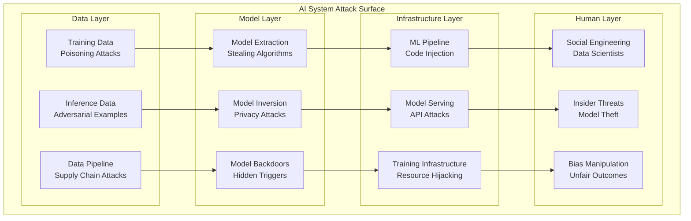

# Module 4: AI/ML Security

## 🎯 **Module Overview**

This specialized module focuses on securing artificial intelligence and machine learning systems throughout their lifecycle. You'll learn to protect AI models from advanced threats, implement privacy-preserving machine learning techniques, and build secure MLOps pipelines that maintain data privacy while ensuring model integrity.

**Duration:** 2 Weeks (80 hours)  
**Difficulty:** Intermediate-Advanced  
**Prerequisites:** Modules 1-3, basic understanding of ML concepts

## 📚 **Learning Objectives**

By the end of this module, you will be able to:
- **Identify** and mitigate AI/ML-specific security threats and vulnerabilities
- **Implement** privacy-preserving machine learning techniques (differential privacy, federated learning)
- **Build** secure MLOps pipelines with end-to-end security controls
- **Deploy** adversarial defense mechanisms for model protection
- **Design** AI governance frameworks for responsible AI development
- **Monitor** and audit AI systems for security and compliance

## 🗂️ **Module Structure**

```
04-ai-ml-security/
├── 📖 README.md                          # Module overview and guide
├── 📚 lessons/                           # Comprehensive lessons
│   ├── 4.1-ai-threat-landscape.md        # AI-specific threats and attacks
│   ├── 4.2-model-security.md             # Model protection and hardening
│   ├── 4.3-privacy-preserving-ml.md      # Privacy techniques in ML
│   ├── 4.4-secure-mlops.md               # Secure ML pipeline design
│   ├── 4.5-adversarial-defense.md        # Defending against adversarial attacks
│   ├── 4.6-ai-governance.md              # AI governance and compliance
│   └── 4.7-ai-monitoring.md              # Monitoring and auditing AI systems
├── 🧪 labs/                              # Hands-on implementations
│   ├── lab01-threat-assessment.md        # AI threat modeling exercise
│   ├── lab02-differential-privacy.md     # Differential privacy implementation
│   ├── lab03-federated-learning.md       # Federated learning setup
│   ├── lab04-secure-mlops.md             # Secure MLOps pipeline
│   ├── lab05-adversarial-defense.md      # Adversarial attack defense
│   └── lab06-ai-governance.md            # AI governance framework
├── 🔬 research/                          # Cutting-edge research
│   ├── emerging-threats.md               # Latest AI security threats
│   ├── privacy-techniques.md             # Advanced privacy methods
│   ├── defense-mechanisms.md             # Novel defense approaches
│   └── industry-case-studies.md          # Real-world implementations
├── 🛠️ tools/                             # AI security tools
│   ├── privacy-libraries.md              # Privacy-preserving ML libraries
│   ├── security-testing.md               # AI security testing tools
│   ├── monitoring-platforms.md           # AI monitoring solutions
│   └── governance-tools.md               # AI governance platforms
├── 📊 assessments/                       # Module assessments
│   ├── threat-analysis.md                # AI threat analysis project
│   ├── privacy-implementation.md         # Privacy-preserving ML project
│   └── secure-pipeline.md                # Secure MLOps implementation
└── 🎯 capstone/                          # Capstone project
    └── ai-security-platform.md           # Complete AI security platform
```

## 📖 **Lesson 4.1: AI Threat Landscape**

### **AI-Specific Security Threats**

#### **Attack Surface in AI Systems**


### **Adversarial Machine Learning Attacks**

#### **1. Adversarial Examples**
Carefully crafted inputs designed to fool machine learning models while appearing normal to humans.

**Types of Adversarial Examples:**
```python
import numpy as np
import tensorflow as tf
from art.attacks.evasion import FastGradientMethod, ProjectedGradientDescent
from art.estimators.classification import TensorFlowV2Classifier

class AdversarialExampleGenerator:
    def __init__(self, model, input_shape):
        self.model = model
        self.input_shape = input_shape
        
        # Wrap model for ART library
        self.classifier = TensorFlowV2Classifier(
            model=model,
            nb_classes=10,  # Adjust based on your model
            input_shape=input_shape,
            loss_object=tf.keras.losses.SparseCategoricalCrossentropy()
        )
    
    def generate_fgsm_attack(self, x_test, y_test, epsilon=0.1):
        """Fast Gradient Sign Method attack"""
        attack = FastGradientMethod(
            estimator=self.classifier,
            eps=epsilon,
            targeted=False
        )
        
        x_adversarial = attack.generate(x=x_test)
        
        return {
            'adversarial_examples': x_adversarial,
            'original_predictions': self.model.predict(x_test),
            'adversarial_predictions': self.model.predict(x_adversarial),
            'success_rate': self.calculate_success_rate(x_test, x_adversarial, y_test)
        }
    
    def generate_pgd_attack(self, x_test, y_test, epsilon=0.1, alpha=0.01, num_iter=40):
        """Projected Gradient Descent attack"""
        attack = ProjectedGradientDescent(
            estimator=self.classifier,
            eps=epsilon,
            eps_step=alpha,
            max_iter=num_iter,
            targeted=False
        )
        
        x_adversarial = attack.generate(x=x_test)
        
        return {
            'adversarial_examples': x_adversarial,
            'perturbation_magnitude': np.mean(np.abs(x_adversarial - x_test)),
            'success_rate': self.calculate_success_rate(x_test, x_adversarial, y_test)
        }
    
    def generate_targeted_attack(self, x_test, target_labels, epsilon=0.1):
        """Targeted adversarial attack"""
        attack = FastGradientMethod(
            estimator=self.classifier,
            eps=epsilon,
            targeted=True
        )
        
        x_adversarial = attack.generate(x=x_test, y=target_labels)
        
        adversarial_preds = self.model.predict(x_adversarial)
        target_success = np.argmax(adversarial_preds, axis=1) == target_labels
        
        return {
            'adversarial_examples': x_adversarial,
            'target_success_rate': np.mean(target_success),
            'target_labels': target_labels,
            'adversarial_predictions': adversarial_preds
        }
    
    def calculate_success_rate(self, x_original, x_adversarial, y_true):
        """Calculate attack success rate"""
        original_preds = np.argmax(self.model.predict(x_original), axis=1)
        adversarial_preds = np.argmax(self.model.predict(x_adversarial), axis=1)
        
        # Success means the prediction changed
        successful_attacks = original_preds != adversarial_preds
        
        return np.mean(successful_attacks)
    
    def visualize_adversarial_examples(self, x_original, x_adversarial, y_true, num_examples=5):
        """Visualize adversarial examples vs originals"""
        import matplotlib.pyplot as plt
        
        fig, axes = plt.subplots(2, num_examples, figsize=(15, 6))
        
        original_preds = self.model.predict(x_original)
        adversarial_preds = self.model.predict(x_adversarial)
        
        for i in range(num_examples):
            # Original image
            axes[0, i].imshow(x_original[i].squeeze(), cmap='gray')
            axes[0, i].set_title(f'Original\nPred: {np.argmax(original_preds[i])}\nTrue: {y_true[i]}')
            axes[0, i].axis('off')
            
            # Adversarial image
            axes[1, i].imshow(x_adversarial[i].squeeze(), cmap='gray')
            axes[1, i].set_title(f'Adversarial\nPred: {np.argmax(adversarial_preds[i])}\nTrue: {y_true[i]}')
            axes[1, i].axis('off')
        
        plt.tight_layout()
        plt.savefig('adversarial_examples.png', dpi=300, bbox_inches='tight')
        plt.show()
```

#### **2. Model Poisoning Attacks**
Attacks that corrupt the training data to compromise model behavior.

**Data Poisoning Implementation:**
```python
class DataPoisoningAttack:
    def __init__(self, poison_rate=0.1, attack_type='label_flip'):
        self.poison_rate = poison_rate
        self.attack_type = attack_type
    
    def poison_training_data(self, x_train, y_train, target_class=None):
        """Poison training data with malicious samples"""
        num_samples = len(x_train)
        num_poison = int(num_samples * self.poison_rate)
        
        # Select random indices to poison
        poison_indices = np.random.choice(num_samples, num_poison, replace=False)
        
        x_poisoned = x_train.copy()
        y_poisoned = y_train.copy()
        
        if self.attack_type == 'label_flip':
            # Flip labels randomly
            y_poisoned[poison_indices] = self.flip_labels(y_poisoned[poison_indices])
            
        elif self.attack_type == 'backdoor':
            # Insert backdoor trigger
            x_poisoned[poison_indices] = self.insert_backdoor_trigger(
                x_poisoned[poison_indices]
            )
            if target_class is not None:
                y_poisoned[poison_indices] = target_class
                
        elif self.attack_type == 'clean_label':
            # Clean-label attack (more sophisticated)
            x_poisoned[poison_indices] = self.generate_clean_label_poison(
                x_poisoned[poison_indices],
                y_poisoned[poison_indices],
                target_class
            )
        
        return {
            'x_poisoned': x_poisoned,
            'y_poisoned': y_poisoned,
            'poison_indices': poison_indices,
            'poison_rate': self.poison_rate
        }
    
    def flip_labels(self, labels):
        """Randomly flip labels to wrong classes"""
        num_classes = len(np.unique(labels))
        flipped_labels = labels.copy()
        
        for i, label in enumerate(labels):
            # Choose random different class
            new_label = np.random.choice([c for c in range(num_classes) if c != label])
            flipped_labels[i] = new_label
        
        return flipped_labels
    
    def insert_backdoor_trigger(self, samples, trigger_size=5):
        """Insert backdoor trigger pattern"""
        triggered_samples = samples.copy()
        
        # Add small white square trigger in corner
        for i, sample in enumerate(samples):
            triggered_samples[i, -trigger_size:, -trigger_size:] = 1.0
        
        return triggered_samples
    
    def generate_clean_label_poison(self, samples, labels, target_class):
        """Generate clean-label poisoning samples"""
        # This is a simplified version - real implementation would be more sophisticated
        poisoned_samples = samples.copy()
        
        # Add subtle perturbations that don't change visual appearance
        noise = np.random.normal(0, 0.01, samples.shape)
        poisoned_samples = np.clip(samples + noise, 0, 1)
        
        return poisoned_samples
    
    def evaluate_attack_success(self, model, x_test, y_test, x_trigger=None):
        """Evaluate the success of the poisoning attack"""
        results = {}
        
        # Test normal accuracy
        normal_preds = model.predict(x_test)
        normal_accuracy = np.mean(np.argmax(normal_preds, axis=1) == y_test)
        results['normal_accuracy'] = normal_accuracy
        
        # Test backdoor success rate if applicable
        if x_trigger is not None and self.attack_type == 'backdoor':
            trigger_preds = model.predict(x_trigger)
            # Assuming target class is 0 for simplicity
            backdoor_success = np.mean(np.argmax(trigger_preds, axis=1) == 0)
            results['backdoor_success_rate'] = backdoor_success
        
        return results
```

#### **3. Model Extraction Attacks**
Attempts to steal or reverse-engineer machine learning models.

**Model Extraction Implementation:**
```python
class ModelExtractionAttack:
    def __init__(self, target_model, budget=10000):
        self.target_model = target_model
        self.budget = budget
        self.query_count = 0
    
    def extract_model_functionality(self, input_shape, num_classes):
        """Extract model functionality through black-box queries"""
        # Generate diverse query inputs
        query_inputs = self.generate_query_inputs(input_shape, self.budget)
        
        # Query target model
        extracted_labels = []
        for batch in self.batch_queries(query_inputs, batch_size=100):
            if self.query_count >= self.budget:
                break
                
            predictions = self.query_target_model(batch)
            extracted_labels.extend(predictions)
            
        # Train surrogate model
        surrogate_model = self.train_surrogate_model(
            query_inputs[:len(extracted_labels)],
            extracted_labels,
            input_shape,
            num_classes
        )
        
        return {
            'surrogate_model': surrogate_model,
            'query_count': self.query_count,
            'extraction_accuracy': self.evaluate_extraction_accuracy(surrogate_model)
        }
    
    def generate_query_inputs(self, input_shape, num_queries):
        """Generate diverse inputs for querying the target model"""
        # Strategy 1: Random sampling
        random_inputs = np.random.random((num_queries // 3, *input_shape))
        
        # Strategy 2: Adversarial sampling (if we have some seed data)
        # This would require more sophisticated implementation
        
        # Strategy 3: Active learning approach
        # Select inputs that maximize information gain
        
        return random_inputs
    
    def batch_queries(self, inputs, batch_size=100):
        """Batch queries to avoid detection"""
        for i in range(0, len(inputs), batch_size):
            yield inputs[i:i+batch_size]
    
    def query_target_model(self, inputs):
        """Query the target model with rate limiting"""
        # Add delay to avoid detection
        import time
        time.sleep(0.1)
        
        self.query_count += len(inputs)
        
        # Get predictions from target model
        predictions = self.target_model.predict(inputs)
        
        # Convert to hard labels (typical in black-box setting)
        hard_labels = np.argmax(predictions, axis=1)
        
        return hard_labels
    
    def train_surrogate_model(self, inputs, labels, input_shape, num_classes):
        """Train surrogate model using extracted data"""
        from tensorflow.keras.models import Sequential
        from tensorflow.keras.layers import Dense, Flatten, Conv2D, MaxPooling2D
        
        # Simple CNN architecture for surrogate model
        model = Sequential([
            Conv2D(32, (3, 3), activation='relu', input_shape=input_shape),
            MaxPooling2D(2, 2),
            Conv2D(64, (3, 3), activation='relu'),
            MaxPooling2D(2, 2),
            Flatten(),
            Dense(128, activation='relu'),
            Dense(num_classes, activation='softmax')
        ])
        
        model.compile(
            optimizer='adam',
            loss='sparse_categorical_crossentropy',
            metrics=['accuracy']
        )
        
        # Train surrogate model
        model.fit(
            inputs, labels,
            epochs=10,
            validation_split=0.2,
            verbose=0
        )
        
        return model
    
    def evaluate_extraction_accuracy(self, surrogate_model):
        """Evaluate how well the surrogate model mimics the target"""
        # Generate test inputs
        test_inputs = np.random.random((1000, *self.target_model.input_shape[1:]))
        
        # Get predictions from both models
        target_preds = self.target_model.predict(test_inputs)
        surrogate_preds = surrogate_model.predict(test_inputs)
        
        # Calculate agreement between models
        target_labels = np.argmax(target_preds, axis=1)
        surrogate_labels = np.argmax(surrogate_preds, axis=1)
        
        agreement = np.mean(target_labels == surrogate_labels)
        
        return agreement
```

### **Privacy Attacks on AI Systems**

#### **4. Model Inversion Attacks**
Attacks that attempt to reconstruct sensitive training data from model parameters or outputs.

**Model Inversion Implementation:**
```python
class ModelInversionAttack:
    def __init__(self, target_model, target_class):
        self.target_model = target_model
        self.target_class = target_class
    
    def invert_model_for_class(self, input_shape, num_iterations=1000, learning_rate=0.1):
        """Attempt to reconstruct representative input for target class"""
        import tensorflow as tf
        
        # Initialize random input
        reconstructed_input = tf.Variable(
            tf.random.normal(shape=(1, *input_shape)),
            trainable=True
        )
        
        optimizer = tf.optimizers.Adam(learning_rate=learning_rate)
        
        for iteration in range(num_iterations):
            with tf.GradientTape() as tape:
                # Forward pass
                predictions = self.target_model(reconstructed_input)
                
                # Loss: maximize confidence for target class
                confidence_loss = -tf.nn.log_softmax(predictions)[0, self.target_class]
                
                # Regularization to keep input realistic
                l2_reg = tf.reduce_mean(tf.square(reconstructed_input))
                tv_reg = self.total_variation_regularization(reconstructed_input)
                
                total_loss = confidence_loss + 0.01 * l2_reg + 0.01 * tv_reg
            
            # Backward pass
            gradients = tape.gradient(total_loss, reconstructed_input)
            optimizer.apply_gradients([(gradients, reconstructed_input)])
            
            # Clip to valid range
            reconstructed_input.assign(tf.clip_by_value(reconstructed_input, 0.0, 1.0))
            
            if iteration % 100 == 0:
                current_confidence = tf.nn.softmax(predictions)[0, self.target_class]
                print(f"Iteration {iteration}: Confidence = {current_confidence:.4f}")
        
        return {
            'reconstructed_input': reconstructed_input.numpy(),
            'final_confidence': tf.nn.softmax(predictions)[0, self.target_class].numpy(),
            'iterations': num_iterations
        }
    
    def total_variation_regularization(self, image):
        """Total variation regularization to encourage smooth images"""
        height_tv = tf.reduce_mean(tf.square(image[:, 1:, :, :] - image[:, :-1, :, :]))
        width_tv = tf.reduce_mean(tf.square(image[:, :, 1:, :] - image[:, :, :-1, :]))
        return height_tv + width_tv
    
    def membership_inference_attack(self, model, member_data, non_member_data):
        """Determine if specific data was used in training"""
        # Get model predictions
        member_predictions = model.predict(member_data)
        non_member_predictions = model.predict(non_member_data)
        
        # Calculate confidence scores
        member_confidences = np.max(member_predictions, axis=1)
        non_member_confidences = np.max(non_member_predictions, axis=1)
        
        # Simple threshold-based attack
        threshold = np.median(np.concatenate([member_confidences, non_member_confidences]))
        
        # Predict membership based on confidence
        member_predictions_binary = member_confidences > threshold
        non_member_predictions_binary = non_member_confidences > threshold
        
        # Calculate attack accuracy
        true_positives = np.sum(member_predictions_binary)
        true_negatives = np.sum(~non_member_predictions_binary)
        total_samples = len(member_data) + len(non_member_data)
        
        attack_accuracy = (true_positives + true_negatives) / total_samples
        
        return {
            'attack_accuracy': attack_accuracy,
            'member_confidences': member_confidences,
            'non_member_confidences': non_member_confidences,
            'threshold': threshold
        }
```

## 📖 **Lesson 4.2: Privacy-Preserving Machine Learning**

### **Differential Privacy in ML**

#### **Differential Privacy Fundamentals**
Differential privacy provides mathematical guarantees that the inclusion or exclusion of any single data point doesn't significantly change the output of an algorithm.

**DP Definition:** An algorithm A satisfies (ε, δ)-differential privacy if for all datasets D₁ and D₂ that differ by at most one element, and for all possible outputs S:

P(A(D₁) ∈ S) ≤ exp(ε) × P(A(D₂) ∈ S) + δ

**Differential Privacy Implementation:**
```python
import numpy as np
import tensorflow as tf
from tensorflow_privacy.privacy.optimizers import dp_optimizer_keras
from tensorflow_privacy.privacy.analysis import compute_dp_sgd_privacy

class DifferentialPrivacyTrainer:
    def __init__(self, epsilon=1.0, delta=1e-5, l2_norm_clip=1.0):
        self.epsilon = epsilon
        self.delta = delta
        self.l2_norm_clip = l2_norm_clip
        self.noise_multiplier = None
    
    def calculate_noise_multiplier(self, num_examples, batch_size, epochs):
        """Calculate noise multiplier for target privacy parameters"""
        steps = epochs * num_examples // batch_size
        
        # Use TensorFlow Privacy analysis
        noise_multiplier = self.compute_noise_multiplier(
            num_examples=num_examples,
            batch_size=batch_size,
            target_epsilon=self.epsilon,
            target_delta=self.delta,
            epochs=epochs
        )
        
        self.noise_multiplier = noise_multiplier
        return noise_multiplier
    
    def compute_noise_multiplier(self, num_examples, batch_size, target_epsilon, target_delta, epochs):
        """Compute noise multiplier for given privacy parameters"""
        # Binary search for appropriate noise multiplier
        low, high = 0.1, 10.0
        tolerance = 0.01
        
        while high - low > tolerance:
            mid = (low + high) / 2
            
            # Calculate privacy parameters with this noise multiplier
            steps = epochs * num_examples // batch_size
            epsilon, delta = compute_dp_sgd_privacy.compute_dp_sgd_privacy(
                n=num_examples,
                batch_size=batch_size,
                noise_multiplier=mid,
                epochs=epochs,
                delta=target_delta
            )
            
            if epsilon > target_epsilon:
                low = mid
            else:
                high = mid
        
        return (low + high) / 2
    
    def create_dp_model(self, input_shape, num_classes):
        """Create model with differential privacy"""
        model = tf.keras.Sequential([
            tf.keras.layers.Dense(128, activation='relu', input_shape=input_shape),
            tf.keras.layers.Dense(64, activation='relu'),
            tf.keras.layers.Dense(num_classes, activation='softmax')
        ])
        
        # Use DP optimizer
        optimizer = dp_optimizer_keras.DPKerasAdamOptimizer(
            l2_norm_clip=self.l2_norm_clip,
            noise_multiplier=self.noise_multiplier,
            num_microbatches=1,
            learning_rate=0.001
        )
        
        model.compile(
            optimizer=optimizer,
            loss='sparse_categorical_crossentropy',
            metrics=['accuracy']
        )
        
        return model
    
    def train_with_privacy(self, model, x_train, y_train, x_val, y_val, 
                          batch_size=256, epochs=10):
        """Train model with differential privacy guarantees"""
        # Calculate noise multiplier
        self.calculate_noise_multiplier(
            num_examples=len(x_train),
            batch_size=batch_size,
            epochs=epochs
        )
        
        # Train model
        history = model.fit(
            x_train, y_train,
            batch_size=batch_size,
            epochs=epochs,
            validation_data=(x_val, y_val),
            verbose=1
        )
        
        # Calculate final privacy parameters
        steps = epochs * len(x_train) // batch_size
        final_epsilon, final_delta = compute_dp_sgd_privacy.compute_dp_sgd_privacy(
            n=len(x_train),
            batch_size=batch_size,
            noise_multiplier=self.noise_multiplier,
            epochs=epochs,
            delta=self.delta
        )
        
        return {
            'model': model,
            'history': history,
            'final_epsilon': final_epsilon,
            'final_delta': final_delta,
            'noise_multiplier': self.noise_multiplier
        }
    
    def add_noise_to_gradients(self, gradients):
        """Add calibrated noise to gradients"""
        noisy_gradients = []
        
        for grad in gradients:
            if grad is not None:
                # Clip gradient
                clipped_grad = tf.clip_by_norm(grad, self.l2_norm_clip)
                
                # Add Gaussian noise
                noise = tf.random.normal(
                    shape=grad.shape,
                    mean=0.0,
                    stddev=self.noise_multiplier * self.l2_norm_clip
                )
                
                noisy_grad = clipped_grad + noise
                noisy_gradients.append(noisy_grad)
            else:
                noisy_gradients.append(grad)
        
        return noisy_gradients
```

#### **Federated Learning Implementation**
```python
import flwr as fl
import tensorflow as tf
from typing import Dict, List, Tuple

class FederatedLearningClient(fl.client.NumPyClient):
    def __init__(self, model, x_train, y_train, x_val, y_val):
        self.model = model
        self.x_train = x_train
        self.y_train = y_train
        self.x_val = x_val
        self.y_val = y_val
    
    def get_parameters(self, config):
        """Return current model parameters"""
        return self.model.get_weights()
    
    def fit(self, parameters, config):
        """Train model with provided parameters"""
        # Update model with received parameters
        self.model.set_weights(parameters)
        
        # Train model locally
        history = self.model.fit(
            self.x_train, self.y_train,
            epochs=config.get('epochs', 1),
            batch_size=config.get('batch_size', 32),
            validation_data=(self.x_val, self.y_val),
            verbose=0
        )
        
        # Return updated parameters and training metrics
        return (
            self.model.get_weights(),
            len(self.x_train),
            {
                'accuracy': history.history['accuracy'][-1],
                'loss': history.history['loss'][-1]
            }
        )
    
    def evaluate(self, parameters, config):
        """Evaluate model with provided parameters"""
        self.model.set_weights(parameters)
        
        loss, accuracy = self.model.evaluate(
            self.x_val, self.y_val,
            verbose=0
        )
        
        return loss, len(self.x_val), {'accuracy': accuracy}

class SecureFederatedLearning:
    def __init__(self, num_clients=10, privacy_budget=1.0):
        self.num_clients = num_clients
        self.privacy_budget = privacy_budget
        self.client_data = {}
        self.global_model = None
    
    def create_federated_dataset(self, x_data, y_data, distribution='iid'):
        """Create federated dataset split across clients"""
        if distribution == 'iid':
            # Independent and identically distributed
            indices = np.random.permutation(len(x_data))
            client_size = len(x_data) // self.num_clients
            
            for i in range(self.num_clients):
                start_idx = i * client_size
                end_idx = (i + 1) * client_size if i < self.num_clients - 1 else len(x_data)
                
                client_indices = indices[start_idx:end_idx]
                self.client_data[i] = {
                    'x_train': x_data[client_indices],
                    'y_train': y_data[client_indices]
                }
        
        elif distribution == 'non_iid':
            # Non-IID distribution (each client has subset of classes)
            unique_classes = np.unique(y_data)
            classes_per_client = max(1, len(unique_classes) // 2)
            
            for i in range(self.num_clients):
                # Assign random subset of classes to each client
                client_classes = np.random.choice(
                    unique_classes,
                    size=classes_per_client,
                    replace=False
                )
                
                # Get data for assigned classes
                client_mask = np.isin(y_data, client_classes)
                client_indices = np.where(client_mask)[0]
                
                if len(client_indices) > 0:
                    self.client_data[i] = {
                        'x_train': x_data[client_indices],
                        'y_train': y_data[client_indices]
                    }
    
    def differential_private_aggregation(self, client_weights, privacy_budget_per_round):
        """Aggregate client weights with differential privacy"""
        # Average client weights
        avg_weights = []
        
        for layer_weights in zip(*client_weights):
            # Stack weights from all clients
            stacked_weights = np.stack(layer_weights)
            
            # Calculate average
            layer_avg = np.mean(stacked_weights, axis=0)
            
            # Add noise for differential privacy
            noise_scale = self.calculate_noise_scale(privacy_budget_per_round)
            noise = np.random.normal(0, noise_scale, layer_avg.shape)
            
            noisy_avg = layer_avg + noise
            avg_weights.append(noisy_avg)
        
        return avg_weights
    
    def calculate_noise_scale(self, privacy_budget):
        """Calculate noise scale for differential privacy"""
        # Simplified noise calculation - in practice, this would be more sophisticated
        sensitivity = 1.0  # L2 sensitivity of averaging operation
        return sensitivity / privacy_budget
    
    def secure_aggregation(self, client_weights):
        """Implement secure aggregation protocol"""
        # Simplified secure aggregation - real implementation would use cryptographic protocols
        # such as secret sharing or homomorphic encryption
        
        # Add random masks to each client's weights
        masked_weights = []
        masks = []
        
        for weights in client_weights:
            mask = [np.random.normal(0, 0.1, w.shape) for w in weights]
            masked = [w + m for w, m in zip(weights, mask)]
            
            masked_weights.append(masked)
            masks.append(mask)
        
        # Aggregate masked weights
        aggregated_masked = []
        for layer_idx in range(len(client_weights[0])):
            layer_sum = sum(client[layer_idx] for client in masked_weights)
            aggregated_masked.append(layer_sum / len(client_weights))
        
        # Remove mask effects
        mask_sum = []
        for layer_idx in range(len(masks[0])):
            layer_mask_sum = sum(mask[layer_idx] for mask in masks)
            mask_sum.append(layer_mask_sum / len(masks))
        
        final_weights = [agg - mask for agg, mask in zip(aggregated_masked, mask_sum)]
        
        return final_weights
    
    def train_federated_model(self, model_fn, num_rounds=10, clients_per_round=5):
        """Train model using federated learning"""
        # Initialize global model
        self.global_model = model_fn()
        
        training_history = {
            'round': [],
            'accuracy': [],
            'loss': [],
            'privacy_budget_used': []
        }
        
        privacy_budget_per_round = self.privacy_budget / num_rounds
        
        for round_num in range(num_rounds):
            print(f"Round {round_num + 1}/{num_rounds}")
            
            # Select random subset of clients
            selected_clients = np.random.choice(
                list(self.client_data.keys()),
                size=min(clients_per_round, len(self.client_data)),
                replace=False
            )
            
            # Train on selected clients
            client_weights = []
            client_losses = []
            client_accuracies = []
            
            for client_id in selected_clients:
                # Create client model
                client_model = model_fn()
                client_model.set_weights(self.global_model.get_weights())
                
                # Train locally
                client_data = self.client_data[client_id]
                history = client_model.fit(
                    client_data['x_train'],
                    client_data['y_train'],
                    epochs=1,
                    verbose=0
                )
                
                client_weights.append(client_model.get_weights())
                client_losses.append(history.history['loss'][-1])
                client_accuracies.append(history.history['accuracy'][-1])
            
            # Aggregate weights with differential privacy
            aggregated_weights = self.differential_private_aggregation(
                client_weights,
                privacy_budget_per_round
            )
            
            # Update global model
            self.global_model.set_weights(aggregated_weights)
            
            # Record training metrics
            training_history['round'].append(round_num + 1)
            training_history['accuracy'].append(np.mean(client_accuracies))
            training_history['loss'].append(np.mean(client_losses))
            training_history['privacy_budget_used'].append(
                (round_num + 1) * privacy_budget_per_round
            )
        
        return {
            'global_model': self.global_model,
            'training_history': training_history,
            'total_privacy_budget_used': self.privacy_budget
        }
```

### **Homomorphic Encryption for ML**
```python
import tenseal as ts
import numpy as np

class HomomorphicMLPredictor:
    def __init__(self, context=None):
        if context is None:
            # Create TenSEAL context
            self.context = ts.context(
                ts.SCHEME_TYPE.CKKS,
                poly_modulus_degree=8192,
                coeff_mod_bit_sizes=[60, 40, 40, 60]
            )
            self.context.generate_galois_keys()
            self.context.global_scale = 2**40
        else:
            self.context = context
    
    def encrypt_model_weights(self, weights):
        """Encrypt model weights for homomorphic computation"""
        encrypted_weights = []
        
        for layer_weights in weights:
            if len(layer_weights.shape) == 2:  # Dense layer
                encrypted_layer = ts.ckks_tensor(self.context, layer_weights)
                encrypted_weights.append(encrypted_layer)
            else:
                # Flatten for simplicity - real implementation would handle conv layers
                flattened = layer_weights.flatten()
                encrypted_layer = ts.ckks_vector(self.context, flattened)
                encrypted_weights.append(encrypted_layer)
        
        return encrypted_weights
    
    def encrypt_input_data(self, input_data):
        """Encrypt input data for private inference"""
        if len(input_data.shape) > 1:
            # Flatten input for simplicity
            flattened_input = input_data.flatten()
        else:
            flattened_input = input_data
        
        encrypted_input = ts.ckks_vector(self.context, flattened_input)
        return encrypted_input
    
    def homomorphic_dense_layer(self, encrypted_input, encrypted_weights, encrypted_bias=None):
        """Perform dense layer computation on encrypted data"""
        # Matrix multiplication in encrypted space
        encrypted_output = encrypted_input.mm(encrypted_weights)
        
        # Add bias if provided
        if encrypted_bias is not None:
            encrypted_output = encrypted_output + encrypted_bias
        
        return encrypted_output
    
    def homomorphic_activation(self, encrypted_input, activation='relu'):
        """Apply activation function to encrypted data"""
        if activation == 'relu':
            # ReLU approximation using polynomial
            # ReLU(x) ≈ 0.5x + 0.5|x| ≈ 0.5x + 0.5 * polynomial_approximation(x)
            
            # Simple polynomial approximation for demonstration
            # In practice, you'd use more sophisticated approximations
            poly_approx = encrypted_input * 0.5 + encrypted_input.square() * 0.25
            return poly_approx
        
        elif activation == 'sigmoid':
            # Sigmoid approximation using polynomial
            # sigmoid(x) ≈ 0.5 + 0.25x - (1/48)x³
            x_squared = encrypted_input.square()
            x_cubed = encrypted_input * x_squared
            
            result = (encrypted_input * 0.25) - (x_cubed * (1/48))
            result = result + 0.5
            
            return result
        
        else:
            # Linear activation (no change)
            return encrypted_input
    
    def private_inference(self, encrypted_model, encrypted_input, model_architecture):
        """Perform private inference on encrypted data"""
        current_output = encrypted_input
        
        for i, layer_config in enumerate(model_architecture):
            layer_type = layer_config['type']
            
            if layer_type == 'dense':
                weights_idx = layer_config['weights_index']
                bias_idx = layer_config.get('bias_index', None)
                activation = layer_config.get('activation', 'linear')
                
                # Apply dense layer
                current_output = self.homomorphic_dense_layer(
                    current_output,
                    encrypted_model[weights_idx],
                    encrypted_model[bias_idx] if bias_idx is not None else None
                )
                
                # Apply activation
                if activation != 'linear':
                    current_output = self.homomorphic_activation(current_output, activation)
            
            elif layer_type == 'flatten':
                # Flattening is implicit in our representation
                pass
        
        return current_output
    
    def decrypt_result(self, encrypted_result):
        """Decrypt the final prediction result"""
        decrypted = encrypted_result.decrypt()
        return np.array(decrypted)
    
    def benchmark_encrypted_inference(self, model_weights, test_input, model_architecture, num_tests=10):
        """Benchmark encrypted vs plain inference"""
        import time
        
        # Encrypt model and input
        print("Encrypting model weights...")
        start_time = time.time()
        encrypted_model = self.encrypt_model_weights(model_weights)
        encryption_time = time.time() - start_time
        
        print("Encrypting input data...")
        start_time = time.time()
        encrypted_input = self.encrypt_input_data(test_input)
        input_encryption_time = time.time() - start_time
        
        # Perform encrypted inference
        print("Performing encrypted inference...")
        inference_times = []
        
        for i in range(num_tests):
            start_time = time.time()
            encrypted_result = self.private_inference(
                encrypted_model,
                encrypted_input,
                model_architecture
            )
            inference_time = time.time() - start_time
            inference_times.append(inference_time)
        
        # Decrypt result
        print("Decrypting result...")
        start_time = time.time()
        decrypted_result = self.decrypt_result(encrypted_result)
        decryption_time = time.time() - start_time
        
        return {
            'model_encryption_time': encryption_time,
            'input_encryption_time': input_encryption_time,
            'average_inference_time': np.mean(inference_times),
            'decryption_time': decryption_time,
            'total_time': encryption_time + input_encryption_time + np.mean(inference_times) + decryption_time,
            'encrypted_result_shape': len(decrypted_result),
            'sample_output': decrypted_result[:5] if len(decrypted_result) > 5 else decrypted_result
        }

# Example usage
def demo_homomorphic_ml():
    # Create simple model weights (2 layer MLP)
    input_size = 10
    hidden_size = 5
    output_size = 3
    
    weights_1 = np.random.randn(input_size, hidden_size) * 0.1
    bias_1 = np.random.randn(hidden_size) * 0.1
    weights_2 = np.random.randn(hidden_size, output_size) * 0.1
    bias_2 = np.random.randn(output_size) * 0.1
    
    model_weights = [weights_1, bias_1, weights_2, bias_2]
    
    # Model architecture definition
    model_architecture = [
        {
            'type': 'dense',
            'weights_index': 0,
            'bias_index': 1,
            'activation': 'relu'
        },
        {
            'type': 'dense',
            'weights_index': 2,
            'bias_index': 3,
            'activation': 'linear'
        }
    ]
    
    # Test input
    test_input = np.random.randn(input_size)
    
    # Create homomorphic predictor
    he_predictor = HomomorphicMLPredictor()
    
    # Run benchmark
    results = he_predictor.benchmark_encrypted_inference(
        model_weights,
        test_input,
        model_architecture,
        num_tests=5
    )
    
    print("Homomorphic Encryption ML Benchmark Results:")
    print(f"Model encryption time: {results['model_encryption_time']:.3f}s")
    print(f"Input encryption time: {results['input_encryption_time']:.3f}s")
    print(f"Average inference time: {results['average_inference_time']:.3f}s")
    print(f"Decryption time: {results['decryption_time']:.3f}s")
    print(f"Total time: {results['total_time']:.3f}s")
    print(f"Sample encrypted inference output: {results['sample_output']}")

if __name__ == "__main__":
    demo_homomorphic_ml()
```

## 🧪 **Lab 4.1: Adversarial Defense Implementation**

### **Lab Overview**
**Duration:** 8 hours  
**Difficulty:** Advanced  
**Tools Required:** Python, TensorFlow, Adversarial Robustness Toolbox (ART)  
**Dataset:** CIFAR-10 or custom image classification dataset

### **Lab Objectives**
- Implement multiple adversarial attack methods
- Build robust defense mechanisms against adversarial examples
- Evaluate the effectiveness of different defense strategies
- Create an adversarial robustness testing framework

### **Step 1: Environment Setup and Attack Implementation (2 hours)**

**1.1 Install Required Libraries:**
```bash
pip install adversarial-robustness-toolbox
pip install tensorflow==2.10.0
pip install matplotlib seaborn
pip install cleverhans
```

**1.2 Create Base Model and Attack Framework:**
```python
import numpy as np
import tensorflow as tf
from tensorflow import keras
import matplotlib.pyplot as plt
from art.attacks.evasion import FastGradientMethod, ProjectedGradientDescent, CarliniL2Method
from art.attacks.evasion import DeepFool, AutoAttack
from art.estimators.classification import TensorFlowV2Classifier
from art.defences.trainer import AdversarialTrainer
from art.defences.preprocessor import GaussianAugmentation
import warnings
warnings.filterwarnings('ignore')

class AdversarialTestingFramework:
    def __init__(self, input_shape=(32, 32, 3), num_classes=10):
        self.input_shape = input_shape
        self.num_classes = num_classes
        self.model = None
        self.classifier = None
        self.attacks = {}
        self.defenses = {}
        
    def create_base_model(self):
        """Create a CNN model for image classification"""
        model = keras.Sequential([
            keras.layers.Conv2D(32, (3, 3), activation='relu', input_shape=self.input_shape),
            keras.layers.MaxPooling2D((2, 2)),
            keras.layers.Conv2D(64, (3, 3), activation='relu'),
            keras.layers.MaxPooling2D((2, 2)),
            keras.layers.Conv2D(64, (3, 3), activation='relu'),
            keras.layers.Flatten(),
            keras.layers.Dense(64, activation='relu'),
            keras.layers.Dropout(0.5),
            keras.layers.Dense(self.num_classes, activation='softmax')
        ])
        
        model.compile(
            optimizer='adam',
            loss='sparse_categorical_crossentropy',
            metrics=['accuracy']
        )
        
        self.model = model
        
        # Wrap for ART
        self.classifier = TensorFlowV2Classifier(
            model=model,
            nb_classes=self.num_classes,
            input_shape=self.input_shape,
            loss_object=tf.keras.losses.SparseCategoricalCrossentropy()
        )
        
        return model
    
    def prepare_dataset(self):
        """Load and preprocess CIFAR-10 dataset"""
        (x_train, y_train), (x_test, y_test) = keras.datasets.cifar10.load_data()
        
        # Normalize pixel values
        x_train = x_train.astype('float32') / 255.0
        x_test = x_test.astype('float32') / 255.0
        
        # Flatten labels
        y_train = y_train.flatten()
        y_test = y_test.flatten()
        
        # Use subset for faster training in lab
        train_subset = 5000
        test_subset = 1000
        
        x_train = x_train[:train_subset]
        y_train = y_train[:train_subset]
        x_test = x_test[:test_subset]
        y_test = y_test[:test_subset]
        
        return (x_train, y_train), (x_test, y_test)
    
    def train_baseline_model(self, x_train, y_train, x_val, y_val, epochs=10):
        """Train baseline model without adversarial training"""
        print("Training baseline model...")
        
        history = self.model.fit(
            x_train, y_train,
            batch_size=32,
            epochs=epochs,
            validation_data=(x_val, y_val),
            verbose=1
        )
        
        return history
    
    def implement_attacks(self):
        """Implement various adversarial attacks"""
        print("Setting up adversarial attacks...")
        
        # Fast Gradient Sign Method
        self.attacks['fgsm'] = FastGradientMethod(
            estimator=self.classifier,
            eps=0.1,
            targeted=False
        )
        
        # Projected Gradient Descent
        self.attacks['pgd'] = ProjectedGradientDescent(
            estimator=self.classifier,
            eps=0.1,
            eps_step=0.01,
            max_iter=40,
            targeted=False
        )
        
        # Carlini & Wagner L2
        self.attacks['cw'] = CarliniL2Method(
            classifier=self.classifier,
            confidence=0.0,
            targeted=False,
            learning_rate=0.01,
            max_iter=100
        )
        
        # DeepFool
        self.attacks['deepfool'] = DeepFool(
            classifier=self.classifier,
            max_iter=100,
            epsilon=1e-6,
            nb_grads=10
        )
        
        print(f"Implemented {len(self.attacks)} attack methods")
    
    def generate_adversarial_examples(self, x_test, y_test, attack_name, num_samples=100):
        """Generate adversarial examples using specified attack"""
        if attack_name not in self.attacks:
            raise ValueError(f"Attack {attack_name} not implemented")
        
        print(f"Generating adversarial examples using {attack_name}...")
        
        # Use subset for faster generation
        x_subset = x_test[:num_samples]
        y_subset = y_test[:num_samples]
        
        # Generate adversarial examples
        attack = self.attacks[attack_name]
        x_adversarial = attack.generate(x=x_subset)
        
        # Calculate success rate
        original_preds = np.argmax(self.classifier.predict(x_subset), axis=1)
        adversarial_preds = np.argmax(self.classifier.predict(x_adversarial), axis=1)
        
        success_rate = np.mean(original_preds != adversarial_preds)
        
        # Calculate perturbation magnitude
        perturbation = np.mean(np.abs(x_adversarial - x_subset))
        
        return {
            'adversarial_examples': x_adversarial,
            'original_examples': x_subset,
            'original_labels': y_subset,
            'success_rate': success_rate,
            'perturbation_magnitude': perturbation,
            'attack_name': attack_name
        }
    
    def evaluate_robustness(self, x_test, y_test, attack_names=None):
        """Evaluate model robustness against multiple attacks"""
        if attack_names is None:
            attack_names = list(self.attacks.keys())
        
        robustness_results = {}
        
        # Baseline accuracy
        baseline_accuracy = self.classifier.predict(x_test)
        baseline_accuracy = np.mean(np.argmax(baseline_accuracy, axis=1) == y_test)
        robustness_results['baseline_accuracy'] = baseline_accuracy
        
        print(f"Baseline accuracy: {baseline_accuracy:.4f}")
        
        # Test against each attack
        for attack_name in attack_names:
            print(f"Testing robustness against {attack_name}...")
            
            attack_results = self.generate_adversarial_examples(
                x_test, y_test, attack_name, num_samples=200
            )
            
            # Calculate robust accuracy
            x_adv = attack_results['adversarial_examples']
            robust_preds = np.argmax(self.classifier.predict(x_adv), axis=1)
            robust_accuracy = np.mean(robust_preds == attack_results['original_labels'])
            
            robustness_results[attack_name] = {
                'success_rate': attack_results['success_rate'],
                'robust_accuracy': robust_accuracy,
                'perturbation_magnitude': attack_results['perturbation_magnitude']
            }
            
            print(f"  Success rate: {attack_results['success_rate']:.4f}")
            print(f"  Robust accuracy: {robust_accuracy:.4f}")
            print(f"  Perturbation magnitude: {attack_results['perturbation_magnitude']:.6f}")
        
        return robustness_results
```

### **Step 2: Implement Defense Mechanisms (3 hours)**

**2.1 Adversarial Training:**
```python
class AdversarialDefenses:
    def __init__(self, framework):
        self.framework = framework
        self.defended_models = {}
    
    def adversarial_training(self, x_train, y_train, x_val, y_val, 
                           attack_method='fgsm', epochs=10, adv_ratio=0.5):
        """Train model with adversarial examples"""
        print(f"Starting adversarial training with {attack_method}...")
        
        # Create new model for adversarial training
        adv_model = self.framework.create_base_model()
        
        # Create adversarial trainer
        attack = self.framework.attacks[attack_method]
        trainer = AdversarialTrainer(adv_model, attacks=attack, ratio=adv_ratio)
        
        # Train with adversarial examples
        trainer.fit(x_train, y_train, nb_epochs=epochs, batch_size=32)
        
        # Store defended model
        self.defended_models[f'adv_trained_{attack_method}'] = {
            'model': adv_model,
            'defense_type': 'adversarial_training',
            'attack_method': attack_method
        }
        
        return adv_model
    
    def gaussian_noise_defense(self, x_train, y_train, x_val, y_val, 
                              sigma=0.1, epochs=10):
        """Train model with Gaussian noise augmentation"""
        print("Training with Gaussian noise defense...")
        
        # Create model with Gaussian augmentation
        noise_model = self.framework.create_base_model()
        
        # Add Gaussian noise to training data
        gaussian_aug = GaussianAugmentation(sigma=sigma, augmentation=True)
        
        # Apply noise to training data
        x_train_noisy, y_train_noisy = gaussian_aug(x_train, y_train)
        
        # Train model
        history = noise_model.fit(
            x_train_noisy, y_train_noisy,
            batch_size=32,
            epochs=epochs,
            validation_data=(x_val, y_val),
            verbose=1
        )
        
        # Store defended model
        self.defended_models['gaussian_noise'] = {
            'model': noise_model,
            'defense_type': 'gaussian_noise',
            'sigma': sigma
        }
        
        return noise_model
    
    def input_transformation_defense(self, transformation_type='jpeg_compression'):
        """Implement input transformation defense"""
        print(f"Implementing {transformation_type} defense...")
        
        def jpeg_compression_defense(x, quality=75):
            """Apply JPEG compression as defense"""
            import io
            from PIL import Image
            
            defended_x = np.zeros_like(x)
            
            for i in range(len(x)):
                # Convert to PIL Image
                img_array = (x[i] * 255).astype(np.uint8)
                img = Image.fromarray(img_array)
                
                # Apply JPEG compression
                buffer = io.BytesIO()
                img.save(buffer, format='JPEG', quality=quality)
                buffer.seek(0)
                
                # Load compressed image
                compressed_img = Image.open(buffer)
                defended_x[i] = np.array(compressed_img) / 255.0
            
            return defended_x
        
        def bit_depth_reduction(x, bits=4):
            """Reduce bit depth as defense"""
            levels = 2 ** bits
            return np.round(x * (levels - 1)) / (levels - 1)
        
        if transformation_type == 'jpeg_compression':
            return jpeg_compression_defense
        elif transformation_type == 'bit_depth_reduction':
            return bit_depth_reduction
        else:
            raise ValueError(f"Unknown transformation: {transformation_type}")
    
    def ensemble_defense(self, x_train, y_train, x_val, y_val, 
                        num_models=3, epochs=10):
        """Create ensemble of models for defense"""
        print(f"Training ensemble defense with {num_models} models...")
        
        ensemble_models = []
        
        for i in range(num_models):
            print(f"Training ensemble model {i+1}/{num_models}")
            
            # Create model with different architecture/initialization
            model = keras.Sequential([
                keras.layers.Conv2D(32 + i*16, (3, 3), activation='relu', 
                                   input_shape=self.framework.input_shape),
                keras.layers.MaxPooling2D((2, 2)),
                keras.layers.Conv2D(64 + i*16, (3, 3), activation='relu'),
                keras.layers.MaxPooling2D((2, 2)),
                keras.layers.Conv2D(64 + i*16, (3, 3), activation='relu'),
                keras.layers.Flatten(),
                keras.layers.Dense(64 + i*32, activation='relu'),
                keras.layers.Dropout(0.5 + i*0.1),
                keras.layers.Dense(self.framework.num_classes, activation='softmax')
            ])
            
            model.compile(
                optimizer='adam',
                loss='sparse_categorical_crossentropy',
                metrics=['accuracy']
            )
            
            # Train model
            model.fit(
                x_train, y_train,
                batch_size=32,
                epochs=epochs,
                validation_data=(x_val, y_val),
                verbose=0
            )
            
            ensemble_models.append(model)
        
        # Store ensemble
        self.defended_models['ensemble'] = {
            'models': ensemble_models,
            'defense_type': 'ensemble',
            'num_models': num_models
        }
        
        return ensemble_models
    
    def ensemble_predict(self, x, models):
        """Make predictions using ensemble of models"""
        predictions = []
        
        for model in models:
            pred = model.predict(x, verbose=0)
            predictions.append(pred)
        
        # Average predictions
        avg_predictions = np.mean(predictions, axis=0)
        return avg_predictions
    
    def certified_defense(self, x_train, y_train, x_val, y_val, 
                         noise_sigma=0.25, epochs=10):
        """Implement randomized smoothing for certified defense"""
        print("Training certified defense model...")
        
        # Train model with noise augmentation for certified defense
        certified_model = self.framework.create_base_model()
        
        # Add Gaussian noise during training
        def add_noise(x, sigma):
            noise = np.random.normal(0, sigma, x.shape)
            return np.clip(x + noise, 0, 1)
        
        # Training with noise
        for epoch in range(epochs):
            print(f"Epoch {epoch+1}/{epochs}")
            
            # Add noise to training data
            x_train_noisy = add_noise(x_train, noise_sigma)
            
            # Train for one epoch
            certified_model.fit(
                x_train_noisy, y_train,
                batch_size=32,
                epochs=1,
                validation_data=(x_val, y_val),
                verbose=0
            )
        
        # Store certified model
        self.defended_models['certified'] = {
            'model': certified_model,
            'defense_type': 'certified',
            'noise_sigma': noise_sigma
        }
        
        return certified_model
    
    def smoothed_prediction(self, x, model, sigma=0.25, num_samples=100):
        """Make certified prediction using randomized smoothing"""
        batch_size = len(x)
        
        # Generate multiple noisy versions
        all_predictions = []
        
        for _ in range(num_samples):
            # Add Gaussian noise
            noise = np.random.normal(0, sigma, x.shape)
            x_noisy = np.clip(x + noise, 0, 1)
            
            # Get prediction
            pred = model.predict(x_noisy, verbose=0)
            all_predictions.append(pred)
        
        # Stack predictions
        all_predictions = np.stack(all_predictions)  # (num_samples, batch_size, num_classes)
        
        # For each sample, find the most frequent class
        predicted_classes = np.argmax(all_predictions, axis=2)  # (num_samples, batch_size)
        
        # Count votes for each class
        final_predictions = []
        for i in range(batch_size):
            votes = np.bincount(predicted_classes[:, i], minlength=self.framework.num_classes)
            final_predictions.append(votes / num_samples)
        
        return np.array(final_predictions)
```

### **Step 3: Comprehensive Evaluation Framework (2 hours)**

**3.1 Defense Evaluation:**
```python
class DefenseEvaluator:
    def __init__(self, framework, defenses):
        self.framework = framework
        self.defenses = defenses
        
    def evaluate_all_defenses(self, x_test, y_test, attack_names=None):
        """Evaluate all defense mechanisms"""
        if attack_names is None:
            attack_names = list(self.framework.attacks.keys())
        
        evaluation_results = {}
        
        # Evaluate baseline model
        print("Evaluating baseline model...")
        baseline_results = self.framework.evaluate_robustness(x_test, y_test, attack_names)
        evaluation_results['baseline'] = baseline_results
        
        # Evaluate each defense
        for defense_name, defense_info in self.defenses.defended_models.items():
            print(f"\nEvaluating {defense_name} defense...")
            
            defense_results = self.evaluate_defense(
                defense_name, defense_info, x_test, y_test, attack_names
            )
            evaluation_results[defense_name] = defense_results
        
        return evaluation_results
    
    def evaluate_defense(self, defense_name, defense_info, x_test, y_test, attack_names):
        """Evaluate specific defense mechanism"""
        results = {}
        
        if defense_info['defense_type'] == 'ensemble':
            # Handle ensemble defense
            models = defense_info['models']
            
            # Baseline accuracy
            baseline_preds = self.defenses.ensemble_predict(x_test, models)
            baseline_accuracy = np.mean(np.argmax(baseline_preds, axis=1) == y_test)
            results['baseline_accuracy'] = baseline_accuracy
            
            # Test against attacks
            for attack_name in attack_names:
                # Generate adversarial examples
                attack_results = self.framework.generate_adversarial_examples(
                    x_test, y_test, attack_name, num_samples=100
                )
                
                # Test ensemble robustness
                x_adv = attack_results['adversarial_examples']
                adv_preds = self.defenses.ensemble_predict(x_adv, models)
                robust_accuracy = np.mean(
                    np.argmax(adv_preds, axis=1) == attack_results['original_labels']
                )
                
                results[attack_name] = {
                    'robust_accuracy': robust_accuracy,
                    'success_rate': attack_results['success_rate']
                }
        
        elif defense_info['defense_type'] == 'certified':
            # Handle certified defense
            model = defense_info['model']
            sigma = defense_info['noise_sigma']
            
            # Baseline accuracy with smoothing
            baseline_preds = self.defenses.smoothed_prediction(x_test, model, sigma)
            baseline_accuracy = np.mean(np.argmax(baseline_preds, axis=1) == y_test)
            results['baseline_accuracy'] = baseline_accuracy
            
            # Test against attacks with certified prediction
            for attack_name in attack_names:
                attack_results = self.framework.generate_adversarial_examples(
                    x_test, y_test, attack_name, num_samples=100
                )
                
                x_adv = attack_results['adversarial_examples']
                adv_preds = self.defenses.smoothed_prediction(x_adv, model, sigma)
                robust_accuracy = np.mean(
                    np.argmax(adv_preds, axis=1) == attack_results['original_labels']
                )
                
                results[attack_name] = {
                    'robust_accuracy': robust_accuracy,
                    'success_rate': attack_results['success_rate']
                }
        
        else:
            # Handle single model defenses
            model = defense_info['model']
            
            # Create classifier for ART
            classifier = TensorFlowV2Classifier(
                model=model,
                nb_classes=self.framework.num_classes,
                input_shape=self.framework.input_shape,
                loss_object=tf.keras.losses.SparseCategoricalCrossentropy()
            )
            
            # Baseline accuracy
            baseline_preds = classifier.predict(x_test)
            baseline_accuracy = np.mean(np.argmax(baseline_preds, axis=1) == y_test)
            results['baseline_accuracy'] = baseline_accuracy
            
            # Test against attacks
            for attack_name in attack_names:
                # Create attack for this model
                if attack_name == 'fgsm':
                    attack = FastGradientMethod(estimator=classifier, eps=0.1)
                elif attack_name == 'pgd':
                    attack = ProjectedGradientDescent(
                        estimator=classifier, eps=0.1, eps_step=0.01, max_iter=40
                    )
                elif attack_name == 'cw':
                    attack = CarliniL2Method(classifier=classifier, max_iter=50)
                elif attack_name == 'deepfool':
                    attack = DeepFool(classifier=classifier, max_iter=50)
                
                # Generate adversarial examples
                x_subset = x_test[:100]
                y_subset = y_test[:100]
                x_adv = attack.generate(x=x_subset)
                
                # Calculate robust accuracy
                adv_preds = classifier.predict(x_adv)
                robust_accuracy = np.mean(np.argmax(adv_preds, axis=1) == y_subset)
                
                # Calculate success rate
                original_preds = np.argmax(classifier.predict(x_subset), axis=1)
                adversarial_preds = np.argmax(adv_preds, axis=1)
                success_rate = np.mean(original_preds != adversarial_preds)
                
                results[attack_name] = {
                    'robust_accuracy': robust_accuracy,
                    'success_rate': success_rate
                }
        
        return results
    
    def generate_comparison_report(self, evaluation_results):
        """Generate comprehensive comparison report"""
        import pandas as pd
        
        # Create comparison DataFrame
        comparison_data = []
        
        for defense_name, defense_results in evaluation_results.items():
            row = {'Defense': defense_name}
            row['Baseline Accuracy'] = defense_results['baseline_accuracy']
            
            # Add robustness metrics for each attack
            for attack_name in ['fgsm', 'pgd', 'cw', 'deepfool']:
                if attack_name in defense_results:
                    row[f'{attack_name.upper()} Robust Acc'] = defense_results[attack_name]['robust_accuracy']
                    row[f'{attack_name.upper()} Success Rate'] = defense_results[attack_name]['success_rate']
            
            comparison_data.append(row)
        
        df = pd.DataFrame(comparison_data)
        
        # Calculate average robustness
        robust_acc_columns = [col for col in df.columns if 'Robust Acc' in col]
        df['Average Robust Accuracy'] = df[robust_acc_columns].mean(axis=1)
        
        return df
    
    def visualize_results(self, evaluation_results, save_path='defense_comparison.png'):
        """Create visualization of defense effectiveness"""
        import matplotlib.pyplot as plt
        import seaborn as sns
        
        # Prepare data for visualization
        defenses = list(evaluation_results.keys())
        attacks = ['fgsm', 'pgd', 'cw', 'deepfool']
        
        # Create robustness matrix
        robustness_matrix = []
        
        for defense in defenses:
            row = []
            for attack in attacks:
                if attack in evaluation_results[defense]:
                    robust_acc = evaluation_results[defense][attack]['robust_accuracy']
                    row.append(robust_acc)
                else:
                    row.append(0)
            robustness_matrix.append(row)
        
        # Create heatmap
        fig, axes = plt.subplots(1, 2, figsize=(15, 6))
        
        # Robustness heatmap
        sns.heatmap(
            robustness_matrix,
            xticklabels=[attack.upper() for attack in attacks],
            yticklabels=defenses,
            annot=True,
            fmt='.3f',
            cmap='RdYlGn',
            ax=axes[0]
        )
        axes[0].set_title('Robust Accuracy by Defense and Attack')
        axes[0].set_xlabel('Attack Method')
        axes[0].set_ylabel('Defense Method')
        
        # Baseline accuracy comparison
        baseline_accuracies = [
            evaluation_results[defense]['baseline_accuracy'] 
            for defense in defenses
        ]
        
        axes[1].bar(range(len(defenses)), baseline_accuracies)
        axes[1].set_xlabel('Defense Method')
        axes[1].set_ylabel('Baseline Accuracy')
        axes[1].set_title('Baseline Accuracy by Defense')
        axes[1].set_xticks(range(len(defenses)))
        axes[1].set_xticklabels(defenses, rotation=45, ha='right')
        
        plt.tight_layout()
        plt.savefig(save_path, dpi=300, bbox_inches='tight')
        plt.show()
        
        return fig
```

### **Step 4: Complete Lab Execution (1 hour)**

**4.1 Main Lab Execution Script:**
```python
def run_adversarial_defense_lab():
    """Execute complete adversarial defense lab"""
    print("🛡️ Starting Adversarial Defense Lab")
    print("=" * 50)
    
    # Initialize framework
    framework = AdversarialTestingFramework()
    
    # Prepare dataset
    (x_train, y_train), (x_test, y_test) = framework.prepare_dataset()
    
    # Split validation set
    val_split = 0.2
    val_size = int(len(x_train) * val_split)
    x_val = x_train[-val_size:]
    y_val = y_train[-val_size:]
    x_train = x_train[:-val_size]
    y_train = y_train[:-val_size]
    
    print(f"Training set: {len(x_train)} samples")
    print(f"Validation set: {len(x_val)} samples")
    print(f"Test set: {len(x_test)} samples")
    
    # Create and train baseline model
    framework.create_base_model()
    framework.train_baseline_model(x_train, y_train, x_val, y_val, epochs=5)
    
    # Implement attacks
    framework.implement_attacks()
    
    # Initialize defenses
    defenses = AdversarialDefenses(framework)
    
    # Train defended models
    print("\n🛡️ Training Defense Mechanisms")
    print("-" * 30)
    
    # Adversarial training
    defenses.adversarial_training(x_train, y_train, x_val, y_val, epochs=3)
    
    # Gaussian noise defense
    defenses.gaussian_noise_defense(x_train, y_train, x_val, y_val, epochs=3)
    
    # Ensemble defense
    defenses.ensemble_defense(x_train, y_train, x_val, y_val, num_models=2, epochs=3)
    
    # Certified defense
    defenses.certified_defense(x_train, y_train, x_val, y_val, epochs=3)
    
    # Evaluate all defenses
    print("\n📊 Evaluating Defense Effectiveness")
    print("-" * 35)
    
    evaluator = DefenseEvaluator(framework, defenses)
    evaluation_results = evaluator.evaluate_all_defenses(
        x_test, y_test, 
        attack_names=['fgsm', 'pgd']  # Use subset for faster lab execution
    )
    
    # Generate comparison report
    comparison_df = evaluator.generate_comparison_report(evaluation_results)
    print("\nDefense Comparison Report:")
    print(comparison_df.to_string(index=False))
    
    # Visualize results
    evaluator.visualize_results(evaluation_results)
    
    # Save results
    comparison_df.to_csv('defense_comparison_results.csv', index=False)
    
    print("\n✅ Lab completed successfully!")
    print("Results saved to 'defense_comparison_results.csv'")
    print("Visualization saved to 'defense_comparison.png'")
    
    return {
        'framework': framework,
        'defenses': defenses,
        'evaluation_results': evaluation_results,
        'comparison_report': comparison_df
    }

# Run the lab
if __name__ == "__main__":
    lab_results = run_adversarial_defense_lab()
```

### **Lab Assessment and Deliverables**

**Deliverables:**
1. **Attack Implementation**: Working adversarial attack methods (FGSM, PGD, C&W, DeepFool)
2. **Defense Mechanisms**: Multiple defense strategies implemented and tested
3. **Evaluation Framework**: Comprehensive robustness evaluation system
4. **Comparison Report**: Detailed analysis of defense effectiveness
5. **Visualization**: Clear visualization of results and trade-offs

**Assessment Criteria:**
- **Technical Implementation** (40%): Correct implementation of attacks and defenses
- **Evaluation Methodology** (30%): Comprehensive and fair evaluation framework
- **Analysis Quality** (20%): Insightful analysis of results and trade-offs
- **Documentation** (10%): Clear documentation and code organization

**Extension Activities:**
1. Implement adaptive attacks that are aware of defense mechanisms
2. Explore certified defenses with formal robustness guarantees
3. Test defenses against AutoAttack (state-of-the-art evaluation)
4. Implement privacy-preserving adversarial training
5. Create custom defense mechanisms based on domain knowledge

This lab provides comprehensive hands-on experience with adversarial machine learning, giving students practical skills in both attacking and defending AI systems.

---

**Next Lab:** [Lab 4.2: Privacy-Preserving ML Pipeline](./lab02-privacy-preserving-ml.md)
