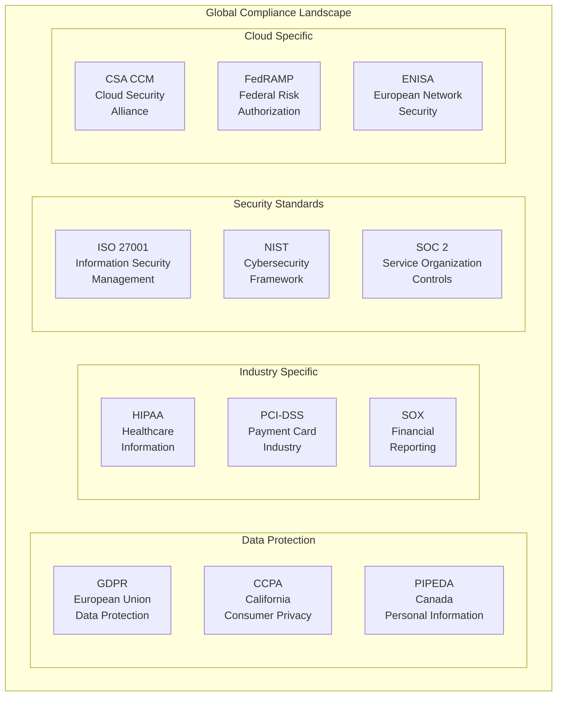
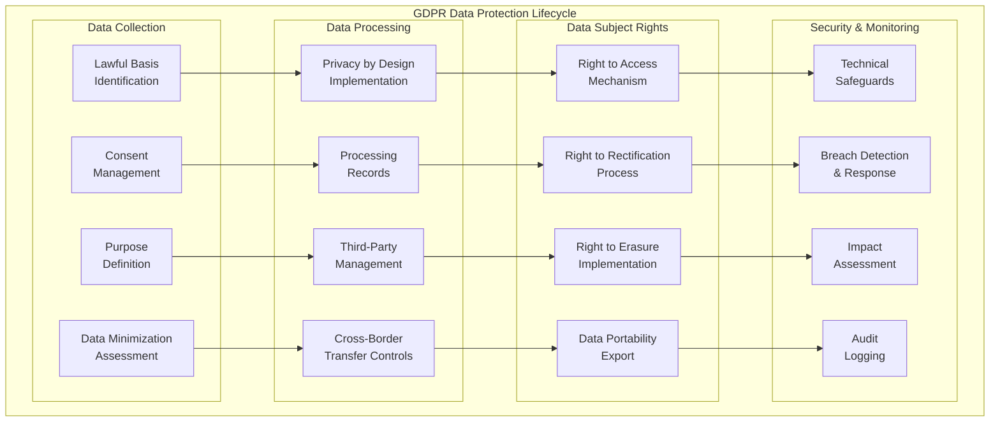
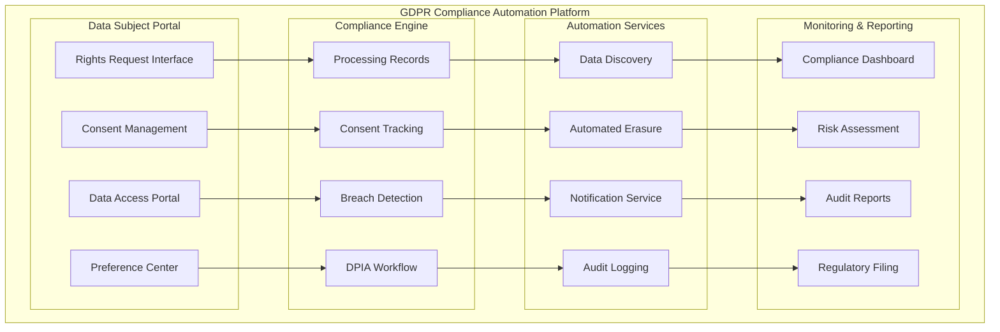

# Module 5: Compliance & Governance

## 🎯 **Module Overview**

This critical module focuses on implementing comprehensive compliance and governance frameworks for cloud security environments. You'll master regulatory requirements, build automated compliance monitoring systems, and create governance structures that ensure continuous adherence to security standards and regulations.

**Duration:** 1 Week (40 hours)  
**Difficulty:** Intermediate  
**Prerequisites:** Modules 1-4, understanding of regulatory frameworks

## 📚 **Learning Objectives**

By the end of this module, you will be able to:
- **Implement** major regulatory compliance frameworks (GDPR, HIPAA, SOX, PCI-DSS)
- **Design** automated compliance monitoring and reporting systems
- **Build** governance frameworks for risk management and policy enforcement
- **Create** audit trails and evidence collection mechanisms
- **Deploy** policy-as-code for automated governance
- **Manage** compliance across multi-cloud environments

## 🗂️ **Module Structure**

```
05-compliance/
├── 📖 README.md                          # Module overview and guide
├── 📚 lessons/                           # Comprehensive lessons
│   ├── 5.1-regulatory-landscape.md       # Regulatory frameworks overview
│   ├── 5.2-gdpr-implementation.md        # GDPR compliance implementation
│   ├── 5.3-hipaa-compliance.md           # HIPAA healthcare compliance
│   ├── 5.4-sox-financial-compliance.md   # SOX financial compliance
│   ├── 5.5-policy-as-code.md             # Policy automation frameworks
│   ├── 5.6-audit-management.md           # Audit trails and evidence
│   └── 5.7-governance-frameworks.md      # IT governance and risk management
├── 🧪 labs/                              # Hands-on implementations
│   ├── lab01-gdpr-automation.md          # GDPR compliance automation
│   ├── lab02-hipaa-controls.md           # HIPAA security controls
│   ├── lab03-policy-as-code.md           # Policy automation implementation
│   ├── lab04-audit-framework.md          # Automated audit framework
│   └── lab05-multi-cloud-governance.md   # Multi-cloud governance
├── 🏛️ frameworks/                        # Compliance frameworks
│   ├── gdpr/                             # GDPR implementation guides
│   ├── hipaa/                            # HIPAA compliance materials
│   ├── sox/                              # SOX compliance framework
│   ├── pci-dss/                          # PCI-DSS implementation
│   └── iso27001/                         # ISO 27001 framework
├── 🔧 tools/                             # Compliance tools
│   ├── assessment-tools.md               # Compliance assessment tools
│   ├── monitoring-platforms.md           # Compliance monitoring platforms
│   ├── reporting-tools.md                # Compliance reporting tools
│   └── automation-frameworks.md          # Compliance automation tools
├── 📊 assessments/                       # Module assessments
│   ├── compliance-audit.md               # Compliance audit project
│   ├── policy-implementation.md          # Policy implementation exercise
│   └── governance-design.md              # Governance framework design
└── 🎯 capstone/                          # Capstone project
    └── comprehensive-compliance.md        # Complete compliance platform
```

## 📖 **Lesson 5.1: Regulatory Landscape Overview**

### **Major Compliance Frameworks**

#### **Global Regulatory Overview**


### **Compliance Framework Comparison Matrix**

| Framework | Scope | Geographic Coverage | Industry Focus | Key Requirements |
|-----------|-------|-------------------|----------------|------------------|
| **GDPR** | Data Protection | EU + Global | All Industries | Consent, Data Rights, Privacy by Design |
| **HIPAA** | Healthcare Data | United States | Healthcare | PHI Protection, Access Controls, Audit Logs |
| **SOX** | Financial Reporting | US Public Companies | Financial Services | IT Controls, Change Management, Audit Trails |
| **PCI-DSS** | Payment Data | Global | Payment Processing | Cardholder Data Protection, Network Security |
| **ISO 27001** | Information Security | Global | All Industries | ISMS, Risk Management, Continuous Improvement |
| **SOC 2** | Service Controls | Global | Service Providers | Trust Principles, Control Activities |

### **Compliance Implementation Strategy**

#### **Risk-Based Compliance Approach**
```python
import pandas as pd
import numpy as np
from datetime import datetime, timedelta
import json

class ComplianceFrameworkManager:
    def __init__(self):
        self.frameworks = {}
        self.assessments = {}
        self.controls = {}
        self.risks = {}
    
    def define_compliance_framework(self, framework_name, requirements):
        """Define a compliance framework with its requirements"""
        self.frameworks[framework_name] = {
            'name': framework_name,
            'requirements': requirements,
            'created_date': datetime.now(),
            'status': 'active'
        }
        
        return self.frameworks[framework_name]
    
    def create_gdpr_framework(self):
        """Create GDPR compliance framework"""
        gdpr_requirements = {
            'article_5': {
                'title': 'Principles relating to processing of personal data',
                'controls': [
                    'data_minimization',
                    'purpose_limitation',
                    'storage_limitation',
                    'accuracy',
                    'integrity_confidentiality'
                ],
                'risk_level': 'high'
            },
            'article_6': {
                'title': 'Lawfulness of processing',
                'controls': [
                    'consent_management',
                    'legitimate_interest_assessment',
                    'contract_processing'
                ],
                'risk_level': 'high'
            },
            'article_25': {
                'title': 'Data protection by design and by default',
                'controls': [
                    'privacy_by_design',
                    'default_privacy_settings',
                    'technical_measures'
                ],
                'risk_level': 'medium'
            },
            'article_32': {
                'title': 'Security of processing',
                'controls': [
                    'encryption',
                    'pseudonymization',
                    'access_controls',
                    'regular_testing'
                ],
                'risk_level': 'high'
            },
            'article_33': {
                'title': 'Notification of personal data breach',
                'controls': [
                    'breach_detection',
                    'breach_notification_72h',
                    'breach_documentation'
                ],
                'risk_level': 'critical'
            },
            'article_35': {
                'title': 'Data protection impact assessment',
                'controls': [
                    'dpia_process',
                    'risk_assessment',
                    'stakeholder_consultation'
                ],
                'risk_level': 'medium'
            }
        }
        
        return self.define_compliance_framework('GDPR', gdpr_requirements)
    
    def create_hipaa_framework(self):
        """Create HIPAA compliance framework"""
        hipaa_requirements = {
            'administrative_safeguards': {
                'title': 'Administrative Safeguards',
                'controls': [
                    'security_officer',
                    'workforce_training',
                    'access_management',
                    'contingency_plan',
                    'business_associate_agreements'
                ],
                'risk_level': 'high'
            },
            'physical_safeguards': {
                'title': 'Physical Safeguards',
                'controls': [
                    'facility_access',
                    'workstation_security',
                    'device_media_controls'
                ],
                'risk_level': 'medium'
            },
            'technical_safeguards': {
                'title': 'Technical Safeguards',
                'controls': [
                    'access_control',
                    'audit_controls',
                    'integrity',
                    'person_authentication',
                    'transmission_security'
                ],
                'risk_level': 'high'
            }
        }
        
        return self.define_compliance_framework('HIPAA', hipaa_requirements)
    
    def create_sox_framework(self):
        """Create SOX compliance framework"""
        sox_requirements = {
            'section_302': {
                'title': 'Corporate Responsibility for Financial Reports',
                'controls': [
                    'ceo_cfo_certification',
                    'internal_controls_assessment',
                    'disclosure_controls'
                ],
                'risk_level': 'critical'
            },
            'section_404': {
                'title': 'Management Assessment of Internal Controls',
                'controls': [
                    'internal_control_framework',
                    'annual_assessment',
                    'auditor_attestation'
                ],
                'risk_level': 'high'
            },
            'itgc_controls': {
                'title': 'IT General Controls',
                'controls': [
                    'access_controls',
                    'change_management',
                    'computer_operations',
                    'data_backup_recovery'
                ],
                'risk_level': 'high'
            }
        }
        
        return self.define_compliance_framework('SOX', sox_requirements)
    
    def assess_compliance_gap(self, framework_name, current_controls):
        """Assess compliance gaps for a specific framework"""
        if framework_name not in self.frameworks:
            raise ValueError(f"Framework {framework_name} not defined")
        
        framework = self.frameworks[framework_name]
        gaps = {}
        
        for requirement_id, requirement in framework['requirements'].items():
            required_controls = set(requirement['controls'])
            implemented_controls = set(current_controls.get(requirement_id, []))
            
            missing_controls = required_controls - implemented_controls
            
            if missing_controls:
                gaps[requirement_id] = {
                    'title': requirement['title'],
                    'missing_controls': list(missing_controls),
                    'risk_level': requirement['risk_level'],
                    'compliance_percentage': (len(implemented_controls) / len(required_controls)) * 100
                }
        
        return gaps
    
    def calculate_compliance_score(self, framework_name, current_controls):
        """Calculate overall compliance score"""
        if framework_name not in self.frameworks:
            return 0
        
        framework = self.frameworks[framework_name]
        total_controls = 0
        implemented_controls = 0
        
        for requirement_id, requirement in framework['requirements'].items():
            required_controls_count = len(requirement['controls'])
            current_controls_count = len(current_controls.get(requirement_id, []))
            
            total_controls += required_controls_count
            implemented_controls += min(current_controls_count, required_controls_count)
        
        compliance_score = (implemented_controls / total_controls) * 100 if total_controls > 0 else 0
        
        return {
            'framework': framework_name,
            'score': compliance_score,
            'total_controls': total_controls,
            'implemented_controls': implemented_controls,
            'compliance_level': self.categorize_compliance_level(compliance_score)
        }
    
    def categorize_compliance_level(self, score):
        """Categorize compliance level based on score"""
        if score >= 95:
            return 'Excellent'
        elif score >= 85:
            return 'Good'
        elif score >= 70:
            return 'Adequate'
        elif score >= 50:
            return 'Needs Improvement'
        else:
            return 'Non-Compliant'
    
    def generate_compliance_roadmap(self, framework_name, current_controls, target_date):
        """Generate compliance implementation roadmap"""
        gaps = self.assess_compliance_gap(framework_name, current_controls)
        
        # Prioritize by risk level
        risk_priority = {'critical': 1, 'high': 2, 'medium': 3, 'low': 4}
        
        roadmap_items = []
        for requirement_id, gap_info in gaps.items():
            for control in gap_info['missing_controls']:
                roadmap_items.append({
                    'requirement_id': requirement_id,
                    'requirement_title': gap_info['title'],
                    'control': control,
                    'risk_level': gap_info['risk_level'],
                    'priority': risk_priority[gap_info['risk_level']],
                    'estimated_effort': self.estimate_implementation_effort(control),
                    'dependencies': self.identify_dependencies(control)
                })
        
        # Sort by priority and effort
        roadmap_items.sort(key=lambda x: (x['priority'], x['estimated_effort']))
        
        # Assign timeline
        current_date = datetime.now()
        for i, item in enumerate(roadmap_items):
            weeks_offset = i * 2  # 2 weeks per control (adjust based on effort)
            item['target_date'] = current_date + timedelta(weeks=weeks_offset)
            item['milestone'] = f"Milestone {i+1}"
        
        return {
            'framework': framework_name,
            'roadmap_items': roadmap_items,
            'total_duration_weeks': len(roadmap_items) * 2,
            'completion_date': roadmap_items[-1]['target_date'] if roadmap_items else current_date
        }
    
    def estimate_implementation_effort(self, control):
        """Estimate implementation effort for a control"""
        effort_mapping = {
            'encryption': 4,  # weeks
            'access_controls': 3,
            'audit_controls': 2,
            'training': 1,
            'policies': 2,
            'monitoring': 3,
            'backup': 2,
            'incident_response': 4,
            'risk_assessment': 3
        }
        
        # Default to medium effort if not specified
        return effort_mapping.get(control, 3)
    
    def identify_dependencies(self, control):
        """Identify dependencies for control implementation"""
        dependency_mapping = {
            'access_controls': ['identity_management', 'user_directory'],
            'audit_controls': ['logging_infrastructure', 'monitoring_tools'],
            'encryption': ['key_management', 'certificate_management'],
            'backup': ['storage_infrastructure', 'recovery_procedures'],
            'monitoring': ['logging_infrastructure', 'analytics_platform']
        }
        
        return dependency_mapping.get(control, [])
```

## 📖 **Lesson 5.2: GDPR Implementation**

### **GDPR Compliance Architecture**

#### **GDPR Data Protection Lifecycle**


### **GDPR Implementation Framework**

#### **Data Subject Rights Management System**
```python
from enum import Enum
from datetime import datetime, timedelta
import hashlib
import json
import uuid

class LawfulBasis(Enum):
    CONSENT = "consent"
    CONTRACT = "contract"
    LEGAL_OBLIGATION = "legal_obligation"
    VITAL_INTERESTS = "vital_interests"
    PUBLIC_TASK = "public_task"
    LEGITIMATE_INTERESTS = "legitimate_interests"

class DataSubjectRights(Enum):
    ACCESS = "access"
    RECTIFICATION = "rectification"
    ERASURE = "erasure"
    RESTRICTION = "restriction"
    PORTABILITY = "portability"
    OBJECTION = "objection"

class GDPRComplianceManager:
    def __init__(self):
        self.data_processing_records = {}
        self.consent_records = {}
        self.data_subject_requests = {}
        self.breach_incidents = {}
        self.dpia_assessments = {}
    
    def register_data_processing(self, processing_id, processing_details):
        """Register data processing activity under GDPR Article 30"""
        processing_record = {
            'processing_id': processing_id,
            'controller_details': processing_details['controller'],
            'processor_details': processing_details.get('processor'),
            'dpo_contact': processing_details.get('dpo_contact'),
            'purposes': processing_details['purposes'],
            'lawful_basis': processing_details['lawful_basis'],
            'data_categories': processing_details['data_categories'],
            'data_subjects': processing_details['data_subjects'],
            'recipients': processing_details.get('recipients', []),
            'third_country_transfers': processing_details.get('third_country_transfers', []),
            'retention_periods': processing_details['retention_periods'],
            'technical_measures': processing_details['technical_measures'],
            'organizational_measures': processing_details['organizational_measures'],
            'created_date': datetime.now(),
            'last_updated': datetime.now()
        }
        
        # Validate lawful basis
        if not self.validate_lawful_basis(processing_record):
            raise ValueError("Invalid lawful basis for processing")
        
        self.data_processing_records[processing_id] = processing_record
        
        # Check if DPIA is required
        if self.requires_dpia(processing_record):
            self.initiate_dpia(processing_id)
        
        return processing_record
    
    def validate_lawful_basis(self, processing_record):
        """Validate lawful basis for data processing"""
        lawful_basis = processing_record['lawful_basis']
        
        # Check if lawful basis is valid
        if lawful_basis not in [basis.value for basis in LawfulBasis]:
            return False
        
        # Additional validation based on lawful basis
        if lawful_basis == LawfulBasis.CONSENT.value:
            return self.validate_consent_requirements(processing_record)
        elif lawful_basis == LawfulBasis.LEGITIMATE_INTERESTS.value:
            return self.validate_legitimate_interests(processing_record)
        
        return True
    
    def validate_consent_requirements(self, processing_record):
        """Validate consent-based processing requirements"""
        # Consent must be specific, informed, and freely given
        purposes = processing_record['purposes']
        
        # Check if purposes are specific enough
        for purpose in purposes:
            if len(purpose.split()) < 3:  # Simplified check
                return False
        
        return True
    
    def validate_legitimate_interests(self, processing_record):
        """Validate legitimate interests assessment"""
        # Must have conducted balancing test
        return 'balancing_test' in processing_record.get('technical_measures', {})
    
    def manage_consent(self, data_subject_id, processing_purpose, consent_action):
        """Manage data subject consent"""
        consent_id = str(uuid.uuid4())
        
        consent_record = {
            'consent_id': consent_id,
            'data_subject_id': data_subject_id,
            'processing_purpose': processing_purpose,
            'action': consent_action,  # 'given', 'withdrawn', 'updated'
            'timestamp': datetime.now(),
            'consent_mechanism': 'explicit_opt_in',
            'consent_evidence': {
                'ip_address': None,  # Should be captured
                'user_agent': None,  # Should be captured
                'consent_text': None  # Exact text shown to user
            }
        }
        
        # Store consent record
        if data_subject_id not in self.consent_records:
            self.consent_records[data_subject_id] = []
        
        self.consent_records[data_subject_id].append(consent_record)
        
        # Update processing permissions
        self.update_processing_permissions(data_subject_id, processing_purpose, consent_action)
        
        return consent_record
    
    def update_processing_permissions(self, data_subject_id, purpose, action):
        """Update processing permissions based on consent"""
        # This would integrate with your data processing systems
        # to enable/disable processing for specific purposes
        pass
    
    def handle_data_subject_request(self, request_details):
        """Handle data subject rights requests under GDPR"""
        request_id = str(uuid.uuid4())
        
        request_record = {
            'request_id': request_id,
            'data_subject_id': request_details['data_subject_id'],
            'request_type': request_details['request_type'],
            'request_details': request_details.get('details', ''),
            'received_date': datetime.now(),
            'due_date': datetime.now() + timedelta(days=30),  # GDPR requirement
            'status': 'received',
            'verification_status': 'pending',
            'processing_notes': []
        }
        
        # Validate request type
        if request_record['request_type'] not in [right.value for right in DataSubjectRights]:
            raise ValueError(f"Invalid request type: {request_record['request_type']}")
        
        self.data_subject_requests[request_id] = request_record
        
        # Process request based on type
        if request_record['request_type'] == DataSubjectRights.ACCESS.value:
            self.process_access_request(request_id)
        elif request_record['request_type'] == DataSubjectRights.ERASURE.value:
            self.process_erasure_request(request_id)
        elif request_record['request_type'] == DataSubjectRights.PORTABILITY.value:
            self.process_portability_request(request_id)
        elif request_record['request_type'] == DataSubjectRights.RECTIFICATION.value:
            self.process_rectification_request(request_id)
        
        return request_record
    
    def process_access_request(self, request_id):
        """Process data subject access request"""
        request = self.data_subject_requests[request_id]
        data_subject_id = request['data_subject_id']
        
        # Collect all personal data for the data subject
        personal_data = self.collect_personal_data(data_subject_id)
        
        # Prepare data package
        access_package = {
            'data_subject_id': data_subject_id,
            'data_collected': datetime.now(),
            'processing_purposes': self.get_processing_purposes(data_subject_id),
            'lawful_basis': self.get_lawful_basis(data_subject_id),
            'retention_periods': self.get_retention_periods(data_subject_id),
            'third_party_recipients': self.get_third_party_recipients(data_subject_id),
            'personal_data': personal_data,
            'rights_information': self.get_rights_information()
        }
        
        # Update request status
        request['status'] = 'completed'
        request['completion_date'] = datetime.now()
        request['access_package'] = access_package
        
        return access_package
    
    def process_erasure_request(self, request_id):
        """Process right to be forgotten request"""
        request = self.data_subject_requests[request_id]
        data_subject_id = request['data_subject_id']
        
        # Check if erasure is permitted
        if not self.can_erase_data(data_subject_id):
            request['status'] = 'rejected'
            request['rejection_reason'] = 'Legal obligation to retain data'
            return False
        
        # Perform data erasure
        erasure_results = self.perform_data_erasure(data_subject_id)
        
        # Update request status
        request['status'] = 'completed'
        request['completion_date'] = datetime.now()
        request['erasure_results'] = erasure_results
        
        return True
    
    def can_erase_data(self, data_subject_id):
        """Check if data can be erased (Article 17 exceptions)"""
        # Check for legal obligations, public interest, etc.
        # This is a simplified check - real implementation would be more complex
        
        processing_records = self.get_processing_for_subject(data_subject_id)
        
        for record in processing_records:
            lawful_basis = record.get('lawful_basis')
            
            # Cannot erase if legal obligation
            if lawful_basis == LawfulBasis.LEGAL_OBLIGATION.value:
                return False
            
            # Cannot erase if public task
            if lawful_basis == LawfulBasis.PUBLIC_TASK.value:
                return False
        
        return True
    
    def perform_data_erasure(self, data_subject_id):
        """Perform actual data erasure"""
        erasure_results = {
            'data_subject_id': data_subject_id,
            'erasure_date': datetime.now(),
            'systems_processed': [],
            'third_parties_notified': [],
            'verification_hash': None
        }
        
        # This would integrate with all systems containing personal data
        # For demonstration, we'll simulate the process
        
        systems = ['user_database', 'analytics_system', 'backup_systems', 'log_files']
        
        for system in systems:
            try:
                # Simulate data erasure
                erasure_result = self.erase_from_system(system, data_subject_id)
                erasure_results['systems_processed'].append({
                    'system': system,
                    'status': 'success',
                    'records_deleted': erasure_result.get('count', 0),
                    'verification_hash': erasure_result.get('hash')
                })
            except Exception as e:
                erasure_results['systems_processed'].append({
                    'system': system,
                    'status': 'error',
                    'error': str(e)
                })
        
        # Notify third parties
        third_parties = self.get_third_party_recipients(data_subject_id)
        for party in third_parties:
            try:
                self.notify_third_party_erasure(party, data_subject_id)
                erasure_results['third_parties_notified'].append({
                    'party': party,
                    'status': 'notified'
                })
            except Exception as e:
                erasure_results['third_parties_notified'].append({
                    'party': party,
                    'status': 'error',
                    'error': str(e)
                })
        
        # Generate verification hash
        erasure_results['verification_hash'] = self.generate_erasure_verification(erasure_results)
        
        return erasure_results
    
    def erase_from_system(self, system, data_subject_id):
        """Erase data from specific system"""
        # This would implement actual data deletion
        # For demonstration purposes, we'll return a mock result
        return {
            'count': 5,  # Number of records deleted
            'hash': hashlib.sha256(f"{system}_{data_subject_id}_{datetime.now()}".encode()).hexdigest()
        }
    
    def requires_dpia(self, processing_record):
        """Determine if Data Protection Impact Assessment is required"""
        # High-risk processing requires DPIA
        high_risk_indicators = [
            'systematic_monitoring',
            'large_scale_processing',
            'sensitive_data',
            'vulnerable_subjects',
            'innovative_technology',
            'automated_decision_making',
            'profiling'
        ]
        
        technical_measures = processing_record.get('technical_measures', {})
        
        # Check for high-risk indicators
        risk_count = sum(1 for indicator in high_risk_indicators 
                        if indicator in technical_measures)
        
        return risk_count >= 2  # Simplified threshold
    
    def initiate_dpia(self, processing_id):
        """Initiate Data Protection Impact Assessment"""
        dpia_id = str(uuid.uuid4())
        
        dpia_assessment = {
            'dpia_id': dpia_id,
            'processing_id': processing_id,
            'initiated_date': datetime.now(),
            'status': 'in_progress',
            'assessment_sections': {
                'processing_description': None,
                'necessity_assessment': None,
                'risk_identification': None,
                'risk_mitigation': None,
                'stakeholder_consultation': None
            },
            'risk_level': None,
            'mitigation_measures': [],
            'completion_date': None
        }
        
        self.dpia_assessments[dpia_id] = dpia_assessment
        
        return dpia_assessment
    
    def record_data_breach(self, breach_details):
        """Record data breach incident"""
        breach_id = str(uuid.uuid4())
        
        breach_record = {
            'breach_id': breach_id,
            'detected_date': breach_details['detected_date'],
            'reported_date': datetime.now(),
            'breach_type': breach_details['breach_type'],
            'affected_data_categories': breach_details['affected_data_categories'],
            'affected_data_subjects': breach_details.get('affected_data_subjects', 0),
            'circumstances': breach_details['circumstances'],
            'likely_consequences': breach_details['likely_consequences'],
            'containment_measures': breach_details.get('containment_measures', []),
            'risk_level': self.assess_breach_risk(breach_details),
            'notification_required': None,
            'authority_notified': False,
            'subjects_notified': False,
            'notification_dates': {}
        }
        
        # Determine notification requirements
        breach_record['notification_required'] = self.requires_breach_notification(breach_record)
        
        # If high risk, must notify within 72 hours
        if breach_record['notification_required']:
            notification_deadline = breach_record['detected_date'] + timedelta(hours=72)
            breach_record['notification_deadline'] = notification_deadline
        
        self.breach_incidents[breach_id] = breach_record
        
        return breach_record
    
    def assess_breach_risk(self, breach_details):
        """Assess risk level of data breach"""
        risk_factors = {
            'data_volume': breach_details.get('affected_data_subjects', 0),
            'data_sensitivity': len(breach_details.get('affected_data_categories', [])),
            'breach_cause': breach_details.get('breach_type', ''),
            'containment_speed': len(breach_details.get('containment_measures', []))
        }
        
        # Simplified risk calculation
        risk_score = 0
        
        if risk_factors['data_volume'] > 1000:
            risk_score += 3
        elif risk_factors['data_volume'] > 100:
            risk_score += 2
        elif risk_factors['data_volume'] > 10:
            risk_score += 1
        
        if risk_factors['data_sensitivity'] > 3:
            risk_score += 2
        elif risk_factors['data_sensitivity'] > 1:
            risk_score += 1
        
        if 'malicious' in risk_factors['breach_cause'].lower():
            risk_score += 2
        
        if risk_factors['containment_speed'] < 2:
            risk_score += 1
        
        if risk_score >= 6:
            return 'high'
        elif risk_score >= 4:
            return 'medium'
        else:
            return 'low'
    
    def requires_breach_notification(self, breach_record):
        """Determine if breach requires notification to authorities"""
        # Must notify if likely to result in risk to rights and freedoms
        return breach_record['risk_level'] in ['medium', 'high']
    
    def generate_compliance_report(self, framework='GDPR'):
        """Generate comprehensive compliance report"""
        report = {
            'framework': framework,
            'report_date': datetime.now(),
            'reporting_period': {
                'start': datetime.now() - timedelta(days=365),
                'end': datetime.now()
            },
            'compliance_metrics': {},
            'data_processing_activities': len(self.data_processing_records),
            'data_subject_requests': self.summarize_dsr_statistics(),
            'breach_incidents': self.summarize_breach_statistics(),
            'dpia_assessments': len(self.dpia_assessments),
            'recommendations': []
        }
        
        # Calculate compliance metrics
        report['compliance_metrics'] = self.calculate_gdpr_compliance_metrics()
        
        # Generate recommendations
        report['recommendations'] = self.generate_compliance_recommendations()
        
        return report
    
    def summarize_dsr_statistics(self):
        """Summarize data subject request statistics"""
        stats = {
            'total_requests': len(self.data_subject_requests),
            'by_type': {},
            'by_status': {},
            'average_resolution_time': 0,
            'overdue_requests': 0
        }
        
        resolution_times = []
        
        for request in self.data_subject_requests.values():
            # Count by type
            req_type = request['request_type']
            stats['by_type'][req_type] = stats['by_type'].get(req_type, 0) + 1
            
            # Count by status
            status = request['status']
            stats['by_status'][status] = stats['by_status'].get(status, 0) + 1
            
            # Calculate resolution time for completed requests
            if request['status'] == 'completed' and 'completion_date' in request:
                resolution_time = (request['completion_date'] - request['received_date']).days
                resolution_times.append(resolution_time)
            
            # Check for overdue requests
            if request['status'] != 'completed' and datetime.now() > request['due_date']:
                stats['overdue_requests'] += 1
        
        if resolution_times:
            stats['average_resolution_time'] = sum(resolution_times) / len(resolution_times)
        
        return stats
    
    def summarize_breach_statistics(self):
        """Summarize breach incident statistics"""
        stats = {
            'total_breaches': len(self.breach_incidents),
            'by_risk_level': {},
            'total_affected_subjects': 0,
            'notification_compliance': {
                'authority_notifications': 0,
                'subject_notifications': 0,
                'overdue_notifications': 0
            }
        }
        
        for breach in self.breach_incidents.values():
            # Count by risk level
            risk_level = breach['risk_level']
            stats['by_risk_level'][risk_level] = stats['by_risk_level'].get(risk_level, 0) + 1
            
            # Sum affected subjects
            stats['total_affected_subjects'] += breach.get('affected_data_subjects', 0)
            
            # Track notifications
            if breach.get('authority_notified'):
                stats['notification_compliance']['authority_notifications'] += 1
            
            if breach.get('subjects_notified'):
                stats['notification_compliance']['subject_notifications'] += 1
            
            # Check for overdue notifications
            if (breach.get('notification_required') and 
                'notification_deadline' in breach and
                datetime.now() > breach['notification_deadline'] and
                not breach.get('authority_notified')):
                stats['notification_compliance']['overdue_notifications'] += 1
        
        return stats
    
    def calculate_gdpr_compliance_metrics(self):
        """Calculate GDPR compliance metrics"""
        metrics = {
            'processing_records_compliance': 0,
            'consent_management_score': 0,
            'dsr_response_rate': 0,
            'breach_notification_compliance': 0,
            'dpia_completion_rate': 0,
            'overall_compliance_score': 0
        }
        
        # Processing records compliance (Article 30)
        if self.data_processing_records:
            complete_records = sum(1 for record in self.data_processing_records.values()
                                 if self.is_processing_record_complete(record))
            metrics['processing_records_compliance'] = (complete_records / len(self.data_processing_records)) * 100
        
        # DSR response rate
        if self.data_subject_requests:
            completed_requests = sum(1 for request in self.data_subject_requests.values()
                                   if request['status'] == 'completed')
            metrics['dsr_response_rate'] = (completed_requests / len(self.data_subject_requests)) * 100
        
        # Breach notification compliance
        if self.breach_incidents:
            compliant_notifications = sum(1 for breach in self.breach_incidents.values()
                                        if not breach.get('notification_required') or 
                                        breach.get('authority_notified'))
            metrics['breach_notification_compliance'] = (compliant_notifications / len(self.breach_incidents)) * 100
        
        # DPIA completion rate
        if self.dpia_assessments:
            completed_dpias = sum(1 for dpia in self.dpia_assessments.values()
                                if dpia['status'] == 'completed')
            metrics['dpia_completion_rate'] = (completed_dpias / len(self.dpia_assessments)) * 100
        
        # Overall compliance score (weighted average)
        weights = {
            'processing_records_compliance': 0.25,
            'dsr_response_rate': 0.25,
            'breach_notification_compliance': 0.30,
            'dpia_completion_rate': 0.20
        }
        
        overall_score = sum(metrics[key] * weight for key, weight in weights.items())
        metrics['overall_compliance_score'] = overall_score
        
        return metrics
    
    def is_processing_record_complete(self, record):
        """Check if processing record is complete"""
        required_fields = [
            'controller_details', 'purposes', 'lawful_basis', 
            'data_categories', 'data_subjects', 'retention_periods',
            'technical_measures', 'organizational_measures'
        ]
        
        return all(field in record and record[field] for field in required_fields)
    
    def generate_compliance_recommendations(self):
        """Generate compliance improvement recommendations"""
        recommendations = []
        
        # Check for missing processing records
        if len(self.data_processing_records) == 0:
            recommendations.append({
                'priority': 'high',
                'category': 'Article 30 Compliance',
                'recommendation': 'Create records of processing activities',
                'action': 'Document all data processing activities in your organization'
            })
        
        # Check for overdue DSRs
        overdue_requests = sum(1 for request in self.data_subject_requests.values()
                             if request['status'] != 'completed' and 
                             datetime.now() > request['due_date'])
        
        if overdue_requests > 0:
            recommendations.append({
                'priority': 'critical',
                'category': 'Data Subject Rights',
                'recommendation': f'Address {overdue_requests} overdue data subject requests',
                'action': 'Implement automated DSR processing workflows'
            })
        
        # Check for incomplete DPIAs
        incomplete_dpias = sum(1 for dpia in self.dpia_assessments.values()
                             if dpia['status'] != 'completed')
        
        if incomplete_dpias > 0:
            recommendations.append({
                'priority': 'medium',
                'category': 'DPIA Compliance',
                'recommendation': f'Complete {incomplete_dpias} pending DPIA assessments',
                'action': 'Establish DPIA assessment workflows and templates'
            })
        
        return recommendations
```

## 🧪 **Lab 5.1: GDPR Compliance Automation**

### **Lab Overview**
**Duration:** 6 hours  
**Difficulty:** Intermediate  
**Tools Required:** Python, PostgreSQL, Docker  
**Focus:** Automated GDPR compliance implementation

### **Lab Objectives**
- Implement automated GDPR compliance monitoring system
- Build data subject rights management portal
- Create breach detection and notification system
- Develop privacy impact assessment workflow

### **Architecture to Build**


This comprehensive module provides everything needed to master compliance and governance in cloud security environments, from regulatory understanding to hands-on implementation of automated compliance systems.

---

**Next Module:** [06-Security Automation](../06-automation/README.md)
