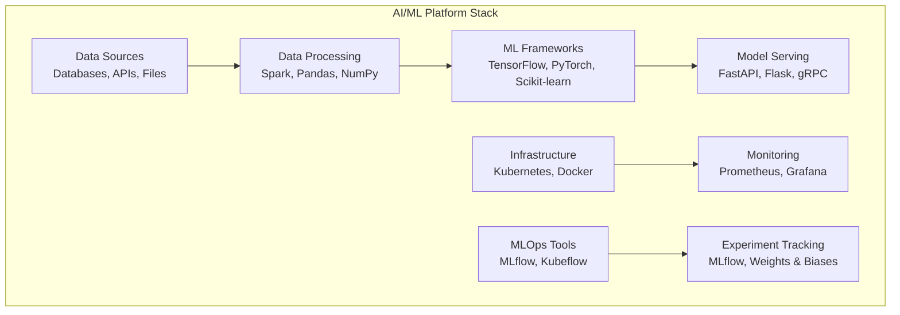
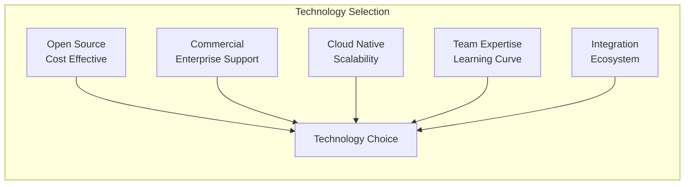
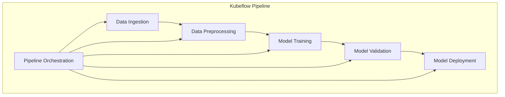
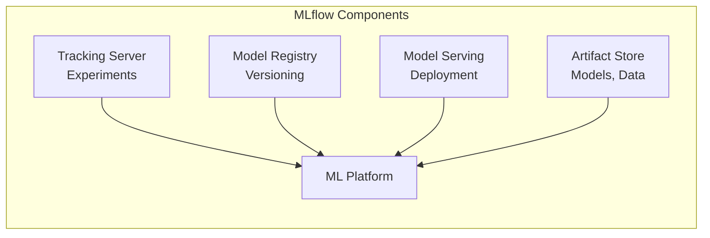
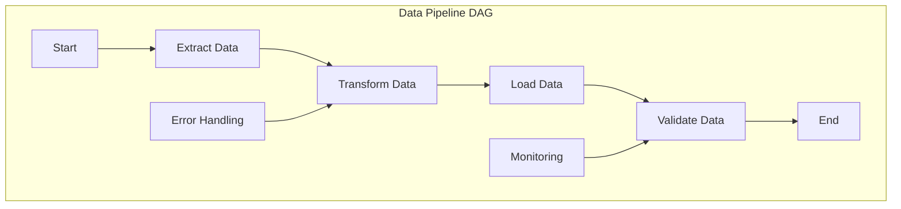
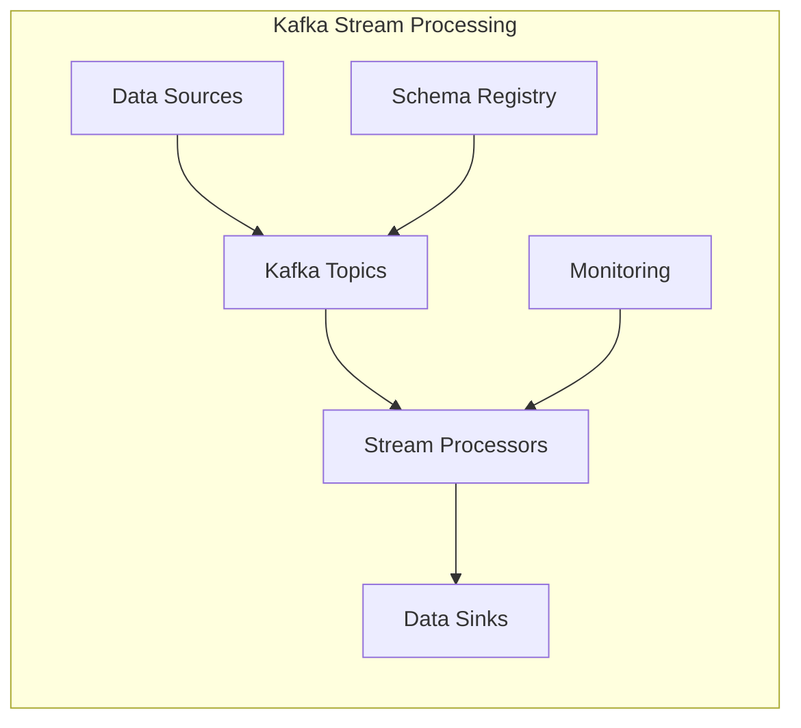
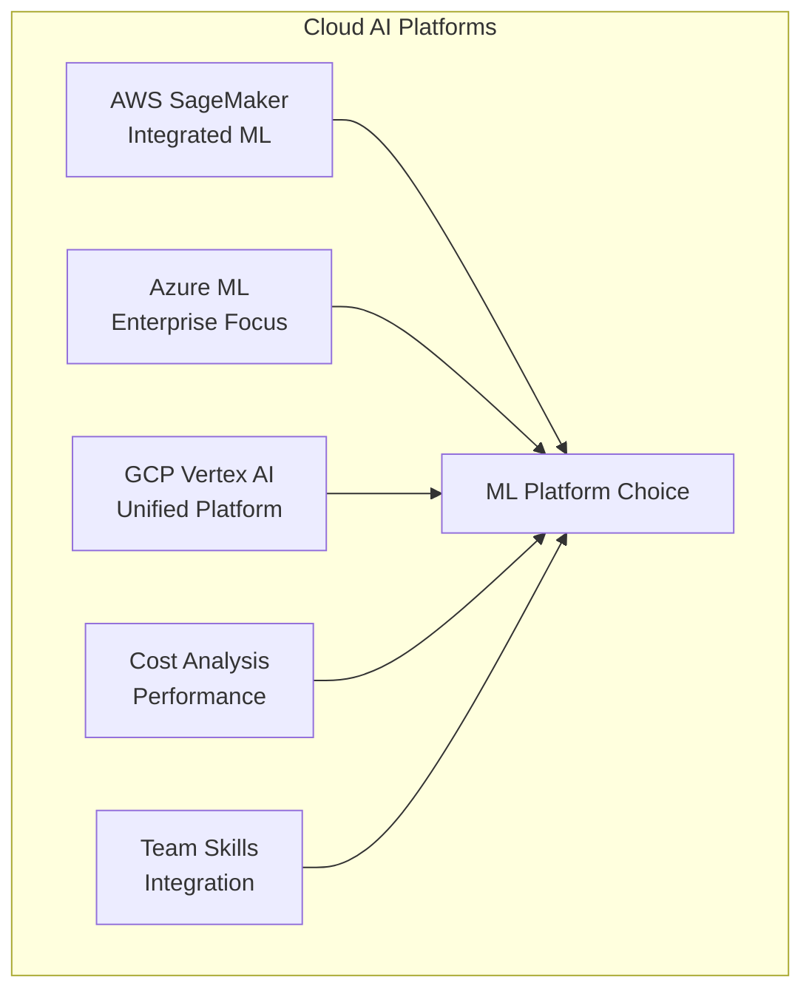
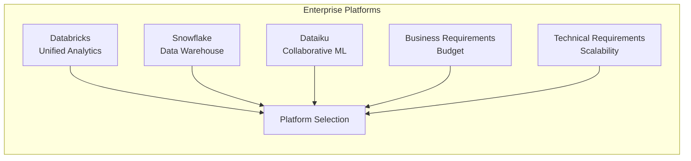
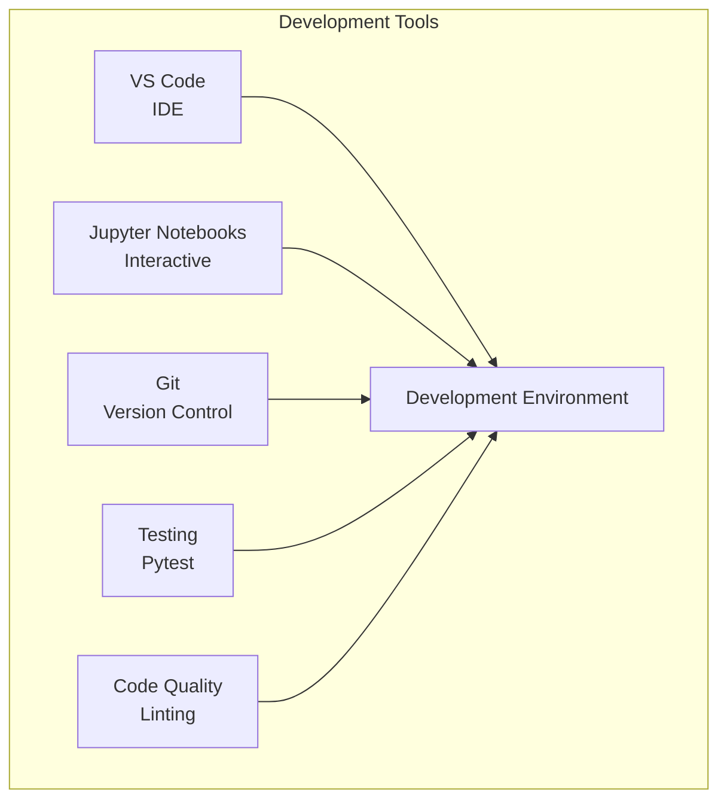
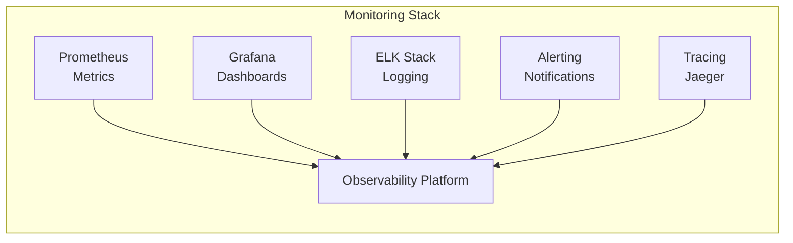

# Tools & Technologies

## Overview
This section provides a comprehensive guide to tools and technologies relevant to AI-Data Platforms, including technology selection matrices and implementation examples.

## 1. **AI/ML Platform Technology Stack**

### 1. **Typical AI/ML Platform Stack**


### 2. **Technology Selection Matrix**


## 2. **Open Source MLOps Solutions**

### 1. **Kubeflow Pipeline Architecture**


### 2. **MLflow Experiment Tracking**


## 3. **Data Engineering Tools**

### 1. **Apache Airflow DAG**


### 2. **Kafka Stream Processing**


## 4. **Cloud AI Platforms Comparison**

### 1. **AWS SageMaker vs Azure ML vs GCP Vertex AI**


### 2. **Enterprise AI Platform Comparison**


## 5. **Development & Monitoring Tools**

### 1. **Development Environment**


### 2. **Monitoring & Observability**


## 6. **Implementation Examples**

### **Kubeflow Pipeline YAML**
```yaml
apiVersion: argoproj.io/v1alpha1
kind: Workflow
metadata:
  name: ml-training-pipeline
spec:
  entrypoint: ml-pipeline
  templates:
  - name: ml-pipeline
    dag:
      tasks:
      - name: data-preprocessing
        template: data-prep
      - name: model-training
        template: train-model
        dependencies: [data-preprocessing]
      - name: model-evaluation
        template: evaluate-model
        dependencies: [model-training]
      - name: model-deployment
        template: deploy-model
        dependencies: [model-evaluation]
  
  - name: data-prep
    container:
      image: data-prep:latest
      command: [python, /app/preprocess.py]
      args: ["--input", "{{inputs.parameters.input-data}}"]
  
  - name: train-model
    container:
      image: ml-training:latest
      command: [python, /app/train.py]
      args: ["--data", "{{inputs.parameters.processed-data}}"]
  
  - name: evaluate-model
    container:
      image: model-eval:latest
      command: [python, /app/evaluate.py]
      args: ["--model", "{{inputs.parameters.trained-model}}"]
  
  - name: deploy-model
    container:
      image: model-deploy:latest
      command: [python, /app/deploy.py]
      args: ["--model", "{{inputs.parameters.evaluated-model}}"]
```

### **MLflow Experiment Tracking**
```python
import mlflow
import mlflow.sklearn
from sklearn.ensemble import RandomForestClassifier
from sklearn.metrics import accuracy_score, precision_score, recall_score
import pandas as pd

class MLExperimentTracker:
    def __init__(self, experiment_name):
        self.experiment_name = experiment_name
        mlflow.set_experiment(experiment_name)
    
    def track_experiment(self, model, X_train, X_test, y_train, y_test, params):
        """Track ML experiment with MLflow"""
        with mlflow.start_run():
            # Log parameters
            mlflow.log_params(params)
            
            # Train model
            model.fit(X_train, y_train)
            
            # Make predictions
            y_pred = model.predict(X_test)
            
            # Calculate metrics
            accuracy = accuracy_score(y_test, y_pred)
            precision = precision_score(y_test, y_pred, average='weighted')
            recall = recall_score(y_test, y_pred, average='weighted')
            
            # Log metrics
            mlflow.log_metric("accuracy", accuracy)
            mlflow.log_metric("precision", precision)
            mlflow.log_metric("recall", recall)
            
            # Log model
            mlflow.sklearn.log_model(model, "model")
            
            return {
                'run_id': mlflow.active_run().info.run_id,
                'accuracy': accuracy,
                'precision': precision,
                'recall': recall
            }
    
    def compare_experiments(self, run_ids):
        """Compare multiple experiments"""
        comparison_data = []
        
        for run_id in run_ids:
            run = mlflow.get_run(run_id)
            comparison_data.append({
                'run_id': run_id,
                'accuracy': run.data.metrics.get('accuracy', 0),
                'precision': run.data.metrics.get('precision', 0),
                'recall': run.data.metrics.get('recall', 0),
                'params': run.data.params
            })
        
        return pd.DataFrame(comparison_data)
    
    def get_best_model(self, metric='accuracy'):
        """Get the best model based on specified metric"""
        experiment = mlflow.get_experiment_by_name(self.experiment_name)
        runs = mlflow.search_runs(experiment.experiment_id)
        
        if runs.empty:
            return None
        
        # Find best run
        best_run = runs.loc[runs[f'metrics.{metric}'].idxmax()]
        
        # Load best model
        model_uri = f"runs:/{best_run['run_id']}/model"
        best_model = mlflow.sklearn.load_model(model_uri)
        
        return {
            'model': best_model,
            'run_id': best_run['run_id'],
            'metrics': {
                'accuracy': best_run['metrics.accuracy'],
                'precision': best_run['metrics.precision'],
                'recall': best_run['metrics.recall']
            }
        }

# Example usage
tracker = MLExperimentTracker("customer_churn_prediction")

# Define hyperparameters
params = {
    'n_estimators': 100,
    'max_depth': 10,
    'random_state': 42
}

# Track experiment
result = tracker.track_experiment(
    model=RandomForestClassifier(),
    X_train=X_train,
    X_test=X_test,
    y_train=y_train,
    y_test=y_test,
    params=params
)

print(f"Experiment completed with accuracy: {result['accuracy']:.4f}")
```

### **Apache Airflow DAG**
```python
from airflow import DAG
from airflow.operators.python_operator import PythonOperator
from airflow.operators.bash_operator import BashOperator
from airflow.providers.amazon.aws.operators.glue import AwsGlueJobOperator
from airflow.providers.amazon.aws.operators.sagemaker import SageMakerTrainingOperator
from datetime import datetime, timedelta
import pandas as pd

default_args = {
    'owner': 'data_team',
    'depends_on_past': False,
    'start_date': datetime(2024, 1, 1),
    'email_on_failure': True,
    'email_on_retry': False,
    'retries': 1,
    'retry_delay': timedelta(minutes=5),
}

dag = DAG(
    'ml_data_pipeline',
    default_args=default_args,
    description='ML data processing and training pipeline',
    schedule_interval=timedelta(days=1),
    catchup=False,
)

def extract_data():
    """Extract data from various sources"""
    # Implementation for data extraction
    print("Extracting data from sources...")
    return "extraction_complete"

def transform_data():
    """Transform and clean data"""
    # Implementation for data transformation
    print("Transforming data...")
    return "transformation_complete"

def validate_data():
    """Validate data quality"""
    # Implementation for data validation
    print("Validating data quality...")
    return "validation_complete"

def train_model():
    """Train ML model"""
    # Implementation for model training
    print("Training ML model...")
    return "training_complete"

def evaluate_model():
    """Evaluate model performance"""
    # Implementation for model evaluation
    print("Evaluating model...")
    return "evaluation_complete"

# Define tasks
extract_task = PythonOperator(
    task_id='extract_data',
    python_callable=extract_data,
    dag=dag,
)

transform_task = PythonOperator(
    task_id='transform_data',
    python_callable=transform_data,
    dag=dag,
)

validate_task = PythonOperator(
    task_id='validate_data',
    python_callable=validate_data,
    dag=dag,
)

# Glue ETL job
glue_job = AwsGlueJobOperator(
    task_id='run_glue_job',
    job_name='ml-data-processing',
    region_name='us-west-2',
    dag=dag,
)

# SageMaker training
sagemaker_training = SageMakerTrainingOperator(
    task_id='train_ml_model',
    config={
        'TrainingJobName': 'ml-training-job',
        'AlgorithmSpecification': {
            'TrainingImage': '123456789012.dkr.ecr.us-west-2.amazonaws.com/ml-training:latest',
            'TrainingInputMode': 'File'
        },
        'RoleArn': 'arn:aws:iam::123456789012:role/SageMakerExecutionRole',
        'InputDataConfig': [
            {
                'ChannelName': 'training',
                'DataSource': {
                    'S3DataSource': {
                        'S3DataType': 'S3Prefix',
                        'S3Uri': 's3://ml-data-bucket/training/',
                        'S3DataDistributionType': 'FullyReplicated'
                    }
                }
            }
        ],
        'OutputDataConfig': {
            'S3OutputPath': 's3://ml-data-bucket/output/'
        },
        'ResourceConfig': {
            'InstanceCount': 1,
            'InstanceType': 'ml.m5.large',
            'VolumeSizeInGB': 30
        },
        'StoppingCondition': {
            'MaxRuntimeInSeconds': 3600
        }
    },
    dag=dag,
)

evaluate_task = PythonOperator(
    task_id='evaluate_model',
    python_callable=evaluate_model,
    dag=dag,
)

# Set task dependencies
extract_task >> transform_task >> validate_task >> glue_job >> sagemaker_training >> evaluate_task
```

### **Kafka Producer/Consumer**
```python
from kafka import KafkaProducer, KafkaConsumer
import json
import time
from typing import Dict, Any

class KafkaDataStreamer:
    def __init__(self, bootstrap_servers: list, topic: str):
        self.bootstrap_servers = bootstrap_servers
        self.topic = topic
        self.producer = None
        self.consumer = None
    
    def create_producer(self):
        """Create Kafka producer"""
        self.producer = KafkaProducer(
            bootstrap_servers=self.bootstrap_servers,
            value_serializer=lambda v: json.dumps(v).encode('utf-8'),
            key_serializer=lambda k: k.encode('utf-8') if k else None,
            acks='all',
            retries=3
        )
        return self.producer
    
    def create_consumer(self, group_id: str):
        """Create Kafka consumer"""
        self.consumer = KafkaConsumer(
            self.topic,
            bootstrap_servers=self.bootstrap_servers,
            group_id=group_id,
            auto_offset_reset='earliest',
            enable_auto_commit=True,
            value_deserializer=lambda x: json.loads(x.decode('utf-8')),
            key_deserializer=lambda x: x.decode('utf-8') if x else None
        )
        return self.consumer
    
    def send_message(self, key: str, value: Dict[str, Any]):
        """Send message to Kafka topic"""
        if not self.producer:
            self.create_producer()
        
        future = self.producer.send(self.topic, key=key, value=value)
        
        try:
            record_metadata = future.get(timeout=10)
            return {
                'topic': record_metadata.topic,
                'partition': record_metadata.partition,
                'offset': record_metadata.offset
            }
        except Exception as e:
            print(f"Error sending message: {e}")
            return None
    
    def consume_messages(self, timeout_ms: int = 1000, max_messages: int = 100):
        """Consume messages from Kafka topic"""
        if not self.consumer:
            raise ValueError("Consumer not created. Call create_consumer() first.")
        
        messages = []
        message_count = 0
        
        for message in self.consumer:
            if message_count >= max_messages:
                break
            
            messages.append({
                'topic': message.topic,
                'partition': message.partition,
                'offset': message.offset,
                'key': message.key,
                'value': message.value,
                'timestamp': message.timestamp
            })
            
            message_count += 1
        
        return messages
    
    def close(self):
        """Close producer and consumer"""
        if self.producer:
            self.producer.close()
        if self.consumer:
            self.consumer.close()

# Example usage
kafka_config = {
    'bootstrap_servers': ['localhost:9092'],
    'topic': 'ml-data-stream'
}

streamer = KafkaDataStreamer(
    bootstrap_servers=kafka_config['bootstrap_servers'],
    topic=kafka_config['topic']
)

# Send data
data_message = {
    'user_id': 'user123',
    'features': [0.1, 0.2, 0.3, 0.4],
    'timestamp': time.time()
}

result = streamer.send_message('user123', data_message)
print(f"Message sent: {result}")

# Consume data
streamer.create_consumer('ml-consumer-group')
messages = streamer.consume_messages(max_messages=10)

for msg in messages:
    print(f"Received: {msg['value']}")

streamer.close()
```

### **AWS SageMaker Integration**
```python
import boto3
import sagemaker
from sagemaker import get_execution_role
from sagemaker.sklearn import SKLearn
from sagemaker.sklearn.processing import SKLearnProcessor
from sagemaker.processing import ProcessingInput, ProcessingOutput
import json

class SageMakerMLPlatform:
    def __init__(self, region_name='us-west-2'):
        self.region_name = region_name
        self.sagemaker_session = sagemaker.Session()
        self.role = get_execution_role()
        self.s3_client = boto3.client('s3', region_name=region_name)
    
    def create_processing_job(self, input_data_path: str, output_data_path: str):
        """Create SageMaker processing job for data preprocessing"""
        sklearn_processor = SKLearnProcessor(
            framework_version="0.23-1",
            role=self.role,
            instance_type="ml.m5.large",
            instance_count=1,
            base_job_name="ml-data-processing"
        )
        
        sklearn_processor.run(
            inputs=[
                ProcessingInput(
                    source=input_data_path,
                    destination="/opt/ml/processing/input"
                )
            ],
            outputs=[
                ProcessingOutput(
                    source="/opt/ml/processing/output",
                    destination=output_data_path
                )
            ],
            code="preprocessing_script.py",
            arguments=["--input-data", "/opt/ml/processing/input", "--output-data", "/opt/ml/processing/output"]
        )
        
        return sklearn_processor.latest_job
    
    def create_training_job(self, training_data_path: str, model_output_path: str):
        """Create SageMaker training job"""
        sklearn_estimator = SKLearn(
            entry_point="training_script.py",
            role=self.role,
            instance_type="ml.m5.large",
            instance_count=1,
            framework_version="0.23-1",
            py_version="py3",
            hyperparameters={
                'n_estimators': 100,
                'max_depth': 10,
                'random_state': 42
            }
        )
        
        sklearn_estimator.fit({
            'training': training_data_path
        })
        
        return sklearn_estimator
    
    def deploy_model(self, model_data_path: str, endpoint_name: str):
        """Deploy model to SageMaker endpoint"""
        sklearn_estimator = SKLearn(
            entry_point="inference_script.py",
            role=self.role,
            instance_type="ml.m5.large",
            framework_version="0.23-1",
            py_version="py3"
        )
        
        # Attach trained model
        sklearn_estimator.model_data = model_data_path
        
        # Deploy to endpoint
        predictor = sklearn_estimator.deploy(
            initial_instance_count=1,
            instance_type="ml.m5.large",
            endpoint_name=endpoint_name
        )
        
        return predictor
    
    def create_batch_transform_job(self, model_name: str, input_data_path: str, output_data_path: str):
        """Create batch transform job for batch predictions"""
        transformer = sklearn_estimator.transformer(
            instance_count=1,
            instance_type="ml.m5.large",
            output_path=output_data_path
        )
        
        transformer.transform(
            data=input_data_path,
            data_type="S3Prefix",
            content_type="text/csv"
        )
        
        return transformer
    
    def monitor_endpoint(self, endpoint_name: str):
        """Monitor SageMaker endpoint"""
        cloudwatch = boto3.client('cloudwatch', region_name=self.region_name)
        
        # Get endpoint metrics
        metrics = cloudwatch.get_metric_statistics(
            Namespace='AWS/SageMaker',
            MetricName='Invocations',
            Dimensions=[
                {
                    'Name': 'EndpointName',
                    'Value': endpoint_name
                }
            ],
            StartTime=datetime.utcnow() - timedelta(hours=1),
            EndTime=datetime.utcnow(),
            Period=300,
            Statistics=['Sum', 'Average']
        )
        
        return metrics

# Example usage
sagemaker_platform = SageMakerMLPlatform()

# Data processing
processing_job = sagemaker_platform.create_processing_job(
    input_data_path="s3://ml-data-bucket/raw/",
    output_data_path="s3://ml-data-bucket/processed/"
)

# Model training
training_job = sagemaker_platform.create_training_job(
    training_data_path="s3://ml-data-bucket/processed/",
    model_output_path="s3://ml-data-bucket/models/"
)

# Model deployment
predictor = sagemaker_platform.deploy_model(
    model_data_path="s3://ml-data-bucket/models/model.tar.gz",
    endpoint_name="ml-prediction-endpoint"
)

# Make predictions
predictions = predictor.predict([[0.1, 0.2, 0.3, 0.4]])
print(f"Predictions: {predictions}")
```

### **Azure ML Integration**
```python
from azureml.core import Workspace, Experiment, Environment, Model
from azureml.core.compute import ComputeTarget, AmlCompute
from azureml.core.compute_target import ComputeTargetException
from azureml.core.conda_dependencies import CondaDependencies
from azureml.core.run import Run
from azureml.pipeline.steps import PythonScriptStep
from azureml.pipeline.core import Pipeline
from azureml.core.authentication import ServicePrincipalAuthentication
import os

class AzureMLPlatform:
    def __init__(self, subscription_id: str, resource_group: str, workspace_name: str):
        self.subscription_id = subscription_id
        self.resource_group = resource_group
        self.workspace_name = workspace_name
        
        # Authenticate
        auth = ServicePrincipalAuthentication(
            tenant_id=os.environ.get('AZURE_TENANT_ID'),
            service_principal_id=os.environ.get('AZURE_CLIENT_ID'),
            service_principal_password=os.environ.get('AZURE_CLIENT_SECRET')
        )
        
        # Get workspace
        self.workspace = Workspace(
            subscription_id=subscription_id,
            resource_group=resource_group,
            workspace_name=workspace_name,
            auth=auth
        )
    
    def create_compute_target(self, compute_name: str, vm_size: str = "Standard_D2_v2"):
        """Create or get compute target"""
        try:
            compute_target = self.workspace.compute_targets[compute_name]
            print(f"Found existing compute target: {compute_name}")
        except ComputeTargetException:
            compute_config = AmlCompute.provisioning_configuration(
                vm_size=vm_size,
                max_nodes=4
            )
            compute_target = self.workspace.compute_targets.create(
                compute_name, compute_config
            )
            compute_target.wait_for_completion(show_output=True)
        
        return compute_target
    
    def create_environment(self, env_name: str):
        """Create Azure ML environment"""
        env = Environment(env_name)
        
        # Add conda dependencies
        conda_deps = CondaDependencies()
        conda_deps.add_conda_package("scikit-learn==1.0.2")
        conda_deps.add_conda_package("pandas==1.3.5")
        conda_deps.add_conda_package("numpy==1.21.6")
        conda_deps.add_conda_package("azureml-defaults")
        
        env.python.conda_dependencies = conda_deps
        
        return env
    
    def create_training_pipeline(self, compute_target, environment):
        """Create ML training pipeline"""
        # Define training step
        training_step = PythonScriptStep(
            name="training_step",
            script_name="train.py",
            compute_target=compute_target,
            environment=environment,
            inputs=[],
            outputs=[],
            arguments=[
                "--data_path", "data/",
                "--model_path", "models/"
            ]
        )
        
        # Create pipeline
        pipeline = Pipeline(workspace=self.workspace, steps=[training_step])
        
        return pipeline
    
    def run_experiment(self, experiment_name: str, pipeline):
        """Run ML experiment"""
        experiment = Experiment(self.workspace, experiment_name)
        
        # Submit pipeline
        run = experiment.submit(pipeline)
        run.wait_for_completion(show_output=True)
        
        return run
    
    def register_model(self, model_path: str, model_name: str, tags: dict = None):
        """Register model in Azure ML"""
        model = Model.register(
            workspace=self.workspace,
            model_path=model_path,
            model_name=model_name,
            tags=tags or {}
        )
        
        return model
    
    def deploy_model(self, model, deployment_name: str, compute_target):
        """Deploy model to endpoint"""
        # Create deployment configuration
        deployment_config = AciWebservice.deploy_configuration(
            cpu_cores=1,
            memory_gb=1
        )
        
        # Deploy model
        service = Model.deploy(
            self.workspace,
            deployment_name,
            [model],
            deployment_config,
            compute_target
        )
        
        service.wait_for_deployment(show_output=True)
        
        return service

# Example usage
azure_ml = AzureMLPlatform(
    subscription_id="your-subscription-id",
    resource_group="your-resource-group",
    workspace_name="your-workspace-name"
)

# Create compute target
compute_target = azure_ml.create_compute_target("ml-compute")

# Create environment
environment = azure_ml.create_environment("ml-environment")

# Create and run pipeline
pipeline = azure_ml.create_training_pipeline(compute_target, environment)
run = azure_ml.run_experiment("ml-training-experiment", pipeline)

# Register model
model = azure_ml.register_model(
    model_path="models/",
    model_name="ml-model",
    tags={"version": "1.0", "framework": "scikit-learn"}
)

# Deploy model
service = azure_ml.deploy_model(model, "ml-endpoint", compute_target)
```

### **Databricks Integration**
```python
from databricks import sql
from databricks.connect import DatabricksSession
import pandas as pd

class DatabricksMLPlatform:
    def __init__(self, host: str, token: str, catalog: str = "hive_metastore"):
        self.host = host
        self.token = token
        self.catalog = catalog
        self.connection = None
        self.session = None
    
    def connect_sql(self):
        """Connect to Databricks SQL"""
        self.connection = sql.connect(
            server_hostname=self.host,
            http_path="/sql/1.0/warehouses/your-warehouse-id",
            access_token=self.token
        )
        return self.connection
    
    def connect_spark(self):
        """Connect to Databricks Spark"""
        self.session = DatabricksSession.builder.remote(
            host=self.host,
            token=self.token,
            cluster_id="your-cluster-id"
        ).getOrCreate()
        return self.session
    
    def query_data(self, query: str):
        """Execute SQL query"""
        if not self.connection:
            self.connect_sql()
        
        with self.connection.cursor() as cursor:
            cursor.execute(query)
            results = cursor.fetchall()
            
            # Convert to DataFrame
            columns = [desc[0] for desc in cursor.description]
            df = pd.DataFrame(results, columns=columns)
            
            return df
    
    def read_table(self, table_name: str, schema: str = "default"):
        """Read table from Databricks"""
        if not self.session:
            self.connect_spark()
        
        full_table_name = f"{self.catalog}.{schema}.{table_name}"
        df = self.session.read.table(full_table_name)
        
        return df
    
    def write_table(self, df, table_name: str, schema: str = "default", mode: str = "overwrite"):
        """Write DataFrame to Databricks table"""
        if not self.session:
            self.connect_spark()
        
        full_table_name = f"{self.catalog}.{schema}.{table_name}"
        
        df.write.mode(mode).saveAsTable(full_table_name)
        
        return True
    
    def run_ml_pipeline(self, pipeline_config: dict):
        """Run ML pipeline in Databricks"""
        if not self.session:
            self.connect_spark()
        
        # Create ML pipeline
        from pyspark.ml import Pipeline
        from pyspark.ml.feature import VectorAssembler
        from pyspark.ml.classification import RandomForestClassifier
        
        # Feature assembly
        assembler = VectorAssembler(
            inputCols=pipeline_config['feature_columns'],
            outputCol="features"
        )
        
        # Model
        classifier = RandomForestClassifier(
            labelCol=pipeline_config['label_column'],
            featuresCol="features",
            numTrees=pipeline_config.get('num_trees', 100)
        )
        
        # Pipeline
        pipeline = Pipeline(stages=[assembler, classifier])
        
        # Train model
        model = pipeline.fit(pipeline_config['training_data'])
        
        return model
    
    def close(self):
        """Close connections"""
        if self.connection:
            self.connection.close()
        if self.session:
            self.session.stop()

# Example usage
databricks = DatabricksMLPlatform(
    host="your-databricks-workspace.cloud.databricks.com",
    token="your-access-token"
)

# Query data
data = databricks.query_data("SELECT * FROM ml_data LIMIT 1000")
print(f"Retrieved {len(data)} rows")

# Read table
table_data = databricks.read_table("customer_data", "analytics")
print(f"Table data shape: {table_data.count()} rows")

# Write results
results_df = pd.DataFrame({
    'prediction': [0, 1, 0, 1],
    'probability': [0.2, 0.8, 0.1, 0.9]
})

databricks.write_table(results_df, "ml_predictions", "results")

# Close connections
databricks.close()
```

### **VS Code Extensions Configuration**
```json
{
  "recommendations": [
    "ms-python.python",
    "ms-python.black-formatter",
    "ms-toolsai.jupyter",
    "ms-azuretools.vscode-docker",
    "ms-kubernetes-tools.vscode-kubernetes-tools",
    "redhat.vscode-yaml",
    "hashicorp.terraform",
    "ms-vscode.vscode-json",
    "bradlc.vscode-tailwindcss",
    "esbenp.prettier-vscode",
    "ms-vscode.vscode-typescript-next",
    "ms-vscode.vscode-js-debug",
    "ms-vscode.vscode-js-debug-companion",
    "ms-vscode.vscode-js-debug-companion",
    "ms-vscode.vscode-js-debug-companion",
    "ms-vscode.vscode-js-debug-companion",
    "ms-vscode.vscode-js-debug-companion",
    "ms-vscode.vscode-js-debug-companion",
    "ms-vscode.vscode-js-debug-companion",
    "ms-vscode.vscode-js-debug-companion"
  ],
  "unwantedRecommendations": [
    "ms-vscode.vscode-js-debug-companion"
  ]
}
```

### **Jupyter Notebook Configuration**
```python
# jupyter_notebook_config.py
c = get_config()

# Server configuration
c.ServerApp.ip = '0.0.0.0'
c.ServerApp.port = 8888
c.ServerApp.open_browser = False
c.ServerApp.allow_root = True

# Security configuration
c.ServerApp.token = ''
c.ServerApp.password = 'your-hashed-password'
c.ServerApp.allow_origin = '*'

# Kernel configuration
c.KernelManager.autorestart = True
c.KernelManager.shutdown_wait_timeout = 10.0

# Notebook configuration
c.NotebookApp.allow_origin = '*'
c.NotebookApp.allow_remote_access = True
c.NotebookApp.enable_mathjax = True

# File handling
c.FileContentsManager.allow_hidden = True
c.FileContentsManager.delete_to_trash = False

# Extensions
c.NotebookApp.nbserver_extensions = {
    'jupyter_nbextensions_configurator': True,
    'jupyter_server_proxy': True
}
```

### **Pytest Configuration**
```python
# conftest.py
import pytest
import pandas as pd
import numpy as np
from sklearn.datasets import make_classification
from sklearn.model_selection import train_test_split

@pytest.fixture
def sample_data():
    """Generate sample data for testing"""
    X, y = make_classification(
        n_samples=1000,
        n_features=20,
        n_informative=15,
        n_redundant=5,
        random_state=42
    )
    
    X_train, X_test, y_train, y_test = train_test_split(
        X, y, test_size=0.2, random_state=42
    )
    
    return {
        'X_train': X_train,
        'X_test': X_test,
        'y_train': y_train,
        'y_test': y_test
    }

@pytest.fixture
def sample_dataframe():
    """Generate sample DataFrame for testing"""
    np.random.seed(42)
    
    data = {
        'feature_1': np.random.normal(0, 1, 100),
        'feature_2': np.random.normal(0, 1, 100),
        'feature_3': np.random.normal(0, 1, 100),
        'target': np.random.randint(0, 2, 100)
    }
    
    return pd.DataFrame(data)

@pytest.fixture
def mock_mlflow():
    """Mock MLflow for testing"""
    class MockMLflow:
        def __init__(self):
            self.logged_params = {}
            self.logged_metrics = {}
            self.logged_models = []
        
        def log_param(self, key, value):
            self.logged_params[key] = value
        
        def log_metric(self, key, value):
            self.logged_metrics[key] = value
        
        def log_model(self, model, name):
            self.logged_models.append((model, name))
    
    return MockMLflow()

# pytest.ini
[tool:pytest]
testpaths = tests
python_files = test_*.py
python_classes = Test*
python_functions = test_*
addopts = 
    -v
    --tb=short
    --strict-markers
    --disable-warnings
markers =
    slow: marks tests as slow (deselect with '-m "not slow"')
    integration: marks tests as integration tests
    unit: marks tests as unit tests
```

### **Prometheus Configuration**
```yaml
# prometheus.yml
global:
  scrape_interval: 15s
  evaluation_interval: 15s

rule_files:
  - "alert_rules.yml"

scrape_configs:
  - job_name: 'ai-platform'
    static_configs:
      - targets: ['localhost:8000']
    metrics_path: '/metrics'
    scrape_interval: 10s

  - job_name: 'kubernetes-pods'
    kubernetes_sd_configs:
      - role: pod
    relabel_configs:
      - source_labels: [__meta_kubernetes_pod_annotation_prometheus_io_scrape]
        action: keep
        regex: true
      - source_labels: [__meta_kubernetes_pod_annotation_prometheus_io_path]
        action: replace
        target_label: __metrics_path__
        regex: (.+)

  - job_name: 'ml-models'
    static_configs:
      - targets: ['ml-model-service:8000']
    metrics_path: '/metrics'
    scrape_interval: 5s

alerting:
  alertmanagers:
    - static_configs:
        - targets:
          - alertmanager:9093
```

### **Grafana Dashboard Configuration**
```json
{
  "dashboard": {
    "id": null,
    "title": "AI Platform Dashboard",
    "tags": ["ai", "ml", "platform"],
    "style": "dark",
    "timezone": "browser",
    "panels": [
      {
        "id": 1,
        "title": "Model Performance",
        "type": "graph",
        "targets": [
          {
            "expr": "rate(model_predictions_total[5m])",
            "legendFormat": "Predictions/sec"
          },
          {
            "expr": "rate(model_latency_seconds_sum[5m]) / rate(model_latency_seconds_count[5m])",
            "legendFormat": "Average Latency"
          }
        ],
        "gridPos": {
          "h": 8,
          "w": 12,
          "x": 0,
          "y": 0
        }
      },
      {
        "id": 2,
        "title": "Resource Usage",
        "type": "graph",
        "targets": [
          {
            "expr": "container_memory_usage_bytes{container=~\"ai-platform.*\"}",
            "legendFormat": "Memory Usage"
          },
          {
            "expr": "rate(container_cpu_usage_seconds_total{container=~\"ai-platform.*\"}[5m])",
            "legendFormat": "CPU Usage"
          }
        ],
        "gridPos": {
          "h": 8,
          "w": 12,
          "x": 12,
          "y": 0
        }
      }
    ],
    "time": {
      "from": "now-1h",
      "to": "now"
    },
    "refresh": "10s"
  }
}
```

## 7. **Best Practices**

### **Technology Selection**
1. **Evaluate Requirements**: Consider scalability, performance, and cost
2. **Team Expertise**: Choose technologies your team can support
3. **Integration**: Ensure compatibility with existing systems
4. **Vendor Lock-in**: Consider open-source alternatives

### **Tool Integration**
1. **Standardization**: Use consistent tools across teams
2. **Automation**: Automate tool setup and configuration
3. **Documentation**: Document tool usage and configuration
4. **Training**: Provide training for team members

### **Monitoring & Observability**
1. **Comprehensive Coverage**: Monitor all system components
2. **Alerting**: Set up meaningful alerts and notifications
3. **Dashboards**: Create actionable dashboards
4. **Logging**: Implement structured logging

---

**Next Section**: [Implementation Examples](../07-Examples/README.md)
