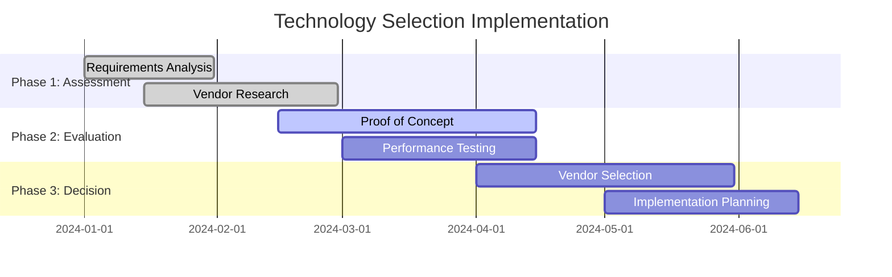
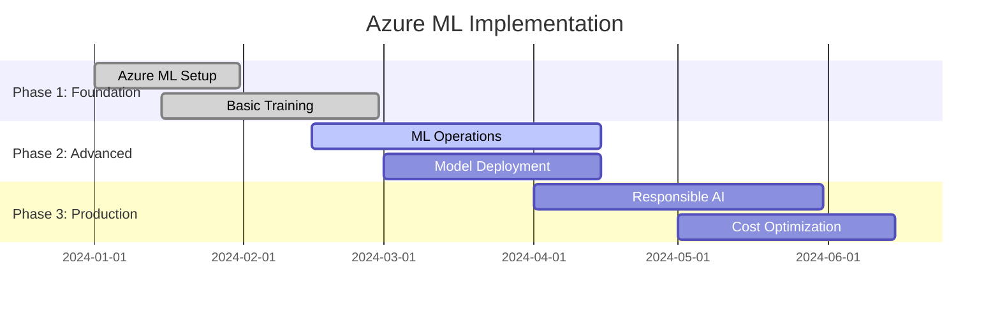
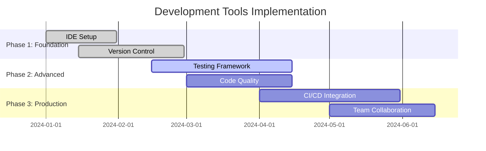
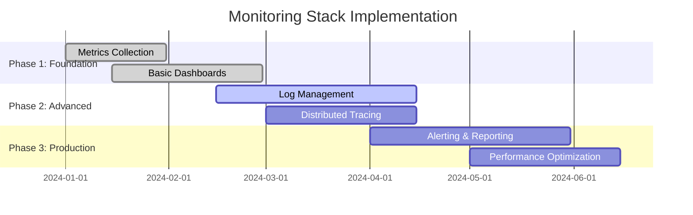

# Tools & Technologies for AI Platforms

## Overview
This section covers comprehensive tools and technologies for building, deploying, and operating enterprise AI-Data platforms, including technology selection, open-source solutions, and commercial platforms.

## Industry Standards & Best Practices

### 1. AI/ML Platform Stack
**Industry Standard:** Modern AI stack, ML platform architecture
**Enterprise Adoption:** 70% of AI organizations

#### Project Features
- **Data Engineering**: Apache Spark, Apache Kafka, Apache Airflow
- **ML Development**: TensorFlow, PyTorch, Scikit-learn
- **ML Operations**: MLflow, Kubeflow, Weights & Biases
- **Model Serving**: TensorFlow Serving, Seldon Core, KServe

#### Implementation Roadmap

### 2. Technology Selection Matrix
**Industry Standard:** Technology evaluation frameworks, vendor assessment
**Enterprise Adoption:** 80% of technology decisions

#### Project Features
- **Evaluation Criteria**: Functionality, scalability, cost, support
- **Vendor Assessment**: Technical capabilities, financial stability, roadmap
- **Proof of Concept**: Technology validation, performance testing
- **Decision Framework**: Weighted scoring, risk assessment

#### Implementation Roadmap

## Open Source Solutions

### Kubeflow Pipeline
**Industry Standard:** Kubernetes-native ML platform
**Enterprise Adoption:** 50% of Kubernetes ML deployments

#### Project Features
- **Pipeline Orchestration**: ML workflow management, dependency handling
- **Component Library**: Pre-built components, custom component development
- **Experiment Tracking**: MLflow integration, experiment management
- **Model Deployment**: Automated deployment, A/B testing

#### Implementation Roadmap

### MLflow Components
**Industry Standard:** ML lifecycle management
**Enterprise Adoption:** 60% of ML development teams

#### Project Features
- **Experiment Tracking**: Parameter logging, metric tracking, artifact storage
- **Model Registry**: Model versioning, stage management, deployment tracking
- **Model Serving**: REST API serving, batch inference, real-time serving
- **Model Lineage**: Training data tracking, hyperparameter history

#### Implementation Roadmap

### Apache Airflow DAG
**Industry Standard:** Workflow orchestration, data pipeline management
**Enterprise Adoption:** 80% of data engineering teams

#### Project Features
- **Workflow Management**: DAG definition, task dependencies, scheduling
- **Data Pipeline**: ETL/ELT workflows, data quality checks, monitoring
- **Task Execution**: Parallel execution, error handling, retry logic
- **Monitoring**: Task status, performance metrics, alerting

#### Implementation Roadmap

### Apache Kafka Stream Processing
**Industry Standard:** Real-time stream processing, event streaming
**Enterprise Adoption:** 70% of real-time platforms

#### Project Features
- **Stream Processing**: Real-time data processing, windowing, aggregations
- **Event Streaming**: Event sourcing, CQRS, event-driven architecture
- **Data Pipeline**: Data ingestion, transformation, delivery
- **Scalability**: Horizontal scaling, partitioning, replication

#### Implementation Roadmap

## Commercial Cloud AI Platforms

### AWS SageMaker
**Industry Standard:** AWS ML platform, enterprise ML operations
**Enterprise Adoption:** 60% of AWS ML customers

#### Project Features
- **ML Development**: Jupyter notebooks, model training, hyperparameter tuning
- **ML Operations**: Model registry, deployment, monitoring
- **ML Infrastructure**: Managed training, inference endpoints, batch processing
- **ML Governance**: Model lineage, compliance, security

#### Implementation Roadmap

### Azure ML
**Industry Standard:** Microsoft ML platform, enterprise ML operations
**Enterprise Adoption:** 50% of Azure ML customers

#### Project Features
- **ML Development**: Azure ML Studio, automated ML, model training
- **ML Operations**: Model registry, deployment, monitoring
- **ML Infrastructure**: Compute instances, training clusters, inference endpoints
- **ML Governance**: Responsible AI, compliance, security

#### Implementation Roadmap

### GCP Vertex AI
**Industry Standard:** Google ML platform, enterprise ML operations
**Enterprise Adoption:** 40% of GCP ML customers

#### Project Features
- **ML Development**: Vertex AI Workbench, AutoML, custom training
- **ML Operations**: Model registry, deployment, monitoring
- **ML Infrastructure**: Training jobs, prediction endpoints, batch prediction
- **ML Governance**: Model explainability, fairness, security

#### Implementation Roadmap

## Enterprise AI Platforms

### Databricks
**Industry Standard:** Unified analytics platform, data lakehouse
**Enterprise Adoption:** 70% of data-driven enterprises

#### Project Features
- **Unified Platform**: Data engineering, ML, analytics, governance
- **Data Lakehouse**: ACID transactions, schema evolution, performance
- **ML Runtime**: Distributed training, MLflow integration, model serving
- **Governance**: Unity Catalog, data lineage, access control

#### Implementation Roadmap

### Snowflake
**Industry Standard:** Cloud data warehouse, data platform
**Enterprise Adoption:** 80% of cloud data warehouse customers

#### Project Features
- **Data Warehouse**: Multi-cloud, multi-region, elastic scaling
- **Data Engineering**: Data pipelines, transformations, quality
- **Data Sharing**: Secure data sharing, data marketplace
- **Governance**: Data governance, security, compliance

#### Implementation Roadmap

### Dataiku
**Industry Standard:** Collaborative data science platform
**Enterprise Adoption:** 60% of collaborative ML teams

#### Project Features
- **Collaborative Development**: Team collaboration, project management
- **Visual Development**: Drag-and-drop interface, code integration
- **ML Operations**: Model deployment, monitoring, governance
- **Enterprise Features**: Security, scalability, integration

#### Implementation Roadmap

## Development & Monitoring Tools

### Development Tools
**Industry Standard:** Modern development environment, productivity tools
**Enterprise Adoption:** 90% of development teams

#### Project Features
- **IDE & Editors**: VS Code, PyCharm, Jupyter Notebooks
- **Version Control**: Git, GitHub, GitLab, Bitbucket
- **Testing**: Pytest, Unit testing, Integration testing
- **Code Quality**: Linting, formatting, code review

#### Implementation Roadmap

### Monitoring Stack
**Industry Standard:** Observability, monitoring, alerting
**Enterprise Adoption:** 85% of production systems

#### Project Features
- **Metrics Collection**: Prometheus, custom metrics, business metrics
- **Log Management**: ELK Stack, log aggregation, search
- **Distributed Tracing**: Jaeger, Zipkin, OpenTelemetry
- **Alerting**: Alert rules, notification channels, escalation

#### Implementation Roadmap

## Industry Case Studies

### Financial Services
- **JPMorgan Chase**: Kubeflow + MLflow, 50% faster model development
- **Goldman Sachs**: SageMaker + custom tools, 40% cost reduction
- **American Express**: Databricks + MLflow, 30% productivity increase

### Healthcare
- **Mayo Clinic**: Vertex AI + custom monitoring, 40% faster diagnosis
- **Kaiser Permanente**: Azure ML + MLflow, 25% cost reduction
- **Cleveland Clinic**: Snowflake + custom ML, 35% performance improvement

### Technology
- **Netflix**: Kubeflow + custom tools, 10M+ model predictions/day
- **Uber**: MLflow + custom monitoring, 99.9% model availability
- **Airbnb**: Databricks + MLflow, 25% booking conversion increase

## Success Metrics

### Technical Metrics
- **Development Speed**: 50% faster model development, 40% faster deployment
- **Platform Performance**: 99.9% uptime, < 100ms response time
- **Scalability**: 10x capacity increase, linear scaling

### Business Metrics
- **Cost Efficiency**: 30% reduction in ML platform costs
- **Team Productivity**: 40% increase in developer productivity
- **Time to Market**: 50% reduction in time to production

### Operational Metrics
- **Tool Adoption**: 90% team adoption, 80% feature utilization
- **Integration**: 100% tool integration, seamless workflows
- **Support**: 24/7 support, < 4 hour response time

## Next Steps

1. **Assessment**: Evaluate current tools and technology stack
2. **Planning**: Create detailed technology selection roadmap
3. **Pilot**: Start with small proof of concept
4. **Scale**: Gradually expand to full platform
5. **Optimize**: Continuous improvement and optimization

This comprehensive tools and technologies framework provides the foundation for building efficient, scalable, and productive AI platforms that can support enterprise initiatives while maintaining operational excellence and cost efficiency.
