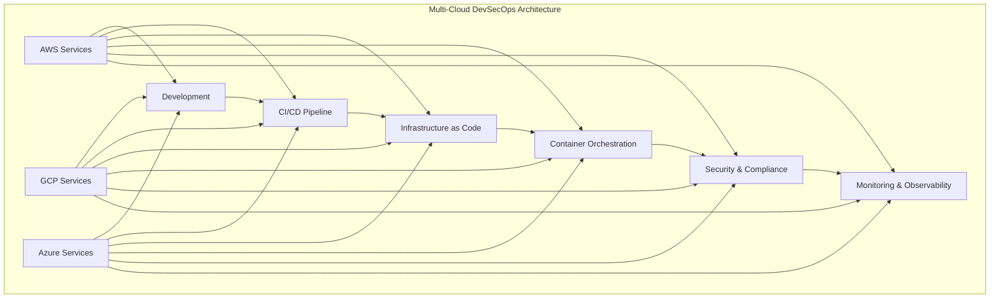

# Cloud Providers - DevSecOps Tools Integration

## 🌐 Overview
This section covers comprehensive DevSecOps tool integration across the three major cloud providers: AWS, GCP, and Azure. Each provider offers unique services and tools that can be combined to create robust DevSecOps pipelines.

## 🏗️ Cloud Provider Architecture



## 📁 Directory Structure

```
01-cloud-providers/
├── README.md
├── aws/
│   ├── README.md
│   ├── services/
│   ├── devsecops-tools/
│   ├── architecture-diagrams/
│   └── hands-on-labs/
├── gcp/
│   ├── README.md
│   ├── services/
│   ├── devsecops-tools/
│   ├── architecture-diagrams/
│   └── hands-on-labs/
└── azure/
    ├── README.md
    ├── services/
    ├── devsecops-tools/
    ├── architecture-diagrams/
    └── hands-on-labs/
```

## 🎯 Learning Objectives

### AWS Focus
- Master AWS core services for DevSecOps
- Implement security best practices
- Design scalable and secure architectures
- Automate infrastructure deployment

### GCP Focus
- Leverage GCP's AI/ML capabilities
- Implement Google Cloud security features
- Use GCP's native DevSecOps tools
- Build cloud-native applications

### Azure Focus
- Utilize Azure's enterprise features
- Implement Microsoft security solutions
- Integrate with Microsoft ecosystem
- Build hybrid cloud solutions

## 🛠️ Tool Categories by Provider

### AWS DevSecOps Tools
- **Compute**: EC2, Lambda, ECS, EKS
- **Storage**: S3, EBS, EFS, FSx
- **Networking**: VPC, ALB, NLB, CloudFront
- **Security**: IAM, KMS, Secrets Manager, GuardDuty
- **Monitoring**: CloudWatch, X-Ray, CloudTrail
- **CI/CD**: CodeCommit, CodeBuild, CodeDeploy, CodePipeline

### GCP DevSecOps Tools
- **Compute**: Compute Engine, Cloud Functions, GKE, Cloud Run
- **Storage**: Cloud Storage, Persistent Disk, Filestore
- **Networking**: VPC, Cloud Load Balancing, Cloud CDN
- **Security**: Cloud IAM, Secret Manager, Cloud KMS, Security Command Center
- **Monitoring**: Cloud Monitoring, Cloud Logging, Cloud Trace
- **CI/CD**: Cloud Source Repositories, Cloud Build, Cloud Deploy

### Azure DevSecOps Tools
- **Compute**: Virtual Machines, Azure Functions, AKS, Container Instances
- **Storage**: Blob Storage, Managed Disks, Azure Files
- **Networking**: Virtual Network, Application Gateway, Azure CDN
- **Security**: Azure AD, Key Vault, Azure Security Center, Sentinel
- **Monitoring**: Azure Monitor, Application Insights, Log Analytics
- **CI/CD**: Azure Repos, Azure Pipelines, Azure Resource Manager

## 🔄 Cross-Cloud Integration

### Hybrid Cloud Strategies
- **Multi-cloud deployment** patterns
- **Data synchronization** between clouds
- **Disaster recovery** across providers
- **Cost optimization** strategies

### Tool Integration Patterns
- **Terraform** for multi-cloud infrastructure
- **Kubernetes** for container orchestration
- **GitOps** for deployment automation
- **Service mesh** for microservices communication

## 📊 Comparison Matrix

| Feature | AWS | GCP | Azure |
|---------|-----|-----|-------|
| **Market Share** | 32% | 9% | 20% |
| **AI/ML Services** | SageMaker | Vertex AI | Azure ML |
| **Container Services** | EKS | GKE | AKS |
| **Serverless** | Lambda | Cloud Functions | Azure Functions |
| **Storage** | S3 | Cloud Storage | Blob Storage |
| **Security** | IAM, GuardDuty | Cloud IAM, Security Command Center | Azure AD, Security Center |
| **Monitoring** | CloudWatch | Cloud Monitoring | Azure Monitor |
| **CI/CD** | CodePipeline | Cloud Build | Azure Pipelines |

## 🚀 Getting Started

### Prerequisites
- Cloud provider accounts (AWS, GCP, Azure)
- Basic understanding of cloud concepts
- Command-line interface familiarity
- Docker and Kubernetes knowledge

### Quick Start Guide
1. **Choose your primary cloud provider**
2. **Set up your development environment**
3. **Complete the hands-on labs**
4. **Explore cross-cloud integration**
5. **Build your portfolio project**

### Environment Setup
```bash
# AWS CLI
aws configure

# GCP CLI
gcloud init

# Azure CLI
az login

# Terraform (multi-cloud)
terraform init
```

## 📚 Learning Resources

### Documentation
- **AWS**: [AWS Documentation](https://docs.aws.amazon.com/)
- **GCP**: [Google Cloud Documentation](https://cloud.google.com/docs)
- **Azure**: [Azure Documentation](https://docs.microsoft.com/azure/)

### Training Resources
- **AWS Training**: [AWS Training and Certification](https://aws.amazon.com/training/)
- **GCP Training**: [Google Cloud Training](https://cloud.google.com/training)
- **Azure Training**: [Microsoft Learn](https://learn.microsoft.com/azure/)

### Community Resources
- **AWS Community**: [AWS Community Forums](https://forums.aws.amazon.com/)
- **GCP Community**: [Google Cloud Community](https://cloud.google.com/community)
- **Azure Community**: [Azure Community](https://techcommunity.microsoft.com/t5/azure/ct-p/Azure)

## 🎓 Certification Paths

### AWS Certifications
- **AWS Certified Cloud Practitioner**
- **AWS Certified Solutions Architect**
- **AWS Certified DevOps Engineer**
- **AWS Certified Security Specialist**

### GCP Certifications
- **Google Cloud Digital Leader**
- **Professional Cloud Architect**
- **Professional Cloud DevOps Engineer**
- **Professional Cloud Security Engineer**

### Azure Certifications
- **Azure Fundamentals**
- **Azure Solutions Architect Expert**
- **Azure DevOps Engineer Expert**
- **Azure Security Engineer Associate**

## 🔧 Hands-On Labs

### Beginner Labs
- **Lab 1**: Setting up your first cloud account
- **Lab 2**: Deploying a simple web application
- **Lab 3**: Implementing basic security controls
- **Lab 4**: Setting up monitoring and logging

### Intermediate Labs
- **Lab 5**: Multi-tier application deployment
- **Lab 6**: Container orchestration setup
- **Lab 7**: CI/CD pipeline implementation
- **Lab 8**: Infrastructure as code deployment

### Advanced Labs
- **Lab 9**: Multi-cloud architecture design
- **Lab 10**: Advanced security implementation
- **Lab 11**: Performance optimization
- **Lab 12**: Disaster recovery setup

## 📈 Success Metrics

### Technical Skills
- **Cloud Services**: 90% proficiency in core services
- **Security Implementation**: 100% compliance with best practices
- **Automation**: 80% reduction in manual tasks
- **Performance**: 50% improvement in deployment speed

### Career Readiness
- **Portfolio Projects**: 3+ completed projects
- **Certification**: 1+ cloud certification
- **Interview Readiness**: Technical interview preparation
- **Industry Knowledge**: Up-to-date with latest trends

## 🤝 Contributing

### How to Contribute
1. **Fork the repository**
2. **Create a feature branch**
3. **Add your content or improvements**
4. **Submit a pull request**

### Contribution Areas
- **New cloud services** documentation
- **Updated architecture diagrams**
- **Additional hands-on labs**
- **Cross-cloud integration examples**

## 📞 Support

### Getting Help
- **Documentation**: Comprehensive guides in each provider folder
- **Issues**: GitHub issues for bug reports
- **Discussions**: Community discussions for questions
- **Mentorship**: Connect with cloud experts

### Community Resources
- **Slack**: #cloud-providers
- **Discord**: Cloud Learning Community
- **LinkedIn**: Cloud Professionals Group
- **YouTube**: Cloud Tutorials Channel

---

**Ready to explore cloud providers?** Navigate to your preferred cloud provider folder to begin your learning journey!
