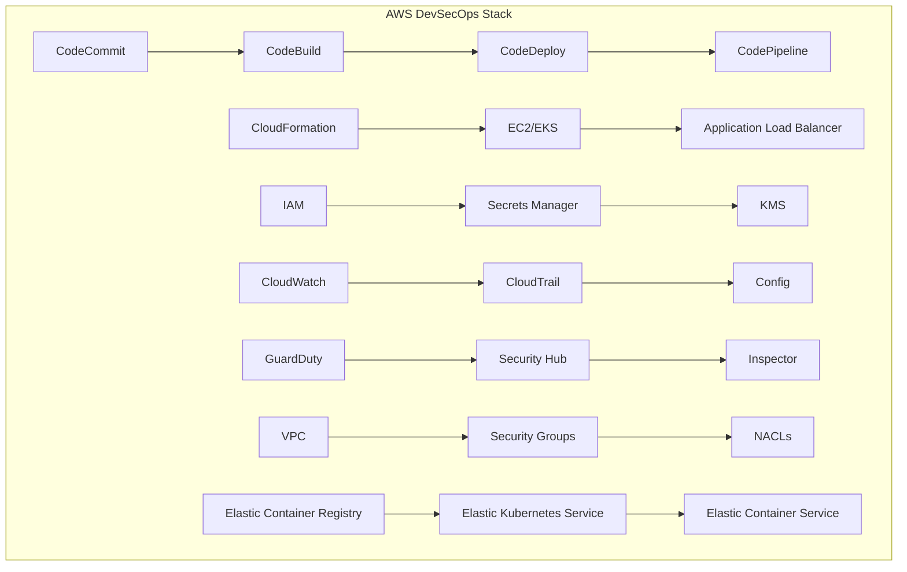

# AWS DevSecOps Tools Integration

## ☁️ Overview
Amazon Web Services (AWS) provides a comprehensive suite of tools and services for implementing DevSecOps practices. This section covers AWS-specific tools, services, and best practices for building secure, scalable, and automated development pipelines.

## 🏗️ AWS DevSecOps Architecture



## 📁 Directory Structure

```
aws/
├── README.md
├── services/
│   ├── compute/
│   ├── storage/
│   ├── networking/
│   ├── security/
│   ├── monitoring/
│   └── ci-cd/
├── devsecops-tools/
│   ├── vulnerability-scanning/
│   ├── secrets-management/
│   ├── policy-enforcement/
│   └── compliance-tools/
├── architecture-diagrams/
│   ├── enterprise-architecture.md
│   ├── microservices-architecture.md
│   └── serverless-architecture.md
└── hands-on-labs/
    ├── beginner/
    ├── intermediate/
    └── advanced/
```

## 🛠️ AWS Core Services

### Compute Services
- **EC2**: Elastic Compute Cloud for virtual servers
- **Lambda**: Serverless compute for event-driven applications
- **ECS**: Elastic Container Service for container orchestration
- **EKS**: Elastic Kubernetes Service for managed Kubernetes
- **Fargate**: Serverless compute for containers

### Storage Services
- **S3**: Simple Storage Service for object storage
- **EBS**: Elastic Block Store for persistent storage
- **EFS**: Elastic File System for shared storage
- **FSx**: Managed file systems (Windows/Lustre)
- **Glacier**: Long-term archival storage

### Networking Services
- **VPC**: Virtual Private Cloud for network isolation
- **ALB/NLB**: Application/Network Load Balancers
- **CloudFront**: Content Delivery Network
- **Route 53**: DNS and domain management
- **API Gateway**: API management and routing

### Security Services
- **IAM**: Identity and Access Management
- **KMS**: Key Management Service for encryption
- **Secrets Manager**: Secure secrets storage
- **GuardDuty**: Threat detection service
- **Security Hub**: Security findings aggregation
- **Inspector**: Vulnerability assessment
- **WAF**: Web Application Firewall
- **Shield**: DDoS protection

### Monitoring & Observability
- **CloudWatch**: Metrics, logs, and alarms
- **CloudTrail**: API call logging
- **X-Ray**: Distributed tracing
- **Config**: Resource configuration tracking
- **Systems Manager**: Infrastructure management

### CI/CD Services
- **CodeCommit**: Git-based source control
- **CodeBuild**: Build and test service
- **CodeDeploy**: Application deployment
- **CodePipeline**: CI/CD orchestration
- **CodeStar**: Project management and CI/CD

## 🔒 Security Best Practices

### Identity and Access Management
```yaml
# IAM Policy Example
Version: '2012-10-17'
Statement:
  - Effect: Allow
    Principal:
      AWS: arn:aws:iam::123456789012:user/DevSecOpsUser
    Action:
      - s3:GetObject
      - s3:PutObject
    Resource: arn:aws:s3:::my-secure-bucket/*
    Condition:
      StringEquals:
        s3:x-amz-server-side-encryption: AES256
```

### Network Security
- **VPC Design**: Private subnets for sensitive resources
- **Security Groups**: Restrictive inbound/outbound rules
- **NACLs**: Network-level access control
- **VPC Flow Logs**: Network traffic monitoring
- **Transit Gateway**: Centralized network management

### Data Protection
- **Encryption at Rest**: S3, EBS, RDS encryption
- **Encryption in Transit**: TLS/SSL for all communications
- **Key Management**: AWS KMS for encryption keys
- **Secrets Management**: AWS Secrets Manager for sensitive data
- **Data Classification**: Tagging and labeling strategy

## 🚀 CI/CD Pipeline Implementation

### AWS CodePipeline Example
```yaml
# pipeline.yml
name: DevSecOps-Pipeline
version: 1.0
stages:
  - name: Source
    actions:
      - name: SourceAction
        actionTypeId:
          category: Source
          owner: AWS
          provider: CodeCommit
        configuration:
          RepositoryName: my-app
          BranchName: main
  
  - name: Build
    actions:
      - name: BuildAction
        actionTypeId:
          category: Build
          owner: AWS
          provider: CodeBuild
        configuration:
          ProjectName: my-app-build
  
  - name: Deploy
    actions:
      - name: DeployAction
        actionTypeId:
          category: Deploy
          owner: AWS
          provider: CodeDeploy
        configuration:
          ApplicationName: my-app
          DeploymentGroupName: production
```

### Infrastructure as Code with CloudFormation
```yaml
# infrastructure.yml
AWSTemplateFormatVersion: '2010-09-09'
Description: 'DevSecOps Infrastructure Stack'

Resources:
  VPC:
    Type: AWS::EC2::VPC
    Properties:
      CidrBlock: 10.0.0.0/16
      EnableDnsHostnames: true
      EnableDnsSupport: true
      Tags:
        - Key: Name
          Value: DevSecOps-VPC

  PublicSubnet:
    Type: AWS::EC2::Subnet
    Properties:
      VpcId: !Ref VPC
      CidrBlock: 10.0.1.0/24
      AvailabilityZone: !Select [0, !GetAZs '']
      MapPublicIpOnLaunch: true
      Tags:
        - Key: Name
          Value: Public-Subnet

  SecurityGroup:
    Type: AWS::EC2::SecurityGroup
    Properties:
      GroupName: DevSecOps-SG
      GroupDescription: Security group for DevSecOps resources
      VpcId: !Ref VPC
      SecurityGroupIngress:
        - IpProtocol: tcp
          FromPort: 80
          ToPort: 80
          CidrIp: 0.0.0.0/0
        - IpProtocol: tcp
          FromPort: 443
          ToPort: 443
          CidrIp: 0.0.0.0/0
      SecurityGroupEgress:
        - IpProtocol: -1
          CidrIp: 0.0.0.0/0
```

## 🐳 Container Security

### EKS Security Configuration
```yaml
# eks-cluster.yaml
apiVersion: eksctl.io/v1alpha5
kind: ClusterConfig

metadata:
  name: devsecops-cluster
  region: us-west-2

nodeGroups:
  - name: workers
    instanceType: t3.medium
    desiredCapacity: 3
    ssh:
      allow: true
    iam:
      withAddonPolicies:
        imageBuilder: true
        autoScaler: true
        externalDNS: true
        certManager: true
        appMesh: true
        ebs: true
        fsx: true
        efs: true
        awsLoadBalancerController: true

addons:
  - name: vpc-cni
    version: latest
  - name: coredns
    version: latest
  - name: kube-proxy
    version: latest
  - name: aws-ebs-csi-driver
    version: latest
```

### Container Image Security
```dockerfile
# Dockerfile with security best practices
FROM node:18-alpine AS builder

# Create non-root user
RUN addgroup -g 1001 -S nodejs
RUN adduser -S nextjs -u 1001

# Set working directory
WORKDIR /app

# Copy package files
COPY package*.json ./

# Install dependencies
RUN npm ci --only=production

# Copy source code
COPY --chown=nextjs:nodejs . .

# Build application
RUN npm run build

# Production stage
FROM node:18-alpine AS runner
WORKDIR /app

# Create non-root user
RUN addgroup -g 1001 -S nodejs
RUN adduser -S nextjs -u 1001

# Copy built application
COPY --from=builder --chown=nextjs:nodejs /app/dist ./dist
COPY --from=builder --chown=nextjs:nodejs /app/node_modules ./node_modules
COPY --from=builder --chown=nextjs:nodejs /app/package.json ./package.json

# Switch to non-root user
USER nextjs

# Expose port
EXPOSE 3000

# Health check
HEALTHCHECK --interval=30s --timeout=3s --start-period=5s --retries=3 \
  CMD curl -f http://localhost:3000/health || exit 1

# Start application
CMD ["npm", "start"]
```

## 📊 Monitoring and Alerting

### CloudWatch Dashboard
```json
{
  "widgets": [
    {
      "type": "metric",
      "properties": {
        "metrics": [
          ["AWS/EC2", "CPUUtilization", "InstanceId", "i-1234567890abcdef0"],
          ["AWS/EC2", "NetworkIn", "InstanceId", "i-1234567890abcdef0"],
          ["AWS/EC2", "NetworkOut", "InstanceId", "i-1234567890abcdef0"]
        ],
        "period": 300,
        "stat": "Average",
        "region": "us-west-2",
        "title": "EC2 Instance Metrics"
      }
    }
  ]
}
```

### CloudWatch Alarms
```yaml
# cloudwatch-alarms.yml
Resources:
  HighCPUAlarm:
    Type: AWS::CloudWatch::Alarm
    Properties:
      AlarmName: High-CPU-Utilization
      AlarmDescription: Alarm when CPU exceeds 80%
      MetricName: CPUUtilization
      Namespace: AWS/EC2
      Statistic: Average
      Period: 300
      EvaluationPeriods: 2
      Threshold: 80
      ComparisonOperator: GreaterThanThreshold
      Dimensions:
        - Name: InstanceId
          Value: !Ref EC2Instance
      AlarmActions:
        - !Ref SNSTopic

  SNSTopic:
    Type: AWS::SNS::Topic
    Properties:
      TopicName: DevSecOps-Alerts
      DisplayName: DevSecOps Alerts
```

## 🔍 Security Scanning and Compliance

### AWS Config Rules
```yaml
# config-rules.yml
Resources:
  S3BucketEncryptionRule:
    Type: AWS::Config::ConfigRule
    Properties:
      ConfigRuleName: s3-bucket-encryption-enabled
      Description: Checks if S3 buckets have encryption enabled
      Source:
        Owner: AWS
        SourceIdentifier: S3_BUCKET_SERVER_SIDE_ENCRYPTION_ENABLED
      Scope:
        ComplianceResourceTypes:
          - AWS::S3::Bucket

  EC2InstanceTypeRule:
    Type: AWS::Config::ConfigRule
    Properties:
      ConfigRuleName: ec2-instance-type-check
      Description: Checks if EC2 instances are using approved instance types
      Source:
        Owner: AWS
        SourceIdentifier: EC2_INSTANCE_TYPE_CHECK
      Scope:
        ComplianceResourceTypes:
          - AWS::EC2::Instance
```

### Security Hub Integration
```yaml
# security-hub.yml
Resources:
  SecurityHubStandard:
    Type: AWS::SecurityHub::StandardsSubscription
    Properties:
      StandardsArn: arn:aws:securityhub:us-west-2::standards/cis-aws-foundations-benchmark/v/1.2.0

  SecurityHubProduct:
    Type: AWS::SecurityHub::ProductSubscription
    Properties:
      ProductArn: arn:aws:securityhub:us-west-2::product/aws/guardduty
```

## 🧪 Hands-On Labs

### Beginner Lab: Basic AWS Setup
```bash
# Lab 1: Setting up AWS CLI and basic services
# 1. Install AWS CLI
curl "https://awscli.amazonaws.com/awscli-exe-linux-x86_64.zip" -o "awscliv2.zip"
unzip awscliv2.zip
sudo ./aws/install

# 2. Configure AWS CLI
aws configure

# 3. Create a basic S3 bucket
aws s3 mb s3://my-devsecops-bucket

# 4. Upload a file
echo "Hello DevSecOps!" > hello.txt
aws s3 cp hello.txt s3://my-devsecops-bucket/

# 5. List bucket contents
aws s3 ls s3://my-devsecops-bucket/
```

### Intermediate Lab: CI/CD Pipeline
```bash
# Lab 2: Building a CI/CD pipeline
# 1. Create CodeCommit repository
aws codecommit create-repository --repository-name my-app

# 2. Create CodeBuild project
aws codebuild create-project --cli-input-json file://build-project.json

# 3. Create CodeDeploy application
aws deploy create-application --application-name my-app

# 4. Create deployment group
aws deploy create-deployment-group --cli-input-json file://deployment-group.json

# 5. Create CodePipeline
aws codepipeline create-pipeline --cli-input-json file://pipeline.json
```

### Advanced Lab: Multi-Account Security
```bash
# Lab 3: Implementing multi-account security
# 1. Set up AWS Organizations
aws organizations create-organization --feature-set ALL

# 2. Create organizational units
aws organizations create-organizational-unit --parent-id r-1234 --name Security

# 3. Set up cross-account access
aws sts assume-role --role-arn arn:aws:iam::123456789012:role/CrossAccountRole --role-session-name DevSecOpsSession

# 4. Configure Security Hub across accounts
aws securityhub create-members --account-details AccountId=123456789012,Email=admin@example.com

# 5. Set up centralized logging
aws logs create-log-group --log-group-name /aws/security/centralized
```

## 📚 Learning Resources

### AWS Documentation
- [AWS DevSecOps Guide](https://docs.aws.amazon.com/whitepapers/latest/aws-security-architecture/)
- [AWS Well-Architected Framework](https://aws.amazon.com/architecture/well-architected/)
- [AWS Security Best Practices](https://aws.amazon.com/security/security-resources/)

### Training Resources
- [AWS Training and Certification](https://aws.amazon.com/training/)
- [AWS re:Invent Sessions](https://reinvent.awsevents.com/)
- [AWS Community Builders](https://aws.amazon.com/developer/community/community-builders/)

### Tools and Utilities
- [AWS CLI](https://aws.amazon.com/cli/)
- [AWS CDK](https://aws.amazon.com/cdk/)
- [AWS SAM](https://aws.amazon.com/serverless/sam/)
- [Terraform AWS Provider](https://registry.terraform.io/providers/hashicorp/aws/latest)

## 🎓 Certification Preparation

### AWS Certified DevOps Engineer
- **Exam Guide**: [AWS DevOps Engineer Exam Guide](https://aws.amazon.com/certification/certified-devops-engineer-professional/)
- **Practice Tests**: AWS Practice Tests and Sample Questions
- **Hands-on Experience**: 2+ years of AWS experience recommended
- **Study Materials**: AWS Training courses and whitepapers

### AWS Certified Security Specialist
- **Exam Guide**: [AWS Security Specialist Exam Guide](https://aws.amazon.com/certification/certified-security-specialty/)
- **Prerequisites**: AWS Cloud Practitioner or Associate level certification
- **Experience**: 5+ years of IT security experience
- **Study Focus**: AWS security services and best practices

## 📈 Success Metrics

### Technical Proficiency
- **AWS Services**: 90% proficiency in core services
- **Security Implementation**: 100% compliance with AWS security best practices
- **Automation**: 80% reduction in manual deployment tasks
- **Cost Optimization**: 30% reduction in AWS costs through optimization

### Career Readiness
- **Portfolio Projects**: 3+ AWS-based projects
- **Certification**: AWS DevOps Engineer or Security Specialist
- **Interview Readiness**: Technical interview preparation with AWS scenarios
- **Industry Knowledge**: Up-to-date with latest AWS services and features

## 🤝 Contributing

### How to Contribute
1. **Fork the repository**
2. **Create a feature branch**
3. **Add AWS-specific content or improvements**
4. **Submit a pull request**

### Contribution Areas
- **New AWS services** documentation
- **Updated architecture diagrams**
- **Additional hands-on labs**
- **Security best practices**

## 📞 Support

### Getting Help
- **AWS Support**: [AWS Support Center](https://console.aws.amazon.com/support/)
- **AWS Forums**: [AWS Community Forums](https://forums.aws.amazon.com/)
- **AWS re:Post**: [AWS re:Post Community](https://repost.aws/)
- **GitHub Issues**: Use GitHub issues for this project

### Community Resources
- **Slack**: #aws-devsecops
- **Discord**: AWS Learning Community
- **LinkedIn**: AWS Professionals Group
- **YouTube**: AWS Tutorials Channel

---

**Ready to master AWS DevSecOps?** Start with the hands-on labs and work your way through the learning path!
