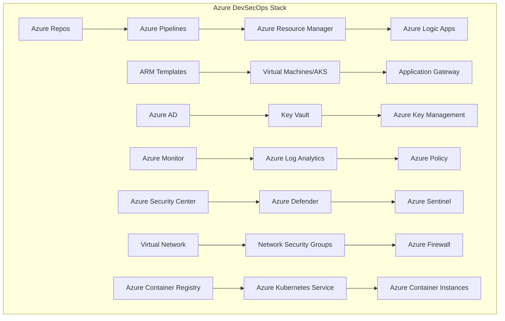

# Microsoft Azure DevSecOps Tools Integration

## ☁️ Overview
Microsoft Azure provides a comprehensive suite of tools and services for implementing DevSecOps practices, with strong integration with Microsoft's enterprise ecosystem and hybrid cloud capabilities. This section covers Azure-specific tools, services, and best practices for building secure, scalable, and automated development pipelines.

## 🏗️ Azure DevSecOps Architecture



## 📁 Directory Structure

```
azure/
├── README.md
├── services/
│   ├── compute/
│   ├── storage/
│   ├── networking/
│   ├── security/
│   ├── monitoring/
│   └── ci-cd/
├── devsecops-tools/
│   ├── vulnerability-scanning/
│   ├── secrets-management/
│   ├── policy-enforcement/
│   └── compliance-tools/
├── architecture-diagrams/
│   ├── enterprise-architecture.md
│   ├── microservices-architecture.md
│   └── serverless-architecture.md
└── hands-on-labs/
    ├── beginner/
    ├── intermediate/
    └── advanced/
```

## 🛠️ Azure Core Services

### Compute Services
- **Virtual Machines**: Scalable compute instances
- **Azure Kubernetes Service (AKS)**: Managed Kubernetes clusters
- **Container Instances**: Serverless container platform
- **Azure Functions**: Event-driven serverless functions
- **App Service**: Platform-as-a-Service for web applications
- **Azure Spring Cloud**: Managed Spring Boot applications

### Storage Services
- **Blob Storage**: Object storage for unstructured data
- **Managed Disks**: Block storage for VMs
- **Azure Files**: Managed file shares
- **Azure SQL Database**: Managed relational database
- **Cosmos DB**: Globally distributed NoSQL database
- **Azure Data Lake**: Big data analytics storage

### Networking Services
- **Virtual Network (VNet)**: Software-defined networking
- **Application Gateway**: Layer 7 load balancing
- **Azure CDN**: Content delivery network
- **Azure DNS**: Managed DNS service
- **Azure Front Door**: Global load balancing
- **Azure ExpressRoute**: Private connectivity

### Security Services
- **Azure Active Directory**: Identity and access management
- **Key Vault**: Secrets and key management
- **Azure Security Center**: Security posture management
- **Azure Defender**: Advanced threat protection
- **Azure Sentinel**: Security information and event management
- **Azure DDoS Protection**: DDoS attack protection
- **Azure WAF**: Web application firewall

### Monitoring & Observability
- **Azure Monitor**: Metrics, logs, and alerting
- **Application Insights**: Application performance monitoring
- **Log Analytics**: Centralized logging and analysis
- **Azure Service Map**: Application dependency mapping
- **Azure Workbooks**: Custom dashboards and reports
- **Azure Alerts**: Intelligent alerting

### CI/CD Services
- **Azure Repos**: Git-based source control
- **Azure Pipelines**: CI/CD platform
- **Azure Artifacts**: Package management
- **Azure Test Plans**: Test management
- **Azure Boards**: Work tracking
- **Azure Logic Apps**: Workflow automation

## 🔒 Security Best Practices

### Identity and Access Management
```json
{
  "properties": {
    "displayName": "DevSecOps Access Policy",
    "description": "Policy for DevSecOps team access",
    "policyDefinitionId": "/subscriptions/{subscription-id}/providers/Microsoft.Authorization/policyDefinitions/DevSecOpsPolicy",
    "parameters": {
      "allowedLocations": {
        "value": ["East US", "West US 2"]
      },
      "allowedResourceTypes": {
        "value": ["Microsoft.Compute", "Microsoft.Storage", "Microsoft.Network"]
      }
    }
  }
}
```

### Network Security
- **VNet Design**: Hub-spoke architecture with private endpoints
- **Network Security Groups**: Restrictive inbound/outbound rules
- **Azure Firewall**: Centralized network security
- **DDoS Protection**: Standard and Premium tiers
- **Private Endpoints**: Secure access to Azure services

### Data Protection
- **Encryption at Rest**: Customer-managed keys (CMK)
- **Encryption in Transit**: TLS/SSL for all communications
- **Key Management**: Azure Key Vault for encryption keys
- **Secrets Management**: Key Vault for sensitive data
- **Data Classification**: Azure Information Protection

## 🚀 CI/CD Pipeline Implementation

### Azure Pipelines Configuration
```yaml
# azure-pipelines.yml
trigger:
- main

pool:
  vmImage: 'ubuntu-latest'

variables:
  buildConfiguration: 'Release'
  azureSubscription: 'DevSecOps-Subscription'
  resourceGroupName: 'devsecops-rg'
  location: 'East US'

stages:
- stage: Build
  displayName: 'Build and Test'
  jobs:
  - job: BuildJob
    displayName: 'Build Job'
    steps:
    - task: UseNode@1
      inputs:
        version: '18.x'
    
    - script: |
        npm install
        npm run build
        npm run test
      displayName: 'Install, Build, and Test'
    
    - task: Docker@2
      inputs:
        command: 'build'
        dockerfile: '**/Dockerfile'
        tags: |
          $(Build.BuildId)
          latest
    
    - task: AzureContainerRegistry@1
      inputs:
        command: 'push'
        azureSubscription: $(azureSubscription)
        resourceGroupName: $(resourceGroupName)
        azureContainerRegistry: 'devsecopsacr.azurecr.io'
        imageName: 'my-app:$(Build.BuildId)'

- stage: Deploy
  displayName: 'Deploy to Azure'
  dependsOn: Build
  condition: succeeded()
  jobs:
  - deployment: DeployJob
    displayName: 'Deploy Job'
    environment: 'production'
    strategy:
      runOnce:
        deploy:
          steps:
          - task: AzureResourceManagerTemplateDeployment@3
            inputs:
              deploymentScope: 'Resource Group'
              azureResourceManagerConnection: $(azureSubscription)
              subscriptionId: $(subscriptionId)
              action: 'Create Or Update Resource Group'
              resourceGroupName: $(resourceGroupName)
              location: $(location)
              templateLocation: 'Linked artifact'
              csmFile: 'infrastructure/mainTemplate.json'
              csmParametersFile: 'infrastructure/parameters.json'
              overrideParameters: '-environment "production"'
```

### Infrastructure as Code with ARM Templates
```json
{
  "$schema": "https://schema.management.azure.com/schemas/2019-04-01/deploymentTemplate.json#",
  "contentVersion": "1.0.0.0",
  "parameters": {
    "environment": {
      "type": "string",
      "defaultValue": "dev",
      "allowedValues": ["dev", "staging", "prod"]
    },
    "location": {
      "type": "string",
      "defaultValue": "[resourceGroup().location]"
    }
  },
  "variables": {
    "vnetName": "[concat('vnet-', parameters('environment'))]",
    "subnetName": "[concat('subnet-', parameters('environment'))]",
    "nsgName": "[concat('nsg-', parameters('environment'))]",
    "vmName": "[concat('vm-', parameters('environment'))]"
  },
  "resources": [
    {
      "type": "Microsoft.Network/virtualNetworks",
      "apiVersion": "2020-11-01",
      "name": "[variables('vnetName')]",
      "location": "[parameters('location')]",
      "properties": {
        "addressSpace": {
          "addressPrefixes": ["10.0.0.0/16"]
        },
        "subnets": [
          {
            "name": "[variables('subnetName')]",
            "properties": {
              "addressPrefix": "10.0.1.0/24",
              "networkSecurityGroup": {
                "id": "[resourceId('Microsoft.Network/networkSecurityGroups', variables('nsgName'))]"
              }
            }
          }
        ]
      }
    },
    {
      "type": "Microsoft.Network/networkSecurityGroups",
      "apiVersion": "2020-11-01",
      "name": "[variables('nsgName')]",
      "location": "[parameters('location')]",
      "properties": {
        "securityRules": [
          {
            "name": "AllowHTTPS",
            "properties": {
              "priority": 1000,
              "access": "Allow",
              "direction": "Inbound",
              "destinationPortRange": "443",
              "protocol": "Tcp",
              "sourceAddressPrefix": "*",
              "destinationAddressPrefix": "*"
            }
          }
        ]
      }
    }
  ]
}
```

## 🐳 Container Security

### AKS Security Configuration
```yaml
# aks-cluster.yaml
apiVersion: containerservice.azure.com/v1
kind: ManagedCluster
metadata:
  name: devsecops-cluster
  location: eastus
spec:
  kubernetesVersion: "1.24.0"
  resourceGroup: devsecops-rg
  
  # Security configurations
  securityProfile:
    azureKeyVaultKms:
      enabled: true
      keyId: "https://devsecops-kv.vault.azure.net/keys/aks-key/1234567890abcdef"
      keyVaultNetworkAccess: "Private"
      keyVaultResourceId: "/subscriptions/12345678-1234-1234-1234-123456789012/resourceGroups/devsecops-rg/providers/Microsoft.KeyVault/vaults/devsecops-kv"
  
  # Network profile
  networkProfile:
    networkPlugin: "azure"
    networkPolicy: "azure"
    serviceCidr: "10.0.0.0/16"
    dnsServiceIP: "10.0.0.10"
    podCidr: "10.244.0.0/16"
  
  # Node pool configuration
  agentPoolProfiles:
  - name: system
    count: 3
    vmSize: "Standard_D2s_v3"
    osType: "Linux"
    osDiskSizeGB: 128
    vnetSubnetID: "/subscriptions/12345678-1234-1234-1234-123456789012/resourceGroups/devsecops-rg/providers/Microsoft.Network/virtualNetworks/devsecops-vnet/subnets/devsecops-subnet"
    
    # Security settings
    enableEncryptionAtHost: true
    enableFIPS: true
    enableNodePublicIP: false
    
    # Workload identity
    workloadIdentity:
      enabled: true
  
  # Add-ons
  addonProfiles:
    azureKeyvaultSecretsProvider:
      enabled: true
      config:
        enableSecretRotation: true
        rotationPollInterval: "2m"
    azurePolicy:
      enabled: true
    monitoring:
      enabled: true
      logAnalyticsWorkspaceResourceID: "/subscriptions/12345678-1234-1234-1234-123456789012/resourceGroups/devsecops-rg/providers/Microsoft.OperationalInsights/workspaces/devsecops-logs"
```

### Container Image Security
```dockerfile
# Dockerfile with security best practices
FROM mcr.microsoft.com/dotnet/aspnet:6.0-alpine AS base
WORKDIR /app
EXPOSE 80
EXPOSE 443

# Create non-root user
RUN addgroup -g 1001 -S appgroup
RUN adduser -S appuser -u 1001 -G appgroup

FROM mcr.microsoft.com/dotnet/sdk:6.0-alpine AS build
WORKDIR /src

# Copy project files
COPY ["MyApp/MyApp.csproj", "MyApp/"]
RUN dotnet restore "MyApp/MyApp.csproj"

# Copy source code
COPY . .
WORKDIR "/src/MyApp"

# Build application
RUN dotnet build "MyApp.csproj" -c Release -o /app/build

FROM build AS publish
RUN dotnet publish "MyApp.csproj" -c Release -o /app/publish

FROM base AS final
WORKDIR /app

# Install security updates
RUN apk update && apk upgrade

# Copy published application
COPY --from=publish /app/publish .

# Change ownership to non-root user
RUN chown -R appuser:appgroup /app
USER appuser

# Health check
HEALTHCHECK --interval=30s --timeout=3s --start-period=5s --retries=3 \
  CMD wget --no-verbose --tries=1 --spider http://localhost:80/health || exit 1

ENTRYPOINT ["dotnet", "MyApp.dll"]
```

## 📊 Monitoring and Alerting

### Azure Monitor Dashboard
```json
{
  "id": "/subscriptions/12345678-1234-1234-1234-123456789012/resourceGroups/devsecops-rg/providers/Microsoft.Portal/dashboards/devsecops-dashboard",
  "name": "devsecops-dashboard",
  "type": "Microsoft.Portal/dashboards",
  "location": "eastus",
  "properties": {
    "lenses": {
      "0": {
        "order": 0,
        "parts": {
          "0": {
            "position": {
              "x": 0,
              "y": 0,
              "rowSpan": 4,
              "colSpan": 6
            },
            "metadata": {
              "inputs": [],
              "type": "Extension/Microsoft_OperationsManagementSuite_Workspace/PartType/LogsDashboardPart",
              "settings": {
                "content": {
                  "Query": "Perf | where ObjectName == 'Processor' and CounterName == '% Processor Time' | summarize avg(CounterValue) by bin(TimeGenerated, 5m), Computer | render timechart",
                  "IsQueryBasedOnTimeRange": true,
                  "TimeRange": {
                    "durationMs": 86400000
                  },
                  "QueryType": 0,
                  "ResourceType": "microsoft.operationalinsights/workspaces"
                }
              }
            }
          }
        }
      }
    }
  }
}
```

### Azure Alerts Configuration
```yaml
# azure-alerts.yaml
apiVersion: v1
kind: ConfigMap
metadata:
  name: azure-alerts
  namespace: kube-system
data:
  alert-rules.yaml: |
    groups:
    - name: devsecops-alerts
      rules:
      - alert: HighCPUUsage
        expr: 100 - (avg by(instance) (irate(node_cpu_seconds_total{mode="idle"}[5m])) * 100) > 80
        for: 5m
        labels:
          severity: warning
        annotations:
          summary: "High CPU usage detected"
          description: "CPU usage is above 80% for more than 5 minutes"
      
      - alert: HighMemoryUsage
        expr: (1 - (node_memory_MemAvailable_bytes / node_memory_MemTotal_bytes)) * 100 > 80
        for: 5m
        labels:
          severity: warning
        annotations:
          summary: "High memory usage detected"
          description: "Memory usage is above 80% for more than 5 minutes"
```

## 🔍 Security Scanning and Compliance

### Azure Policy Configuration
```json
{
  "properties": {
    "displayName": "DevSecOps Security Policy",
    "description": "Policy for DevSecOps security compliance",
    "policyRule": {
      "if": {
        "allOf": [
          {
            "field": "type",
            "equals": "Microsoft.Compute/virtualMachines"
          },
          {
            "field": "Microsoft.Compute/virtualMachines/storageProfile.osDisk.encryptionSettings.enabled",
            "equals": "false"
          }
        ]
      },
      "then": {
        "effect": "audit",
        "details": {
          "type": "Microsoft.Compute/virtualMachines",
          "existenceCondition": {
            "field": "Microsoft.Compute/virtualMachines/storageProfile.osDisk.encryptionSettings.enabled",
            "equals": "true"
          }
        }
      }
    }
  }
}
```

### Azure Security Center Configuration
```yaml
# security-center-config.yaml
apiVersion: v1
kind: ConfigMap
metadata:
  name: security-center-config
  namespace: kube-system
data:
  security-policy.yaml: |
    apiVersion: v1
    kind: PodSecurityPolicy
    metadata:
      name: devsecops-psp
    spec:
      privileged: false
      allowPrivilegeEscalation: false
      requiredDropCapabilities:
        - ALL
      volumes:
        - 'configMap'
        - 'emptyDir'
        - 'projected'
        - 'secret'
        - 'downwardAPI'
        - 'persistentVolumeClaim'
      runAsUser:
        rule: 'MustRunAsNonRoot'
      seLinux:
        rule: 'RunAsAny'
      fsGroup:
        rule: 'RunAsAny'
```

## 🧪 Hands-On Labs

### Beginner Lab: Basic Azure Setup
```bash
# Lab 1: Setting up Azure CLI and basic services
# 1. Install Azure CLI
curl -sL https://aka.ms/InstallAzureCLIDeb | sudo bash

# 2. Login to Azure
az login

# 3. Set default subscription
az account set --subscription "DevSecOps Subscription"

# 4. Create a resource group
az group create --name devsecops-rg --location eastus

# 5. Create a storage account
az storage account create \
  --name devsecopsstorage \
  --resource-group devsecops-rg \
  --location eastus \
  --sku Standard_LRS

# 6. Create a container
az storage container create \
  --name devsecops-container \
  --account-name devsecopsstorage
```

### Intermediate Lab: CI/CD Pipeline
```bash
# Lab 2: Building a CI/CD pipeline
# 1. Create Azure DevOps organization
az devops configure --defaults organization=https://dev.azure.com/MyOrg project=MyProject

# 2. Create Azure Container Registry
az acr create \
  --resource-group devsecops-rg \
  --name devsecopsacr \
  --sku Basic

# 3. Create AKS cluster
az aks create \
  --resource-group devsecops-rg \
  --name devsecops-cluster \
  --node-count 3 \
  --enable-addons monitoring \
  --generate-ssh-keys

# 4. Get AKS credentials
az aks get-credentials \
  --resource-group devsecops-rg \
  --name devsecops-cluster

# 5. Deploy application
kubectl apply -f k8s/
```

### Advanced Lab: Multi-Environment Security
```bash
# Lab 3: Implementing multi-environment security
# 1. Create Key Vault
az keyvault create \
  --name devsecops-kv \
  --resource-group devsecops-rg \
  --location eastus

# 2. Create managed identity
az identity create \
  --name devsecops-identity \
  --resource-group devsecops-rg

# 3. Assign Key Vault access policy
az keyvault set-policy \
  --name devsecops-kv \
  --object-id $(az identity show --name devsecops-identity --resource-group devsecops-rg --query principalId -o tsv) \
  --secret-permissions get list

# 4. Enable Azure Security Center
az security pricing create \
  --name "VirtualMachines" \
  --tier "Standard"

# 5. Configure Azure Sentinel
az sentinel workspace create \
  --resource-group devsecops-rg \
  --workspace-name devsecops-sentinel \
  --location eastus
```

## 📚 Learning Resources

### Azure Documentation
- [Azure DevSecOps Guide](https://docs.microsoft.com/azure/devops/)
- [Azure Security Best Practices](https://docs.microsoft.com/azure/security/)
- [Azure Well-Architected Framework](https://docs.microsoft.com/azure/architecture/framework/)

### Training Resources
- [Microsoft Learn](https://learn.microsoft.com/azure/)
- [Azure Training](https://azure.microsoft.com/training/)
- [Azure Community](https://azure.microsoft.com/community/)

### Tools and Utilities
- [Azure CLI](https://docs.microsoft.com/cli/azure/)
- [Azure PowerShell](https://docs.microsoft.com/powershell/azure/)
- [Terraform Azure Provider](https://registry.terraform.io/providers/hashicorp/azurerm/latest)
- [Pulumi Azure Provider](https://www.pulumi.com/registry/packages/azure/)

## 🎓 Certification Preparation

### Azure DevOps Engineer Expert
- **Exam Guide**: [Azure DevOps Engineer Exam Guide](https://docs.microsoft.com/certifications/azure-devops-engineer/)
- **Practice Tests**: Microsoft Practice Tests
- **Hands-on Experience**: 2+ years of Azure experience recommended
- **Study Materials**: Microsoft Learn modules and documentation

### Azure Security Engineer Associate
- **Exam Guide**: [Azure Security Engineer Exam Guide](https://docs.microsoft.com/certifications/azure-security-engineer/)
- **Prerequisites**: Azure Fundamentals or Associate level certification
- **Experience**: 1+ years of security experience
- **Study Focus**: Azure security services and best practices

## 📈 Success Metrics

### Technical Proficiency
- **Azure Services**: 90% proficiency in core services
- **Security Implementation**: 100% compliance with Azure security best practices
- **Automation**: 80% reduction in manual deployment tasks
- **Cost Optimization**: 30% reduction in Azure costs through optimization

### Career Readiness
- **Portfolio Projects**: 3+ Azure-based projects
- **Certification**: Azure DevOps Engineer or Security Engineer
- **Interview Readiness**: Technical interview preparation with Azure scenarios
- **Industry Knowledge**: Up-to-date with latest Azure services and features

## 🤝 Contributing

### How to Contribute
1. **Fork the repository**
2. **Create a feature branch**
3. **Add Azure-specific content or improvements**
4. **Submit a pull request**

### Contribution Areas
- **New Azure services** documentation
- **Updated architecture diagrams**
- **Additional hands-on labs**
- **Security best practices**

## 📞 Support

### Getting Help
- **Azure Support**: [Azure Support Center](https://azure.microsoft.com/support/)
- **Azure Forums**: [Azure Community Forums](https://docs.microsoft.com/answers/topics/azure.html)
- **Stack Overflow**: [Azure Tag](https://stackoverflow.com/questions/tagged/azure)
- **GitHub Issues**: Use GitHub issues for this project

### Community Resources
- **Slack**: #azure-devsecops
- **Discord**: Azure Learning Community
- **LinkedIn**: Azure Professionals Group
- **YouTube**: Azure Tutorials Channel

---

**Ready to master Azure DevSecOps?** Start with the hands-on labs and work your way through the learning path!
