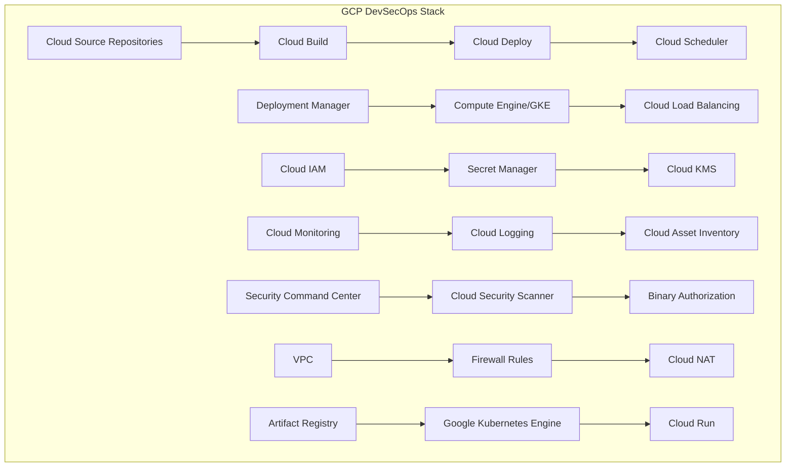

# Google Cloud Platform (GCP) DevSecOps Tools Integration

## ☁️ Overview
Google Cloud Platform (GCP) offers a comprehensive suite of tools and services for implementing DevSecOps practices, with strong emphasis on AI/ML capabilities, security, and cloud-native development. This section covers GCP-specific tools, services, and best practices for building secure, scalable, and automated development pipelines.

## 🏗️ GCP DevSecOps Architecture



## 📁 Directory Structure

```
gcp/
├── README.md
├── services/
│   ├── compute/
│   ├── storage/
│   ├── networking/
│   ├── security/
│   ├── monitoring/
│   └── ci-cd/
├── devsecops-tools/
│   ├── vulnerability-scanning/
│   ├── secrets-management/
│   ├── policy-enforcement/
│   └── compliance-tools/
├── architecture-diagrams/
│   ├── enterprise-architecture.md
│   ├── microservices-architecture.md
│   └── serverless-architecture.md
└── hands-on-labs/
    ├── beginner/
    ├── intermediate/
    └── advanced/
```

## 🛠️ GCP Core Services

### Compute Services
- **Compute Engine**: Virtual machines with custom configurations
- **Google Kubernetes Engine (GKE)**: Managed Kubernetes clusters
- **Cloud Run**: Serverless container platform
- **Cloud Functions**: Event-driven serverless functions
- **App Engine**: Platform-as-a-Service for web applications

### Storage Services
- **Cloud Storage**: Object storage with global edge caching
- **Persistent Disk**: Block storage for VMs
- **Cloud Filestore**: Managed NFS file systems
- **Cloud SQL**: Managed relational databases
- **Firestore**: NoSQL document database

### Networking Services
- **Virtual Private Cloud (VPC)**: Software-defined networking
- **Cloud Load Balancing**: Global load balancing
- **Cloud CDN**: Content delivery network
- **Cloud DNS**: Managed DNS service
- **Cloud NAT**: Network address translation

### Security Services
- **Cloud IAM**: Identity and access management
- **Secret Manager**: Secure secrets storage
- **Cloud KMS**: Key management service
- **Security Command Center**: Security and risk management
- **Cloud Security Scanner**: Web application security scanning
- **Binary Authorization**: Container image security
- **Cloud Armor**: DDoS protection and WAF

### Monitoring & Observability
- **Cloud Monitoring**: Metrics, logs, and alerting
- **Cloud Logging**: Centralized logging
- **Cloud Trace**: Distributed tracing
- **Cloud Profiler**: Application performance profiling
- **Cloud Debugger**: Live debugging
- **Error Reporting**: Error tracking and analysis

### CI/CD Services
- **Cloud Source Repositories**: Git-based source control
- **Cloud Build**: Build and test service
- **Cloud Deploy**: Continuous delivery platform
- **Cloud Scheduler**: Cron job scheduling
- **Cloud Tasks**: Asynchronous task execution

## 🔒 Security Best Practices

### Identity and Access Management
```yaml
# IAM Policy Example
bindings:
- members:
  - user:devsecops@example.com
  - serviceAccount:devsecops@project.iam.gserviceaccount.com
  role: roles/storage.objectViewer
- members:
  - group:devsecops-team@example.com
  role: roles/container.developer
- members:
  - user:admin@example.com
  role: roles/iam.organizationRoleAdmin
```

### Network Security
- **VPC Design**: Private Google Access and custom routes
- **Firewall Rules**: Hierarchical firewall policies
- **Cloud NAT**: Outbound internet access for private instances
- **VPC Flow Logs**: Network traffic monitoring
- **Private Google Access**: Access to Google APIs without external IP

### Data Protection
- **Encryption at Rest**: Customer-managed encryption keys (CMEK)
- **Encryption in Transit**: TLS/SSL for all communications
- **Key Management**: Cloud KMS for encryption keys
- **Secrets Management**: Secret Manager for sensitive data
- **Data Loss Prevention**: Sensitive data detection and protection

## 🚀 CI/CD Pipeline Implementation

### Cloud Build Configuration
```yaml
# cloudbuild.yaml
steps:
  # Build the container image
  - name: 'gcr.io/cloud-builders/docker'
    args: ['build', '-t', 'gcr.io/$PROJECT_ID/my-app:$COMMIT_SHA', '.']
  
  # Push the container image to Container Registry
  - name: 'gcr.io/cloud-builders/docker'
    args: ['push', 'gcr.io/$PROJECT_ID/my-app:$COMMIT_SHA']
  
  # Run security scan
  - name: 'gcr.io/cloud-builders/gcloud'
    entrypoint: 'bash'
    args:
      - '-c'
      - |
        gcloud container images scan gcr.io/$PROJECT_ID/my-app:$COMMIT_SHA \
          --remote --format=json > scan-results.json
  
  # Deploy to GKE
  - name: 'gcr.io/cloud-builders/gke-deploy'
    args:
      - '--image=gcr.io/$PROJECT_ID/my-app:$COMMIT_SHA'
      - '--location=us-central1'
      - '--cluster=devsecops-cluster'

# Store images in Google Container Registry
images:
  - 'gcr.io/$PROJECT_ID/my-app:$COMMIT_SHA'

# Build configuration
options:
  machineType: 'E2_HIGHCPU_8'
  diskSizeGb: 100
  logging: CLOUD_LOGGING_ONLY
```

### Infrastructure as Code with Deployment Manager
```yaml
# infrastructure.yaml
resources:
- name: devsecops-vpc
  type: compute.v1.network
  properties:
    autoCreateSubnetworks: false
    routingConfig:
      routingMode: REGIONAL

- name: devsecops-subnet
  type: compute.v1.subnetwork
  properties:
    network: $(ref.devsecops-vpc.selfLink)
    ipCidrRange: 10.0.0.0/24
    region: us-central1
    privateIpGoogleAccess: true

- name: devsecops-firewall
  type: compute.v1.firewall
  properties:
    network: $(ref.devsecops-vpc.selfLink)
    sourceRanges: ["0.0.0.0/0"]
    allowed:
    - IPProtocol: tcp
      ports: ["80", "443"]
    - IPProtocol: icmp
    targetTags: ["devsecops"]

- name: devsecops-cluster
  type: container.v1.cluster
  properties:
    zone: us-central1-a
    cluster:
      name: devsecops-cluster
      initialNodeCount: 3
      nodeConfig:
        machineType: e2-medium
        diskSizeGb: 100
        oauthScopes:
        - https://www.googleapis.com/auth/cloud-platform
        tags:
        - devsecops
      masterAuth:
        username: admin
        password: ${CLUSTER_PASSWORD}
```

## 🐳 Container Security

### GKE Security Configuration
```yaml
# gke-cluster.yaml
apiVersion: container.cnrm.cloud.google.com/v1beta1
kind: ContainerCluster
metadata:
  name: devsecops-cluster
  namespace: default
spec:
  location: us-central1
  initialNodeCount: 3
  networkRef:
    name: devsecops-vpc
  subnetworkRef:
    name: devsecops-subnet
  
  # Security configurations
  binaryAuthorization:
    evaluationMode: PROJECT_SINGLETON_POLICY_ENFORCE
  
  workloadIdentityConfig:
    workloadPool: PROJECT_ID.svc.id.goog
  
  nodeConfig:
    machineType: e2-medium
    diskSizeGb: 100
    diskType: pd-ssd
    imageType: COS_CONTAINERD
    oauthScopes:
    - https://www.googleapis.com/auth/cloud-platform
    
    # Security settings
    shieldedInstanceConfig:
      enableSecureBoot: true
      enableIntegrityMonitoring: true
      enableVtpm: true
    
    # Workload identity
    serviceAccountRef:
      name: devsecops-sa
  
  # Network policy
  networkPolicy:
    enabled: true
    provider: CALICO
  
  # Private cluster
  privateClusterConfig:
    enablePrivateNodes: true
    enablePrivateEndpoint: false
    masterIpv4CidrBlock: 172.16.0.0/28
```

### Container Image Security
```dockerfile
# Dockerfile with security best practices
FROM node:18-alpine AS builder

# Create non-root user
RUN addgroup -g 1001 -S nodejs
RUN adduser -S nextjs -u 1001

# Set working directory
WORKDIR /app

# Copy package files
COPY package*.json ./

# Install dependencies with security audit
RUN npm ci --only=production && \
    npm audit --audit-level=moderate

# Copy source code
COPY --chown=nextjs:nodejs . .

# Build application
RUN npm run build

# Production stage
FROM node:18-alpine AS runner
WORKDIR /app

# Install security updates
RUN apk update && apk upgrade

# Create non-root user
RUN addgroup -g 1001 -S nodejs
RUN adduser -S nextjs -u 1001

# Copy built application
COPY --from=builder --chown=nextjs:nodejs /app/dist ./dist
COPY --from=builder --chown=nextjs:nodejs /app/node_modules ./node_modules
COPY --from=builder --chown=nextjs:nodejs /app/package.json ./package.json

# Switch to non-root user
USER nextjs

# Expose port
EXPOSE 3000

# Health check
HEALTHCHECK --interval=30s --timeout=3s --start-period=5s --retries=3 \
  CMD wget --no-verbose --tries=1 --spider http://localhost:3000/health || exit 1

# Start application
CMD ["npm", "start"]
```

## 📊 Monitoring and Alerting

### Cloud Monitoring Dashboard
```json
{
  "displayName": "DevSecOps Dashboard",
  "mosaicLayout": {
    "tiles": [
      {
        "width": 6,
        "height": 4,
        "widget": {
          "title": "CPU Utilization",
          "xyChart": {
            "dataSets": [
              {
                "timeSeriesQuery": {
                  "timeSeriesFilter": {
                    "filter": "resource.type=\"gce_instance\"",
                    "aggregation": {
                      "alignmentPeriod": "300s",
                      "perSeriesAligner": "ALIGN_MEAN"
                    }
                  }
                }
              }
            ]
          }
        }
      }
    ]
  }
}
```

### Cloud Logging Configuration
```yaml
# logging-config.yaml
apiVersion: v1
kind: ConfigMap
metadata:
  name: fluent-bit-config
  namespace: kube-system
data:
  fluent-bit.conf: |
    [SERVICE]
        Flush         1
        Log_Level     info
        Daemon        off
        Parsers_File  parsers.conf
        HTTP_Server   On
        HTTP_Listen   0.0.0.0
        HTTP_Port     2020

    [INPUT]
        Name              tail
        Path              /var/log/containers/*.log
        Parser            docker
        Tag               kube.*
        Refresh_Interval  5
        Mem_Buf_Limit     5MB
        Skip_Long_Lines   On

    [OUTPUT]
        Name  stackdriver
        Match *
        resource  gke_cluster
        resource  gke_node
        resource  gke_pod
```

## 🔍 Security Scanning and Compliance

### Security Command Center Configuration
```yaml
# scc-config.yaml
apiVersion: securitycenter.cnrm.cloud.google.com/v1beta1
kind: SecurityCenterSource
metadata:
  name: devsecops-source
spec:
  displayName: "DevSecOps Security Source"
  description: "Security findings from DevSecOps tools"
  organizationRef:
    external: organizations/123456789012
  sourceId: devsecops-source-001
```

### Binary Authorization Policy
```yaml
# binary-authorization.yaml
apiVersion: binaryauthorization.cnrm.cloud.google.com/v1beta1
kind: BinaryAuthorizationPolicy
metadata:
  name: devsecops-policy
spec:
  projectRef:
    external: projects/PROJECT_ID
  admissionWhitelistPatterns:
  - namePattern: gcr.io/PROJECT_ID/trusted-images/*
  - namePattern: gcr.io/google-containers/*
  defaultAdmissionRule:
    evaluationMode: REQUIRE_ATTESTATION
    requireAttestationsBy:
    - projects/PROJECT_ID/attestors/devsecops-attestor
  clusterAdmissionRules:
    us-central1-f.devsecops-cluster:
      evaluationMode: REQUIRE_ATTESTATION
      requireAttestationsBy:
      - projects/PROJECT_ID/attestors/devsecops-attestor
```

## 🧪 Hands-On Labs

### Beginner Lab: Basic GCP Setup
```bash
# Lab 1: Setting up GCP CLI and basic services
# 1. Install Google Cloud CLI
curl https://sdk.cloud.google.com | bash
exec -l $SHELL

# 2. Initialize gcloud
gcloud init

# 3. Set default project
gcloud config set project PROJECT_ID

# 4. Create a basic Cloud Storage bucket
gsutil mb gs://my-devsecops-bucket

# 5. Upload a file
echo "Hello DevSecOps!" > hello.txt
gsutil cp hello.txt gs://my-devsecops-bucket/

# 6. List bucket contents
gsutil ls gs://my-devsecops-bucket/
```

### Intermediate Lab: CI/CD Pipeline
```bash
# Lab 2: Building a CI/CD pipeline
# 1. Create Cloud Source Repository
gcloud source repos create my-app

# 2. Clone the repository
gcloud source repos clone my-app
cd my-app

# 3. Create Cloud Build trigger
gcloud builds triggers create github \
  --repo-name=my-app \
  --repo-owner=my-username \
  --branch-pattern="^main$" \
  --build-config=cloudbuild.yaml

# 4. Create Cloud Deploy pipeline
gcloud deploy apply --file=clouddeploy.yaml --region=us-central1

# 5. Create deployment
gcloud deploy releases create release-001 \
  --delivery-pipeline=my-app-pipeline \
  --region=us-central1
```

### Advanced Lab: Multi-Project Security
```bash
# Lab 3: Implementing multi-project security
# 1. Create organization
gcloud organizations create --display-name="DevSecOps Org"

# 2. Create projects
gcloud projects create devsecops-dev --organization=ORGANIZATION_ID
gcloud projects create devsecops-prod --organization=ORGANIZATION_ID

# 3. Set up Security Command Center
gcloud scc sources create devsecops-source \
  --organization=ORGANIZATION_ID \
  --display-name="DevSecOps Security Source"

# 4. Configure cross-project access
gcloud projects add-iam-policy-binding devsecops-prod \
  --member="serviceAccount:devsecops@devsecops-dev.iam.gserviceaccount.com" \
  --role="roles/container.developer"

# 5. Set up centralized logging
gcloud logging sinks create devsecops-sink \
  bigquery.googleapis.com/projects/PROJECT_ID/datasets/security_logs \
  --log-filter='resource.type="gce_instance"'
```

## 📚 Learning Resources

### GCP Documentation
- [GCP DevSecOps Guide](https://cloud.google.com/architecture/devops)
- [GCP Security Best Practices](https://cloud.google.com/security/best-practices)
- [GCP Well-Architected Framework](https://cloud.google.com/architecture/framework)

### Training Resources
- [Google Cloud Training](https://cloud.google.com/training)
- [Google Cloud Next Sessions](https://cloud.withgoogle.com/next)
- [Google Cloud Community](https://cloud.google.com/community)

### Tools and Utilities
- [Google Cloud CLI](https://cloud.google.com/sdk)
- [Terraform GCP Provider](https://registry.terraform.io/providers/hashicorp/google/latest)
- [Pulumi GCP Provider](https://www.pulumi.com/registry/packages/gcp/)
- [Google Cloud CDK](https://cloud.google.com/cdk)

## 🎓 Certification Preparation

### Professional Cloud DevOps Engineer
- **Exam Guide**: [GCP DevOps Engineer Exam Guide](https://cloud.google.com/certification/cloud-devops-engineer)
- **Practice Tests**: Google Cloud Practice Tests
- **Hands-on Experience**: 3+ years of GCP experience recommended
- **Study Materials**: Google Cloud Training courses and documentation

### Professional Cloud Security Engineer
- **Exam Guide**: [GCP Security Engineer Exam Guide](https://cloud.google.com/certification/cloud-security-engineer)
- **Prerequisites**: Professional Cloud Architect or Associate level certification
- **Experience**: 3+ years of security experience
- **Study Focus**: GCP security services and best practices

## 📈 Success Metrics

### Technical Proficiency
- **GCP Services**: 90% proficiency in core services
- **Security Implementation**: 100% compliance with GCP security best practices
- **Automation**: 80% reduction in manual deployment tasks
- **Cost Optimization**: 30% reduction in GCP costs through optimization

### Career Readiness
- **Portfolio Projects**: 3+ GCP-based projects
- **Certification**: GCP DevOps Engineer or Security Engineer
- **Interview Readiness**: Technical interview preparation with GCP scenarios
- **Industry Knowledge**: Up-to-date with latest GCP services and features

## 🤝 Contributing

### How to Contribute
1. **Fork the repository**
2. **Create a feature branch**
3. **Add GCP-specific content or improvements**
4. **Submit a pull request**

### Contribution Areas
- **New GCP services** documentation
- **Updated architecture diagrams**
- **Additional hands-on labs**
- **Security best practices**

## 📞 Support

### Getting Help
- **GCP Support**: [Google Cloud Support](https://cloud.google.com/support)
- **GCP Forums**: [Google Cloud Community Forums](https://cloud.google.com/community)
- **Stack Overflow**: [Google Cloud Platform Tag](https://stackoverflow.com/questions/tagged/google-cloud-platform)
- **GitHub Issues**: Use GitHub issues for this project

### Community Resources
- **Slack**: #gcp-devsecops
- **Discord**: GCP Learning Community
- **LinkedIn**: GCP Professionals Group
- **YouTube**: GCP Tutorials Channel

---

**Ready to master GCP DevSecOps?** Start with the hands-on labs and work your way through the learning path!
