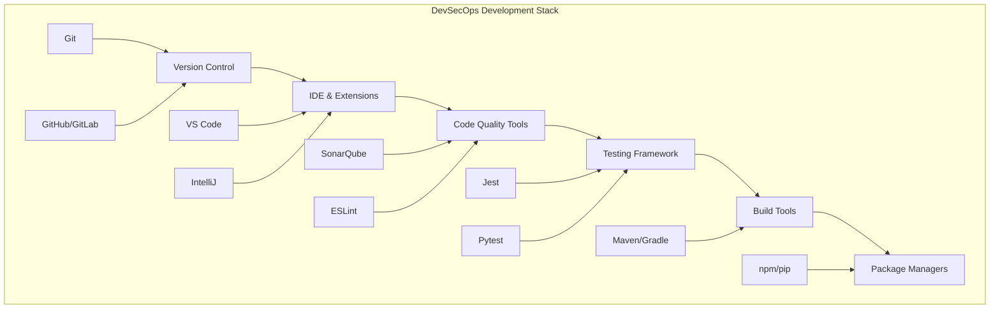

# Development Tools - DevSecOps Development Environment

## 🛠️ Overview
This section covers essential development tools and environments for DevSecOps practitioners. It includes version control systems, IDE extensions, and code quality tools that form the foundation of modern software development practices.

## 🏗️ Development Tools Architecture



## 📁 Directory Structure

```
02-development-tools/
├── README.md
├── version-control/
│   ├── README.md
│   ├── git-workflows/
│   ├── branching-strategies/
│   └── collaboration-tools/
├── ide-extensions/
│   ├── README.md
│   ├── vs-code/
│   ├── intellij/
│   └── eclipse/
└── code-quality/
    ├── README.md
    ├── static-analysis/
    ├── code-review/
    └── testing-tools/
```

## 🎯 Learning Objectives

### Version Control Mastery
- Understand Git fundamentals and advanced features
- Master branching strategies and workflows
- Learn collaborative development practices
- Implement code review processes

### IDE and Development Environment
- Configure development environments for efficiency
- Master essential IDE extensions and plugins
- Set up debugging and testing environments
- Optimize development workflows

### Code Quality and Testing
- Implement static code analysis
- Set up automated testing frameworks
- Master code review best practices
- Ensure code quality standards

## 🛠️ Tool Categories

### 1. Version Control Systems
- **Git**: Distributed version control system
- **GitHub**: Cloud-based Git repository hosting
- **GitLab**: Complete DevOps platform
- **Bitbucket**: Atlassian's Git repository hosting
- **Azure Repos**: Microsoft's version control service

### 2. Integrated Development Environments
- **Visual Studio Code**: Microsoft's lightweight editor
- **IntelliJ IDEA**: JetBrains' Java IDE
- **Eclipse**: Open-source IDE platform
- **PyCharm**: Python-specific IDE
- **WebStorm**: JavaScript/TypeScript IDE

### 3. Code Quality Tools
- **SonarQube**: Code quality and security analysis
- **ESLint**: JavaScript linting tool
- **Pylint**: Python code analysis
- **Checkmarx**: Static application security testing
- **CodeClimate**: Automated code review

## 🚀 Getting Started

### Prerequisites
- Basic understanding of software development
- Familiarity with command-line interfaces
- Access to development tools and platforms
- Understanding of programming languages

### Quick Setup
```bash
# Install Git
sudo apt-get update
sudo apt-get install git

# Configure Git
git config --global user.name "Your Name"
git config --global user.email "your.email@example.com"

# Install VS Code
wget -qO- https://packages.microsoft.com/keys/microsoft.asc | gpg --dearmor > packages.microsoft.gpg
sudo install -o root -g root -m 644 packages.microsoft.gpg /etc/apt/trusted.gpg.d/
sudo sh -c 'echo "deb [arch=amd64,arm64,armhf signed-by=/etc/apt/trusted.gpg.d/packages.microsoft.gpg] https://packages.microsoft.com/repos/code stable main" > /etc/apt/sources.list.d/vscode.list'
sudo apt update
sudo apt install code
```

## 📚 Learning Resources

### Documentation
- [Git Documentation](https://git-scm.com/doc)
- [VS Code Documentation](https://code.visualstudio.com/docs)
- [IntelliJ Documentation](https://www.jetbrains.com/help/)
- [SonarQube Documentation](https://docs.sonarqube.org/)

### Best Practices
- **Version Control**: Use meaningful commit messages
- **Branching**: Follow established branching strategies
- **Code Review**: Implement thorough code review processes
- **Testing**: Write comprehensive tests
- **Documentation**: Maintain clear documentation

### Community Resources
- [GitHub Community](https://github.community/)
- [VS Code Community](https://code.visualstudio.com/community)
- [Stack Overflow](https://stackoverflow.com/)
- [Dev.to](https://dev.to/)

## 🎓 Certification Preparation

### Development Certifications
- **GitHub Certified**: GitHub platform certification
- **JetBrains Certified**: IntelliJ platform certification
- **Microsoft Certified**: Azure Developer certification
- **AWS Certified**: Developer certification

### Study Materials
- **Official Documentation**: Tool-specific documentation
- **Practice Projects**: Hands-on development projects
- **Code Challenges**: Programming challenges and exercises
- **Community Forums**: Expert discussions and Q&A

## 🤝 Contributing

### How to Contribute
1. **Fork the repository**
2. **Create a feature branch**
3. **Add development tool content or improvements**
4. **Submit a pull request**

### Contribution Areas
- **New tool documentation**
- **Updated best practices**
- **Additional examples**
- **Improved workflows**

## 📞 Support

### Getting Help
- **Documentation**: Comprehensive guides in each tool folder
- **Issues**: GitHub issues for development problems
- **Discussions**: Community discussions for development questions
- **Mentorship**: Connect with development experts

### Community Resources
- **Slack**: #development-tools
- **Discord**: Development Learning Community
- **LinkedIn**: Development Professionals Group
- **YouTube**: Development Tutorials Channel

---

**Ready to master development tools?** Navigate to the specific tool category folder to begin your learning journey!
