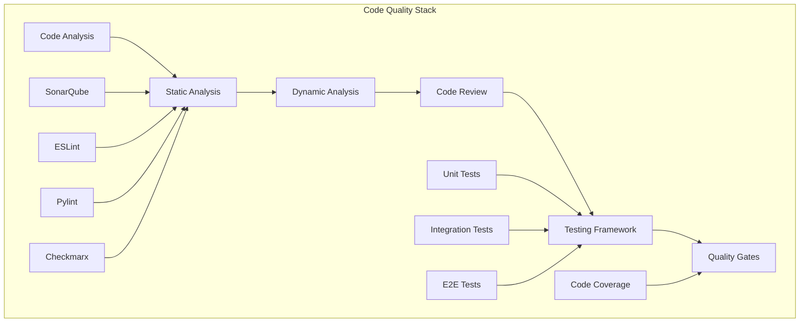

# Code Quality - Static Analysis and Testing Tools

## 🔍 Overview
This section covers comprehensive code quality tools and practices for DevSecOps. It includes static analysis tools, code review processes, testing frameworks, and automated quality assurance practices that ensure high-quality, maintainable code.

## 🏗️ Code Quality Architecture



## 📁 Directory Structure

```
code-quality/
├── README.md
├── static-analysis/
│   ├── sonarqube/
│   ├── eslint/
│   ├── pylint/
│   └── checkmarx/
├── code-review/
│   ├── processes/
│   ├── checklists/
│   └── tools/
└── testing-tools/
    ├── unit-testing/
    ├── integration-testing/
    └── e2e-testing/
```

## 🛠️ Code Quality Tools

### 1. Static Analysis Tools

#### SonarQube - Code Quality Platform
```yaml
# sonar-project.properties
sonar.projectKey=devsecops-app
sonar.projectName=DevSecOps Application
sonar.projectVersion=1.0
sonar.sources=src
sonar.tests=tests
sonar.coverage.jacoco.xmlReportPaths=coverage.xml
sonar.python.coverage.reportPaths=coverage.xml
sonar.javascript.lcov.reportPaths=lcov.info
sonar.exclusions=**/node_modules/**,**/venv/**,**/__pycache__/**
sonar.test.exclusions=**/tests/**,**/test_*.py
```

#### ESLint - JavaScript Linting
```json
// .eslintrc.json
{
  "env": {
    "browser": true,
    "es2021": true,
    "node": true
  },
  "extends": [
    "eslint:recommended",
    "@typescript-eslint/recommended",
    "prettier"
  ],
  "parser": "@typescript-eslint/parser",
  "parserOptions": {
    "ecmaVersion": "latest",
    "sourceType": "module"
  },
  "plugins": ["@typescript-eslint"],
  "rules": {
    "no-console": "warn",
    "no-unused-vars": "error",
    "prefer-const": "error",
    "no-var": "error",
    "eqeqeq": "error",
    "curly": "error"
  }
}
```

#### Pylint - Python Code Analysis
```ini
# .pylintrc
[MASTER]
init-hook='import sys; sys.path.append(".")'

[MESSAGES CONTROL]
disable=missing-docstring,too-few-public-methods

[FORMAT]
max-line-length=120
indent-string='  '

[DESIGN]
max-args=10
max-locals=20
max-branches=15
max-statements=60

[VARIABLES]
init-import=yes
dummy-variables-rgx=_+$|(_[a-zA-Z0-9_]*[a-zA-Z0-9]+?$)|dummy|^ignored_|^unused_

[IMPORTS]
import-graph=imports.dot
```

#### Checkmarx - Security Analysis
```yaml
# checkmarx-config.yml
project:
  name: "devsecops-app"
  team: "DevSecOps Team"
  preset: "DevSecOps"
  configuration: "Default"

scan:
  incremental: true
  force_scan: false
  comment: "Automated security scan"

filters:
  severity:
    - High
    - Medium
  status:
    - New
    - Confirmed
```

### 2. Code Review Tools

#### Code Review Checklist
```markdown
## Code Review Checklist

### Functionality
- [ ] Code works as expected
- [ ] Edge cases are handled
- [ ] Error handling is appropriate
- [ ] Performance is acceptable

### Code Quality
- [ ] Code follows style guidelines
- [ ] Functions are small and focused
- [ ] Variable names are descriptive
- [ ] Comments explain why, not what

### Security
- [ ] No hardcoded secrets
- [ ] Input validation is present
- [ ] SQL injection prevention
- [ ] XSS prevention

### Testing
- [ ] Unit tests are present
- [ ] Integration tests cover new features
- [ ] Test coverage is adequate
- [ ] Tests are meaningful and not flaky

### Documentation
- [ ] README is updated
- [ ] API documentation is current
- [ ] Code comments are helpful
- [ ] Changelog is updated
```

#### Pull Request Template
```markdown
## Description
Brief description of changes

## Type of Change
- [ ] Bug fix (non-breaking change which fixes an issue)
- [ ] New feature (non-breaking change which adds functionality)
- [ ] Breaking change (fix or feature that would cause existing functionality to not work as expected)
- [ ] Documentation update

## Testing
- [ ] Unit tests pass
- [ ] Integration tests pass
- [ ] Manual testing completed
- [ ] Performance testing completed

## Security
- [ ] Security scan passed
- [ ] No secrets in code
- [ ] Input validation implemented
- [ ] Authentication/authorization checked

## Checklist
- [ ] Code follows style guidelines
- [ ] Self-review completed
- [ ] Documentation updated
- [ ] No breaking changes
- [ ] Dependencies updated
```

### 3. Testing Frameworks

#### Jest - JavaScript Testing
```javascript
// jest.config.js
module.exports = {
  testEnvironment: 'node',
  collectCoverage: true,
  coverageDirectory: 'coverage',
  coverageReporters: ['text', 'lcov', 'html'],
  testMatch: ['**/__tests__/**/*.js', '**/?(*.)+(spec|test).js'],
  setupFilesAfterEnv: ['<rootDir>/jest.setup.js'],
  moduleNameMapping: {
    '^@/(.*)$': '<rootDir>/src/$1'
  }
};

// jest.setup.js
import '@testing-library/jest-dom';

// Example test
describe('UserService', () => {
  beforeEach(() => {
    // Setup
  });

  afterEach(() => {
    // Cleanup
  });

  test('should create user successfully', async () => {
    const userData = {
      name: 'John Doe',
      email: 'john@example.com'
    };

    const result = await UserService.createUser(userData);
    
    expect(result).toBeDefined();
    expect(result.name).toBe(userData.name);
    expect(result.email).toBe(userData.email);
  });

  test('should handle validation errors', async () => {
    const invalidData = {
      name: '',
      email: 'invalid-email'
    };

    await expect(UserService.createUser(invalidData))
      .rejects
      .toThrow('Validation failed');
  });
});
```

#### Pytest - Python Testing
```python
# pytest.ini
[tool:pytest]
testpaths = tests
python_files = test_*.py
python_classes = Test*
python_functions = test_*
addopts = 
    --verbose
    --tb=short
    --cov=src
    --cov-report=html
    --cov-report=term-missing
    --cov-fail-under=80

# conftest.py
import pytest
from app import create_app
from app.database import db

@pytest.fixture
def app():
    app = create_app(testing=True)
    with app.app_context():
        db.create_all()
        yield app
        db.drop_all()

@pytest.fixture
def client(app):
    return app.test_client()

# test_user_service.py
import pytest
from app.services.user_service import UserService

class TestUserService:
    def test_create_user_success(self, app):
        user_data = {
            'name': 'John Doe',
            'email': 'john@example.com'
        }
        
        result = UserService.create_user(user_data)
        
        assert result is not None
        assert result.name == user_data['name']
        assert result.email == user_data['email']

    def test_create_user_validation_error(self, app):
        invalid_data = {
            'name': '',
            'email': 'invalid-email'
        }
        
        with pytest.raises(ValueError, match='Validation failed'):
            UserService.create_user(invalid_data)
```

#### Cypress - End-to-End Testing
```javascript
// cypress.config.js
const { defineConfig } = require('cypress');

module.exports = defineConfig({
  e2e: {
    baseUrl: 'http://localhost:3000',
    viewportWidth: 1280,
    viewportHeight: 720,
    video: true,
    screenshotOnRunFailure: true,
    supportFile: 'cypress/support/e2e.js',
    specPattern: 'cypress/e2e/**/*.cy.js'
  }
});

// cypress/e2e/user-management.cy.js
describe('User Management', () => {
  beforeEach(() => {
    cy.visit('/users');
  });

  it('should create a new user', () => {
    cy.get('[data-testid="add-user-button"]').click();
    cy.get('[data-testid="user-name-input"]').type('John Doe');
    cy.get('[data-testid="user-email-input"]').type('john@example.com');
    cy.get('[data-testid="save-user-button"]').click();
    
    cy.get('[data-testid="user-list"]').should('contain', 'John Doe');
    cy.get('[data-testid="success-message"]').should('be.visible');
  });

  it('should validate required fields', () => {
    cy.get('[data-testid="add-user-button"]').click();
    cy.get('[data-testid="save-user-button"]').click();
    
    cy.get('[data-testid="validation-error"]').should('be.visible');
    cy.get('[data-testid="validation-error"]').should('contain', 'Name is required');
  });
});
```

## 🔧 Quality Gates

### SonarQube Quality Gates
```json
{
  "name": "DevSecOps Quality Gate",
  "conditions": [
    {
      "metric": "coverage",
      "op": "LT",
      "error": "80"
    },
    {
      "metric": "duplicated_lines_density",
      "op": "GT",
      "error": "3"
    },
    {
      "metric": "security_rating",
      "op": "GT",
      "error": "1"
    },
    {
      "metric": "reliability_rating",
      "op": "GT",
      "error": "1"
    },
    {
      "metric": "maintainability_rating",
      "op": "GT",
      "error": "1"
    }
  ]
}
```

### GitHub Actions Quality Check
```yaml
# .github/workflows/quality-check.yml
name: Quality Check

on:
  push:
    branches: [ main, develop ]
  pull_request:
    branches: [ main ]

jobs:
  quality-check:
    runs-on: ubuntu-latest
    
    steps:
    - uses: actions/checkout@v3
      with:
        fetch-depth: 0
    
    - name: Setup Node.js
      uses: actions/setup-node@v3
      with:
        node-version: '18'
        cache: 'npm'
    
    - name: Install dependencies
      run: npm ci
    
    - name: Run ESLint
      run: npm run lint
    
    - name: Run Prettier
      run: npm run format:check
    
    - name: Run unit tests
      run: npm run test:unit
      env:
        CI: true
    
    - name: Run integration tests
      run: npm run test:integration
    
    - name: Generate coverage report
      run: npm run test:coverage
    
    - name: Upload coverage to Codecov
      uses: codecov/codecov-action@v3
      with:
        file: ./coverage/lcov.info
    
    - name: SonarQube Scan
      uses: SonarSource/sonarqube-scan-action@master
      env:
        GITHUB_TOKEN: ${{ secrets.GITHUB_TOKEN }}
        SONAR_TOKEN: ${{ secrets.SONAR_TOKEN }}
        SONAR_HOST_URL: ${{ secrets.SONAR_HOST_URL }}
```

## 🧪 Hands-On Labs

### Lab 1: SonarQube Setup
```bash
# Lab 1: Setting up SonarQube for code quality
# 1. Install Docker
sudo apt update
sudo apt install docker.io
sudo systemctl start docker
sudo systemctl enable docker

# 2. Run SonarQube with Docker
docker run -d --name sonarqube \
  -p 9000:9000 \
  -e SONAR_ES_BOOTSTRAP_CHECKS_DISABLE=true \
  sonarqube:latest

# 3. Wait for SonarQube to start
sleep 60

# 4. Access SonarQube
echo "SonarQube is available at http://localhost:9000"
echo "Default credentials: admin/admin"

# 5. Create a project
# Go to http://localhost:9000
# Login with admin/admin
# Create a new project
# Generate a token
```

### Lab 2: ESLint Configuration
```bash
# Lab 2: Setting up ESLint for JavaScript projects
# 1. Initialize npm project
npm init -y

# 2. Install ESLint
npm install --save-dev eslint @typescript-eslint/parser @typescript-eslint/eslint-plugin

# 3. Initialize ESLint
npx eslint --init

# 4. Create .eslintrc.json
cat > .eslintrc.json << 'EOF'
{
  "env": {
    "browser": true,
    "es2021": true,
    "node": true
  },
  "extends": [
    "eslint:recommended",
    "@typescript-eslint/recommended"
  ],
  "parser": "@typescript-eslint/parser",
  "parserOptions": {
    "ecmaVersion": "latest",
    "sourceType": "module"
  },
  "plugins": ["@typescript-eslint"],
  "rules": {
    "no-console": "warn",
    "no-unused-vars": "error"
  }
}
EOF

# 5. Add scripts to package.json
npm pkg set scripts.lint="eslint ."
npm pkg set scripts.lint:fix="eslint . --fix"

# 6. Run ESLint
npm run lint
```

### Lab 3: Jest Testing Setup
```bash
# Lab 3: Setting up Jest for testing
# 1. Install Jest
npm install --save-dev jest @types/jest

# 2. Create jest.config.js
cat > jest.config.js << 'EOF'
module.exports = {
  testEnvironment: 'node',
  collectCoverage: true,
  coverageDirectory: 'coverage',
  testMatch: ['**/__tests__/**/*.js', '**/?(*.)+(spec|test).js']
};
EOF

# 3. Create test file
mkdir -p __tests__
cat > __tests__/math.test.js << 'EOF'
const { add, subtract } = require('../src/math');

describe('Math functions', () => {
  test('adds 1 + 2 to equal 3', () => {
    expect(add(1, 2)).toBe(3);
  });

  test('subtracts 2 from 5 to equal 3', () => {
    expect(subtract(5, 2)).toBe(3);
  });
});
EOF

# 4. Create source file
mkdir -p src
cat > src/math.js << 'EOF'
function add(a, b) {
  return a + b;
}

function subtract(a, b) {
  return a - b;
}

module.exports = { add, subtract };
EOF

# 5. Add test script
npm pkg set scripts.test="jest"

# 6. Run tests
npm test
```

## 📊 Quality Metrics

### Code Coverage Metrics
- **Line Coverage**: Percentage of lines executed
- **Branch Coverage**: Percentage of branches executed
- **Function Coverage**: Percentage of functions called
- **Statement Coverage**: Percentage of statements executed

### Code Quality Metrics
- **Cyclomatic Complexity**: Measure of code complexity
- **Technical Debt**: Time to fix all issues
- **Code Duplication**: Percentage of duplicated code
- **Maintainability Rating**: A-E rating of maintainability

### Security Metrics
- **Security Rating**: A-E rating of security
- **Vulnerabilities**: Number of security issues
- **Security Hotspots**: Areas requiring security review
- **OWASP Top 10**: Coverage of OWASP vulnerabilities

## 📚 Learning Resources

### Documentation
- [SonarQube Documentation](https://docs.sonarqube.org/)
- [ESLint Documentation](https://eslint.org/docs/)
- [Jest Documentation](https://jestjs.io/docs/)
- [Pytest Documentation](https://docs.pytest.org/)

### Best Practices
- **Automated Testing**: Implement comprehensive test coverage
- **Code Review**: Establish thorough review processes
- **Quality Gates**: Set up automated quality checks
- **Continuous Monitoring**: Monitor quality metrics continuously
- **Team Training**: Train team on quality practices

### Community Resources
- [SonarQube Community](https://community.sonarsource.com/)
- [Jest Community](https://github.com/facebook/jest)
- [ESLint Community](https://eslint.org/community/)
- [Testing Library Community](https://testing-library.com/)

## 🎓 Certification Preparation

### Code Quality Certifications
- **SonarQube Certified**: Code quality platform certification
- **Jest Testing**: JavaScript testing certification
- **Pytest Testing**: Python testing certification
- **Quality Assurance**: General QA certification

### Study Materials
- **Official Documentation**: Tool-specific documentation
- **Practice Projects**: Hands-on quality assurance projects
- **Testing Challenges**: Code quality challenges
- **Community Forums**: Expert discussions and Q&A

## 🤝 Contributing

### How to Contribute
1. **Fork the repository**
2. **Create a feature branch**
3. **Add code quality content or improvements**
4. **Submit a pull request**

### Contribution Areas
- **New quality tools**
- **Updated best practices**
- **Additional testing examples**
- **Improved documentation**

## 📞 Support

### Getting Help
- **Documentation**: Comprehensive guides in each tool folder
- **Issues**: GitHub issues for code quality problems
- **Discussions**: Community discussions for quality questions
- **Mentorship**: Connect with quality assurance experts

### Community Resources
- **Slack**: #code-quality
- **Discord**: Quality Assurance Learning Community
- **LinkedIn**: QA Professionals Group
- **YouTube**: Code Quality Tutorials Channel

---

**Ready to ensure code quality?** Start with static analysis tools and work your way up to comprehensive testing frameworks!
