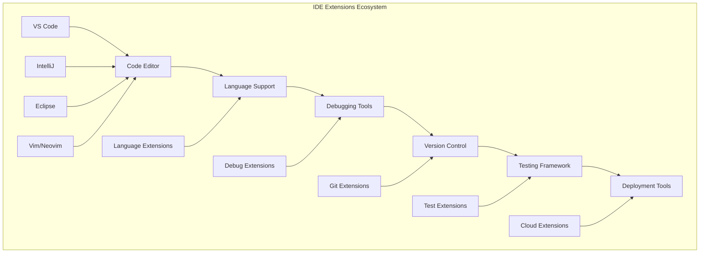

# IDE Extensions - Development Environment Optimization

## 💻 Overview
This section covers essential IDE extensions and configurations for DevSecOps development environments. It includes Visual Studio Code, IntelliJ IDEA, Eclipse, and other popular IDEs with their extensions, settings, and best practices.

## 🏗️ IDE Extensions Architecture



## 📁 Directory Structure

```
ide-extensions/
├── README.md
├── vs-code/
│   ├── README.md
│   ├── extensions/
│   ├── settings/
│   └── snippets/
├── intellij/
│   ├── README.md
│   ├── plugins/
│   ├── settings/
│   └── templates/
├── eclipse/
│   ├── README.md
│   ├── plugins/
│   ├── preferences/
│   └── workspaces/
└── vim/
    ├── README.md
    ├── configurations/
    ├── plugins/
    └── themes/
```

## 🛠️ IDE Categories

### 1. Visual Studio Code - Microsoft's Lightweight Editor

#### Key Features
- **Lightweight**: Fast and responsive
- **Extensible**: Rich extension ecosystem
- **Integrated Terminal**: Built-in terminal support
- **Debugging**: Advanced debugging capabilities
- **Git Integration**: Built-in Git support

#### Essential VS Code Extensions

##### Development Extensions
```json
{
  "recommendations": [
    "ms-python.python",
    "ms-vscode.vscode-typescript-next",
    "ms-vscode.vscode-json",
    "redhat.vscode-yaml",
    "ms-vscode.vscode-docker",
    "ms-kubernetes-tools.vscode-kubernetes-tools",
    "hashicorp.terraform",
    "ms-azuretools.vscode-azurecli"
  ]
}
```

##### DevSecOps Extensions
```json
{
  "recommendations": [
    "aquasecurity.trivy-vulnerability-scanner",
    "sonarsource.sonarqube",
    "ms-vscode.vscode-ansible",
    "redhat.vscode-xml",
    "ms-vscode.powershell",
    "ms-vscode.vscode-azurefunctions",
    "ms-azuretools.vscode-azureresourcegroups"
  ]
}
```

##### Productivity Extensions
```json
{
  "recommendations": [
    "esbenp.prettier-vscode",
    "ms-vscode.vscode-eslint",
    "bradlc.vscode-tailwindcss",
    "formulahendry.auto-rename-tag",
    "christian-kohler.path-intellisense",
    "ms-vscode.vscode-github-issue-notebooks",
    "github.copilot",
    "github.copilot-chat"
  ]
}
```

#### VS Code Settings Configuration
```json
{
  "editor.formatOnSave": true,
  "editor.codeActionsOnSave": {
    "source.fixAll.eslint": true,
    "source.organizeImports": true
  },
  "editor.tabSize": 2,
  "editor.insertSpaces": true,
  "editor.rulers": [80, 120],
  "files.trimTrailingWhitespace": true,
  "files.insertFinalNewline": true,
  "files.trimFinalNewlines": true,
  "git.enableSmartCommit": true,
  "git.confirmSync": false,
  "terminal.integrated.defaultProfile.linux": "bash",
  "workbench.colorTheme": "Dark+ (default dark)",
  "workbench.iconTheme": "vs-seti",
  "explorer.confirmDelete": false,
  "explorer.confirmDragAndDrop": false
}
```

#### VS Code Keybindings
```json
{
  "key": "ctrl+shift+p",
  "command": "workbench.action.showCommands"
},
{
  "key": "ctrl+`",
  "command": "workbench.action.terminal.toggleTerminal"
},
{
  "key": "ctrl+shift+`",
  "command": "workbench.action.terminal.new"
},
{
  "key": "ctrl+shift+f",
  "command": "workbench.action.findInFiles"
},
{
  "key": "ctrl+shift+h",
  "command": "workbench.action.replaceInFiles"
},
{
  "key": "ctrl+k ctrl+s",
  "command": "workbench.action.openGlobalKeybindings"
}
```

### 2. IntelliJ IDEA - JetBrains' Java IDE

#### Key Features
- **Smart Code Completion**: AI-powered code suggestions
- **Refactoring**: Advanced refactoring tools
- **Debugging**: Powerful debugging capabilities
- **Version Control**: Integrated Git support
- **Plugin Ecosystem**: Extensive plugin library

#### Essential IntelliJ Plugins

##### Core Development Plugins
```xml
<!-- plugins.xml -->
<plugins>
  <plugin id="com.intellij.modules.java" />
  <plugin id="org.jetbrains.kotlin" />
  <plugin id="org.jetbrains.plugins.gradle" />
  <plugin id="org.jetbrains.plugins.maven" />
  <plugin id="com.intellij.modules.spring" />
  <plugin id="com.intellij.modules.spring.boot" />
</plugins>
```

##### DevSecOps Plugins
```xml
<plugins>
  <plugin id="com.intellij.modules.docker" />
  <plugin id="org.jetbrains.plugins.kubernetes" />
  <plugin id="com.intellij.modules.terraform" />
  <plugin id="com.intellij.modules.ansible" />
  <plugin id="com.intellij.modules.yaml" />
  <plugin id="com.intellij.modules.json" />
</plugins>
```

##### Productivity Plugins
```xml
<plugins>
  <plugin id="com.intellij.modules.git" />
  <plugin id="com.intellij.modules.github" />
  <plugin id="com.intellij.modules.database" />
  <plugin id="com.intellij.modules.rest" />
  <plugin id="com.intellij.modules.markdown" />
  <plugin id="com.intellij.modules.terminal" />
</plugins>
```

#### IntelliJ Settings Configuration
```xml
<!-- settings.xml -->
<settings>
  <component name="CodeStyleSettings">
    <option name="RIGHT_MARGIN" value="120" />
    <option name="WRAP_WHEN_TYPING_REACHES_RIGHT_MARGIN" value="true" />
  </component>
  <component name="EditorGeneralSettings">
    <option name="IS_WHITESPACES_SHOWN" value="true" />
    <option name="IS_INDENT_GUIDES_SHOWN" value="true" />
    <option name="IS_CARET_ROW_TOGGLED_ON" value="true" />
  </component>
  <component name="GitSettings">
    <option name="UPDATE_TYPE" value="REBASE" />
  </component>
</settings>
```

### 3. Eclipse - Open Source IDE Platform

#### Key Features
- **Plugin Architecture**: Highly extensible
- **Multiple Languages**: Support for many programming languages
- **Debugging**: Comprehensive debugging tools
- **Team Development**: Built-in team features
- **Free and Open Source**: No licensing costs

#### Essential Eclipse Plugins

##### Core Development Plugins
```xml
<!-- .project -->
<projectDescription>
  <name>DevSecOpsProject</name>
  <buildSpec>
    <buildCommand>
      <name>org.eclipse.jdt.core.javabuilder</name>
    </buildCommand>
    <buildCommand>
      <name>org.eclipse.m2e.core.maven2Builder</name>
    </buildCommand>
  </buildSpec>
  <natures>
    <nature>org.eclipse.jdt.core.javanature</nature>
    <nature>org.eclipse.m2e.core.maven2Nature</nature>
  </natures>
</projectDescription>
```

##### DevSecOps Plugins
- **Docker Tooling**: Container development support
- **Kubernetes Tools**: Kubernetes development
- **Terraform Editor**: Infrastructure as code
- **YAML Editor**: YAML file support
- **Git Integration**: Version control support

### 4. Vim/Neovim - Terminal-Based Editor

#### Key Features
- **Terminal Based**: Works in any terminal
- **Highly Configurable**: Extensive customization
- **Plugin System**: Rich plugin ecosystem
- **Modal Editing**: Efficient editing modes
- **Lightweight**: Minimal resource usage

#### Vim Configuration
```vim
" .vimrc
" Basic Settings
set number
set relativenumber
set tabstop=2
set shiftwidth=2
set expandtab
set autoindent
set smartindent
set hlsearch
set incsearch
set ignorecase
set smartcase
set wrap
set linebreak
set showmatch
set wildmenu
set wildmode=longest:list,full

" Plugin Management (Vim-Plug)
call plug#begin('~/.vim/plugged')
Plug 'tpope/vim-sensible'
Plug 'tpope/vim-fugitive'
Plug 'tpope/vim-surround'
Plug 'tpope/vim-commentary'
Plug 'vim-airline/vim-airline'
Plug 'vim-airline/vim-airline-themes'
Plug 'scrooloose/nerdtree'
Plug 'ctrlpvim/ctrlp.vim'
Plug 'junegunn/fzf'
Plug 'junegunn/fzf.vim'
Plug 'neoclide/coc.nvim'
Plug 'preservim/tagbar'
Plug 'airblade/vim-gitgutter'
Plug 'tpope/vim-eunuch'
Plug 'mhinz/vim-startify'
call plug#end()

" Key Mappings
let mapleader = " "
nnoremap <leader>w :w<CR>
nnoremap <leader>q :q<CR>
nnoremap <leader>wq :wq<CR>
nnoremap <leader>n :NERDTreeToggle<CR>
nnoremap <leader>f :Files<CR>
nnoremap <leader>g :Rg<CR>
nnoremap <leader>b :Buffers<CR>
nnoremap <leader>t :TagbarToggle<CR>
```

## 🔧 IDE Configuration Best Practices

### 1. Consistent Settings Across Team
```json
// .vscode/settings.json
{
  "editor.formatOnSave": true,
  "editor.codeActionsOnSave": {
    "source.fixAll.eslint": true
  },
  "editor.tabSize": 2,
  "editor.insertSpaces": true,
  "files.trimTrailingWhitespace": true,
  "files.insertFinalNewline": true
}
```

### 2. Shared Extensions
```json
// .vscode/extensions.json
{
  "recommendations": [
    "ms-python.python",
    "ms-vscode.vscode-typescript-next",
    "esbenp.prettier-vscode",
    "ms-vscode.vscode-eslint",
    "ms-vscode.vscode-docker"
  ]
}
```

### 3. Workspace Configuration
```json
// .vscode/launch.json
{
  "version": "0.2.0",
  "configurations": [
    {
      "name": "Debug Node.js",
      "type": "node",
      "request": "launch",
      "program": "${workspaceFolder}/src/index.js",
      "console": "integratedTerminal"
    },
    {
      "name": "Debug Python",
      "type": "python",
      "request": "launch",
      "program": "${workspaceFolder}/src/main.py",
      "console": "integratedTerminal"
    }
  ]
}
```

## 🧪 Hands-On Labs

### Lab 1: VS Code Setup
```bash
# Lab 1: Setting up VS Code for DevSecOps
# 1. Install VS Code
wget -qO- https://packages.microsoft.com/keys/microsoft.asc | gpg --dearmor > packages.microsoft.gpg
sudo install -o root -g root -m 644 packages.microsoft.gpg /etc/apt/trusted.gpg.d/
sudo sh -c 'echo "deb [arch=amd64,arm64,armhf signed-by=/etc/apt/trusted.gpg.d/packages.microsoft.gpg] https://packages.microsoft.com/repos/code stable main" > /etc/apt/sources.list.d/vscode.list'
sudo apt update
sudo apt install code

# 2. Install essential extensions
code --install-extension ms-python.python
code --install-extension ms-vscode.vscode-typescript-next
code --install-extension ms-vscode.vscode-docker
code --install-extension ms-kubernetes-tools.vscode-kubernetes-tools
code --install-extension hashicorp.terraform
code --install-extension esbenp.prettier-vscode
code --install-extension ms-vscode.vscode-eslint

# 3. Configure settings
mkdir -p .vscode
cat > .vscode/settings.json << 'EOF'
{
  "editor.formatOnSave": true,
  "editor.codeActionsOnSave": {
    "source.fixAll.eslint": true
  },
  "editor.tabSize": 2,
  "files.trimTrailingWhitespace": true
}
EOF
```

### Lab 2: IntelliJ Setup
```bash
# Lab 2: Setting up IntelliJ for DevSecOps
# 1. Download IntelliJ IDEA
wget https://download.jetbrains.com/idea/ideaIC-2023.2.tar.gz
tar -xzf ideaIC-2023.2.tar.gz
sudo mv idea-IC-232.8660.185 /opt/idea

# 2. Create desktop shortcut
cat > ~/.local/share/applications/idea.desktop << 'EOF'
[Desktop Entry]
Version=1.0
Type=Application
Name=IntelliJ IDEA
Icon=/opt/idea/bin/idea.png
Exec=/opt/idea/bin/idea.sh
Comment=IntelliJ IDEA
Categories=Development;IDE;
Terminal=false
StartupNotify=true
EOF

# 3. Install essential plugins
# Open IntelliJ and install:
# - Docker
# - Kubernetes
# - Terraform
# - YAML
# - Git
```

### Lab 3: Vim Configuration
```bash
# Lab 3: Setting up Vim for DevSecOps
# 1. Install Vim
sudo apt update
sudo apt install vim

# 2. Install Vim-Plug
curl -fLo ~/.vim/autoload/plug.vim --create-dirs \
    https://raw.githubusercontent.com/junegunn/vim-plug/master/plug.vim

# 3. Create .vimrc
cat > ~/.vimrc << 'EOF'
" Basic Settings
set number
set relativenumber
set tabstop=2
set shiftwidth=2
set expandtab
set autoindent
set hlsearch
set incsearch

" Plugin Management
call plug#begin('~/.vim/plugged')
Plug 'tpope/vim-sensible'
Plug 'tpope/vim-fugitive'
Plug 'vim-airline/vim-airline'
Plug 'scrooloose/nerdtree'
Plug 'ctrlpvim/ctrlp.vim'
Plug 'neoclide/coc.nvim'
call plug#end()

" Key Mappings
let mapleader = " "
nnoremap <leader>w :w<CR>
nnoremap <leader>q :q<CR>
nnoremap <leader>n :NERDTreeToggle<CR>
EOF

# 4. Install plugins
vim +PlugInstall +qall
```

## 📚 Learning Resources

### Documentation
- [VS Code Documentation](https://code.visualstudio.com/docs)
- [IntelliJ Documentation](https://www.jetbrains.com/help/)
- [Eclipse Documentation](https://help.eclipse.org/)
- [Vim Documentation](https://vimdoc.sourceforge.net/)

### Best Practices
- **Consistent Configuration**: Use shared settings across team
- **Extension Management**: Keep extensions organized and updated
- **Keyboard Shortcuts**: Learn and use keyboard shortcuts efficiently
- **Plugin Selection**: Choose plugins carefully for performance
- **Backup Settings**: Backup and version control IDE settings

### Community Resources
- [VS Code Community](https://code.visualstudio.com/community)
- [IntelliJ Community](https://intellij-support.jetbrains.com/)
- [Eclipse Community](https://www.eclipse.org/community/)
- [Vim Community](https://www.vim.org/community.php)

## 🎓 Certification Preparation

### IDE Certifications
- **Microsoft Certified**: Azure Developer certification
- **JetBrains Certified**: IntelliJ platform certification
- **Eclipse Foundation**: Eclipse platform certification
- **Vim Certification**: Vim editor certification

### Study Materials
- **Official Documentation**: IDE-specific documentation
- **Practice Projects**: Hands-on development projects
- **Extension Development**: Learn to create custom extensions
- **Community Forums**: Expert discussions and Q&A

## 🤝 Contributing

### How to Contribute
1. **Fork the repository**
2. **Create a feature branch**
3. **Add IDE extension content or improvements**
4. **Submit a pull request**

### Contribution Areas
- **New extension recommendations**
- **Updated configurations**
- **Additional best practices**
- **Improved documentation**

## 📞 Support

### Getting Help
- **Documentation**: Comprehensive guides in each IDE folder
- **Issues**: GitHub issues for IDE problems
- **Discussions**: Community discussions for IDE questions
- **Mentorship**: Connect with IDE experts

### Community Resources
- **Slack**: #ide-extensions
- **Discord**: IDE Learning Community
- **LinkedIn**: IDE Professionals Group
- **YouTube**: IDE Tutorials Channel

---

**Ready to optimize your development environment?** Start with your preferred IDE and work your way through the extensions and configurations!
