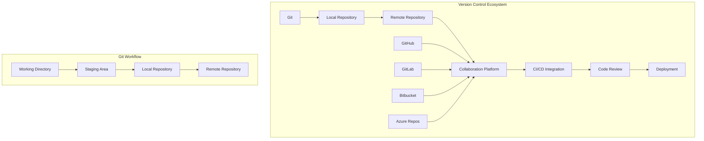
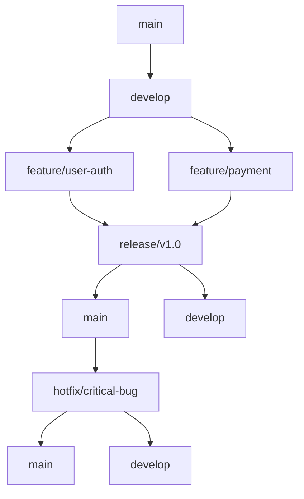
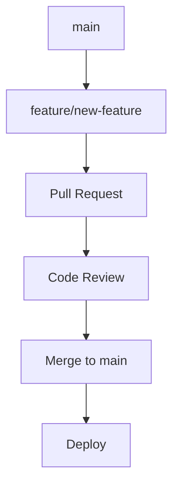
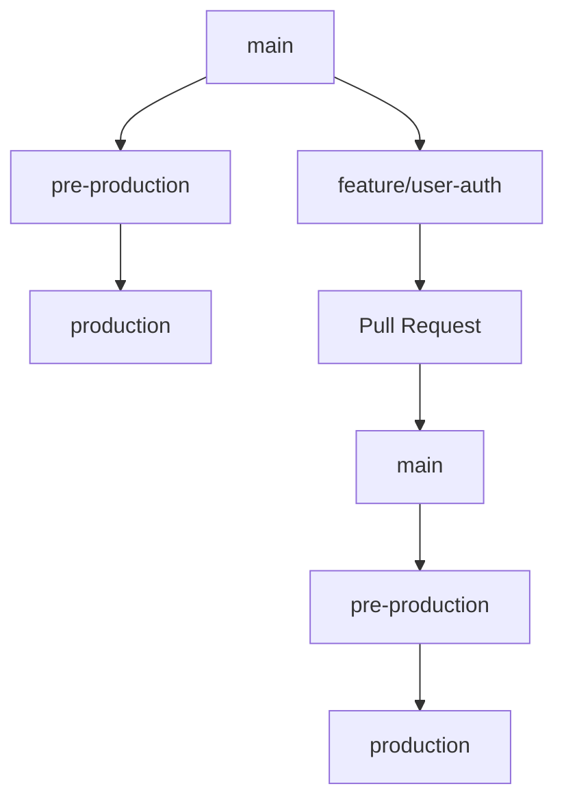

# Version Control - Git and Collaboration Tools

## 🔄 Overview
This section covers comprehensive version control practices and tools essential for DevSecOps. It includes Git fundamentals, branching strategies, collaboration workflows, and integration with modern development platforms.

## 🏗️ Version Control Architecture



## 📁 Directory Structure

```
version-control/
├── README.md
├── git-workflows/
│   ├── gitflow.md
│   ├── github-flow.md
│   ├── gitlab-flow.md
│   └── trunk-based-development.md
├── branching-strategies/
│   ├── feature-branches.md
│   ├── release-branches.md
│   ├── hotfix-branches.md
│   └── environment-branches.md
└── collaboration-tools/
    ├── code-review.md
    ├── pull-requests.md
    ├── merge-strategies.md
    └── conflict-resolution.md
```

## 🛠️ Version Control Tools

### 1. Git - Distributed Version Control

#### Key Features
- **Distributed**: Every developer has a complete copy
- **Branching**: Lightweight branching and merging
- **Staging**: Selective staging of changes
- **History**: Complete project history tracking
- **Performance**: Fast and efficient operations

#### Essential Git Commands
```bash
# Basic Git Operations
git init                    # Initialize repository
git clone <url>            # Clone remote repository
git add <file>             # Stage changes
git commit -m "message"    # Commit changes
git push origin main       # Push to remote
git pull origin main       # Pull from remote

# Branching Operations
git branch                 # List branches
git branch <name>          # Create branch
git checkout <branch>      # Switch branch
git merge <branch>         # Merge branch
git rebase <branch>        # Rebase branch

# History and Logging
git log                    # View commit history
git log --oneline          # Compact log view
git log --graph            # Graph view
git show <commit>          # Show commit details

# Undoing Changes
git reset --soft HEAD~1    # Undo last commit
git reset --hard HEAD~1    # Undo last commit and changes
git revert <commit>        # Create revert commit
git checkout -- <file>     # Discard file changes
```

#### Git Configuration
```bash
# Global Configuration
git config --global user.name "Your Name"
git config --global user.email "your.email@example.com"
git config --global init.defaultBranch main
git config --global core.editor "code --wait"

# Repository Configuration
git config user.name "Project Name"
git config user.email "project@example.com"
git config core.autocrlf input
git config pull.rebase false

# Useful Aliases
git config --global alias.st status
git config --global alias.co checkout
git config --global alias.br branch
git config --global alias.ci commit
git config --global alias.unstage 'reset HEAD --'
git config --global alias.last 'log -1 HEAD'
git config --global alias.visual '!gitk'
```

### 2. GitHub - Cloud-Based Git Hosting

#### Key Features
- **Repository Hosting**: Free public and private repositories
- **Collaboration**: Pull requests and code review
- **Actions**: Built-in CI/CD platform
- **Issues**: Project management and bug tracking
- **Pages**: Static website hosting

#### GitHub Workflow
```yaml
# .github/workflows/ci.yml
name: CI Pipeline
on:
  push:
    branches: [ main, develop ]
  pull_request:
    branches: [ main ]

jobs:
  test:
    runs-on: ubuntu-latest
    steps:
    - uses: actions/checkout@v3
    - name: Setup Node.js
      uses: actions/setup-node@v3
      with:
        node-version: '18'
    - name: Install dependencies
      run: npm ci
    - name: Run tests
      run: npm test
    - name: Run linting
      run: npm run lint
```

#### GitHub Best Practices
- **Branch Protection**: Protect main branch with required reviews
- **Commit Messages**: Use conventional commit format
- **Pull Requests**: Use descriptive titles and descriptions
- **Issues**: Use issue templates and labels
- **Security**: Enable security alerts and dependency scanning

### 3. GitLab - Complete DevOps Platform

#### Key Features
- **Git Repository**: Full Git functionality
- **CI/CD**: Built-in continuous integration
- **Container Registry**: Docker image storage
- **Issue Tracking**: Project management
- **Wiki**: Documentation hosting

#### GitLab CI Configuration
```yaml
# .gitlab-ci.yml
stages:
  - build
  - test
  - deploy

variables:
  DOCKER_DRIVER: overlay2
  DOCKER_TLS_CERTDIR: "/certs"

build:
  stage: build
  image: docker:latest
  services:
    - docker:dind
  script:
    - docker build -t $CI_REGISTRY_IMAGE:$CI_COMMIT_SHA .
    - docker push $CI_REGISTRY_IMAGE:$CI_COMMIT_SHA
  only:
    - main
    - develop

test:
  stage: test
  image: node:18
  script:
    - npm install
    - npm run test
    - npm run lint
  coverage: '/Lines\s*:\s*(\d+\.\d+)%/'

deploy:
  stage: deploy
  image: alpine:latest
  script:
    - echo "Deploying to production"
  only:
    - main
  when: manual
```

### 4. Bitbucket - Atlassian's Git Solution

#### Key Features
- **Git Repository**: Full Git functionality
- **Jira Integration**: Seamless project management
- **Confluence**: Documentation platform
- **Pipelines**: Built-in CI/CD
- **Code Review**: Pull request functionality

#### Bitbucket Pipelines
```yaml
# bitbucket-pipelines.yml
image: node:18

pipelines:
  default:
    - step:
        name: Build and Test
        script:
          - npm install
          - npm run test
          - npm run build
        artifacts:
          - dist/**
  
  branches:
    main:
      - step:
          name: Deploy to Production
          script:
            - echo "Deploying to production"
          deployment: production
```

## 🔄 Git Workflows

### 1. GitFlow Workflow


#### GitFlow Commands
```bash
# Start feature branch
git checkout develop
git pull origin develop
git checkout -b feature/user-authentication

# Work on feature
git add .
git commit -m "Add user authentication"

# Finish feature
git checkout develop
git pull origin develop
git merge --no-ff feature/user-authentication
git push origin develop
git branch -d feature/user-authentication

# Start release
git checkout -b release/v1.0.0
git checkout main
git merge --no-ff release/v1.0.0
git tag -a v1.0.0 -m "Release version 1.0.0"
git checkout develop
git merge --no-ff release/v1.0.0
git branch -d release/v1.0.0
```

### 2. GitHub Flow


#### GitHub Flow Commands
```bash
# Create feature branch
git checkout main
git pull origin main
git checkout -b feature/new-feature

# Work on feature
git add .
git commit -m "Add new feature"

# Push and create PR
git push origin feature/new-feature
# Create pull request on GitHub

# After review and merge
git checkout main
git pull origin main
git branch -d feature/new-feature
```

### 3. GitLab Flow


## 🌿 Branching Strategies

### 1. Feature Branches
```bash
# Naming Convention
feature/user-authentication
feature/payment-integration
feature/api-endpoints

# Workflow
git checkout -b feature/user-authentication
# Make changes
git add .
git commit -m "feat: add user authentication"
git push origin feature/user-authentication
# Create pull request
```

### 2. Release Branches
```bash
# Naming Convention
release/v1.0.0
release/v2.1.0

# Workflow
git checkout -b release/v1.0.0
# Bug fixes only
git add .
git commit -m "fix: resolve critical bug"
git checkout main
git merge --no-ff release/v1.0.0
git tag -a v1.0.0 -m "Release version 1.0.0"
```

### 3. Hotfix Branches
```bash
# Naming Convention
hotfix/critical-security-fix
hotfix/production-bug

# Workflow
git checkout -b hotfix/critical-security-fix
# Fix the issue
git add .
git commit -m "fix: resolve critical security issue"
git checkout main
git merge --no-ff hotfix/critical-security-fix
git tag -a v1.0.1 -m "Hotfix version 1.0.1"
```

## 🤝 Collaboration Tools

### 1. Code Review Best Practices

#### Pull Request Template
```markdown
## Description
Brief description of changes

## Type of Change
- [ ] Bug fix
- [ ] New feature
- [ ] Breaking change
- [ ] Documentation update

## Testing
- [ ] Unit tests pass
- [ ] Integration tests pass
- [ ] Manual testing completed

## Checklist
- [ ] Code follows style guidelines
- [ ] Self-review completed
- [ ] Documentation updated
- [ ] No breaking changes
```

#### Code Review Guidelines
- **Small PRs**: Keep pull requests small and focused
- **Clear Description**: Provide clear description of changes
- **Testing**: Ensure adequate testing coverage
- **Documentation**: Update relevant documentation
- **Review Checklist**: Use consistent review checklist

### 2. Merge Strategies

#### Merge Commit
```bash
git checkout main
git merge feature/user-authentication
# Creates merge commit
```

#### Squash and Merge
```bash
git checkout main
git merge --squash feature/user-authentication
git commit -m "feat: add user authentication"
# Combines all commits into one
```

#### Rebase and Merge
```bash
git checkout feature/user-authentication
git rebase main
git checkout main
git merge feature/user-authentication
# Linear history
```

### 3. Conflict Resolution

#### Resolving Merge Conflicts
```bash
# When conflict occurs
git status
# Edit conflicted files
# Remove conflict markers
git add <resolved-file>
git commit -m "Resolve merge conflict"
```

#### Conflict Prevention
- **Frequent Pulls**: Pull from main frequently
- **Small Commits**: Make small, focused commits
- **Communication**: Communicate with team members
- **Branch Strategy**: Use consistent branching strategy

## 🧪 Hands-On Labs

### Lab 1: Git Fundamentals
```bash
# Lab 1: Basic Git operations
# 1. Initialize repository
git init my-project
cd my-project

# 2. Create initial files
echo "# My Project" > README.md
echo "console.log('Hello World');" > app.js

# 3. Stage and commit
git add .
git commit -m "Initial commit"

# 4. Create and switch branches
git checkout -b feature/hello-world
echo "console.log('Hello from feature branch');" >> app.js
git add app.js
git commit -m "Add feature message"

# 5. Switch back to main
git checkout main
git merge feature/hello-world

# 6. View history
git log --oneline --graph
```

### Lab 2: GitHub Workflow
```bash
# Lab 2: GitHub collaboration workflow
# 1. Fork repository on GitHub
# 2. Clone forked repository
git clone https://github.com/yourusername/forked-repo.git
cd forked-repo

# 3. Add upstream remote
git remote add upstream https://github.com/original-owner/forked-repo.git

# 4. Create feature branch
git checkout -b feature/my-contribution
echo "My contribution" > contribution.md
git add contribution.md
git commit -m "Add my contribution"

# 5. Push and create PR
git push origin feature/my-contribution
# Create pull request on GitHub

# 6. Keep fork updated
git fetch upstream
git checkout main
git merge upstream/main
git push origin main
```

### Lab 3: Advanced Git Techniques
```bash
# Lab 3: Advanced Git operations
# 1. Interactive rebase
git rebase -i HEAD~3
# Edit commits, squash, reorder

# 2. Cherry-pick commits
git cherry-pick <commit-hash>

# 3. Stash changes
git stash
git stash pop
git stash list
git stash apply stash@{0}

# 4. Reset operations
git reset --soft HEAD~1    # Keep changes staged
git reset --mixed HEAD~1   # Keep changes unstaged
git reset --hard HEAD~1    # Discard all changes

# 5. Reflog for recovery
git reflog
git checkout <commit-hash>
```

## 📚 Learning Resources

### Documentation
- [Git Documentation](https://git-scm.com/doc)
- [GitHub Documentation](https://docs.github.com/)
- [GitLab Documentation](https://docs.gitlab.com/)
- [Bitbucket Documentation](https://support.atlassian.com/bitbucket-cloud/)

### Best Practices
- **Commit Messages**: Use conventional commit format
- **Branch Naming**: Use consistent naming conventions
- **Code Review**: Implement thorough review processes
- **Documentation**: Maintain clear documentation
- **Security**: Follow security best practices

### Community Resources
- [GitHub Community](https://github.community/)
- [GitLab Community](https://about.gitlab.com/community/)
- [Stack Overflow Git](https://stackoverflow.com/questions/tagged/git)
- [Atlassian Git Tutorials](https://www.atlassian.com/git/tutorials)

## 🎓 Certification Preparation

### Version Control Certifications
- **GitHub Certified**: GitHub platform certification
- **GitLab Certified**: GitLab platform certification
- **Atlassian Certified**: Bitbucket certification
- **Git Fundamentals**: Basic Git certification

### Study Materials
- **Official Documentation**: Tool-specific documentation
- **Practice Repositories**: Hands-on Git practice
- **Code Challenges**: Git workflow challenges
- **Community Forums**: Expert discussions and Q&A

## 🤝 Contributing

### How to Contribute
1. **Fork the repository**
2. **Create a feature branch**
3. **Add version control content or improvements**
4. **Submit a pull request**

### Contribution Areas
- **New workflow examples**
- **Updated best practices**
- **Additional hands-on labs**
- **Improved documentation**

## 📞 Support

### Getting Help
- **Documentation**: Comprehensive guides in each folder
- **Issues**: GitHub issues for version control problems
- **Discussions**: Community discussions for Git questions
- **Mentorship**: Connect with version control experts

### Community Resources
- **Slack**: #version-control
- **Discord**: Git Learning Community
- **LinkedIn**: Version Control Professionals Group
- **YouTube**: Git Tutorials Channel

---

**Ready to master version control?** Start with the Git fundamentals and work your way up to advanced collaboration workflows!
