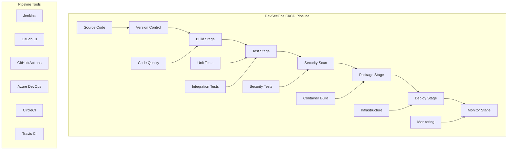

# CI/CD Pipeline Tools - Complete DevSecOps Integration

## 🔄 Overview
This section covers comprehensive CI/CD pipeline tools and implementation patterns for DevSecOps. It includes industry-standard tools like Jenkins, GitLab CI, GitHub Actions, and Azure DevOps, with detailed examples and best practices.

## 🏗️ CI/CD Pipeline Architecture



## 📁 Directory Structure

```
03-ci-cd-pipeline/
├── README.md
├── jenkins/
│   ├── README.md
│   ├── pipeline-examples/
│   ├── plugins/
│   └── best-practices/
├── gitlab-ci/
│   ├── README.md
│   ├── pipeline-examples/
│   ├── runners/
│   └── best-practices/
├── github-actions/
│   ├── README.md
│   ├── workflow-examples/
│   ├── marketplace-actions/
│   └── best-practices/
└── azure-devops/
    ├── README.md
    ├── pipeline-examples/
    ├── tasks/
    └── best-practices/
```

## 🛠️ CI/CD Tool Categories

### 1. Jenkins - Open Source Automation Server

#### Key Features
- **Extensibility**: 1000+ plugins available
- **Flexibility**: Supports any language and platform
- **Community**: Large open-source community
- **Integration**: Works with any tool in the DevSecOps stack

#### Pipeline Examples
```groovy
// Jenkinsfile - Declarative Pipeline
pipeline {
    agent any
    
    environment {
        DOCKER_REGISTRY = 'your-registry.com'
        IMAGE_NAME = 'my-app'
        VERSION = "${env.BUILD_NUMBER}"
    }
    
    stages {
        stage('Checkout') {
            steps {
                checkout scm
            }
        }
        
        stage('Build') {
            steps {
                sh 'docker build -t ${IMAGE_NAME}:${VERSION} .'
            }
        }
        
        stage('Test') {
            steps {
                sh 'docker run --rm ${IMAGE_NAME}:${VERSION} npm test'
            }
        }
        
        stage('Security Scan') {
            steps {
                sh 'trivy image ${IMAGE_NAME}:${VERSION}'
            }
        }
        
        stage('Push') {
            steps {
                sh 'docker tag ${IMAGE_NAME}:${VERSION} ${DOCKER_REGISTRY}/${IMAGE_NAME}:${VERSION}'
                sh 'docker push ${DOCKER_REGISTRY}/${IMAGE_NAME}:${VERSION}'
            }
        }
        
        stage('Deploy') {
            steps {
                sh 'kubectl set image deployment/my-app my-app=${DOCKER_REGISTRY}/${IMAGE_NAME}:${VERSION}'
            }
        }
    }
    
    post {
        always {
            cleanWs()
        }
        success {
            slackSend channel: '#deployments', message: "Deployment successful: ${env.BUILD_URL}"
        }
        failure {
            slackSend channel: '#deployments', message: "Deployment failed: ${env.BUILD_URL}"
        }
    }
}
```

#### Essential Plugins
- **Blue Ocean**: Modern UI for Jenkins
- **Pipeline**: Core pipeline functionality
- **Docker**: Docker integration
- **Kubernetes**: Kubernetes integration
- **SonarQube**: Code quality analysis
- **OWASP Dependency Check**: Security scanning

### 2. GitLab CI - Integrated CI/CD Platform

#### Key Features
- **Integrated**: Built into GitLab platform
- **YAML Configuration**: Simple YAML-based configuration
- **Container Native**: Designed for containerized workflows
- **Security**: Built-in security scanning

#### Pipeline Examples
```yaml
# .gitlab-ci.yml
stages:
  - build
  - test
  - security
  - package
  - deploy

variables:
  DOCKER_DRIVER: overlay2
  DOCKER_TLS_CERTDIR: "/certs"

services:
  - docker:dind

build:
  stage: build
  image: docker:latest
  script:
    - docker build -t $CI_REGISTRY_IMAGE:$CI_COMMIT_SHA .
    - docker push $CI_REGISTRY_IMAGE:$CI_COMMIT_SHA
  only:
    - main
    - develop

test:
  stage: test
  image: node:18
  script:
    - npm install
    - npm run test:unit
    - npm run test:integration
  coverage: '/Lines\s*:\s*(\d+\.\d+)%/'
  artifacts:
    reports:
      coverage_report:
        coverage_format: cobertura
        path: coverage/cobertura-coverage.xml

security:
  stage: security
  image: aquasec/trivy:latest
  script:
    - trivy image --exit-code 0 --severity HIGH,CRITICAL $CI_REGISTRY_IMAGE:$CI_COMMIT_SHA
  allow_failure: true

package:
  stage: package
  image: docker:latest
  script:
    - docker tag $CI_REGISTRY_IMAGE:$CI_COMMIT_SHA $CI_REGISTRY_IMAGE:latest
    - docker push $CI_REGISTRY_IMAGE:latest
  only:
    - main

deploy:
  stage: deploy
  image: bitnami/kubectl:latest
  script:
    - kubectl set image deployment/my-app my-app=$CI_REGISTRY_IMAGE:$CI_COMMIT_SHA
    - kubectl rollout status deployment/my-app
  environment:
    name: production
    url: https://my-app.example.com
  only:
    - main
```

#### GitLab CI Features
- **Auto DevOps**: Automated CI/CD pipeline
- **Security Scanning**: Built-in security tools
- **Container Registry**: Integrated container registry
- **Environment Management**: Environment-specific deployments

### 3. GitHub Actions - Cloud-Based CI/CD

#### Key Features
- **Cloud Native**: Runs in GitHub's cloud
- **Marketplace**: Extensive action marketplace
- **Integration**: Deep GitHub integration
- **Free Tier**: Generous free tier for public repositories

#### Workflow Examples
```yaml
# .github/workflows/ci-cd.yml
name: CI/CD Pipeline

on:
  push:
    branches: [ main, develop ]
  pull_request:
    branches: [ main ]

env:
  REGISTRY: ghcr.io
  IMAGE_NAME: ${{ github.repository }}

jobs:
  build:
    runs-on: ubuntu-latest
    permissions:
      contents: read
      packages: write

    steps:
    - name: Checkout repository
      uses: actions/checkout@v3

    - name: Set up Docker Buildx
      uses: docker/setup-buildx-action@v2

    - name: Log in to Container Registry
      uses: docker/login-action@v2
      with:
        registry: ${{ env.REGISTRY }}
        username: ${{ github.actor }}
        password: ${{ secrets.GITHUB_TOKEN }}

    - name: Extract metadata
      id: meta
      uses: docker/metadata-action@v4
      with:
        images: ${{ env.REGISTRY }}/${{ env.IMAGE_NAME }}
        tags: |
          type=ref,event=branch
          type=ref,event=pr
          type=sha,prefix={{branch}}-
          type=raw,value=latest,enable={{is_default_branch}}

    - name: Build and push Docker image
      uses: docker/build-push-action@v4
      with:
        context: .
        push: true
        tags: ${{ steps.meta.outputs.tags }}
        labels: ${{ steps.meta.outputs.labels }}

  test:
    runs-on: ubuntu-latest
    needs: build
    
    steps:
    - name: Checkout repository
      uses: actions/checkout@v3

    - name: Set up Node.js
      uses: actions/setup-node@v3
      with:
        node-version: '18'
        cache: 'npm'

    - name: Install dependencies
      run: npm ci

    - name: Run unit tests
      run: npm run test:unit

    - name: Run integration tests
      run: npm run test:integration

    - name: Upload coverage reports
      uses: codecov/codecov-action@v3
      with:
        file: ./coverage/lcov.info

  security:
    runs-on: ubuntu-latest
    needs: build
    
    steps:
    - name: Run Trivy vulnerability scanner
      uses: aquasecurity/trivy-action@master
      with:
        image-ref: ${{ env.REGISTRY }}/${{ env.IMAGE_NAME }}:${{ github.sha }}
        format: 'sarif'
        output: 'trivy-results.sarif'

    - name: Upload Trivy scan results
      uses: github/codeql-action/upload-sarif@v2
      with:
        sarif_file: 'trivy-results.sarif'

  deploy:
    runs-on: ubuntu-latest
    needs: [build, test, security]
    if: github.ref == 'refs/heads/main'
    
    steps:
    - name: Deploy to Kubernetes
      uses: azure/k8s-deploy@v1
      with:
        manifests: |
          k8s/deployment.yaml
          k8s/service.yaml
        images: |
          ${{ env.REGISTRY }}/${{ env.IMAGE_NAME }}:${{ github.sha }}
        namespace: production
```

#### Popular GitHub Actions
- **actions/checkout**: Checkout repository code
- **actions/setup-node**: Set up Node.js environment
- **actions/setup-python**: Set up Python environment
- **docker/build-push-action**: Build and push Docker images
- **aquasecurity/trivy-action**: Security vulnerability scanning

### 4. Azure DevOps - Microsoft's DevOps Platform

#### Key Features
- **Integrated Platform**: Complete DevOps solution
- **Azure Integration**: Deep Azure cloud integration
- **Enterprise Features**: Advanced enterprise capabilities
- **Microsoft Ecosystem**: Seamless Microsoft tool integration

#### Pipeline Examples
```yaml
# azure-pipelines.yml
trigger:
- main
- develop

pool:
  vmImage: 'ubuntu-latest'

variables:
  buildConfiguration: 'Release'
  azureSubscription: 'DevSecOps-Subscription'
  resourceGroupName: 'devsecops-rg'
  location: 'East US'

stages:
- stage: Build
  displayName: 'Build and Test'
  jobs:
  - job: BuildJob
    displayName: 'Build Job'
    steps:
    - task: UseNode@1
      inputs:
        version: '18.x'
    
    - script: |
        npm install
        npm run build
        npm run test
      displayName: 'Install, Build, and Test'
    
    - task: Docker@2
      inputs:
        command: 'build'
        dockerfile: '**/Dockerfile'
        tags: |
          $(Build.BuildId)
          latest
    
    - task: AzureContainerRegistry@1
      inputs:
        command: 'push'
        azureSubscription: $(azureSubscription)
        resourceGroupName: $(resourceGroupName)
        azureContainerRegistry: 'devsecopsacr.azurecr.io'
        imageName: 'my-app:$(Build.BuildId)'

- stage: Security
  displayName: 'Security Scan'
  dependsOn: Build
  condition: succeeded()
  jobs:
  - job: SecurityJob
    displayName: 'Security Job'
    steps:
    - task: Docker@2
      inputs:
        command: 'run'
        arguments: '--rm -v $(System.DefaultWorkingDirectory):/workspace aquasec/trivy:latest image --exit-code 0 --severity HIGH,CRITICAL devsecopsacr.azurecr.io/my-app:$(Build.BuildId)'

- stage: Deploy
  displayName: 'Deploy to Azure'
  dependsOn: [Build, Security]
  condition: and(succeeded(), eq(variables['Build.SourceBranch'], 'refs/heads/main'))
  jobs:
  - deployment: DeployJob
    displayName: 'Deploy Job'
    environment: 'production'
    strategy:
      runOnce:
        deploy:
          steps:
          - task: AzureResourceManagerTemplateDeployment@3
            inputs:
              deploymentScope: 'Resource Group'
              azureResourceManagerConnection: $(azureSubscription)
              subscriptionId: $(subscriptionId)
              action: 'Create Or Update Resource Group'
              resourceGroupName: $(resourceGroupName)
              location: $(location)
              templateLocation: 'Linked artifact'
              csmFile: 'infrastructure/mainTemplate.json'
              csmParametersFile: 'infrastructure/parameters.json'
              overrideParameters: '-environment "production"'
```

## 🔒 Security Integration

### Security Scanning in CI/CD
```yaml
# Security scanning pipeline stage
security-scan:
  stage: security
  image: aquasec/trivy:latest
  script:
    - trivy image --exit-code 0 --severity HIGH,CRITICAL $IMAGE_NAME:$VERSION
    - trivy fs . --exit-code 0 --severity HIGH,CRITICAL
  artifacts:
    reports:
      security: trivy-results.json
  allow_failure: true
```

### Secrets Management
```yaml
# Secrets management in CI/CD
deploy:
  stage: deploy
  script:
    - echo $VAULT_TOKEN | vault auth -method=aws
    - export DB_PASSWORD=$(vault kv get -field=password secret/myapp/database)
    - kubectl create secret generic db-secret --from-literal=password=$DB_PASSWORD
  only:
    - main
```

## 📊 Monitoring and Observability

### Pipeline Metrics
```yaml
# Pipeline monitoring
monitor:
  stage: monitor
  script:
    - echo "Pipeline execution time: $CI_PIPELINE_DURATION"
    - echo "Build success rate: $CI_PIPELINE_SUCCESS_RATE"
    - curl -X POST $SLACK_WEBHOOK -d '{"text":"Pipeline completed successfully"}'
  when: always
```

### Deployment Notifications
```yaml
# Deployment notifications
notify:
  stage: notify
  script:
    - |
      if [ "$CI_COMMIT_BRANCH" = "main" ]; then
        curl -X POST $SLACK_WEBHOOK -d '{
          "text": "🚀 Deployment to production completed",
          "attachments": [{
            "color": "good",
            "fields": [{
              "title": "Environment",
              "value": "Production",
              "short": true
            }, {
              "title": "Version",
              "value": "'$CI_COMMIT_SHA'",
              "short": true
            }]
          }]
        }'
      fi
  when: always
```

## 🧪 Hands-On Labs

### Lab 1: Basic CI/CD Pipeline
```bash
# Lab 1: Setting up a basic CI/CD pipeline
# 1. Create a new repository
git init my-app
cd my-app

# 2. Create a simple application
echo 'console.log("Hello DevSecOps!");' > index.js

# 3. Create package.json
cat > package.json << EOF
{
  "name": "my-app",
  "version": "1.0.0",
  "scripts": {
    "start": "node index.js",
    "test": "echo 'Tests passed'"
  }
}
EOF

# 4. Create Dockerfile
cat > Dockerfile << EOF
FROM node:18-alpine
WORKDIR /app
COPY package*.json ./
RUN npm install
COPY . .
EXPOSE 3000
CMD ["npm", "start"]
EOF

# 5. Create GitHub Actions workflow
mkdir -p .github/workflows
cat > .github/workflows/ci-cd.yml << EOF
name: CI/CD Pipeline
on: [push, pull_request]
jobs:
  build:
    runs-on: ubuntu-latest
    steps:
    - uses: actions/checkout@v3
    - name: Build Docker image
      run: docker build -t my-app .
    - name: Run tests
      run: docker run --rm my-app npm test
EOF

# 6. Commit and push
git add .
git commit -m "Initial commit with CI/CD pipeline"
git push origin main
```

### Lab 2: Advanced CI/CD with Security
```bash
# Lab 2: Advanced CI/CD with security scanning
# 1. Add security scanning to the pipeline
cat >> .github/workflows/ci-cd.yml << EOF

  security:
    runs-on: ubuntu-latest
    steps:
    - uses: actions/checkout@v3
    - name: Run Trivy vulnerability scanner
      uses: aquasec/trivy-action@master
      with:
        image-ref: 'my-app'
        format: 'sarif'
        output: 'trivy-results.sarif'
    - name: Upload Trivy scan results
      uses: github/codeql-action/upload-sarif@v2
      with:
        sarif_file: 'trivy-results.sarif'
EOF

# 2. Add code quality scanning
cat >> .github/workflows/ci-cd.yml << EOF

  quality:
    runs-on: ubuntu-latest
    steps:
    - uses: actions/checkout@v3
    - name: Run SonarQube scan
      uses: SonarSource/sonarqube-scan-action@master
      env:
        GITHUB_TOKEN: \${{ secrets.GITHUB_TOKEN }}
        SONAR_TOKEN: \${{ secrets.SONAR_TOKEN }}
EOF
```

## 📚 Learning Resources

### Documentation
- [Jenkins Documentation](https://www.jenkins.io/doc/)
- [GitLab CI Documentation](https://docs.gitlab.com/ee/ci/)
- [GitHub Actions Documentation](https://docs.github.com/en/actions)
- [Azure DevOps Documentation](https://docs.microsoft.com/azure/devops/)

### Best Practices
- **Pipeline as Code**: Store pipeline configurations in version control
- **Security First**: Integrate security scanning in every pipeline
- **Fail Fast**: Run quick tests first, expensive tests later
- **Artifact Management**: Properly manage build artifacts
- **Environment Parity**: Keep environments consistent

### Community Resources
- [Jenkins Community](https://community.jenkins.io/)
- [GitLab Community](https://about.gitlab.com/community/)
- [GitHub Community](https://github.community/)
- [Azure DevOps Community](https://developercommunity.visualstudio.com/spaces/21/index.html)

## 🎓 Certification Preparation

### CI/CD Certifications
- **Jenkins Engineer**: Jenkins automation certification
- **GitLab Certified Associate**: GitLab CI/CD certification
- **GitHub Actions**: GitHub Actions certification
- **Azure DevOps Engineer**: Azure DevOps certification

### Study Materials
- **Official Documentation**: Tool-specific documentation
- **Practice Labs**: Hands-on practice exercises
- **Mock Exams**: Practice certification exams
- **Community Forums**: Expert discussions and Q&A

## 🤝 Contributing

### How to Contribute
1. **Fork the repository**
2. **Create a feature branch**
3. **Add CI/CD content or improvements**
4. **Submit a pull request**

### Contribution Areas
- **New pipeline examples**
- **Updated best practices**
- **Additional hands-on labs**
- **Security integration examples**

## 📞 Support

### Getting Help
- **Documentation**: Comprehensive guides in each tool folder
- **Issues**: GitHub issues for CI/CD problems
- **Discussions**: Community discussions for CI/CD questions
- **Mentorship**: Connect with CI/CD experts

### Community Resources
- **Slack**: #ci-cd-pipeline
- **Discord**: CI/CD Learning Community
- **LinkedIn**: CI/CD Professionals Group
- **YouTube**: CI/CD Tutorials Channel

---

**Ready to master CI/CD pipelines?** Start with the basic pipeline examples and work your way up to advanced implementations!
