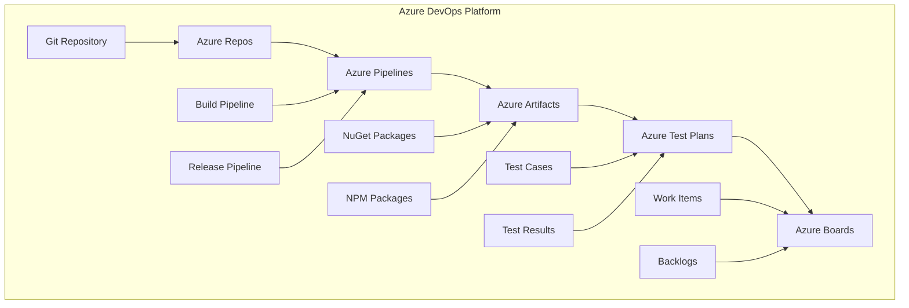

# Azure DevOps - Microsoft's Complete DevOps Platform

## 🔧 Overview
This section covers comprehensive Azure DevOps implementation for DevSecOps pipelines. It includes Azure Pipelines, Azure Repos, Azure Artifacts, Azure Test Plans, and Azure Boards with detailed implementation guides and best practices for enterprise-grade CI/CD.

## 🏗️ Azure DevOps Architecture



## 📁 Directory Structure

```
azure-devops/
├── README.md
├── pipeline-examples/
│   ├── yaml-pipelines/
│   ├── classic-pipelines/
│   ├── multi-stage-pipelines/
│   └── deployment-pipelines/
├── templates/
│   ├── build-templates/
│   ├── deployment-templates/
│   └── shared-templates/
└── best-practices/
    ├── security/
    ├── performance/
    ├── organization/
    └── troubleshooting/
```

## 🛠️ Azure DevOps Services

### 1. Azure Pipelines - CI/CD Platform

#### YAML Pipeline Example
```yaml
# azure-pipelines.yml
trigger:
- main
- develop

pr:
- main

variables:
  buildConfiguration: 'Release'
  vmImageName: 'ubuntu-latest'

stages:
- stage: Build
  displayName: 'Build Stage'
  jobs:
  - job: BuildJob
    displayName: 'Build Job'
    pool:
      vmImage: $(vmImageName)
    steps:
    - task: NodeTool@0
      inputs:
        versionSpec: '18.x'
      displayName: 'Install Node.js'
    
    - script: |
        npm install
        npm run build
      displayName: 'Build Application'
    
    - task: PublishBuildArtifacts@1
      inputs:
        pathToPublish: 'dist'
        artifactName: 'webapp'
      displayName: 'Publish Build Artifacts'

- stage: Test
  displayName: 'Test Stage'
  dependsOn: Build
  condition: succeeded()
  jobs:
  - job: TestJob
    displayName: 'Test Job'
    pool:
      vmImage: $(vmImageName)
    steps:
    - task: NodeTool@0
      inputs:
        versionSpec: '18.x'
      displayName: 'Install Node.js'
    
    - script: |
        npm install
        npm run test
      displayName: 'Run Tests'
    
    - task: PublishTestResults@2
      inputs:
        testResultsFormat: 'JUnit'
        testResultsFiles: '**/test-results.xml'
        failTaskOnFailedTests: true
      displayName: 'Publish Test Results'

- stage: Security
  displayName: 'Security Stage'
  dependsOn: Test
  condition: succeeded()
  jobs:
  - job: SecurityJob
    displayName: 'Security Job'
    pool:
      vmImage: $(vmImageName)
    steps:
    - task: NodeTool@0
      inputs:
        versionSpec: '18.x'
      displayName: 'Install Node.js'
    
    - script: |
        npm install
        npm audit --audit-level=high
      displayName: 'Security Audit'
    
    - task: SonarCloudPrepare@1
      inputs:
        SonarCloud: 'SonarCloud'
        organization: 'my-organization'
        scannerMode: 'Other'
    
    - task: SonarCloudAnalyze@1
    
    - task: SonarCloudPublish@1
      inputs:
        pollingTimeoutSec: '300'

- stage: Deploy
  displayName: 'Deploy Stage'
  dependsOn: Security
  condition: and(succeeded(), eq(variables['Build.SourceBranch'], 'refs/heads/main'))
  jobs:
  - deployment: DeployJob
    displayName: 'Deploy Job'
    environment: 'production'
    strategy:
      runOnce:
        deploy:
          steps:
          - task: AzureWebApp@1
            inputs:
              azureSubscription: 'Azure-Subscription'
              appType: 'webApp'
              appName: 'my-webapp'
              package: '$(Pipeline.Workspace)/webapp'
            displayName: 'Deploy to Azure Web App'
```

#### Classic Pipeline Configuration
```json
{
  "name": "DevSecOps Pipeline",
  "description": "Complete DevSecOps pipeline with security scanning",
  "triggers": [
    {
      "branchFilters": [
        {
          "include": ["main", "develop"],
          "exclude": []
        }
      ],
      "pathFilters": [],
      "settingsSourceType": 2
    }
  ],
  "process": {
    "type": 1,
    "yamlFilename": "azure-pipelines.yml",
    "resources": {
      "repositories": [
        {
          "repository": "self",
          "type": "TfsGit",
          "refName": "refs/heads/main"
        }
      ]
    }
  },
  "repository": {
    "id": "self",
    "type": "TfsGit",
    "name": "DevSecOps-Project",
    "defaultBranch": "refs/heads/main",
    "url": "https://dev.azure.com/myorg/DevSecOps-Project/_git/DevSecOps-Project",
    "clean": null,
    "checkoutSubmodules": false
  }
}
```

### 2. Azure Repos - Git Repository Hosting

#### Repository Configuration
```yaml
# .gitignore
# Dependencies
node_modules/
npm-debug.log*
yarn-debug.log*
yarn-error.log*

# Build outputs
dist/
build/
out/

# Environment variables
.env
.env.local
.env.development.local
.env.test.local
.env.production.local

# IDE
.vscode/
.idea/
*.swp
*.swo

# OS
.DS_Store
Thumbs.db

# Logs
logs/
*.log

# Coverage
coverage/
.nyc_output/

# Azure
.azure/
```

#### Branch Policies
```json
{
  "isEnabled": true,
  "isBlocking": true,
  "type": {
    "id": "2e6e4d88-8de3-4fed-b362-4a403a6f82c1",
    "displayName": "Require a minimum number of reviewers"
  },
  "settings": {
    "minimumApproverCount": 2,
    "creatorVoteCounts": false,
    "allowDownvotes": false,
    "resetOnSourcePush": true,
    "requireVoteOnLastIteration": false,
    "scope": [
      {
        "refName": "refs/heads/main",
        "matchKind": "exact",
        "repositoryId": "self"
      }
    ]
  }
}
```

### 3. Azure Artifacts - Package Management

#### Package Management Configuration
```yaml
# .npmrc
registry=https://pkgs.dev.azure.com/myorg/_packaging/myfeed/npm/registry/
always-auth=true
```

#### NuGet Package Configuration
```xml
<!-- packages.config -->
<?xml version="1.0" encoding="utf-8"?>
<packages>
  <package id="Newtonsoft.Json" version="13.0.3" targetFramework="net6.0" />
  <package id="Microsoft.Extensions.Logging" version="6.0.0" targetFramework="net6.0" />
  <package id="Microsoft.Extensions.Configuration" version="6.0.0" targetFramework="net6.0" />
</packages>
```

### 4. Azure Test Plans - Test Management

#### Test Plan Configuration
```json
{
  "name": "DevSecOps Test Plan",
  "description": "Comprehensive test plan for DevSecOps application",
  "areaPath": "DevSecOps-Project\\Testing",
  "iteration": "DevSecOps-Project\\Sprint 1",
  "testSuites": [
    {
      "name": "Unit Tests",
      "testCases": [
        {
          "title": "User Authentication Test",
          "steps": [
            {
              "action": "Navigate to login page",
              "expectedResult": "Login page loads successfully"
            },
            {
              "action": "Enter valid credentials",
              "expectedResult": "User is authenticated"
            }
          ]
        }
      ]
    },
    {
      "name": "Integration Tests",
      "testCases": [
        {
          "title": "API Integration Test",
          "steps": [
            {
              "action": "Call API endpoint",
              "expectedResult": "API returns expected response"
            }
          ]
        }
      ]
    }
  ]
}
```

### 5. Azure Boards - Work Item Management

#### Work Item Templates
```json
{
  "workItemType": "User Story",
  "fields": {
    "System.Title": "As a user, I want to authenticate securely",
    "System.Description": "Users should be able to authenticate using secure methods",
    "System.AssignedTo": "developer@company.com",
    "System.AreaPath": "DevSecOps-Project\\Authentication",
    "System.IterationPath": "DevSecOps-Project\\Sprint 1",
    "Microsoft.VSTS.Common.Priority": 2,
    "Microsoft.VSTS.Common.Severity": "2 - High",
    "Microsoft.VSTS.Common.StoryPoints": 5
  }
}
```

## 🔧 Pipeline Templates

### 1. Build Template
```yaml
# templates/build-template.yml
parameters:
- name: nodeVersion
  type: string
  default: '18.x'
- name: buildCommand
  type: string
  default: 'npm run build'
- name: testCommand
  type: string
  default: 'npm test'

steps:
- task: NodeTool@0
  inputs:
    versionSpec: ${{ parameters.nodeVersion }}
  displayName: 'Install Node.js'

- script: |
    npm install
    ${{ parameters.buildCommand }}
  displayName: 'Build Application'

- script: |
    ${{ parameters.testCommand }}
  displayName: 'Run Tests'

- task: PublishBuildArtifacts@1
  inputs:
    pathToPublish: 'dist'
    artifactName: 'webapp'
  displayName: 'Publish Build Artifacts'
```

### 2. Deployment Template
```yaml
# templates/deploy-template.yml
parameters:
- name: environment
  type: string
- name: azureSubscription
  type: string
- name: appName
  type: string
- name: packagePath
  type: string

steps:
- task: AzureWebApp@1
  inputs:
    azureSubscription: ${{ parameters.azureSubscription }}
    appType: 'webApp'
    appName: ${{ parameters.appName }}
    package: ${{ parameters.packagePath }}
    deploymentMethod: 'auto'
  displayName: 'Deploy to ${{ parameters.environment }}'
```

### 3. Security Template
```yaml
# templates/security-template.yml
steps:
- task: NodeTool@0
  inputs:
    versionSpec: '18.x'
  displayName: 'Install Node.js'

- script: |
    npm install
    npm audit --audit-level=high
  displayName: 'Security Audit'
  continueOnError: true

- task: SonarCloudPrepare@1
  inputs:
    SonarCloud: 'SonarCloud'
    organization: 'my-organization'
    scannerMode: 'Other'

- task: SonarCloudAnalyze@1

- task: SonarCloudPublish@1
  inputs:
    pollingTimeoutSec: '300'
```

## 🧪 Hands-On Labs

### Lab 1: Azure DevOps Project Setup
```bash
# Lab 1: Setting up Azure DevOps project
# 1. Create Azure DevOps organization
# Go to https://dev.azure.com
# Sign in with Microsoft account
# Create new organization

# 2. Create new project
# Project name: DevSecOps-Project
# Visibility: Private
# Version control: Git
# Work item process: Agile

# 3. Create repository
# Initialize with README
# Add .gitignore for Node.js

# 4. Clone repository
git clone https://dev.azure.com/myorg/DevSecOps-Project/_git/DevSecOps-Project
cd DevSecOps-Project

# 5. Create basic application
npm init -y
npm install express
```

### Lab 2: YAML Pipeline Creation
```bash
# Lab 2: Creating YAML pipeline
# 1. Create azure-pipelines.yml
cat > azure-pipelines.yml << 'EOF'
trigger:
- main

pool:
  vmImage: 'ubuntu-latest'

variables:
  buildConfiguration: 'Release'

stages:
- stage: Build
  displayName: 'Build Stage'
  jobs:
  - job: BuildJob
    displayName: 'Build Job'
    steps:
    - task: NodeTool@0
      inputs:
        versionSpec: '18.x'
      displayName: 'Install Node.js'
    
    - script: |
        npm install
        npm run build
      displayName: 'Build Application'
    
    - task: PublishBuildArtifacts@1
      inputs:
        pathToPublish: 'dist'
        artifactName: 'webapp'
      displayName: 'Publish Build Artifacts'
EOF

# 2. Create package.json
cat > package.json << 'EOF'
{
  "name": "azure-devops-lab",
  "version": "1.0.0",
  "scripts": {
    "build": "echo 'Building application...'",
    "test": "echo 'Running tests...'"
  },
  "dependencies": {
    "express": "^4.18.0"
  }
}
EOF

# 3. Commit and push
git add .
git commit -m "Add Azure DevOps pipeline"
git push origin main
```

### Lab 3: Multi-Stage Pipeline
```bash
# Lab 3: Creating multi-stage pipeline
# 1. Create multi-stage pipeline
cat > azure-pipelines-multi.yml << 'EOF'
trigger:
- main

stages:
- stage: Build
  displayName: 'Build Stage'
  jobs:
  - job: BuildJob
    displayName: 'Build Job'
    pool:
      vmImage: 'ubuntu-latest'
    steps:
    - task: NodeTool@0
      inputs:
        versionSpec: '18.x'
      displayName: 'Install Node.js'
    
    - script: |
        npm install
        npm run build
      displayName: 'Build Application'
    
    - task: PublishBuildArtifacts@1
      inputs:
        pathToPublish: 'dist'
        artifactName: 'webapp'
      displayName: 'Publish Build Artifacts'

- stage: Test
  displayName: 'Test Stage'
  dependsOn: Build
  condition: succeeded()
  jobs:
  - job: TestJob
    displayName: 'Test Job'
    pool:
      vmImage: 'ubuntu-latest'
    steps:
    - task: NodeTool@0
      inputs:
        versionSpec: '18.x'
      displayName: 'Install Node.js'
    
    - script: |
        npm install
        npm run test
      displayName: 'Run Tests'

- stage: Deploy
  displayName: 'Deploy Stage'
  dependsOn: Test
  condition: and(succeeded(), eq(variables['Build.SourceBranch'], 'refs/heads/main'))
  jobs:
  - deployment: DeployJob
    displayName: 'Deploy Job'
    environment: 'production'
    strategy:
      runOnce:
        deploy:
          steps:
          - script: |
              echo "Deploying to production..."
            displayName: 'Deploy to Production'
EOF

# 2. Commit and push
git add .
git commit -m "Add multi-stage pipeline"
git push origin main
```

## 📊 Best Practices

### 1. Security Best Practices
- **Use Service Connections**: Secure connections to external services
- **Store Secrets**: Use Azure Key Vault for sensitive data
- **Branch Policies**: Implement branch protection rules
- **Code Scanning**: Integrate security scanning tools
- **Access Control**: Implement least privilege access

### 2. Performance Best Practices
- **Parallel Jobs**: Use parallel execution where possible
- **Caching**: Cache dependencies and build artifacts
- **Agent Pools**: Use appropriate agent pools
- **Resource Optimization**: Optimize pipeline steps
- **Monitoring**: Monitor pipeline performance

### 3. Organization Best Practices
- **Templates**: Create reusable pipeline templates
- **Environments**: Use deployment environments
- **Approvals**: Implement approval gates
- **Documentation**: Document processes and procedures
- **Training**: Train team on Azure DevOps features

## 📚 Learning Resources

### Documentation
- [Azure DevOps Documentation](https://docs.microsoft.com/en-us/azure/devops/)
- [Azure Pipelines Documentation](https://docs.microsoft.com/en-us/azure/devops/pipelines/)
- [Azure Repos Documentation](https://docs.microsoft.com/en-us/azure/devops/repos/)
- [Azure Artifacts Documentation](https://docs.microsoft.com/en-us/azure/devops/artifacts/)

### Community Resources
- [Azure DevOps Community](https://developercommunity.visualstudio.com/spaces/21/index.html)
- [Stack Overflow](https://stackoverflow.com/questions/tagged/azure-devops)
- [Microsoft Q&A](https://docs.microsoft.com/en-us/answers/topics/azure-devops.html)
- [GitHub](https://github.com/Microsoft/azure-pipelines-tasks)

## 🎓 Certification Preparation

### Azure Certifications
- **Azure DevOps Engineer**: Azure DevOps certification
- **Azure Developer**: Azure development certification
- **Azure Administrator**: Azure administration certification
- **DevOps Engineer**: General DevOps certification

### Study Materials
- **Official Documentation**: Azure DevOps documentation
- **Practice Projects**: Hands-on Azure DevOps projects
- **Microsoft Learn**: Free learning modules
- **Community Forums**: Expert discussions and Q&A

## 🤝 Contributing

### How to Contribute
1. **Fork the repository**
2. **Create a feature branch**
3. **Add Azure DevOps content or improvements**
4. **Submit a pull request**

### Contribution Areas
- **New pipeline examples**
- **Updated best practices**
- **Additional templates**
- **Improved documentation**

## 📞 Support

### Getting Help
- **Documentation**: Comprehensive guides in each folder
- **Issues**: GitHub issues for Azure DevOps problems
- **Discussions**: Community discussions for pipeline questions
- **Mentorship**: Connect with Azure DevOps experts

### Community Resources
- **Slack**: #azure-devops
- **Discord**: Azure DevOps Learning Community
- **LinkedIn**: Azure DevOps Professionals Group
- **YouTube**: Azure DevOps Tutorials Channel

---

**Ready to master Azure DevOps?** Start with basic pipelines and work your way up to advanced automation patterns!
