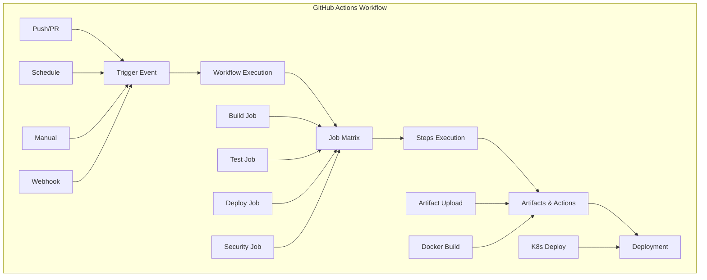

# GitHub Actions - Cloud-Based CI/CD Platform

## ⚡ Overview
This section covers comprehensive GitHub Actions implementation for DevSecOps pipelines. It includes workflow development, marketplace actions, security best practices, and advanced automation patterns for enterprise-grade CI/CD.

## 🏗️ GitHub Actions Architecture



## 📁 Directory Structure

```
github-actions/
├── README.md
├── workflow-examples/
│   ├── basic-pipeline/
│   ├── multi-environment/
│   ├── security-scanning/
│   └── deployment-strategies/
├── marketplace-actions/
│   ├── build-actions/
│   ├── security-actions/
│   ├── deployment-actions/
│   └── utility-actions/
└── best-practices/
    ├── security/
    ├── performance/
    ├── organization/
    └── troubleshooting/
```

## 🛠️ GitHub Actions Fundamentals

### 1. Workflow Structure
```yaml
# .github/workflows/ci-cd.yml
name: CI/CD Pipeline

# Trigger events
on:
  push:
    branches: [ main, develop ]
  pull_request:
    branches: [ main ]
  schedule:
    - cron: '0 2 * * 1'  # Weekly on Monday at 2 AM
  workflow_dispatch:  # Manual trigger
    inputs:
      environment:
        description: 'Environment to deploy to'
        required: true
        default: 'staging'
        type: choice
        options:
          - staging
          - production

# Environment variables
env:
  NODE_VERSION: '18'
  REGISTRY: ghcr.io
  IMAGE_NAME: ${{ github.repository }}

# Workflow permissions
permissions:
  contents: read
  packages: write
  security-events: write
  pull-requests: write

# Concurrency control
concurrency:
  group: ${{ github.workflow }}-${{ github.ref }}
  cancel-in-progress: true

# Jobs
jobs:
  # Build and test job
  build-and-test:
    runs-on: ubuntu-latest
    strategy:
      matrix:
        node-version: [16, 18, 20]
        os: [ubuntu-latest, windows-latest, macos-latest]
    
    steps:
    - name: Checkout code
      uses: actions/checkout@v4
      with:
        fetch-depth: 0
    
    - name: Setup Node.js
      uses: actions/setup-node@v4
      with:
        node-version: ${{ matrix.node-version }}
        cache: 'npm'
    
    - name: Install dependencies
      run: npm ci
    
    - name: Run linting
      run: npm run lint
    
    - name: Run tests
      run: npm run test:coverage
      env:
        CI: true
    
    - name: Upload coverage reports
      uses: codecov/codecov-action@v3
      with:
        file: ./coverage/lcov.info
        flags: unittests
        name: codecov-umbrella
        fail_ci_if_error: true
```

### 2. Advanced Workflow Patterns

#### Multi-Environment Deployment
```yaml
# .github/workflows/deploy.yml
name: Multi-Environment Deployment

on:
  push:
    branches: [ main, develop, feature/* ]
  pull_request:
    branches: [ main ]

env:
  REGISTRY: ghcr.io
  IMAGE_NAME: ${{ github.repository }}

jobs:
  determine-environment:
    runs-on: ubuntu-latest
    outputs:
      environment: ${{ steps.env.outputs.environment }}
      should-deploy: ${{ steps.env.outputs.should-deploy }}
    steps:
    - name: Determine environment
      id: env
      run: |
        if [[ "${{ github.ref }}" == "refs/heads/main" ]]; then
          echo "environment=production" >> $GITHUB_OUTPUT
          echo "should-deploy=true" >> $GITHUB_OUTPUT
        elif [[ "${{ github.ref }}" == "refs/heads/develop" ]]; then
          echo "environment=staging" >> $GITHUB_OUTPUT
          echo "should-deploy=true" >> $GITHUB_OUTPUT
        elif [[ "${{ github.ref }}" == refs/heads/feature/* ]]; then
          echo "environment=development" >> $GITHUB_OUTPUT
          echo "should-deploy=true" >> $GITHUB_OUTPUT
        else
          echo "environment=none" >> $GITHUB_OUTPUT
          echo "should-deploy=false" >> $GITHUB_OUTPUT
        fi

  build:
    needs: determine-environment
    if: needs.determine-environment.outputs.should-deploy == 'true'
    runs-on: ubuntu-latest
    outputs:
      image-tag: ${{ steps.meta.outputs.tags }}
      image-digest: ${{ steps.build.outputs.digest }}
    steps:
    - name: Checkout code
      uses: actions/checkout@v4
    
    - name: Set up Docker Buildx
      uses: docker/setup-buildx-action@v3
    
    - name: Log in to Container Registry
      uses: docker/login-action@v3
      with:
        registry: ${{ env.REGISTRY }}
        username: ${{ github.actor }}
        password: ${{ secrets.GITHUB_TOKEN }}
    
    - name: Extract metadata
      id: meta
      uses: docker/metadata-action@v5
      with:
        images: ${{ env.REGISTRY }}/${{ env.IMAGE_NAME }}
        tags: |
          type=ref,event=branch
          type=ref,event=pr
          type=sha,prefix={{branch}}-
          type=raw,value=latest,enable={{is_default_branch}}
          type=raw,value=${{ needs.determine-environment.outputs.environment }},enable={{is_default_branch}}
    
    - name: Build and push Docker image
      id: build
      uses: docker/build-push-action@v5
      with:
        context: .
        push: true
        tags: ${{ steps.meta.outputs.tags }}
        labels: ${{ steps.meta.outputs.labels }}
        cache-from: type=gha
        cache-to: type=gha,mode=max

  security-scan:
    needs: build
    if: needs.determine-environment.outputs.should-deploy == 'true'
    runs-on: ubuntu-latest
    steps:
    - name: Run Trivy vulnerability scanner
      uses: aquasecurity/trivy-action@master
      with:
        image-ref: ${{ needs.build.outputs.image-tag }}
        format: 'sarif'
        output: 'trivy-results.sarif'
    
    - name: Upload Trivy scan results
      uses: github/codeql-action/upload-sarif@v2
      with:
        sarif_file: 'trivy-results.sarif'
    
    - name: Run Snyk to check for vulnerabilities
      uses: snyk/actions/node@master
      env:
        SNYK_TOKEN: ${{ secrets.SNYK_TOKEN }}
      with:
        args: --severity-threshold=high

  deploy:
    needs: [determine-environment, build, security-scan]
    if: needs.determine-environment.outputs.should-deploy == 'true'
    runs-on: ubuntu-latest
    environment: ${{ needs.determine-environment.outputs.environment }}
    steps:
    - name: Checkout code
      uses: actions/checkout@v4
    
    - name: Configure AWS credentials
      uses: aws-actions/configure-aws-credentials@v4
      with:
        aws-access-key-id: ${{ secrets.AWS_ACCESS_KEY_ID }}
        aws-secret-access-key: ${{ secrets.AWS_SECRET_ACCESS_KEY }}
        aws-region: us-west-2
    
    - name: Deploy to EKS
      uses: aws-actions/amazon-ecs-deploy-task-definition@v1
      with:
        task-definition: .aws/task-definition.json
        service: my-service
        cluster: my-cluster
        wait-for-service-stability: true
```

### 3. Security-First Workflows

#### Comprehensive Security Pipeline
```yaml
# .github/workflows/security.yml
name: Security Pipeline

on:
  push:
    branches: [ main, develop ]
  pull_request:
    branches: [ main ]
  schedule:
    - cron: '0 2 * * 1'  # Weekly security scan

permissions:
  contents: read
  security-events: write
  actions: read

jobs:
  dependency-scan:
    runs-on: ubuntu-latest
    steps:
    - name: Checkout code
      uses: actions/checkout@v4
    
    - name: Run Snyk to check for vulnerabilities
      uses: snyk/actions/node@master
      env:
        SNYK_TOKEN: ${{ secrets.SNYK_TOKEN }}
      with:
        args: --severity-threshold=high --file=package.json
    
    - name: Run npm audit
      run: npm audit --audit-level=high
    
    - name: Run OWASP Dependency Check
      uses: dependency-check/Dependency-Check_Action@main
      with:
        project: 'my-project'
        path: '.'
        format: 'SARIF'
        out: 'reports'
    
    - name: Upload dependency check results
      uses: github/codeql-action/upload-sarif@v2
      with:
        sarif_file: 'reports/dependency-check-report.sarif'

  code-scan:
    runs-on: ubuntu-latest
    steps:
    - name: Checkout code
      uses: actions/checkout@v4
      with:
        fetch-depth: 0
    
    - name: Initialize CodeQL
      uses: github/codeql-action/init@v2
      with:
        languages: javascript, python
    
    - name: Autobuild
      uses: github/codeql-action/autobuild@v2
    
    - name: Perform CodeQL Analysis
      uses: github/codeql-action/analyze@v2
    
    - name: Run SonarQube Scan
      uses: SonarSource/sonarqube-scan-action@master
      env:
        GITHUB_TOKEN: ${{ secrets.GITHUB_TOKEN }}
        SONAR_TOKEN: ${{ secrets.SONAR_TOKEN }}
        SONAR_HOST_URL: ${{ secrets.SONAR_HOST_URL }}

  container-scan:
    runs-on: ubuntu-latest
    steps:
    - name: Checkout code
      uses: actions/checkout@v4
    
    - name: Build Docker image
      run: docker build -t myapp:latest .
    
    - name: Run Trivy vulnerability scanner
      uses: aquasecurity/trivy-action@master
      with:
        image-ref: 'myapp:latest'
        format: 'sarif'
        output: 'trivy-results.sarif'
    
    - name: Upload Trivy scan results
      uses: github/codeql-action/upload-sarif@v2
      with:
        sarif_file: 'trivy-results.sarif'
    
    - name: Run Snyk container scan
      uses: snyk/actions/docker@master
      env:
        SNYK_TOKEN: ${{ secrets.SNYK_TOKEN }}
      with:
        image: 'myapp:latest'
        args: --severity-threshold=high

  secret-scan:
    runs-on: ubuntu-latest
    steps:
    - name: Checkout code
      uses: actions/checkout@v4
      with:
        fetch-depth: 0
    
    - name: Run TruffleHog OSS
      uses: trufflesecurity/trufflehog@main
      with:
        path: ./
        base: main
        head: HEAD
        extra_args: --debug --only-verified
```

## 🔧 Marketplace Actions

### 1. Essential Actions

#### Build and Test Actions
```yaml
# Node.js application
- name: Setup Node.js
  uses: actions/setup-node@v4
  with:
    node-version: '18'
    cache: 'npm'

# Python application
- name: Setup Python
  uses: actions/setup-python@v4
  with:
    python-version: '3.9'
    cache: 'pip'

# Java application
- name: Setup Java
  uses: actions/setup-java@v3
  with:
    distribution: 'temurin'
    java-version: '17'

# Go application
- name: Setup Go
  uses: actions/setup-go@v4
  with:
    go-version: '1.19'
```

#### Docker Actions
```yaml
# Docker build and push
- name: Set up Docker Buildx
  uses: docker/setup-buildx-action@v3

- name: Log in to Container Registry
  uses: docker/login-action@v3
  with:
    registry: ghcr.io
    username: ${{ github.actor }}
    password: ${{ secrets.GITHUB_TOKEN }}

- name: Extract metadata
  uses: docker/metadata-action@v5
  with:
    images: ghcr.io/${{ github.repository }}
    tags: |
      type=ref,event=branch
      type=sha,prefix={{branch}}-

- name: Build and push
  uses: docker/build-push-action@v5
  with:
    context: .
    push: true
    tags: ${{ steps.meta.outputs.tags }}
    labels: ${{ steps.meta.outputs.labels }}
    cache-from: type=gha
    cache-to: type=gha,mode=max
```

#### Cloud Provider Actions
```yaml
# AWS Actions
- name: Configure AWS credentials
  uses: aws-actions/configure-aws-credentials@v4
  with:
    aws-access-key-id: ${{ secrets.AWS_ACCESS_KEY_ID }}
    aws-secret-access-key: ${{ secrets.AWS_SECRET_ACCESS_KEY }}
    aws-region: us-west-2

- name: Deploy to EKS
  uses: aws-actions/amazon-ecs-deploy-task-definition@v1
  with:
    task-definition: .aws/task-definition.json
    service: my-service
    cluster: my-cluster

# Azure Actions
- name: Azure Login
  uses: azure/login@v1
  with:
    creds: ${{ secrets.AZURE_CREDENTIALS }}

- name: Deploy to Azure Web App
  uses: azure/webapps-deploy@v2
  with:
    app-name: 'my-app'
    package: './dist'

# Google Cloud Actions
- name: Google Cloud Auth
  uses: google-github-actions/auth@v1
  with:
    credentials_json: ${{ secrets.GCP_SA_KEY }}

- name: Deploy to Cloud Run
  uses: google-github-actions/deploy-cloudrun@v1
  with:
    service: my-service
    image: gcr.io/${{ secrets.GCP_PROJECT_ID }}/my-app:${{ github.sha }}
```

### 2. Security Actions

#### Vulnerability Scanning
```yaml
# Snyk security scanning
- name: Run Snyk to check for vulnerabilities
  uses: snyk/actions/node@master
  env:
    SNYK_TOKEN: ${{ secrets.SNYK_TOKEN }}
  with:
    args: --severity-threshold=high

# Trivy container scanning
- name: Run Trivy vulnerability scanner
  uses: aquasecurity/trivy-action@master
  with:
    image-ref: 'myapp:latest'
    format: 'sarif'
    output: 'trivy-results.sarif'

# CodeQL analysis
- name: Initialize CodeQL
  uses: github/codeql-action/init@v2
  with:
    languages: javascript, python

- name: Perform CodeQL Analysis
  uses: github/codeql-action/analyze@v2
```

#### Secret Scanning
```yaml
# TruffleHog secret scanning
- name: Run TruffleHog OSS
  uses: trufflesecurity/trufflehog@main
  with:
    path: ./
    base: main
    head: HEAD
    extra_args: --debug --only-verified

# GitLeaks secret scanning
- name: Run GitLeaks
  uses: gitleaks/gitleaks-action@v2
  env:
    GITHUB_TOKEN: ${{ secrets.GITHUB_TOKEN }}
```

## 🧪 Hands-On Labs

### Lab 1: Basic GitHub Actions Workflow
```bash
# Lab 1: Creating your first GitHub Actions workflow
# 1. Create .github/workflows directory
mkdir -p .github/workflows

# 2. Create basic workflow
cat > .github/workflows/ci.yml << 'EOF'
name: CI Pipeline

on:
  push:
    branches: [ main, develop ]
  pull_request:
    branches: [ main ]

jobs:
  test:
    runs-on: ubuntu-latest
    
    steps:
    - name: Checkout code
      uses: actions/checkout@v4
    
    - name: Setup Node.js
      uses: actions/setup-node@v4
      with:
        node-version: '18'
        cache: 'npm'
    
    - name: Install dependencies
      run: npm ci
    
    - name: Run tests
      run: npm test
    
    - name: Run linting
      run: npm run lint
EOF

# 3. Create package.json
cat > package.json << 'EOF'
{
  "name": "github-actions-lab",
  "version": "1.0.0",
  "scripts": {
    "test": "echo 'Running tests...'",
    "lint": "echo 'Running linter...'"
  },
  "devDependencies": {
    "jest": "^29.0.0"
  }
}
EOF

# 4. Commit and push
git add .
git commit -m "Add GitHub Actions workflow"
git push origin main
```

### Lab 2: Docker Build and Push
```bash
# Lab 2: Docker build and push workflow
# 1. Create Dockerfile
cat > Dockerfile << 'EOF'
FROM node:18-alpine
WORKDIR /app
COPY package*.json ./
RUN npm ci --only=production
COPY . .
EXPOSE 3000
CMD ["npm", "start"]
EOF

# 2. Create Docker workflow
cat > .github/workflows/docker.yml << 'EOF'
name: Docker Build and Push

on:
  push:
    branches: [ main ]
  pull_request:
    branches: [ main ]

env:
  REGISTRY: ghcr.io
  IMAGE_NAME: ${{ github.repository }}

jobs:
  build-and-push:
    runs-on: ubuntu-latest
    permissions:
      contents: read
      packages: write
    
    steps:
    - name: Checkout code
      uses: actions/checkout@v4
    
    - name: Set up Docker Buildx
      uses: docker/setup-buildx-action@v3
    
    - name: Log in to Container Registry
      uses: docker/login-action@v3
      with:
        registry: ${{ env.REGISTRY }}
        username: ${{ github.actor }}
        password: ${{ secrets.GITHUB_TOKEN }}
    
    - name: Extract metadata
      uses: docker/metadata-action@v5
      with:
        images: ${{ env.REGISTRY }}/${{ env.IMAGE_NAME }}
        tags: |
          type=ref,event=branch
          type=sha,prefix={{branch}}-
          type=raw,value=latest,enable={{is_default_branch}}
    
    - name: Build and push Docker image
      uses: docker/build-push-action@v5
      with:
        context: .
        push: true
        tags: ${{ steps.meta.outputs.tags }}
        labels: ${{ steps.meta.outputs.labels }}
EOF

# 3. Commit and push
git add .
git commit -m "Add Docker build workflow"
git push origin main
```

### Lab 3: Security Scanning Workflow
```bash
# Lab 3: Security scanning workflow
# 1. Create security workflow
cat > .github/workflows/security.yml << 'EOF'
name: Security Scan

on:
  push:
    branches: [ main, develop ]
  pull_request:
    branches: [ main ]
  schedule:
    - cron: '0 2 * * 1'  # Weekly scan

jobs:
  security-scan:
    runs-on: ubuntu-latest
    
    steps:
    - name: Checkout code
      uses: actions/checkout@v4
      with:
        fetch-depth: 0
    
    - name: Run Trivy vulnerability scanner
      uses: aquasecurity/trivy-action@master
      with:
        scan-type: 'fs'
        scan-ref: '.'
        format: 'sarif'
        output: 'trivy-results.sarif'
    
    - name: Upload Trivy scan results
      uses: github/codeql-action/upload-sarif@v2
      with:
        sarif_file: 'trivy-results.sarif'
    
    - name: Run CodeQL Analysis
      uses: github/codeql-action/analyze@v2
      with:
        languages: javascript
EOF

# 2. Create CodeQL configuration
mkdir -p .github/codeql
cat > .github/codeql/codeql-config.yml << 'EOF'
name: "CodeQL Config"

queries:
  - uses: security-and-quality
EOF

# 3. Commit and push
git add .
git commit -m "Add security scanning workflow"
git push origin main
```

## 📊 Best Practices

### 1. Security Best Practices
- **Use official actions**: Prefer official GitHub actions
- **Pin action versions**: Use specific commit SHAs or tags
- **Minimize permissions**: Use least privilege principle
- **Scan for secrets**: Use secret scanning tools
- **Review dependencies**: Regularly update action versions

### 2. Performance Best Practices
- **Use caching**: Cache dependencies and build artifacts
- **Parallel jobs**: Run independent jobs in parallel
- **Matrix builds**: Use matrix strategy for multiple configurations
- **Conditional execution**: Skip unnecessary steps
- **Resource optimization**: Use appropriate runner sizes

### 3. Organization Best Practices
- **Reusable workflows**: Create reusable workflow templates
- **Composite actions**: Create custom composite actions
- **Environment protection**: Use environment protection rules
- **Branch protection**: Enable branch protection rules
- **Documentation**: Document workflows and processes

## 📚 Learning Resources

### Documentation
- [GitHub Actions Documentation](https://docs.github.com/en/actions)
- [Workflow Syntax](https://docs.github.com/en/actions/using-workflows/workflow-syntax-for-github-actions)
- [Marketplace Actions](https://github.com/marketplace?type=actions)
- [Security Best Practices](https://docs.github.com/en/actions/security-guides)

### Community Resources
- [GitHub Community](https://github.community/)
- [Actions Marketplace](https://github.com/marketplace?type=actions)
- [Stack Overflow](https://stackoverflow.com/questions/tagged/github-actions)
- [GitHub Discussions](https://github.com/github/docs/discussions)

## 🎓 Certification Preparation

### GitHub Certifications
- **GitHub Actions**: GitHub Actions certification
- **DevOps Engineer**: General DevOps certification
- **CI/CD Specialist**: Continuous integration certification
- **Automation Engineer**: Automation platform certification

### Study Materials
- **Official Documentation**: GitHub Actions documentation
- **Practice Projects**: Hands-on GitHub Actions projects
- **Workflow Development**: Learn to create custom workflows
- **Community Forums**: Expert discussions and Q&A

## 🤝 Contributing

### How to Contribute
1. **Fork the repository**
2. **Create a feature branch**
3. **Add GitHub Actions content or improvements**
4. **Submit a pull request**

### Contribution Areas
- **New workflow examples**
- **Updated best practices**
- **Additional marketplace actions**
- **Improved documentation**

## 📞 Support

### Getting Help
- **Documentation**: Comprehensive guides in each folder
- **Issues**: GitHub issues for GitHub Actions problems
- **Discussions**: Community discussions for workflow questions
- **Mentorship**: Connect with GitHub Actions experts

### Community Resources
- **Slack**: #github-actions
- **Discord**: GitHub Actions Learning Community
- **LinkedIn**: GitHub Actions Professionals Group
- **YouTube**: GitHub Actions Tutorials Channel

---

**Ready to master GitHub Actions?** Start with basic workflows and work your way up to advanced automation patterns!
