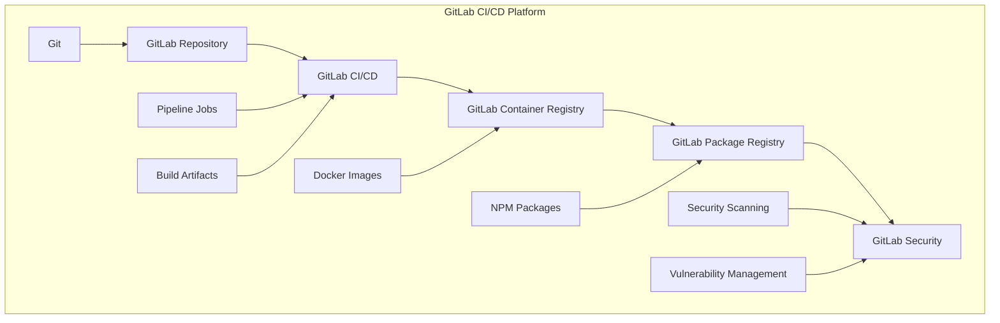

# GitLab CI/CD - Complete DevOps Platform

## 🦊 Overview
This section covers comprehensive GitLab CI/CD implementation for DevSecOps pipelines. It includes GitLab CI/CD, GitLab Container Registry, GitLab Package Registry, and GitLab Security features with detailed implementation guides and best practices for enterprise-grade automation.

## 🏗️ GitLab CI/CD Architecture



## 📁 Directory Structure

```
gitlab-ci/
├── README.md
├── pipeline-examples/
│   ├── basic-pipelines/
│   ├── multi-stage-pipelines/
│   ├── security-pipelines/
│   └── deployment-pipelines/
├── templates/
│   ├── build-templates/
│   ├── test-templates/
│   └── deploy-templates/
└── best-practices/
    ├── security/
    ├── performance/
    ├── organization/
    └── troubleshooting/
```

## 🛠️ GitLab CI/CD Fundamentals

### 1. Basic Pipeline Configuration
```yaml
# .gitlab-ci.yml
stages:
  - build
  - test
  - security
  - deploy

variables:
  DOCKER_DRIVER: overlay2
  DOCKER_TLS_CERTDIR: "/certs"
  NODE_VERSION: "18"

# Build stage
build:
  stage: build
  image: node:18
  script:
    - npm install
    - npm run build
  artifacts:
    paths:
      - dist/
    expire_in: 1 hour
  only:
    - main
    - develop

# Test stage
test:
  stage: test
  image: node:18
  script:
    - npm install
    - npm run test
    - npm run test:coverage
  coverage: '/Lines\s*:\s*(\d+\.\d+)%/'
  artifacts:
    reports:
      junit: junit.xml
      coverage_report:
        coverage_format: cobertura
        path: coverage/cobertura-coverage.xml
  only:
    - main
    - develop

# Security stage
security:
  stage: security
  image: node:18
  script:
    - npm audit --audit-level=high
    - npm run security-scan
  allow_failure: true
  only:
    - main
    - develop

# Deploy stage
deploy:
  stage: deploy
  image: alpine:latest
  script:
    - echo "Deploying to production..."
    - echo "Deployment completed successfully"
  only:
    - main
  when: manual
```

### 2. Advanced Pipeline with Docker
```yaml
# .gitlab-ci.yml - Advanced Docker Pipeline
stages:
  - build
  - test
  - security
  - package
  - deploy

variables:
  DOCKER_DRIVER: overlay2
  DOCKER_TLS_CERTDIR: "/certs"
  DOCKER_IMAGE: $CI_REGISTRY_IMAGE
  DOCKER_TAG: $CI_COMMIT_SHA

# Build Docker image
build:
  stage: build
  image: docker:latest
  services:
    - docker:dind
  before_script:
    - docker login -u $CI_REGISTRY_USER -p $CI_REGISTRY_PASSWORD $CI_REGISTRY
  script:
    - docker build -t $DOCKER_IMAGE:$DOCKER_TAG .
    - docker push $DOCKER_IMAGE:$DOCKER_TAG
    - docker tag $DOCKER_IMAGE:$DOCKER_TAG $DOCKER_IMAGE:latest
    - docker push $DOCKER_IMAGE:latest
  only:
    - main
    - develop

# Run tests in container
test:
  stage: test
  image: $DOCKER_IMAGE:$DOCKER_TAG
  script:
    - npm test
    - npm run test:integration
  artifacts:
    reports:
      junit: junit.xml
  only:
    - main
    - develop

# Security scanning
security:
  stage: security
  image: docker:latest
  services:
    - docker:dind
  script:
    - docker run --rm -v /var/run/docker.sock:/var/run/docker.sock
      aquasec/trivy image $DOCKER_IMAGE:$DOCKER_TAG
  allow_failure: true
  only:
    - main
    - develop

# Deploy to staging
deploy_staging:
  stage: deploy
  image: alpine:latest
  script:
    - echo "Deploying to staging environment..."
    - kubectl set image deployment/myapp myapp=$DOCKER_IMAGE:$DOCKER_TAG -n staging
    - kubectl rollout status deployment/myapp -n staging
  environment:
    name: staging
    url: https://staging.example.com
  only:
    - develop

# Deploy to production
deploy_production:
  stage: deploy
  image: alpine:latest
  script:
    - echo "Deploying to production environment..."
    - kubectl set image deployment/myapp myapp=$DOCKER_IMAGE:$DOCKER_TAG -n production
    - kubectl rollout status deployment/myapp -n production
  environment:
    name: production
    url: https://example.com
  only:
    - main
  when: manual
```

### 3. Multi-Project Pipeline
```yaml
# .gitlab-ci.yml - Multi-Project Pipeline
stages:
  - build
  - test
  - security
  - deploy

variables:
  DOCKER_IMAGE: $CI_REGISTRY_IMAGE
  DOCKER_TAG: $CI_COMMIT_SHA

# Build frontend
build_frontend:
  stage: build
  image: node:18
  script:
    - cd frontend
    - npm install
    - npm run build
  artifacts:
    paths:
      - frontend/dist/
    expire_in: 1 hour
  only:
    - main
    - develop

# Build backend
build_backend:
  stage: build
  image: node:18
  script:
    - cd backend
    - npm install
    - npm run build
  artifacts:
    paths:
      - backend/dist/
    expire_in: 1 hour
  only:
    - main
    - develop

# Test frontend
test_frontend:
  stage: test
  image: node:18
  script:
    - cd frontend
    - npm install
    - npm run test
  artifacts:
    reports:
      junit: frontend/junit.xml
  only:
    - main
    - develop

# Test backend
test_backend:
  stage: test
  image: node:18
  script:
    - cd backend
    - npm install
    - npm run test
  artifacts:
    reports:
      junit: backend/junit.xml
  only:
    - main
    - develop

# Security scanning
security_scan:
  stage: security
  image: docker:latest
  services:
    - docker:dind
  script:
    - docker build -t $DOCKER_IMAGE:$DOCKER_TAG .
    - docker run --rm -v /var/run/docker.sock:/var/run/docker.sock
      aquasec/trivy image $DOCKER_IMAGE:$DOCKER_TAG
  allow_failure: true
  only:
    - main
    - develop

# Deploy to staging
deploy_staging:
  stage: deploy
  image: alpine:latest
  script:
    - echo "Deploying to staging..."
    - kubectl apply -f k8s/staging/
  environment:
    name: staging
    url: https://staging.example.com
  only:
    - develop

# Deploy to production
deploy_production:
  stage: deploy
  image: alpine:latest
  script:
    - echo "Deploying to production..."
    - kubectl apply -f k8s/production/
  environment:
    name: production
    url: https://example.com
  only:
    - main
  when: manual
```

## 🔧 GitLab CI/CD Features

### 1. Container Registry Integration
```yaml
# .gitlab-ci.yml - Container Registry
build_and_push:
  stage: build
  image: docker:latest
  services:
    - docker:dind
  before_script:
    - docker login -u $CI_REGISTRY_USER -p $CI_REGISTRY_PASSWORD $CI_REGISTRY
  script:
    - docker build -t $CI_REGISTRY_IMAGE:$CI_COMMIT_SHA .
    - docker push $CI_REGISTRY_IMAGE:$CI_COMMIT_SHA
    - docker tag $CI_REGISTRY_IMAGE:$CI_COMMIT_SHA $CI_REGISTRY_IMAGE:latest
    - docker push $CI_REGISTRY_IMAGE:latest
  only:
    - main
    - develop
```

### 2. Package Registry Integration
```yaml
# .gitlab-ci.yml - Package Registry
publish_package:
  stage: package
  image: node:18
  script:
    - npm config set @myorg:registry $CI_API_V4_URL/projects/$CI_PROJECT_ID/packages/npm/
    - npm config set //$CI_API_V4_URL/projects/$CI_PROJECT_ID/packages/npm/:_authToken $CI_JOB_TOKEN
    - npm publish
  only:
    - main
```

### 3. Security Scanning
```yaml
# .gitlab-ci.yml - Security Scanning
security_scan:
  stage: security
  image: docker:latest
  services:
    - docker:dind
  script:
    - docker build -t $CI_REGISTRY_IMAGE:$CI_COMMIT_SHA .
    - docker run --rm -v /var/run/docker.sock:/var/run/docker.sock
      aquasec/trivy image $CI_REGISTRY_IMAGE:$CI_COMMIT_SHA
  artifacts:
    reports:
      container_scanning: gl-container-scanning-report.json
  only:
    - main
    - develop
```

### 4. Environment Management
```yaml
# .gitlab-ci.yml - Environment Management
deploy_staging:
  stage: deploy
  script:
    - echo "Deploying to staging..."
    - kubectl apply -f k8s/staging/
  environment:
    name: staging
    url: https://staging.example.com
    deployment_tier: testing
  only:
    - develop

deploy_production:
  stage: deploy
  script:
    - echo "Deploying to production..."
    - kubectl apply -f k8s/production/
  environment:
    name: production
    url: https://example.com
    deployment_tier: production
  only:
    - main
  when: manual
```

## 🧪 Hands-On Labs

### Lab 1: Basic GitLab CI/CD Setup
```bash
# Lab 1: Setting up basic GitLab CI/CD
# 1. Create GitLab project
# Go to https://gitlab.com
# Create new project
# Project name: DevSecOps-Project
# Visibility: Private

# 2. Clone repository
git clone https://gitlab.com/yourusername/DevSecOps-Project.git
cd DevSecOps-Project

# 3. Create basic application
npm init -y
npm install express

# 4. Create .gitlab-ci.yml
cat > .gitlab-ci.yml << 'EOF'
stages:
  - build
  - test
  - deploy

variables:
  NODE_VERSION: "18"

build:
  stage: build
  image: node:18
  script:
    - npm install
    - npm run build
  artifacts:
    paths:
      - dist/
    expire_in: 1 hour
  only:
    - main
    - develop

test:
  stage: test
  image: node:18
  script:
    - npm install
    - npm run test
  only:
    - main
    - develop

deploy:
  stage: deploy
  image: alpine:latest
  script:
    - echo "Deploying application..."
  only:
    - main
  when: manual
EOF

# 5. Create package.json
cat > package.json << 'EOF'
{
  "name": "gitlab-ci-lab",
  "version": "1.0.0",
  "scripts": {
    "build": "echo 'Building application...'",
    "test": "echo 'Running tests...'"
  },
  "dependencies": {
    "express": "^4.18.0"
  }
}
EOF

# 6. Commit and push
git add .
git commit -m "Add GitLab CI/CD pipeline"
git push origin main
```

### Lab 2: Docker Integration
```bash
# Lab 2: Adding Docker integration
# 1. Create Dockerfile
cat > Dockerfile << 'EOF'
FROM node:18-alpine
WORKDIR /app
COPY package*.json ./
RUN npm ci --only=production
COPY . .
EXPOSE 3000
CMD ["npm", "start"]
EOF

# 2. Update .gitlab-ci.yml
cat > .gitlab-ci.yml << 'EOF'
stages:
  - build
  - test
  - security
  - deploy

variables:
  DOCKER_DRIVER: overlay2
  DOCKER_TLS_CERTDIR: "/certs"
  DOCKER_IMAGE: $CI_REGISTRY_IMAGE
  DOCKER_TAG: $CI_COMMIT_SHA

build:
  stage: build
  image: docker:latest
  services:
    - docker:dind
  before_script:
    - docker login -u $CI_REGISTRY_USER -p $CI_REGISTRY_PASSWORD $CI_REGISTRY
  script:
    - docker build -t $DOCKER_IMAGE:$DOCKER_TAG .
    - docker push $DOCKER_IMAGE:$DOCKER_TAG
  only:
    - main
    - develop

test:
  stage: test
  image: $DOCKER_IMAGE:$DOCKER_TAG
  script:
    - npm test
  only:
    - main
    - develop

security:
  stage: security
  image: docker:latest
  services:
    - docker:dind
  script:
    - docker run --rm -v /var/run/docker.sock:/var/run/docker.sock
      aquasec/trivy image $DOCKER_IMAGE:$DOCKER_TAG
  allow_failure: true
  only:
    - main
    - develop

deploy:
  stage: deploy
  image: alpine:latest
  script:
    - echo "Deploying to production..."
  only:
    - main
  when: manual
EOF

# 3. Commit and push
git add .
git commit -m "Add Docker integration"
git push origin main
```

### Lab 3: Multi-Environment Deployment
```bash
# Lab 3: Multi-environment deployment
# 1. Create Kubernetes manifests
mkdir -p k8s/staging k8s/production

# 2. Create staging deployment
cat > k8s/staging/deployment.yaml << 'EOF'
apiVersion: apps/v1
kind: Deployment
metadata:
  name: myapp-staging
spec:
  replicas: 2
  selector:
    matchLabels:
      app: myapp
  template:
    metadata:
      labels:
        app: myapp
    spec:
      containers:
      - name: myapp
        image: $CI_REGISTRY_IMAGE:$CI_COMMIT_SHA
        ports:
        - containerPort: 3000
---
apiVersion: v1
kind: Service
metadata:
  name: myapp-staging-service
spec:
  selector:
    app: myapp
  ports:
  - port: 80
    targetPort: 3000
  type: LoadBalancer
EOF

# 3. Create production deployment
cat > k8s/production/deployment.yaml << 'EOF'
apiVersion: apps/v1
kind: Deployment
metadata:
  name: myapp-production
spec:
  replicas: 3
  selector:
    matchLabels:
      app: myapp
  template:
    metadata:
      labels:
        app: myapp
    spec:
      containers:
      - name: myapp
        image: $CI_REGISTRY_IMAGE:$CI_COMMIT_SHA
        ports:
        - containerPort: 3000
---
apiVersion: v1
kind: Service
metadata:
  name: myapp-production-service
spec:
  selector:
    app: myapp
  ports:
  - port: 80
    targetPort: 3000
  type: LoadBalancer
EOF

# 4. Update .gitlab-ci.yml
cat > .gitlab-ci.yml << 'EOF'
stages:
  - build
  - test
  - security
  - deploy

variables:
  DOCKER_DRIVER: overlay2
  DOCKER_TLS_CERTDIR: "/certs"
  DOCKER_IMAGE: $CI_REGISTRY_IMAGE
  DOCKER_TAG: $CI_COMMIT_SHA

build:
  stage: build
  image: docker:latest
  services:
    - docker:dind
  before_script:
    - docker login -u $CI_REGISTRY_USER -p $CI_REGISTRY_PASSWORD $CI_REGISTRY
  script:
    - docker build -t $DOCKER_IMAGE:$DOCKER_TAG .
    - docker push $DOCKER_IMAGE:$DOCKER_TAG
  only:
    - main
    - develop

test:
  stage: test
  image: $DOCKER_IMAGE:$DOCKER_TAG
  script:
    - npm test
  only:
    - main
    - develop

security:
  stage: security
  image: docker:latest
  services:
    - docker:dind
  script:
    - docker run --rm -v /var/run/docker.sock:/var/run/docker.sock
      aquasec/trivy image $DOCKER_IMAGE:$DOCKER_TAG
  allow_failure: true
  only:
    - main
    - develop

deploy_staging:
  stage: deploy
  image: alpine:latest
  script:
    - echo "Deploying to staging..."
    - kubectl apply -f k8s/staging/
  environment:
    name: staging
    url: https://staging.example.com
  only:
    - develop

deploy_production:
  stage: deploy
  image: alpine:latest
  script:
    - echo "Deploying to production..."
    - kubectl apply -f k8s/production/
  environment:
    name: production
    url: https://example.com
  only:
    - main
  when: manual
EOF

# 5. Commit and push
git add .
git commit -m "Add multi-environment deployment"
git push origin main
```

## 📊 Best Practices

### 1. Security Best Practices
- **Use CI/CD Variables**: Store sensitive data in GitLab CI/CD variables
- **Container Scanning**: Enable container vulnerability scanning
- **Dependency Scanning**: Scan for vulnerable dependencies
- **Secret Detection**: Use GitLab's secret detection feature
- **Access Control**: Implement proper access controls

### 2. Performance Best Practices
- **Parallel Jobs**: Use parallel execution where possible
- **Caching**: Cache dependencies and build artifacts
- **Resource Optimization**: Optimize pipeline steps
- **Monitoring**: Monitor pipeline performance
- **Cleanup**: Clean up old artifacts and images

### 3. Organization Best Practices
- **Templates**: Create reusable pipeline templates
- **Environments**: Use deployment environments
- **Approvals**: Implement approval gates
- **Documentation**: Document processes and procedures
- **Training**: Train team on GitLab CI/CD features

## 📚 Learning Resources

### Documentation
- [GitLab CI/CD Documentation](https://docs.gitlab.com/ee/ci/)
- [GitLab Container Registry](https://docs.gitlab.com/ee/user/packages/container_registry/)
- [GitLab Package Registry](https://docs.gitlab.com/ee/user/packages/)
- [GitLab Security](https://docs.gitlab.com/ee/user/application_security/)

### Community Resources
- [GitLab Community](https://forum.gitlab.com/)
- [Stack Overflow](https://stackoverflow.com/questions/tagged/gitlab-ci)
- [GitLab Issues](https://gitlab.com/gitlab-org/gitlab/-/issues)
- [GitHub](https://github.com/gitlab-org/gitlab)

## 🎓 Certification Preparation

### GitLab Certifications
- **GitLab Certified**: GitLab platform certification
- **DevOps Engineer**: General DevOps certification
- **CI/CD Specialist**: Continuous integration certification
- **Container Specialist**: Container platform certification

### Study Materials
- **Official Documentation**: GitLab CI/CD documentation
- **Practice Projects**: Hands-on GitLab CI/CD projects
- **GitLab Learn**: Free learning modules
- **Community Forums**: Expert discussions and Q&A

## 🤝 Contributing

### How to Contribute
1. **Fork the repository**
2. **Create a feature branch**
3. **Add GitLab CI/CD content or improvements**
4. **Submit a pull request**

### Contribution Areas
- **New pipeline examples**
- **Updated best practices**
- **Additional templates**
- **Improved documentation**

## 📞 Support

### Getting Help
- **Documentation**: Comprehensive guides in each folder
- **Issues**: GitHub issues for GitLab CI/CD problems
- **Discussions**: Community discussions for pipeline questions
- **Mentorship**: Connect with GitLab CI/CD experts

### Community Resources
- **Slack**: #gitlab-ci
- **Discord**: GitLab CI/CD Learning Community
- **LinkedIn**: GitLab CI/CD Professionals Group
- **YouTube**: GitLab CI/CD Tutorials Channel

---

**Ready to master GitLab CI/CD?** Start with basic pipelines and work your way up to advanced automation patterns!
