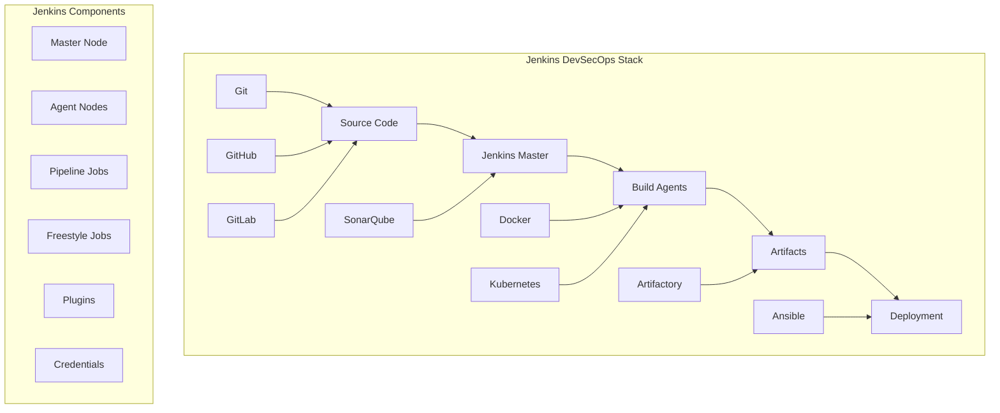

# Jenkins - Open Source Automation Server

## 🔧 Overview
This section covers comprehensive Jenkins implementation for DevSecOps pipelines. It includes Jenkins installation, configuration, pipeline development, plugin management, and best practices for enterprise-grade automation.

## 🏗️ Jenkins Architecture



## 📁 Directory Structure

```
jenkins/
├── README.md
├── pipeline-examples/
│   ├── declarative-pipelines/
│   ├── scripted-pipelines/
│   ├── multibranch-pipelines/
│   └── shared-libraries/
├── plugins/
│   ├── essential-plugins/
│   ├── security-plugins/
│   ├── deployment-plugins/
│   └── monitoring-plugins/
└── best-practices/
    ├── security/
    ├── performance/
    ├── maintenance/
    └── troubleshooting/
```

## 🛠️ Jenkins Installation and Setup

### 1. Docker Installation
```bash
# Install Jenkins with Docker
docker run -d \
  --name jenkins \
  -p 8080:8080 \
  -p 50000:50000 \
  -v jenkins_home:/var/jenkins_home \
  -v /var/run/docker.sock:/var/run/docker.sock \
  jenkins/jenkins:lts

# Get initial admin password
docker exec jenkins cat /var/jenkins_home/secrets/initialAdminPassword
```

### 2. Kubernetes Installation
```yaml
# jenkins-deployment.yaml
apiVersion: apps/v1
kind: Deployment
metadata:
  name: jenkins
  labels:
    app: jenkins
spec:
  replicas: 1
  selector:
    matchLabels:
      app: jenkins
  template:
    metadata:
      labels:
        app: jenkins
    spec:
      containers:
      - name: jenkins
        image: jenkins/jenkins:lts
        ports:
        - containerPort: 8080
        - containerPort: 50000
        volumeMounts:
        - name: jenkins-home
          mountPath: /var/jenkins_home
        - name: docker-sock
          mountPath: /var/run/docker.sock
        env:
        - name: JAVA_OPTS
          value: "-Djenkins.install.runSetupWizard=false"
      volumes:
      - name: jenkins-home
        persistentVolumeClaim:
          claimName: jenkins-pvc
      - name: docker-sock
        hostPath:
          path: /var/run/docker.sock
---
apiVersion: v1
kind: Service
metadata:
  name: jenkins-service
spec:
  selector:
    app: jenkins
  ports:
  - port: 8080
    targetPort: 8080
    nodePort: 30080
  type: NodePort
```

### 3. Ubuntu Installation
```bash
# Add Jenkins repository
wget -q -O - https://pkg.jenkins.io/debian/jenkins.io.key | sudo apt-key add -
sudo sh -c 'echo deb https://pkg.jenkins.io/debian binary/ > /etc/apt/sources.list.d/jenkins.list'

# Install Jenkins
sudo apt update
sudo apt install jenkins

# Start Jenkins
sudo systemctl start jenkins
sudo systemctl enable jenkins

# Check status
sudo systemctl status jenkins
```

## 🔧 Jenkins Configuration

### 1. Global Tool Configuration
```groovy
// Configure global tools
node {
    stage('Configure Tools') {
        // JDK Configuration
        def jdk = tool name: 'JDK-11', type: 'jdk'
        env.JAVA_HOME = jdk
        
        // Maven Configuration
        def maven = tool name: 'Maven-3.8', type: 'maven'
        env.MAVEN_HOME = maven
        
        // Docker Configuration
        sh 'docker --version'
        
        // Node.js Configuration
        def nodejs = tool name: 'NodeJS-18', type: 'nodejs'
        env.NODEJS_HOME = nodejs
    }
}
```

### 2. Credentials Management
```groovy
// Using credentials in pipeline
pipeline {
    agent any
    
    environment {
        DOCKER_REGISTRY = credentials('docker-registry')
        SONAR_TOKEN = credentials('sonar-token')
        AWS_ACCESS_KEY = credentials('aws-access-key')
        AWS_SECRET_KEY = credentials('aws-secret-key')
    }
    
    stages {
        stage('Build') {
            steps {
                sh 'docker login -u $DOCKER_REGISTRY_USR -p $DOCKER_REGISTRY_PSW'
                sh 'docker build -t myapp:${BUILD_NUMBER} .'
                sh 'docker push myapp:${BUILD_NUMBER}'
            }
        }
    }
}
```

### 3. Pipeline Libraries
```groovy
// Jenkinsfile using shared library
@Library('devsecops-library@main') _

pipeline {
    agent any
    
    stages {
        stage('Build') {
            steps {
                script {
                    devsecops.build()
                }
            }
        }
        
        stage('Test') {
            steps {
                script {
                    devsecops.test()
                }
            }
        }
        
        stage('Security Scan') {
            steps {
                script {
                    devsecops.securityScan()
                }
            }
        }
        
        stage('Deploy') {
            steps {
                script {
                    devsecops.deploy()
                }
            }
        }
    }
}
```

## 📋 Pipeline Examples

### 1. Declarative Pipeline
```groovy
// Jenkinsfile - Declarative Pipeline
pipeline {
    agent any
    
    environment {
        DOCKER_REGISTRY = 'your-registry.com'
        IMAGE_NAME = 'my-app'
        VERSION = "${env.BUILD_NUMBER}"
    }
    
    options {
        buildDiscarder(logRotator(numToKeepStr: '10'))
        timeout(time: 30, unit: 'MINUTES')
        timestamps()
        ansiColor('xterm')
    }
    
    stages {
        stage('Checkout') {
            steps {
                checkout scm
                script {
                    env.GIT_COMMIT_SHORT = sh(
                        script: 'git rev-parse --short HEAD',
                        returnStdout: true
                    ).trim()
                }
            }
        }
        
        stage('Build') {
            steps {
                script {
                    def image = docker.build("${IMAGE_NAME}:${VERSION}")
                    docker.withRegistry("https://${DOCKER_REGISTRY}", 'docker-registry') {
                        image.push()
                        image.push('latest')
                    }
                }
            }
        }
        
        stage('Test') {
            parallel {
                stage('Unit Tests') {
                    steps {
                        sh 'docker run --rm ${IMAGE_NAME}:${VERSION} npm test'
                    }
                }
                stage('Integration Tests') {
                    steps {
                        sh 'docker run --rm ${IMAGE_NAME}:${VERSION} npm run test:integration'
                    }
                }
            }
        }
        
        stage('Security Scan') {
            steps {
                sh 'trivy image --exit-code 0 --severity HIGH,CRITICAL ${IMAGE_NAME}:${VERSION}'
            }
        }
        
        stage('Deploy to Staging') {
            when {
                branch 'develop'
            }
            steps {
                sh 'kubectl set image deployment/my-app my-app=${DOCKER_REGISTRY}/${IMAGE_NAME}:${VERSION} -n staging'
                sh 'kubectl rollout status deployment/my-app -n staging'
            }
        }
        
        stage('Deploy to Production') {
            when {
                branch 'main'
            }
            steps {
                input message: 'Deploy to production?', ok: 'Deploy'
                sh 'kubectl set image deployment/my-app my-app=${DOCKER_REGISTRY}/${IMAGE_NAME}:${VERSION} -n production'
                sh 'kubectl rollout status deployment/my-app -n production'
            }
        }
    }
    
    post {
        always {
            cleanWs()
            script {
                if (env.BRANCH_NAME == 'main') {
                    slackSend channel: '#deployments',
                        color: 'good',
                        message: "✅ Deployment successful: ${env.BUILD_URL}"
                }
            }
        }
        failure {
            script {
                slackSend channel: '#deployments',
                    color: 'danger',
                    message: "❌ Deployment failed: ${env.BUILD_URL}"
            }
        }
    }
}
```

### 2. Scripted Pipeline
```groovy
// Jenkinsfile - Scripted Pipeline
node {
    def dockerImage
    def dockerRegistry = 'your-registry.com'
    def imageName = 'my-app'
    def version = env.BUILD_NUMBER
    
    stage('Checkout') {
        checkout scm
    }
    
    stage('Build') {
        dockerImage = docker.build("${imageName}:${version}")
    }
    
    stage('Test') {
        dockerImage.inside {
            sh 'npm test'
            sh 'npm run test:integration'
        }
    }
    
    stage('Security Scan') {
        sh "trivy image --exit-code 0 --severity HIGH,CRITICAL ${imageName}:${version}"
    }
    
    stage('Push') {
        docker.withRegistry("https://${dockerRegistry}", 'docker-registry') {
            dockerImage.push()
            dockerImage.push('latest')
        }
    }
    
    stage('Deploy') {
        if (env.BRANCH_NAME == 'main') {
            sh "kubectl set image deployment/my-app my-app=${dockerRegistry}/${imageName}:${version}"
            sh 'kubectl rollout status deployment/my-app'
        }
    }
}
```

### 3. Multibranch Pipeline
```groovy
// Jenkinsfile - Multibranch Pipeline
pipeline {
    agent any
    
    stages {
        stage('Build') {
            steps {
                echo "Building branch: ${env.BRANCH_NAME}"
                sh 'docker build -t my-app:${BUILD_NUMBER} .'
            }
        }
        
        stage('Test') {
            when {
                anyOf {
                    branch 'main'
                    branch 'develop'
                    branch 'feature/*'
                }
            }
            steps {
                sh 'docker run --rm my-app:${BUILD_NUMBER} npm test'
            }
        }
        
        stage('Deploy to Staging') {
            when {
                branch 'develop'
            }
            steps {
                sh 'kubectl set image deployment/my-app-staging my-app=my-app:${BUILD_NUMBER}'
            }
        }
        
        stage('Deploy to Production') {
            when {
                branch 'main'
            }
            steps {
                input message: 'Deploy to production?', ok: 'Deploy'
                sh 'kubectl set image deployment/my-app-prod my-app=my-app:${BUILD_NUMBER}'
            }
        }
    }
}
```

## 🔌 Essential Plugins

### 1. Build and Deployment Plugins
```groovy
// Plugin list for build and deployment
plugins = [
    'docker-plugin',
    'kubernetes-plugin',
    'ansible-plugin',
    'terraform-plugin',
    'aws-ecs-plugin',
    'azure-vm-agents-plugin',
    'google-compute-engine-plugin'
]
```

### 2. Security Plugins
```groovy
// Security plugin configuration
pipeline {
    agent any
    
    stages {
        stage('Security Scan') {
            steps {
                // OWASP Dependency Check
                dependencyCheck additionalArguments: '--format ALL --format HTML'
                dependencyCheckPublisher pattern: 'dependency-check-report.xml'
                
                // SonarQube Scan
                withSonarQubeEnv('SonarQube') {
                    sh 'mvn sonar:sonar'
                }
                
                // Trivy Security Scan
                sh 'trivy image --exit-code 0 --severity HIGH,CRITICAL my-app:latest'
            }
        }
    }
}
```

### 3. Notification Plugins
```groovy
// Notification configuration
pipeline {
    agent any
    
    post {
        success {
            slackSend channel: '#deployments',
                color: 'good',
                message: "✅ Build successful: ${env.BUILD_URL}"
        }
        failure {
            slackSend channel: '#deployments',
                color: 'danger',
                message: "❌ Build failed: ${env.BUILD_URL}"
        }
        always {
            emailext subject: "Build ${currentBuild.result}: ${env.JOB_NAME} - ${env.BUILD_NUMBER}",
                body: "Build ${currentBuild.result}: ${env.BUILD_URL}",
                to: "${env.CHANGE_AUTHOR_EMAIL}"
        }
    }
}
```

## 🧪 Hands-On Labs

### Lab 1: Jenkins Installation
```bash
# Lab 1: Installing Jenkins with Docker
# 1. Install Docker
sudo apt update
sudo apt install docker.io
sudo systemctl start docker
sudo systemctl enable docker

# 2. Run Jenkins
docker run -d \
  --name jenkins \
  -p 8080:8080 \
  -p 50000:50000 \
  -v jenkins_home:/var/jenkins_home \
  -v /var/run/docker.sock:/var/run/docker.sock \
  jenkins/jenkins:lts

# 3. Get initial password
docker exec jenkins cat /var/jenkins_home/secrets/initialAdminPassword

# 4. Access Jenkins
echo "Jenkins is available at http://localhost:8080"
echo "Use the password from step 3 to complete setup"
```

### Lab 2: Create First Pipeline
```bash
# Lab 2: Creating your first Jenkins pipeline
# 1. Create a new pipeline job
# Go to Jenkins UI -> New Item -> Pipeline

# 2. Configure pipeline
# Pipeline script from SCM
# SCM: Git
# Repository URL: https://github.com/your-repo/your-project.git
# Script Path: Jenkinsfile

# 3. Create Jenkinsfile
cat > Jenkinsfile << 'EOF'
pipeline {
    agent any
    
    stages {
        stage('Hello') {
            steps {
                echo 'Hello World!'
            }
        }
        
        stage('Build') {
            steps {
                sh 'echo "Building application..."'
            }
        }
        
        stage('Test') {
            steps {
                sh 'echo "Running tests..."'
            }
        }
    }
}
EOF

# 4. Commit and push
git add Jenkinsfile
git commit -m "Add Jenkinsfile"
git push origin main

# 5. Run the pipeline
# Go to Jenkins UI and click "Build Now"
```

### Lab 3: Docker Integration
```bash
# Lab 3: Jenkins with Docker integration
# 1. Install Docker plugin
# Go to Manage Jenkins -> Manage Plugins -> Available
# Search for "Docker" and install

# 2. Configure Docker
# Go to Manage Jenkins -> Configure System
# Add Docker installation

# 3. Create Docker pipeline
cat > Jenkinsfile << 'EOF'
pipeline {
    agent any
    
    stages {
        stage('Build Docker Image') {
            steps {
                script {
                    def image = docker.build("my-app:${env.BUILD_NUMBER}")
                }
            }
        }
        
        stage('Test Docker Image') {
            steps {
                sh 'docker run --rm my-app:${env.BUILD_NUMBER} echo "Testing image"'
            }
        }
        
        stage('Push Docker Image') {
            steps {
                script {
                    docker.withRegistry('https://your-registry.com', 'docker-registry') {
                        docker.image("my-app:${env.BUILD_NUMBER}").push()
                    }
                }
            }
        }
    }
}
EOF
```

## 📊 Monitoring and Maintenance

### 1. Jenkins Health Check
```groovy
// Health check script
pipeline {
    agent any
    
    stages {
        stage('Health Check') {
            steps {
                script {
                    def health = Jenkins.instance.getComputer().toList().findAll { it.isOnline() }
                    echo "Online agents: ${health.size()}"
                    
                    def diskSpace = Jenkins.instance.getRootPath().getDiskSpace()
                    echo "Disk space: ${diskSpace} bytes"
                    
                    def jobs = Jenkins.instance.getAllItems(Job.class)
                    echo "Total jobs: ${jobs.size()}"
                }
            }
        }
    }
}
```

### 2. Backup Configuration
```bash
# Backup Jenkins configuration
#!/bin/bash
BACKUP_DIR="/backup/jenkins"
JENKINS_HOME="/var/jenkins_home"
DATE=$(date +%Y%m%d_%H%M%S)

mkdir -p $BACKUP_DIR
tar -czf "$BACKUP_DIR/jenkins_backup_$DATE.tar.gz" -C $JENKINS_HOME .

# Keep only last 7 days of backups
find $BACKUP_DIR -name "jenkins_backup_*.tar.gz" -mtime +7 -delete
```

### 3. Performance Monitoring
```groovy
// Performance monitoring pipeline
pipeline {
    agent any
    
    stages {
        stage('Performance Check') {
            steps {
                script {
                    def metrics = [
                        'jenkins_builds_total',
                        'jenkins_build_duration_seconds',
                        'jenkins_queue_size',
                        'jenkins_executor_available'
                    ]
                    
                    metrics.each { metric ->
                        sh "curl -s http://localhost:8080/metrics | grep $metric"
                    }
                }
            }
        }
    }
}
```

## 📚 Learning Resources

### Documentation
- [Jenkins Documentation](https://www.jenkins.io/doc/)
- [Pipeline Documentation](https://www.jenkins.io/doc/book/pipeline/)
- [Plugin Documentation](https://plugins.jenkins.io/)
- [Blue Ocean Documentation](https://www.jenkins.io/projects/blueocean/)

### Best Practices
- **Pipeline as Code**: Store pipelines in version control
- **Security**: Implement proper security measures
- **Monitoring**: Set up comprehensive monitoring
- **Backup**: Regular backup of configurations
- **Performance**: Optimize for performance

### Community Resources
- [Jenkins Community](https://community.jenkins.io/)
- [Jenkins JIRA](https://issues.jenkins.io/)
- [Jenkins IRC](https://www.jenkins.io/chat/)
- [Stack Overflow](https://stackoverflow.com/questions/tagged/jenkins)

## 🎓 Certification Preparation

### Jenkins Certifications
- **Jenkins Engineer**: Jenkins automation certification
- **DevOps Engineer**: General DevOps certification
- **CI/CD Specialist**: Continuous integration certification
- **Automation Engineer**: Automation platform certification

### Study Materials
- **Official Documentation**: Jenkins documentation
- **Practice Projects**: Hands-on Jenkins projects
- **Plugin Development**: Learn to create custom plugins
- **Community Forums**: Expert discussions and Q&A

## 🤝 Contributing

### How to Contribute
1. **Fork the repository**
2. **Create a feature branch**
3. **Add Jenkins content or improvements**
4. **Submit a pull request**

### Contribution Areas
- **New pipeline examples**
- **Updated best practices**
- **Additional plugins**
- **Improved documentation**

## 📞 Support

### Getting Help
- **Documentation**: Comprehensive guides in each folder
- **Issues**: GitHub issues for Jenkins problems
- **Discussions**: Community discussions for Jenkins questions
- **Mentorship**: Connect with Jenkins experts

### Community Resources
- **Slack**: #jenkins
- **Discord**: Jenkins Learning Community
- **LinkedIn**: Jenkins Professionals Group
- **YouTube**: Jenkins Tutorials Channel

---

**Ready to master Jenkins?** Start with the basic installation and work your way up to advanced pipeline implementations!
