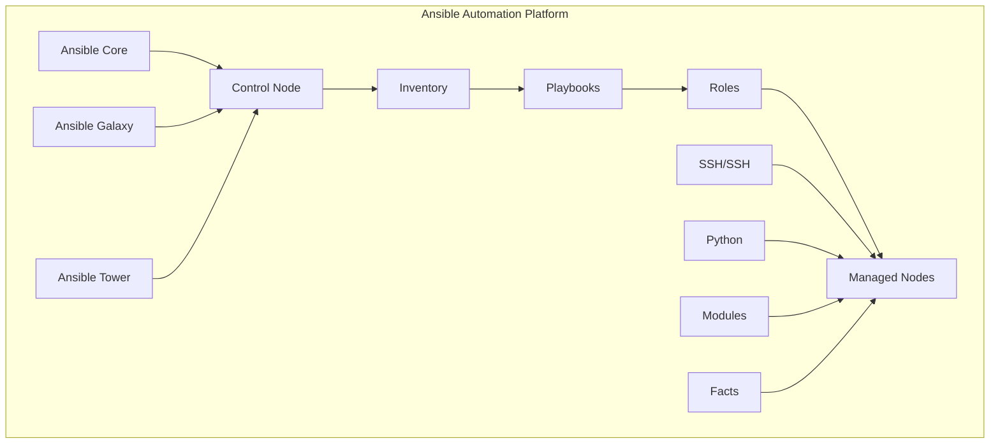

# Ansible - Configuration Management and Automation

## 🤖 Overview
This section covers comprehensive Ansible implementation for DevSecOps automation. It includes Ansible playbooks, roles, inventory management, and best practices for enterprise-grade configuration management and application deployment.

## 🏗️ Ansible Architecture



## 📁 Directory Structure

```
ansible/
├── README.md
├── playbooks/
│   ├── basic-setup/
│   ├── application-deployment/
│   ├── security-hardening/
│   └── monitoring-setup/
├── roles/
│   ├── common/
│   ├── nginx/
│   ├── docker/
│   └── kubernetes/
├── inventory/
│   ├── production/
│   ├── staging/
│   └── development/
└── best-practices/
    ├── security/
    ├── performance/
    ├── organization/
    └── troubleshooting/
```

## 🛠️ Ansible Fundamentals

### 1. Basic Playbook
```yaml
# playbooks/basic-setup.yml
---
- name: Basic Server Setup
  hosts: all
  become: yes
  gather_facts: yes
  
  vars:
    - user_name: "ansible"
    - user_groups: ["sudo", "docker"]
    - packages:
        - htop
        - vim
        - curl
        - wget
        - git
        - unzip
        - software-properties-common

  tasks:
    - name: Update package cache
      apt:
        update_cache: yes
        cache_valid_time: 3600
      when: ansible_os_family == "Debian"

    - name: Install essential packages
      package:
        name: "{{ packages }}"
        state: present

    - name: Create user
      user:
        name: "{{ user_name }}"
        groups: "{{ user_groups }}"
        shell: /bin/bash
        create_home: yes
        state: present

    - name: Add user to sudoers
      lineinfile:
        path: /etc/sudoers
        line: "{{ user_name }} ALL=(ALL) NOPASSWD:ALL"
        validate: 'visudo -cf %s'

    - name: Configure SSH
      lineinfile:
        path: /etc/ssh/sshd_config
        regexp: "{{ item.regexp }}"
        line: "{{ item.line }}"
        backup: yes
      loop:
        - { regexp: '^#?PermitRootLogin', line: 'PermitRootLogin no' }
        - { regexp: '^#?PasswordAuthentication', line: 'PasswordAuthentication no' }
        - { regexp: '^#?PubkeyAuthentication', line: 'PubkeyAuthentication yes' }
      notify: restart ssh

    - name: Enable UFW firewall
      ufw:
        state: enabled
        policy: deny
        direction: incoming

    - name: Allow SSH through firewall
      ufw:
        rule: allow
        port: "22"
        proto: tcp

  handlers:
    - name: restart ssh
      service:
        name: ssh
        state: restarted
```

### 2. Advanced Playbook with Roles
```yaml
# playbooks/application-deployment.yml
---
- name: Deploy Web Application
  hosts: web_servers
  become: yes
  gather_facts: yes
  
  vars:
    - app_name: "myapp"
    - app_version: "1.0.0"
    - app_port: 8080
    - app_user: "www-data"
    - app_dir: "/opt/{{ app_name }}"
    - nginx_config_path: "/etc/nginx/sites-available/{{ app_name }}"

  pre_tasks:
    - name: Update package cache
      apt:
        update_cache: yes
        cache_valid_time: 3600
      when: ansible_os_family == "Debian"

  roles:
    - role: common
      tags: [common, setup]
    
    - role: nginx
      tags: [nginx, web]
      vars:
        nginx_sites:
          - name: "{{ app_name }}"
            server_name: "{{ app_name }}.example.com"
            root: "{{ app_dir }}/dist"
            index: "index.html"
            location: "/"
            proxy_pass: "http://localhost:{{ app_port }}"
    
    - role: docker
      tags: [docker, containerization]
    
    - role: application
      tags: [app, deployment]
      vars:
        app_config:
          name: "{{ app_name }}"
          version: "{{ app_version }}"
          port: "{{ app_port }}"
          user: "{{ app_user }}"
          directory: "{{ app_dir }}"

  post_tasks:
    - name: Start application
      systemd:
        name: "{{ app_name }}"
        state: started
        enabled: yes

    - name: Verify application is running
      uri:
        url: "http://localhost:{{ app_port }}/health"
        method: GET
        status_code: 200
      retries: 5
      delay: 10
```

### 3. Inventory Management
```ini
# inventory/production/hosts.ini
[web_servers]
web1 ansible_host=10.0.1.10 ansible_user=ubuntu ansible_ssh_private_key_file=~/.ssh/production.pem
web2 ansible_host=10.0.1.11 ansible_user=ubuntu ansible_ssh_private_key_file=~/.ssh/production.pem
web3 ansible_host=10.0.1.12 ansible_user=ubuntu ansible_ssh_private_key_file=~/.ssh/production.pem

[db_servers]
db1 ansible_host=10.0.2.10 ansible_user=ubuntu ansible_ssh_private_key_file=~/.ssh/production.pem
db2 ansible_host=10.0.2.11 ansible_user=ubuntu ansible_ssh_private_key_file=~/.ssh/production.pem

[load_balancers]
lb1 ansible_host=10.0.3.10 ansible_user=ubuntu ansible_ssh_private_key_file=~/.ssh/production.pem

[all:vars]
ansible_python_interpreter=/usr/bin/python3
environment=production
```

```yaml
# inventory/production/group_vars/all.yml
---
# Global variables
ansible_user: ubuntu
ansible_ssh_private_key_file: ~/.ssh/production.pem
ansible_python_interpreter: /usr/bin/python3

# Environment specific
environment: production
domain: example.com

# Security
ssh_port: 22
firewall_enabled: true

# Application
app_name: myapp
app_version: 1.0.0
app_port: 8080

# Database
db_host: "{{ hostvars[groups['db_servers'][0]]['ansible_host'] }}"
db_port: 5432
db_name: myapp
db_user: myapp_user
```

```yaml
# inventory/production/group_vars/web_servers.yml
---
# Web server specific variables
nginx_worker_processes: auto
nginx_worker_connections: 1024
nginx_keepalive_timeout: 65

# SSL configuration
ssl_cert_path: /etc/ssl/certs/example.com.crt
ssl_key_path: /etc/ssl/private/example.com.key

# Application configuration
app_instances: 3
app_memory_limit: 512m
app_cpu_limit: 0.5
```

## 🔧 Ansible Roles

### 1. Common Role
```yaml
# roles/common/tasks/main.yml
---
- name: Update package cache
  apt:
    update_cache: yes
    cache_valid_time: 3600
  when: ansible_os_family == "Debian"

- name: Install essential packages
  package:
    name: "{{ common_packages }}"
    state: present

- name: Configure timezone
  timezone:
    name: "{{ timezone | default('UTC') }}"

- name: Configure NTP
  ntp:
    state: present
    ntpdate: yes

- name: Set hostname
  hostname:
    name: "{{ inventory_hostname }}"

- name: Configure hosts file
  lineinfile:
    path: /etc/hosts
    line: "{{ ansible_default_ipv4.address }} {{ inventory_hostname }}"
    regexp: "^{{ ansible_default_ipv4.address }}"

- name: Configure logrotate
  template:
    src: logrotate.conf.j2
    dest: /etc/logrotate.d/{{ app_name }}
    owner: root
    group: root
    mode: '0644'
```

```yaml
# roles/common/vars/main.yml
---
common_packages:
  - htop
  - vim
  - curl
  - wget
  - git
  - unzip
  - software-properties-common
  - apt-transport-https
  - ca-certificates
  - gnupg
  - lsb-release

timezone: UTC
```

### 2. Nginx Role
```yaml
# roles/nginx/tasks/main.yml
---
- name: Install Nginx
  package:
    name: nginx
    state: present

- name: Create Nginx configuration directory
  file:
    path: /etc/nginx/sites-available
    state: directory
    mode: '0755'

- name: Create Nginx sites enabled directory
  file:
    path: /etc/nginx/sites-enabled
    state: directory
    mode: '0755'

- name: Remove default Nginx site
  file:
    path: /etc/nginx/sites-enabled/default
    state: absent
  notify: restart nginx

- name: Configure Nginx sites
  template:
    src: "{{ item.name }}.conf.j2"
    dest: "/etc/nginx/sites-available/{{ item.name }}"
    owner: root
    group: root
    mode: '0644'
  loop: "{{ nginx_sites }}"
  notify: restart nginx

- name: Enable Nginx sites
  file:
    src: "/etc/nginx/sites-available/{{ item.name }}"
    dest: "/etc/nginx/sites-enabled/{{ item.name }}"
    state: link
  loop: "{{ nginx_sites }}"
  notify: restart nginx

- name: Test Nginx configuration
  command: nginx -t
  register: nginx_test
  changed_when: false

- name: Start and enable Nginx
  service:
    name: nginx
    state: started
    enabled: yes
```

```yaml
# roles/nginx/handlers/main.yml
---
- name: restart nginx
  service:
    name: nginx
    state: restarted

- name: reload nginx
  service:
    name: nginx
    state: reloaded
```

### 3. Docker Role
```yaml
# roles/docker/tasks/main.yml
---
- name: Install required packages
  package:
    name:
      - apt-transport-https
      - ca-certificates
      - curl
      - gnupg
      - lsb-release
    state: present

- name: Add Docker GPG key
  apt_key:
    url: https://download.docker.com/linux/ubuntu/gpg
    state: present

- name: Add Docker repository
  apt_repository:
    repo: "deb [arch=amd64] https://download.docker.com/linux/ubuntu {{ ansible_distribution_release }} stable"
    state: present

- name: Install Docker
  package:
    name:
      - docker-ce
      - docker-ce-cli
      - containerd.io
      - docker-compose-plugin
    state: present

- name: Start and enable Docker
  service:
    name: docker
    state: started
    enabled: yes

- name: Add user to docker group
  user:
    name: "{{ item }}"
    groups: docker
    append: yes
  loop: "{{ docker_users }}"

- name: Configure Docker daemon
  template:
    src: daemon.json.j2
    dest: /etc/docker/daemon.json
    owner: root
    group: root
    mode: '0644'
  notify: restart docker
```

## 🧪 Hands-On Labs

### Lab 1: Basic Ansible Setup
```bash
# Lab 1: Setting up basic Ansible
# 1. Install Ansible
# Ubuntu/Debian:
sudo apt update
sudo apt install ansible

# macOS:
brew install ansible

# 2. Create project directory
mkdir ansible-lab
cd ansible-lab

# 3. Create inventory file
cat > inventory.ini << 'EOF'
[web_servers]
web1 ansible_host=localhost ansible_connection=local
web2 ansible_host=localhost ansible_connection=local

[all:vars]
ansible_python_interpreter=/usr/bin/python3
EOF

# 4. Create basic playbook
cat > playbook.yml << 'EOF'
---
- name: Basic Server Setup
  hosts: all
  become: yes
  gather_facts: yes
  
  tasks:
    - name: Update package cache
      apt:
        update_cache: yes
        cache_valid_time: 3600
      when: ansible_os_family == "Debian"

    - name: Install essential packages
      package:
        name:
          - htop
          - vim
          - curl
          - wget
          - git
        state: present

    - name: Create test file
      file:
        path: /tmp/ansible-test.txt
        state: touch
        mode: '0644'
        content: "Ansible test file created on {{ ansible_date_time.iso8601 }}"
EOF

# 5. Run playbook
ansible-playbook -i inventory.ini playbook.yml
```

### Lab 2: Advanced Playbook
```bash
# Lab 2: Creating advanced playbook
# 1. Create roles directory structure
mkdir -p roles/common/{tasks,handlers,vars,templates,files}
mkdir -p roles/nginx/{tasks,handlers,vars,templates,files}

# 2. Create common role
cat > roles/common/tasks/main.yml << 'EOF'
---
- name: Update package cache
  apt:
    update_cache: yes
    cache_valid_time: 3600
  when: ansible_os_family == "Debian"

- name: Install essential packages
  package:
    name: "{{ common_packages }}"
    state: present

- name: Configure timezone
  timezone:
    name: "{{ timezone | default('UTC') }}"
EOF

cat > roles/common/vars/main.yml << 'EOF'
---
common_packages:
  - htop
  - vim
  - curl
  - wget
  - git
  - unzip
  - software-properties-common

timezone: UTC
EOF

# 3. Create nginx role
cat > roles/nginx/tasks/main.yml << 'EOF'
---
- name: Install Nginx
  package:
    name: nginx
    state: present

- name: Start and enable Nginx
  service:
    name: nginx
    state: started
    enabled: yes

- name: Configure Nginx
  template:
    src: nginx.conf.j2
    dest: /etc/nginx/nginx.conf
    owner: root
    group: root
    mode: '0644'
  notify: restart nginx
EOF

cat > roles/nginx/handlers/main.yml << 'EOF'
---
- name: restart nginx
  service:
    name: nginx
    state: restarted
EOF

# 4. Create main playbook
cat > main.yml << 'EOF'
---
- name: Configure Web Servers
  hosts: web_servers
  become: yes
  gather_facts: yes
  
  roles:
    - common
    - nginx
EOF

# 5. Run playbook
ansible-playbook -i inventory.ini main.yml
```

### Lab 3: Inventory Management
```bash
# Lab 3: Advanced inventory management
# 1. Create inventory directory structure
mkdir -p inventory/{production,staging,development}

# 2. Create production inventory
cat > inventory/production/hosts.ini << 'EOF'
[web_servers]
web1 ansible_host=10.0.1.10 ansible_user=ubuntu
web2 ansible_host=10.0.1.11 ansible_user=ubuntu

[db_servers]
db1 ansible_host=10.0.2.10 ansible_user=ubuntu

[all:vars]
ansible_python_interpreter=/usr/bin/python3
environment=production
EOF

# 3. Create group variables
cat > inventory/production/group_vars/all.yml << 'EOF'
---
ansible_user: ubuntu
ansible_python_interpreter: /usr/bin/python3
environment: production
domain: example.com
EOF

cat > inventory/production/group_vars/web_servers.yml << 'EOF'
---
nginx_worker_processes: auto
nginx_worker_connections: 1024
app_port: 8080
EOF

# 4. Create staging inventory
cat > inventory/staging/hosts.ini << 'EOF'
[web_servers]
web1 ansible_host=10.0.10.10 ansible_user=ubuntu

[all:vars]
ansible_python_interpreter=/usr/bin/python3
environment=staging
EOF

# 5. Run playbook with specific inventory
ansible-playbook -i inventory/production/hosts.ini main.yml
```

## 📊 Best Practices

### 1. Security Best Practices
- **SSH Key Management**: Use SSH keys instead of passwords
- **Vault Management**: Use Ansible Vault for sensitive data
- **Least Privilege**: Use minimal required permissions
- **Network Security**: Configure firewalls and security groups
- **Regular Updates**: Keep systems and packages updated

### 2. Performance Best Practices
- **Parallel Execution**: Use async tasks for long-running operations
- **Fact Caching**: Enable fact caching for better performance
- **Inventory Optimization**: Optimize inventory structure
- **Task Optimization**: Minimize unnecessary tasks
- **Resource Management**: Monitor resource usage

### 3. Organization Best Practices
- **Role Structure**: Organize code into reusable roles
- **Variable Management**: Use consistent variable naming
- **Documentation**: Document all playbooks and roles
- **Version Control**: Use proper version control practices
- **Testing**: Implement testing strategies

## 📚 Learning Resources

### Documentation
- [Ansible Documentation](https://docs.ansible.com/)
- [Ansible Galaxy](https://galaxy.ansible.com/)
- [Ansible Best Practices](https://docs.ansible.com/ansible/latest/user_guide/playbooks_best_practices.html)
- [Ansible Modules](https://docs.ansible.com/ansible/latest/modules/modules_by_category.html)

### Community Resources
- [Ansible Community](https://groups.google.com/forum/#!forum/ansible-project)
- [Stack Overflow](https://stackoverflow.com/questions/tagged/ansible)
- [Reddit](https://www.reddit.com/r/ansible/)
- [GitHub](https://github.com/ansible/ansible)

## 🎓 Certification Preparation

### Ansible Certifications
- **Red Hat Certified**: Ansible Automation Platform
- **DevOps Engineer**: General DevOps certification
- **Configuration Management**: Configuration management certification
- **Automation Engineer**: Automation platform certification

### Study Materials
- **Official Documentation**: Ansible documentation
- **Practice Labs**: Hands-on Ansible projects
- **Ansible Galaxy**: Community roles and collections
- **Community Forums**: Expert discussions and Q&A

## 🤝 Contributing

### How to Contribute
1. **Fork the repository**
2. **Create a feature branch**
3. **Add Ansible content or improvements**
4. **Submit a pull request**

### Contribution Areas
- **New playbook examples**
- **Updated best practices**
- **Additional roles**
- **Improved documentation**

## 📞 Support

### Getting Help
- **Documentation**: Comprehensive guides in each folder
- **Issues**: GitHub issues for Ansible problems
- **Discussions**: Community discussions for automation questions
- **Mentorship**: Connect with Ansible experts

### Community Resources
- **Slack**: #ansible
- **Discord**: Ansible Learning Community
- **LinkedIn**: Ansible Professionals Group
- **YouTube**: Ansible Tutorials Channel

---

**Ready to master Ansible?** Start with basic playbooks and work your way up to advanced automation patterns!
