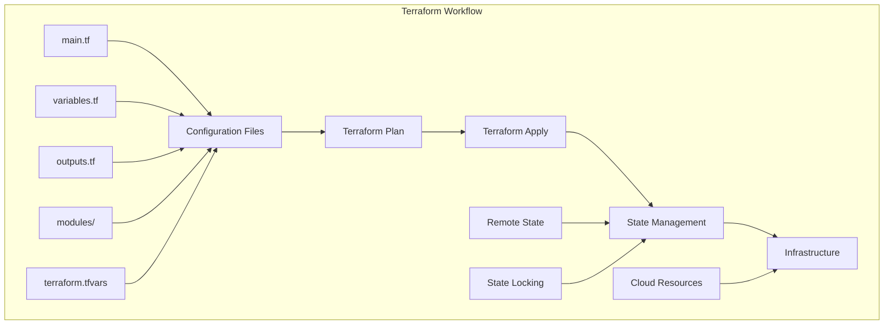

# Terraform - Infrastructure as Code Platform

## 🏗️ Overview
This section covers comprehensive Terraform implementation for DevSecOps infrastructure management. It includes Terraform basics, advanced patterns, state management, modules, and best practices for enterprise-grade infrastructure automation.

## 🏗️ Terraform Architecture



## 📁 Directory Structure

```
terraform/
├── README.md
├── examples/
│   ├── basic-infrastructure/
│   ├── multi-cloud/
│   ├── modules/
│   └── advanced-patterns/
├── modules/
│   ├── vpc/
│   ├── ec2/
│   ├── rds/
│   └── kubernetes/
└── best-practices/
    ├── security/
    ├── state-management/
    ├── organization/
    └── troubleshooting/
```

## 🛠️ Terraform Fundamentals

### 1. Basic Configuration
```hcl
# main.tf
terraform {
  required_version = ">= 1.0"
  required_providers {
    aws = {
      source  = "hashicorp/aws"
      version = "~> 5.0"
    }
  }
}

provider "aws" {
  region = var.aws_region
}

# VPC
resource "aws_vpc" "main" {
  cidr_block           = var.vpc_cidr
  enable_dns_hostnames = true
  enable_dns_support   = true

  tags = {
    Name        = "${var.project_name}-vpc"
    Environment = var.environment
  }
}

# Internet Gateway
resource "aws_internet_gateway" "main" {
  vpc_id = aws_vpc.main.id

  tags = {
    Name        = "${var.project_name}-igw"
    Environment = var.environment
  }
}

# Public Subnets
resource "aws_subnet" "public" {
  count = length(var.availability_zones)

  vpc_id                  = aws_vpc.main.id
  cidr_block              = var.public_subnet_cidrs[count.index]
  availability_zone       = var.availability_zones[count.index]
  map_public_ip_on_launch = true

  tags = {
    Name        = "${var.project_name}-public-subnet-${count.index + 1}"
    Environment = var.environment
    Type        = "Public"
  }
}

# Private Subnets
resource "aws_subnet" "private" {
  count = length(var.availability_zones)

  vpc_id            = aws_vpc.main.id
  cidr_block        = var.private_subnet_cidrs[count.index]
  availability_zone = var.availability_zones[count.index]

  tags = {
    Name        = "${var.project_name}-private-subnet-${count.index + 1}"
    Environment = var.environment
    Type        = "Private"
  }
}

# Route Table for Public Subnets
resource "aws_route_table" "public" {
  vpc_id = aws_vpc.main.id

  route {
    cidr_block = "0.0.0.0/0"
    gateway_id = aws_internet_gateway.main.id
  }

  tags = {
    Name        = "${var.project_name}-public-rt"
    Environment = var.environment
  }
}

# Route Table Association for Public Subnets
resource "aws_route_table_association" "public" {
  count = length(aws_subnet.public)

  subnet_id      = aws_subnet.public[count.index].id
  route_table_id = aws_route_table.public.id
}

# Security Group for Web Servers
resource "aws_security_group" "web" {
  name_prefix = "${var.project_name}-web-"
  vpc_id      = aws_vpc.main.id

  ingress {
    from_port   = 80
    to_port     = 80
    protocol    = "tcp"
    cidr_blocks = ["0.0.0.0/0"]
  }

  ingress {
    from_port   = 443
    to_port     = 443
    protocol    = "tcp"
    cidr_blocks = ["0.0.0.0/0"]
  }

  egress {
    from_port   = 0
    to_port     = 0
    protocol    = "-1"
    cidr_blocks = ["0.0.0.0/0"]
  }

  tags = {
    Name        = "${var.project_name}-web-sg"
    Environment = var.environment
  }
}

# EC2 Instance
resource "aws_instance" "web" {
  count = var.instance_count

  ami                    = var.ami_id
  instance_type          = var.instance_type
  subnet_id              = aws_subnet.public[count.index % length(aws_subnet.public)].id
  vpc_security_group_ids = [aws_security_group.web.id]
  key_name               = var.key_pair_name

  user_data = base64encode(templatefile("${path.module}/user_data.sh", {
    project_name = var.project_name
    environment  = var.environment
  }))

  tags = {
    Name        = "${var.project_name}-web-${count.index + 1}"
    Environment = var.environment
  }
}
```

### 2. Variables Configuration
```hcl
# variables.tf
variable "aws_region" {
  description = "AWS region"
  type        = string
  default     = "us-west-2"
}

variable "project_name" {
  description = "Name of the project"
  type        = string
}

variable "environment" {
  description = "Environment name"
  type        = string
  validation {
    condition     = contains(["dev", "staging", "prod"], var.environment)
    error_message = "Environment must be one of: dev, staging, prod."
  }
}

variable "vpc_cidr" {
  description = "CIDR block for VPC"
  type        = string
  default     = "10.0.0.0/16"
}

variable "availability_zones" {
  description = "List of availability zones"
  type        = list(string)
  default     = ["us-west-2a", "us-west-2b", "us-west-2c"]
}

variable "public_subnet_cidrs" {
  description = "CIDR blocks for public subnets"
  type        = list(string)
  default     = ["10.0.1.0/24", "10.0.2.0/24", "10.0.3.0/24"]
}

variable "private_subnet_cidrs" {
  description = "CIDR blocks for private subnets"
  type        = list(string)
  default     = ["10.0.11.0/24", "10.0.12.0/24", "10.0.13.0/24"]
}

variable "instance_count" {
  description = "Number of EC2 instances"
  type        = number
  default     = 2
}

variable "instance_type" {
  description = "EC2 instance type"
  type        = string
  default     = "t3.micro"
}

variable "ami_id" {
  description = "AMI ID for EC2 instances"
  type        = string
  default     = "ami-0c02fb55956c7d316" # Amazon Linux 2
}

variable "key_pair_name" {
  description = "Name of the AWS key pair"
  type        = string
}
```

### 3. Outputs Configuration
```hcl
# outputs.tf
output "vpc_id" {
  description = "ID of the VPC"
  value       = aws_vpc.main.id
}

output "vpc_cidr_block" {
  description = "CIDR block of the VPC"
  value       = aws_vpc.main.cidr_block
}

output "public_subnet_ids" {
  description = "IDs of the public subnets"
  value       = aws_subnet.public[*].id
}

output "private_subnet_ids" {
  description = "IDs of the private subnets"
  value       = aws_subnet.private[*].id
}

output "web_instance_ids" {
  description = "IDs of the web instances"
  value       = aws_instance.web[*].id
}

output "web_instance_public_ips" {
  description = "Public IP addresses of the web instances"
  value       = aws_instance.web[*].public_ip
}

output "web_instance_private_ips" {
  description = "Private IP addresses of the web instances"
  value       = aws_instance.web[*].private_ip
}
```

### 4. Terraform Configuration
```hcl
# terraform.tf
terraform {
  required_version = ">= 1.0"
  required_providers {
    aws = {
      source  = "hashicorp/aws"
      version = "~> 5.0"
    }
  }

  backend "s3" {
    bucket         = "my-terraform-state-bucket"
    key            = "devsecops/terraform.tfstate"
    region         = "us-west-2"
    encrypt        = true
    dynamodb_table = "terraform-state-lock"
  }
}
```

## 🔧 Advanced Terraform Patterns

### 1. Modules
```hcl
# modules/vpc/main.tf
resource "aws_vpc" "main" {
  cidr_block           = var.cidr_block
  enable_dns_hostnames = true
  enable_dns_support   = true

  tags = merge(var.tags, {
    Name = "${var.name}-vpc"
  })
}

resource "aws_internet_gateway" "main" {
  vpc_id = aws_vpc.main.id

  tags = merge(var.tags, {
    Name = "${var.name}-igw"
  })
}

resource "aws_subnet" "public" {
  count = length(var.availability_zones)

  vpc_id                  = aws_vpc.main.id
  cidr_block              = var.public_subnet_cidrs[count.index]
  availability_zone       = var.availability_zones[count.index]
  map_public_ip_on_launch = true

  tags = merge(var.tags, {
    Name = "${var.name}-public-subnet-${count.index + 1}"
    Type = "Public"
  })
}

resource "aws_subnet" "private" {
  count = length(var.availability_zones)

  vpc_id            = aws_vpc.main.id
  cidr_block        = var.private_subnet_cidrs[count.index]
  availability_zone = var.availability_zones[count.index]

  tags = merge(var.tags, {
    Name = "${var.name}-private-subnet-${count.index + 1}"
    Type = "Private"
  })
}
```

```hcl
# modules/vpc/variables.tf
variable "name" {
  description = "Name of the VPC"
  type        = string
}

variable "cidr_block" {
  description = "CIDR block for VPC"
  type        = string
}

variable "availability_zones" {
  description = "List of availability zones"
  type        = list(string)
}

variable "public_subnet_cidrs" {
  description = "CIDR blocks for public subnets"
  type        = list(string)
}

variable "private_subnet_cidrs" {
  description = "CIDR blocks for private subnets"
  type        = list(string)
}

variable "tags" {
  description = "Tags to apply to resources"
  type        = map(string)
  default     = {}
}
```

```hcl
# modules/vpc/outputs.tf
output "vpc_id" {
  description = "ID of the VPC"
  value       = aws_vpc.main.id
}

output "vpc_cidr_block" {
  description = "CIDR block of the VPC"
  value       = aws_vpc.main.cidr_block
}

output "public_subnet_ids" {
  description = "IDs of the public subnets"
  value       = aws_subnet.public[*].id
}

output "private_subnet_ids" {
  description = "IDs of the private subnets"
  value       = aws_subnet.private[*].id
}

output "internet_gateway_id" {
  description = "ID of the Internet Gateway"
  value       = aws_internet_gateway.main.id
}
```

### 2. Workspaces
```bash
# Create and use workspaces
terraform workspace new dev
terraform workspace new staging
terraform workspace new prod

# List workspaces
terraform workspace list

# Select workspace
terraform workspace select dev

# Show current workspace
terraform workspace show
```

### 3. Data Sources
```hcl
# data.tf
data "aws_ami" "amazon_linux" {
  most_recent = true
  owners      = ["amazon"]

  filter {
    name   = "name"
    values = ["amzn2-ami-hvm-*-x86_64-gp2"]
  }

  filter {
    name   = "virtualization-type"
    values = ["hvm"]
  }
}

data "aws_availability_zones" "available" {
  state = "available"
}

data "aws_caller_identity" "current" {}

data "aws_region" "current" {}
```

### 4. Local Values
```hcl
# locals.tf
locals {
  common_tags = {
    Project     = var.project_name
    Environment = var.environment
    ManagedBy   = "Terraform"
  }

  name_prefix = "${var.project_name}-${var.environment}"

  availability_zones = data.aws_availability_zones.available.names
}
```

## 🧪 Hands-On Labs

### Lab 1: Basic Terraform Setup
```bash
# Lab 1: Setting up basic Terraform infrastructure
# 1. Install Terraform
# Download from https://terraform.io/downloads
# Or use package manager:
# brew install terraform  # macOS
# apt-get install terraform  # Ubuntu

# 2. Create project directory
mkdir terraform-lab
cd terraform-lab

# 3. Create main.tf
cat > main.tf << 'EOF'
terraform {
  required_version = ">= 1.0"
  required_providers {
    aws = {
      source  = "hashicorp/aws"
      version = "~> 5.0"
    }
  }
}

provider "aws" {
  region = "us-west-2"
}

resource "aws_instance" "web" {
  ami           = "ami-0c02fb55956c7d316"
  instance_type = "t3.micro"

  tags = {
    Name = "terraform-lab-instance"
  }
}
EOF

# 4. Initialize Terraform
terraform init

# 5. Plan the deployment
terraform plan

# 6. Apply the configuration
terraform apply

# 7. Show the state
terraform show

# 8. Destroy the infrastructure
terraform destroy
```

### Lab 2: Advanced Configuration
```bash
# Lab 2: Advanced Terraform configuration
# 1. Create variables.tf
cat > variables.tf << 'EOF'
variable "aws_region" {
  description = "AWS region"
  type        = string
  default     = "us-west-2"
}

variable "instance_count" {
  description = "Number of instances"
  type        = number
  default     = 2
}

variable "instance_type" {
  description = "Instance type"
  type        = string
  default     = "t3.micro"
}
EOF

# 2. Create outputs.tf
cat > outputs.tf << 'EOF'
output "instance_ids" {
  description = "IDs of the instances"
  value       = aws_instance.web[*].id
}

output "instance_public_ips" {
  description = "Public IP addresses of the instances"
  value       = aws_instance.web[*].public_ip
}
EOF

# 3. Update main.tf
cat > main.tf << 'EOF'
terraform {
  required_version = ">= 1.0"
  required_providers {
    aws = {
      source  = "hashicorp/aws"
      version = "~> 5.0"
    }
  }
}

provider "aws" {
  region = var.aws_region
}

resource "aws_instance" "web" {
  count         = var.instance_count
  ami           = "ami-0c02fb55956c7d316"
  instance_type = var.instance_type

  tags = {
    Name = "terraform-lab-instance-${count.index + 1}"
  }
}
EOF

# 4. Create terraform.tfvars
cat > terraform.tfvars << 'EOF'
aws_region     = "us-west-2"
instance_count = 3
instance_type  = "t3.small"
EOF

# 5. Initialize and apply
terraform init
terraform plan
terraform apply
```

### Lab 3: Module Development
```bash
# Lab 3: Creating and using modules
# 1. Create module directory
mkdir -p modules/vpc
cd modules/vpc

# 2. Create module files
cat > main.tf << 'EOF'
resource "aws_vpc" "main" {
  cidr_block           = var.cidr_block
  enable_dns_hostnames = true
  enable_dns_support   = true

  tags = merge(var.tags, {
    Name = "${var.name}-vpc"
  })
}

resource "aws_internet_gateway" "main" {
  vpc_id = aws_vpc.main.id

  tags = merge(var.tags, {
    Name = "${var.name}-igw"
  })
}

resource "aws_subnet" "public" {
  count = length(var.availability_zones)

  vpc_id                  = aws_vpc.main.id
  cidr_block              = var.public_subnet_cidrs[count.index]
  availability_zone       = var.availability_zones[count.index]
  map_public_ip_on_launch = true

  tags = merge(var.tags, {
    Name = "${var.name}-public-subnet-${count.index + 1}"
    Type = "Public"
  })
}
EOF

cat > variables.tf << 'EOF'
variable "name" {
  description = "Name of the VPC"
  type        = string
}

variable "cidr_block" {
  description = "CIDR block for VPC"
  type        = string
}

variable "availability_zones" {
  description = "List of availability zones"
  type        = list(string)
}

variable "public_subnet_cidrs" {
  description = "CIDR blocks for public subnets"
  type        = list(string)
}

variable "tags" {
  description = "Tags to apply to resources"
  type        = map(string)
  default     = {}
}
EOF

cat > outputs.tf << 'EOF'
output "vpc_id" {
  description = "ID of the VPC"
  value       = aws_vpc.main.id
}

output "public_subnet_ids" {
  description = "IDs of the public subnets"
  value       = aws_subnet.public[*].id
}
EOF

# 3. Go back to root directory
cd ../..

# 4. Create main.tf using the module
cat > main.tf << 'EOF'
terraform {
  required_version = ">= 1.0"
  required_providers {
    aws = {
      source  = "hashicorp/aws"
      version = "~> 5.0"
    }
  }
}

provider "aws" {
  region = "us-west-2"
}

module "vpc" {
  source = "./modules/vpc"

  name                = "devsecops"
  cidr_block          = "10.0.0.0/16"
  availability_zones  = ["us-west-2a", "us-west-2b"]
  public_subnet_cidrs = ["10.0.1.0/24", "10.0.2.0/24"]

  tags = {
    Environment = "dev"
    Project     = "DevSecOps"
  }
}
EOF

# 5. Initialize and apply
terraform init
terraform plan
terraform apply
```

## 📊 Best Practices

### 1. Security Best Practices
- **State Management**: Use remote state with encryption
- **Secrets Management**: Use AWS Secrets Manager or HashiCorp Vault
- **Least Privilege**: Use minimal required permissions
- **Resource Tagging**: Implement consistent tagging strategy
- **Network Security**: Use security groups and NACLs properly

### 2. State Management Best Practices
- **Remote State**: Store state in S3 with versioning
- **State Locking**: Use DynamoDB for state locking
- **State Encryption**: Enable encryption for state files
- **State Backup**: Regular backups of state files
- **Workspace Isolation**: Use workspaces for environments

### 3. Organization Best Practices
- **Module Structure**: Organize code into reusable modules
- **Variable Management**: Use consistent variable naming
- **Output Management**: Define clear outputs
- **Documentation**: Document all modules and configurations
- **Version Control**: Use proper version control practices

## 📚 Learning Resources

### Documentation
- [Terraform Documentation](https://terraform.io/docs/)
- [AWS Provider Documentation](https://registry.terraform.io/providers/hashicorp/aws/latest/docs)
- [Terraform Modules](https://registry.terraform.io/)
- [Terraform Best Practices](https://terraform.io/docs/cloud/guides/recommended-practices/)

### Community Resources
- [Terraform Community](https://discuss.hashicorp.com/c/terraform-core)
- [Stack Overflow](https://stackoverflow.com/questions/tagged/terraform)
- [GitHub](https://github.com/hashicorp/terraform)
- [Reddit](https://www.reddit.com/r/Terraform/)

## 🎓 Certification Preparation

### Terraform Certifications
- **HashiCorp Certified**: Terraform Associate
- **AWS Certified**: Solutions Architect
- **Azure Certified**: Azure Administrator
- **GCP Certified**: Professional Cloud Architect

### Study Materials
- **Official Documentation**: Terraform documentation
- **Practice Labs**: Hands-on Terraform projects
- **HashiCorp Learn**: Free learning modules
- **Community Forums**: Expert discussions and Q&A

## 🤝 Contributing

### How to Contribute
1. **Fork the repository**
2. **Create a feature branch**
3. **Add Terraform content or improvements**
4. **Submit a pull request**

### Contribution Areas
- **New module examples**
- **Updated best practices**
- **Additional configurations**
- **Improved documentation**

## 📞 Support

### Getting Help
- **Documentation**: Comprehensive guides in each folder
- **Issues**: GitHub issues for Terraform problems
- **Discussions**: Community discussions for infrastructure questions
- **Mentorship**: Connect with Terraform experts

### Community Resources
- **Slack**: #terraform
- **Discord**: Terraform Learning Community
- **LinkedIn**: Terraform Professionals Group
- **YouTube**: Terraform Tutorials Channel

---

**Ready to master Terraform?** Start with basic configurations and work your way up to advanced infrastructure patterns!
