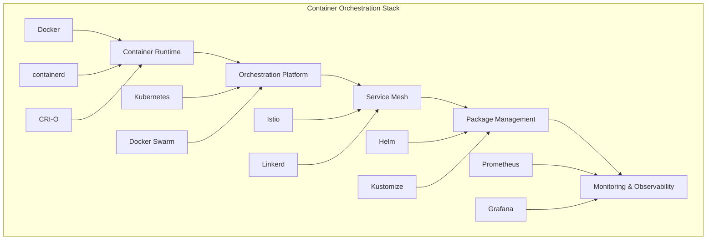

# Container Orchestration - Kubernetes and Container Platforms

## 🐳 Overview
This section covers comprehensive container orchestration tools and platforms for DevSecOps. It includes Kubernetes, Docker, Helm, Istio, and other container orchestration solutions with detailed implementation guides and best practices.

## 🏗️ Container Orchestration Architecture



## 📁 Directory Structure

```
05-container-orchestration/
├── README.md
├── kubernetes/
│   ├── README.md
│   ├── manifests/
│   ├── operators/
│   └── best-practices/
├── docker/
│   ├── README.md
│   ├── dockerfiles/
│   ├── compose/
│   └── best-practices/
├── helm/
│   ├── README.md
│   ├── charts/
│   ├── templates/
│   └── best-practices/
└── istio/
    ├── README.md
    ├── configurations/
    ├── policies/
    └── best-practices/
```

## 🛠️ Container Orchestration Tools

### 1. Kubernetes - Container Orchestration Platform

#### Key Features
- **Container Orchestration**: Automated container deployment and management
- **Service Discovery**: Built-in service discovery and load balancing
- **Scaling**: Horizontal and vertical scaling capabilities
- **Rolling Updates**: Zero-downtime deployments
- **Resource Management**: CPU and memory resource management

#### Kubernetes Components
```yaml
# kubernetes-architecture.yaml
apiVersion: v1
kind: Namespace
metadata:
  name: devsecops
---
apiVersion: apps/v1
kind: Deployment
metadata:
  name: web-app
  namespace: devsecops
spec:
  replicas: 3
  selector:
    matchLabels:
      app: web-app
  template:
    metadata:
      labels:
        app: web-app
    spec:
      containers:
      - name: web-app
        image: nginx:1.21
        ports:
        - containerPort: 80
        resources:
          requests:
            memory: "64Mi"
            cpu: "250m"
          limits:
            memory: "128Mi"
            cpu: "500m"
---
apiVersion: v1
kind: Service
metadata:
  name: web-app-service
  namespace: devsecops
spec:
  selector:
    app: web-app
  ports:
  - protocol: TCP
    port: 80
    targetPort: 80
  type: LoadBalancer
```

### 2. Docker - Container Platform

#### Key Features
- **Containerization**: Package applications with dependencies
- **Image Management**: Build, store, and distribute container images
- **Container Runtime**: Run containers in isolated environments
- **Docker Compose**: Multi-container application orchestration
- **Docker Swarm**: Native clustering and orchestration

#### Dockerfile Best Practices
```dockerfile
# Multi-stage Dockerfile
FROM node:18-alpine AS builder

# Set working directory
WORKDIR /app

# Copy package files
COPY package*.json ./

# Install dependencies
RUN npm ci --only=production && npm cache clean --force

# Copy source code
COPY . .

# Build application
RUN npm run build

# Production stage
FROM node:18-alpine AS production

# Create non-root user
RUN addgroup -g 1001 -S nodejs
RUN adduser -S nextjs -u 1001

# Set working directory
WORKDIR /app

# Copy built application
COPY --from=builder --chown=nextjs:nodejs /app/dist ./dist
COPY --from=builder --chown=nextjs:nodejs /app/node_modules ./node_modules
COPY --from=builder --chown=nextjs:nodejs /app/package.json ./package.json

# Switch to non-root user
USER nextjs

# Expose port
EXPOSE 3000

# Health check
HEALTHCHECK --interval=30s --timeout=3s --start-period=5s --retries=3 \
  CMD curl -f http://localhost:3000/health || exit 1

# Start application
CMD ["npm", "start"]
```

#### Docker Compose Configuration
```yaml
# docker-compose.yml
version: '3.8'

services:
  web:
    build: .
    ports:
      - "3000:3000"
    environment:
      - NODE_ENV=production
      - DATABASE_URL=postgresql://user:password@db:5432/myapp
    depends_on:
      - db
      - redis
    networks:
      - app-network

  db:
    image: postgres:13
    environment:
      - POSTGRES_DB=myapp
      - POSTGRES_USER=user
      - POSTGRES_PASSWORD=password
    volumes:
      - postgres_data:/var/lib/postgresql/data
    networks:
      - app-network

  redis:
    image: redis:6-alpine
    ports:
      - "6379:6379"
    networks:
      - app-network

  nginx:
    image: nginx:alpine
    ports:
      - "80:80"
      - "443:443"
    volumes:
      - ./nginx.conf:/etc/nginx/nginx.conf
      - ./ssl:/etc/nginx/ssl
    depends_on:
      - web
    networks:
      - app-network

volumes:
  postgres_data:

networks:
  app-network:
    driver: bridge
```

### 3. Helm - Kubernetes Package Manager

#### Key Features
- **Package Management**: Manage Kubernetes applications as packages
- **Templating**: Template-based configuration management
- **Versioning**: Application version management
- **Rollback**: Easy rollback to previous versions
- **Dependency Management**: Manage application dependencies

#### Helm Chart Structure
```
my-app/
├── Chart.yaml
├── values.yaml
├── values-dev.yaml
├── values-prod.yaml
├── templates/
│   ├── deployment.yaml
│   ├── service.yaml
│   ├── ingress.yaml
│   ├── configmap.yaml
│   ├── secret.yaml
│   └── _helpers.tpl
└── charts/
```

#### Helm Chart Example
```yaml
# Chart.yaml
apiVersion: v2
name: my-app
description: A Helm chart for My Application
type: application
version: 0.1.0
appVersion: "1.0.0"
dependencies:
- name: postgresql
  version: "10.0.0"
  repository: "https://charts.bitnami.com/bitnami"
```

```yaml
# values.yaml
replicaCount: 3

image:
  repository: my-app
  tag: "1.0.0"
  pullPolicy: IfNotPresent

service:
  type: ClusterIP
  port: 80

ingress:
  enabled: true
  className: "nginx"
  annotations:
    nginx.ingress.kubernetes.io/rewrite-target: /
  hosts:
    - host: my-app.example.com
      paths:
        - path: /
          pathType: Prefix
  tls:
    - secretName: my-app-tls
      hosts:
        - my-app.example.com

resources:
  limits:
    cpu: 500m
    memory: 512Mi
  requests:
    cpu: 250m
    memory: 256Mi

autoscaling:
  enabled: true
  minReplicas: 3
  maxReplicas: 10
  targetCPUUtilizationPercentage: 80
```

```yaml
# templates/deployment.yaml
apiVersion: apps/v1
kind: Deployment
metadata:
  name: {{ include "my-app.fullname" . }}
  labels:
    {{- include "my-app.labels" . | nindent 4 }}
spec:
  replicas: {{ .Values.replicaCount }}
  selector:
    matchLabels:
      {{- include "my-app.selectorLabels" . | nindent 6 }}
  template:
    metadata:
      labels:
        {{- include "my-app.selectorLabels" . | nindent 8 }}
    spec:
      containers:
      - name: {{ .Chart.Name }}
        image: "{{ .Values.image.repository }}:{{ .Values.image.tag | default .Chart.AppVersion }}"
        imagePullPolicy: {{ .Values.image.pullPolicy }}
        ports:
        - name: http
          containerPort: 80
          protocol: TCP
        livenessProbe:
          httpGet:
            path: /health
            port: http
        readinessProbe:
          httpGet:
            path: /ready
            port: http
        resources:
          {{- toYaml .Values.resources | nindent 12 }}
```

### 4. Istio - Service Mesh

#### Key Features
- **Traffic Management**: Advanced traffic routing and load balancing
- **Security**: mTLS encryption and authentication
- **Observability**: Metrics, logs, and distributed tracing
- **Policy Enforcement**: Rate limiting and access control
- **Canary Deployments**: Gradual traffic shifting

#### Istio Configuration
```yaml
# istio-gateway.yaml
apiVersion: networking.istio.io/v1alpha3
kind: Gateway
metadata:
  name: my-app-gateway
spec:
  selector:
    istio: ingressgateway
  servers:
  - port:
      number: 80
      name: http
      protocol: HTTP
    hosts:
    - my-app.example.com
  - port:
      number: 443
      name: https
      protocol: HTTPS
    tls:
      mode: SIMPLE
      credentialName: my-app-tls
    hosts:
    - my-app.example.com
---
apiVersion: networking.istio.io/v1alpha3
kind: VirtualService
metadata:
  name: my-app-vs
spec:
  hosts:
  - my-app.example.com
  gateways:
  - my-app-gateway
  http:
  - match:
    - uri:
        prefix: /
    route:
    - destination:
        host: my-app-service
        port:
          number: 80
```

#### Istio Security Policy
```yaml
# istio-security-policy.yaml
apiVersion: security.istio.io/v1beta1
kind: PeerAuthentication
metadata:
  name: default
  namespace: devsecops
spec:
  mtls:
    mode: STRICT
---
apiVersion: security.istio.io/v1beta1
kind: AuthorizationPolicy
metadata:
  name: my-app-authz
  namespace: devsecops
spec:
  selector:
    matchLabels:
      app: my-app
  rules:
  - from:
    - source:
        principals: ["cluster.local/ns/devsecops/sa/my-app-sa"]
    to:
    - operation:
        methods: ["GET", "POST"]
        paths: ["/api/*"]
```

## 🧪 Hands-On Labs

### Lab 1: Kubernetes Setup
```bash
# Lab 1: Setting up Kubernetes cluster
# 1. Install kubectl
curl -LO "https://dl.k8s.io/release/$(curl -L -s https://dl.k8s.io/release/stable.txt)/bin/linux/amd64/kubectl"
chmod +x kubectl
sudo mv kubectl /usr/local/bin/

# 2. Install minikube
curl -LO https://storage.googleapis.com/minikube/releases/latest/minikube-linux-amd64
sudo install minikube-linux-amd64 /usr/local/bin/minikube

# 3. Start minikube
minikube start --driver=docker

# 4. Verify installation
kubectl get nodes
kubectl get pods --all-namespaces

# 5. Deploy sample application
kubectl create deployment nginx --image=nginx
kubectl expose deployment nginx --port=80 --type=NodePort
kubectl get services
```

### Lab 2: Docker Multi-Container Application
```bash
# Lab 2: Creating multi-container application
# 1. Create project directory
mkdir docker-lab
cd docker-lab

# 2. Create Dockerfile
cat > Dockerfile << 'EOF'
FROM node:18-alpine
WORKDIR /app
COPY package*.json ./
RUN npm install
COPY . .
EXPOSE 3000
CMD ["npm", "start"]
EOF

# 3. Create package.json
cat > package.json << 'EOF'
{
  "name": "docker-lab",
  "version": "1.0.0",
  "scripts": {
    "start": "node server.js"
  },
  "dependencies": {
    "express": "^4.18.0"
  }
}
EOF

# 4. Create server.js
cat > server.js << 'EOF'
const express = require('express');
const app = express();
const port = 3000;

app.get('/', (req, res) => {
  res.send('Hello from Docker!');
});

app.listen(port, '0.0.0.0', () => {
  console.log(`Server running on port ${port}`);
});
EOF

# 5. Create docker-compose.yml
cat > docker-compose.yml << 'EOF'
version: '3.8'
services:
  web:
    build: .
    ports:
      - "3000:3000"
    environment:
      - NODE_ENV=production
  nginx:
    image: nginx:alpine
    ports:
      - "80:80"
    volumes:
      - ./nginx.conf:/etc/nginx/nginx.conf
    depends_on:
      - web
EOF

# 6. Create nginx.conf
cat > nginx.conf << 'EOF'
events {}
http {
  upstream web {
    server web:3000;
  }
  server {
    listen 80;
    location / {
      proxy_pass http://web;
    }
  }
}
EOF

# 7. Build and run
docker-compose up --build
```

### Lab 3: Helm Chart Creation
```bash
# Lab 3: Creating Helm chart
# 1. Install Helm
curl https://raw.githubusercontent.com/helm/helm/main/scripts/get-helm-3 | bash

# 2. Create Helm chart
helm create my-app
cd my-app

# 3. Customize values.yaml
cat > values.yaml << 'EOF'
replicaCount: 3

image:
  repository: nginx
  tag: "1.21"
  pullPolicy: IfNotPresent

service:
  type: ClusterIP
  port: 80

ingress:
  enabled: true
  className: "nginx"
  hosts:
    - host: my-app.local
      paths:
        - path: /
          pathType: Prefix

resources:
  limits:
    cpu: 500m
    memory: 512Mi
  requests:
    cpu: 250m
    memory: 256Mi
EOF

# 4. Install chart
helm install my-app . --values values.yaml

# 5. Check status
helm list
kubectl get pods
kubectl get services

# 6. Upgrade chart
helm upgrade my-app . --values values.yaml

# 7. Uninstall chart
helm uninstall my-app
```

## 📊 Monitoring and Observability

### 1. Prometheus Configuration
```yaml
# prometheus-config.yaml
apiVersion: v1
kind: ConfigMap
metadata:
  name: prometheus-config
data:
  prometheus.yml: |
    global:
      scrape_interval: 15s
    scrape_configs:
    - job_name: 'kubernetes-pods'
      kubernetes_sd_configs:
      - role: pod
      relabel_configs:
      - source_labels: [__meta_kubernetes_pod_annotation_prometheus_io_scrape]
        action: keep
        regex: true
      - source_labels: [__meta_kubernetes_pod_annotation_prometheus_io_path]
        action: replace
        target_label: __metrics_path__
        regex: (.+)
```

### 2. Grafana Dashboard
```json
{
  "dashboard": {
    "title": "Kubernetes Cluster Monitoring",
    "panels": [
      {
        "title": "Pod CPU Usage",
        "type": "graph",
        "targets": [
          {
            "expr": "rate(container_cpu_usage_seconds_total[5m])",
            "legendFormat": "{{pod}}"
          }
        ]
      },
      {
        "title": "Pod Memory Usage",
        "type": "graph",
        "targets": [
          {
            "expr": "container_memory_usage_bytes",
            "legendFormat": "{{pod}}"
          }
        ]
      }
    ]
  }
}
```

## 📚 Learning Resources

### Documentation
- [Kubernetes Documentation](https://kubernetes.io/docs/)
- [Docker Documentation](https://docs.docker.com/)
- [Helm Documentation](https://helm.sh/docs/)
- [Istio Documentation](https://istio.io/docs/)

### Best Practices
- **Security**: Implement proper security measures
- **Resource Management**: Set appropriate resource limits
- **Monitoring**: Set up comprehensive monitoring
- **Backup**: Regular backup of configurations
- **Documentation**: Maintain clear documentation

### Community Resources
- [Kubernetes Community](https://kubernetes.io/community/)
- [Docker Community](https://www.docker.com/community/)
- [Helm Community](https://helm.sh/community/)
- [Istio Community](https://istio.io/community/)

## 🎓 Certification Preparation

### Container Orchestration Certifications
- **CKA**: Certified Kubernetes Administrator
- **CKS**: Certified Kubernetes Security Specialist
- **CKAD**: Certified Kubernetes Application Developer
- **Docker Certified**: Docker platform certification

### Study Materials
- **Official Documentation**: Tool-specific documentation
- **Practice Labs**: Hands-on container orchestration projects
- **Kubernetes Challenges**: Practice with real-world scenarios
- **Community Forums**: Expert discussions and Q&A

## 🤝 Contributing

### How to Contribute
1. **Fork the repository**
2. **Create a feature branch**
3. **Add container orchestration content or improvements**
4. **Submit a pull request**

### Contribution Areas
- **New orchestration examples**
- **Updated best practices**
- **Additional monitoring configurations**
- **Improved documentation**

## 📞 Support

### Getting Help
- **Documentation**: Comprehensive guides in each tool folder
- **Issues**: GitHub issues for container orchestration problems
- **Discussions**: Community discussions for orchestration questions
- **Mentorship**: Connect with container orchestration experts

### Community Resources
- **Slack**: #container-orchestration
- **Discord**: Container Learning Community
- **LinkedIn**: Container Professionals Group
- **YouTube**: Container Tutorials Channel

---

**Ready to master container orchestration?** Start with Docker basics and work your way up to advanced Kubernetes implementations!
