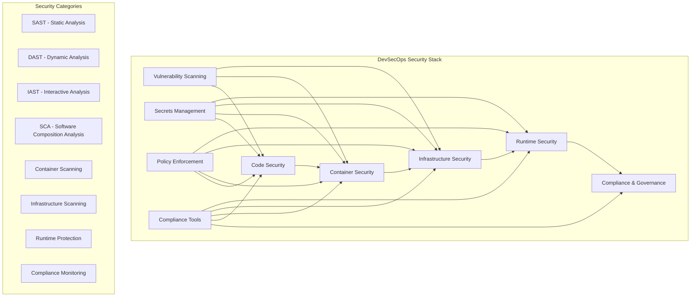
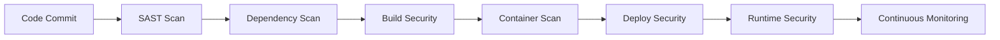
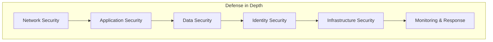

# DevSecOps Security Tools - Comprehensive Security Stack

## 🔒 Overview
This section covers the complete security tools ecosystem for DevSecOps, including vulnerability scanning, secrets management, policy enforcement, and compliance tools. These tools are essential for implementing security throughout the development lifecycle and ensuring compliance with industry standards.

## 🏗️ Security Tools Architecture



## 📁 Directory Structure

```
06-security-tools/
├── README.md
├── vulnerability-scanning/
│   ├── sast-tools/
│   ├── dast-tools/
│   ├── iast-tools/
│   ├── sca-tools/
│   └── container-scanning/
├── secrets-management/
│   ├── vault-solutions/
│   ├── cloud-secrets/
│   ├── key-management/
│   └── rotation-tools/
├── policy-enforcement/
│   ├── opa-gatekeeper/
│   ├── falco/
│   ├── admission-controllers/
│   └── policy-as-code/
└── compliance-tools/
    ├── openscap/
    ├── inspec/
    ├── chef-compliance/
    └── custom-frameworks/
```

## 🛠️ Security Tool Categories

### 1. Vulnerability Scanning Tools

#### Static Application Security Testing (SAST)
- **SonarQube**: Code quality and security analysis
- **Checkmarx**: Enterprise SAST platform
- **Veracode**: Cloud-based security testing
- **Semgrep**: Fast, customizable static analysis
- **CodeQL**: GitHub's semantic code analysis

#### Dynamic Application Security Testing (DAST)
- **OWASP ZAP**: Open-source web application scanner
- **Burp Suite**: Professional web security testing
- **Nessus**: Vulnerability scanner
- **Nuclei**: Fast vulnerability scanner
- **Acunetix**: Web application security scanner

#### Interactive Application Security Testing (IAST)
- **Contrast Security**: Runtime application security
- **Hdiv**: Interactive security testing
- **Synopsys Seeker**: IAST and RASP platform
- **Checkmarx IAST**: Interactive security testing

#### Software Composition Analysis (SCA)
- **Snyk**: Developer-first security platform
- **WhiteSource**: Open source security management
- **Black Duck**: Software composition analysis
- **FOSSA**: Open source compliance and security
- **Dependabot**: Automated dependency updates

#### Container Security Scanning
- **Trivy**: Comprehensive vulnerability scanner
- **Clair**: Container vulnerability analysis
- **Anchore**: Container security platform
- **Twistlock**: Cloud-native security platform
- **Aqua Security**: Container security platform

### 2. Secrets Management Tools

#### Vault Solutions
- **HashiCorp Vault**: Secrets and identity management
- **CyberArk**: Privileged access management
- **AWS Secrets Manager**: Cloud secrets management
- **Azure Key Vault**: Microsoft's key management
- **Google Secret Manager**: GCP secrets management

#### Key Management
- **AWS KMS**: Key management service
- **Azure Key Vault**: Key and secret management
- **Google Cloud KMS**: Key management service
- **Thales CipherTrust**: Enterprise key management
- **Fortanix**: Confidential computing platform

### 3. Policy Enforcement Tools

#### Policy as Code
- **Open Policy Agent (OPA)**: Policy engine
- **Gatekeeper**: Kubernetes policy enforcement
- **Conftest**: Policy testing framework
- **Terraform Sentinel**: Policy as code for Terraform
- **Pulumi Policy**: Policy as code for Pulumi

#### Runtime Security
- **Falco**: Runtime security monitoring
- **Aqua Security**: Cloud-native security
- **Twistlock**: Container security
- **Sysdig**: Container and cloud security
- **Prisma Cloud**: Cloud security platform

#### Admission Controllers
- **Kubernetes Admission Controllers**: Built-in policy enforcement
- **OPA Gatekeeper**: Policy enforcement for Kubernetes
- **Kyverno**: Kubernetes policy management
- **Polaris**: Kubernetes best practices
- **K-rail**: Kubernetes security policies

### 4. Compliance Tools

#### Compliance Frameworks
- **OpenSCAP**: Security compliance framework
- **InSpec**: Compliance testing framework
- **Chef Compliance**: Compliance automation
- **NIST Cybersecurity Framework**: Security framework
- **CIS Benchmarks**: Security configuration guidelines

#### Audit Tools
- **Lynis**: Security auditing tool
- **CIS-CAT**: Configuration assessment tool
- **Nessus**: Vulnerability assessment
- **OpenVAS**: Vulnerability scanner
- **Nmap**: Network discovery and security auditing

## 🔒 Security Implementation Patterns

### Shift-Left Security


### Defense in Depth


## 🚀 Implementation Examples

### SonarQube Integration
```yaml
# sonarqube-pipeline.yml
name: Security Scan Pipeline
on:
  push:
    branches: [ main, develop ]
  pull_request:
    branches: [ main ]

jobs:
  security-scan:
    runs-on: ubuntu-latest
    steps:
    - uses: actions/checkout@v3
      with:
        fetch-depth: 0
    
    - name: SonarQube Scan
      uses: SonarSource/sonarqube-scan-action@master
      env:
        GITHUB_TOKEN: ${{ secrets.GITHUB_TOKEN }}
        SONAR_TOKEN: ${{ secrets.SONAR_TOKEN }}
        SONAR_HOST_URL: ${{ secrets.SONAR_HOST_URL }}
```

### Trivy Container Scanning
```yaml
# trivy-scan.yml
name: Container Security Scan
on:
  push:
    branches: [ main ]
  pull_request:
    branches: [ main ]

jobs:
  trivy-scan:
    runs-on: ubuntu-latest
    steps:
    - uses: actions/checkout@v3
    
    - name: Build Docker image
      run: docker build -t myapp:${{ github.sha }} .
    
    - name: Run Trivy vulnerability scanner
      uses: aquasecurity/trivy-action@master
      with:
        image-ref: 'myapp:${{ github.sha }}'
        format: 'sarif'
        output: 'trivy-results.sarif'
    
    - name: Upload Trivy scan results
      uses: github/codeql-action/upload-sarif@v2
      with:
        sarif_file: 'trivy-results.sarif'
```

### OPA Policy Example
```rego
# security-policy.rego
package kubernetes.admission

import rego.v1

deny[msg] {
    input.request.kind.kind == "Pod"
    input.request.operation == "CREATE"
    not input.request.object.spec.securityContext.runAsNonRoot
    msg := "Containers must run as non-root user"
}

deny[msg] {
    input.request.kind.kind == "Pod"
    input.request.operation == "CREATE"
    input.request.object.spec.containers[_].securityContext.privileged == true
    msg := "Privileged containers are not allowed"
}

deny[msg] {
    input.request.kind.kind == "Pod"
    input.request.operation == "CREATE"
    not input.request.object.spec.securityContext.seccompProfile.type
    msg := "Seccomp profile must be specified"
}
```

### HashiCorp Vault Configuration
```hcl
# vault-config.hcl
storage "consul" {
  address = "127.0.0.1:8500"
  path    = "vault/"
}

listener "tcp" {
  address     = "127.0.0.1:8200"
  tls_disable = 1
}

api_addr = "http://127.0.0.1:8200"
cluster_addr = "https://127.0.0.1:8201"
ui = true
```

## 🧪 Hands-On Labs

### Beginner Lab: Basic Security Scanning
```bash
# Lab 1: Setting up basic security scanning
# 1. Install Trivy
curl -sfL https://raw.githubusercontent.com/aquasecurity/trivy/main/contrib/install.sh | sh -s -- -b /usr/local/bin

# 2. Scan a Docker image
trivy image nginx:latest

# 3. Scan a directory
trivy fs .

# 4. Generate SARIF report
trivy image --format sarif --output trivy-results.sarif nginx:latest

# 5. Install SonarQube
docker run -d --name sonarqube -p 9000:9000 sonarqube:latest
```

### Intermediate Lab: Policy Enforcement
```bash
# Lab 2: Implementing policy enforcement
# 1. Install OPA
curl -L -o opa https://openpolicyagent.org/downloads/latest/opa_linux_amd64
chmod 755 opa
sudo mv opa /usr/local/bin/

# 2. Install Gatekeeper
kubectl apply -f https://raw.githubusercontent.com/open-policy-agent/gatekeeper/release-3.14/deploy/gatekeeper.yaml

# 3. Create policy template
kubectl apply -f - <<EOF
apiVersion: templates.gatekeeper.sh/v1beta1
kind: ConstraintTemplate
metadata:
  name: k8srequiredlabels
spec:
  crd:
    spec:
      names:
        kind: K8sRequiredLabels
      validation:
        properties:
          labels:
            type: array
            items:
              type: string
  targets:
    - target: admission.k8s.gatekeeper.sh
      rego: |
        package k8srequiredlabels
        violation[{"msg": msg}] {
          required := input.parameters.labels
          provided := input.review.object.metadata.labels
          missing := required[_]
          not provided[missing]
          msg := sprintf("Missing required label: %v", [missing])
        }
EOF

# 4. Create constraint
kubectl apply -f - <<EOF
apiVersion: config.gatekeeper.sh/v1beta1
kind: K8sRequiredLabels
metadata:
  name: must-have-labels
spec:
  match:
    kinds:
      - apiGroups: [""]
        kinds: ["Pod"]
  parameters:
    labels: ["app", "version"]
EOF
```

### Advanced Lab: Comprehensive Security Stack
```bash
# Lab 3: Building comprehensive security stack
# 1. Set up HashiCorp Vault
docker run -d --name vault -p 8200:8200 -e 'VAULT_DEV_ROOT_TOKEN_ID=myroot' vault:latest

# 2. Configure Vault
export VAULT_ADDR='http://127.0.0.1:8200'
export VAULT_TOKEN='myroot'

# 3. Enable Kubernetes auth
vault auth enable kubernetes

# 4. Create secret
vault kv put secret/myapp/config username=admin password=secret

# 5. Install Falco
kubectl create ns falco
helm repo add falcosecurity https://falcosecurity.github.io/charts
helm install falco falcosecurity/falco -n falco

# 6. Configure Falco rules
kubectl apply -f - <<EOF
apiVersion: v1
kind: ConfigMap
metadata:
  name: falco-custom-rules
  namespace: falco
data:
  custom-rules.yaml: |
    - rule: Unauthorized process in container
      desc: Detect unauthorized processes in containers
      condition: >
        spawned_process and
        container and
        not proc.name in (nginx, apache, node, python, java)
      output: >
        Unauthorized process in container (user=%user.name
        command=%proc.cmdline container=%container.name)
      priority: WARNING
EOF
```

## 📊 Security Metrics and KPIs

### Security Metrics
- **Vulnerability Count**: Total vulnerabilities by severity
- **Mean Time to Detection (MTTD)**: Time to detect security issues
- **Mean Time to Response (MTTR)**: Time to respond to security incidents
- **Security Test Coverage**: Percentage of code covered by security tests
- **Compliance Score**: Percentage of compliance requirements met

### Security KPIs
- **Zero Critical Vulnerabilities**: No critical vulnerabilities in production
- **100% Container Scanning**: All containers scanned before deployment
- **Secrets Rotation**: Regular rotation of secrets and keys
- **Policy Compliance**: 100% compliance with security policies
- **Incident Response**: < 1 hour response time for security incidents

## 🎓 Certification Preparation

### Security Certifications
- **CISSP**: Certified Information Systems Security Professional
- **CISM**: Certified Information Security Manager
- **CISA**: Certified Information Systems Auditor
- **CEH**: Certified Ethical Hacker
- **OSCP**: Offensive Security Certified Professional

### DevSecOps Certifications
- **AWS Security Specialty**: AWS security certification
- **Azure Security Engineer**: Azure security certification
- **GCP Security Engineer**: Google Cloud security certification
- **CKS**: Certified Kubernetes Security Specialist
- **CKA**: Certified Kubernetes Administrator

## 📚 Learning Resources

### Documentation
- [OWASP Top 10](https://owasp.org/www-project-top-ten/)
- [NIST Cybersecurity Framework](https://www.nist.gov/cyberframework)
- [CIS Controls](https://www.cisecurity.org/controls/)
- [Kubernetes Security Best Practices](https://kubernetes.io/docs/concepts/security/)

### Training Resources
- [SANS Security Training](https://www.sans.org/)
- [Cybrary Security Training](https://www.cybrary.it/)
- [Pluralsight Security](https://www.pluralsight.com/browse/cybersecurity)
- [Coursera Security Courses](https://www.coursera.org/browse/computer-science/cybersecurity)

### Tools Documentation
- [Trivy Documentation](https://trivy.dev/)
- [SonarQube Documentation](https://docs.sonarqube.org/)
- [OPA Documentation](https://www.openpolicyagent.org/docs/)
- [Vault Documentation](https://www.vaultproject.io/docs/)

## 🤝 Contributing

### How to Contribute
1. **Fork the repository**
2. **Create a feature branch**
3. **Add security tool content or improvements**
4. **Submit a pull request**

### Contribution Areas
- **New security tools** documentation
- **Updated security policies**
- **Additional hands-on labs**
- **Security best practices**

## 📞 Support

### Getting Help
- **Documentation**: Comprehensive guides in each tool folder
- **Issues**: GitHub issues for bug reports and feature requests
- **Discussions**: Community discussions for security questions
- **Mentorship**: Connect with security experts

### Community Resources
- **Slack**: #security-tools
- **Discord**: Security Learning Community
- **LinkedIn**: Security Professionals Group
- **YouTube**: Security Tutorials Channel

---

**Ready to secure your DevSecOps pipeline?** Start with the vulnerability scanning tools and work your way through the complete security stack!
