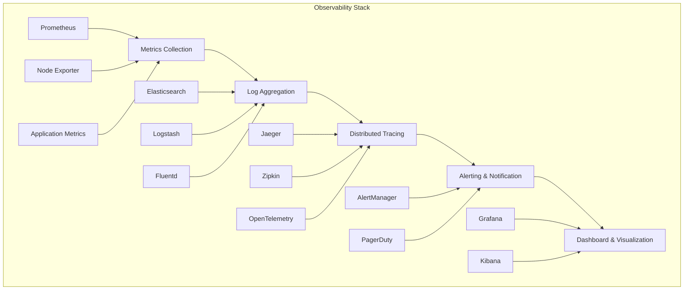

# Monitoring & Observability - Complete Observability Stack

## 📊 Overview
This section covers comprehensive monitoring and observability tools for DevSecOps. It includes Prometheus, Grafana, ELK Stack, Jaeger, and other observability solutions with detailed implementation guides and best practices for enterprise-grade monitoring.

## 🏗️ Observability Architecture



## 📁 Directory Structure

```
07-monitoring-observability/
├── README.md
├── prometheus-grafana/
│   ├── README.md
│   ├── configurations/
│   ├── dashboards/
│   └── alerting/
├── elk-stack/
│   ├── README.md
│   ├── elasticsearch/
│   ├── logstash/
│   └── kibana/
├── jaeger/
│   ├── README.md
│   ├── configurations/
│   ├── instrumentation/
│   └── best-practices/
└── datadog/
    ├── README.md
    ├── configurations/
    ├── dashboards/
    └── integrations/
```

## 🛠️ Monitoring & Observability Tools

### 1. Prometheus & Grafana - Metrics and Visualization

#### Prometheus Configuration
```yaml
# prometheus.yml
global:
  scrape_interval: 15s
  evaluation_interval: 15s

rule_files:
  - "alert_rules.yml"

alerting:
  alertmanagers:
    - static_configs:
        - targets:
          - alertmanager:9093

scrape_configs:
  - job_name: 'prometheus'
    static_configs:
      - targets: ['localhost:9090']

  - job_name: 'kubernetes-pods'
    kubernetes_sd_configs:
      - role: pod
    relabel_configs:
      - source_labels: [__meta_kubernetes_pod_annotation_prometheus_io_scrape]
        action: keep
        regex: true
      - source_labels: [__meta_kubernetes_pod_annotation_prometheus_io_path]
        action: replace
        target_label: __metrics_path__
        regex: (.+)

  - job_name: 'kubernetes-nodes'
    kubernetes_sd_configs:
      - role: node
    relabel_configs:
      - action: labelmap
        regex: __meta_kubernetes_node_label_(.+)
      - target_label: __address__
        replacement: kubernetes.default.svc:443
      - source_labels: [__meta_kubernetes_node_name]
        regex: (.+)
        target_label: __metrics_path__
        replacement: /api/v1/nodes/${1}/proxy/metrics
```

#### Grafana Dashboard Configuration
```json
{
  "dashboard": {
    "id": null,
    "title": "Kubernetes Cluster Monitoring",
    "tags": ["kubernetes", "monitoring"],
    "timezone": "browser",
    "panels": [
      {
        "id": 1,
        "title": "Cluster CPU Usage",
        "type": "graph",
        "targets": [
          {
            "expr": "100 - (avg(rate(node_cpu_seconds_total{mode=\"idle\"}[5m])) * 100)",
            "legendFormat": "CPU Usage %",
            "refId": "A"
          }
        ],
        "yAxes": [
          {
            "label": "CPU Usage %",
            "min": 0,
            "max": 100
          }
        ]
      },
      {
        "id": 2,
        "title": "Cluster Memory Usage",
        "type": "graph",
        "targets": [
          {
            "expr": "100 - ((node_memory_MemAvailable_bytes / node_memory_MemTotal_bytes) * 100)",
            "legendFormat": "Memory Usage %",
            "refId": "A"
          }
        ],
        "yAxes": [
          {
            "label": "Memory Usage %",
            "min": 0,
            "max": 100
          }
        ]
      },
      {
        "id": 3,
        "title": "Pod Status",
        "type": "table",
        "targets": [
          {
            "expr": "kube_pod_status_phase",
            "format": "table",
            "refId": "A"
          }
        ]
      }
    ],
    "time": {
      "from": "now-1h",
      "to": "now"
    },
    "refresh": "30s"
  }
}
```

#### Alert Rules
```yaml
# alert_rules.yml
groups:
- name: kubernetes.rules
  rules:
  - alert: HighCPUUsage
    expr: 100 - (avg(rate(node_cpu_seconds_total{mode="idle"}[5m])) * 100) > 80
    for: 5m
    labels:
      severity: warning
    annotations:
      summary: "High CPU usage detected"
      description: "CPU usage is above 80% for more than 5 minutes"

  - alert: HighMemoryUsage
    expr: 100 - ((node_memory_MemAvailable_bytes / node_memory_MemTotal_bytes) * 100) > 80
    for: 5m
    labels:
      severity: warning
    annotations:
      summary: "High memory usage detected"
      description: "Memory usage is above 80% for more than 5 minutes"

  - alert: PodCrashLooping
    expr: rate(kube_pod_container_status_restarts_total[15m]) > 0
    for: 5m
    labels:
      severity: critical
    annotations:
      summary: "Pod is crash looping"
      description: "Pod {{ $labels.pod }} is restarting frequently"

  - alert: PodNotReady
    expr: kube_pod_status_phase{phase!="Running"} == 1
    for: 10m
    labels:
      severity: warning
    annotations:
      summary: "Pod is not ready"
      description: "Pod {{ $labels.pod }} has been in {{ $labels.phase }} state for more than 10 minutes"
```

### 2. ELK Stack - Log Management and Analysis

#### Elasticsearch Configuration
```yaml
# elasticsearch.yml
cluster.name: devsecops-cluster
node.name: elasticsearch-node-1
network.host: 0.0.0.0
discovery.type: single-node
xpack.security.enabled: true
xpack.security.transport.ssl.enabled: true
xpack.security.transport.ssl.keystore.path: certs/elastic-certificates.p12
xpack.security.transport.ssl.truststore.path: certs/elastic-certificates.p12
```

#### Logstash Configuration
```ruby
# logstash.conf
input {
  beats {
    port => 5044
  }
}

filter {
  if [fields][service] == "nginx" {
    grok {
      match => { "message" => "%{NGINXACCESS}" }
    }
    date {
      match => [ "timestamp", "dd/MMM/yyyy:HH:mm:ss Z" ]
    }
  }
  
  if [fields][service] == "application" {
    json {
      source => "message"
    }
    date {
      match => [ "timestamp", "ISO8601" ]
    }
  }
  
  mutate {
    add_field => { "environment" => "%{[fields][environment]}" }
    add_field => { "service" => "%{[fields][service]}" }
  }
}

output {
  elasticsearch {
    hosts => ["elasticsearch:9200"]
    index => "logs-%{+YYYY.MM.dd}"
  }
}
```

#### Kibana Configuration
```yaml
# kibana.yml
server.name: kibana
server.host: "0.0.0.0"
elasticsearch.hosts: ["http://elasticsearch:9200"]
xpack.security.enabled: true
xpack.security.encryptionKey: "your-encryption-key"
```

#### Filebeat Configuration
```yaml
# filebeat.yml
filebeat.inputs:
- type: log
  enabled: true
  paths:
    - /var/log/nginx/*.log
  fields:
    service: nginx
    environment: production
  fields_under_root: true

- type: log
  enabled: true
  paths:
    - /var/log/app/*.log
  fields:
    service: application
    environment: production
  fields_under_root: true

output.logstash:
  hosts: ["logstash:5044"]

processors:
- add_host_metadata:
    when.not.contains.tags: forwarded
```

### 3. Jaeger - Distributed Tracing

#### Jaeger Configuration
```yaml
# jaeger-deployment.yaml
apiVersion: apps/v1
kind: Deployment
metadata:
  name: jaeger
spec:
  replicas: 1
  selector:
    matchLabels:
      app: jaeger
  template:
    metadata:
      labels:
        app: jaeger
    spec:
      containers:
      - name: jaeger
        image: jaegertracing/all-in-one:latest
        ports:
        - containerPort: 16686
        - containerPort: 14268
        env:
        - name: COLLECTOR_OTLP_ENABLED
          value: "true"
        - name: SPAN_STORAGE_TYPE
          value: "elasticsearch"
        - name: ES_SERVER_URLS
          value: "http://elasticsearch:9200"
```

#### Application Instrumentation
```javascript
// Node.js instrumentation
const { initTracer } = require('jaeger-client');
const opentracing = require('opentracing');

const config = {
  serviceName: 'my-app',
  sampler: {
    type: 'const',
    param: 1,
  },
  reporter: {
    logSpans: true,
    agentHost: 'jaeger',
    agentPort: 14268,
  },
};

const tracer = initTracer(config);

// Express middleware
const express = require('express');
const app = express();

app.use((req, res, next) => {
  const span = tracer.startSpan(`${req.method} ${req.path}`);
  span.setTag('http.method', req.method);
  span.setTag('http.url', req.url);
  
  req.span = span;
  
  res.on('finish', () => {
    span.setTag('http.status_code', res.statusCode);
    span.finish();
  });
  
  next();
});

app.get('/api/users', (req, res) => {
  const span = tracer.startSpan('get-users', { childOf: req.span });
  
  // Your business logic here
  const users = getUsers();
  
  span.setTag('users.count', users.length);
  span.finish();
  
  res.json(users);
});
```

```python
# Python instrumentation
from jaeger_client import Config
import opentracing
from flask import Flask, request

def init_tracer(service_name):
    config = Config(
        config={
            'sampler': {
                'type': 'const',
                'param': 1,
            },
            'logging': True,
            'local_agent': {
                'reporting_host': 'jaeger',
                'reporting_port': 14268,
            }
        },
        service_name=service_name,
        validate=True,
    )
    return config.initialize_tracer()

tracer = init_tracer('my-app')
app = Flask(__name__)

@app.before_request
def before_request():
    span = tracer.start_span(f"{request.method} {request.path}")
    span.set_tag('http.method', request.method)
    span.set_tag('http.url', request.url)
    request.span = span

@app.after_request
def after_request(response):
    if hasattr(request, 'span'):
        request.span.set_tag('http.status_code', response.status_code)
        request.span.finish()
    return response

@app.route('/api/users')
def get_users():
    with tracer.start_span('get-users', child_of=request.span) as span:
        users = get_users_from_db()
        span.set_tag('users.count', len(users))
        return {'users': users}
```

### 4. Datadog - Cloud Monitoring Platform

#### Datadog Agent Configuration
```yaml
# datadog.yaml
api_key: "your-api-key"
site: "datadoghq.com"

logs_enabled: true
logs_config:
  container_collect_all: true

apm_config:
  enabled: true
  env: "production"

process_config:
  enabled: true

docker_labels_as_tags:
  "com.docker.compose.service": "service"
  "com.docker.compose.project": "project"

kubernetes_labels_as_tags:
  "app": "app"
  "version": "version"
```

#### Datadog Dashboard
```json
{
  "title": "DevSecOps Dashboard",
  "widgets": [
    {
      "definition": {
        "type": "timeseries",
        "requests": [
          {
            "q": "avg:system.cpu.user{*}",
            "display_type": "line"
          }
        ],
        "title": "CPU Usage"
      }
    },
    {
      "definition": {
        "type": "timeseries",
        "requests": [
          {
            "q": "avg:system.mem.used{*}",
            "display_type": "line"
          }
        ],
        "title": "Memory Usage"
      }
    },
    {
      "definition": {
        "type": "log_stream",
        "title": "Application Logs",
        "query": "service:my-app"
      }
    }
  ]
}
```

## 🧪 Hands-On Labs

### Lab 1: Prometheus & Grafana Setup
```bash
# Lab 1: Setting up Prometheus and Grafana
# 1. Create docker-compose.yml
cat > docker-compose.yml << 'EOF'
version: '3.8'
services:
  prometheus:
    image: prom/prometheus:latest
    ports:
      - "9090:9090"
    volumes:
      - ./prometheus.yml:/etc/prometheus/prometheus.yml
      - ./alert_rules.yml:/etc/prometheus/alert_rules.yml
    command:
      - '--config.file=/etc/prometheus/prometheus.yml'
      - '--storage.tsdb.path=/prometheus'
      - '--web.console.libraries=/etc/prometheus/console_libraries'
      - '--web.console.templates=/etc/prometheus/consoles'
      - '--web.enable-lifecycle'

  grafana:
    image: grafana/grafana:latest
    ports:
      - "3000:3000"
    environment:
      - GF_SECURITY_ADMIN_PASSWORD=admin
    volumes:
      - grafana-storage:/var/lib/grafana

  node-exporter:
    image: prom/node-exporter:latest
    ports:
      - "9100:9100"
    volumes:
      - /proc:/host/proc:ro
      - /sys:/host/sys:ro
      - /:/rootfs:ro
    command:
      - '--path.procfs=/host/proc'
      - '--path.sysfs=/host/sys'
      - '--collector.filesystem.mount-points-exclude=^/(sys|proc|dev|host|etc)($$|/)'

volumes:
  grafana-storage:
EOF

# 2. Create prometheus.yml
cat > prometheus.yml << 'EOF'
global:
  scrape_interval: 15s

scrape_configs:
  - job_name: 'prometheus'
    static_configs:
      - targets: ['localhost:9090']

  - job_name: 'node-exporter'
    static_configs:
      - targets: ['node-exporter:9100']
EOF

# 3. Create alert_rules.yml
cat > alert_rules.yml << 'EOF'
groups:
- name: example
  rules:
  - alert: HighCPUUsage
    expr: 100 - (avg(rate(node_cpu_seconds_total{mode="idle"}[5m])) * 100) > 80
    for: 5m
    labels:
      severity: warning
    annotations:
      summary: "High CPU usage detected"
EOF

# 4. Start services
docker-compose up -d

# 5. Access services
echo "Prometheus: http://localhost:9090"
echo "Grafana: http://localhost:3000 (admin/admin)"
```

### Lab 2: ELK Stack Setup
```bash
# Lab 2: Setting up ELK Stack
# 1. Create docker-compose.yml
cat > docker-compose.yml << 'EOF'
version: '3.8'
services:
  elasticsearch:
    image: docker.elastic.co/elasticsearch/elasticsearch:7.15.0
    environment:
      - discovery.type=single-node
      - "ES_JAVA_OPTS=-Xms512m -Xmx512m"
    ports:
      - "9200:9200"
    volumes:
      - elasticsearch-data:/usr/share/elasticsearch/data

  kibana:
    image: docker.elastic.co/kibana/kibana:7.15.0
    ports:
      - "5601:5601"
    environment:
      - ELASTICSEARCH_HOSTS=http://elasticsearch:9200
    depends_on:
      - elasticsearch

  logstash:
    image: docker.elastic.co/logstash/logstash:7.15.0
    ports:
      - "5044:5044"
    volumes:
      - ./logstash.conf:/usr/share/logstash/pipeline/logstash.conf
    depends_on:
      - elasticsearch

  filebeat:
    image: docker.elastic.co/beats/filebeat:7.15.0
    volumes:
      - ./filebeat.yml:/usr/share/filebeat/filebeat.yml
      - /var/log:/var/log:ro
    depends_on:
      - logstash

volumes:
  elasticsearch-data:
EOF

# 2. Create logstash.conf
cat > logstash.conf << 'EOF'
input {
  beats {
    port => 5044
  }
}

filter {
  grok {
    match => { "message" => "%{COMBINEDAPACHELOG}" }
  }
  date {
    match => [ "timestamp", "dd/MMM/yyyy:HH:mm:ss Z" ]
  }
}

output {
  elasticsearch {
    hosts => ["elasticsearch:9200"]
    index => "logs-%{+YYYY.MM.dd}"
  }
}
EOF

# 3. Create filebeat.yml
cat > filebeat.yml << 'EOF'
filebeat.inputs:
- type: log
  enabled: true
  paths:
    - /var/log/*.log
  fields:
    service: system
  fields_under_root: true

output.logstash:
  hosts: ["logstash:5044"]
EOF

# 4. Start services
docker-compose up -d

# 5. Access services
echo "Elasticsearch: http://localhost:9200"
echo "Kibana: http://localhost:5601"
```

### Lab 3: Jaeger Setup
```bash
# Lab 3: Setting up Jaeger
# 1. Create docker-compose.yml
cat > docker-compose.yml << 'EOF'
version: '3.8'
services:
  jaeger:
    image: jaegertracing/all-in-one:latest
    ports:
      - "16686:16686"
      - "14268:14268"
    environment:
      - COLLECTOR_OTLP_ENABLED=true

  app:
    build: .
    ports:
      - "3000:3000"
    environment:
      - JAEGER_AGENT_HOST=jaeger
      - JAEGER_AGENT_PORT=14268
    depends_on:
      - jaeger
EOF

# 2. Create simple Node.js app
cat > package.json << 'EOF'
{
  "name": "jaeger-lab",
  "version": "1.0.0",
  "dependencies": {
    "express": "^4.18.0",
    "jaeger-client": "^3.19.0",
    "opentracing": "^0.14.0"
  }
}
EOF

# 3. Create app.js
cat > app.js << 'EOF'
const express = require('express');
const { initTracer } = require('jaeger-client');
const opentracing = require('opentracing');

const tracer = initTracer({
  serviceName: 'jaeger-lab',
  sampler: {
    type: 'const',
    param: 1,
  },
  reporter: {
    logSpans: true,
    agentHost: process.env.JAEGER_AGENT_HOST || 'jaeger',
    agentPort: process.env.JAEGER_AGENT_PORT || 14268,
  },
});

const app = express();

app.use((req, res, next) => {
  const span = tracer.startSpan(`${req.method} ${req.path}`);
  span.setTag('http.method', req.method);
  span.setTag('http.url', req.url);
  
  req.span = span;
  
  res.on('finish', () => {
    span.setTag('http.status_code', res.statusCode);
    span.finish();
  });
  
  next();
});

app.get('/', (req, res) => {
  const span = tracer.startSpan('home-page', { childOf: req.span });
  span.setTag('page', 'home');
  span.finish();
  
  res.json({ message: 'Hello from Jaeger Lab!' });
});

app.get('/api/users', (req, res) => {
  const span = tracer.startSpan('get-users', { childOf: req.span });
  
  // Simulate database call
  setTimeout(() => {
    span.setTag('users.count', 3);
    span.finish();
    res.json({ users: ['Alice', 'Bob', 'Charlie'] });
  }, 100);
});

app.listen(3000, () => {
  console.log('Server running on port 3000');
});
EOF

# 4. Create Dockerfile
cat > Dockerfile << 'EOF'
FROM node:18-alpine
WORKDIR /app
COPY package*.json ./
RUN npm install
COPY . .
EXPOSE 3000
CMD ["node", "app.js"]
EOF

# 5. Start services
docker-compose up --build

# 6. Access services
echo "App: http://localhost:3000"
echo "Jaeger UI: http://localhost:16686"
```

## 📊 Monitoring Best Practices

### 1. The Four Golden Signals
- **Latency**: Time taken to serve a request
- **Traffic**: Demand being placed on the system
- **Errors**: Rate of requests that fail
- **Saturation**: How "full" the service is

### 2. SLI/SLO/SLA Framework
```yaml
# Service Level Objectives
sli_availability:
  description: "Percentage of successful requests"
  target: 99.9%
  measurement: "successful_requests / total_requests"

sli_latency:
  description: "95th percentile response time"
  target: 200ms
  measurement: "histogram_quantile(0.95, rate(http_request_duration_seconds_bucket[5m]))"

sli_error_rate:
  description: "Percentage of requests with errors"
  target: 0.1%
  measurement: "error_requests / total_requests"
```

### 3. Alerting Best Practices
- **Alert on symptoms, not causes**
- **Use appropriate severity levels**
- **Include runbooks in alerts**
- **Test alerting regularly**
- **Avoid alert fatigue**

## 📚 Learning Resources

### Documentation
- [Prometheus Documentation](https://prometheus.io/docs/)
- [Grafana Documentation](https://grafana.com/docs/)
- [Elasticsearch Documentation](https://www.elastic.co/guide/)
- [Jaeger Documentation](https://www.jaegertracing.io/docs/)

### Best Practices
- **Observability First**: Design for observability from the start
- **Three Pillars**: Metrics, logs, and traces work together
- **Alerting**: Set up meaningful alerts
- **Dashboards**: Create actionable dashboards
- **Documentation**: Document your monitoring setup

### Community Resources
- [Prometheus Community](https://prometheus.io/community/)
- [Grafana Community](https://community.grafana.com/)
- [Elastic Community](https://discuss.elastic.co/)
- [Jaeger Community](https://github.com/jaegertracing/jaeger)

## 🎓 Certification Preparation

### Observability Certifications
- **Prometheus Certified**: Prometheus platform certification
- **Grafana Certified**: Grafana platform certification
- **Elastic Certified**: Elasticsearch certification
- **Observability Engineer**: General observability certification

### Study Materials
- **Official Documentation**: Tool-specific documentation
- **Practice Labs**: Hands-on observability projects
- **Real-world Scenarios**: Practice with complex systems
- **Community Forums**: Expert discussions and Q&A

## 🤝 Contributing

### How to Contribute
1. **Fork the repository**
2. **Create a feature branch**
3. **Add observability content or improvements**
4. **Submit a pull request**

### Contribution Areas
- **New monitoring configurations**
- **Updated dashboards**
- **Additional alerting rules**
- **Improved documentation**

## 📞 Support

### Getting Help
- **Documentation**: Comprehensive guides in each tool folder
- **Issues**: GitHub issues for observability problems
- **Discussions**: Community discussions for monitoring questions
- **Mentorship**: Connect with observability experts

### Community Resources
- **Slack**: #monitoring-observability
- **Discord**: Observability Learning Community
- **LinkedIn**: Monitoring Professionals Group
- **YouTube**: Observability Tutorials Channel

---

**Ready to master monitoring and observability?** Start with Prometheus and Grafana basics and work your way up to comprehensive observability stacks!
