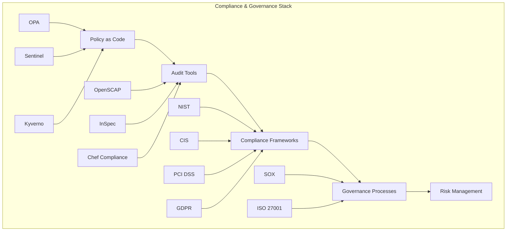

# Compliance & Governance - Enterprise Security and Compliance Framework

## 📋 Overview
This section covers comprehensive compliance and governance tools for DevSecOps. It includes policy as code frameworks, audit tools, compliance frameworks, and governance practices that ensure enterprise-grade security and regulatory compliance.

## 🏗️ Compliance & Governance Architecture



## 📁 Directory Structure

```
08-compliance-governance/
├── README.md
├── policy-as-code/
│   ├── README.md
│   ├── opa/
│   ├── sentinel/
│   └── kyverno/
├── audit-tools/
│   ├── README.md
│   ├── openscap/
│   ├── inspec/
│   └── custom-audit/
└── compliance-frameworks/
    ├── README.md
    ├── nist/
    ├── cis/
    ├── pci-dss/
    └── gdpr/
```

## 🛠️ Compliance & Governance Tools

### 1. Policy as Code Frameworks

#### Open Policy Agent (OPA) - Policy Engine
```rego
# security-policy.rego
package kubernetes.admission

import rego.v1

# Deny privileged containers
deny[msg] {
    input.request.kind.kind == "Pod"
    input.request.operation == "CREATE"
    input.request.object.spec.containers[_].securityContext.privileged == true
    msg := "Privileged containers are not allowed"
}

# Require resource limits
deny[msg] {
    input.request.kind.kind == "Pod"
    input.request.operation == "CREATE"
    container := input.request.object.spec.containers[_]
    not container.resources.limits.cpu
    msg := "CPU limits are required"
}

deny[msg] {
    input.request.kind.kind == "Pod"
    input.request.operation == "CREATE"
    container := input.request.object.spec.containers[_]
    not container.resources.limits.memory
    msg := "Memory limits are required"
}

# Require non-root user
deny[msg] {
    input.request.kind.kind == "Pod"
    input.request.operation == "CREATE"
    not input.request.object.spec.securityContext.runAsNonRoot
    msg := "Containers must run as non-root user"
}

# Require seccomp profile
deny[msg] {
    input.request.kind.kind == "Pod"
    input.request.operation == "CREATE"
    not input.request.object.spec.securityContext.seccompProfile.type
    msg := "Seccomp profile must be specified"
}
```

#### Terraform Sentinel - Policy as Code for Terraform
```javascript
// security-policy.sentinel
import "tfplan/v2" as tfplan

# Check for required tags
required_tags = [
    "Environment",
    "Owner",
    "Project",
    "CostCenter"
]

# Validate all resources have required tags
validate_tags = func(resource) {
    if resource.type is "aws_instance" or resource.type is "aws_s3_bucket" {
        for required_tags as tag {
            if not resource.config.tags contains tag {
                return false
            }
        }
    }
    return true
}

# Check for public S3 buckets
check_public_s3_buckets = rule {
    all tfplan.resource_changes as _, rc {
        rc.type is not "aws_s3_bucket" or
        rc.change.after.acl is not "public-read" and
        rc.change.after.acl is not "public-read-write"
    }
}

# Check for required tags
check_required_tags = rule {
    all tfplan.resource_changes as _, rc {
        validate_tags(rc)
    }
}

# Main rule
main = rule {
    check_public_s3_buckets and
    check_required_tags
}
```

#### Kyverno - Kubernetes Policy Management
```yaml
# kyverno-policy.yaml
apiVersion: kyverno.io/v1
kind: ClusterPolicy
metadata:
  name: require-labels
spec:
  validationFailureAction: enforce
  background: true
  rules:
  - name: check-labels
    match:
      any:
      - resources:
          kinds:
          - Pod
    validate:
      message: "Label 'app' is required"
      pattern:
        metadata:
          labels:
            app: "?*"
---
apiVersion: kyverno.io/v1
kind: ClusterPolicy
metadata:
  name: disallow-privileged
spec:
  validationFailureAction: enforce
  background: true
  rules:
  - name: check-privileged
    match:
      any:
      - resources:
          kinds:
          - Pod
    validate:
      message: "Privileged containers are not allowed"
      pattern:
        spec:
          containers:
          - name: "*"
            securityContext:
              privileged: "false"
---
apiVersion: kyverno.io/v1
kind: ClusterPolicy
metadata:
  name: require-resource-limits
spec:
  validationFailureAction: enforce
  background: true
  rules:
  - name: check-resource-limits
    match:
      any:
      - resources:
          kinds:
          - Pod
    validate:
      message: "Resource limits are required"
      pattern:
        spec:
          containers:
          - name: "*"
            resources:
              limits:
                memory: "?*"
                cpu: "?*"
```

### 2. Audit Tools

#### OpenSCAP - Security Compliance Framework
```bash
# OpenSCAP installation and usage
# 1. Install OpenSCAP
sudo apt update
sudo apt install openscap-scanner scap-security-guide

# 2. Run compliance scan
sudo oscap xccdf eval \
  --profile xccdf_org.ssgproject.content_profile_pci-dss \
  --results /tmp/oscap-results.xml \
  --report /tmp/oscap-report.html \
  /usr/share/xml/scap/ssg/content/ssg-ubuntu1804-ds.xml

# 3. Generate remediation script
sudo oscap xccdf generate fix \
  --profile xccdf_org.ssgproject.content_profile_pci-dss \
  --result-id xccdf_org.open-scap_testresult_xccdf_org.ssgproject.content_profile_pci-dss \
  /tmp/oscap-results.xml > /tmp/remediation.sh

# 4. Apply remediation
sudo bash /tmp/remediation.sh
```

#### InSpec - Compliance Testing Framework
```ruby
# compliance/controls/security.rb
title 'Security Controls'

control 'cis-1.1.1' do
  impact 1.0
  title 'Ensure mounting of cramfs filesystems is disabled'
  desc 'The cramfs filesystem type is a compressed read-only Linux filesystem embedded in small footprint systems.'
  
  describe kernel_module('cramfs') do
    it { should_not be_loaded }
  end
  
  describe file('/etc/modprobe.d/cramfs.conf') do
    it { should exist }
    its('content') { should match(/install cramfs \/bin\/true/) }
  end
end

control 'cis-1.1.2' do
  impact 1.0
  title 'Ensure mounting of freevxfs filesystems is disabled'
  desc 'The freevxfs filesystem type is a free version of the Veritas type filesystem.'
  
  describe kernel_module('freevxfs') do
    it { should_not be_loaded }
  end
  
  describe file('/etc/modprobe.d/freevxfs.conf') do
    it { should exist }
    its('content') { should match(/install freevxfs \/bin\/true/) }
  end
end

control 'cis-1.1.3' do
  impact 1.0
  title 'Ensure mounting of jffs2 filesystems is disabled'
  desc 'The jffs2 (journaling flash filesystem 2) filesystem type is a log-structured filesystem used in flash memory devices.'
  
  describe kernel_module('jffs2') do
    it { should_not be_loaded }
  end
  
  describe file('/etc/modprobe.d/jffs2.conf') do
    it { should exist }
    its('content') { should match(/install jffs2 \/bin\/true/) }
  end
end
```

```ruby
# compliance/controls/kubernetes.rb
title 'Kubernetes Security Controls'

control 'k8s-1.1' do
  impact 1.0
  title 'Ensure that the API server pod specification file permissions are set to 644 or more restrictive'
  desc 'The API server pod specification file controls various parameters that set the behavior of the API server.'
  
  describe file('/etc/kubernetes/manifests/kube-apiserver.yaml') do
    it { should exist }
    it { should be_file }
    its('mode') { should cmp <= '0644' }
  end
end

control 'k8s-1.2' do
  impact 1.0
  title 'Ensure that the API server pod specification file ownership is set to root:root'
  desc 'The API server pod specification file controls various parameters that set the behavior of the API server.'
  
  describe file('/etc/kubernetes/manifests/kube-apiserver.yaml') do
    it { should exist }
    it { should be_file }
    its('owner') { should eq 'root' }
    its('group') { should eq 'root' }
  end
end
```

#### Chef Compliance - Compliance Automation
```yaml
# chef-compliance-config.yml
version: "1.0"
compliance:
  profiles:
    - name: "cis-ubuntu18.04-l1"
      url: "https://github.com/dev-sec/cis-ubuntu18.04-level1"
    - name: "cis-docker-benchmark"
      url: "https://github.com/dev-sec/cis-docker-benchmark"
    - name: "cis-kubernetes-benchmark"
      url: "https://github.com/dev-sec/cis-kubernetes-benchmark"

  scans:
    - name: "ubuntu-servers"
      target: "ssh://user@server1,ssh://user@server2"
      profile: "cis-ubuntu18.04-l1"
    - name: "docker-hosts"
      target: "docker://container1,docker://container2"
      profile: "cis-docker-benchmark"
    - name: "kubernetes-cluster"
      target: "k8s://cluster1"
      profile: "cis-kubernetes-benchmark"
```

### 3. Compliance Frameworks

#### NIST Cybersecurity Framework
```yaml
# nist-framework.yml
framework:
  name: "NIST Cybersecurity Framework"
  version: "1.1"
  
  functions:
    - id: "ID"
      name: "Identify"
      categories:
        - id: "ID.AM"
          name: "Asset Management"
          subcategories:
            - id: "ID.AM-1"
              name: "Physical devices and systems within the organization are inventoried"
            - id: "ID.AM-2"
              name: "Software platforms and applications within the organization are inventoried"
        - id: "ID.BE"
          name: "Business Environment"
          subcategories:
            - id: "ID.BE-1"
              name: "The organization's role in the supply chain is identified and communicated"
            - id: "ID.BE-2"
              name: "The organization's place in critical infrastructure and its industry sector is identified and communicated"
    
    - id: "PR"
      name: "Protect"
      categories:
        - id: "PR.AC"
          name: "Identity Management and Access Control"
          subcategories:
            - id: "PR.AC-1"
              name: "Identities and credentials are issued, managed, verified, revoked, and audited for authorized devices, users and processes"
            - id: "PR.AC-2"
              name: "Physical access to assets is managed and protected"
    
    - id: "DE"
      name: "Detect"
      categories:
        - id: "DE.AE"
          name: "Anomalies and Events"
          subcategories:
            - id: "DE.AE-1"
              name: "A baseline of network operations and expected data flows for users and systems is established and managed"
            - id: "DE.AE-2"
              name: "Detected events are analyzed to understand attack targets and methods"
    
    - id: "RS"
      name: "Respond"
      categories:
        - id: "RS.RP"
          name: "Response Planning"
          subcategories:
            - id: "RS.RP-1"
              name: "Response plan is executed during or after a security incident"
    
    - id: "RC"
      name: "Recover"
      categories:
        - id: "RC.RP"
          name: "Recovery Planning"
          subcategories:
            - id: "RC.RP-1"
              name: "Recovery plan is executed during or after a security incident"
```

#### CIS Benchmarks
```yaml
# cis-benchmarks.yml
benchmarks:
  - name: "CIS Ubuntu 18.04 LTS Benchmark"
    version: "2.0.0"
    sections:
      - id: "1"
        title: "Initial Setup"
        recommendations:
          - id: "1.1"
            title: "Filesystem Configuration"
            level: "Level 1"
            description: "Configure filesystem settings to improve security"
            checks:
              - id: "1.1.1"
                title: "Ensure mounting of cramfs filesystems is disabled"
                remediation: |
                  # Edit /etc/modprobe.d/cramfs.conf
                  install cramfs /bin/true
                  
                  # Remove cramfs module
                  rmmod cramfs
              - id: "1.1.2"
                title: "Ensure mounting of freevxfs filesystems is disabled"
                remediation: |
                  # Edit /etc/modprobe.d/freevxfs.conf
                  install freevxfs /bin/true
                  
                  # Remove freevxfs module
                  rmmod freevxfs
      
      - id: "2"
        title: "Services"
        recommendations:
          - id: "2.1"
            title: "Inetd Services"
            level: "Level 1"
            description: "Configure inetd services to improve security"
            checks:
              - id: "2.1.1"
                title: "Ensure chargen services are not enabled"
                remediation: |
                  # Disable chargen services
                  systemctl disable chargen-dgram
                  systemctl disable chargen-stream
```

#### PCI DSS Compliance
```yaml
# pci-dss-compliance.yml
pci_dss:
  version: "3.2.1"
  requirements:
    - id: "1"
      title: "Install and maintain a firewall configuration to protect cardholder data"
      sub_requirements:
        - id: "1.1"
          title: "Establish and implement firewall and router configuration standards"
          testing_procedures:
            - "1.1.1: Verify that firewall and router configuration standards include a formal process for approving and testing all network connections and changes to the firewall and router configurations"
            - "1.1.2: Verify that current network diagram identifies all connections between the cardholder data environment and other networks, including any wireless networks"
        - id: "1.2"
          title: "Build firewall and router configurations that restrict connections between untrusted networks and any system components in the cardholder data environment"
          testing_procedures:
            - "1.2.1: Verify that inbound and outbound traffic is restricted to that which is necessary for the cardholder data environment"
            - "1.2.2: Verify that direct public access between the Internet and any system component in the cardholder data environment is not permitted"
    
    - id: "2"
      title: "Do not use vendor-supplied defaults for system passwords and other security parameters"
      sub_requirements:
        - id: "2.1"
          title: "Always change vendor-supplied defaults and remove or disable unnecessary default accounts before installing a system on the network"
          testing_procedures:
            - "2.1.1: Verify that vendor-supplied default passwords are changed"
            - "2.1.2: Verify that unnecessary default accounts are removed or disabled"
```

## 🧪 Hands-On Labs

### Lab 1: OPA Policy Development
```bash
# Lab 1: Creating OPA policies
# 1. Install OPA
curl -L -o opa https://openpolicyagent.org/downloads/latest/opa_linux_amd64
chmod 755 opa
sudo mv opa /usr/local/bin/

# 2. Create policy directory
mkdir opa-lab
cd opa-lab

# 3. Create security policy
cat > security-policy.rego << 'EOF'
package kubernetes.admission

import rego.v1

# Deny privileged containers
deny[msg] {
    input.request.kind.kind == "Pod"
    input.request.operation == "CREATE"
    input.request.object.spec.containers[_].securityContext.privileged == true
    msg := "Privileged containers are not allowed"
}

# Require resource limits
deny[msg] {
    input.request.kind.kind == "Pod"
    input.request.operation == "CREATE"
    container := input.request.object.spec.containers[_]
    not container.resources.limits.cpu
    msg := "CPU limits are required"
}
EOF

# 4. Test policy
cat > test-input.json << 'EOF'
{
  "request": {
    "kind": {
      "kind": "Pod"
    },
    "operation": "CREATE",
    "object": {
      "spec": {
        "containers": [
          {
            "name": "test",
            "image": "nginx",
            "securityContext": {
              "privileged": true
            }
          }
        ]
      }
    }
  }
}
EOF

# 5. Evaluate policy
opa eval --data security-policy.rego --input test-input.json "data.kubernetes.admission.deny"
```

### Lab 2: InSpec Compliance Testing
```bash
# Lab 2: Creating InSpec compliance tests
# 1. Install InSpec
curl https://omnitruck.chef.io/install.sh | sudo bash -s -- -P inspec

# 2. Create compliance profile
mkdir -p compliance/controls
cd compliance

# 3. Create profile metadata
cat > inspec.yml << 'EOF'
name: devsecops-compliance
title: DevSecOps Compliance Profile
maintainer: DevSecOps Team
copyright: DevSecOps Team
copyright_email: team@devsecops.com
license: Apache-2.0
summary: Compliance profile for DevSecOps environments
version: 1.0.0
EOF

# 4. Create security controls
cat > controls/security.rb << 'EOF'
title 'Security Controls'

control 'cis-1.1.1' do
  impact 1.0
  title 'Ensure mounting of cramfs filesystems is disabled'
  desc 'The cramfs filesystem type is a compressed read-only Linux filesystem embedded in small footprint systems.'
  
  describe kernel_module('cramfs') do
    it { should_not be_loaded }
  end
  
  describe file('/etc/modprobe.d/cramfs.conf') do
    it { should exist }
    its('content') { should match(/install cramfs \/bin\/true/) }
  end
end

control 'cis-1.1.2' do
  impact 1.0
  title 'Ensure mounting of freevxfs filesystems is disabled'
  desc 'The freevxfs filesystem type is a free version of the Veritas type filesystem.'
  
  describe kernel_module('freevxfs') do
    it { should_not be_loaded }
  end
  
  describe file('/etc/modprobe.d/freevxfs.conf') do
    it { should exist }
    its('content') { should match(/install freevxfs \/bin\/true/) }
  end
end
EOF

# 5. Run compliance scan
inspec exec . --format json --output compliance-report.json

# 6. Generate HTML report
inspec exec . --format html --output compliance-report.html
```

### Lab 3: OpenSCAP Compliance Scanning
```bash
# Lab 3: Running OpenSCAP compliance scans
# 1. Install OpenSCAP
sudo apt update
sudo apt install openscap-scanner scap-security-guide

# 2. List available profiles
oscap info /usr/share/xml/scap/ssg/content/ssg-ubuntu1804-ds.xml

# 3. Run compliance scan
sudo oscap xccdf eval \
  --profile xccdf_org.ssgproject.content_profile_pci-dss \
  --results /tmp/oscap-results.xml \
  --report /tmp/oscap-report.html \
  /usr/share/xml/scap/ssg/content/ssg-ubuntu1804-ds.xml

# 4. Generate remediation script
sudo oscap xccdf generate fix \
  --profile xccdf_org.ssgproject.content_profile_pci-dss \
  --result-id xccdf_org.open-scap_testresult_xccdf_org.ssgproject.content_profile_pci-dss \
  /tmp/oscap-results.xml > /tmp/remediation.sh

# 5. Review remediation script
cat /tmp/remediation.sh

# 6. Apply remediation (optional)
# sudo bash /tmp/remediation.sh
```

## 📊 Compliance Metrics and Reporting

### 1. Compliance Dashboard
```json
{
  "dashboard": {
    "title": "Compliance Dashboard",
    "panels": [
      {
        "title": "Compliance Score",
        "type": "stat",
        "targets": [
          {
            "expr": "compliance_score",
            "legendFormat": "Overall Score"
          }
        ]
      },
      {
        "title": "Failed Controls",
        "type": "table",
        "targets": [
          {
            "expr": "compliance_failures",
            "format": "table"
          }
        ]
      },
      {
        "title": "Compliance Trends",
        "type": "graph",
        "targets": [
          {
            "expr": "compliance_score_over_time",
            "legendFormat": "Score"
          }
        ]
      }
    ]
  }
}
```

### 2. Compliance Reporting
```yaml
# compliance-report.yml
report:
  timestamp: "2024-01-15T10:30:00Z"
  environment: "production"
  compliance_score: 85.5
  
  frameworks:
    - name: "CIS Ubuntu 18.04 LTS"
      score: 90.0
      status: "compliant"
      failed_controls: 2
      total_controls: 20
    
    - name: "PCI DSS"
      score: 80.0
      status: "partially_compliant"
      failed_controls: 4
      total_controls: 20
    
    - name: "NIST Cybersecurity Framework"
      score: 85.0
      status: "compliant"
      failed_controls: 3
      total_controls: 20
  
  failed_controls:
    - id: "cis-1.1.1"
      title: "Ensure mounting of cramfs filesystems is disabled"
      severity: "high"
      remediation: "Add 'install cramfs /bin/true' to /etc/modprobe.d/cramfs.conf"
    
    - id: "pci-2.1.1"
      title: "Change vendor-supplied default passwords"
      severity: "critical"
      remediation: "Change all default passwords to strong, unique passwords"
```

## 📚 Learning Resources

### Documentation
- [OPA Documentation](https://www.openpolicyagent.org/docs/)
- [InSpec Documentation](https://docs.chef.io/inspec/)
- [OpenSCAP Documentation](https://www.open-scap.org/)
- [NIST Framework Documentation](https://www.nist.gov/cyberframework)

### Best Practices
- **Policy as Code**: Store policies in version control
- **Automated Testing**: Test policies and compliance controls
- **Continuous Monitoring**: Monitor compliance continuously
- **Documentation**: Maintain clear compliance documentation
- **Training**: Train team on compliance requirements

### Community Resources
- [OPA Community](https://www.openpolicyagent.org/community/)
- [InSpec Community](https://community.chef.io/)
- [OpenSCAP Community](https://www.open-scap.org/community/)
- [NIST Community](https://www.nist.gov/cyberframework/community)

## 🎓 Certification Preparation

### Compliance Certifications
- **CISSP**: Certified Information Systems Security Professional
- **CISM**: Certified Information Security Manager
- **CISA**: Certified Information Systems Auditor
- **Compliance Professional**: General compliance certification

### Study Materials
- **Official Documentation**: Framework-specific documentation
- **Practice Labs**: Hands-on compliance projects
- **Case Studies**: Real-world compliance scenarios
- **Community Forums**: Expert discussions and Q&A

## 🤝 Contributing

### How to Contribute
1. **Fork the repository**
2. **Create a feature branch**
3. **Add compliance content or improvements**
4. **Submit a pull request**

### Contribution Areas
- **New compliance frameworks**
- **Updated policy examples**
- **Additional audit tools**
- **Improved documentation**

## 📞 Support

### Getting Help
- **Documentation**: Comprehensive guides in each tool folder
- **Issues**: GitHub issues for compliance problems
- **Discussions**: Community discussions for compliance questions
- **Mentorship**: Connect with compliance experts

### Community Resources
- **Slack**: #compliance-governance
- **Discord**: Compliance Learning Community
- **LinkedIn**: Compliance Professionals Group
- **YouTube**: Compliance Tutorials Channel

---

**Ready to master compliance and governance?** Start with policy as code frameworks and work your way up to comprehensive compliance implementations!
