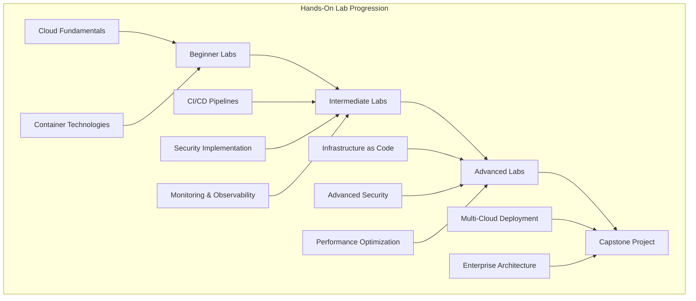

# DevSecOps Hands-On Labs - Practical Learning Experience

## 🧪 Overview
This section provides comprehensive hands-on labs for learning DevSecOps tools and practices. The labs are organized by difficulty level and cover real-world scenarios that you'll encounter in enterprise environments.

## 🏗️ Lab Architecture



## 📁 Directory Structure

```
09-hands-on-labs/
├── README.md
├── beginner/
│   ├── lab-01-cloud-setup/
│   ├── lab-02-container-basics/
│   ├── lab-03-basic-cicd/
│   ├── lab-04-security-scanning/
│   └── lab-05-monitoring-setup/
├── intermediate/
│   ├── lab-06-kubernetes-deployment/
│   ├── lab-07-advanced-cicd/
│   ├── lab-08-infrastructure-as-code/
│   ├── lab-09-security-implementation/
│   └── lab-10-monitoring-observability/
├── advanced/
│   ├── lab-11-multi-cloud-architecture/
│   ├── lab-12-advanced-security/
│   ├── lab-13-performance-optimization/
│   ├── lab-14-disaster-recovery/
│   └── lab-15-compliance-implementation/
└── capstone/
    ├── project-01-enterprise-platform/
    ├── project-02-multi-tenant-saas/
    └── project-03-hybrid-cloud/
```

## 🎯 Learning Objectives

### Beginner Level (Labs 1-5)
- Set up cloud development environments
- Understand containerization basics
- Implement basic CI/CD pipelines
- Learn security scanning fundamentals
- Set up basic monitoring

### Intermediate Level (Labs 6-10)
- Deploy applications to Kubernetes
- Build advanced CI/CD pipelines
- Implement Infrastructure as Code
- Apply comprehensive security measures
- Set up monitoring and observability

### Advanced Level (Labs 11-15)
- Design multi-cloud architectures
- Implement advanced security controls
- Optimize system performance
- Plan disaster recovery strategies
- Ensure compliance with regulations

## 🚀 Lab Prerequisites

### Required Tools
```bash
# Install required tools
# Docker
curl -fsSL https://get.docker.com -o get-docker.sh
sh get-docker.sh

# Kubernetes CLI
curl -LO "https://dl.k8s.io/release/$(curl -L -s https://dl.k8s.io/release/stable.txt)/bin/linux/amd64/kubectl"
chmod +x kubectl
sudo mv kubectl /usr/local/bin/

# Terraform
wget https://releases.hashicorp.com/terraform/1.5.0/terraform_1.5.0_linux_amd64.zip
unzip terraform_1.5.0_linux_amd64.zip
sudo mv terraform /usr/local/bin/

# Cloud CLIs
# AWS CLI
curl "https://awscli.amazonaws.com/awscli-exe-linux-x86_64.zip" -o "awscliv2.zip"
unzip awscliv2.zip
sudo ./aws/install

# Google Cloud CLI
curl https://sdk.cloud.google.com | bash
exec -l $SHELL

# Azure CLI
curl -sL https://aka.ms/InstallAzureCLIDeb | sudo bash
```

### Cloud Accounts
- **AWS Account**: Free tier available
- **Google Cloud Account**: $300 free credits
- **Azure Account**: $200 free credits

## 🧪 Beginner Labs

### Lab 1: Cloud Environment Setup
**Objective**: Set up development environments across AWS, GCP, and Azure

**Duration**: 2-3 hours

**Steps**:
1. Create cloud accounts
2. Set up CLI tools
3. Configure authentication
4. Create basic resources
5. Test connectivity

**Deliverables**:
- Working cloud CLI setup
- Basic resource creation scripts
- Environment documentation

### Lab 2: Container Basics
**Objective**: Learn Docker fundamentals and container security

**Duration**: 3-4 hours

**Steps**:
1. Build Docker images
2. Implement security best practices
3. Use multi-stage builds
4. Set up container registry
5. Scan containers for vulnerabilities

**Deliverables**:
- Secure Dockerfile
- Container scanning results
- Registry setup documentation

### Lab 3: Basic CI/CD Pipeline
**Objective**: Create a simple CI/CD pipeline

**Duration**: 4-5 hours

**Steps**:
1. Set up Git repository
2. Create GitHub Actions workflow
3. Implement build and test stages
4. Add security scanning
5. Deploy to cloud

**Deliverables**:
- Working CI/CD pipeline
- Pipeline documentation
- Deployment scripts

### Lab 4: Security Scanning
**Objective**: Implement comprehensive security scanning

**Duration**: 3-4 hours

**Steps**:
1. Set up SAST tools (SonarQube)
2. Configure DAST tools (OWASP ZAP)
3. Implement SCA scanning (Snyk)
4. Set up container scanning (Trivy)
5. Create security reports

**Deliverables**:
- Security scanning pipeline
- Security reports
- Remediation documentation

### Lab 5: Monitoring Setup
**Objective**: Set up basic monitoring and alerting

**Duration**: 3-4 hours

**Steps**:
1. Install Prometheus and Grafana
2. Configure monitoring targets
3. Create dashboards
4. Set up alerting rules
5. Test monitoring system

**Deliverables**:
- Monitoring dashboard
- Alerting configuration
- Monitoring documentation

## 🔧 Intermediate Labs

### Lab 6: Kubernetes Deployment
**Objective**: Deploy applications to Kubernetes with security

**Duration**: 6-8 hours

**Steps**:
1. Set up Kubernetes cluster
2. Deploy application with Helm
3. Configure RBAC
4. Implement network policies
5. Set up monitoring

**Deliverables**:
- Kubernetes manifests
- Helm charts
- Security policies
- Monitoring setup

### Lab 7: Advanced CI/CD Pipeline
**Objective**: Build enterprise-grade CI/CD pipeline

**Duration**: 8-10 hours

**Steps**:
1. Design pipeline architecture
2. Implement multi-stage pipeline
3. Add security gates
4. Configure deployment strategies
5. Set up rollback mechanisms

**Deliverables**:
- Complete CI/CD pipeline
- Pipeline documentation
- Deployment strategies

### Lab 8: Infrastructure as Code
**Objective**: Implement Infrastructure as Code with Terraform

**Duration**: 6-8 hours

**Steps**:
1. Design infrastructure architecture
2. Write Terraform configurations
3. Implement state management
4. Add security policies
5. Set up CI/CD for infrastructure

**Deliverables**:
- Terraform configurations
- Infrastructure documentation
- CI/CD for infrastructure

### Lab 9: Security Implementation
**Objective**: Implement comprehensive security measures

**Duration**: 8-10 hours

**Steps**:
1. Set up secrets management
2. Implement policy enforcement
3. Configure runtime security
4. Set up compliance monitoring
5. Create security playbooks

**Deliverables**:
- Security implementation
- Policy configurations
- Compliance reports

### Lab 10: Monitoring & Observability
**Objective**: Set up comprehensive monitoring and observability

**Duration**: 6-8 hours

**Steps**:
1. Implement distributed tracing
2. Set up log aggregation
3. Configure metrics collection
4. Create custom dashboards
5. Set up alerting

**Deliverables**:
- Monitoring stack
- Custom dashboards
- Alerting configuration

## 🚀 Advanced Labs

### Lab 11: Multi-Cloud Architecture
**Objective**: Design and implement multi-cloud architecture

**Duration**: 12-16 hours

**Steps**:
1. Design multi-cloud architecture
2. Implement cross-cloud networking
3. Set up data synchronization
4. Configure disaster recovery
5. Implement cost optimization

**Deliverables**:
- Multi-cloud architecture
- Cross-cloud connectivity
- Disaster recovery plan

### Lab 12: Advanced Security
**Objective**: Implement advanced security controls

**Duration**: 10-12 hours

**Steps**:
1. Set up zero-trust architecture
2. Implement advanced threat detection
3. Configure compliance automation
4. Set up security orchestration
5. Create incident response procedures

**Deliverables**:
- Zero-trust implementation
- Threat detection system
- Compliance automation

### Lab 13: Performance Optimization
**Objective**: Optimize system performance and costs

**Duration**: 8-10 hours

**Steps**:
1. Analyze performance bottlenecks
2. Implement caching strategies
3. Optimize resource utilization
4. Set up auto-scaling
5. Implement cost optimization

**Deliverables**:
- Performance optimization
- Cost optimization report
- Auto-scaling configuration

### Lab 14: Disaster Recovery
**Objective**: Implement comprehensive disaster recovery

**Duration**: 10-12 hours

**Steps**:
1. Design disaster recovery architecture
2. Implement backup strategies
3. Set up replication
4. Create recovery procedures
5. Test disaster recovery

**Deliverables**:
- Disaster recovery plan
- Backup strategies
- Recovery procedures

### Lab 15: Compliance Implementation
**Objective**: Implement compliance with industry standards

**Duration**: 12-16 hours

**Steps**:
1. Identify compliance requirements
2. Implement compliance controls
3. Set up audit logging
4. Create compliance reports
5. Automate compliance checks

**Deliverables**:
- Compliance implementation
- Audit logging
- Compliance reports

## 🏆 Capstone Projects

### Project 1: Enterprise DevSecOps Platform
**Objective**: Build a complete enterprise DevSecOps platform

**Duration**: 40-50 hours

**Requirements**:
- Multi-cloud support
- Complete CI/CD pipeline
- Comprehensive security
- Monitoring and observability
- Compliance automation
- Disaster recovery

**Deliverables**:
- Complete platform implementation
- Documentation
- Demo environment
- Presentation

### Project 2: Multi-Tenant SaaS Platform
**Objective**: Build a secure multi-tenant SaaS platform

**Duration**: 50-60 hours

**Requirements**:
- Multi-tenancy architecture
- Tenant isolation
- Security and compliance
- Scalability
- Cost optimization

**Deliverables**:
- Multi-tenant platform
- Security implementation
- Scalability documentation
- Cost analysis

### Project 3: Hybrid Cloud Solution
**Objective**: Design and implement hybrid cloud solution

**Duration**: 60-80 hours

**Requirements**:
- On-premises and cloud integration
- Data synchronization
- Security across environments
- Compliance
- Disaster recovery

**Deliverables**:
- Hybrid cloud architecture
- Integration implementation
- Security framework
- Disaster recovery plan

## 📊 Lab Assessment

### Assessment Criteria
- **Technical Implementation**: 40%
- **Security Implementation**: 25%
- **Documentation Quality**: 20%
- **Problem Solving**: 15%

### Grading Rubric
- **Excellent (90-100%)**: Complete implementation with best practices
- **Good (80-89%)**: Good implementation with minor issues
- **Satisfactory (70-79%)**: Basic implementation with some issues
- **Needs Improvement (60-69%)**: Incomplete implementation
- **Unsatisfactory (<60%)**: Major issues or incomplete

### Portfolio Requirements
- **Beginner Labs**: Complete 4 out of 5 labs
- **Intermediate Labs**: Complete 3 out of 5 labs
- **Advanced Labs**: Complete 2 out of 3 labs
- **Capstone Project**: Complete 1 project

## 🎓 Certification Preparation

### Lab-Based Certifications
- **AWS Certified DevOps Engineer**: Complete AWS-focused labs
- **Azure DevOps Engineer Expert**: Complete Azure-focused labs
- **GCP Professional DevOps Engineer**: Complete GCP-focused labs
- **CKS (Certified Kubernetes Security)**: Complete Kubernetes labs
- **CKA (Certified Kubernetes Administrator)**: Complete Kubernetes labs

### Study Schedule
- **Week 1-2**: Complete beginner labs
- **Week 3-4**: Complete intermediate labs
- **Week 5-6**: Complete advanced labs
- **Week 7-8**: Complete capstone project
- **Week 9-10**: Certification preparation and practice exams

## 📚 Learning Resources

### Documentation
- [Kubernetes Documentation](https://kubernetes.io/docs/)
- [Docker Documentation](https://docs.docker.com/)
- [Terraform Documentation](https://terraform.io/docs/)
- [Prometheus Documentation](https://prometheus.io/docs/)

### Video Tutorials
- [Kubernetes Tutorials](https://www.youtube.com/results?search_query=kubernetes+tutorial)
- [Docker Tutorials](https://www.youtube.com/results?search_query=docker+tutorial)
- [Terraform Tutorials](https://www.youtube.com/results?search_query=terraform+tutorial)
- [DevSecOps Tutorials](https://www.youtube.com/results?search_query=devsecops+tutorial)

### Practice Platforms
- [Katacoda](https://www.katacoda.com/)
- [Play with Kubernetes](https://labs.play-with-k8s.com/)
- [Play with Docker](https://labs.play-with-docker.com/)
- [HashiCorp Learn](https://learn.hashicorp.com/)

## 🤝 Contributing

### How to Contribute
1. **Fork the repository**
2. **Create a feature branch**
3. **Add new labs or improve existing ones**
4. **Submit a pull request**

### Contribution Areas
- **New lab scenarios**
- **Updated lab instructions**
- **Additional troubleshooting guides**
- **New capstone projects**

## 📞 Support

### Getting Help
- **Documentation**: Comprehensive guides in each lab folder
- **Issues**: GitHub issues for lab problems
- **Discussions**: Community discussions for lab questions
- **Mentorship**: Connect with lab mentors

### Community Resources
- **Slack**: #hands-on-labs
- **Discord**: Lab Learning Community
- **LinkedIn**: DevSecOps Lab Group
- **YouTube**: Lab Tutorials Channel

---

**Ready to start your hands-on learning journey?** Begin with Lab 1 and work your way through the complete curriculum!
