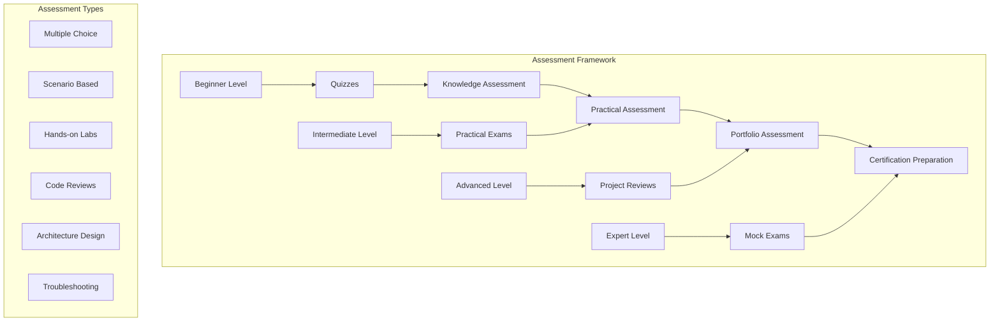

# DevSecOps Assessments - Comprehensive Evaluation Framework

## 📊 Overview
This section provides comprehensive assessments for evaluating DevSecOps knowledge and skills. The assessments are designed to test both theoretical knowledge and practical skills across all aspects of DevSecOps engineering.

## 🏗️ Assessment Architecture



## 📁 Directory Structure

```
10-assessments/
├── README.md
├── quizzes/
│   ├── beginner/
│   ├── intermediate/
│   ├── advanced/
│   └── expert/
├── practical-exams/
│   ├── cloud-providers/
│   ├── container-orchestration/
│   ├── security-tools/
│   ├── monitoring-observability/
│   └── compliance-governance/
├── certification-prep/
│   ├── aws/
│   ├── gcp/
│   ├── azure/
│   ├── kubernetes/
│   └── security/
└── portfolio-templates/
    ├── project-templates/
    ├── presentation-templates/
    └── documentation-templates/
```

## 🎯 Assessment Levels

### Beginner Level (0-2 years experience)
- **Focus**: Basic concepts and tools
- **Duration**: 30-45 minutes per assessment
- **Format**: Multiple choice, basic scenarios
- **Topics**: Cloud basics, container fundamentals, basic CI/CD

### Intermediate Level (2-5 years experience)
- **Focus**: Practical implementation and problem-solving
- **Duration**: 60-90 minutes per assessment
- **Format**: Scenario-based, hands-on labs
- **Topics**: Advanced CI/CD, infrastructure as code, security implementation

### Advanced Level (5+ years experience)
- **Focus**: Architecture design and optimization
- **Duration**: 90-120 minutes per assessment
- **Format**: Complex scenarios, architecture design
- **Topics**: Multi-cloud architecture, advanced security, performance optimization

### Expert Level (Senior/Lead roles)
- **Focus**: Strategic thinking and leadership
- **Duration**: 120+ minutes per assessment
- **Format**: Case studies, strategic planning
- **Topics**: Enterprise architecture, team leadership, transformation strategies

## 📝 Assessment Categories

### 1. Cloud Providers Assessment

#### AWS Assessment
```yaml
# aws-assessment.yml
name: AWS DevSecOps Assessment
duration: 90 minutes
difficulty: intermediate
topics:
  - compute: [EC2, Lambda, ECS, EKS]
  - storage: [S3, EBS, EFS, FSx]
  - networking: [VPC, ALB, CloudFront, Route 53]
  - security: [IAM, KMS, Secrets Manager, GuardDuty]
  - monitoring: [CloudWatch, X-Ray, CloudTrail]
  - ci-cd: [CodeCommit, CodeBuild, CodeDeploy, CodePipeline]

questions:
  - type: multiple_choice
    question: "Which AWS service provides managed Kubernetes clusters?"
    options: [EC2, ECS, EKS, Lambda]
    correct_answer: EKS
    explanation: "Amazon EKS (Elastic Kubernetes Service) provides managed Kubernetes clusters"
  
  - type: scenario
    question: "Design a secure, scalable web application architecture on AWS"
    requirements:
      - high_availability: true
      - security: true
      - scalability: true
      - cost_optimization: true
    evaluation_criteria:
      - architecture_design: 25%
      - security_implementation: 25%
      - scalability_considerations: 25%
      - cost_optimization: 25%
```

#### GCP Assessment
```yaml
# gcp-assessment.yml
name: GCP DevSecOps Assessment
duration: 90 minutes
difficulty: intermediate
topics:
  - compute: [Compute Engine, GKE, Cloud Run, Cloud Functions]
  - storage: [Cloud Storage, Persistent Disk, Cloud SQL, Firestore]
  - networking: [VPC, Cloud Load Balancing, Cloud CDN, Cloud DNS]
  - security: [Cloud IAM, Secret Manager, Cloud KMS, Security Command Center]
  - monitoring: [Cloud Monitoring, Cloud Logging, Cloud Trace]
  - ci-cd: [Cloud Source Repositories, Cloud Build, Cloud Deploy]

questions:
  - type: multiple_choice
    question: "Which GCP service provides serverless container execution?"
    options: [Compute Engine, GKE, Cloud Run, Cloud Functions]
    correct_answer: Cloud Run
    explanation: "Cloud Run provides serverless container execution with automatic scaling"
  
  - type: hands_on
    question: "Deploy a containerized application to GKE with security best practices"
    requirements:
      - container_security: true
      - network_policies: true
      - rbac: true
      - monitoring: true
    evaluation_criteria:
      - deployment_success: 30%
      - security_implementation: 40%
      - monitoring_setup: 30%
```

#### Azure Assessment
```yaml
# azure-assessment.yml
name: Azure DevSecOps Assessment
duration: 90 minutes
difficulty: intermediate
topics:
  - compute: [Virtual Machines, AKS, Container Instances, Azure Functions]
  - storage: [Blob Storage, Managed Disks, Azure Files, Cosmos DB]
  - networking: [Virtual Network, Application Gateway, Azure CDN, ExpressRoute]
  - security: [Azure AD, Key Vault, Security Center, Sentinel]
  - monitoring: [Azure Monitor, Application Insights, Log Analytics]
  - ci-cd: [Azure Repos, Azure Pipelines, Azure Artifacts]

questions:
  - type: multiple_choice
    question: "Which Azure service provides managed Kubernetes clusters?"
    options: [Virtual Machines, AKS, Container Instances, Azure Functions]
    correct_answer: AKS
    explanation: "Azure Kubernetes Service (AKS) provides managed Kubernetes clusters"
  
  - type: scenario
    question: "Implement a hybrid cloud solution with Azure and on-premises infrastructure"
    requirements:
      - hybrid_connectivity: true
      - security: true
      - data_synchronization: true
      - disaster_recovery: true
    evaluation_criteria:
      - architecture_design: 30%
      - security_implementation: 30%
      - connectivity_solution: 20%
      - disaster_recovery: 20%
```

### 2. Container Orchestration Assessment

#### Kubernetes Assessment
```yaml
# kubernetes-assessment.yml
name: Kubernetes DevSecOps Assessment
duration: 120 minutes
difficulty: advanced
topics:
  - cluster_management: [kubectl, cluster setup, node management]
  - application_deployment: [pods, services, deployments, ingress]
  - security: [RBAC, network policies, pod security policies]
  - monitoring: [Prometheus, Grafana, logging, alerting]
  - storage: [persistent volumes, storage classes, stateful sets]
  - networking: [services, ingress, service mesh]

questions:
  - type: hands_on
    question: "Deploy a microservices application to Kubernetes with security and monitoring"
    requirements:
      - microservices_architecture: true
      - security_policies: true
      - monitoring_setup: true
      - service_mesh: true
    evaluation_criteria:
      - deployment_success: 25%
      - security_implementation: 35%
      - monitoring_setup: 25%
      - architecture_design: 15%
  
  - type: troubleshooting
    question: "Troubleshoot a failing Kubernetes deployment"
    scenario:
      - pods_not_starting: true
      - network_connectivity_issues: true
      - resource_constraints: true
    evaluation_criteria:
      - problem_identification: 40%
      - solution_implementation: 40%
      - documentation: 20%
```

### 3. Security Tools Assessment

#### Security Assessment
```yaml
# security-assessment.yml
name: DevSecOps Security Assessment
duration: 120 minutes
difficulty: advanced
topics:
  - vulnerability_scanning: [SAST, DAST, IAST, SCA]
  - secrets_management: [Vault, cloud secrets, key rotation]
  - policy_enforcement: [OPA, Gatekeeper, admission controllers]
  - compliance: [OpenSCAP, InSpec, compliance frameworks]
  - runtime_security: [Falco, Aqua, Twistlock]

questions:
  - type: scenario
    question: "Implement comprehensive security for a containerized application"
    requirements:
      - vulnerability_scanning: true
      - secrets_management: true
      - policy_enforcement: true
      - runtime_monitoring: true
    evaluation_criteria:
      - security_implementation: 40%
      - tool_integration: 30%
      - policy_definition: 20%
      - monitoring_setup: 10%
  
  - type: hands_on
    question: "Set up a complete security scanning pipeline"
    requirements:
      - sast_scanning: true
      - dast_scanning: true
      - container_scanning: true
      - dependency_scanning: true
    evaluation_criteria:
      - pipeline_setup: 40%
      - tool_configuration: 30%
      - integration_success: 20%
      - documentation: 10%
```

### 4. Monitoring & Observability Assessment

#### Monitoring Assessment
```yaml
# monitoring-assessment.yml
name: DevSecOps Monitoring Assessment
duration: 90 minutes
difficulty: intermediate
topics:
  - metrics_collection: [Prometheus, Grafana, custom metrics]
  - logging: [ELK stack, Fluentd, centralized logging]
  - tracing: [Jaeger, Zipkin, distributed tracing]
  - alerting: [AlertManager, PagerDuty, notification channels]
  - dashboards: [Grafana, custom dashboards, visualization]

questions:
  - type: hands_on
    question: "Set up comprehensive monitoring for a microservices application"
    requirements:
      - metrics_collection: true
      - log_aggregation: true
      - distributed_tracing: true
      - alerting_setup: true
    evaluation_criteria:
      - monitoring_setup: 40%
      - dashboard_creation: 25%
      - alerting_configuration: 25%
      - documentation: 10%
  
  - type: scenario
    question: "Design a monitoring strategy for a multi-cloud environment"
    requirements:
      - multi_cloud_support: true
      - centralized_monitoring: true
      - cost_optimization: true
      - scalability: true
    evaluation_criteria:
      - architecture_design: 40%
      - tool_selection: 30%
      - cost_considerations: 20%
      - scalability_plan: 10%
```

## 🎓 Certification Preparation

### AWS Certification Prep
```yaml
# aws-cert-prep.yml
certifications:
  - name: AWS Certified DevOps Engineer
    duration: 180 minutes
    format: multiple_choice + scenario
    topics:
      - ci_cd_pipeline: 25%
      - monitoring_logging: 20%
      - security: 20%
      - infrastructure_as_code: 15%
      - incident_response: 10%
      - troubleshooting: 10%
    
  - name: AWS Certified Security Specialist
    duration: 180 minutes
    format: multiple_choice + scenario
    topics:
      - identity_access_management: 20%
      - data_protection: 20%
      - infrastructure_security: 20%
      - incident_response: 15%
      - logging_monitoring: 15%
      - compliance: 10%
```

### GCP Certification Prep
```yaml
# gcp-cert-prep.yml
certifications:
  - name: Professional Cloud DevOps Engineer
    duration: 180 minutes
    format: multiple_choice + scenario
    topics:
      - ci_cd_pipeline: 25%
      - monitoring_logging: 20%
      - security: 20%
      - infrastructure_as_code: 15%
      - incident_response: 10%
      - troubleshooting: 10%
    
  - name: Professional Cloud Security Engineer
    duration: 180 minutes
    format: multiple_choice + scenario
    topics:
      - identity_access_management: 20%
      - data_protection: 20%
      - infrastructure_security: 20%
      - incident_response: 15%
      - logging_monitoring: 15%
      - compliance: 10%
```

### Azure Certification Prep
```yaml
# azure-cert-prep.yml
certifications:
  - name: Azure DevOps Engineer Expert
    duration: 180 minutes
    format: multiple_choice + scenario
    topics:
      - ci_cd_pipeline: 25%
      - monitoring_logging: 20%
      - security: 20%
      - infrastructure_as_code: 15%
      - incident_response: 10%
      - troubleshooting: 10%
    
  - name: Azure Security Engineer Associate
    duration: 180 minutes
    format: multiple_choice + scenario
    topics:
      - identity_access_management: 20%
      - data_protection: 20%
      - infrastructure_security: 20%
      - incident_response: 15%
      - logging_monitoring: 15%
      - compliance: 10%
```

## 📊 Assessment Scoring

### Scoring Rubric
- **Excellent (90-100%)**: Demonstrates mastery of concepts and practical skills
- **Good (80-89%)**: Shows strong understanding with minor gaps
- **Satisfactory (70-79%)**: Meets basic requirements with some areas for improvement
- **Needs Improvement (60-69%)**: Shows basic understanding but significant gaps
- **Unsatisfactory (<60%)**: Does not meet minimum requirements

### Weighted Scoring
- **Technical Knowledge**: 30%
- **Practical Skills**: 40%
- **Problem Solving**: 20%
- **Documentation**: 10%

### Pass/Fail Criteria
- **Beginner Level**: 70% or higher
- **Intermediate Level**: 75% or higher
- **Advanced Level**: 80% or higher
- **Expert Level**: 85% or higher

## 🏆 Portfolio Assessment

### Portfolio Requirements
- **Project Documentation**: Complete project documentation
- **Code Quality**: Clean, well-documented code
- **Security Implementation**: Security best practices applied
- **Monitoring Setup**: Comprehensive monitoring implementation
- **Presentation**: Clear, professional presentation

### Portfolio Evaluation
- **Technical Implementation**: 40%
- **Security Implementation**: 25%
- **Documentation Quality**: 20%
- **Presentation Skills**: 15%

### Portfolio Templates
- **Project Template**: Standardized project structure
- **Documentation Template**: Comprehensive documentation format
- **Presentation Template**: Professional presentation format
- **Code Review Template**: Code review checklist

## 📚 Study Resources

### Study Materials
- **Official Documentation**: Cloud provider documentation
- **Practice Tests**: Mock exams and practice questions
- **Hands-on Labs**: Practical exercises and projects
- **Video Tutorials**: Step-by-step video guides

### Study Schedule
- **Week 1-2**: Review fundamentals and take beginner assessments
- **Week 3-4**: Practice intermediate scenarios and hands-on labs
- **Week 5-6**: Complete advanced assessments and portfolio projects
- **Week 7-8**: Focus on certification preparation and mock exams

### Study Tips
- **Practice Regularly**: Consistent practice with hands-on labs
- **Review Mistakes**: Learn from incorrect answers and failed attempts
- **Time Management**: Practice under time constraints
- **Documentation**: Keep detailed notes and documentation

## 🤝 Contributing

### How to Contribute
1. **Fork the repository**
2. **Create a feature branch**
3. **Add new assessments or improve existing ones**
4. **Submit a pull request**

### Contribution Areas
- **New assessment questions**
- **Updated scenarios**
- **Additional practice tests**
- **Improved evaluation criteria**

## 📞 Support

### Getting Help
- **Documentation**: Comprehensive guides in each assessment folder
- **Issues**: GitHub issues for assessment problems
- **Discussions**: Community discussions for assessment questions
- **Mentorship**: Connect with assessment mentors

### Community Resources
- **Slack**: #assessments
- **Discord**: Assessment Learning Community
- **LinkedIn**: DevSecOps Assessment Group
- **YouTube**: Assessment Tutorials Channel

---

**Ready to test your DevSecOps skills?** Start with the beginner assessments and work your way up to expert level!
