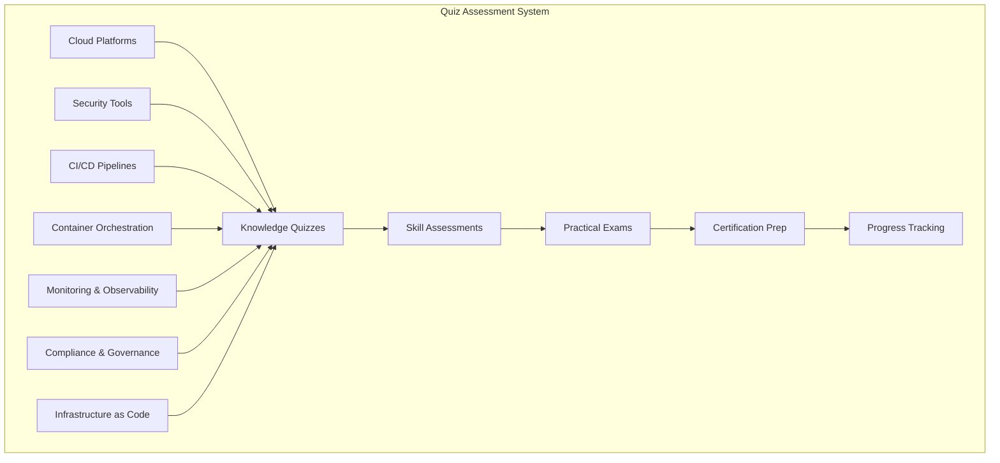

# DevSecOps Quizzes - Knowledge Assessment

## 📝 Overview
This section provides comprehensive quizzes to assess your DevSecOps knowledge and skills. These quizzes cover all aspects of DevSecOps including cloud platforms, security tools, CI/CD pipelines, container orchestration, and monitoring.

## 🏗️ Quiz Architecture



## 📁 Directory Structure

```
quizzes/
├── README.md
├── cloud-platforms/
│   ├── aws-quiz/
│   ├── azure-quiz/
│   └── gcp-quiz/
├── security-tools/
│   ├── vulnerability-scanning/
│   ├── secrets-management/
│   └── policy-enforcement/
├── cicd-pipelines/
│   ├── jenkins-quiz/
│   ├── gitlab-ci-quiz/
│   └── github-actions-quiz/
├── container-orchestration/
│   ├── kubernetes-quiz/
│   ├── docker-quiz/
│   └── helm-quiz/
├── monitoring-observability/
│   ├── prometheus-grafana/
│   ├── elk-stack/
│   └── jaeger/
└── comprehensive/
    ├── devsecops-fundamentals/
    ├── enterprise-practices/
    └── certification-prep/
```

## 🎯 Quiz Categories

### 1. Cloud Platforms Quizzes

#### AWS DevSecOps Quiz
**Duration**: 30 minutes  
**Questions**: 25  
**Difficulty**: Intermediate

**Sample Questions:**

1. **Which AWS service is used for container orchestration?**
   - A) EC2
   - B) EKS
   - C) S3
   - D) Lambda
   - **Answer**: B) EKS

2. **What is the purpose of AWS IAM in DevSecOps?**
   - A) Load balancing
   - B) Identity and access management
   - C) Data storage
   - D) Network routing
   - **Answer**: B) Identity and access management

3. **Which AWS service provides vulnerability scanning for container images?**
   - A) Inspector
   - B) GuardDuty
   - C) ECR
   - D) Security Hub
   - **Answer**: A) Inspector

#### Azure DevSecOps Quiz
**Duration**: 30 minutes  
**Questions**: 25  
**Difficulty**: Intermediate

**Sample Questions:**

1. **What is Azure DevOps used for?**
   - A) Virtual machines only
   - B) Complete DevOps platform
   - C) Database management
   - D) Network security
   - **Answer**: B) Complete DevOps platform

2. **Which Azure service provides container orchestration?**
   - A) Azure Functions
   - B) AKS
   - C) App Service
   - D) Virtual Machines
   - **Answer**: B) AKS

#### GCP DevSecOps Quiz
**Duration**: 30 minutes  
**Questions**: 25  
**Difficulty**: Intermediate

**Sample Questions:**

1. **What is Google Kubernetes Engine (GKE) used for?**
   - A) Data analytics
   - B) Container orchestration
   - C) Machine learning
   - D) Storage management
   - **Answer**: B) Container orchestration

### 2. Security Tools Quizzes

#### Vulnerability Scanning Quiz
**Duration**: 25 minutes  
**Questions**: 20  
**Difficulty**: Intermediate

**Sample Questions:**

1. **What does SAST stand for?**
   - A) Static Application Security Testing
   - B) System Application Security Testing
   - C) Secure Application Security Testing
   - D) Software Application Security Testing
   - **Answer**: A) Static Application Security Testing

2. **Which tool is commonly used for container vulnerability scanning?**
   - A) SonarQube
   - B) Trivy
   - C) Checkmarx
   - D) OWASP ZAP
   - **Answer**: B) Trivy

#### Secrets Management Quiz
**Duration**: 20 minutes  
**Questions**: 15  
**Difficulty**: Beginner

**Sample Questions:**

1. **What is the primary purpose of secrets management?**
   - A) Code versioning
   - B) Secure storage of sensitive data
   - C) Network monitoring
   - D) Load balancing
   - **Answer**: B) Secure storage of sensitive data

### 3. CI/CD Pipelines Quizzes

#### Jenkins Quiz
**Duration**: 35 minutes  
**Questions**: 30  
**Difficulty**: Intermediate

**Sample Questions:**

1. **What is a Jenkins pipeline?**
   - A) A network connection
   - B) A series of automated steps
   - C) A database table
   - D) A security policy
   - **Answer**: B) A series of automated steps

2. **Which Jenkins plugin is used for Docker integration?**
   - A) Git Plugin
   - B) Docker Plugin
   - C) Maven Plugin
   - D) Ant Plugin
   - **Answer**: B) Docker Plugin

#### GitLab CI Quiz
**Duration**: 30 minutes  
**Questions**: 25  
**Difficulty**: Intermediate

**Sample Questions:**

1. **What file is used to define GitLab CI/CD pipelines?**
   - A) pipeline.yml
   - B) .gitlab-ci.yml
   - C) ci.yaml
   - D) gitlab-pipeline.yml
   - **Answer**: B) .gitlab-ci.yml

#### GitHub Actions Quiz
**Duration**: 25 minutes  
**Questions**: 20  
**Difficulty**: Beginner

**Sample Questions:**

1. **Where are GitHub Actions workflows stored?**
   - A) .github/workflows/
   - B) .actions/
   - C) .workflows/
   - D) .ci/
   - **Answer**: A) .github/workflows/

### 4. Container Orchestration Quizzes

#### Kubernetes Quiz
**Duration**: 40 minutes  
**Questions**: 35  
**Difficulty**: Advanced

**Sample Questions:**

1. **What is a Pod in Kubernetes?**
   - A) A network interface
   - B) The smallest deployable unit
   - C) A storage volume
   - D) A security policy
   - **Answer**: B) The smallest deployable unit

2. **Which Kubernetes resource is used for load balancing?**
   - A) Pod
   - B) Service
   - C) Deployment
   - D) ConfigMap
   - **Answer**: B) Service

#### Docker Quiz
**Duration**: 30 minutes  
**Questions**: 25  
**Difficulty**: Beginner

**Sample Questions:**

1. **What is a Dockerfile used for?**
   - A) Running containers
   - B) Building images
   - C) Managing networks
   - D) Storing data
   - **Answer**: B) Building images

### 5. Monitoring & Observability Quizzes

#### Prometheus & Grafana Quiz
**Duration**: 35 minutes  
**Questions**: 30  
**Difficulty**: Intermediate

**Sample Questions:**

1. **What is Prometheus used for?**
   - A) Container orchestration
   - B) Metrics collection and monitoring
   - C) Log management
   - D) Security scanning
   - **Answer**: B) Metrics collection and monitoring

2. **What is Grafana primarily used for?**
   - A) Data visualization
   - B) Container management
   - C) Security scanning
   - D) Code analysis
   - **Answer**: A) Data visualization

### 6. Comprehensive Quizzes

#### DevSecOps Fundamentals Quiz
**Duration**: 60 minutes  
**Questions**: 50  
**Difficulty**: Intermediate

**Sample Questions:**

1. **What are the three pillars of DevSecOps?**
   - A) Development, Security, Operations
   - B) Design, Security, Operations
   - C) Development, System, Operations
   - D) Design, System, Operations
   - **Answer**: A) Development, Security, Operations

2. **What is the primary goal of DevSecOps?**
   - A) Faster development
   - B) Integrated security throughout the SDLC
   - C) Cost reduction
   - D) Better documentation
   - **Answer**: B) Integrated security throughout the SDLC

#### Enterprise Practices Quiz
**Duration**: 45 minutes  
**Questions**: 40  
**Difficulty**: Advanced

**Sample Questions:**

1. **What is Policy as Code?**
   - A) Writing policies in code format
   - B) Managing policies through code
   - C) Automating policy enforcement
   - D) All of the above
   - **Answer**: D) All of the above

## 📊 Quiz Features

### 1. Interactive Questions
- Multiple choice questions
- True/False questions
- Scenario-based questions
- Code analysis questions
- Diagram interpretation questions

### 2. Difficulty Levels
- **Beginner**: Basic concepts and terminology
- **Intermediate**: Practical application and tools
- **Advanced**: Complex scenarios and enterprise practices
- **Expert**: Deep technical knowledge and troubleshooting

### 3. Time Management
- Timed quizzes with countdown
- Pause and resume functionality
- Time warnings and notifications
- Automatic submission on timeout

### 4. Progress Tracking
- Score tracking and history
- Performance analytics
- Weak area identification
- Improvement recommendations

## 🧪 Sample Quiz Questions

### Cloud Platforms - AWS
```markdown
**Question 1**: Which AWS service provides managed Kubernetes clusters?
- A) ECS
- B) EKS
- C) Lambda
- D) EC2

**Answer**: B) EKS

**Explanation**: Amazon Elastic Kubernetes Service (EKS) provides managed Kubernetes clusters on AWS.
```

### Security Tools - Vulnerability Scanning
```markdown
**Question 2**: What is the difference between SAST and DAST?
- A) SAST analyzes running applications, DAST analyzes source code
- B) SAST analyzes source code, DAST analyzes running applications
- C) Both analyze source code
- D) Both analyze running applications

**Answer**: B) SAST analyzes source code, DAST analyzes running applications

**Explanation**: SAST (Static Application Security Testing) analyzes source code without executing it, while DAST (Dynamic Application Security Testing) analyzes running applications.
```

### CI/CD Pipelines - Jenkins
```markdown
**Question 3**: What is the purpose of a Jenkins pipeline?
- A) To store code
- B) To automate the software delivery process
- C) To manage databases
- D) To monitor networks

**Answer**: B) To automate the software delivery process

**Explanation**: Jenkins pipelines automate the software delivery process by defining a series of steps that build, test, and deploy applications.
```

### Container Orchestration - Kubernetes
```markdown
**Question 4**: What is the difference between a Deployment and a StatefulSet?
- A) Deployment is for stateless apps, StatefulSet is for stateful apps
- B) StatefulSet is for stateless apps, Deployment is for stateful apps
- C) Both are for stateless apps
- D) Both are for stateful apps

**Answer**: A) Deployment is for stateless apps, StatefulSet is for stateful apps

**Explanation**: Deployments are used for stateless applications where pods are interchangeable, while StatefulSets are used for stateful applications where pods have unique identities and persistent storage.
```

## 📚 Study Resources

### Preparation Materials
- [DevSecOps Fundamentals Guide](study-materials/devsecops-fundamentals.md)
- [Cloud Platform Cheat Sheets](study-materials/cloud-cheat-sheets.md)
- [Security Tools Reference](study-materials/security-tools-reference.md)
- [CI/CD Best Practices](study-materials/cicd-best-practices.md)

### Practice Tests
- [Mock Certification Exams](practice-tests/mock-exams.md)
- [Timed Practice Quizzes](practice-tests/timed-quizzes.md)
- [Scenario-Based Questions](practice-tests/scenario-questions.md)
- [Code Analysis Tests](practice-tests/code-analysis.md)

## 🎯 Assessment Criteria

### Scoring System
- **90-100%**: Excellent - Expert level knowledge
- **80-89%**: Good - Advanced level knowledge
- **70-79%**: Satisfactory - Intermediate level knowledge
- **60-69%**: Needs Improvement - Basic level knowledge
- **Below 60%**: Requires Study - Beginner level knowledge

### Certification Preparation
- **AWS Certified**: DevOps Engineer, Security Specialty
- **Azure Certified**: DevOps Engineer, Security Engineer
- **GCP Certified**: Professional DevOps Engineer, Security Engineer
- **Kubernetes Certified**: CKA, CKS, CKAD
- **General DevSecOps**: Various vendor certifications

## 📈 Progress Tracking

### Individual Progress
- Quiz scores and trends
- Time spent on each topic
- Weak areas identification
- Improvement recommendations
- Study plan suggestions

### Group Analytics
- Class performance metrics
- Topic difficulty analysis
- Common mistake patterns
- Success rate trends
- Benchmark comparisons

## 🤝 Getting Help

### Support Channels
- **Documentation**: Comprehensive study guides
- **Forums**: Community discussions and Q&A
- **Mentorship**: Connect with DevSecOps experts
- **Study Groups**: Join learning communities

### Community Resources
- **Slack**: #devsecops-quizzes
- **Discord**: Quiz Discussion Community
- **LinkedIn**: DevSecOps Study Group
- **YouTube**: Quiz Explanation Videos

---

**Ready to test your DevSecOps knowledge?** Start with the fundamentals quiz and work your way up to advanced assessments!
