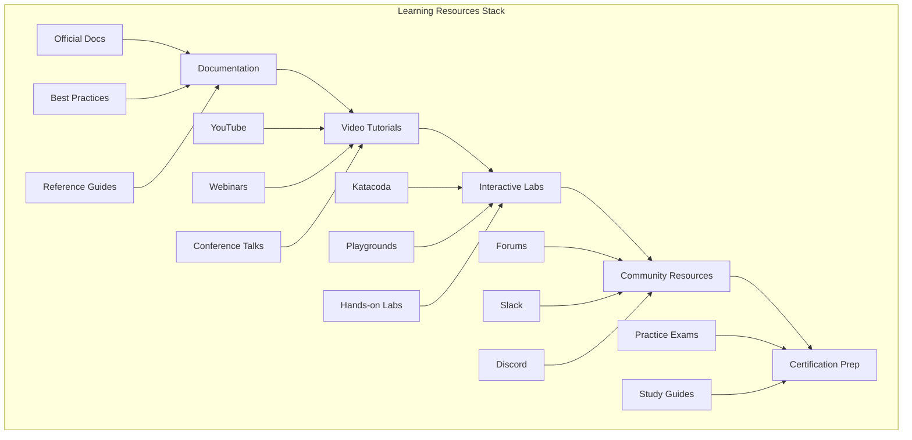

# DevSecOps Resources - Learning and Reference Materials

## 📚 Overview
This section provides comprehensive learning resources and reference materials for DevSecOps practitioners. It includes documentation, videos, tutorials, best practices, and community resources to support continuous learning and skill development.

## 🏗️ Resources Architecture



## 📁 Directory Structure

```
11-resources/
├── README.md
├── documentation/
│   ├── README.md
│   ├── best-practices/
│   ├── reference-guides/
│   └── troubleshooting/
├── videos/
│   ├── README.md
│   ├── tutorials/
│   ├── webinars/
│   └── conference-talks/
└── references/
    ├── README.md
    ├── official-docs/
    ├── community-resources/
    └── certification-guides/
```

## 📖 Documentation Resources

### 1. Best Practices Guides

#### DevSecOps Best Practices
```markdown
# DevSecOps Best Practices

## Security-First Development
- Implement security from the beginning of the development lifecycle
- Use automated security scanning in CI/CD pipelines
- Apply the principle of least privilege
- Regular security training for development teams

## Infrastructure as Code
- Store all infrastructure configurations in version control
- Use immutable infrastructure patterns
- Implement proper secret management
- Regular infrastructure audits and compliance checks

## Continuous Integration/Continuous Deployment
- Automate all build, test, and deployment processes
- Implement comprehensive testing strategies
- Use blue-green or canary deployment strategies
- Monitor and alert on deployment success/failure

## Monitoring and Observability
- Implement the three pillars of observability: metrics, logs, and traces
- Set up proactive monitoring and alerting
- Use distributed tracing for microservices
- Regular capacity planning and performance optimization

## Compliance and Governance
- Implement policy as code
- Regular compliance audits and reporting
- Document all processes and procedures
- Maintain audit trails for all changes
```

#### Cloud Security Best Practices
```markdown
# Cloud Security Best Practices

## Identity and Access Management
- Implement multi-factor authentication (MFA)
- Use role-based access control (RBAC)
- Regular access reviews and audits
- Implement principle of least privilege

## Data Protection
- Encrypt data at rest and in transit
- Implement proper key management
- Regular data backup and recovery testing
- Data classification and handling procedures

## Network Security
- Use VPCs and private subnets
- Implement network segmentation
- Use security groups and NACLs
- Regular network security assessments

## Monitoring and Logging
- Enable comprehensive logging
- Implement security monitoring
- Set up alerting for security events
- Regular log analysis and review
```

### 2. Reference Guides

#### Kubernetes Quick Reference
```yaml
# kubernetes-quick-reference.yaml
apiVersion: v1
kind: Pod
metadata:
  name: example-pod
  labels:
    app: example
spec:
  containers:
  - name: nginx
    image: nginx:1.21
    ports:
    - containerPort: 80
    resources:
      requests:
        memory: "64Mi"
        cpu: "250m"
      limits:
        memory: "128Mi"
        cpu: "500m"
    env:
    - name: ENV_VAR
      value: "example"
    volumeMounts:
    - name: config-volume
      mountPath: /etc/config
  volumes:
  - name: config-volume
    configMap:
      name: example-config
---
apiVersion: v1
kind: Service
metadata:
  name: example-service
spec:
  selector:
    app: example
  ports:
  - protocol: TCP
    port: 80
    targetPort: 80
  type: ClusterIP
---
apiVersion: apps/v1
kind: Deployment
metadata:
  name: example-deployment
spec:
  replicas: 3
  selector:
    matchLabels:
      app: example
  template:
    metadata:
      labels:
        app: example
    spec:
      containers:
      - name: nginx
        image: nginx:1.21
        ports:
        - containerPort: 80
```

#### Docker Commands Reference
```bash
# Docker Commands Quick Reference

# Image Management
docker build -t myapp:latest .
docker images
docker rmi myapp:latest
docker pull nginx:latest
docker push myregistry/myapp:latest

# Container Management
docker run -d --name mycontainer nginx:latest
docker ps
docker ps -a
docker stop mycontainer
docker start mycontainer
docker rm mycontainer
docker exec -it mycontainer /bin/bash

# Docker Compose
docker-compose up -d
docker-compose down
docker-compose logs
docker-compose ps
docker-compose build

# Volume Management
docker volume create myvolume
docker volume ls
docker volume rm myvolume
docker run -v myvolume:/data nginx:latest

# Network Management
docker network create mynetwork
docker network ls
docker network rm mynetwork
docker run --network mynetwork nginx:latest
```

#### Terraform Commands Reference
```bash
# Terraform Commands Quick Reference

# Initialization
terraform init
terraform init -upgrade

# Planning
terraform plan
terraform plan -var="key=value"
terraform plan -var-file="production.tfvars"

# Application
terraform apply
terraform apply -auto-approve
terraform apply -target=aws_instance.web

# State Management
terraform state list
terraform state show aws_instance.web
terraform state mv aws_instance.web aws_instance.new_web
terraform state rm aws_instance.web

# Import
terraform import aws_instance.web i-1234567890abcdef0

# Output
terraform output
terraform output instance_ip

# Destroy
terraform destroy
terraform destroy -target=aws_instance.web

# Workspace
terraform workspace list
terraform workspace new production
terraform workspace select production
```

### 3. Troubleshooting Guides

#### Common Kubernetes Issues
```markdown
# Kubernetes Troubleshooting Guide

## Pod Issues

### Pod Stuck in Pending State
```bash
# Check pod events
kubectl describe pod <pod-name>

# Check node resources
kubectl top nodes

# Check node conditions
kubectl get nodes -o wide
```

### Pod CrashLoopBackOff
```bash
# Check pod logs
kubectl logs <pod-name>

# Check previous container logs
kubectl logs <pod-name> --previous

# Check pod events
kubectl describe pod <pod-name>
```

### ImagePullBackOff
```bash
# Check image name and tag
kubectl describe pod <pod-name>

# Check image pull secrets
kubectl get secrets

# Test image pull manually
docker pull <image-name>
```

## Service Issues

### Service Not Accessible
```bash
# Check service endpoints
kubectl get endpoints <service-name>

# Check service selector
kubectl get service <service-name> -o yaml

# Test service connectivity
kubectl run test-pod --image=busybox --rm -it -- nslookup <service-name>
```

## Network Issues

### DNS Resolution Problems
```bash
# Check DNS configuration
kubectl get configmap coredns -n kube-system -o yaml

# Test DNS resolution
kubectl run test-pod --image=busybox --rm -it -- nslookup kubernetes.default
```

## Storage Issues

### Persistent Volume Issues
```bash
# Check PV status
kubectl get pv

# Check PVC status
kubectl get pvc

# Check storage class
kubectl get storageclass
```
```

## 🎥 Video Resources

### 1. Tutorial Playlists

#### DevSecOps Fundamentals
- **Introduction to DevSecOps**: Overview of DevSecOps principles and practices
- **Security in CI/CD**: Implementing security in continuous integration pipelines
- **Infrastructure as Code**: Managing infrastructure with code
- **Container Security**: Securing containerized applications
- **Monitoring and Observability**: Setting up comprehensive monitoring

#### Cloud Platform Tutorials
- **AWS DevSecOps**: Complete AWS DevSecOps implementation
- **Azure DevSecOps**: Microsoft Azure DevSecOps practices
- **GCP DevSecOps**: Google Cloud Platform DevSecOps
- **Multi-Cloud Strategies**: Managing multiple cloud providers

#### Tool-Specific Tutorials
- **Kubernetes Security**: Securing Kubernetes clusters
- **Docker Best Practices**: Container security and optimization
- **Terraform Advanced**: Advanced Terraform patterns and practices
- **Jenkins Pipeline**: Building robust CI/CD pipelines

### 2. Webinar Series

#### Enterprise DevSecOps
- **DevSecOps Transformation**: How to transform your organization
- **Security Culture**: Building a security-first culture
- **Compliance Automation**: Automating compliance processes
- **Risk Management**: Managing security risks in DevOps

#### Technical Deep Dives
- **Zero Trust Architecture**: Implementing zero trust principles
- **Service Mesh Security**: Securing microservices communication
- **GitOps Security**: Security considerations in GitOps
- **Cloud-Native Security**: Security for cloud-native applications

### 3. Conference Talks

#### Industry Conferences
- **DevSecOps Summit**: Latest trends and best practices
- **KubeCon**: Kubernetes security and operations
- **AWS re:Invent**: AWS security and DevSecOps
- **Microsoft Build**: Azure DevSecOps and security

#### Community Events
- **Local Meetups**: Regional DevSecOps meetups
- **Virtual Conferences**: Online DevSecOps events
- **Workshops**: Hands-on DevSecOps workshops
- **Panel Discussions**: Expert panel discussions

## 🌐 Community Resources

### 1. Online Communities

#### Forums and Discussion Boards
- **Reddit r/DevSecOps**: Community discussions and Q&A
- **Stack Overflow**: Technical questions and answers
- **DevSecOps Slack**: Real-time community chat
- **Discord Servers**: Gaming-style community platforms

#### Professional Networks
- **LinkedIn Groups**: Professional networking and discussions
- **GitHub Discussions**: Open source project discussions
- **Meetup Groups**: Local and virtual meetups
- **Professional Associations**: Industry organizations

### 2. Open Source Projects

#### DevSecOps Tools
- **OWASP ZAP**: Web application security scanner
- **Trivy**: Container vulnerability scanner
- **Falco**: Runtime security monitoring
- **OPA**: Policy as code engine

#### Learning Projects
- **DevSecOps Labs**: Hands-on learning environments
- **Sample Applications**: Reference implementations
- **Tutorial Repositories**: Step-by-step guides
- **Best Practice Examples**: Real-world implementations

### 3. Certification Resources

#### Study Materials
- **Official Study Guides**: Vendor-provided materials
- **Practice Exams**: Mock certification tests
- **Flashcards**: Quick reference materials
- **Video Courses**: Comprehensive video training

#### Certification Paths
- **AWS Certifications**: Cloud security and DevOps
- **Azure Certifications**: Microsoft cloud certifications
- **GCP Certifications**: Google Cloud certifications
- **Kubernetes Certifications**: Container orchestration

## 🧪 Interactive Learning Platforms

### 1. Hands-on Labs

#### Cloud Platforms
- **AWS Labs**: Interactive AWS learning environments
- **Azure Labs**: Microsoft Azure hands-on labs
- **GCP Labs**: Google Cloud Platform labs
- **Multi-Cloud Labs**: Cross-platform scenarios

#### Container Platforms
- **Kubernetes Labs**: Interactive Kubernetes environments
- **Docker Labs**: Container development labs
- **Istio Labs**: Service mesh learning environments
- **Helm Labs**: Package management labs

### 2. Playgrounds

#### Online Playgrounds
- **Katacoda**: Interactive learning scenarios
- **Play with Kubernetes**: Browser-based Kubernetes
- **Play with Docker**: Docker learning environment
- **Terraform Playground**: Infrastructure as code practice

#### Local Development
- **Minikube**: Local Kubernetes development
- **Docker Desktop**: Local container development
- **Vagrant**: Virtualized development environments
- **VSCode Dev Containers**: Containerized development

## 📊 Learning Paths

### 1. Beginner Path
```markdown
# DevSecOps Beginner Learning Path

## Week 1-2: Fundamentals
- Introduction to DevOps and Security
- Basic cloud concepts
- Version control with Git
- Introduction to containers

## Week 3-4: CI/CD Basics
- Jenkins fundamentals
- GitHub Actions
- Basic pipeline development
- Testing strategies

## Week 5-6: Infrastructure as Code
- Terraform basics
- CloudFormation
- Configuration management
- Infrastructure automation

## Week 7-8: Container Orchestration
- Kubernetes fundamentals
- Docker best practices
- Container security
- Service mesh basics
```

### 2. Intermediate Path
```markdown
# DevSecOps Intermediate Learning Path

## Week 1-2: Advanced CI/CD
- Pipeline optimization
- Security scanning integration
- Deployment strategies
- Monitoring and alerting

## Week 3-4: Security Implementation
- Vulnerability management
- Secrets management
- Policy as code
- Compliance automation

## Week 5-6: Monitoring and Observability
- Prometheus and Grafana
- ELK Stack
- Distributed tracing
- Log management

## Week 7-8: Advanced Topics
- Service mesh security
- Zero trust architecture
- Multi-cloud strategies
- Disaster recovery
```

### 3. Advanced Path
```markdown
# DevSecOps Advanced Learning Path

## Week 1-2: Architecture Design
- Enterprise architecture patterns
- Security architecture
- Scalability and performance
- Cost optimization

## Week 3-4: Leadership and Strategy
- DevSecOps transformation
- Team leadership
- Change management
- Business alignment

## Week 5-6: Specialized Topics
- Compliance frameworks
- Risk management
- Incident response
- Business continuity

## Week 7-8: Certification and Portfolio
- Certification preparation
- Portfolio development
- Interview preparation
- Career advancement
```

## 🎯 Learning Objectives

### Technical Skills
- **Cloud Platforms**: Master AWS, Azure, and GCP
- **Container Technologies**: Kubernetes, Docker, and orchestration
- **Infrastructure as Code**: Terraform, CloudFormation, and automation
- **Security Tools**: Vulnerability scanning, policy enforcement, compliance
- **Monitoring**: Observability, alerting, and performance optimization

### Soft Skills
- **Communication**: Technical writing and presentation
- **Collaboration**: Teamwork and cross-functional collaboration
- **Problem Solving**: Troubleshooting and debugging
- **Leadership**: Team leadership and project management
- **Continuous Learning**: Staying updated with latest technologies

## 📚 Study Strategies

### 1. Active Learning
- **Hands-on Practice**: Build real projects and scenarios
- **Teaching Others**: Explain concepts to colleagues
- **Code Reviews**: Participate in code review processes
- **Documentation**: Write and maintain documentation

### 2. Structured Learning
- **Learning Paths**: Follow structured learning paths
- **Time Management**: Allocate dedicated study time
- **Goal Setting**: Set specific, measurable goals
- **Progress Tracking**: Monitor learning progress

### 3. Community Engagement
- **Forums**: Participate in community discussions
- **Meetups**: Attend local and virtual meetups
- **Conferences**: Attend industry conferences
- **Mentoring**: Find mentors and mentees

## 🤝 Contributing

### How to Contribute
1. **Fork the repository**
2. **Create a feature branch**
3. **Add learning resources or improvements**
4. **Submit a pull request**

### Contribution Areas
- **New learning materials**
- **Updated documentation**
- **Additional video resources**
- **Improved learning paths**

## 📞 Support

### Getting Help
- **Documentation**: Comprehensive guides in each folder
- **Issues**: GitHub issues for resource problems
- **Discussions**: Community discussions for learning questions
- **Mentorship**: Connect with learning mentors

### Community Resources
- **Slack**: #learning-resources
- **Discord**: Learning Community
- **LinkedIn**: DevSecOps Learning Group
- **YouTube**: Learning Tutorials Channel

---

**Ready to accelerate your DevSecOps learning?** Explore the comprehensive resources and start your learning journey today!
