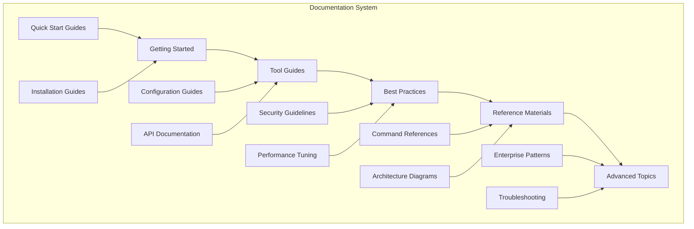

# DevSecOps Documentation - Comprehensive Reference Library

## 📚 Overview
This section provides comprehensive documentation for all DevSecOps tools, practices, and concepts. It serves as a complete reference library for practitioners at all levels, from beginners to experts.

## 🏗️ Documentation Architecture



## 📁 Directory Structure

```
documentation/
├── README.md
├── getting-started/
│   ├── devsecops-overview/
│   ├── environment-setup/
│   └── first-project/
├── tool-guides/
│   ├── cloud-platforms/
│   ├── ci-cd-tools/
│   ├── security-tools/
│   └── monitoring-tools/
├── best-practices/
│   ├── security-practices/
│   ├── performance-optimization/
│   └── team-collaboration/
├── reference-materials/
│   ├── command-cheat-sheets/
│   ├── configuration-templates/
│   └── architecture-patterns/
└── advanced-topics/
    ├── enterprise-patterns/
    ├── troubleshooting-guides/
    └── migration-guides/
```

## 🚀 Getting Started Documentation

### 1. DevSecOps Overview
**File**: `getting-started/devsecops-overview/README.md`

#### What is DevSecOps?
DevSecOps is a cultural and technical approach that integrates security practices into the DevOps workflow. It emphasizes the importance of security throughout the entire software development lifecycle (SDLC).

#### Key Principles
- **Shift Left Security**: Integrate security early in the development process
- **Automation**: Automate security processes and compliance checks
- **Collaboration**: Foster collaboration between development, security, and operations teams
- **Continuous Monitoring**: Implement continuous security monitoring and feedback
- **Risk Management**: Proactively identify and mitigate security risks

#### Benefits
- **Faster Security**: Reduce time to detect and fix security issues
- **Cost Efficiency**: Lower costs through early security integration
- **Compliance**: Easier compliance with security standards and regulations
- **Quality**: Higher quality software with built-in security
- **Culture**: Security-first mindset across the organization

### 2. Environment Setup
**File**: `getting-started/environment-setup/README.md`

#### Prerequisites
- Modern operating system (Windows 10+, macOS 10.15+, or Linux)
- 8GB RAM minimum (16GB recommended)
- 50GB free disk space
- Internet connection
- Basic command-line knowledge

#### Required Tools
```bash
# Essential tools for DevSecOps
- Git (version control)
- Docker (containerization)
- Kubernetes (container orchestration)
- Terraform (infrastructure as code)
- Ansible (configuration management)
- Jenkins/GitLab CI/GitHub Actions (CI/CD)
- SonarQube (code quality)
- Prometheus/Grafana (monitoring)
```

#### Installation Scripts
```bash
# Ubuntu/Debian installation script
#!/bin/bash
# DevSecOps Environment Setup Script

# Update system
sudo apt update && sudo apt upgrade -y

# Install Git
sudo apt install git -y

# Install Docker
sudo apt install docker.io -y
sudo systemctl start docker
sudo systemctl enable docker
sudo usermod -aG docker $USER

# Install kubectl
curl -LO "https://dl.k8s.io/release/$(curl -L -s https://dl.k8s.io/release/stable.txt)/bin/linux/amd64/kubectl"
sudo install -o root -g root -m 0755 kubectl /usr/local/bin/kubectl

# Install Terraform
wget -O- https://apt.releases.hashicorp.com/gpg | gpg --dearmor | sudo tee /usr/share/keyrings/hashicorp-archive-keyring.gpg
echo "deb [signed-by=/usr/share/keyrings/hashicorp-archive-keyring.gpg] https://apt.releases.hashicorp.com $(lsb_release -cs) main" | sudo tee /etc/apt/sources.list.d/hashicorp.list
sudo apt update && sudo apt install terraform

# Install Ansible
sudo apt install ansible -y

# Install VS Code
wget -qO- https://packages.microsoft.com/keys/microsoft.asc | gpg --dearmor > packages.microsoft.gpg
sudo install -o root -g root -m 644 packages.microsoft.gpg /etc/apt/trusted.gpg.d/
sudo sh -c 'echo "deb [arch=amd64,arm64,armhf signed-by=/etc/apt/trusted.gpg.d/packages.microsoft.gpg] https://packages.microsoft.com/repos/code stable main" > /etc/apt/sources.list.d/vscode.list'
sudo apt update && sudo apt install code

echo "DevSecOps environment setup complete!"
```

### 3. First Project
**File**: `getting-started/first-project/README.md`

#### Project Overview
Create a simple web application with DevSecOps practices:
- Containerized Node.js application
- CI/CD pipeline with GitHub Actions
- Security scanning with Trivy
- Monitoring with Prometheus
- Deployment to Kubernetes

#### Step-by-Step Guide
1. **Create Repository**
   ```bash
   mkdir devsecops-first-project
   cd devsecops-first-project
   git init
   ```

2. **Create Application**
   ```javascript
   // server.js
   const express = require('express');
   const app = express();
   const port = process.env.PORT || 3000;
   
   app.get('/', (req, res) => {
     res.json({ message: 'Hello DevSecOps!' });
   });
   
   app.get('/health', (req, res) => {
     res.json({ status: 'healthy' });
   });
   
   app.listen(port, () => {
     console.log(`Server running on port ${port}`);
   });
   ```

3. **Create Dockerfile**
   ```dockerfile
   FROM node:18-alpine
   WORKDIR /app
   COPY package*.json ./
   RUN npm ci --only=production
   COPY . .
   EXPOSE 3000
   CMD ["npm", "start"]
   ```

4. **Create CI/CD Pipeline**
   ```yaml
   # .github/workflows/ci-cd.yml
   name: CI/CD Pipeline
   
   on:
     push:
       branches: [ main ]
     pull_request:
       branches: [ main ]
   
   jobs:
     test:
       runs-on: ubuntu-latest
       steps:
       - uses: actions/checkout@v3
       - name: Setup Node.js
         uses: actions/setup-node@v3
         with:
           node-version: '18'
       - name: Install dependencies
         run: npm ci
       - name: Run tests
         run: npm test
   
     security:
       runs-on: ubuntu-latest
       steps:
       - uses: actions/checkout@v3
       - name: Run Trivy vulnerability scanner
         uses: aquasecurity/trivy-action@master
         with:
           image-ref: 'myapp:latest'
           format: 'sarif'
           output: 'trivy-results.sarif'
   
     deploy:
       needs: [test, security]
       runs-on: ubuntu-latest
       if: github.ref == 'refs/heads/main'
       steps:
       - name: Deploy to Kubernetes
         run: echo "Deploying to Kubernetes..."
   ```

## 🛠️ Tool Guides

### 1. Cloud Platforms
**Directory**: `tool-guides/cloud-platforms/`

#### AWS DevSecOps Guide
**File**: `tool-guides/cloud-platforms/aws-devsecops.md`

##### Core Services
- **EC2**: Virtual machines for compute
- **EKS**: Managed Kubernetes service
- **ECS**: Container orchestration
- **Lambda**: Serverless computing
- **S3**: Object storage
- **RDS**: Managed databases
- **IAM**: Identity and access management
- **VPC**: Virtual private cloud
- **CloudFormation**: Infrastructure as code
- **CodePipeline**: CI/CD service
- **CodeBuild**: Build service
- **CodeDeploy**: Deployment service
- **GuardDuty**: Threat detection
- **Security Hub**: Security findings aggregation
- **CloudWatch**: Monitoring and logging
- **CloudTrail**: Audit logging
- **Config**: Resource compliance
- **KMS**: Key management
- **Secrets Manager**: Secrets management
- **WAF**: Web application firewall
- **Shield**: DDoS protection

##### Best Practices
- Use IAM roles instead of access keys
- Enable CloudTrail for audit logging
- Use VPC for network isolation
- Implement least privilege access
- Enable encryption at rest and in transit
- Use CloudFormation for infrastructure
- Implement automated security scanning
- Set up monitoring and alerting

#### Azure DevSecOps Guide
**File**: `tool-guides/cloud-platforms/azure-devsecops.md`

##### Core Services
- **Virtual Machines**: Compute instances
- **AKS**: Managed Kubernetes service
- **Container Instances**: Serverless containers
- **App Service**: Web application hosting
- **Functions**: Serverless computing
- **Storage**: Blob, file, and queue storage
- **SQL Database**: Managed SQL database
- **Cosmos DB**: NoSQL database
- **Azure AD**: Identity and access management
- **Virtual Network**: Network isolation
- **Resource Manager**: Infrastructure as code
- **Azure DevOps**: Complete DevOps platform
- **Security Center**: Security management
- **Sentinel**: SIEM solution
- **Monitor**: Monitoring and logging
- **Key Vault**: Secrets management
- **Firewall**: Network security
- **DDoS Protection**: DDoS mitigation

##### Best Practices
- Use Azure AD for identity management
- Enable Azure Security Center
- Use Resource Manager templates
- Implement network security groups
- Enable logging and monitoring
- Use managed identities
- Implement backup and disaster recovery
- Follow the principle of least privilege

#### GCP DevSecOps Guide
**File**: `tool-guides/cloud-platforms/gcp-devsecops.md`

##### Core Services
- **Compute Engine**: Virtual machines
- **GKE**: Managed Kubernetes service
- **Cloud Run**: Serverless containers
- **App Engine**: Platform as a service
- **Cloud Functions**: Serverless functions
- **Cloud Storage**: Object storage
- **Cloud SQL**: Managed databases
- **Firestore**: NoSQL database
- **Cloud IAM**: Identity and access management
- **VPC**: Virtual private cloud
- **Deployment Manager**: Infrastructure as code
- **Cloud Build**: CI/CD service
- **Security Command Center**: Security management
- **Cloud Logging**: Log management
- **Cloud Monitoring**: Metrics and monitoring
- **Secret Manager**: Secrets management
- **Cloud Armor**: DDoS protection and WAF

##### Best Practices
- Use Cloud IAM for access control
- Enable Security Command Center
- Use Deployment Manager or Terraform
- Implement network security
- Enable audit logging
- Use managed services
- Implement backup strategies
- Follow security best practices

### 2. CI/CD Tools
**Directory**: `tool-guides/cicd-tools/`

#### Jenkins Guide
**File**: `tool-guides/cicd-tools/jenkins-guide.md`

##### Installation
```bash
# Ubuntu/Debian
wget -q -O - https://pkg.jenkins.io/debian/jenkins.io.key | sudo apt-key add -
sudo sh -c 'echo deb https://pkg.jenkins.io/debian binary/ > /etc/apt/sources.list.d/jenkins.list'
sudo apt update
sudo apt install jenkins

# Start Jenkins
sudo systemctl start jenkins
sudo systemctl enable jenkins
```

##### Pipeline Examples
```groovy
// Declarative Pipeline
pipeline {
    agent any
    
    stages {
        stage('Build') {
            steps {
                sh 'docker build -t myapp .'
            }
        }
        
        stage('Test') {
            steps {
                sh 'docker run --rm myapp npm test'
            }
        }
        
        stage('Security') {
            steps {
                sh 'trivy image myapp'
            }
        }
        
        stage('Deploy') {
            steps {
                sh 'kubectl apply -f k8s/'
            }
        }
    }
}
```

#### GitLab CI Guide
**File**: `tool-guides/cicd-tools/gitlab-ci-guide.md`

##### Pipeline Configuration
```yaml
# .gitlab-ci.yml
stages:
  - build
  - test
  - security
  - deploy

variables:
  DOCKER_IMAGE: $CI_REGISTRY_IMAGE
  DOCKER_TAG: $CI_COMMIT_SHA

build:
  stage: build
  image: docker:latest
  services:
    - docker:dind
  script:
    - docker build -t $DOCKER_IMAGE:$DOCKER_TAG .
    - docker push $DOCKER_IMAGE:$DOCKER_TAG

test:
  stage: test
  image: $DOCKER_IMAGE:$DOCKER_TAG
  script:
    - npm test

security:
  stage: security
  image: docker:latest
  services:
    - docker:dind
  script:
    - docker run --rm -v /var/run/docker.sock:/var/run/docker.sock
      aquasec/trivy image $DOCKER_IMAGE:$DOCKER_TAG

deploy:
  stage: deploy
  image: alpine:latest
  script:
    - kubectl apply -f k8s/
  only:
    - main
```

#### GitHub Actions Guide
**File**: `tool-guides/cicd-tools/github-actions-guide.md`

##### Workflow Examples
```yaml
# .github/workflows/ci-cd.yml
name: CI/CD Pipeline

on:
  push:
    branches: [ main ]
  pull_request:
    branches: [ main ]

jobs:
  test:
    runs-on: ubuntu-latest
    steps:
    - uses: actions/checkout@v3
    - name: Setup Node.js
      uses: actions/setup-node@v3
      with:
        node-version: '18'
    - name: Install dependencies
      run: npm ci
    - name: Run tests
      run: npm test

  security:
    runs-on: ubuntu-latest
    steps:
    - uses: actions/checkout@v3
    - name: Run Trivy vulnerability scanner
      uses: aquasecurity/trivy-action@master
      with:
        image-ref: 'myapp:latest'
        format: 'sarif'
        output: 'trivy-results.sarif'

  deploy:
    needs: [test, security]
    runs-on: ubuntu-latest
    if: github.ref == 'refs/heads/main'
    steps:
    - name: Deploy to Kubernetes
      run: echo "Deploying to Kubernetes..."
```

### 3. Security Tools
**Directory**: `tool-guides/security-tools/`

#### Vulnerability Scanning
**File**: `tool-guides/security-tools/vulnerability-scanning.md`

##### SAST Tools
- **SonarQube**: Code quality and security analysis
- **Checkmarx**: Static application security testing
- **Veracode**: Cloud-based security testing
- **Semgrep**: Fast static analysis

##### DAST Tools
- **OWASP ZAP**: Web application security scanner
- **Burp Suite**: Web vulnerability scanner
- **Nessus**: Vulnerability scanner
- **OpenVAS**: Open source vulnerability scanner

##### SCA Tools
- **Snyk**: Software composition analysis
- **OWASP Dependency Check**: Dependency vulnerability scanner
- **WhiteSource**: Software composition analysis
- **FOSSA**: Open source management

##### Container Scanning
- **Trivy**: Container vulnerability scanner
- **Clair**: Container vulnerability scanner
- **Anchore**: Container security platform
- **Twistlock**: Container security platform

#### Secrets Management
**File**: `tool-guides/security-tools/secrets-management.md`

##### Tools
- **HashiCorp Vault**: Secrets management platform
- **AWS Secrets Manager**: AWS secrets management
- **Azure Key Vault**: Azure secrets management
- **GCP Secret Manager**: GCP secrets management
- **Kubernetes Secrets**: Native Kubernetes secrets

##### Best Practices
- Rotate secrets regularly
- Use least privilege access
- Encrypt secrets at rest and in transit
- Audit secret access
- Use secret scanning tools
- Implement secret detection in CI/CD

### 4. Monitoring Tools
**Directory**: `tool-guides/monitoring-tools/`

#### Prometheus & Grafana
**File**: `tool-guides/monitoring-tools/prometheus-grafana.md`

##### Prometheus Configuration
```yaml
# prometheus.yml
global:
  scrape_interval: 15s

scrape_configs:
  - job_name: 'prometheus'
    static_configs:
      - targets: ['localhost:9090']
  
  - job_name: 'node-exporter'
    static_configs:
      - targets: ['node-exporter:9100']
```

##### Grafana Dashboard
```json
{
  "dashboard": {
    "title": "DevSecOps Dashboard",
    "panels": [
      {
        "title": "CPU Usage",
        "type": "graph",
        "targets": [
          {
            "expr": "100 - (avg(rate(node_cpu_seconds_total{mode=\"idle\"}[5m])) * 100)"
          }
        ]
      }
    ]
  }
}
```

#### ELK Stack
**File**: `tool-guides/monitoring-tools/elk-stack.md`

##### Elasticsearch Configuration
```yaml
# elasticsearch.yml
cluster.name: devsecops-cluster
node.name: elasticsearch-node-1
network.host: 0.0.0.0
discovery.type: single-node
```

##### Logstash Configuration
```ruby
# logstash.conf
input {
  beats {
    port => 5044
  }
}

filter {
  grok {
    match => { "message" => "%{COMBINEDAPACHELOG}" }
  }
}

output {
  elasticsearch {
    hosts => ["elasticsearch:9200"]
    index => "logs-%{+YYYY.MM.dd}"
  }
}
```

## 📋 Best Practices

### 1. Security Practices
**File**: `best-practices/security-practices/README.md`

#### Secure Coding
- Input validation and sanitization
- Output encoding
- Authentication and authorization
- Session management
- Error handling
- Logging and monitoring

#### Infrastructure Security
- Network segmentation
- Firewall configuration
- Access control
- Encryption
- Backup and recovery
- Incident response

#### Compliance
- GDPR compliance
- HIPAA compliance
- PCI DSS compliance
- SOX compliance
- ISO 27001 compliance

### 2. Performance Optimization
**File**: `best-practices/performance-optimization/README.md`

#### Application Performance
- Code optimization
- Database optimization
- Caching strategies
- Load balancing
- CDN usage

#### Infrastructure Performance
- Resource optimization
- Auto-scaling
- Monitoring and alerting
- Capacity planning
- Performance testing

### 3. Team Collaboration
**File**: `best-practices/team-collaboration/README.md`

#### Communication
- Regular standups
- Documentation
- Code reviews
- Knowledge sharing
- Incident post-mortems

#### Tools
- Slack/Teams
- Jira/Trello
- Confluence/Notion
- GitHub/GitLab
- Monitoring dashboards

## 📖 Reference Materials

### 1. Command Cheat Sheets
**Directory**: `reference-materials/command-cheat-sheets/`

#### Git Commands
```bash
# Basic Git commands
git init                    # Initialize repository
git clone <url>            # Clone repository
git add <file>             # Stage file
git commit -m "message"    # Commit changes
git push origin main       # Push to remote
git pull origin main       # Pull from remote
git status                 # Check status
git log                    # View history
git branch                 # List branches
git checkout <branch>      # Switch branch
git merge <branch>         # Merge branch
```

#### Docker Commands
```bash
# Docker commands
docker build -t <image> .  # Build image
docker run <image>         # Run container
docker ps                  # List containers
docker images              # List images
docker stop <container>    # Stop container
docker rm <container>      # Remove container
docker rmi <image>         # Remove image
docker exec -it <container> /bin/bash  # Execute command
```

#### Kubernetes Commands
```bash
# Kubernetes commands
kubectl get pods           # List pods
kubectl get services       # List services
kubectl get deployments    # List deployments
kubectl apply -f <file>    # Apply configuration
kubectl delete -f <file>   # Delete resources
kubectl describe <resource> # Describe resource
kubectl logs <pod>         # View logs
kubectl exec -it <pod> -- /bin/bash  # Execute command
```

### 2. Configuration Templates
**Directory**: `reference-materials/configuration-templates/`

#### Docker Compose Template
```yaml
# docker-compose.yml
version: '3.8'
services:
  web:
    build: .
    ports:
      - "3000:3000"
    environment:
      - NODE_ENV=production
    depends_on:
      - db
  
  db:
    image: postgres:13
    environment:
      - POSTGRES_DB=myapp
      - POSTGRES_USER=user
      - POSTGRES_PASSWORD=password
    volumes:
      - postgres_data:/var/lib/postgresql/data

volumes:
  postgres_data:
```

#### Kubernetes Deployment Template
```yaml
# deployment.yaml
apiVersion: apps/v1
kind: Deployment
metadata:
  name: myapp
spec:
  replicas: 3
  selector:
    matchLabels:
      app: myapp
  template:
    metadata:
      labels:
        app: myapp
    spec:
      containers:
      - name: myapp
        image: myapp:latest
        ports:
        - containerPort: 3000
        resources:
          requests:
            memory: "64Mi"
            cpu: "250m"
          limits:
            memory: "128Mi"
            cpu: "500m"
```

### 3. Architecture Patterns
**Directory**: `reference-materials/architecture-patterns/`

#### Microservices Architecture
- Service decomposition
- API gateway
- Service mesh
- Data management
- Monitoring and observability

#### Event-Driven Architecture
- Event sourcing
- CQRS (Command Query Responsibility Segregation)
- Event streaming
- Message queues
- Event processing

#### Serverless Architecture
- Function as a Service (FaaS)
- Backend as a Service (BaaS)
- Event-driven computing
- Auto-scaling
- Pay-per-use pricing

## 🔧 Advanced Topics

### 1. Enterprise Patterns
**File**: `advanced-topics/enterprise-patterns/README.md`

#### Multi-Cloud Strategy
- Cloud provider selection
- Hybrid cloud architecture
- Cloud migration strategies
- Cost optimization
- Vendor lock-in avoidance

#### Governance and Compliance
- Policy as code
- Compliance automation
- Risk management
- Audit trails
- Regulatory requirements

### 2. Troubleshooting Guides
**File**: `advanced-topics/troubleshooting-guides/README.md`

#### Common Issues
- Container startup failures
- Network connectivity problems
- Performance issues
- Security vulnerabilities
- Deployment failures

#### Debugging Techniques
- Log analysis
- Performance profiling
- Network debugging
- Security analysis
- Root cause analysis

### 3. Migration Guides
**File**: `advanced-topics/migration-guides/README.md`

#### Cloud Migration
- Assessment and planning
- Migration strategies
- Data migration
- Application migration
- Testing and validation

#### Tool Migration
- CI/CD tool migration
- Monitoring tool migration
- Security tool migration
- Database migration
- Infrastructure migration

## 📚 Additional Resources

### Learning Paths
- [Beginner Learning Path](learning-paths/beginner.md)
- [Intermediate Learning Path](learning-paths/intermediate.md)
- [Advanced Learning Path](learning-paths/advanced.md)
- [Expert Learning Path](learning-paths/expert.md)

### Certification Guides
- [AWS Certification Guide](certifications/aws.md)
- [Azure Certification Guide](certifications/azure.md)
- [GCP Certification Guide](certifications/gcp.md)
- [Kubernetes Certification Guide](certifications/kubernetes.md)

### Community Resources
- [DevSecOps Community](community/devsecops-community.md)
- [Open Source Projects](community/open-source-projects.md)
- [Conferences and Events](community/conferences-events.md)
- [Blogs and Articles](community/blogs-articles.md)

---

**Ready to dive deep into DevSecOps?** Start with the getting started guides and work your way through the comprehensive documentation!
