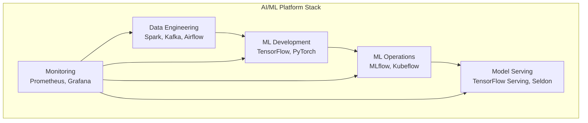
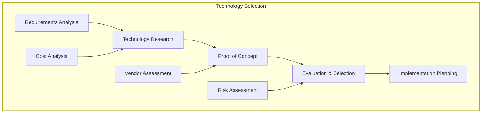

# DevSecOps Tools Technology Stack - Complete Learning Portfolio

## 🚀 Overview
This comprehensive DevSecOps Tools Technology Stack project serves as a complete learning portfolio for Cloud, Security, and DevSecOps engineering. It covers industry-standard tools used by enterprise corporations and provides hands-on learning experiences across AWS, GCP, and Azure cloud providers.

## Project Structure
```
technology-stack/
├── README.md
├── ai-ml-platform-stack/
├── technology-evaluation/
├── open-source-solutions/
├── commercial-platforms/
├── enterprise-platforms/
├── development-tools/
├── monitoring-tools/
├── integration-frameworks/
└── performance-optimization/
```

## Getting Started
1. Choose the technology stack component that fits your requirements
2. Review the implementation guide and code samples
3. Follow the step-by-step deployment instructions
4. Customize the configuration for your environment

## Technology Stack Components

### 1. AI/ML Platform Stack
- **Use Case**: Complete ML platform implementation
- **Complexity**: High
- **Scalability**: Platform scaling
- **Best For**: Enterprise ML platforms, research organizations

### 2. Technology Evaluation
- **Use Case**: Tool and technology selection
- **Complexity**: Medium
- **Scalability**: Evaluation scaling
- **Best For**: Technology decisions, vendor selection

### 3. Open Source Solutions
- **Use Case**: Cost-effective technology solutions
- **Complexity**: Medium to High
- **Scalability**: Community scaling
- **Best For**: Startups, cost-conscious organizations

### 4. Commercial Cloud Platforms
- **Use Case**: Managed ML services
- **Complexity**: Low to Medium
- **Scalability**: Cloud scaling
- **Best For**: Rapid development, managed services

### 5. Enterprise Platforms
- **Use Case**: Large-scale enterprise deployments
- **Complexity**: High
- **Scalability**: Enterprise scaling
- **Best For**: Large enterprises, regulated industries

### 6. Development Tools
- **Use Case**: ML development and experimentation
- **Complexity**: Low to Medium
- **Scalability**: Development scaling
- **Best For**: Data scientists, ML engineers

### 7. Monitoring Tools
- **Use Case**: System and model monitoring
- **Complexity**: Medium
- **Scalability**: Monitoring scaling
- **Best For**: Production systems, operations teams

### 8. Integration Frameworks
- **Use Case**: Tool and platform integration
- **Complexity**: High
- **Scalability**: Integration scaling
- **Best For**: Complex architectures, multi-tool environments

### 9. Performance Optimization
- **Use Case**: System and model optimization
- **Complexity**: High
- **Scalability**: Performance scaling
- **Best For**: High-performance systems, optimization teams

## Technology Stack Architecture

### AI/ML Platform Stack


### Technology Selection Framework


## Technology Categories

### Data Engineering Tools
- **Batch Processing**: Apache Spark, Apache Hadoop, Apache Beam
- **Stream Processing**: Apache Kafka, Apache Flink, Apache Storm
- **Workflow Orchestration**: Apache Airflow, Prefect, Dagster
- **Data Storage**: Data Lakes, Data Warehouses, NoSQL Databases

### ML Development Tools
- **ML Frameworks**: TensorFlow, PyTorch, Scikit-learn
- **Notebooks**: Jupyter, JupyterLab, VS Code
- **Version Control**: Git, DVC, Git LFS
- **Experiment Tracking**: MLflow, Weights & Biases, Neptune

### ML Operations Tools
- **Model Registry**: MLflow Model Registry, SageMaker Model Registry
- **Model Serving**: TensorFlow Serving, Seldon Core, KServe
- **Pipeline Orchestration**: Kubeflow, MLflow Pipelines
- **Monitoring**: MLflow Tracking, Prometheus, Grafana

### Infrastructure Tools
- **Containerization**: Docker, Kubernetes, Helm
- **Infrastructure as Code**: Terraform, CloudFormation, Pulumi
- **CI/CD**: GitHub Actions, GitLab CI, Jenkins
- **Monitoring**: Prometheus, Grafana, ELK Stack

### Security Tools
- **Security Scanning**: Trivy, Snyk, OWASP ZAP
- **Secrets Management**: HashiCorp Vault, AWS Secrets Manager
- **Access Control**: OPA, RBAC, ABAC
- **Compliance**: OpenSCAP, InSpec, Chef Compliance

## Technology Evaluation Framework

### Evaluation Criteria
1. **Functionality**
   - Feature completeness
   - Integration capabilities
   - Customization options

2. **Scalability**
   - Performance under load
   - Horizontal scaling
   - Resource efficiency

3. **Cost**
   - Licensing costs
   - Infrastructure requirements
   - Operational costs

4. **Support**
   - Documentation quality
   - Community support
   - Vendor support

5. **Security**
   - Security features
   - Compliance capabilities
   - Vulnerability management

6. **Ease of Use**
   - Learning curve
   - User experience
   - Developer productivity

### Evaluation Process
1. **Requirements Gathering**
   - Business requirements
   - Technical requirements
   - Non-functional requirements

2. **Market Research**
   - Available solutions
   - Vendor analysis
   - Community feedback

3. **Proof of Concept**
   - Technology validation
   - Performance testing
   - Integration testing

4. **Decision Making**
   - Scoring and ranking
   - Risk assessment
   - Cost-benefit analysis

## Open Source Solutions

### Advantages
- **Cost**: No licensing fees
- **Flexibility**: Full customization
- **Community**: Active development
- **Transparency**: Open source code

### Challenges
- **Support**: Limited vendor support
- **Complexity**: Higher implementation effort
- **Maintenance**: Ongoing maintenance required
- **Integration**: Manual integration effort

### Popular Open Source Tools
- **MLflow**: ML lifecycle management
- **Kubeflow**: Kubernetes ML toolkit
- **Apache Airflow**: Workflow orchestration
- **Apache Kafka**: Stream processing
- **Prometheus**: Monitoring and alerting
- **Grafana**: Visualization and dashboards

## Commercial Cloud Platforms

### Advantages
- **Managed Services**: Reduced operational overhead
- **Integration**: Built-in integrations
- **Support**: Vendor support and SLAs
- **Scalability**: Automatic scaling

### Challenges
- **Cost**: Ongoing subscription costs
- **Vendor Lock-in**: Platform dependencies
- **Customization**: Limited customization options
- **Data Sovereignty**: Cloud location constraints

### Popular Cloud Platforms
- **AWS SageMaker**: ML platform
- **Azure ML**: ML services
- **GCP Vertex AI**: ML platform
- **Databricks**: Unified analytics
- **Snowflake**: Data warehouse
- **Dataiku**: Collaborative data science

## Enterprise Platforms

### Advantages
- **Enterprise Features**: Advanced security and compliance
- **Support**: Enterprise-grade support
- **Integration**: Enterprise system integration
- **Governance**: Built-in governance features

### Challenges
- **Cost**: High licensing costs
- **Complexity**: Complex implementations
- **Vendor Dependencies**: Strong vendor relationships
- **Customization**: Limited flexibility

### Popular Enterprise Platforms
- **IBM Watson**: AI platform
- **SAS Viya**: Analytics platform
- **Alteryx**: Data analytics
- **Tableau**: Business intelligence
- **Informatica**: Data management
- **Collibra**: Data governance

## Development Tools

### IDEs and Notebooks
- **Jupyter**: Interactive computing
- **JupyterLab**: Jupyter development environment
- **VS Code**: Code editor with ML extensions
- **PyCharm**: Python IDE with ML support
- **DataSpell**: JetBrains ML IDE

### Version Control
- **Git**: Source code version control
- **DVC**: Data version control
- **Git LFS**: Large file storage
- **GitHub**: Code hosting and collaboration
- **GitLab**: DevOps platform

### Experiment Tracking
- **MLflow**: ML experiment tracking
- **Weights & Biases**: Experiment tracking
- **Neptune**: ML experiment management
- **Comet**: ML experiment tracking
- **Sacred**: Experiment configuration

## Monitoring Tools

### Metrics and Monitoring
- **Prometheus**: Time series database
- **Grafana**: Visualization and dashboards
- **Datadog**: Monitoring and analytics
- **New Relic**: Application performance monitoring
- **Splunk**: Log management and analytics

### Logging and Tracing
- **ELK Stack**: Elasticsearch, Logstash, Kibana
- **Fluentd**: Log collection and routing
- **Jaeger**: Distributed tracing
- **Zipkin**: Distributed tracing
- **OpenTelemetry**: Observability framework

### Alerting and Notification
- **PagerDuty**: Incident management
- **Slack**: Team communication
- **Email**: Traditional notification
- **Webhooks**: Custom integrations
- **SMS**: Mobile notifications

## Integration Frameworks

### API Integration
- **REST APIs**: Standard web APIs
- **GraphQL**: Query language for APIs
- **gRPC**: High-performance RPC framework
- **Webhooks**: Event-driven integration
- **Message Queues**: Asynchronous communication

### Data Integration
- **ETL/ELT**: Data transformation pipelines
- **Data Virtualization**: Unified data access
- **Change Data Capture**: Real-time data synchronization
- **Data Replication**: Data copying and synchronization
- **API Gateways**: API management and routing

### Platform Integration
- **Kubernetes**: Container orchestration
- **Service Mesh**: Service-to-service communication
- **Event Streaming**: Real-time event processing
- **Workflow Orchestration**: Process automation
- **Configuration Management**: Environment configuration

## Performance Optimization

### System Optimization
- **Resource Management**: CPU, memory, storage optimization
- **Network Optimization**: Bandwidth, latency, throughput
- **Database Optimization**: Query optimization, indexing
- **Cache Optimization**: Memory, distributed caching
- **Load Balancing**: Traffic distribution, failover

### ML Model Optimization
- **Model Compression**: Quantization, pruning
- **Inference Optimization**: Model serving, caching
- **Training Optimization**: Distributed training, hyperparameter tuning
- **Feature Optimization**: Feature selection, engineering
- **Pipeline Optimization**: Data processing, workflow optimization

### Monitoring and Tuning
- **Performance Monitoring**: Real-time performance tracking
- **Bottleneck Analysis**: Performance issue identification
- **Automated Tuning**: Self-optimizing systems
- **Capacity Planning**: Resource planning and scaling
- **Cost Optimization**: Resource cost optimization

## Implementation Strategy

### Phase 1: Foundation (Weeks 1-2)
1. **Technology Assessment**
   - Current technology inventory
   - Technology gap analysis
   - Requirements definition

2. **Tool Selection**
   - Technology evaluation
   - Vendor assessment
   - Proof of concept

### Phase 2: Implementation (Weeks 3-6)
1. **Core Tools**
   - Essential tool deployment
   - Basic integration setup
   - Team training

2. **Advanced Features**
   - Advanced tool features
   - Integration optimization
   - Performance tuning

### Phase 3: Optimization (Weeks 7-8)
1. **Performance Optimization**
   - System optimization
   - Tool optimization
   - Integration optimization

2. **Continuous Improvement**
   - Monitoring and metrics
   - Feedback and iteration
   - Tool updates and upgrades

## Success Metrics

### Technical Metrics
- **Tool Adoption**: 90% team adoption, 80% feature utilization
- **Integration Success**: 100% tool integration, seamless workflows
- **Performance**: < 100ms response time, > 10K req/sec

### Business Metrics
- **Developer Productivity**: 40% increase in development speed
- **Cost Efficiency**: 30% reduction in tool costs
- **Time to Market**: 50% reduction in development time

### Operational Metrics
- **Tool Reliability**: 99.9% tool availability, < 1 hour MTTR
- **Support Efficiency**: 80% self-service resolution, < 4 hour support response
- **User Satisfaction**: 90% user satisfaction score

## Best Practices

### 1. **Technology Selection**
- Align with business objectives
- Consider total cost of ownership
- Evaluate vendor stability and roadmap
- Plan for future growth and scalability

### 2. **Implementation**
- Start with essential tools
- Implement incrementally
- Provide comprehensive training
- Establish support processes

### 3. **Integration**
- Use standard interfaces and APIs
- Implement proper error handling
- Monitor integration health
- Plan for failure and recovery

### 4. **Maintenance**
- Regular tool updates and upgrades
- Monitor tool performance and usage
- Collect user feedback and requirements
- Plan for tool replacement and migration

### 5. **Security**
- Implement proper access controls
- Regular security assessments
- Monitor for vulnerabilities
- Follow security best practices

## Next Steps
Navigate to the specific technology stack component folder to view detailed implementation guides, code samples, and deployment instructions.
