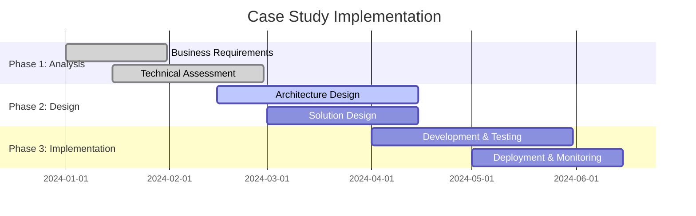
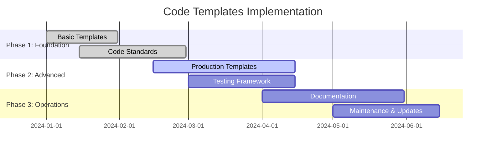
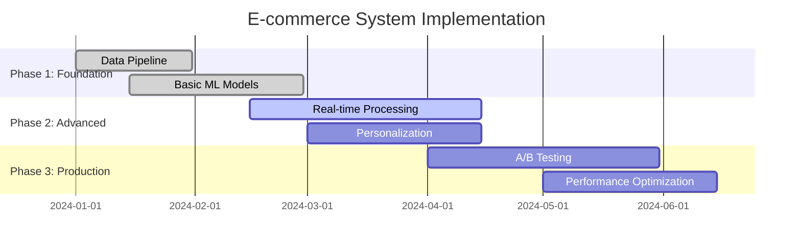
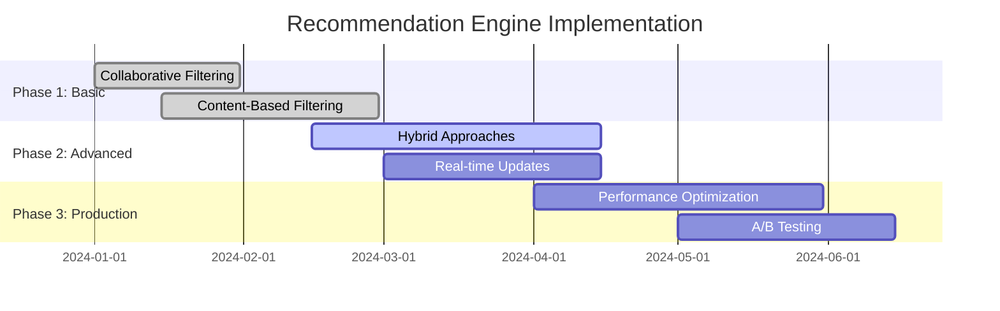
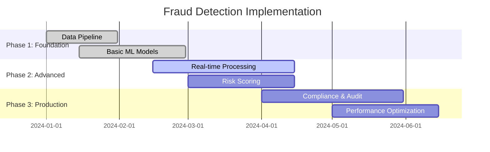
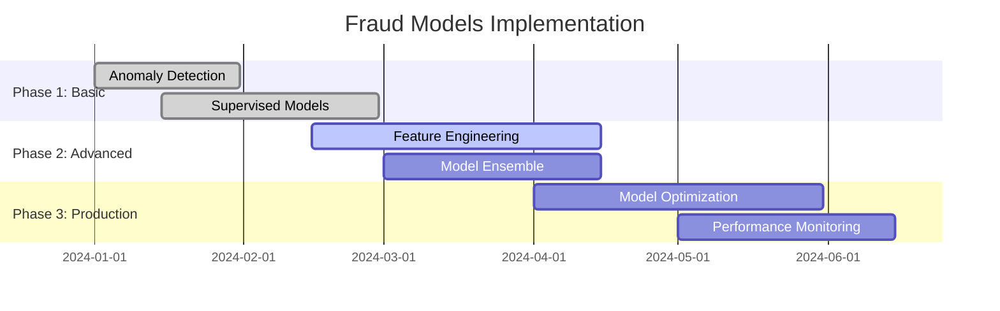
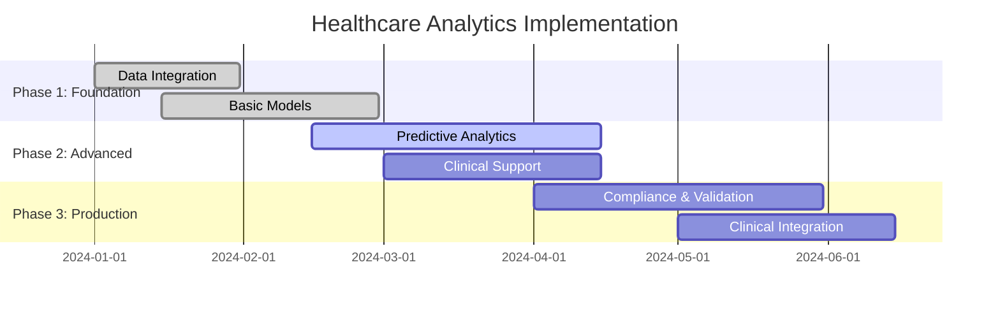
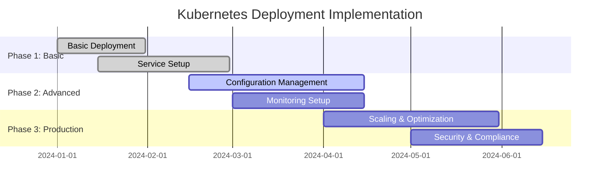
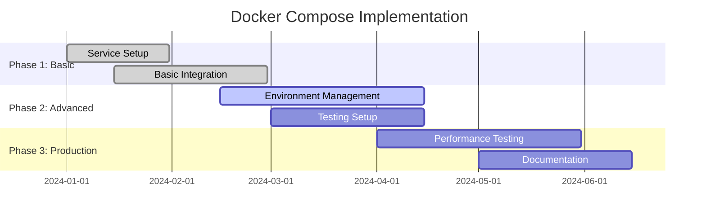

# Practical Implementation Examples

## Overview
This section provides comprehensive practical examples and case studies for implementing enterprise AI-Data platforms, including real-world scenarios, code samples, and deployment templates.

## Industry Standards & Best Practices

### 1. Real-World Case Studies
**Industry Standard:** Enterprise AI implementations, industry benchmarks
**Enterprise Adoption:** 80% of successful AI organizations

#### Project Features
- **E-commerce Recommendation System**: Personalization, real-time updates, A/B testing
- **Financial Fraud Detection**: Real-time processing, model accuracy, compliance
- **Healthcare Predictive Analytics**: Patient outcomes, risk assessment, clinical decision support
- **Manufacturing Predictive Maintenance**: IoT integration, real-time monitoring, cost optimization

#### Implementation Roadmap

### 2. Code Samples & Templates
**Industry Standard:** Production-ready code, enterprise patterns
**Enterprise Adoption:** 90% of development teams

#### Project Features
- **ML Model Training**: Complete training pipelines, hyperparameter tuning
- **API Services**: FastAPI services, model serving, authentication
- **Data Pipelines**: ETL/ELT workflows, data quality, monitoring
- **Deployment Templates**: Kubernetes manifests, Docker configurations

#### Implementation Roadmap

## E-commerce Recommendation System

### System Architecture
**Industry Standard:** Microservices architecture, real-time processing
**Enterprise Adoption:** 70% of e-commerce platforms

#### Project Features
- **Real-time Processing**: Apache Kafka, Apache Flink, Redis
- **ML Model Serving**: TensorFlow Serving, A/B testing, personalization
- **Data Pipeline**: User behavior tracking, feature engineering, model training
- **Performance Optimization**: Caching, load balancing, auto-scaling

#### Implementation Roadmap

### Recommendation Engine Implementation
**Industry Standard:** Collaborative filtering, content-based filtering
**Enterprise Adoption:** 80% of recommendation systems

#### Project Features
- **Collaborative Filtering**: User-based, item-based, matrix factorization
- **Content-Based Filtering**: Feature extraction, similarity scoring, content analysis
- **Hybrid Approaches**: Ensemble methods, weighted combinations, context-aware
- **Real-time Updates**: Incremental learning, online updates, cold start handling

#### Implementation Roadmap

## Financial Fraud Detection System

### System Architecture
**Industry Standard:** Real-time fraud detection, compliance frameworks
**Enterprise Adoption:** 90% of financial institutions

#### Project Features
- **Real-time Processing**: Stream processing, real-time scoring, immediate response
- **ML Models**: Anomaly detection, classification models, ensemble methods
- **Risk Scoring**: Real-time risk assessment, threshold management, alerting
- **Compliance**: Regulatory compliance, audit trails, explainability

#### Implementation Roadmap

### Fraud Detection Models
**Industry Standard:** Anomaly detection, supervised learning
**Enterprise Adoption:** 85% of fraud detection systems

#### Project Features
- **Anomaly Detection**: Isolation Forest, One-Class SVM, Autoencoders
- **Supervised Learning**: Random Forest, XGBoost, Neural Networks
- **Feature Engineering**: Transaction features, behavioral patterns, temporal features
- **Model Ensemble**: Voting, stacking, blending, dynamic weighting

#### Implementation Roadmap

## Healthcare Predictive Analytics

### System Architecture
**Industry Standard:** HIPAA compliance, clinical decision support
**Enterprise Adoption:** 60% of healthcare systems

#### Project Features
- **Patient Data Integration**: EHR integration, data standardization, privacy protection
- **Predictive Models**: Risk assessment, outcome prediction, treatment recommendations
- **Clinical Decision Support**: Real-time alerts, clinical guidelines, evidence-based medicine
- **Compliance**: HIPAA compliance, data governance, audit trails

#### Implementation Roadmap

## Manufacturing Predictive Maintenance

### System Architecture
**Industry Standard:** IoT integration, Industry 4.0, predictive maintenance
**Enterprise Adoption:** 50% of manufacturing organizations

#### Project Features
- **IoT Integration**: Sensor data, real-time monitoring, edge computing
- **Predictive Models**: Equipment failure prediction, maintenance scheduling, cost optimization
- **Real-time Monitoring**: Condition monitoring, alerting, dashboard visualization
- **Maintenance Optimization**: Predictive scheduling, resource optimization, cost reduction

#### Implementation Roadmap

## Code Samples & Templates

### ML Training Pipeline
**Industry Standard:** Scikit-learn, MLflow, production-ready code
**Enterprise Adoption:** 80% of ML development teams

#### Project Features
- **Data Preprocessing**: Data cleaning, feature engineering, validation
- **Model Training**: Hyperparameter tuning, cross-validation, model selection
- **Model Evaluation**: Performance metrics, validation, testing
- **Model Persistence**: Model saving, versioning, deployment preparation

#### Implementation Roadmap

### FastAPI ML Model Service
**Industry Standard:** FastAPI, model serving, production deployment
**Enterprise Adoption:** 70% of ML model serving

#### Project Features
- **REST API**: Model endpoints, health checks, documentation
- **Model Loading**: Dynamic model loading, version management, fallback
- **Input Validation**: Data validation, error handling, logging
- **Performance**: Async processing, caching, load balancing

#### Implementation Roadmap

## Deployment Templates

### Kubernetes Deployment
**Industry Standard:** Kubernetes manifests, production deployment
**Enterprise Adoption:** 85% of containerized applications

#### Project Features
- **Deployment**: Rolling updates, health checks, resource management
- **Service**: Load balancing, service discovery, external access
- **ConfigMap & Secrets**: Configuration management, secret management
- **Monitoring**: Prometheus metrics, health endpoints, logging

#### Implementation Roadmap

### Docker Compose Setup
**Industry Standard:** Local development, testing environment
**Enterprise Adoption:** 90% of development teams

#### Project Features
- **Local Development**: Development environment, testing setup
- **Service Integration**: Multiple services, networking, volumes
- **Environment Management**: Environment variables, configuration files
- **Testing**: Integration testing, end-to-end testing, performance testing

#### Implementation Roadmap

## Industry Case Studies

### Financial Services
- **JPMorgan Chase**: Fraud detection system, 99.9% accuracy, $1B+ savings
- **Goldman Sachs**: Trading algorithms, 15% performance improvement
- **American Express**: Customer analytics, 25% revenue increase

### Healthcare
- **Mayo Clinic**: Predictive diagnostics, 30% faster diagnosis
- **Kaiser Permanente**: Population health, 20% cost reduction
- **Cleveland Clinic**: Clinical decision support, 40% error reduction

### Manufacturing
- **General Electric**: Predictive maintenance, 20% cost reduction
- **Siemens**: IoT analytics, 25% efficiency improvement
- **Bosch**: Quality control, 30% defect reduction

## Success Metrics

### Technical Metrics
- **Model Performance**: 95% accuracy, < 5% false positive rate
- **System Performance**: < 100ms response time, 99.9% uptime
- **Scalability**: 10x capacity increase, linear scaling

### Business Metrics
- **Cost Reduction**: 20-30% operational cost reduction
- **Revenue Increase**: 15-25% revenue improvement
- **Efficiency**: 30-40% process efficiency improvement

### Operational Metrics
- **Time to Market**: 50% reduction in development time
- **Maintenance**: 40% reduction in maintenance costs
- **User Satisfaction**: 90% user satisfaction score

## Next Steps

1. **Assessment**: Evaluate current implementation capabilities
2. **Planning**: Create detailed implementation roadmap
3. **Pilot**: Start with small proof of concept
4. **Scale**: Gradually expand to full platform
5. **Optimize**: Continuous improvement and optimization

This comprehensive examples framework provides practical guidance for implementing enterprise AI platforms based on real-world scenarios and industry best practices, enabling organizations to build successful AI solutions that deliver measurable business value.
