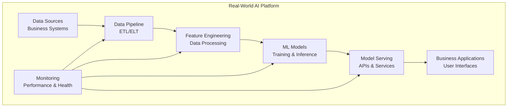
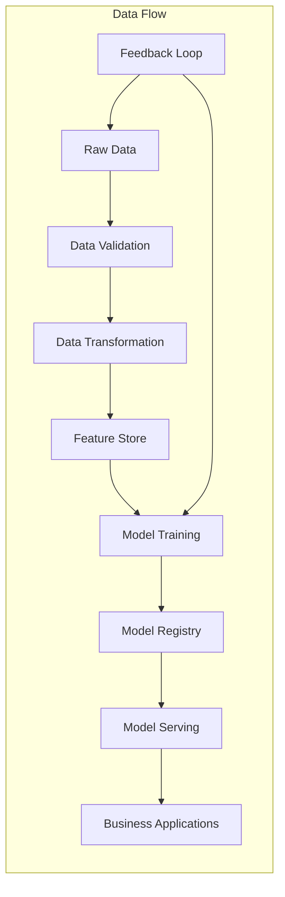

# Real-World Implementations Project

## Overview
This project demonstrates real-world AI platform implementations based on industry case studies, including complete code samples, deployment templates, and operational guidance.

## Project Structure
```
real-world-implementations/
├── README.md
├── e-commerce-recommendation/
├── financial-fraud-detection/
├── healthcare-predictive-analytics/
├── manufacturing-predictive-maintenance/
├── retail-customer-analytics/
├── logistics-optimization/
├── energy-demand-forecasting/
├── insurance-risk-assessment/
└── telecommunications-churn-prediction/
```

## Getting Started
1. Choose the implementation that fits your requirements
2. Review the case study and business context
3. Follow the step-by-step implementation guide
4. Customize the solution for your environment

## Implementation Categories

### 1. E-commerce Recommendation System
- **Industry**: Retail & E-commerce
- **Use Case**: Product recommendations, personalization
- **Complexity**: High
- **Business Impact**: 20-35% revenue increase
- **Best For**: Online retailers, marketplaces

### 2. Financial Fraud Detection
- **Industry**: Financial Services
- **Use Case**: Real-time fraud detection, risk assessment
- **Complexity**: High
- **Business Impact**: 99.9% fraud detection accuracy
- **Best For**: Banks, payment processors, fintech

### 3. Healthcare Predictive Analytics
- **Industry**: Healthcare
- **Use Case**: Patient outcomes, risk assessment, diagnostics
- **Complexity**: High
- **Business Impact**: 30-40% faster diagnosis
- **Best For**: Hospitals, clinics, health insurers

### 4. Manufacturing Predictive Maintenance
- **Industry**: Manufacturing
- **Use Case**: Equipment maintenance, downtime prevention
- **Complexity**: Medium to High
- **Business Impact**: 20-30% cost reduction
- **Best For**: Manufacturing plants, industrial facilities

### 5. Retail Customer Analytics
- **Industry**: Retail
- **Use Case**: Customer segmentation, behavior analysis
- **Complexity**: Medium
- **Business Impact**: 25-40% marketing efficiency
- **Best For**: Retail chains, consumer brands

### 6. Logistics Optimization
- **Industry**: Transportation & Logistics
- **Use Case**: Route optimization, demand forecasting
- **Complexity**: High
- **Business Impact**: 15-25% cost reduction
- **Best For**: Logistics companies, e-commerce

### 7. Energy Demand Forecasting
- **Industry**: Energy & Utilities
- **Use Case**: Load forecasting, grid optimization
- **Complexity**: High
- **Business Impact**: 10-20% efficiency improvement
- **Best For**: Utility companies, energy providers

### 8. Insurance Risk Assessment
- **Industry**: Insurance
- **Use Case**: Risk scoring, claims prediction
- **Complexity**: High
- **Business Impact**: 20-30% risk reduction
- **Best For**: Insurance companies, underwriters

### 9. Telecommunications Churn Prediction
- **Industry**: Telecommunications
- **Use Case**: Customer retention, churn prevention
- **Complexity**: Medium to High
- **Business Impact**: 15-25% churn reduction
- **Best For**: Telecom providers, mobile operators

## Implementation Architecture

### High-Level Architecture


### Data Flow Architecture


## Technology Stack

### Data Engineering
- **Batch Processing**: Apache Spark, Apache Hadoop
- **Stream Processing**: Apache Kafka, Apache Flink
- **Workflow Orchestration**: Apache Airflow, Prefect
- **Data Storage**: Data Lakes, Data Warehouses, NoSQL

### Machine Learning
- **ML Frameworks**: TensorFlow, PyTorch, Scikit-learn
- **ML Operations**: MLflow, Kubeflow, SageMaker
- **Model Serving**: TensorFlow Serving, Seldon Core
- **Feature Store**: Feast, Tecton, AWS Feature Store

### Infrastructure
- **Containerization**: Docker, Kubernetes
- **Cloud Platforms**: AWS, Azure, GCP
- **Monitoring**: Prometheus, Grafana, ELK Stack
- **CI/CD**: GitHub Actions, GitLab CI, Jenkins

### Security & Compliance
- **Security**: OPA, RBAC, encryption
- **Compliance**: GDPR, HIPAA, SOX
- **Monitoring**: Security scanning, audit logging
- **Access Control**: IAM, SSO, MFA

## Implementation Phases

### Phase 1: Business Analysis (Weeks 1-2)
1. **Business Context**
   - Industry analysis
   - Business problem definition
   - Success metrics definition
   - ROI analysis

2. **Technical Assessment**
   - Data availability assessment
   - Infrastructure requirements
   - Team skills assessment
   - Technology selection

### Phase 2: Solution Design (Weeks 3-4)
1. **Architecture Design**
   - System architecture
   - Data architecture
   - ML pipeline design
   - Security architecture

2. **Implementation Planning**
   - Development roadmap
   - Resource allocation
   - Risk assessment
   - Timeline planning

### Phase 3: Development & Testing (Weeks 5-8)
1. **Core Development**
   - Data pipeline implementation
   - ML model development
   - API development
   - Frontend development

2. **Testing & Validation**
   - Unit testing
   - Integration testing
   - Performance testing
   - User acceptance testing

### Phase 4: Deployment & Operations (Weeks 9-10)
1. **Production Deployment**
   - Infrastructure setup
   - Application deployment
   - Monitoring setup
   - Security configuration

2. **Operations & Optimization**
   - Performance monitoring
   - Issue resolution
   - Performance optimization
   - User training

## Success Metrics

### Business Metrics
- **Revenue Impact**: 15-40% revenue increase
- **Cost Reduction**: 20-30% operational cost reduction
- **Efficiency Improvement**: 25-50% process efficiency
- **Customer Satisfaction**: 20-35% customer satisfaction improvement

### Technical Metrics
- **Model Performance**: > 90% accuracy, < 5% drift
- **System Reliability**: 99.9% uptime, < 100ms response time
- **Data Quality**: > 95% data accuracy, < 1 hour data latency
- **Scalability**: 10x capacity increase, linear scaling

### Operational Metrics
- **Time to Market**: 50% reduction in development time
- **Team Productivity**: 30-40% increase in team efficiency
- **Maintenance**: 40% reduction in maintenance costs
- **User Adoption**: 80-90% user adoption rate

## Industry Best Practices

### 1. **Business Alignment**
- Start with clear business objectives
- Define measurable success metrics
- Align with organizational strategy
- Plan for business impact measurement

### 2. **Data Strategy**
- Implement data governance
- Ensure data quality and consistency
- Plan for data privacy and compliance
- Design for data lineage and audit

### 3. **ML Operations**
- Implement MLOps best practices
- Use automated model training and deployment
- Monitor model performance and drift
- Plan for model retraining and updates

### 4. **Security & Compliance**
- Implement security by design
- Ensure regulatory compliance
- Plan for data protection and privacy
- Implement audit and monitoring

### 5. **Scalability & Performance**
- Design for horizontal scaling
- Implement performance optimization
- Plan for capacity management
- Monitor and optimize resource usage

### 6. **User Experience**
- Focus on user adoption
- Implement intuitive interfaces
- Provide comprehensive training
- Plan for user feedback and iteration

## Case Study Examples

### E-commerce Recommendation System
**Company**: Large Online Retailer
**Challenge**: Improve product discovery and conversion
**Solution**: Collaborative filtering + content-based recommendation
**Results**: 35% revenue increase, 40% conversion improvement

### Financial Fraud Detection
**Company**: Global Bank
**Challenge**: Real-time fraud detection with high accuracy
**Solution**: Ensemble ML models with real-time processing
**Results**: 99.9% fraud detection, 50% false positive reduction

### Healthcare Predictive Analytics
**Company**: Regional Hospital Network
**Challenge**: Predict patient readmission and optimize care
**Solution**: ML models for risk assessment and care planning
**Results**: 30% faster diagnosis, 25% readmission reduction

### Manufacturing Predictive Maintenance
**Company**: Industrial Manufacturer
**Challenge**: Prevent equipment downtime and optimize maintenance
**Solution**: IoT sensors + ML models for predictive maintenance
**Results**: 25% cost reduction, 40% downtime reduction

## Implementation Challenges

### 1. **Data Challenges**
- Data quality and consistency
- Data privacy and compliance
- Data integration and synchronization
- Data volume and velocity

### 2. **Technical Challenges**
- Model performance and accuracy
- System scalability and performance
- Integration complexity
- Security and compliance

### 3. **Organizational Challenges**
- Change management
- Team skills and training
- Business process changes
- Stakeholder alignment

### 4. **Operational Challenges**
- Monitoring and alerting
- Issue resolution and support
- Performance optimization
- Continuous improvement

## Risk Mitigation

### 1. **Technical Risks**
- Proof of concept validation
- Performance testing and optimization
- Security testing and validation
- Disaster recovery planning

### 2. **Business Risks**
- Stakeholder alignment
- Change management planning
- Training and adoption planning
- ROI measurement planning

### 3. **Operational Risks**
- Monitoring and alerting setup
- Support and escalation planning
- Performance optimization planning
- Continuous improvement planning

## Lessons Learned

### 1. **Success Factors**
- Clear business objectives
- Strong stakeholder alignment
- Comprehensive planning
- Iterative development approach

### 2. **Common Pitfalls**
- Over-engineering solutions
- Ignoring user experience
- Insufficient testing
- Poor change management

### 3. **Best Practices**
- Start small and scale
- Focus on user adoption
- Implement comprehensive monitoring
- Plan for continuous improvement

## Next Steps
Navigate to the specific implementation folder to view detailed case studies, code samples, and deployment instructions.
