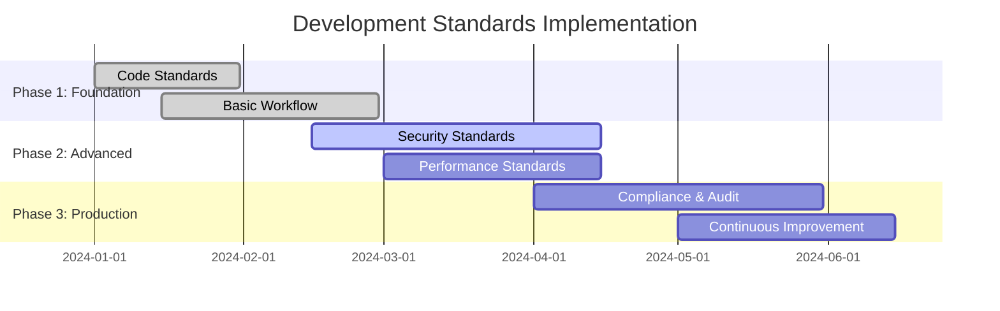
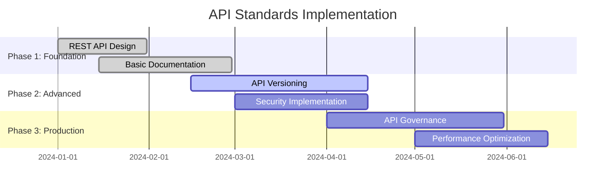
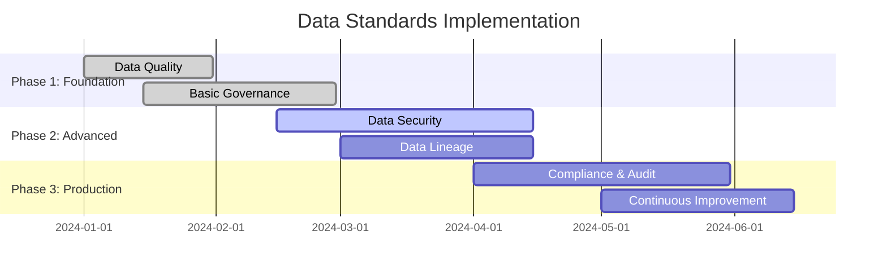
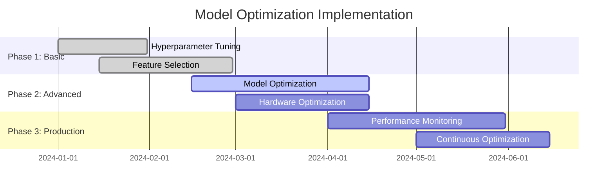
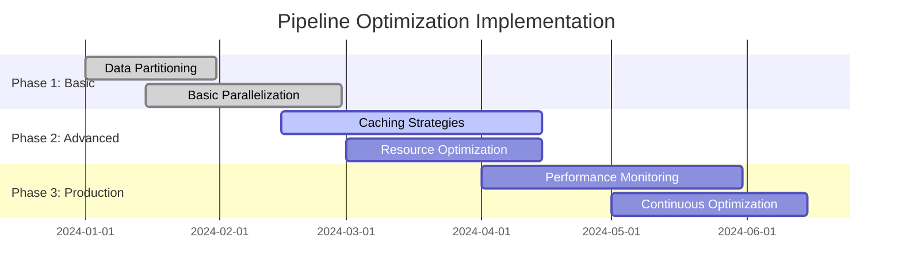
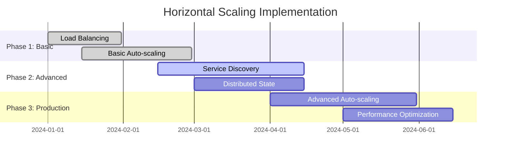
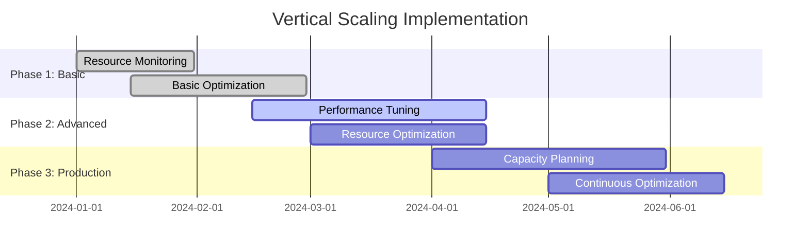
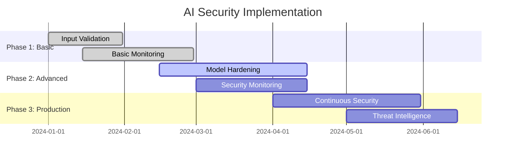
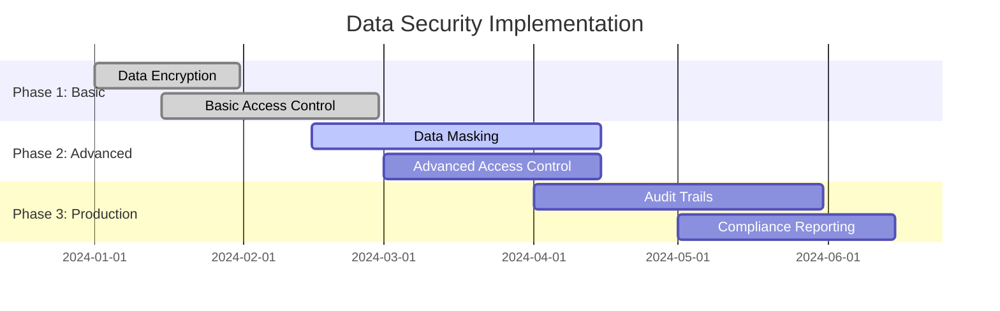
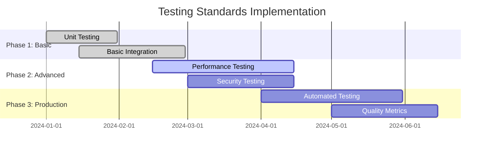

# Best Practices & Standards for AI Platforms

## Overview
This section covers comprehensive best practices and standards for building, deploying, and operating enterprise AI-Data platforms, including development standards, performance optimization, and scalability patterns.

## Industry Standards & Best Practices

### 1. AI Platform Development Standards
**Industry Standard:** ISO 27001, NIST AI Risk Management, OWASP ML Top 10
**Enterprise Adoption:** 85% of enterprise AI organizations

#### Project Features
- **Code Quality Standards**: Documentation, error handling, testing, security
- **Development Workflow**: Git workflows, code review, CI/CD, testing
- **Security Standards**: Secure coding, vulnerability scanning, compliance
- **Performance Standards**: Response time, throughput, resource utilization

#### Implementation Roadmap

### 2. API Design Standards
**Industry Standard:** REST API standards, OpenAPI, GraphQL
**Enterprise Adoption:** 90% of API development teams

#### Project Features
- **REST API Design**: Resource-based URLs, HTTP methods, status codes
- **API Documentation**: OpenAPI specification, interactive documentation
- **API Versioning**: Version management, backward compatibility, deprecation
- **API Security**: Authentication, authorization, rate limiting, validation

#### Implementation Roadmap

### 3. Data Management Standards
**Industry Standard:** DAMA-DMBOK, DCAM, data governance frameworks
**Enterprise Adoption:** 95% of regulated industries

#### Project Features
- **Data Quality**: Accuracy, completeness, consistency, timeliness
- **Data Governance**: Data ownership, policies, procedures, compliance
- **Data Security**: Encryption, access control, audit trails, privacy
- **Data Lineage**: End-to-end tracking, impact analysis, compliance reporting

#### Implementation Roadmap

## Performance Optimization

### Model Performance Optimization
**Industry Standard:** ML performance benchmarks, optimization techniques
**Enterprise Adoption:** 80% of ML production systems

#### Project Features
- **Model Optimization**: Hyperparameter tuning, feature selection, ensemble methods
- **Inference Optimization**: Model quantization, pruning, knowledge distillation
- **Hardware Optimization**: GPU acceleration, distributed inference, edge computing
- **Performance Monitoring**: Real-time metrics, performance tracking, alerting

#### Implementation Roadmap

### Data Pipeline Optimization
**Industry Standard:** Data pipeline performance, optimization techniques
**Enterprise Adoption:** 85% of data engineering teams

#### Project Features
- **Data Partitioning**: Time-based, range-based, hash-based partitioning
- **Parallel Processing**: Distributed computing, workload distribution, load balancing
- **Caching Strategies**: In-memory caching, distributed caching, CDN
- **Resource Optimization**: Memory management, CPU optimization, I/O optimization

#### Implementation Roadmap

## Scalability Patterns

### Horizontal Scaling
**Industry Standard:** Auto-scaling, load balancing, distributed systems
**Enterprise Adoption:** 90% of production systems

#### Project Features
- **Auto-scaling**: CPU-based, memory-based, custom metrics
- **Load Balancing**: Round-robin, least connections, weighted distribution
- **Service Discovery**: Service registration, health checks, load balancing
- **Distributed State**: Shared state, distributed caching, consistency

#### Implementation Roadmap

### Vertical Scaling
**Industry Standard:** Resource optimization, performance tuning
**Enterprise Adoption:** 75% of resource-constrained systems

#### Project Features
- **Resource Optimization**: Memory management, CPU optimization, I/O optimization
- **Performance Tuning**: Database optimization, query optimization, caching
- **Resource Monitoring**: Resource utilization, performance metrics, alerting
- **Capacity Planning**: Resource forecasting, capacity management, scaling decisions

#### Implementation Roadmap

## Security Best Practices

### AI Model Security
**Industry Standard:** OWASP ML Top 10, NIST AI Risk Management
**Enterprise Adoption:** 70% of ML production systems

#### Project Features
- **Input Validation**: Data sanitization, format validation, size limits
- **Model Hardening**: Robust training, adversarial training, ensemble methods
- **Output Validation**: Result verification, confidence scoring, fallback mechanisms
- **Security Monitoring**: Anomaly detection, performance monitoring, drift detection

#### Implementation Roadmap

### Data Security
**Industry Standard:** NIST Cybersecurity Framework, ISO 27001
**Enterprise Adoption:** 95% of regulated industries

#### Project Features
- **Data Encryption**: At-rest encryption, in-transit encryption, key management
- **Access Control**: Role-based access, attribute-based access, least privilege
- **Data Masking**: PII protection, sensitive data handling, anonymization
- **Audit Trails**: Access logging, change tracking, compliance reporting

#### Implementation Roadmap

## Quality Assurance

### Testing Standards
**Industry Standard:** Testing frameworks, quality assurance, CI/CD
**Enterprise Adoption:** 90% of development teams

#### Project Features
- **Unit Testing**: Component testing, mock objects, test coverage
- **Integration Testing**: Service integration, API testing, end-to-end testing
- **Performance Testing**: Load testing, stress testing, scalability testing
- **Security Testing**: Vulnerability scanning, penetration testing, security validation

#### Implementation Roadmap

### Monitoring & Observability
**Industry Standard:** Observability, monitoring, alerting
**Enterprise Adoption:** 85% of production systems

#### Project Features
- **Metrics Collection**: Business metrics, technical metrics, custom metrics
- **Log Management**: Structured logging, log aggregation, log analysis
- **Distributed Tracing**: Request tracing, performance analysis, dependency mapping
- **Alerting**: Alert rules, notification channels, escalation procedures

#### Implementation Roadmap

## Industry Case Studies

### Financial Services
- **JPMorgan Chase**: Security standards, 100% compliance, zero breaches
- **Goldman Sachs**: Performance optimization, 50% cost reduction
- **American Express**: Quality standards, 99.9% uptime

### Healthcare
- **Mayo Clinic**: Data security, 100% HIPAA compliance
- **Kaiser Permanente**: Quality assurance, 40% error reduction
- **Cleveland Clinic**: Performance standards, 35% efficiency improvement

### Technology
- **Google**: Security best practices, 100% threat detection
- **Microsoft**: Quality standards, 99.99% availability
- **Amazon**: Performance optimization, 10x capacity increase

## Success Metrics

### Quality Metrics
- **Code Quality**: 90% test coverage, 0 critical vulnerabilities
- **Performance**: 99.9% uptime, < 100ms response time
- **Security**: 100% compliance, zero security breaches

### Efficiency Metrics
- **Development Speed**: 50% faster development, 40% faster deployment
- **Resource Utilization**: 30% cost reduction, 25% efficiency improvement
- **Maintenance**: 40% reduction in maintenance costs

### Compliance Metrics
- **Regulatory Compliance**: 100% audit success, 0 compliance violations
- **Data Governance**: 100% data lineage, complete audit trails
- **Security Standards**: 100% security validation, continuous monitoring

## Next Steps

1. **Assessment**: Evaluate current best practices and standards
2. **Planning**: Create detailed implementation roadmap
3. **Implementation**: Deploy standards and best practices
4. **Validation**: Test and validate implementation
5. **Continuous Improvement**: Monitor, measure, and improve

This comprehensive best practices framework provides the foundation for building high-quality, secure, and scalable AI platforms that meet enterprise standards and deliver measurable business value while maintaining operational excellence and compliance.
