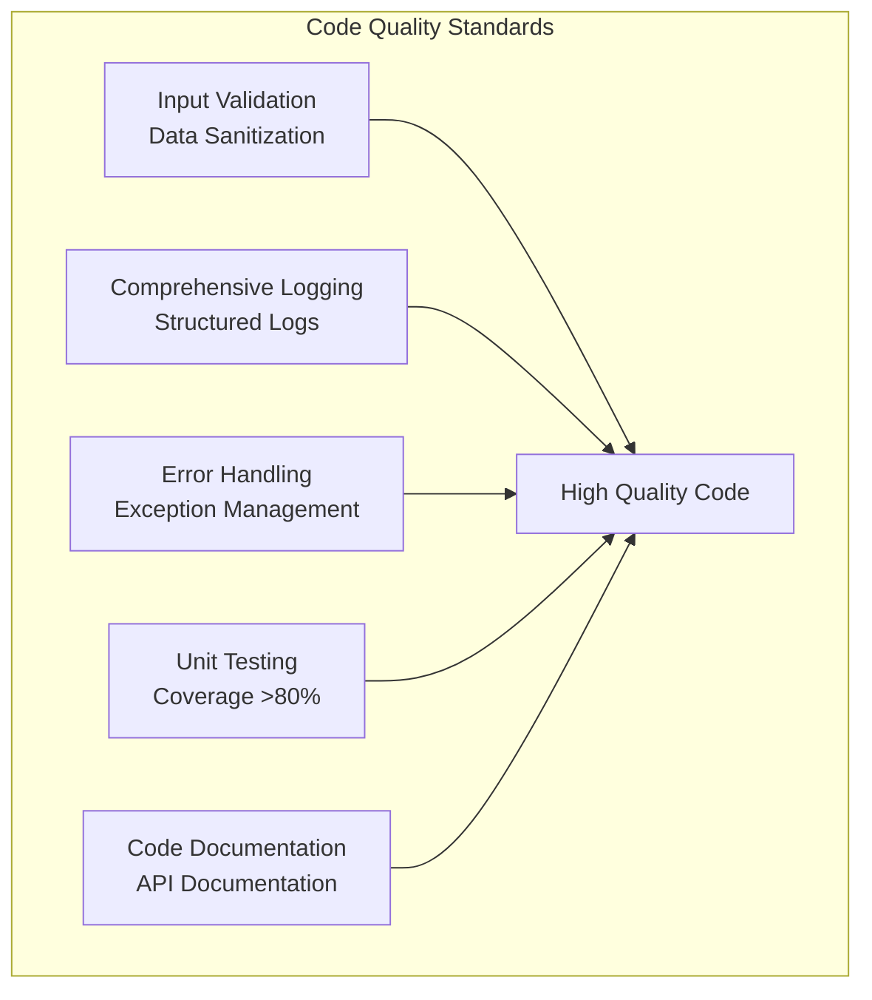
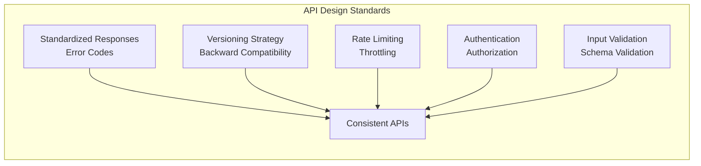
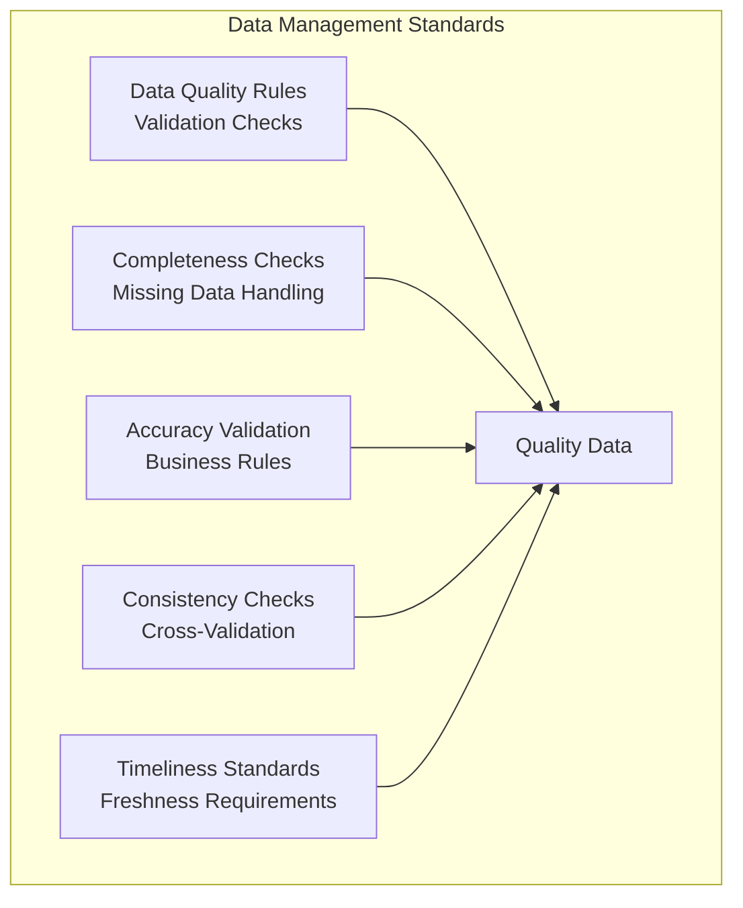
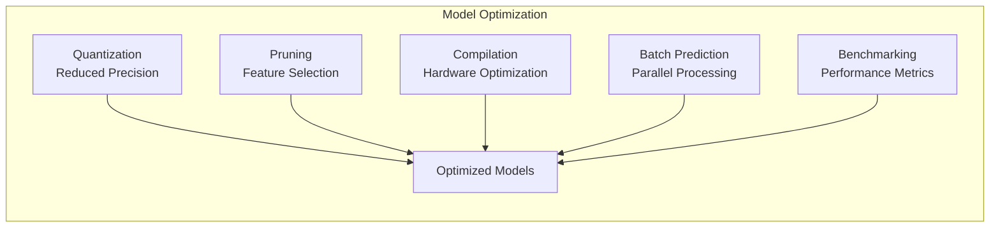
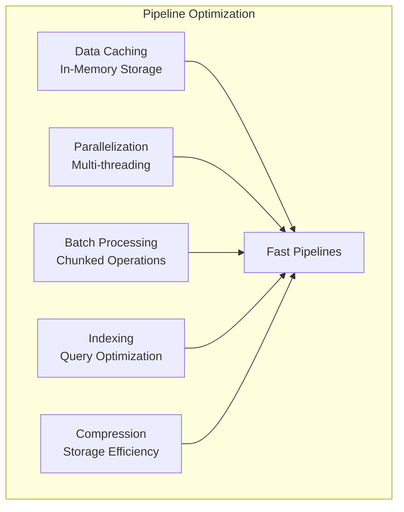
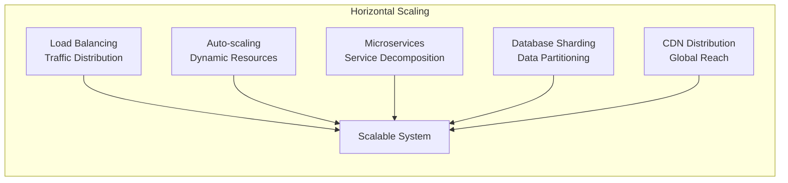
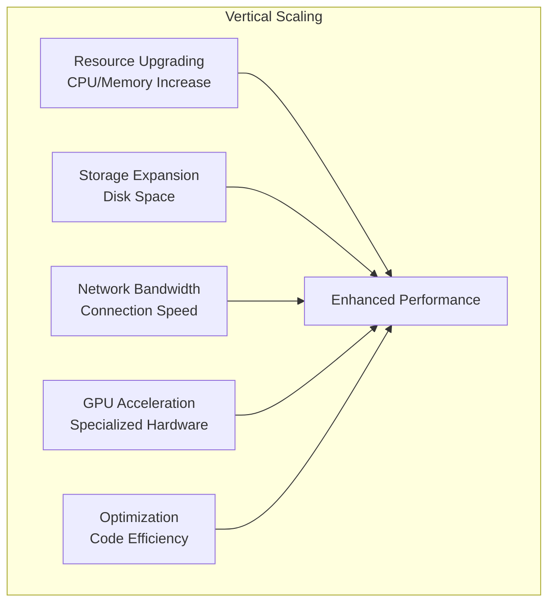

# Best Practices & Standards

## Overview
This section outlines best practices and standards for enterprise AI-Data Platforms, covering development standards, performance optimization, and scalability patterns.

## 1. **Enterprise Standards for AI Platform Development**

### 1. **Code Quality Standards**


### 2. **API Design Standards**


### 3. **Data Management Standards**


## 2. **Performance Optimization Techniques**

### 1. **Model Performance Optimization**


### 2. **Data Pipeline Optimization**


## 3. **Scalability Patterns**

### 1. **Horizontal Scaling**


### 2. **Vertical Scaling**


## 4. **Implementation Examples**

### **Code Quality Standards Implementation**
```python
import logging
import time
from functools import wraps
from typing import Any, Dict, List, Optional
import pandas as pd
import numpy as np
from pydantic import BaseModel, validator

class AIPlatformStandards:
    def __init__(self):
        self.logger = self._setup_logging()
    
    def _setup_logging(self):
        """Setup structured logging"""
        logging.basicConfig(
            level=logging.INFO,
            format='%(asctime)s - %(name)s - %(levelname)s - %(message)s',
            handlers=[
                logging.FileHandler('ai_platform.log'),
                logging.StreamHandler()
            ]
        )
        return logging.getLogger(__name__)
    
    def validate_input(self, data: Any, schema: Dict) -> bool:
        """Validate input data against schema"""
        try:
            if isinstance(data, pd.DataFrame):
                # Validate DataFrame columns and types
                for column, expected_type in schema.items():
                    if column not in data.columns:
                        raise ValueError(f"Missing required column: {column}")
                    
                    if not pd.api.types.is_dtype_equal(data[column].dtype, expected_type):
                        raise ValueError(f"Column {column} has wrong type: {data[column].dtype}")
                
                return True
            
            elif isinstance(data, dict):
                # Validate dictionary structure
                for key, expected_type in schema.items():
                    if key not in data:
                        raise ValueError(f"Missing required key: {key}")
                    
                    if not isinstance(data[key], expected_type):
                        raise ValueError(f"Key {key} has wrong type: {type(data[key])}")
                
                return True
            
            else:
                raise ValueError(f"Unsupported data type: {type(data)}")
                
        except Exception as e:
            self.logger.error(f"Input validation failed: {e}")
            return False
    
    def log_operation(self, operation: str, details: Dict, level: str = "info"):
        """Standardized logging for operations"""
        log_entry = {
            'timestamp': time.time(),
            'operation': operation,
            'details': details,
            'level': level
        }
        
        if level == "info":
            self.logger.info(f"Operation: {operation} - Details: {details}")
        elif level == "warning":
            self.logger.warning(f"Operation: {operation} - Details: {details}")
        elif level == "error":
            self.logger.error(f"Operation: {operation} - Details: {details}")
        
        return log_entry
    
    def measure_performance(self, operation_name: str):
        """Decorator for performance measurement"""
        def decorator(func):
            @wraps(func)
            def wrapper(*args, **kwargs):
                start_time = time.time()
                
                try:
                    result = func(*args, **kwargs)
                    execution_time = time.time() - start_time
                    
                    self.log_operation(
                        operation=operation_name,
                        details={
                            'status': 'success',
                            'execution_time': execution_time,
                            'args_count': len(args),
                            'kwargs_count': len(kwargs)
                        }
                    )
                    
                    return result
                    
                except Exception as e:
                    execution_time = time.time() - start_time
                    
                    self.log_operation(
                        operation=operation_name,
                        details={
                            'status': 'failed',
                            'error': str(e),
                            'execution_time': execution_time
                        },
                        level="error"
                    )
                    
                    raise
            
            return wrapper
        return decorator
    
    def handle_errors(self, error: Exception, context: str = ""):
        """Standardized error handling"""
        error_info = {
            'error_type': type(error).__name__,
            'error_message': str(error),
            'context': context,
            'timestamp': time.time()
        }
        
        self.logger.error(f"Error in {context}: {error_info}")
        
        # Return standardized error response
        return {
            'success': False,
            'error': error_info,
            'timestamp': time.time()
        }

# Example usage
standards = AIPlatformStandards()

@standards.measure_performance("data_processing")
def process_data(data: pd.DataFrame) -> pd.DataFrame:
    """Process data with performance measurement"""
    # Validate input
    schema = {
        'feature_1': np.float64,
        'feature_2': np.int64,
        'target': np.int64
    }
    
    if not standards.validate_input(data, schema):
        raise ValueError("Invalid input data")
    
    # Process data
    processed_data = data.copy()
    processed_data['feature_1'] = processed_data['feature_1'] * 2
    
    return processed_data

# Test the function
try:
    test_data = pd.DataFrame({
        'feature_1': [1.0, 2.0, 3.0],
        'feature_2': [1, 2, 3],
        'target': [0, 1, 0]
    })
    
    result = process_data(test_data)
    print("Data processing successful")
    
except Exception as e:
    standards.handle_errors(e, "data_processing")
```

### **API Design Standards Implementation**
```python
from fastapi import FastAPI, HTTPException, Depends, Request
from fastapi.middleware.cors import CORSMiddleware
from fastapi.middleware.trustedhost import TrustedHostMiddleware
from pydantic import BaseModel, Field, validator
from typing import Dict, Any, Optional, List
import time
import json
from datetime import datetime
import logging

class StandardizedResponse(BaseModel):
    """Standardized API response format"""
    success: bool
    data: Optional[Any] = None
    error: Optional[str] = None
    timestamp: str
    request_id: str
    version: str = "1.0.0"

class APIRequest(BaseModel):
    """Base API request model"""
    request_id: Optional[str] = None
    
    @validator('request_id', pre=True, always=True)
    def set_request_id(cls, v):
        return v or f"req_{int(time.time() * 1000)}"

class RateLimiter:
    """Rate limiting implementation"""
    def __init__(self, max_requests: int = 100, window_seconds: int = 60):
        self.max_requests = max_requests
        self.window_seconds = window_seconds
        self.requests = {}
    
    def is_allowed(self, client_id: str) -> bool:
        """Check if request is allowed"""
        now = time.time()
        
        if client_id not in self.requests:
            self.requests[client_id] = []
        
        # Remove old requests outside window
        self.requests[client_id] = [
            req_time for req_time in self.requests[client_id]
            if now - req_time < self.window_seconds
        ]
        
        # Check if under limit
        if len(self.requests[client_id]) < self.max_requests:
            self.requests[client_id].append(now)
            return True
        
        return False

class APIDesignStandards:
    def __init__(self):
        self.rate_limiter = RateLimiter()
        self.logger = logging.getLogger(__name__)
    
    def create_standardized_response(
        self, 
        success: bool, 
        data: Any = None, 
        error: str = None,
        request_id: str = None
    ) -> StandardizedResponse:
        """Create standardized API response"""
        return StandardizedResponse(
            success=success,
            data=data,
            error=error,
            timestamp=datetime.now().isoformat(),
            request_id=request_id or f"resp_{int(time.time() * 1000)}"
        )
    
    def validate_api_version(self, version: str) -> bool:
        """Validate API version"""
        supported_versions = ["1.0.0", "1.1.0", "2.0.0"]
        return version in supported_versions
    
    def apply_rate_limiting(self, client_id: str) -> bool:
        """Apply rate limiting"""
        return self.rate_limiter.is_allowed(client_id)
    
    def log_api_request(self, request: Request, response: StandardizedResponse):
        """Log API request and response"""
        log_entry = {
            'timestamp': datetime.now().isoformat(),
            'method': request.method,
            'url': str(request.url),
            'client_ip': request.client.host,
            'user_agent': request.headers.get('user-agent'),
            'request_id': response.request_id,
            'success': response.success,
            'response_time': time.time()
        }
        
        self.logger.info(f"API Request: {json.dumps(log_entry, indent=2)}")

# Initialize FastAPI app with standards
app = FastAPI(
    title="AI Platform API",
    description="API following enterprise design standards",
    version="1.0.0"
)

# Add middleware
app.add_middleware(
    CORSMiddleware,
    allow_origins=["*"],
    allow_credentials=True,
    allow_methods=["*"],
    allow_headers=["*"],
)

app.add_middleware(
    TrustedHostMiddleware,
    allowed_hosts=["*"]
)

# Initialize standards
api_standards = APIDesignStandards()

# Dependency for rate limiting
def check_rate_limit(request: Request):
    """Check rate limiting for request"""
    client_id = request.client.host
    
    if not api_standards.apply_rate_limiting(client_id):
        raise HTTPException(
            status_code=429,
            detail="Rate limit exceeded. Please try again later."
        )
    
    return client_id

# Example API endpoint
@app.post("/api/v1/predict", response_model=StandardizedResponse)
async def predict(
    request: APIRequest,
    client_id: str = Depends(check_rate_limit)
):
    """Example prediction endpoint following standards"""
    try:
        # Simulate prediction
        prediction_result = {
            'prediction': 0.85,
            'confidence': 0.92,
            'model_version': '1.0.0'
        }
        
        response = api_standards.create_standardized_response(
            success=True,
            data=prediction_result,
            request_id=request.request_id
        )
        
        # Log request
        api_standards.log_api_request(request, response)
        
        return response
        
    except Exception as e:
        response = api_standards.create_standardized_response(
            success=False,
            error=str(e),
            request_id=request.request_id
        )
        
        # Log error
        api_standards.log_api_request(request, response)
        
        raise HTTPException(status_code=500, detail=str(e))

# Health check endpoint
@app.get("/health")
async def health_check():
    """Health check endpoint"""
    return {
        'status': 'healthy',
        'timestamp': datetime.now().isoformat(),
        'version': '1.0.0'
    }
```

### **Data Quality Standards Implementation**
```python
import pandas as pd
import numpy as np
from typing import Dict, List, Tuple, Any
import logging
from datetime import datetime, timedelta

class DataQualityStandards:
    def __init__(self):
        self.logger = logging.getLogger(__name__)
        self.quality_rules = {}
        self.validation_results = {}
    
    def add_quality_rule(self, rule_name: str, rule_config: Dict):
        """Add a data quality rule"""
        self.quality_rules[rule_name] = rule_config
        self.logger.info(f"Added quality rule: {rule_name}")
    
    def validate_data_completeness(self, data: pd.DataFrame, required_columns: List[str]) -> Dict:
        """Validate data completeness"""
        missing_columns = set(required_columns) - set(data.columns)
        missing_data = data[required_columns].isnull().sum()
        
        completeness_score = 1 - (missing_data.sum() / (len(data) * len(required_columns)))
        
        result = {
            'rule': 'completeness',
            'score': completeness_score,
            'missing_columns': list(missing_columns),
            'missing_data_counts': missing_data.to_dict(),
            'passed': completeness_score >= 0.95  # 95% threshold
        }
        
        return result
    
    def validate_data_accuracy(self, data: pd.DataFrame, accuracy_rules: Dict) -> Dict:
        """Validate data accuracy"""
        accuracy_results = {}
        total_checks = 0
        passed_checks = 0
        
        for column, rules in accuracy_rules.items():
            if column not in data.columns:
                continue
            
            column_data = data[column]
            
            for rule_type, rule_value in rules.items():
                total_checks += 1
                
                if rule_type == 'min_value':
                    passed = (column_data >= rule_value).all()
                elif rule_type == 'max_value':
                    passed = (column_data <= rule_value).all()
                elif rule_type == 'unique_values':
                    passed = column_data.nunique() <= rule_value
                elif rule_type == 'data_type':
                    passed = column_data.dtype == rule_value
                else:
                    passed = False
                
                if passed:
                    passed_checks += 1
                
                accuracy_results[f"{column}_{rule_type}"] = passed
        
        accuracy_score = passed_checks / total_checks if total_checks > 0 else 0
        
        result = {
            'rule': 'accuracy',
            'score': accuracy_score,
            'details': accuracy_results,
            'passed': accuracy_score >= 0.9  # 90% threshold
        }
        
        return result
    
    def validate_data_consistency(self, data: pd.DataFrame, consistency_rules: List[Dict]) -> Dict:
        """Validate data consistency"""
        consistency_results = []
        total_checks = len(consistency_rules)
        passed_checks = 0
        
        for rule in consistency_rules:
            rule_type = rule.get('type')
            rule_config = rule.get('config', {})
            
            if rule_type == 'cross_column':
                # Check relationship between columns
                col1, col2 = rule_config['columns']
                operator = rule_config['operator']
                value = rule_config['value']
                
                if operator == 'equals':
                    passed = (data[col1] == data[col2]).all()
                elif operator == 'greater_than':
                    passed = (data[col1] > data[col2]).all()
                elif operator == 'less_than':
                    passed = (data[col1] < data[col2]).all()
                else:
                    passed = False
                
            elif rule_type == 'business_logic':
                # Check business logic rules
                condition = rule_config['condition']
                passed = eval(condition, {'data': data, 'pd': pd, 'np': np})
                
            else:
                passed = False
            
            if passed:
                passed_checks += 1
            
            consistency_results.append({
                'rule': rule,
                'passed': passed
            })
        
        consistency_score = passed_checks / total_checks if total_checks > 0 else 0
        
        result = {
            'rule': 'consistency',
            'score': consistency_score,
            'details': consistency_results,
            'passed': consistency_score >= 0.9  # 90% threshold
        }
        
        return result
    
    def validate_data_timeliness(self, data: pd.DataFrame, timestamp_column: str, 
                                max_age_hours: int = 24) -> Dict:
        """Validate data timeliness"""
        if timestamp_column not in data.columns:
            return {
                'rule': 'timeliness',
                'score': 0,
                'error': f"Timestamp column {timestamp_column} not found",
                'passed': False
            }
        
        # Convert timestamp column to datetime
        try:
            data[timestamp_column] = pd.to_datetime(data[timestamp_column])
        except Exception as e:
            return {
                'rule': 'timeliness',
                'score': 0,
                'error': f"Failed to parse timestamp column: {e}",
                'passed': False
            }
        
        # Calculate data age
        now = datetime.now()
        data_age = now - data[timestamp_column].max()
        age_hours = data_age.total_seconds() / 3600
        
        # Calculate timeliness score
        if age_hours <= max_age_hours:
            timeliness_score = 1.0
        else:
            timeliness_score = max(0, 1 - (age_hours - max_age_hours) / max_age_hours)
        
        result = {
            'rule': 'timeliness',
            'score': timeliness_score,
            'data_age_hours': age_hours,
            'max_age_hours': max_age_hours,
            'passed': timeliness_score >= 0.8  # 80% threshold
        }
        
        return result
    
    def run_quality_checks(self, data: pd.DataFrame, quality_config: Dict) -> Dict:
        """Run all quality checks"""
        self.logger.info("Starting data quality validation")
        
        results = {}
        
        # Completeness check
        if 'completeness' in quality_config:
            results['completeness'] = self.validate_data_completeness(
                data, quality_config['completeness']['required_columns']
            )
        
        # Accuracy check
        if 'accuracy' in quality_config:
            results['accuracy'] = self.validate_data_accuracy(
                data, quality_config['accuracy']['rules']
            )
        
        # Consistency check
        if 'consistency' in quality_config:
            results['consistency'] = self.validate_data_consistency(
                data, quality_config['consistency']['rules']
            )
        
        # Timeliness check
        if 'timeliness' in quality_config:
            results['timeliness'] = self.validate_data_timeliness(
                data, 
                quality_config['timeliness']['timestamp_column'],
                quality_config['timeliness'].get('max_age_hours', 24)
            )
        
        # Calculate overall quality score
        quality_scores = [result['score'] for result in results.values() if 'score' in result]
        overall_score = np.mean(quality_scores) if quality_scores else 0
        
        # Determine if all checks passed
        all_passed = all(result.get('passed', False) for result in results.values())
        
        final_result = {
            'overall_score': overall_score,
            'all_passed': all_passed,
            'checks': results,
            'timestamp': datetime.now().isoformat()
        }
        
        self.validation_results = final_result
        self.logger.info(f"Quality validation completed. Overall score: {overall_score:.2f}")
        
        return final_result

# Example usage
quality_standards = DataQualityStandards()

# Define quality configuration
quality_config = {
    'completeness': {
        'required_columns': ['feature_1', 'feature_2', 'target']
    },
    'accuracy': {
        'rules': {
            'feature_1': {'min_value': 0, 'max_value': 100},
            'feature_2': {'min_value': -50, 'max_value': 50},
            'target': {'unique_values': 2}
        }
    },
    'consistency': {
        'rules': [
            {
                'type': 'cross_column',
                'config': {
                    'columns': ['feature_1', 'feature_2'],
                    'operator': 'greater_than',
                    'value': 0
                }
            }
        ]
    },
    'timeliness': {
        'timestamp_column': 'timestamp',
        'max_age_hours': 24
    }
}

# Test data
test_data = pd.DataFrame({
    'feature_1': [10, 20, 30, 40, 50],
    'feature_2': [5, 15, 25, 35, 45],
    'target': [0, 1, 0, 1, 0],
    'timestamp': pd.date_range(start='2024-01-01', periods=5, freq='H')
})

# Run quality checks
quality_results = quality_standards.run_quality_checks(test_data, quality_config)

print(f"Overall quality score: {quality_results['overall_score']:.2f}")
print(f"All checks passed: {quality_results['all_passed']}")

for check_name, check_result in quality_results['checks'].items():
    print(f"{check_name}: {'PASSED' if check_result['passed'] else 'FAILED'} "
          f"(Score: {check_result['score']:.2f})")
```

### **Model Performance Optimization Implementation**
```python
import numpy as np
import pandas as pd
from sklearn.ensemble import RandomForestClassifier
from sklearn.metrics import accuracy_score, precision_score, recall_score
import time
import joblib
from typing import Dict, List, Any, Tuple
import logging

class ModelPerformanceOptimizer:
    def __init__(self):
        self.logger = logging.getLogger(__name__)
        self.optimization_results = {}
    
    def optimize_model(self, model, X_train: np.ndarray, X_test: np.ndarray, 
                      y_train: np.ndarray, y_test: np.ndarray) -> Dict:
        """Optimize model performance"""
        self.logger.info("Starting model optimization")
        
        # Baseline performance
        baseline_metrics = self._evaluate_model(model, X_test, y_test)
        baseline_time = self._measure_inference_time(model, X_test)
        
        optimization_results = {
            'baseline': {
                'metrics': baseline_metrics,
                'inference_time': baseline_time
            },
            'optimizations': {}
        }
        
        # Quantization optimization
        quantized_model = self._quantize_model(model)
        if quantized_model:
            quantized_metrics = self._evaluate_model(quantized_model, X_test, y_test)
            quantized_time = self._measure_inference_time(quantized_model, X_test)
            
            optimization_results['optimizations']['quantization'] = {
                'metrics': quantized_metrics,
                'inference_time': quantized_time,
                'improvement': baseline_time / quantized_time if quantized_time > 0 else 1
            }
        
        # Feature selection optimization
        selected_features = self._select_features(X_train, y_train, threshold=0.01)
        if len(selected_features) < X_train.shape[1]:
            X_train_selected = X_train[:, selected_features]
            X_test_selected = X_test[:, selected_features]
            
            # Retrain model with selected features
            selected_model = RandomForestClassifier(n_estimators=100, random_state=42)
            selected_model.fit(X_train_selected, y_train)
            
            selected_metrics = self._evaluate_model(selected_model, X_test_selected, y_test)
            selected_time = self._measure_inference_time(selected_model, X_test_selected)
            
            optimization_results['optimizations']['feature_selection'] = {
                'metrics': selected_metrics,
                'inference_time': selected_time,
                'features_used': len(selected_features),
                'features_removed': X_train.shape[1] - len(selected_features)
            }
        
        # Batch prediction optimization
        batch_results = self._optimize_batch_prediction(model, X_test, y_test)
        optimization_results['optimizations']['batch_prediction'] = batch_results
        
        self.optimization_results = optimization_results
        return optimization_results
    
    def _evaluate_model(self, model, X_test: np.ndarray, y_test: np.ndarray) -> Dict:
        """Evaluate model performance"""
        y_pred = model.predict(X_test)
        
        return {
            'accuracy': accuracy_score(y_test, y_pred),
            'precision': precision_score(y_test, y_pred, average='weighted'),
            'recall': recall_score(y_test, y_pred, average='weighted')
        }
    
    def _measure_inference_time(self, model, X_test: np.ndarray) -> float:
        """Measure model inference time"""
        start_time = time.time()
        
        # Make predictions
        _ = model.predict(X_test)
        
        end_time = time.time()
        return end_time - start_time
    
    def _quantize_model(self, model) -> Any:
        """Quantize model to reduce precision"""
        try:
            # This is a simplified quantization example
            # In practice, you might use TensorFlow Lite, ONNX, or other tools
            
            # For scikit-learn models, we can implement custom quantization
            if hasattr(model, 'predict_proba'):
                # Create a quantized version by rounding probabilities
                original_predict_proba = model.predict_proba
                
                def quantized_predict_proba(X):
                    probs = original_predict_proba(X)
                    # Quantize to 2 decimal places
                    return np.round(probs, 2)
                
                model.predict_proba = quantized_predict_proba
                return model
            
            return None
            
        except Exception as e:
            self.logger.warning(f"Quantization failed: {e}")
            return None
    
    def _select_features(self, X_train: np.ndarray, y_train: np.ndarray, 
                        threshold: float = 0.01) -> List[int]:
        """Select most important features"""
        try:
            # Train a simple model to get feature importance
            temp_model = RandomForestClassifier(n_estimators=50, random_state=42)
            temp_model.fit(X_train, y_train)
            
            # Get feature importance
            importance = temp_model.feature_importances_
            
            # Select features above threshold
            selected_indices = np.where(importance > threshold)[0]
            
            return selected_indices.tolist()
            
        except Exception as e:
            self.logger.warning(f"Feature selection failed: {e}")
            return list(range(X_train.shape[1]))
    
    def _optimize_batch_prediction(self, model, X_test: np.ndarray, 
                                 y_test: np.ndarray) -> Dict:
        """Optimize batch prediction performance"""
        batch_sizes = [1, 8, 16, 32, 64]
        batch_results = {}
        
        for batch_size in batch_sizes:
            if batch_size > len(X_test):
                continue
            
            # Measure time for batch prediction
            start_time = time.time()
            
            for i in range(0, len(X_test), batch_size):
                batch = X_test[i:i+batch_size]
                _ = model.predict(batch)
            
            end_time = time.time()
            total_time = end_time - start_time
            
            # Calculate throughput
            throughput = len(X_test) / total_time
            
            batch_results[batch_size] = {
                'time': total_time,
                'throughput': throughput
            }
        
        return batch_results
    
    def benchmark_performance(self, model, test_data: np.ndarray, 
                            batch_sizes: List[int] = None) -> Dict:
        """Benchmark model performance with different configurations"""
        if batch_sizes is None:
            batch_sizes = [1, 8, 16, 32]
        
        self.logger.info("Starting performance benchmarking")
        
        benchmark_results = {}
        
        # Single prediction benchmark
        single_times = []
        for _ in range(100):
            start_time = time.time()
            _ = model.predict(test_data[:1])
            end_time = time.time()
            single_times.append(end_time - start_time)
        
        benchmark_results['single_prediction'] = {
            'mean_time': np.mean(single_times),
            'std_time': np.std(single_times),
            'min_time': np.min(single_times),
            'max_time': np.max(single_times)
        }
        
        # Batch prediction benchmark
        batch_benchmarks = {}
        for batch_size in batch_sizes:
            if batch_size > len(test_data):
                continue
            
            batch_times = []
            for _ in range(10):
                start_time = time.time()
                
                for i in range(0, len(test_data), batch_size):
                    batch = test_data[i:i+batch_size]
                    _ = model.predict(batch)
                
                end_time = time.time()
                batch_times.append(end_time - start_time)
            
            batch_benchmarks[batch_size] = {
                'mean_time': np.mean(batch_times),
                'std_time': np.std(batch_times),
                'throughput': len(test_data) / np.mean(batch_times)
            }
        
        benchmark_results['batch_prediction'] = batch_benchmarks
        
        # Memory usage estimation
        if hasattr(model, 'n_features_in_'):
            estimated_memory = model.n_features_in_ * 8  # 8 bytes per float64
            benchmark_results['memory_usage'] = {
                'estimated_bytes': estimated_memory,
                'estimated_mb': estimated_memory / (1024 * 1024)
            }
        
        self.logger.info("Performance benchmarking completed")
        return benchmark_results
    
    def generate_optimization_report(self) -> str:
        """Generate optimization report"""
        if not self.optimization_results:
            return "No optimization results available"
        
        report = "Model Performance Optimization Report\n"
        report += "=" * 50 + "\n\n"
        
        # Baseline results
        baseline = self.optimization_results['baseline']
        report += f"Baseline Performance:\n"
        report += f"  Accuracy: {baseline['metrics']['accuracy']:.4f}\n"
        report += f"  Precision: {baseline['metrics']['precision']:.4f}\n"
        report += f"  Recall: {baseline['metrics']['recall']:.4f}\n"
        report += f"  Inference Time: {baseline['inference_time']:.4f}s\n\n"
        
        # Optimization results
        report += "Optimization Results:\n"
        for opt_name, opt_result in self.optimization_results['optimizations'].items():
            report += f"  {opt_name.title()}:\n"
            
            if 'metrics' in opt_result:
                report += f"    Accuracy: {opt_result['metrics']['accuracy']:.4f}\n"
                report += f"    Precision: {opt_result['metrics']['precision']:.4f}\n"
                report += f"    Recall: {opt_result['metrics']['recall']:.4f}\n"
            
            if 'inference_time' in opt_result:
                report += f"    Inference Time: {opt_result['inference_time']:.4f}s\n"
            
            if 'improvement' in opt_result:
                report += f"    Speed Improvement: {opt_result['improvement']:.2f}x\n"
            
            report += "\n"
        
        return report

# Example usage
optimizer = ModelPerformanceOptimizer()

# Create sample data
np.random.seed(42)
X_train = np.random.randn(1000, 20)
y_train = np.random.randint(0, 2, 1000)
X_test = np.random.randn(200, 20)
y_test = np.random.randint(0, 2, 200)

# Train a model
model = RandomForestClassifier(n_estimators=100, random_state=42)
model.fit(X_train, y_train)

# Optimize model
optimization_results = optimizer.optimize_model(model, X_train, X_test, y_train, y_test)

# Benchmark performance
benchmark_results = optimizer.benchmark_performance(model, X_test)

# Generate report
report = optimizer.generate_optimization_report()
print(report)

# Print benchmark results
print("\nPerformance Benchmark Results:")
print(f"Single prediction: {benchmark_results['single_prediction']['mean_time']:.6f}s")
print(f"Best batch throughput: {max(benchmark_results['batch_prediction'].values(), key=lambda x: x['throughput'])['throughput']:.2f} predictions/s")
```

## 5. **Best Practices Summary**

### **Development Standards**
1. **Code Quality**: Implement comprehensive validation, logging, and error handling
2. **API Design**: Use standardized responses, versioning, and rate limiting
3. **Data Management**: Enforce data quality rules and validation checks
4. **Testing**: Maintain high test coverage and comprehensive testing

### **Performance Optimization**
1. **Model Optimization**: Use quantization, pruning, and compilation techniques
2. **Pipeline Optimization**: Implement caching, parallelization, and batch processing
3. **Benchmarking**: Regularly measure and track performance metrics
4. **Resource Management**: Optimize memory usage and computational efficiency

### **Scalability Patterns**
1. **Horizontal Scaling**: Implement load balancing and auto-scaling
2. **Vertical Scaling**: Upgrade resources and optimize code efficiency
3. **Microservices**: Decompose systems into manageable services
4. **Data Partitioning**: Use sharding and distribution strategies

---

**Back to**: [Main README](../README.md)
