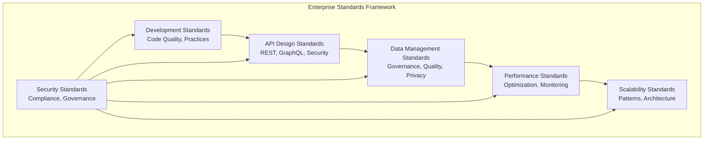
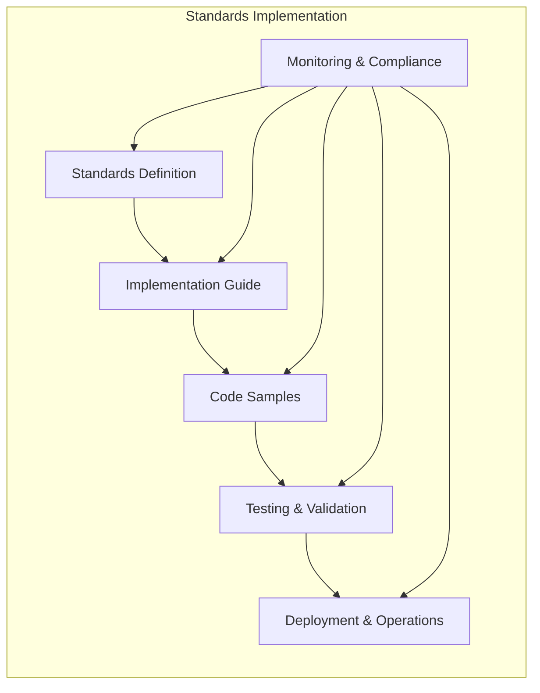

# Enterprise Standards Project

## Overview
This project demonstrates comprehensive enterprise standards and best practices for building, deploying, and operating enterprise AI-Data platforms, including development standards, performance optimization, and scalability patterns.

## Project Structure
```
enterprise-standards/
├── README.md
├── development-standards/
├── api-design-standards/
├── data-management-standards/
├── performance-optimization/
├── scalability-patterns/
├── security-standards/
├── testing-standards/
├── monitoring-standards/
└── compliance-standards/
```

## Getting Started
1. Choose the enterprise standard that fits your requirements
2. Review the implementation guide and code samples
3. Follow the step-by-step deployment instructions
4. Customize the configuration for your environment

## Enterprise Standards Components

### 1. Development Standards
- **Use Case**: Code quality and development practices
- **Complexity**: Medium
- **Scalability**: Development scaling
- **Best For**: Development teams, code quality

### 2. API Design Standards
- **Use Case**: API development and design
- **Complexity**: Medium
- **Scalability**: API scaling
- **Best For**: API development, integration teams

### 3. Data Management Standards
- **Use Case**: Data governance and management
- **Complexity**: High
- **Scalability**: Data scaling
- **Best For**: Data teams, governance teams

### 4. Performance Optimization
- **Use Case**: System and model optimization
- **Complexity**: High
- **Scalability**: Performance scaling
- **Best For**: Performance teams, optimization teams

### 5. Scalability Patterns
- **Use Case**: System scaling and growth
- **Complexity**: High
- **Scalability**: Pattern scaling
- **Best For**: Architecture teams, DevOps teams

### 6. Security Standards
- **Use Case**: Security and compliance
- **Complexity**: High
- **Scalability**: Security scaling
- **Best For**: Security teams, compliance teams

### 7. Testing Standards
- **Use Case**: Quality assurance and testing
- **Complexity**: Medium
- **Scalability**: Testing scaling
- **Best For**: QA teams, testing teams

### 8. Monitoring Standards
- **Use Case**: System monitoring and observability
- **Complexity**: Medium
- **Scalability**: Monitoring scaling
- **Best For**: Operations teams, SRE teams

### 9. Compliance Standards
- **Use Case**: Regulatory compliance and governance
- **Complexity**: High
- **Scalability**: Compliance scaling
- **Best For**: Compliance teams, legal teams

## Enterprise Standards Architecture

### Standards Framework


### Standards Implementation


## Development Standards

### Code Quality Standards
- **Code Style**: PEP 8, Black, Flake8
- **Documentation**: Docstrings, README, API docs
- **Error Handling**: Exception handling, logging
- **Testing**: Unit tests, integration tests, coverage

### Development Workflow
- **Version Control**: Git workflows, branching strategies
- **Code Review**: Pull request process, review guidelines
- **CI/CD**: Automated testing, deployment pipelines
- **Quality Gates**: Code quality checks, security scans

### Security Standards
- **Secure Coding**: OWASP guidelines, vulnerability prevention
- **Dependency Management**: Security scanning, updates
- **Access Control**: Authentication, authorization
- **Data Protection**: Encryption, privacy, compliance

## API Design Standards

### REST API Standards
- **URL Design**: Resource-based URLs, HTTP methods
- **Status Codes**: Standard HTTP status codes
- **Error Handling**: Consistent error responses
- **Versioning**: API versioning strategies

### API Documentation
- **OpenAPI**: Swagger/OpenAPI specification
- **Interactive Docs**: API documentation tools
- **Examples**: Request/response examples
- **Testing**: API testing and validation

### API Security
- **Authentication**: OAuth 2.0, JWT, API keys
- **Authorization**: Role-based access control
- **Rate Limiting**: Request throttling, quotas
- **Input Validation**: Data validation, sanitization

## Data Management Standards

### Data Quality Standards
- **Accuracy**: Data correctness, validation rules
- **Completeness**: Missing data handling, coverage
- **Consistency**: Format standards, cross-system alignment
- **Timeliness**: Freshness metrics, SLA compliance

### Data Governance
- **Data Ownership**: Clear ownership, stewardship
- **Data Classification**: Sensitivity levels, handling
- **Data Lineage**: End-to-end tracking, audit
- **Data Privacy**: GDPR, HIPAA, compliance

### Data Security
- **Encryption**: At-rest, in-transit encryption
- **Access Control**: Role-based, attribute-based access
- **Audit Logging**: Access tracking, change logging
- **Data Masking**: PII protection, anonymization

## Performance Optimization

### System Optimization
- **Resource Management**: CPU, memory, storage optimization
- **Network Optimization**: Bandwidth, latency, throughput
- **Database Optimization**: Query optimization, indexing
- **Cache Optimization**: Memory, distributed caching

### ML Model Optimization
- **Model Compression**: Quantization, pruning
- **Inference Optimization**: Model serving, caching
- **Training Optimization**: Distributed training, hyperparameter tuning
- **Feature Optimization**: Feature selection, engineering

### Performance Monitoring
- **Metrics Collection**: Performance metrics, KPIs
- **Performance Testing**: Load testing, stress testing
- **Bottleneck Analysis**: Performance issue identification
- **Automated Optimization**: Self-optimizing systems

## Scalability Patterns

### Horizontal Scaling
- **Load Balancing**: Traffic distribution, failover
- **Auto-scaling**: Dynamic resource allocation
- **Service Discovery**: Service registration, health checks
- **Distributed State**: Shared state, consistency

### Vertical Scaling
- **Resource Optimization**: Memory, CPU, storage optimization
- **Performance Tuning**: System tuning, optimization
- **Capacity Planning**: Resource planning, forecasting
- **Resource Monitoring**: Utilization tracking, alerting

### Architectural Patterns
- **Microservices**: Service decomposition, communication
- **Event-Driven**: Event sourcing, CQRS, messaging
- **CQRS**: Command query responsibility segregation
- **Saga Pattern**: Distributed transaction management

## Security Standards

### Security Architecture
- **Defense in Depth**: Multiple security layers
- **Zero Trust**: Continuous verification, validation
- **Security by Design**: Built-in security, privacy
- **Threat Modeling**: Risk assessment, mitigation

### Security Controls
- **Identity Management**: SSO, MFA, RBAC
- **Network Security**: Firewalls, segmentation, monitoring
- **Application Security**: WAF, code security, testing
- **Data Security**: Encryption, access control, monitoring

### Compliance Standards
- **Regulatory Compliance**: GDPR, HIPAA, SOX, SOC 2
- **Security Frameworks**: NIST, ISO 27001, OWASP
- **Audit Requirements**: Audit trails, reporting
- **Risk Management**: Risk assessment, mitigation

## Testing Standards

### Testing Strategy
- **Testing Pyramid**: Unit, integration, end-to-end testing
- **Test Coverage**: Code coverage, requirement coverage
- **Test Data Management**: Test data, environments
- **Testing Automation**: Automated testing, CI/CD integration

### Testing Types
- **Unit Testing**: Component testing, mocking
- **Integration Testing**: Service integration, API testing
- **Performance Testing**: Load testing, stress testing
- **Security Testing**: Vulnerability scanning, penetration testing

### Quality Assurance
- **Code Review**: Peer review, automated checks
- **Static Analysis**: Code quality, security scanning
- **Dynamic Analysis**: Runtime testing, monitoring
- **Continuous Testing**: Automated testing, feedback

## Monitoring Standards

### Monitoring Strategy
- **Metrics Collection**: Business metrics, technical metrics
- **Logging Strategy**: Structured logging, correlation
- **Tracing Strategy**: Distributed tracing, performance analysis
- **Alerting Strategy**: Alert rules, escalation procedures

### Monitoring Tools
- **Metrics**: Prometheus, Grafana, Datadog
- **Logging**: ELK Stack, Fluentd, Splunk
- **Tracing**: Jaeger, Zipkin, OpenTelemetry
- **Alerting**: PagerDuty, Slack, email

### Observability
- **Health Checks**: Service health, dependency health
- **Performance Monitoring**: Response time, throughput
- **Error Tracking**: Error rates, failure analysis
- **Business Metrics**: User engagement, business KPIs

## Compliance Standards

### Regulatory Compliance
- **GDPR**: Data protection, privacy rights
- **HIPAA**: Healthcare data protection
- **SOX**: Financial reporting, controls
- **SOC 2**: Security, availability, processing integrity

### Industry Standards
- **ISO 27001**: Information security management
- **NIST**: Cybersecurity framework
- **OWASP**: Web application security
- **PCI DSS**: Payment card security

### Compliance Management
- **Policy Management**: Security policies, procedures
- **Risk Assessment**: Risk identification, mitigation
- **Audit Management**: Audit planning, execution
- **Reporting**: Compliance reporting, metrics

## Implementation Strategy

### Phase 1: Foundation (Weeks 1-2)
1. **Standards Assessment**
   - Current standards inventory
   - Gap analysis
   - Requirements definition

2. **Standards Definition**
   - Standards documentation
   - Implementation guidelines
   - Code samples and templates

### Phase 2: Implementation (Weeks 3-6)
1. **Core Standards**
   - Essential standards implementation
   - Team training and adoption
   - Tool configuration and setup

2. **Advanced Standards**
   - Advanced standards implementation
   - Integration and automation
   - Performance optimization

### Phase 3: Operations & Optimization (Weeks 7-8)
1. **Standards Operations**
   - Standards monitoring and compliance
   - Continuous improvement
   - Team feedback and iteration

2. **Standards Optimization**
   - Performance optimization
   - Automation and efficiency
   - Standards evolution

## Success Metrics

### Quality Metrics
- **Code Quality**: 90% test coverage, 0 critical vulnerabilities
- **API Quality**: 100% API documentation, 99.9% uptime
- **Data Quality**: 95% data accuracy, < 5% data drift

### Performance Metrics
- **System Performance**: < 100ms response time, > 10K req/sec
- **Model Performance**: > 95% accuracy, < 5% drift
- **Scalability**: 10x capacity increase, linear scaling

### Compliance Metrics
- **Security Compliance**: 100% security compliance, zero breaches
- **Regulatory Compliance**: 100% audit success, zero violations
- **Standards Compliance**: 90% standards adoption, 80% compliance

## Best Practices

### 1. **Standards Development**
- Align with business objectives
- Involve stakeholders in development
- Plan for evolution and updates
- Document clearly and comprehensively

### 2. **Standards Implementation**
- Start with essential standards
- Implement incrementally
- Provide comprehensive training
- Establish support processes

### 3. **Standards Compliance**
- Monitor compliance continuously
- Provide feedback and support
- Automate compliance checking
- Plan for continuous improvement

### 4. **Standards Evolution**
- Regular review and updates
- Stakeholder feedback collection
- Industry trend monitoring
- Continuous improvement planning

## Tools and Technologies

### Code Quality Tools
- **Linting**: Flake8, Black, Pylint
- **Testing**: Pytest, Coverage.py, Tox
- **Security**: Bandit, Safety, Trivy
- **Documentation**: Sphinx, MkDocs, Doxygen

### API Tools
- **Documentation**: Swagger, OpenAPI, Postman
- **Testing**: Postman, Newman, REST Assured
- **Monitoring**: API Gateway, Kong, AWS API Gateway
- **Security**: OAuth 2.0, JWT, API keys

### Data Management Tools
- **Quality**: Great Expectations, Deequ, Soda
- **Governance**: Apache Atlas, DataHub, Collibra
- **Catalog**: AWS Glue, Azure Purview, GCP Data Catalog
- **Privacy**: OneTrust, TrustArc, WireWheel

### Performance Tools
- **Monitoring**: Prometheus, Grafana, Datadog
- **Profiling**: cProfile, Py-Spy, Memory Profiler
- **Testing**: Locust, Artillery, K6
- **Optimization**: Cython, Numba, PyPy

### Security Tools
- **Scanning**: Trivy, Snyk, OWASP ZAP
- **Monitoring**: Falco, OPA, Falco
- **Compliance**: OpenSCAP, InSpec, Chef Compliance
- **Secrets**: HashiCorp Vault, AWS Secrets Manager

## Next Steps
Navigate to the specific enterprise standard folder to view detailed implementation guides, code samples, and deployment instructions.
